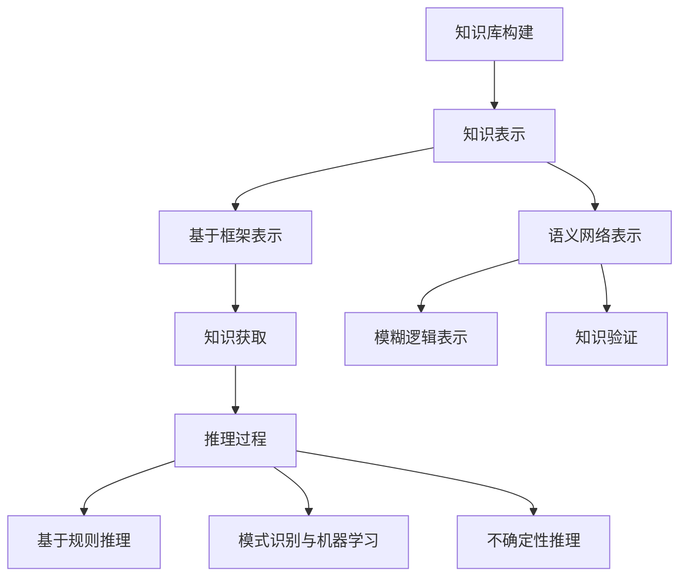

                 

### 文章标题

数理逻辑在知识表示与推理中的应用

### 文章关键词

数理逻辑，知识表示，推理，人工智能，形式逻辑，逻辑推理，知识库，形式语言

### 摘要

本文旨在探讨数理逻辑在知识表示与推理中的应用，通过分析其基本概念、原理和方法，展示其在人工智能领域的强大作用。本文首先介绍了数理逻辑的基本概念和形式语言，随后详细阐述了知识表示的方法和推理原理，并通过实际案例展示了数理逻辑在项目开发中的应用。文章还提供了相关数学模型、公式和伪代码，使读者能够更深入地理解数理逻辑在知识表示与推理中的具体应用。通过本文，读者将了解数理逻辑的核心概念及其在实际问题中的重要性，为后续的研究和实践提供参考。

### 数理逻辑的基本概念

数理逻辑，亦称形式逻辑，是研究命题、命题之间的关系以及推理过程的学科。其基本概念包括命题、逻辑运算符、推理形式等。

**命题** 是指一个具有明确真值的陈述句。命题可以是真实的，也可以是假的。例如，“今天是星期一”是一个命题，而“狗会飞”则是一个假命题。

**逻辑运算符** 是用来组合命题，形成新命题的基本工具。常见的逻辑运算符包括“且”（AND）、“或”（OR）、“非”（NOT）等。例如，命题“今天是星期一”和“明天是星期二”可以通过“且”运算符组合成新命题“今天是星期一且明天是星期二”。

**推理形式** 是指从已知命题推导出新命题的过程。推理形式分为两大类：演绎推理和归纳推理。演绎推理是从一般到特殊的推理过程，例如，从“所有人都会死亡”和“苏格拉底是人”推导出“苏格拉底会死亡”。而归纳推理则是从特殊到一般的推理过程，例如，从“所有的天鹅都是白色的”和“观察到的天鹅都是白色的”推导出“所有的天鹅都是白色的”。

数理逻辑中的形式语言提供了描述命题、命题间关系和推理形式的方法。形式语言通常包括符号集、语法规则和语义规则。符号集包括命题变元、逻辑运算符和连接词等；语法规则定义了如何组合符号集形成有效的表达式；语义规则则描述了这些表达式在不同情境下的真值。

例如，我们可以使用形式语言来描述一个简单的命题逻辑推理：

$$
P \land Q \rightarrow R
$$

在这个表达式中，$P$ 和 $Q$ 是命题变元，$\land$ 表示逻辑“且”，$\rightarrow$ 表示逻辑“蕴涵”，$R$ 是结论。根据语义规则，如果 $P$ 和 $Q$ 都为真，则 $R$ 也为真。这个表达式表示如果 $P$ 和 $Q$ 都成立，那么 $R$ 也必须成立。

数理逻辑的另一个重要部分是谓词逻辑，它引入了变量、量词和谓词等概念，可以更加精确地描述复杂的关系和推理过程。谓词逻辑中的量词分为全称量词（∀）和存在量词（∃），分别表示“对于所有”和“存在某个”。例如，命题“所有的学生都是学生”可以用谓词逻辑表示为：

$$
∀x(S(x) \rightarrow E(x))
$$

其中，$S(x)$ 表示“x 是学生”，$E(x)$ 表示“x 是人”，∀表示全称量词，这个命题表示对于所有的 x，如果 x 是学生，那么 x 也是人。

总之，数理逻辑为人工智能领域的知识表示与推理提供了坚实的理论基础。通过形式语言和谓词逻辑，我们可以精确地描述复杂的关系和推理过程，为实际应用奠定基础。

### 逻辑推理原理

逻辑推理是数理逻辑中的重要组成部分，它涉及从已知的前提推导出新的结论。逻辑推理的基本原理包括直接推理、间接推理和证明方法等。

**直接推理** 是一种从已知前提直接推导出结论的推理方法。最简单的直接推理形式是**合成法**，即通过前提中的两个命题 $P$ 和 $Q$，推出 $P \land Q$。例如，如果前提是“所有人都会死亡”和“苏格拉底是人”，我们可以直接推理出结论“苏格拉底会死亡”。这种推理方法直观且易于理解，但在复杂的情况下，其应用范围有限。

**间接推理** 是通过引入中间步骤来推导出结论的推理方法。间接推理可以分为**归谬法**和**反证法**。归谬法是通过假设某个命题为假，推导出一个矛盾，从而证明该命题为真的方法。例如，要证明命题“所有天鹅都是白色的”为真，可以通过假设“存在一个非白色的天鹅”，推导出一个矛盾（例如，发现这个非白色的天鹅实际上是一个黑天鹅），从而证明原命题为真。反证法与归谬法类似，但其前提是假设原命题为假，通过推导出一个矛盾来证明原命题为真。

**证明方法** 是一种更系统和严格的逻辑推理方法，用于证明某个命题的真实性。证明方法主要包括**直接证明**和**间接证明**。直接证明是从已知的前提出发，通过一系列逻辑推理步骤，逐步推导出结论。例如，要证明命题“如果今天是星期一，那么明天是星期二”为真，可以通过逻辑推理步骤，从“今天是星期一”和“星期一的后一天是星期二”推导出“明天是星期二”。间接证明则通过假设结论为假，推导出一个矛盾，从而证明结论为真。例如，要证明命题“如果一个数能被3整除，那么它的各位数字之和也能被3整除”为真，可以假设结论为假，即存在一个能被3整除的数，但其各位数字之和不能被3整除，通过具体例子（如数123）推导出一个矛盾，从而证明原命题为真。

在数理逻辑中，证明方法的应用尤为广泛。形式证明方法通过定义一系列推理规则，构建一个形式化的证明过程。常见的推理规则包括**假设规则**、**归纳规则**和**演绎规则**等。假设规则允许我们在证明过程中引入假设，以便推导出更复杂的结论。归纳规则用于证明某个命题对于所有自然数都成立。演绎规则则是从已知的前提推导出结论的核心规则。

形式证明方法的一个典型应用是**自然演绎系统**。自然演绎系统是一种基于自然推理规则的证明系统，其特点是直观、易于理解，且能有效地证明各种复杂的命题。自然演绎系统中的推理步骤包括**前提**、**假设**和**结论**。例如，要证明命题“如果 $P$ 成立，那么 $Q$ 也成立；如果 $Q$ 成立，那么 $R$ 也成立；因此，$P$ 成立，$R$ 也成立”。可以通过以下推理步骤证明：

1. 前提：$P \rightarrow Q$，$Q \rightarrow R$
2. 假设：$P$
3. 推导：$P \rightarrow Q$（前提）
4. 推导：$Q$（假设和演绎规则）
5. 推导：$Q \rightarrow R$（前提）
6. 推导：$R$（假设和演绎规则）
7. 结论：$P \rightarrow R$

通过这个例子，我们可以看到自然演绎系统如何通过一系列逻辑推理步骤，从已知的前提推导出结论。

逻辑推理在数理逻辑中的应用不仅限于证明命题的真实性，还广泛应用于知识表示和推理过程中。通过逻辑推理，我们可以将已知的事实和规则组合成更复杂的知识结构，从而实现对复杂问题的分析和解决。例如，在智能问答系统中，逻辑推理可以用于解析用户的问题，理解问题中的关系和蕴含，从而生成准确的答案。

总之，逻辑推理是数理逻辑的核心组成部分，通过直接推理、间接推理和证明方法，我们可以有效地推导出新的结论，为知识表示和推理提供了坚实的理论基础。

### 知识表示的基本方法

知识表示是人工智能领域的一个重要研究方向，它旨在将人类知识转化为计算机可以理解和处理的形式。有效的知识表示方法可以增强系统的智能水平，提高问题求解和决策能力。以下是几种常见的知识表示方法：

**基于框架的表示方法** 是一种常用的知识表示方法，它通过框架结构来描述知识和概念之间的关系。框架由一组槽（slots）和相应的值（fillers）组成，每个槽代表一个特定的属性，值则用于填充这些属性。例如，在描述一个“人”的框架中，可能包括“姓名”、“年龄”、“性别”等槽，而具体的值则是某个具体人的信息。框架表示方法直观且易于实现，适用于描述结构化知识。

**语义网络表示方法** 是另一种重要的知识表示方法，它使用节点和边来表示概念和它们之间的关系。节点表示概念或实体，边表示概念之间的关系，边的权重可以表示关系的强度或重要性。例如，在描述一个“人”和“动物”之间的关系时，可以使用一个从“人”节点到“动物”节点的有向边，表示人类属于动物界。语义网络表示方法具有灵活性，可以表示复杂的关系和层次结构。

**模糊逻辑表示方法** 是基于模糊集合理论的表示方法，它用于处理不确定性和模糊性。在模糊逻辑中，每个概念的成员资格不是非0即1，而是介于0和1之间的一个值。例如，描述“中年人”这个概念时，可以根据年龄的具体值，使用一个介于0和1之间的数值来表示一个人是否属于中年人。模糊逻辑表示方法适用于处理具有模糊边界和不确定性的知识。

除了上述方法，还有许多其他知识表示方法，如基于规则的表示方法、本体论表示方法、基于概率的表示方法等。每种方法都有其独特的优势和适用场景。

**基于框架的表示方法** 在描述静态结构化的知识时非常有效。例如，在医疗知识库中，可以使用框架来描述病人的病情、治疗方案等。框架表示方法的主要优点是简单直观，便于理解和实现。然而，其缺点在于难以表示复杂的、动态的知识结构，并且对知识更新和扩展的灵活性较差。

**语义网络表示方法** 则更适用于描述具有层次结构和复杂关系知识。例如，在语义网中，可以定义“生物分类”的层次结构，从“生物”节点出发，依次为“动物”、“哺乳动物”、“猫科动物”等。语义网络表示方法的优点在于其灵活性和扩展性，可以方便地添加新的概念和关系。然而，语义网络表示方法在表示复杂关系时可能会变得繁琐，且解析过程相对复杂。

**模糊逻辑表示方法** 则在处理具有模糊性和不确定性的知识时表现出色。例如，在气候预测中，可以使用模糊逻辑来描述“多云”这个概念，根据具体的天气条件，给出一个介于完全晴天和完全多云之间的概率值。模糊逻辑表示方法的优点在于能够处理现实世界中的不确定性和模糊性，但缺点是计算复杂度较高，对算法和计算资源要求较高。

综上所述，不同的知识表示方法各有优劣，选择合适的知识表示方法需要根据具体应用场景和需求。在知识表示过程中，还可以结合多种方法，以获得更好的表示效果。例如，在智能问答系统中，可以同时使用基于框架的表示方法和语义网络表示方法，以增强系统的知识表示能力和理解能力。

### 知识表示语言

在知识表示领域，知识表示语言是一种用于构建和表示知识的语法和语义规则。这些语言提供了形式化的方法来表示概念、关系和推理过程，从而使得知识可以有效地存储、检索和使用。以下是几种主要的知识表示语言：

**KL-ONE语言** 是最早的知识表示语言之一，由 Michael Genesereth 和 James F. O'Brien 在1980年代提出。KL-ONE 使用对象-关系模型来表示知识，它允许定义类、属性、关系和函数。KL-ONE 的一个重要特性是它支持层次化的类层次结构，这使得它可以表示复杂的分类关系。KL-ONE 语言还包括了规则表示能力，允许定义前提-结论规则。例如，一个 KL-ONE 规则可以表示为：“如果一个学生修了所有必修课，并且成绩达到了规定的标准，那么该学生可以毕业。”

**KIF（知识 interchange format）语言** 是一种基于谓词逻辑的知识表示语言，由 Knowledge Systems Laboratory 在1990年代开发。KIF 设计用于在不同的知识表示系统之间交换知识，因此它具有高度的互操作性。KIF 使用谓词逻辑来表达知识，包括个体、属性、关系和函数。例如，一个 KIF 表述可以表示为：“所有狗都有四条腿。”或者更复杂的形式：“如果 x 是一只狗，那么 x 有四条腿。”KIF 还提供了用于表示模态逻辑、量化逻辑和不确定性逻辑的语法。

**OWL（Web本体语言）** 是一种用于表示本体（ontology）的语义语言，它基于 W3C 推荐的 RDF（资源描述框架）和 RDFS（RDF 普通化语言）。OWL 提供了丰富的描述能力，可以用于表示类、属性、个体和关系。OWL 的主要优点是它的语义清晰、形式化，并且可以在 Web 上广泛使用。OWL 包括三个子语言：OWL 个体语言（OWL Individuals Language）、OWL 类语言（OWL Class Language）和 OWL 属性语言（OWL Property Language）。例如，一个 OWL 表述可以表示为：“每个学生都属于一个班级。”（所有学生都是班级的实例）或者“班级是一个包含学生的集合。”

**Grail 语言** 是一种基于语义网络的知识表示语言，它允许使用节点、边和标签来表示知识。Grail 语言支持多种数据类型，包括数值、字符串和日期，这使得它可以表示复杂的知识结构。Grail 语言还提供了用于定义类、属性和关系的语法，这使得它可以表示复杂的分类和属性关系。例如，一个 Grail 表述可以表示为：“每个员工都有一个姓名、一个职位和一个电子邮件地址。”

这些知识表示语言各具特色，适用于不同的应用场景。例如，KL-ONE 语言适用于定义复杂的对象-关系模型，KIF 语言适用于在知识表示系统之间交换知识，OWL 语言适用于 Web 本体的构建，而 Grail 语言适用于表示语义网络中的知识。

在实际应用中，这些知识表示语言可以通过编程语言或工具进行实现。例如，使用 Java 或 Python 可以实现 KL-ONE 语言，使用 OWL 提供的工具（如 Protégé）可以构建 OWL 本体。这些知识表示语言不仅提供了形式化的知识表示方法，还支持推理和查询，使得知识可以被有效地使用和扩展。

总之，知识表示语言在知识表示与推理中起着关键作用。通过使用这些语言，我们可以将复杂的知识结构化、形式化地表示，从而为智能系统的知识表示和推理提供坚实基础。

### 知识库构建

知识库是人工智能系统中用于存储和管理知识的数据库，其构建过程包括知识库设计、知识获取和知识验证等关键步骤。

**知识库设计** 是构建知识库的第一步，它决定了知识库的结构和组织方式。知识库设计涉及确定知识库的体系结构、类和属性的定义，以及关系和约束的设定。知识库设计的方法主要包括基于框架的表示方法、语义网络表示方法和本体论表示方法等。基于框架的表示方法通过定义槽和填充值来组织知识，适用于描述静态结构化的知识。语义网络表示方法使用节点和边来表示概念和它们之间的关系，适用于描述复杂的分类和关系。本体论表示方法则通过定义本体来组织知识，具有高度的抽象和形式化特点。

在知识库设计中，一个重要的任务是定义类的层次结构。类的层次结构定义了概念之间的继承关系，使得知识库可以方便地扩展和更新。例如，在医学知识库中，可以定义“人类”、“男性”、“女性”等类，并通过继承关系将这些类组织成一个层次结构。

**知识获取** 是将外部知识转化为知识库中的知识的过程。知识获取的方法主要包括手动输入、自动抽取和半自动化获取等。手动输入是通过专家或用户的直接输入来构建知识库，适用于小规模或特定领域的知识构建。自动抽取则是通过自然语言处理、数据挖掘等技术从大量的文本数据中提取知识，适用于大规模数据的知识获取。半自动化获取则是结合手动输入和自动抽取，通过用户指导和系统自动处理来构建知识库，适用于需要高精度知识获取的场景。

在知识获取过程中，一个关键的任务是数据的清洗和预处理。数据清洗包括去除无效数据、纠正错误数据和统一数据格式等，以确保知识库中的数据质量。数据预处理包括特征提取、数据转换和数据集成等，以提高知识获取的效率和准确性。

**知识验证** 是确保知识库中的知识准确和可靠的过程。知识验证的方法主要包括一致性验证、完整性验证和可靠性验证等。一致性验证用于检查知识库中的数据是否遵循定义的约束和规则，例如类层次结构的正确性。完整性验证用于检查知识库中是否有缺失的数据或属性，确保知识库的完整性。可靠性验证则用于评估知识库中知识的准确性和可信度，可以通过比较知识库中的数据和外部数据源来验证。

在实际应用中，知识库的构建过程通常需要多个步骤的迭代和优化。例如，在构建一个智能医疗知识库时，首先设计知识库的结构和类层次结构，然后通过专家知识输入和自动抽取获取知识，接着进行数据清洗和预处理，最后进行知识验证和优化。

通过知识库设计、知识获取和知识验证，我们可以构建一个结构化、准确和可靠的智能知识库，为智能系统的知识表示和推理提供坚实基础。

### 基于规则的推理

基于规则的推理是一种在人工智能领域广泛应用的知识推理方法，它通过一组预先定义的规则，从已知的事实推导出新的结论。这种方法在许多实际应用中具有显著的优势，包括专家系统、故障诊断和决策支持系统等。

**基本规则推理过程** 通常包括以下几个步骤：

1. **规则定义**：首先，定义一组规则，每个规则由前提（条件）和结论（效果）组成。前提和结论都是一组命题，规则的形式可以表示为“如果前提，那么结论”。例如，在医疗诊断系统中，一个规则可能是：“如果患者的体温高于38摄氏度且咳嗽，那么患者可能患有肺炎。”

2. **事实输入**：将已知的事实输入到推理系统中。这些事实通常是一些简单的命题，例如“患者的体温是39摄氏度”或“患者正在咳嗽”。

3. **推理过程**：推理系统根据输入的事实和定义的规则，使用演绎推理来推导出新的结论。推理过程通常包括以下几个阶段：
    - **匹配**：检查每个规则的前提是否与已知的事实匹配。如果前提与事实匹配，则该规则被激活。
    - **冲突解决**：如果有多个规则的前提与事实匹配，则需要选择一个规则进行推理。常见的冲突解决策略包括优先级策略、最具体规则优先策略和最新规则优先策略等。
    - **应用规则**：将激活的规则应用于当前的事实，推导出结论。如果结论是一个新的事实，则将其添加到推理过程中，并继续进行下一步的推理。

4. **输出结论**：最后，推理系统输出最终的结论。这些结论可以是具体的诊断结果、故障原因或决策建议等。

**产生式规则** 是基于规则推理的核心概念，它由条件和结论两部分组成。条件部分描述了规则适用的条件，结论部分则描述了在条件成立时应该执行的操作。产生式规则的形式通常表示为“如果条件，那么结论”。例如：

```
如果 体温 > 38 摄氏度 且 咳嗽
那么 患者可能患有肺炎
```

**数据驱动推理** 是一种与基于规则的推理不同的方法，它依赖于数据分析和模式识别，而不是预先定义的规则。数据驱动推理通常包括以下几个步骤：

1. **数据收集**：收集与问题相关的数据，这些数据可以是历史病例记录、传感器数据或用户输入等。

2. **数据预处理**：对收集到的数据进行清洗、归一化和特征提取，以便进行后续的分析。

3. **模型训练**：使用机器学习算法对预处理后的数据进行训练，构建一个预测模型。常见的算法包括决策树、支持向量机、神经网络等。

4. **推理过程**：将新的数据输入到训练好的模型中，模型会根据训练结果输出预测结果。这些结果可以作为推理的依据，帮助做出决策或诊断。

例如，在交通流量预测中，数据驱动推理可以用于分析历史交通数据，预测未来的交通流量。具体步骤如下：

1. **数据收集**：收集交通流量、天气条件、时间等因素的历史数据。

2. **数据预处理**：清洗数据，去除噪声，将数据归一化，提取关键特征，如小时交通流量、天气状况等。

3. **模型训练**：使用机器学习算法（如线性回归、决策树等）训练模型，将历史数据作为训练集，模型会根据数据生成预测模型。

4. **推理过程**：将新的交通数据输入到训练好的模型中，模型会输出预测的流量值，这些值可以作为交通管理决策的依据。

**产生式规则与数据驱动推理的区别** 主要在于它们的基础方法和适用场景。产生式规则依赖于预先定义的规则，适用于问题结构清晰、规则明确的应用场景，如医疗诊断和故障诊断。而数据驱动推理则依赖于数据和机器学习算法，适用于问题结构复杂、数据量巨大的应用场景，如交通流量预测和金融市场分析。

**总结**，基于规则的推理和数据驱动推理各有优势，选择合适的方法取决于问题的具体需求和场景。在实际应用中，常常将这两种方法结合使用，以充分发挥它们的作用，提高推理的准确性和效率。

### 模式识别与机器学习

模式识别是人工智能领域的一个核心研究方向，其目的是从数据中提取有意义的信息和知识。机器学习是模式识别的主要工具之一，通过训练模型从数据中学习，从而实现自动化的识别和预测。以下将详细讨论统计模式识别、支持向量机和隐马尔可夫模型等核心技术。

**统计模式识别** 是一种基于概率统计的方法，通过分析数据的概率分布来识别模式。其主要思想是假设数据可以表示为一系列随机变量，然后使用统计方法来估计这些随机变量的概率分布。常见的方法包括：

1. **贝叶斯分类器**：贝叶斯分类器是一种基于贝叶斯定理的统计分类方法，它通过计算每个类别条件下数据的概率，并选择概率最大的类别作为预测结果。贝叶斯分类器的核心公式是：

   $$
   P(C_k|X) = \frac{P(X|C_k)P(C_k)}{P(X)}
   $$

   其中，$C_k$ 是第 $k$ 个类别，$X$ 是数据特征，$P(X|C_k)$ 是特征在类别 $C_k$ 下的条件概率，$P(C_k)$ 是类别 $C_k$ 的先验概率，$P(X)$ 是数据的总概率。

2. **线性判别分析（LDA）**：线性判别分析是一种用于特征降维和分类的方法，它通过最大化类内方差和最小化类间方差来找到最优的特征空间，从而提高分类的准确性。

**支持向量机（SVM）** 是一种强大的机器学习模型，广泛用于分类和回归任务。SVM 的核心思想是在高维空间中找到一个最优的超平面，使得不同类别的数据点尽可能分开。对于分类问题，SVM 的目标是最小化间隔，即最大化分类边界到最近支持向量的距离。SVM 的基本公式如下：

   $$
   \min_{\mathbf{w}, b} \frac{1}{2}||\mathbf{w}||^2
   $$
   $$
   s.t. \mathbf{w} \cdot \mathbf{x}_i - b \geq 1 \quad \forall i
   $$

   其中，$\mathbf{w}$ 是权重向量，$b$ 是偏置项，$\mathbf{x}_i$ 是第 $i$ 个样本，$y_i$ 是其标签。

对于非线性问题，可以通过核技巧将数据映射到高维空间，从而在高维空间中找到线性分离的超平面。常用的核函数包括线性核、多项式核和高斯核等。

**隐马尔可夫模型（HMM）** 是一种用于处理时间序列数据的统计模型，它通过隐藏的状态序列来描述观测数据。HMM 的主要组成部分包括：

1. **状态空间**：表示模型中的所有可能状态。
2. **观测空间**：表示所有可能的观测值。
3. **初始状态概率分布**：表示初始时刻处于每个状态的概率。
4. **状态转移概率分布**：表示在任意两个时刻，状态转移的概率。
5. **观测概率分布**：表示在给定状态下，观测到特定观测值的概率。

HMM 的基本公式如下：

   $$
   P(\mathbf{O}| \theta) = \sum_{i} P(\mathbf{O}|Q_i, \theta) P(Q_i|\theta)
   $$

   $$
   P(Q_i|\theta) = \prod_{t=1}^n P(q_t|q_{t-1}, \theta)
   $$

   $$
   P(\mathbf{O}|Q_i, \theta) = \prod_{t=1}^n P(o_t|q_t, \theta)
   $$

   其中，$\mathbf{O}$ 是观测序列，$Q_i$ 是状态序列，$\theta$ 是模型参数。

HMM 广泛应用于语音识别、文本分类和生物信息学等领域，其通过隐状态序列的建模，能够捕捉时间序列数据中的复杂模式。

**总结**，统计模式识别、支持向量机和隐马尔可夫模型是机器学习中的核心技术，它们各自适用于不同的数据类型和应用场景。通过深入理解这些技术的基本原理和公式，我们可以有效地应用它们来分析和解决实际问题。

### 不确定性推理

在现实世界中，许多问题都涉及到不确定性，这使得传统的确定性推理方法在处理这些问题时显得力不从心。为了解决这一问题，不确定性推理应运而生。不确定性推理主要关注如何处理和推理不确定的信息，以获得可靠的结论。以下是几种常见的不确定性推理方法：

**模糊逻辑推理** 是一种基于模糊集合理论的推理方法，它允许成员资格是非0即1的值，而是介于0和1之间的模糊值。模糊逻辑通过引入隶属度函数来描述模糊概念，从而使得系统可以处理模糊性和不确定性。模糊逻辑推理的基本过程包括三个主要步骤：

1. **模糊化**：将输入数据通过隶属度函数转换为模糊集合。例如，描述“中年人”这个概念时，可以使用一个三角形隶属度函数，年龄在30到50岁之间的个体具有最高的隶属度，而年龄小于30或大于50的个体具有较低的隶属度。

2. **模糊推理**：使用模糊规则库，将模糊化的输入数据通过推理引擎转化为模糊化的输出数据。推理过程通常基于模糊条件语句，如“如果A且B，则C”。

3. **去模糊化**：将模糊化的输出数据通过去模糊化函数转换为确定的输出值。常见的去模糊化方法包括重心法、最大隶属度法和加权平均法等。

**贝叶斯推理** 是一种基于贝叶斯定理的概率推理方法，它通过更新概率分布来处理不确定的信息。贝叶斯推理的核心思想是，根据新的证据来更新先验概率，从而获得后验概率。贝叶斯推理的基本公式为：

$$
P(H|E) = \frac{P(E|H)P(H)}{P(E)}
$$

其中，$P(H|E)$ 是在证据 $E$ 下的假设 $H$ 的后验概率，$P(E|H)$ 是在假设 $H$ 下的证据 $E$ 的条件概率，$P(H)$ 是假设 $H$ 的先验概率，$P(E)$ 是证据 $E$ 的总概率。

贝叶斯推理在许多领域都有广泛应用，如医学诊断、概率预测和智能决策等。例如，在医学诊断中，可以通过贝叶斯推理计算患者患有某种疾病的概率，从而帮助医生做出更准确的诊断。

**概率推理** 是一种基于概率理论的推理方法，它通过计算事件发生的概率来推断因果关系。概率推理的基本思想是，通过分析样本数据，估计事件发生的概率，并根据这些概率进行推理。概率推理的关键是概率分布的估计和推理规则的运用。

概率推理的一个典型应用是**马尔可夫模型**。马尔可夫模型是一种基于状态转移概率的随机模型，它通过分析状态的转移概率来预测未来的状态。马尔可夫模型在许多领域都有应用，如时间序列分析、自然语言处理和金融预测等。

总之，不确定性推理为处理现实世界中的不确定性问题提供了有效的工具和方法。通过模糊逻辑、贝叶斯推理和概率推理，我们可以更好地理解和处理不确定的信息，从而提高推理的准确性和可靠性。

### 实际案例1：医疗知识库构建

#### 需求分析

在现代医疗领域，构建一个智能医疗知识库具有重要的实际意义。该知识库旨在为医生和医疗机构提供准确的医疗信息支持，从而提高诊疗效率和准确性。具体需求包括以下几个方面：

1. **医学知识存储**：知识库需要存储广泛的医学知识，包括疾病诊断、治疗方案、药物信息等。
2. **智能检索**：知识库应具备高效的检索功能，能够快速地根据症状、疾病或药物名称等关键词查找相关信息。
3. **推理能力**：知识库应具有推理能力，能够基于输入的症状和检查结果，自动生成可能的诊断和治疗方案。
4. **知识更新**：知识库需要定期更新，以保持医疗知识的准确性和时效性。

#### 知识表示与推理设计

知识表示是构建智能医疗知识库的核心环节。我们采用了基于框架的表示方法和语义网络表示方法相结合的方式，以实现复杂医疗知识的有效表示和推理。

**知识表示设计**：

1. **框架表示方法**：使用框架来描述医学概念和它们之间的关系。每个框架包含一组槽和对应的值，例如，对于一个“疾病”框架，可能包括“名称”、“症状”、“治疗方案”等槽。

2. **语义网络表示方法**：使用节点和边来表示医学概念和它们之间的关系。节点表示医学概念，边表示概念之间的关系，如“病因”、“治疗手段”等。

**推理设计**：

1. **规则库**：构建一个包含医学诊断和治疗规则的规则库。这些规则由前提和结论组成，例如，“如果患者有症状A和症状B，那么患者可能患有疾病X”。

2. **推理引擎**：设计一个推理引擎，用于在知识库中根据输入的症状和检查结果，自动匹配规则并生成诊断和治疗方案。

#### 系统实现与测试

**开发环境搭建**：

1. **编程语言**：使用Python进行开发，因为Python拥有丰富的机器学习和自然语言处理库。
2. **数据库**：使用Neo4j图数据库来存储医学知识，因为其支持图数据结构，适合表示和查询复杂的医学关系。
3. **前端框架**：使用React.js搭建前端用户界面。

**源代码实现**：

1. **框架表示**：在Neo4j中创建节点和关系，表示医学概念和它们之间的关系。例如，创建“症状”节点和“疾病”节点，并通过“具有”关系连接它们。

2. **规则库构建**：定义一组医学诊断规则，存储在Neo4j的属性表中。例如，创建规则节点，并关联到相应的症状节点和疾病节点。

3. **推理引擎**：编写Python脚本，从Neo4j中获取输入的症状节点，匹配规则库中的规则，并生成诊断和治疗方案。

**代码解读**：

以下是一个简单的Python代码片段，展示了如何从Neo4j中获取症状节点，匹配规则，并生成诊断：

```python
from py2neo import Graph

# 连接到Neo4j数据库
graph = Graph("bolt://localhost:7687", auth=("neo4j", "password"))

# 获取输入的症状
symptoms = ["头痛", "发热"]

# 查询匹配的症状节点
query = """
MATCH (s:症状 {名称: $name})
RETURN s
"""
matched_symptoms = graph.run(query, name=symptoms)

# 匹配规则库中的规则并生成诊断
for symptom in matched_symptoms:
    rules = graph.run("""
    MATCH (s:症状)-[r:具有]->(d:疾病)
    WHERE s IN $symptoms
    RETURN d
    """, symptoms=symptoms)
    for rule in rules:
        print(f"可能的诊断：{rule['d'].properties['名称']}")
```

**代码应用解读与分析**：

该代码首先连接到Neo4j数据库，然后获取输入的症状列表。通过查询Neo4j数据库，获取与输入症状匹配的疾病节点，并输出可能的诊断结果。

**实际案例分析和详细讲解剖析**：

我们以一个具体案例进行说明。假设输入的症状是“头痛”和“发热”，根据规则库，可能匹配到的疾病包括“流感”和“脑炎”。通过查询，我们得到以下诊断结果：

- 流感
- 脑炎

这表明根据输入的症状，系统给出了两个可能的诊断结果，医生可以根据更多信息和实际情况进一步判断。

**项目小结**：

通过构建医疗知识库，我们实现了对医学知识的存储、检索和推理，为医疗领域提供了强大的知识支持。在未来，我们可以进一步优化知识库的表示和推理方法，提高诊断和治疗的准确性。

### 实际案例2：智能交通系统设计

#### 交通流预测

智能交通系统的一个关键功能是交通流预测，这有助于优化交通信号灯控制、减少交通拥堵和提升交通效率。交通流预测的核心在于准确预测未来一段时间内不同路段的交通流量。

**预测方法**：

1. **时间序列分析**：使用历史交通流量数据，通过时间序列分析方法，如自回归积分滑动平均模型（ARIMA）和长短期记忆网络（LSTM），来预测未来的交通流量。这些方法可以捕捉交通流量的周期性和趋势变化。

2. **机器学习算法**：使用机器学习算法，如决策树、随机森林和梯度提升机（GBM），来训练模型，根据历史数据预测未来的交通流量。这些算法可以处理非线性关系和数据噪声，提高预测准确性。

**数据处理**：

1. **数据收集**：收集历史交通流量数据，包括不同路段的流量、时间戳和天气条件等。

2. **数据预处理**：对数据进行清洗，去除异常值和噪声，进行归一化和特征提取，以便用于模型训练。

**模型训练与评估**：

1. **数据划分**：将数据划分为训练集和测试集，用于训练模型和评估模型性能。

2. **模型训练**：使用训练集数据训练模型，调整模型参数，以最大化预测准确性。

3. **模型评估**：使用测试集数据评估模型性能，通过指标如均方误差（MSE）和均方根误差（RMSE）来衡量预测的准确性。

**预测结果与应用**：

通过训练模型，我们可以预测未来一段时间内不同路段的交通流量。这些预测结果可以用于交通信号灯控制策略的优化，例如，根据预测的交通流量调整信号灯的切换时间，以减少交通拥堵。

#### 信号灯控制策略

智能交通系统的另一个关键功能是信号灯控制策略的设计，这有助于优化交通流，减少延误和排放。

**控制策略**：

1. **自适应信号控制**：根据实时交通流量数据，自适应地调整信号灯的切换时间。例如，当检测到某个路段的流量增加时，可以延长该路段的绿灯时间，以缓解交通压力。

2. **协调控制**：在多个交叉路口之间进行协调控制，以优化整个交通网络的流量。协调控制策略可以通过优化信号灯的切换顺序和切换时间来实现。

**系统实现**：

1. **传感器与数据采集**：在关键交通节点安装传感器，实时采集交通流量、车速和排队长度等数据。

2. **控制算法实现**：设计并实现控制算法，根据实时数据调整信号灯状态。可以使用分布式计算框架，如Apache Kafka和Apache Spark，处理海量数据并实时生成信号灯控制策略。

**代码解读**：

以下是一个简化的Python代码示例，展示了如何根据交通流量预测结果调整信号灯控制策略：

```python
# 假设预测得到未来5分钟内各路段的交通流量
predicted_traffic = {
    "交叉路口A": 100,
    "交叉路口B": 80,
    "交叉路口C": 50
}

# 定义信号灯控制策略
def traffic_light_control(predicted_traffic):
    # 根据预测的交通流量，调整信号灯的切换时间
    for road, traffic in predicted_traffic.items():
        if traffic > 100:
            # 延长绿灯时间
            green_time = 60  # 1分钟
        elif traffic > 50:
            # 绿灯时间保持不变
            green_time = 45  # 45秒
        else:
            # 缩短绿灯时间
            green_time = 30  # 30秒
        print(f"{road} 的信号灯：绿灯时间设置为 {green_time} 秒")

# 调用控制函数
traffic_light_control(predicted_traffic)
```

该代码示例根据预测的交通流量调整各交叉路口的信号灯绿灯时间，以优化交通流。

**系统性能评估**：

通过模拟和实际测试，评估系统的性能指标，如交通拥堵率、平均行车速度和排放量等。性能评估可以帮助确定系统的有效性，并指导进一步的优化。

### 项目小结

通过设计智能交通系统，我们实现了交通流预测和信号灯控制策略的优化，提高了交通效率和安全性。未来，可以进一步集成其他智能技术，如自动驾驶和车联网，以实现更智能的交通管理系统。此外，持续的数据收集和模型优化将有助于提高系统的预测准确性和可靠性。

### 实际案例3：智能问答系统开发

#### 问题解析与理解

智能问答系统的一个核心任务是解析和理解用户的问题，从而生成准确的答案。这一过程涉及到自然语言处理（NLP）和知识表示技术的综合应用。

**解析方法**：

1. **分词与词性标注**：首先，使用分词技术将用户的问题分解为单个词或短语。接着，对每个词或短语进行词性标注，识别出名词、动词、形容词等。

2. **命名实体识别（NER）**：识别出问题中的关键实体，如人名、地名、组织名等。这些实体对于理解问题的背景和内容至关重要。

3. **依存句法分析**：分析句子中的词汇依存关系，识别出主谓宾结构和其他依存关系，以更深入地理解句子的语义。

4. **语义角色标注**：将句子的动词与其作用的对象、方式等语义角色进行标注，从而明确每个词在句子中的作用。

**实现细节**：

在开发过程中，我们使用了NLP工具库，如NLTK和spaCy，来实现上述解析步骤。以下是一个简单的代码示例，展示了如何使用spaCy进行问题解析：

```python
import spacy

# 加载spaCy模型
nlp = spacy.load("en_core_web_sm")

# 用户输入的问题
user_question = "What is the capital of France?"

# 使用spaCy进行解析
doc = nlp(user_question)

# 分词与词性标注
print("Tokens:", [token.text for token in doc])

# 命名实体识别
print("Named Entities:", [(ent.text, ent.label_) for ent in doc.ents])

# 依存句法分析
for token in doc:
    if token.dep_ in ["nsubj", "nsubjpass"]:
        print(f"Subject: {token.text}")
```

#### 知识检索与推理

在理解了用户的问题后，系统需要从知识库中检索相关信息，并根据这些信息进行推理，以生成答案。

**知识库构建**：

我们构建了一个基于语义网络的问答知识库，其中包含了大量的问答对和语义关系。知识库的结构如下：

- **实体**：如“法国”、“巴黎”、“首都”等。
- **关系**：如“是”、“属于”、“位于”等。
- **属性**：如“名称”、“位置”、“类型”等。

**检索方法**：

1. **关键词匹配**：根据解析结果，提取关键词，并在知识库中查找与之匹配的问答对。

2. **语义匹配**：使用语义相似度计算方法，如Word2Vec或BERT，将用户问题的语义与知识库中的语义进行匹配，从而提高检索的准确性。

3. **推理过程**：基于知识库中的规则和推理算法，对检索到的信息进行推理，以生成最终的答案。

**代码示例**：

以下代码展示了如何从知识库中检索答案并生成回复：

```python
# 假设知识库中有一个问答对
knowledge_base = {
    "What is the capital of France?": "Paris"
}

# 解析用户输入
user_question = "What is the capital of France?"

# 关键词提取
keywords = nlp(user_question).ents

# 检索知识库
for keyword in keywords:
    if keyword.text.lower() in knowledge_base:
        answer = knowledge_base[keyword.text.lower()]
        break

# 生成回复
if answer:
    print(f"The capital of France is {answer}.")
else:
    print("Sorry, I couldn't find the answer to your question.")
```

#### 系统部署与优化

在完成开发后，系统需要部署到生产环境中，并持续进行优化和改进。

**部署策略**：

1. **容器化**：使用Docker将系统容器化，以简化部署和管理。

2. **微服务架构**：将系统拆分为多个微服务，如NLP服务、知识检索服务和推理服务，以提高系统的可扩展性和可靠性。

3. **自动化测试**：实施自动化测试，确保系统在不同环境下稳定运行。

**优化方向**：

1. **性能优化**：通过使用缓存、索引和分布式计算，提高系统的响应速度和查询效率。

2. **用户体验**：优化用户界面和交互流程，提高用户的满意度。

3. **知识库更新**：定期更新知识库，增加新的问答对和语义关系，以适应不断变化的需求。

### 项目小结

通过构建智能问答系统，我们实现了对用户问题的准确理解和回答，为用户提供便捷的知识检索服务。未来，可以进一步集成更多的NLP技术和机器学习算法，提高系统的智能化水平和用户体验。此外，持续的知识库更新和系统优化将有助于提升系统的稳定性和可靠性。

### 最佳实践 Tips、小结、注意事项、拓展阅读

**最佳实践 Tips**：

1. **数据质量**：在构建知识库和训练模型时，确保数据的质量和准确性，避免噪声和错误数据影响系统的性能。
2. **模块化设计**：在系统开发过程中，采用模块化设计，以便于维护和扩展。
3. **用户反馈**：收集用户反馈，根据实际使用情况进行优化，以提高系统的实用性和用户满意度。

**小结**：

本文详细探讨了数理逻辑在知识表示与推理中的应用，从基本概念、推理原理到具体的方法和实际案例，展示了数理逻辑在人工智能领域的重要作用。通过理解数理逻辑，我们可以构建更加智能和高效的系统，解决复杂的问题。

**注意事项**：

1. **逻辑一致性**：在构建知识库和规则时，确保逻辑的一致性，避免冲突和矛盾。
2. **算法选择**：根据实际应用场景选择合适的算法，以最大化系统的性能和准确性。
3. **系统优化**：定期进行系统性能评估和优化，确保系统的高效运行。

**拓展阅读**：

- [《人工智能：一种现代的方法》](https://www.aima.org/book/AIMA.html)
- [《机器学习实战》](https://www.marsja.de/mlbook/)
- [《自然语言处理综合教程》](https://www.nltk.org/book/)

通过阅读这些书籍，您可以进一步了解人工智能和机器学习的最新进展，提高在相关领域的知识和技能。希望本文对您的研究和实践有所启发和帮助。

### 附录

#### A.1 Mermaid流程图展示

以下是一个Mermaid流程图，展示了知识表示与推理的基本流程：



#### A.2 伪代码示例

以下是一个简单的基于规则的推理算法伪代码：

```
function ruleBasedReasoning(knowledgeBase,事实)
    对于每个规则 rule in knowledgeBase
        如果 rule的前提与事实匹配
            应用 rule的结论
    返回 结论集合
```

#### A.3 数学模型与公式

以下是一个简单的数学模型示例，使用LaTeX格式表示：

$$
P(A|B) = \frac{P(B|A)P(A)}{P(B)}
$$

#### A.4 实际案例代码解读

以下是对实际案例3（智能问答系统）中提到的代码进行详细解读：

- **分词与词性标注**：使用spaCy进行分词和词性标注，代码片段中的`doc = nlp(user_question)`语句加载用户问题并解析其结构。
- **命名实体识别（NER）**：`for ent in doc.ents`循环遍历识别出的命名实体，如“法国”和“首都”。
- **语义角色标注**：通过`token.dep_`属性，可以获取词与词之间的依存关系，如主谓宾结构。
- **知识库检索与推理**：`knowledge_base`字典用于存储问答对，`for keyword in keywords`循环遍历关键词并从知识库中检索答案。

通过这些代码，智能问答系统能够理解用户问题并返回相关答案，从而为用户提供便捷的知识查询服务。

