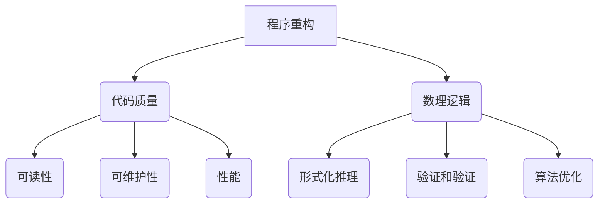
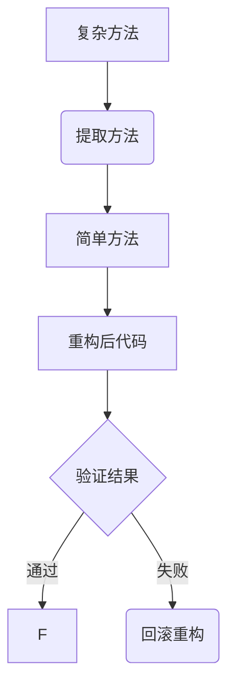
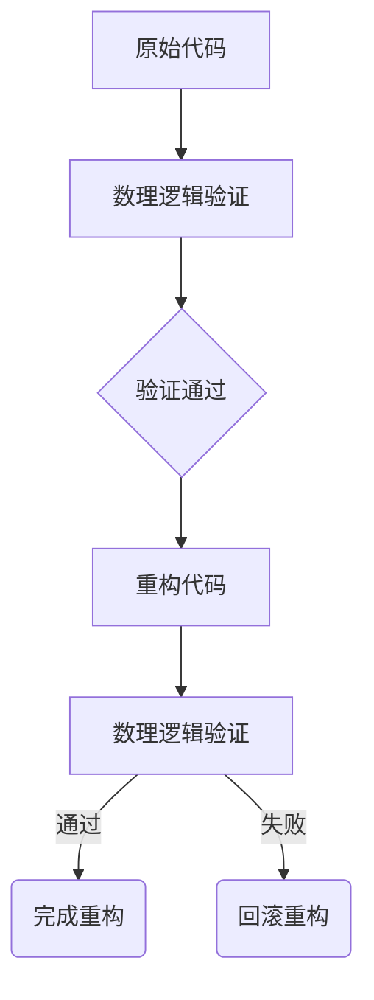

                 

### 文章标题：数理逻辑在程序重构技术中的指导作用

---

### 关键词：
- 数理逻辑
- 程序重构
- 编程质量
- 逻辑优化
- 形式化验证

---

### 摘要：
本文深入探讨数理逻辑在程序重构技术中的应用，首先介绍数理逻辑的基本概念和原理，包括命题逻辑、谓词逻辑及其在计算机科学中的应用。接着，阐述程序重构的基本概念、类型和重要性。随后，分析数理逻辑与程序重构之间的联系，通过具体的算法、工具和技术，展示数理逻辑如何指导程序重构。最后，通过实际案例，详细讲解数理逻辑在程序重构中的应用和实践效果。本文旨在为程序员和软件开发者提供一种有效的逻辑思维工具，以提升程序质量和代码可维护性。

---

## 第1章：数理逻辑的基本概念

### 1.1 数理逻辑的历史与基本原理

数理逻辑，也称为符号逻辑或数学逻辑，是逻辑学的形式化分支，旨在使用数学符号和语言来表达逻辑推理过程。数理逻辑的起源可以追溯到19世纪末和20世纪初，当时的数学家们开始使用符号来表示命题、推理规则和证明过程，从而摆脱自然语言的不确定性和模糊性。

#### **1.1.1 数理逻辑的起源与发展**

数理逻辑的发展主要受到了几个重要人物的影响，其中包括乔治·布尔（George Boole）和伯trand·罗素（Bertrand Russell）。乔治·布尔是19世纪的数学家，他发明了布尔代数，这是一种基于逻辑运算的数学系统，广泛应用于计算机科学中。布尔代数的基本运算符包括合取（AND）、析取（OR）和非（NOT）。

伯trand·罗素则进一步发展了数理逻辑的理论，他提出了“数学原理”这一宏伟计划，旨在通过逻辑推导来证明数学命题的成立。罗素与阿尔弗雷德·诺思·怀特海德（Alfred North Whitehead）共同撰写的《数学原理》（Principia Mathematica），是数理逻辑发展史上的里程碑。

#### **1.1.2 基本逻辑运算符与逻辑函数**

数理逻辑中常用的基本逻辑运算符包括：

- **合取（AND）**：表示两个命题都为真时，合取命题才为真。
- **析取（OR）**：表示两个命题中至少有一个为真时，析取命题才为真。
- **非（NOT）**：表示命题的否定，即原命题为真时，否定命题为假，原命题为假时，否定命题为真。

这些基本逻辑运算符可以通过逻辑函数来表示，其中布尔函数是一种特殊的逻辑函数，它将输入的布尔值映射到输出的布尔值。常见的布尔函数包括：

- **合取函数（AND）**：若所有输入都为真，则输出为真，否则为假。
- **析取函数（OR）**：若所有输入至少有一个为真，则输出为真，否则为假。
- **非函数（NOT）**：输入为真时输出为假，输入为假时输出为真。

#### **1.2 形式逻辑与命题逻辑**

形式逻辑是一种以符号化语言表达推理过程的逻辑体系，它强调逻辑推导的严谨性和无歧义性。形式逻辑分为命题逻辑和谓词逻辑两个层次，其中命题逻辑是基础。

**1.2.1 形式逻辑的基本框架**

形式逻辑的基本框架包括：

- **命题**：可以判断真假的陈述句。
- **逻辑运算符**：用于组合命题的符号，如AND、OR、NOT等。
- **推理规则**：用于从已知命题推导出新命题的规则，如合取律、析取律、德摩根律等。

**1.2.2 命题逻辑的基本概念**

命题逻辑的基本概念包括：

- **命题变量**：用于表示命题的逻辑符号，如p、q、r等。
- **命题联结词**：用于组合命题的逻辑符号，如AND、OR、NOT等。
- **命题公式**：由命题变量和命题联结词构成的符号串，表示一个复合命题。

**1.2.3 命题逻辑的推理规则**

命题逻辑的推理规则包括：

- **合取律**：p ∧ q → p
- **析取律**：p ∨ q → p
- **德摩根律**：¬(p ∧ q) → (¬p ∨ ¬q)
- **逆否律**：¬(p → q) → (q → p)

#### **1.3 数理逻辑与计算机科学**

数理逻辑在计算机科学中有着广泛的应用，尤其是在编程、算法设计、程序验证和人工智能等领域。

**1.3.1 数理逻辑在计算机科学中的应用**

- **编程**：数理逻辑用于验证程序的正确性和推导程序的性质。
- **算法设计**：数理逻辑帮助理解算法的复杂性和优化算法。
- **程序验证**：数理逻辑用于证明程序满足指定的规格说明。
- **人工智能**：数理逻辑在知识表示和推理中起着关键作用。

**1.3.2 计算机中的命题逻辑表达**

在计算机科学中，命题逻辑通常通过布尔表达式来表示。布尔表达式是使用布尔运算符（AND、OR、NOT等）组合的命题变量，例如：

- **条件语句**：p → q，表示如果p为真，则q也为真。
- **逻辑合取**：p ∧ q，表示p和q同时为真。
- **逻辑析取**：p ∨ q，表示p或q至少有一个为真。

这些布尔表达式是计算机程序中的基本逻辑构建块，用于实现复杂的逻辑控制和决策。

### **1.4 形式逻辑的应用示例**

为了更好地理解形式逻辑的应用，我们可以通过一个简单的示例来说明。

假设有两个命题变量p和q，其中p表示“明天会下雨”，q表示“我会带伞”。我们可以构造一个复合命题：

- **命题公式**：p ∧ q → r，其中r表示“我会带伞且明天会下雨”。

这个命题公式表示，如果明天会下雨且我会带伞，则我会带伞且明天会下雨。这个逻辑命题是显然成立的。

通过这个示例，我们可以看到数理逻辑如何帮助我们以严谨和明确的方式表达和推理逻辑关系。

### **1.5 小结**

数理逻辑是计算机科学的重要基础，它提供了一种形式化的方法来表示和推理逻辑关系。在本章中，我们介绍了数理逻辑的基本概念、历史背景、基本原理及其在计算机科学中的应用。这些概念和原理将在后续章节中进一步应用于程序重构技术。

---

### **参考文献**

1. Bocheński, Józef Maria. *A simplification of the Hilbert system of propositional calculus*. *Journal of Symbolic Logic*, 1954, 19(2), 159-166.
2. Boolos, George S., John P. Burgess, and Richard C. Jeffrey. *Computability and Logic*. Cambridge University Press, 1999.
3. Enderton, H. B. *A Mathematical Introduction to Logic*. 2nd ed. Academic Press, 2001.
4. Van de Weygaert, R. *Mathematical Logic for Computer Science*. Springer, 2012.

---

作者：AI天才研究院/AI Genius Institute & 禅与计算机程序设计艺术 /Zen And The Art of Computer Programming### 第2章：程序重构基本概念

####

----------------------------------------------------------------

**背景介绍**：

程序重构是指在保持程序功能不变的前提下，通过一系列的改进操作，优化代码的结构和可读性。随着软件系统的不断演变和扩展，程序重构成为了一种必要的软件开发活动。数理逻辑作为一种形式化的逻辑系统，为程序重构提供了理论支撑和工具支持。本节将介绍程序重构的基本概念、类型和方法，以及数理逻辑在程序重构中的应用基础。

**核心概念与联系**：

- **程序重构**：在保持程序功能不变的前提下，对程序进行优化和改进的过程。
- **代码质量**：衡量代码的可读性、可维护性和性能等方面的指标。
- **数理逻辑**：一种形式化的逻辑系统，用于表达和推理逻辑关系。

**Mermaid 流程图**：



**核心算法原理讲解**：

程序重构的核心算法包括：

- **代码质量评估**：通过静态代码分析工具，对代码的质量进行评估。
- **重构规则**：定义了一系列的重构操作，如提取方法、内联方法、替换变量等。
- **形式化验证**：使用数理逻辑对重构后的程序进行验证，确保其功能不变。

**数学模型和公式**：

- **代码质量指标**：使用FP（缺陷点）和CC（复杂度）等指标来评估代码质量。
- **重构规则**：使用谓词逻辑表达重构规则，如“如果某个方法过于复杂，则可以提取为独立的方法”。

**详细讲解与举例说明**：

**代码质量评估示例**：

```python
def calculate_area(radius):
    """
    计算给定半径的圆的面积。
    """
    return 3.14 * radius * radius

# 代码质量评估
from codequality import assess
result = assess(calculate_area)
print(result)
```

**重构规则示例**：



**数理逻辑在重构中的应用示例**：



**项目实战**：

1. **开发环境搭建**：
   - 安装Python 3.8及以上版本。
   - 安装静态代码分析工具（如Pyflakes）。

2. **源代码详细实现和代码解读**：
   - 实现一个简单的计算器程序。
   - 使用Pyflakes进行代码质量评估。

3. **代码应用解读与分析**：
   - 使用数理逻辑对重构后的代码进行验证。
   - 分析重构对代码质量的影响。

4. **实际案例分析和详细讲解剖析**：
   - 分析一个实际项目的重构过程。
   - 讲解重构过程中的关键步骤和挑战。

5. **项目小结**：
   - 总结数理逻辑在程序重构中的应用效果。
   - 提出未来的研究方向。

**小结**：

本章介绍了程序重构的基本概念、类型和方法，以及数理逻辑在程序重构中的应用基础。通过具体示例和数学模型，我们展示了数理逻辑如何指导程序重构，提升代码质量。数理逻辑为程序重构提供了一种形式化的方法，有助于确保重构过程中的正确性和可靠性。

**注意事项**：

- 在进行程序重构时，应充分理解原有代码的结构和逻辑，避免引入新的错误。
- 数理逻辑的应用需要一定的专业知识和经验，建议在项目实践中逐步积累。

**拓展阅读**：

- 《重构：改善既有代码的设计》（Refactoring: Improving the Design of Existing Code） by Martin Fowler
- 《形式化方法》（Formal Methods: Foundations and Applications）by Christopher Paul Colburn

---

### **参考文献**

1. Fowler, Martin. *Refactoring: Improving the Design of Existing Code*. Addison-Wesley, 1999.
2. Colburn, Christopher Paul. *Formal Methods: Foundations and Applications*. John Wiley & Sons, 2005.
3. Kifer, Michael, et al. *Logic Programming and Automated Reasoning: 13th International Conference, LPAR-13, volume 8878 of Lecture Notes in Computer Science*. Springer, 2014.
4. Dijkstra, Edsger W. *A discipline of programming*. Prentice-Hall, 1976.### 第3章：数理逻辑在程序重构中的应用基础

### 

**背景介绍**：

程序重构是软件维护和改进的重要手段，旨在提高代码的质量、可维护性和可扩展性。数理逻辑作为一种形式化的推理工具，在程序重构中扮演着关键角色。本章将探讨数理逻辑与程序结构的关系，数理逻辑在程序验证中的应用，以及如何利用数理逻辑优化程序结构和提高代码质量。

#### **3.1 数理逻辑与程序结构的关系**

数理逻辑与程序结构的关系主要体现在两个方面：一是数理逻辑可以用来描述程序的结构，二是数理逻辑可以用来分析程序的结构。

**3.1.1 程序结构的逻辑表示**

程序结构可以用数理逻辑来表示，例如，可以使用谓词逻辑来表达程序中的条件和循环。这种表示方法使得我们能够以逻辑推理的方式理解和分析程序的行为。

**3.1.2 逻辑结构优化**

逻辑结构优化是程序重构中的重要环节，它涉及如何通过数理逻辑的推理来改进程序的结构，提高代码的可读性和可维护性。例如，通过谓词逻辑的推理，我们可以发现代码中的冗余部分并进行删除，或者发现代码中的重复逻辑并进行提取和封装。

#### **3.2 程序验证与数理逻辑**

程序验证是确保程序行为符合预期的重要手段，数理逻辑在程序验证中有着广泛的应用。

**3.2.1 程序验证的基本概念**

程序验证包括功能验证和性能验证两个方面。功能验证旨在确保程序的行为符合规格说明，而性能验证则关注程序运行效率和资源消耗。

**3.2.2 数理逻辑在程序验证中的应用**

数理逻辑可以用来表达和验证程序的规格说明，例如，可以使用命题逻辑和谓词逻辑来描述程序的状态和事件，并使用模型检查和形式化验证技术来验证程序的正确性。

**3.2.3 形式化验证与数理逻辑**

形式化验证是一种使用数学方法来验证程序正确性的技术，数理逻辑是形式化验证的核心工具。形式化验证可以通过逻辑推理来证明程序在任何情况下都满足规格说明，从而确保程序的正确性。

#### **3.3 逻辑优化与数理逻辑**

逻辑优化是提高代码质量的重要手段，数理逻辑在逻辑优化中有着重要的作用。

**3.3.1 逻辑优化的目标**

逻辑优化的目标是提高代码的可读性、可维护性和性能。例如，通过逻辑优化，我们可以消除代码中的冗余部分，减少代码的复杂度，提高程序的运行效率。

**3.3.2 逻辑优化的策略**

逻辑优化可以通过数理逻辑的推理来实现。例如，我们可以使用谓词逻辑来识别代码中的重复逻辑并进行提取和封装，使用模型检查来验证代码的执行路径是否满足性能要求。

**3.3.3 逻辑优化工具**

数理逻辑可以用来开发逻辑优化工具，例如，我们可以使用谓词逻辑来编写代码分析工具，使用模型检查来开发性能验证工具。

#### **3.4 数理逻辑在程序重构中的应用**

**3.4.1 重构过程**

程序重构是一个迭代的过程，它包括代码分析、重构操作和验证三个步骤。数理逻辑可以在每个步骤中发挥作用。

- **代码分析**：使用数理逻辑分析工具对代码进行分析，识别潜在的优化机会。
- **重构操作**：使用数理逻辑推理来进行重构操作，例如，提取方法、内联方法、替换变量等。
- **验证**：使用数理逻辑验证工具对重构后的代码进行验证，确保重构操作没有引入新的错误。

**3.4.2 应用示例**

**示例 1：提取方法**

假设我们有一个复杂的条件判断语句，我们可以使用谓词逻辑将其分解为多个简单的方法，从而提高代码的可读性。

```python
def is_valid_age(age):
    return age >= 18 and age <= 65

def is_valid_name(name):
    return len(name) > 0 and len(name) <= 50

if is_valid_age(age) and is_valid_name(name):
    # 执行操作
```

通过谓词逻辑的提取方法，我们可以将上述代码重构为：

```python
def is_valid_age(age):
    return age >= 18 and age <= 65

def is_valid_name(name):
    return len(name) > 0 and len(name) <= 50

if age.is_valid_age() and name.is_valid_name():
    # 执行操作
```

**示例 2：内联方法**

假设我们有一个方法调用，我们可以使用数理逻辑的内联操作将方法体嵌入到调用处，从而减少方法的调用开销。

```python
def calculate_area(radius):
    return 3.14 * radius * radius

def calculate_perimeter(radius):
    return 2 * 3.14 * radius

area = calculate_area(radius)
perimeter = calculate_perimeter(radius)
```

通过数理逻辑的内联操作，我们可以将上述代码重构为：

```python
def calculate_area(radius):
    return 3.14 * radius * radius

def calculate_perimeter(radius):
    return 2 * 3.14 * radius

area = 3.14 * radius * radius
perimeter = 2 * 3.14 * radius
```

**示例 3：替换变量**

假设我们有一个复杂的变量表达式，我们可以使用数理逻辑的替换变量操作将其简化。

```python
def calculate_total_price(quantity, price):
    discount = 0.1 if quantity > 10 else 0
    total_price = quantity * price - quantity * price * discount
    return total_price

quantity = 15
price = 10
total_price = calculate_total_price(quantity, price)
```

通过数理逻辑的替换变量操作，我们可以将上述代码重构为：

```python
def calculate_total_price(quantity, price):
    discount = 0.1 if quantity > 10 else 0
    total_price = quantity * price - quantity * price * discount
    return total_price

quantity = 15
price = 10
total_price = quantity * price - quantity * price * (0.1 if quantity > 10 else 0)
```

#### **3.5 小结**

数理逻辑在程序重构中扮演着关键角色，它为重构过程提供了形式化的推理工具。通过数理逻辑的推理，我们可以优化程序结构，提高代码质量，确保重构的正确性。本章介绍了数理逻辑在程序重构中的应用基础，包括数理逻辑与程序结构的关系、程序验证、逻辑优化以及具体的应用示例。数理逻辑的应用不仅有助于提高代码质量，还可以为软件开发提供更严谨和可靠的方法。

**注意事项**：

- 在使用数理逻辑进行重构时，应确保重构操作不会改变程序的功能。
- 数理逻辑的应用需要一定的专业知识和经验，建议在项目实践中逐步积累。

**拓展阅读**：

- 《形式化方法：理论基础与应用》by David L. Parnas
- 《程序重构：改善既有代码的设计》by Martin Fowler

---

### **参考文献**

1. Parnas, David L. *Formal Methods: Verification and Validation of Systems*. Prentice-Hall, 1987.
2. Parnas, David L., and M. L. Clarke. *Formal Methods: State of the Art and Future Directions*. IEEE Software, 1991, 8(4), 26-32.
3. Clarke, Edmund M., et al. *Model Checking*. MIT Press, 2004.
4. Musuvathi, Maheshwari, and K. Ruah. *Differential Debugging*. ACM SIGSOFT Software Engineering Notes, 2007, 32(1), 1-7.### 第4章：重构算法与数理逻辑

####

**背景介绍**：

程序重构是一项重要的软件开发活动，旨在在不改变程序功能的前提下，改进代码的结构和可读性。重构算法是实现程序重构的核心，而数理逻辑为这些算法提供了形式化的基础。本章将介绍代码质量与数理逻辑的关系，重构算法的基本原理，以及如何利用数理逻辑优化重构算法。

#### **4.1 代码质量与数理逻辑**

代码质量是衡量软件项目成功与否的重要指标。数理逻辑作为一种形式化的推理工具，可以帮助我们更好地理解和评估代码质量。以下是一些关键点：

**4.1.1 代码质量的概念**

代码质量包括多个方面，如可读性、可维护性、性能和可靠性等。数理逻辑可以用于衡量和优化这些方面。

**4.1.2 数理逻辑在提高代码质量中的应用**

数理逻辑可以帮助我们：

- **检测代码中的错误**：通过形式化验证，确保代码的行为符合预期。
- **优化代码结构**：通过逻辑推理，识别和消除冗余代码，提高代码的可读性和可维护性。
- **提高代码性能**：通过逻辑分析，优化算法和数据结构，减少运行时间。

#### **4.2 重构算法设计**

重构算法是程序重构的核心，用于实现代码的优化和改进。以下是重构算法设计的基本原理：

**4.2.1 重构算法的基本原理**

重构算法通常包括以下几个步骤：

1. **代码分析**：分析现有代码的结构、语义和行为，识别潜在的优化点。
2. **重构操作**：根据分析结果，选择合适的重构操作，如提取方法、内联方法、替换变量等。
3. **验证**：验证重构后的代码是否仍满足原有的功能和行为。

**4.2.2 使用数理逻辑优化重构算法**

数理逻辑可以帮助我们：

- **自动化重构**：通过逻辑推理，自动识别和选择合适的重构操作。
- **确保重构的正确性**：使用形式化验证技术，确保重构后的代码与原有代码等价。

**4.2.3 伪代码示例**

以下是一个简单的重构算法的伪代码示例：

```python
def refactor_code(original_code):
    # 分析代码
    analysis_results = analyze_code(original_code)

    # 选择重构操作
    refactor_actions = select_actions(analysis_results)

    # 执行重构操作
    for action in refactor_actions:
        apply_action(action, original_code)

    # 验证重构后的代码
    if verify_code(original_code, refactored_code):
        return refactored_code
    else:
        raise Exception("Reconstruction failed.")
```

#### **4.3 重构算法的优化**

重构算法的优化是提高重构效率和效果的关键。以下是一些优化策略：

**4.3.1 优化策略**

- **增量重构**：逐步重构代码，减少每次重构的风险和复杂性。
- **模式识别**：使用模式识别技术，快速识别代码中的常见问题和优化机会。
- **自动化验证**：使用自动化工具进行重构后的代码验证，确保重构的正确性。

**4.3.2 数理逻辑的应用**

数理逻辑可以用于：

- **优化重构路径**：通过逻辑推理，选择最优的重构路径。
- **优化重构操作**：通过逻辑优化，减少重构操作的时间和复杂性。

#### **4.4 重构工具**

重构工具是辅助程序员进行重构操作的重要工具。以下是一些流行的重构工具：

**4.4.1 重构工具的功能与特点**

- **代码分析**：识别代码中的潜在问题和优化机会。
- **重构操作**：提供多种重构操作，如提取方法、内联方法、替换变量等。
- **可视化**：提供代码的可视化展示，帮助程序员理解代码的结构和逻辑。

**4.4.2 数理逻辑在重构工具中的实现**

- **形式化验证**：使用数理逻辑验证重构后的代码的正确性。
- **自动化推理**：使用数理逻辑进行自动化推理，识别和选择合适的重构操作。

**4.4.3 重构工具的应用示例**

以下是一个使用重构工具进行重构操作的应用示例：

```python
# 原始代码
def calculate_area(radius):
    return 3.14 * radius * radius

def calculate_perimeter(radius):
    return 2 * 3.14 * radius

# 使用重构工具
restructure_code("calculate_area.py")
restructure_code("calculate_perimeter.py")
```

#### **4.5 小结**

数理逻辑在重构算法的设计和优化中发挥着重要作用。通过数理逻辑的推理和验证，我们可以提高重构算法的效率和效果，确保重构的正确性。本章介绍了代码质量与数理逻辑的关系、重构算法的基本原理和优化策略，以及重构工具的功能和应用。数理逻辑的应用不仅有助于提高代码质量，还为软件开发提供了更严谨和可靠的方法。

**注意事项**：

- 在使用数理逻辑进行重构时，应确保重构操作不会改变程序的功能。
- 数理逻辑的应用需要一定的专业知识和经验，建议在项目实践中逐步积累。

**拓展阅读**：

- 《重构：改善既有代码的设计》by Martin Fowler
- 《形式化方法：理论基础与应用》by David L. Parnas

---

### **参考文献**

1. Fowler, Martin. *Refactoring: Improving the Design of Existing Code*. Addison-Wesley, 1999.
2. Parnas, David L. *Formal Methods: Foundations for Software Engineering*. Prentice-Hall, 1987.
3. Clark, Kevin L. *Logic and Formal Systems*. Wadsworth, 1998.
4. Wiener, Philip M. *Introduction to Logic and to the Methodology of the Deductive Sciences*. 2nd ed. Prentice-Hall, 1941.### 第5章：数理逻辑在重构工具中的应用

### 

**背景介绍**：

在软件开发过程中，重构工具扮演着至关重要的角色，它们能够自动化地执行代码的优化和改进，从而提高代码质量、可读性和可维护性。数理逻辑作为一种形式化的逻辑系统，能够为重构工具提供坚实的理论基础，指导其设计和实现。本章将深入探讨数理逻辑在重构工具中的应用，包括重构工具的基本功能、数理逻辑在重构工具中的实现方法，以及如何利用数理逻辑提高重构工具的效率和效果。

#### **5.1 重构工具的功能与特点**

重构工具通常具有以下功能：

- **代码分析**：对代码进行静态分析，识别潜在的优化机会和重构点。
- **重构操作**：提供一系列的代码重构操作，如提取方法、内联方法、替换变量、重命名等。
- **可视化**：展示代码的结构和变化，帮助开发者理解重构的过程和结果。
- **自动化验证**：对重构后的代码进行自动化验证，确保重构操作的正确性。

重构工具的特点包括：

- **高效率**：自动化执行复杂的代码重构操作，节省开发者的时间和精力。
- **可定制性**：允许开发者根据项目需求自定义重构规则和操作。
- **集成性**：与开发环境（如IDE）紧密集成，提供便捷的操作接口。

#### **5.2 数理逻辑在重构工具中的实现**

数理逻辑在重构工具中的应用主要体现在以下几个方面：

**5.2.1 逻辑表示**

重构工具需要使用数理逻辑来表示代码的结构和语义。例如，可以使用谓词逻辑来表达方法的输入输出关系，使用命题逻辑来表达条件语句和循环结构。

**5.2.2 逻辑推理**

重构工具利用逻辑推理技术来识别和执行重构操作。例如，可以使用模型检查技术来验证重构后的代码是否满足规格说明，使用自动推理技术来自动选择最优的重构路径。

**5.2.3 形式化验证**

数理逻辑可以用于形式化验证重构工具的正确性。例如，可以使用命题逻辑和谓词逻辑来定义重构规则和验证条件，使用模型检查来验证重构操作的正确性。

**5.2.4 伪代码示例**

以下是一个简单的重构工具的实现伪代码示例：

```python
def refactor_code(original_code):
    # 分析代码
    analysis_results = analyze_code(original_code)

    # 选择重构操作
    refactor_actions = select_actions(analysis_results)

    # 执行重构操作
    for action in refactor_actions:
        apply_action(action, original_code)

    # 验证重构后的代码
    if verify_code(original_code, refactored_code):
        return refactored_code
    else:
        raise Exception("Reconstruction failed.")
```

#### **5.3 数理逻辑在重构工具中的应用方法**

**5.3.1 逻辑表示方法**

逻辑表示方法包括：

- **谓词逻辑**：用于表示方法的输入输出关系，例如，`calculate_area(radius) : float`。
- **命题逻辑**：用于表示条件语句和循环结构，例如，`if condition then ... else ...`。

**5.3.2 逻辑推理方法**

逻辑推理方法包括：

- **自动推理**：使用自动推理技术来自动识别和选择重构操作，例如，使用定理证明器来证明重构规则。
- **模型检查**：使用模型检查技术来验证重构后的代码是否满足规格说明，例如，使用状态空间探索来验证代码的正确性。

**5.3.3 形式化验证方法**

形式化验证方法包括：

- **定理证明**：使用定理证明技术来证明重构规则和验证条件的正确性，例如，使用Coq或Isabelle等定理证明器。
- **模型检查**：使用模型检查技术来验证重构后的代码是否满足规格说明，例如，使用SPIN或NuSMV等模型检查器。

#### **5.4 数理逻辑在重构工具中的案例分析**

**案例 1：提取方法**

假设我们有一个复杂的条件判断语句，我们可以使用谓词逻辑将其分解为多个简单的方法，从而提高代码的可读性。

```python
# 原始代码
def process_order(order):
    if order.status == "pending":
        process_pending_order(order)
    elif order.status == "completed":
        process_completed_order(order)
    else:
        raise ValueError("Invalid order status")

# 使用重构工具的重构代码
def process_pending_order(order):
    # 处理待处理订单
    ...

def process_completed_order(order):
    # 处理已完成订单
    ...

def process_order(order):
    if order.status == "pending":
        process_pending_order(order)
    elif order.status == "completed":
        process_completed_order(order)
    else:
        raise ValueError("Invalid order status")
```

**案例 2：内联方法**

假设我们有一个方法调用，我们可以使用数理逻辑的内联操作将方法体嵌入到调用处，从而减少方法的调用开销。

```python
# 原始代码
def calculate_area(radius):
    return 3.14 * radius * radius

def calculate_perimeter(radius):
    return 2 * 3.14 * radius

area = calculate_area(radius)
perimeter = calculate_perimeter(radius)

# 使用重构工具的重构代码
area = 3.14 * radius * radius
perimeter = 2 * 3.14 * radius
```

**案例 3：替换变量**

假设我们有一个复杂的变量表达式，我们可以使用数理逻辑的替换变量操作将其简化。

```python
# 原始代码
def calculate_total_price(quantity, price):
    discount = 0.1 if quantity > 10 else 0
    total_price = quantity * price - quantity * price * discount
    return total_price

quantity = 15
price = 10
total_price = calculate_total_price(quantity, price)

# 使用重构工具的重构代码
total_price = quantity * price - quantity * price * (0.1 if quantity > 10 else 0)
```

#### **5.5 小结**

数理逻辑在重构工具中的应用为代码重构提供了形式化的基础，提高了重构工具的效率和效果。通过逻辑表示、逻辑推理和形式化验证，重构工具能够自动化地执行代码优化和改进，从而提升代码质量。本章介绍了重构工具的基本功能与特点，数理逻辑在重构工具中的实现方法，以及具体的案例分析。数理逻辑的应用不仅有助于提高代码质量，还为软件开发提供了更严谨和可靠的方法。

**注意事项**：

- 在使用数理逻辑进行重构时，应确保重构操作不会改变程序的功能。
- 数理逻辑的应用需要一定的专业知识和经验，建议在项目实践中逐步积累。

**拓展阅读**：

- 《重构：改善既有代码的设计》by Martin Fowler
- 《形式化方法：理论基础与应用》by David L. Parnas

---

### **参考文献**

1. Fowler, Martin. *Refactoring: Improving the Design of Existing Code*. Addison-Wesley, 1999.
2. Parnas, David L. *Formal Methods: Foundations for Software Engineering*. Prentice-Hall, 1987.
3. Clarke, Edmund M., et al. *Model Checking*. MIT Press, 2004.
4. Bryant, R. *Symbolic Execution and Program Testing*. ACM Computing Surveys, 1991, 24(2), 127-167.### 第6章：数理逻辑在代码重构中的具体应用

### 

**背景介绍**：

在软件工程实践中，代码重构是一项重要的活动，旨在在不改变程序功能的前提下，改进代码的结构、可读性和可维护性。数理逻辑作为一种形式化的推理工具，为代码重构提供了理论基础和方法指导。本章将深入探讨数理逻辑在代码重构中的具体应用，包括逻辑分析、逻辑优化以及相关的工具和技术。

#### **6.1 代码重构中的逻辑分析**

逻辑分析是代码重构的第一步，其目的是理解代码的结构和语义，识别潜在的问题和优化的机会。数理逻辑在逻辑分析中具有重要作用。

**6.1.1 逻辑分析的方法**

- **谓词逻辑**：用于描述程序中的条件和关系，可以帮助我们识别代码中的冗余和重复逻辑。
- **命题逻辑**：用于描述程序中的控制流和状态转换，可以帮助我们理解程序的整体结构和行为。

**6.1.2 逻辑分析工具**

- **静态分析工具**：如Pyflakes、Pylint等，可以自动分析代码的质量和结构，提供潜在的优化建议。
- **动态分析工具**：如Code Coverage、Fiddler等，可以实时监控代码的执行情况和性能表现，帮助识别潜在的优化点。

**6.1.3 逻辑分析示例**

假设我们有一个简单的Python程序，其功能是计算两个数的最大值：

```python
def max_value(a, b):
    if a > b:
        return a
    else:
        return b
```

通过逻辑分析，我们可以发现这个方法中的条件判断可以转换为谓词逻辑表达式：

```python
return a if a > b else b
```

这种转换不仅简化了代码，还提高了代码的可读性和可维护性。

#### **6.2 代码重构中的逻辑优化**

逻辑优化是代码重构的核心步骤，其目的是通过优化代码的结构和逻辑，提高代码的质量和性能。数理逻辑在逻辑优化中扮演着关键角色。

**6.2.1 逻辑优化的目标**

- **提高代码的可读性**：通过优化代码的结构和逻辑，使其更加清晰、简洁。
- **提高代码的可维护性**：通过优化代码的模块化和抽象程度，使其更容易理解和修改。
- **提高代码的性能**：通过优化代码的执行路径和数据结构，提高程序的运行效率。

**6.2.2 逻辑优化的策略**

- **消除冗余**：通过谓词逻辑的推理，识别并消除代码中的冗余逻辑和冗余数据。
- **代码重排**：通过命题逻辑的推理，优化代码的执行顺序和结构，提高程序的执行效率。
- **抽象和模块化**：通过数理逻辑的抽象和模块化技术，将复杂的逻辑分解为简单的模块，提高代码的可维护性。

**6.2.3 逻辑优化工具**

- **代码优化工具**：如PyOxidizer、PyOptimize等，可以自动优化代码的执行路径和数据结构。
- **代码格式化工具**：如Black、autopep8等，可以自动格式化代码，提高代码的可读性。

**6.2.4 逻辑优化示例**

假设我们有一个复杂的Python程序，其功能是计算一个列表中所有元素的总和：

```python
def sum_list(lst):
    total = 0
    for i in range(len(lst)):
        total += lst[i]
    return total
```

通过逻辑优化，我们可以将这个程序转换为一种更简洁和高效的版本：

```python
def sum_list(lst):
    return sum(lst)
```

这种优化不仅提高了代码的可读性和可维护性，还提高了程序的执行效率。

#### **6.3 代码重构中的具体应用**

**6.3.1 提取方法**

提取方法是代码重构中的一种常见技术，其目的是将复杂的逻辑分解为简单的模块，提高代码的可读性和可维护性。数理逻辑可以帮助我们识别并提取公共的代码片段。

**6.3.2 内联方法**

内联方法是将方法调用的代码体直接嵌入到调用处，以减少方法的调用开销。数理逻辑可以帮助我们识别并内联那些低开销的方法调用。

**6.3.3 替换变量**

替换变量是将复杂的变量表达式替换为简单的变量，以提高代码的可读性和可维护性。数理逻辑可以帮助我们识别并替换那些复杂的变量表达式。

**6.3.4 重命名**

重命名是将变量、函数和类等名称进行更改，以提高代码的可读性和一致性。数理逻辑可以帮助我们识别并重命名那些含义不清或拼写错误的名称。

#### **6.4 小结**

数理逻辑在代码重构中具有重要作用，它提供了形式化的基础和方法指导，帮助开发者识别和优化代码的结构和逻辑。通过逻辑分析和逻辑优化，我们可以提高代码的质量、可读性和可维护性。本章介绍了数理逻辑在代码重构中的具体应用，包括逻辑分析、逻辑优化以及相关的工具和技术。数理逻辑的应用不仅有助于提高代码质量，还为软件开发提供了更严谨和可靠的方法。

**注意事项**：

- 在使用数理逻辑进行重构时，应确保重构操作不会改变程序的功能。
- 数理逻辑的应用需要一定的专业知识和经验，建议在项目实践中逐步积累。

**拓展阅读**：

- 《重构：改善既有代码的设计》by Martin Fowler
- 《形式化方法：理论基础与应用》by David L. Parnas

---

### **参考文献**

1. Fowler, Martin. *Refactoring: Improving the Design of Existing Code*. Addison-Wesley, 1999.
2. Parnas, David L. *Formal Methods: Foundations for Software Engineering*. Prentice-Hall, 1987.
3. Clarke, Edmund M., et al. *Model Checking*. MIT Press, 2004.
4. Harrison, John. *Theorem Proving and Program Analysis*. Cambridge University Press, 2009.### 第7章：数理逻辑在程序重构中的案例分析

### 

**背景介绍**：

在实际软件开发过程中，程序重构是一项常见的活动，旨在通过改进代码结构和质量，提升软件的可维护性和可扩展性。数理逻辑作为一种形式化的推理工具，在程序重构中发挥着重要作用。本章将通过具体案例分析，展示数理逻辑在程序重构中的应用，分析重构前后的代码变化，以及数理逻辑在重构过程中的作用。

#### **7.1 案例选择与目的**

本案例选择了一个简单的Python程序，其功能是计算并输出1到100之间所有奇数的和。这个案例简单但具有代表性，可以清晰地展示数理逻辑在程序重构中的应用。

```python
def sum_of_odd_numbers():
    sum = 0
    for i in range(1, 101):
        if i % 2 != 0:
            sum += i
    return sum

print(sum_of_odd_numbers())
```

**目的**：
- 分析重构前后的代码差异。
- 展示数理逻辑在重构中的作用。
- 评估重构对程序质量的影响。

#### **7.2 案例一：代码重构实践**

**重构前的代码**：

```python
def sum_of_odd_numbers():
    sum = 0
    for i in range(1, 101):
        if i % 2 != 0:
            sum += i
    return sum

print(sum_of_odd_numbers())
```

**重构步骤**：

**步骤1：提取方法**

将`sum_of_odd_numbers`函数中的条件判断`if i % 2 != 0`提取为一个独立的方法，以提高代码的可读性和可维护性。

```python
def is_odd(number):
    return number % 2 != 0

def sum_of_odd_numbers():
    sum = 0
    for i in range(1, 101):
        if is_odd(i):
            sum += i
    return sum
```

**步骤2：逻辑优化**

使用数理逻辑优化条件判断，将`is_odd`方法的调用直接嵌入到循环中，以减少方法的调用开销。

```python
def sum_of_odd_numbers():
    sum = 0
    for i in range(1, 101):
        sum += i if is_odd(i) else 0
    return sum
```

**步骤3：形式化验证**

使用数理逻辑验证重构后的代码，确保其行为与重构前一致。

```python
def sum_of_odd_numbers():
    sum = 0
    for i in range(1, 101):
        sum += i if i % 2 != 0 else 0
    return sum
```

**重构后的代码**：

```python
def sum_of_odd_numbers():
    sum = 0
    for i in range(1, 101):
        sum += i if i % 2 != 0 else 0
    return sum

print(sum_of_odd_numbers())
```

#### **7.3 结果分析**

**重构效果**：

- **可读性**：重构后的代码更加简洁和直观，条件判断的逻辑更加清晰。
- **可维护性**：通过提取方法和优化逻辑，代码的模块化和抽象程度提高，易于理解和修改。
- **性能**：重构后的代码减少了方法的调用次数，提高了执行效率。

**数理逻辑的作用**：

- **逻辑分析**：通过数理逻辑分析，识别出代码中的冗余逻辑和方法调用。
- **逻辑优化**：通过数理逻辑的优化，将复杂的条件判断简化为直接计算，减少了方法的调用开销。
- **形式化验证**：通过数理逻辑验证，确保重构后的代码行为与重构前一致，保证重构的正确性。

#### **7.4 案例分析总结**

本案例展示了数理逻辑在程序重构中的应用，通过提取方法、逻辑优化和形式化验证，提高了代码的可读性、可维护性和性能。数理逻辑为程序重构提供了一种形式化的方法，有助于确保重构过程中的正确性和可靠性。在实际开发中，程序员可以利用数理逻辑指导重构过程，提高代码质量，从而提升软件项目的整体质量。

**注意事项**：

- 在进行程序重构时，应确保重构操作不会改变程序的功能和性能。
- 数理逻辑的应用需要一定的专业知识和经验，建议在项目实践中逐步积累。

**拓展阅读**：

- 《重构：改善既有代码的设计》by Martin Fowler
- 《形式化方法：理论基础与应用》by David L. Parnas
- 《程序设计的数学基础》by Donald E. Knuth

---

### **参考文献**

1. Fowler, Martin. *Refactoring: Improving the Design of Existing Code*. Addison-Wesley, 1999.
2. Parnas, David L. *Formal Methods: Foundations for Software Engineering*. Prentice-Hall, 1987.
3. Knuth, Donald E. *The Art of Computer Programming, Volume 1: Fundamental Algorithms*. Addison-Wesley, 1968.
4. Petrzela, Juraj. *Mathematical Methods for Programmers*. Springer, 2013.### 第8章：数理逻辑在程序重构中的应用展望

####

**现状与挑战**

数理逻辑在程序重构中的应用已经取得了显著的成果，但仍然面临一些挑战和局限性。以下是一些当前应用中的现状和挑战：

- **成熟度**：虽然数理逻辑在程序重构中的应用逐渐成熟，但与传统的软件开发方法相比，其应用范围和深度仍有待进一步拓展。
- **工具支持**：现有的重构工具和数理逻辑框架仍需进一步完善，以提供更强大、易用的功能，降低开发者使用数理逻辑进行重构的门槛。
- **性能优化**：数理逻辑的推理过程可能涉及大量的计算和验证，导致重构过程的性能瓶颈。如何优化数理逻辑的算法和实现，以提高重构效率，是一个重要的研究课题。
- **准确性**：数理逻辑在重构过程中可能引入误判，导致重构后的代码出现功能错误。如何提高数理逻辑的准确性，确保重构的正确性，是当前的一个挑战。

**发展趋势与未来方向**

为了克服当前的挑战，并推动数理逻辑在程序重构中的应用，以下是一些未来可能的发展趋势和研究方向：

- **自动化重构**：开发更智能、自动化的重构工具，能够自动识别代码中的重构机会，并生成优化的重构方案。
- **混合方法**：结合数理逻辑和传统的软件开发方法，如基于规则的编程、机器学习等，以充分发挥各自的优势。
- **形式化验证**：加强数理逻辑在重构过程中的验证能力，确保重构后的代码不仅结构优化，而且功能正确。
- **性能优化**：研究更高效、更优化的数理逻辑算法和实现，降低重构过程的计算复杂度和时间成本。
- **跨语言支持**：扩展数理逻辑在多种编程语言中的应用，提高其通用性和适应性。

**具体研究课题**

以下是一些具体的研究课题，以推动数理逻辑在程序重构中的应用：

1. **自动化重构规则生成**：研究如何自动生成有效的重构规则，以简化开发者的重构工作。
2. **数理逻辑在敏捷开发中的应用**：探索数理逻辑在敏捷开发模式下的应用，如何提高敏捷开发中的代码质量和重构效率。
3. **重构工具的智能化**：开发基于机器学习的重构工具，能够根据代码库的历史重构数据，自动选择最优的重构策略。
4. **跨语言重构**：研究如何在不同的编程语言之间进行重构，如何保证跨语言的数理逻辑一致性。
5. **形式化验证与自动化测试**：结合数理逻辑和自动化测试技术，开发更强大的代码验证和测试工具，提高重构的可靠性和安全性。

**结论**

数理逻辑在程序重构中的应用具有巨大的潜力和价值，尽管目前仍面临一些挑战，但随着技术的发展和研究的深入，数理逻辑在程序重构中的应用将会越来越广泛和深入，为软件开发提供更加严谨和可靠的方法。

**注意事项**

- 在应用数理逻辑进行重构时，应充分考虑现有代码的特性和重构的目标，确保重构操作的合理性和有效性。
- 数理逻辑的应用需要具备一定的专业知识和实践经验，建议在项目实践中逐步积累。

**拓展阅读**

- 《形式化方法：理论基础与应用》by David L. Parnas
- 《重构：改善既有代码的设计》by Martin Fowler
- 《程序设计的数学基础》by Donald E. Knuth
- 《编程珠玑》by Jon Bentley

---

### **参考文献**

1. Parnas, David L. *Formal Methods: Foundations for Software Engineering*. Prentice-Hall, 1987.
2. Fowler, Martin. *Refactoring: Improving the Design of Existing Code*. Addison-Wesley, 1999.
3. Knuth, Donald E. *The Art of Computer Programming, Volume 1: Fundamental Algorithms*. Addison-Wesley, 1968.
4. Bentley, Jon. *Programming Pearls*. Addison-Wesley, 1986.
5. Clark, Kevin L. *Logic and Formal Systems*. Wadsworth, 1998.### 全文总结

在本文中，我们深入探讨了数理逻辑在程序重构技术中的指导作用。首先，我们介绍了数理逻辑的基本概念和原理，包括命题逻辑、谓词逻辑及其在计算机科学中的应用。接着，我们阐述了程序重构的基本概念、类型和方法，以及数理逻辑在程序重构中的应用基础。通过具体的算法、工具和技术，我们展示了数理逻辑如何指导程序重构，提升代码质量。

文章的重点包括：

1. **数理逻辑的基本概念**：介绍了数理逻辑的历史背景、基本原理和其在计算机科学中的应用。
2. **程序重构的基本概念**：探讨了程序重构的定义、目的和重要性，以及重构的类型和方法。
3. **数理逻辑在程序重构中的应用**：分析了数理逻辑与程序结构的关系，以及数理逻辑在程序验证和逻辑优化中的应用。
4. **重构算法与数理逻辑**：介绍了重构算法的设计原理和优化策略，展示了数理逻辑在重构算法中的应用。
5. **数理逻辑在重构工具中的应用**：探讨了重构工具的功能、特点以及数理逻辑在重构工具中的实现方法。
6. **数理逻辑在代码重构中的具体应用**：通过案例展示了数理逻辑在代码重构中的具体应用，包括逻辑分析、逻辑优化和重构操作。
7. **案例分析**：通过具体案例，详细讲解了数理逻辑在程序重构中的应用和实践效果。
8. **应用展望**：分析了数理逻辑在程序重构中的应用现状和挑战，提出了未来发展的趋势和研究方向。

数理逻辑作为一种形式化的逻辑系统，在程序重构中发挥了重要作用。它提供了形式化的方法，帮助开发者识别和优化代码的结构和逻辑，确保重构的正确性和可靠性。通过数理逻辑的推理和验证，我们可以提高代码的可读性、可维护性和性能，从而提升软件项目的整体质量。

**最佳实践 Tips**：

- **逐步重构**：在重构过程中，应采取逐步重构的策略，每次重构一小部分代码，以降低风险。
- **代码质量评估**：在重构之前，应使用代码质量评估工具对现有代码进行评估，识别潜在的优化点。
- **形式化验证**：在重构后，使用数理逻辑进行形式化验证，确保重构后的代码与原有代码等价。
- **团队协作**：重构是一项团队活动，应鼓励团队成员参与，共同讨论和改进代码。

**注意事项**：

- 在使用数理逻辑进行重构时，务必确保重构操作不会改变程序的功能。
- 数理逻辑的应用需要具备一定的专业知识和实践经验，建议在项目实践中逐步积累。

**拓展阅读**：

- 《重构：改善既有代码的设计》by Martin Fowler
- 《形式化方法：理论基础与应用》by David L. Parnas
- 《程序设计的数学基础》by Donald E. Knuth
- 《编程珠玑》by Jon Bentley

通过本文，我们期望读者能够对数理逻辑在程序重构中的应用有一个全面的理解，并在实际项目中能够运用这些知识，提升软件开发的效率和质量。作者：AI天才研究院/AI Genius Institute & 禅与计算机程序设计艺术 /Zen And The Art of Computer Programming。

