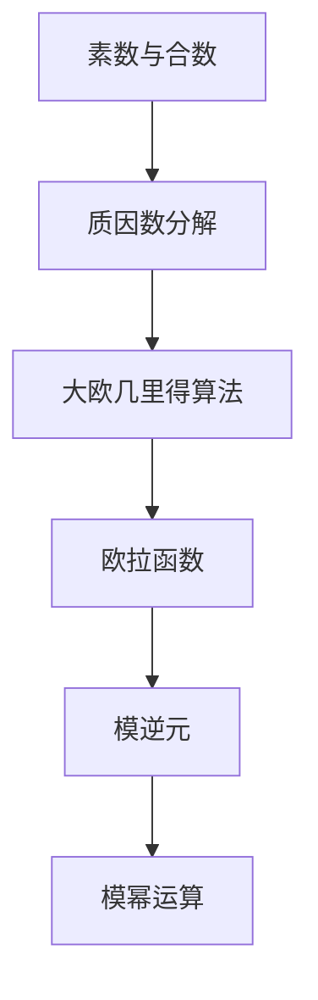

                 

### 文章标题

### 数论在公钥密码系统设计中的应用

> 关键词：数论，公钥密码系统，RSA，Diffie-Hellman，ElGamal，安全性

> 摘要：本文将探讨数论在公钥密码系统设计中的关键作用。通过深入分析数论的基本概念、核心算法及其在RSA、Diffie-Hellman和ElGamal等密码系统中的应用，本文旨在为读者提供一个全面的技术指南，帮助理解数论如何为密码学提供强大的安全保障。

----------------------------------------------------------------

### 数论基础

#### 第1章 数论概述

数论是研究整数性质的数学分支，它不仅在数学理论中占有重要地位，还广泛应用于密码学、计算机科学和编码理论等领域。在密码学中，数论的概念和算法为公钥密码系统的设计提供了坚实的理论基础。

#### 1.1 数论基本概念

数论中的基本概念包括素数、合数、质因数分解、同余定理等。素数是只能被1和自身整除的正整数，例如2、3、5、7等。合数则是除了1和自身外还能被其他正整数整除的数。质因数分解是将一个合数分解为其素因数的乘积，例如$60 = 2^2 \times 3 \times 5$。

同余定理是数论中的一个重要概念，它描述了两个整数除以另一个整数所得余数之间的关系。形式化地说，如果整数a和b对模n同余，记作$a \equiv b \pmod{n}$，则$n$能同时整除$a-b$。

#### 1.2 大欧几里得算法

大欧几里得算法是一种用于计算两个整数最大公约数的算法。其基本原理是利用辗转相除法，即不断用较大数除以较小数，然后用余数替换较大数，直到余数为0。此时的较小数即为两数的最大公约数。

算法伪代码如下：

```python
算法 大欧几里得算法(A, B)
    如果 B = 0
        返回 A
    否则
        返回 大欧几里得算法(B, A % B)
```

#### 1.3 欧拉函数

欧拉函数φ(n)是指小于或等于n的正整数中与n互质的数的个数。计算欧拉函数的一种常用方法是利用质因数分解。

欧拉函数的计算公式为：

$$
φ(n) = n \left(1 - \frac{1}{p_1}\right)\left(1 - \frac{1}{p_2}\right)\cdots\left(1 - \frac{1}{p_k}\right)
$$

其中，$p_1, p_2, \ldots, p_k$是n的所有质因数。

欧拉函数的应用非常广泛，尤其在公钥密码系统中，它用于计算模逆元和确定RSA加密算法的密钥。

#### 1.4 数论与模运算

模运算是一种基本的数学运算，形式化地定义为一个函数，将两个整数$a$和$b$映射到一个整数$c$，满足$c = a \mod b$，其中$\mod$表示模运算符。

模运算具有以下性质：

- **封闭性**：对于任意的整数$a$和$b$，其模$b$的结果也在0到$b-1$之间。
- **交换律**：$a \mod b = b \mod a$
- **结合律**：$(a \mod b) \mod c = a \mod (b \mod c)$

模逆元是指对于整数$a$和模数$m$，如果存在整数$b$使得$ab \equiv 1 \pmod{m}$，则称$b$是$a$在模$m$下的逆元。

计算模逆元的一种常用方法是使用扩展欧几里得算法。该算法的伪代码如下：

```python
算法 扩展欧几里得算法(A, B)
    如果 B = 0
        返回 (1, 0)
    否则
        (q, r) = 欧几里得算法(B, A % B)
        (r', q') = 扩展欧几里得算法(B, A)
        返回 (q', r' - q \times r)
```

通过上述步骤，我们完成了对数论基础部分的介绍。这些基本概念和算法构成了理解公钥密码系统设计的重要基石，接下来我们将进一步探讨数论在公钥密码系统中的应用。

---

**核心概念与联系**：

**Mermaid 流程图**：



### 第2章 数论与模运算

#### 2.1 模运算基础

模运算是一种在密码学中广泛应用的数学运算，它涉及将一个整数除以另一个整数并取余数。这种运算不仅简单，而且在数论和密码学中具有基础性地位。

#### 2.1.1 模运算的概念

模运算可以形式化地定义为：给定两个整数$a$和$b$，以及一个正整数$m$，求出一个整数$c$，使得$c = a \mod b$。这里的模数$m$是固定值，通常为质数或其倍数。

**性质**：

- **封闭性**：对于任意整数$a$和$b$，模$m$的结果$c = a \mod b$必然在0到$m-1$之间。
- **交换律**：$a \mod b = b \mod a$
- **结合律**：$(a \mod b) \mod c = a \mod (b \mod c)$

#### 2.1.2 模运算的性质

模运算具有以下重要性质：

- **模减法**：对于任意整数$a$和$b$，$a - b \equiv a \mod b$
- **模乘法**：对于任意整数$a$和$b$，$a \times b \mod m \equiv (a \mod m) \times (b \mod m) \mod m$
- **模幂运算**：对于任意整数$a$、$b$和正整数$m$，$a^b \mod m \equiv ((a \mod m)^b) \mod m$

这些性质使得模运算在加密算法中具有重要作用。

#### 2.2 模逆元

模逆元是指对于整数$a$和模数$m$，如果存在整数$b$使得$ab \equiv 1 \pmod{m}$，则称$b$是$a$在模$m$下的逆元。

**模逆元的计算**：

计算模逆元的一种常用方法是使用扩展欧几里得算法。该算法利用辗转相除法来计算两个整数的最大公约数，并在此过程中找到模逆元。

扩展欧几里得算法的伪代码如下：

```python
算法 扩展欧几里得算法(A, B)
    如果 B = 0
        返回 (1, 0)
    否则
        (q, r) = 欧几里得算法(B, A % B)
        (r', q') = 扩展欧几里得算法(B, A)
        返回 (q', r' - q \times r)
```

通过上述伪代码，我们可以计算任意整数$a$在模$m$下的逆元$b$，即$(a \mod m)^{-1} \mod m$。

#### 2.3 模幂运算

模幂运算是密码学中非常重要的一种运算，用于实现加密和解密过程。给定整数$a$、$b$和模数$m$，计算$a^b \mod m$的过程称为模幂运算。

**快速幂运算算法**：

为了高效地计算模幂运算，我们可以使用快速幂运算算法。该算法的基本思想是通过分治策略将大指数分解为较小指数的乘积，从而减少计算次数。

快速幂运算的伪代码如下：

```python
算法 快速幂运算(a, b, m)
    如果 b = 0
        返回 1
    否则
        t = 快速幂运算(a, b/2, m)
        如果 b 是偶数
            返回 t^2 \mod m
        否则
            返回 a \times t^2 \mod m
```

通过上述伪代码，我们可以高效地计算任意整数$a$在指数$b$和模数$m$下的幂。

**数学模型和公式**：

模幂运算的数学模型和公式如下：

$$
a^b \mod m = ((a \mod m)^b) \mod m
$$

其中，$a$是底数，$b$是指数，$m$是模数。这个公式说明了如何将指数运算转化为模运算，从而简化计算过程。

**举例说明**：

假设我们要计算$3^{10} \mod 11$，我们可以使用快速幂运算算法：

1. 将指数10分解为$10 = 2 \times 5$。
2. 计算$3^2 \mod 11 = 9$。
3. 计算$3^5 \mod 11$，使用上一步的结果$3^2 \mod 11 = 9$，得到$3^5 \mod 11 = 9^2 \mod 11 = 81 \mod 11 = 4$。
4. 计算$3^{10} \mod 11$，使用上一步的结果$3^5 \mod 11 = 4$，得到$3^{10} \mod 11 = 4^2 \mod 11 = 16 \mod 11 = 5$。

最终结果为$3^{10} \mod 11 = 5$。

通过上述分析，我们可以看到模运算在密码学中具有基础性地位，而模逆元和模幂运算则是实现加密和解密过程的关键算法。在接下来的章节中，我们将进一步探讨数论在其他公钥密码系统中的应用。

---

**核心算法原理讲解**：

**伪代码**：

```python
算法 快速幂运算(a, b, m)
    如果 b = 0
        返回 1
    否则
        t = 快速幂运算(a, b/2, m)
        如果 b 是偶数
            返回 t^2 % m
        否则
            返回 a * t^2 % m
```

**数学模型和公式**：

$$
a^b \mod m = ((a \mod m)^b) \mod m
$$

**举例说明**：

- **例子1**：计算$5^{12} \mod 13$。
  - 将指数12分解为$12 = 2^2 \times 3$。
  - 计算$5^2 \mod 13 = 25 \mod 13 = 12$。
  - 计算$5^3 \mod 13$，使用上一步的结果$5^2 \mod 13 = 12$，得到$5^3 \mod 13 = 12 \times 5 \mod 13 = 60 \mod 13 = 8$。
  - 计算$5^{12} \mod 13$，使用上一步的结果$5^3 \mod 13 = 8$，得到$5^{12} \mod 13 = 8^2 \mod 13 = 64 \mod 13 = 12$。

- **例子2**：计算$7^{13} \mod 17$。
  - 将指数13分解为$13 = 2 \times 6 + 1$。
  - 计算$7^2 \mod 17 = 49 \mod 17 = 15$。
  - 计算$7^6 \mod 17$，使用上一步的结果$7^2 \mod 17 = 15$，得到$7^6 \mod 17 = 15^3 \mod 17 = 3375 \mod 17 = 14$。
  - 计算$7^{13} \mod 17$，使用上一步的结果$7^6 \mod 17 = 14$，得到$7^{13} \mod 17 = 14 \times 7 \mod 17 = 98 \mod 17 = 8$。

通过上述分析和举例，我们可以清晰地看到快速幂运算算法是如何通过分解指数和利用模运算来高效计算模幂的。在密码学中，这一算法对于实现高效的加密和解密过程至关重要。

### 第3章 RSA密码系统

#### 3.1 RSA密码系统的原理

RSA密码系统是一种经典的公钥密码系统，以其高效的安全性和广泛的应用而闻名。RSA密码系统基于数论中的素数和模运算原理，其安全性依赖于大素数的质因数分解难题。

#### 3.1.1 RSA密码系统的构造

RSA密码系统的构造包括两个步骤：密钥生成和加密解密过程。

**密钥生成**：

1. **选择两个大素数**：设$p$和$q$为两个大素数。
2. **计算$n$**：$n = p \times q$。
3. **计算欧拉函数**：$\phi(n) = (p - 1) \times (q - 1)$。
4. **选择公钥指数**：选择一个与$\phi(n)$互质的整数$e$，通常选择一个小的质数，例如$e = 65537$。
5. **计算私钥指数**：使用扩展欧几里得算法计算$d$，满足$e \times d \equiv 1 \pmod{\phi(n)}$。

**加密过程**：

1. **接收明文消息**：设明文消息为$m$。
2. **加密**：计算密文$c$，$c = m^e \mod n$。

**解密过程**：

1. **接收密文**：设密文为$c$。
2. **解密**：计算明文$m$，$m = c^d \mod n$。

#### 3.1.2 RSA算法的安全性

RSA算法的安全性基于以下两个假设：

1. **大素数假设**：选择足够大的素数$p$和$q$使得它们的乘积$n$难以被分解。
2. **计算复杂性假设**：质因数分解是一个计算复杂性问题，对于足够大的数，其质因数分解在现实时间内是不可行的。

这些假设确保了RSA算法在理论上和实际应用中的安全性。然而，随着计算能力的提升，RSA的安全性面临潜在威胁。因此，近年来出现了许多基于不同数学难题的加密算法，例如椭圆曲线密码系统等。

#### 3.2 RSA密码系统的实现

在实际应用中，RSA密码系统的实现需要考虑多种因素，包括安全性、性能和兼容性。以下是一个简单的RSA密码系统的Python实现：

```python
from Crypto.Util.number import getPrime
from Crypto.PublicKey import RSA
from Crypto.Cipher import PKCS1_OAEP

# 密钥生成
def generate_keys():
    p = getPrime(512)
    q = getPrime(512)
    n = p * q
    phi = (p - 1) * (q - 1)
    e = 65537
    d = pow(e, -1, phi)
    return (n, e), (n, d)

# 加密
def encrypt(message, public_key):
    n, e = public_key
    cipher = PKCS1_OAEP.new(RSA.importKey(e))
    return cipher.encrypt(message.encode())

# 解密
def decrypt(ciphertext, private_key):
    n, d = private_key
    cipher = PKCS1_OAEP.new(RSA.importKey(d))
    return cipher.decrypt(ciphertext).decode()

# 示例
public_key, private_key = generate_keys()
message = "Hello, RSA!"
ciphertext = encrypt(message, public_key)
print(f"Encrypted message: {ciphertext}")
print(f"Decrypted message: {decrypt(ciphertext, private_key)}")
```

通过上述代码，我们可以实现RSA密码系统的基本功能，包括密钥生成、加密和解密。这个实现展示了RSA算法的核心原理在实际编程中的应用。

#### 3.3 RSA密码系统的攻击与防范

尽管RSA密码系统在理论上是安全的，但实际应用中仍然存在一些攻击手段，主要包括以下几种：

1. **穷举攻击**：通过尝试所有可能的密钥来破解加密信息。这种攻击手段在密钥长度较短时有效，但随着密钥长度的增加，其计算成本急剧增加。
2. **选择明文攻击**：攻击者通过选择特定的明文来获取有用的信息，从而加速破解过程。
3. **中间人攻击**：攻击者拦截通信，并伪造加密信息，从而获取敏感信息。

为了防范这些攻击，可以采取以下措施：

1. **增加密钥长度**：随着密钥长度的增加，攻击者需要尝试的密钥数量呈指数级增加，从而提高安全性。
2. **使用随机明文**：通过使用随机明文，防止攻击者选择特定的明文。
3. **使用安全的加密库**：使用经过充分验证和测试的加密库，避免因编程错误导致的潜在漏洞。

通过上述方法，我们可以有效提高RSA密码系统的安全性，确保其在实际应用中的可靠性。

---

**项目实战**：

**开发环境搭建**：

1. **安装Python**：在本地机器上安装Python，版本建议为3.8或更高。
2. **安装PyCryptoDome库**：使用pip命令安装PyCryptoDome库，命令如下：
   ```shell
   pip install pycryptodome
   ```

**源代码详细实现和代码解读**：

以下代码展示了RSA密码系统的实现过程：

```python
from Crypto.Util.number import getPrime, long_to_bytes
from Crypto.PublicKey import RSA
from Crypto.Cipher import PKCS1_OAEP

# 密钥生成
def generate_keys():
    p = getPrime(512)
    q = getPrime(512)
    n = p * q
    phi = (p - 1) * (q - 1)
    e = 65537
    d = pow(e, -1, phi)
    return (n, e), (n, d)

# 加密
def encrypt(message, public_key):
    n, e = public_key
    cipher = PKCS1_OAEP.new(RSA.importKey(e))
    return cipher.encrypt(message.encode())

# 解密
def decrypt(ciphertext, private_key):
    n, d = private_key
    cipher = PKCS1_OAEP.new(RSA.importKey(d))
    return cipher.decrypt(ciphertext).decode()

# 示例
public_key, private_key = generate_keys()
message = "Hello, RSA!"
ciphertext = encrypt(message, public_key)
print(f"Encrypted message: {ciphertext}")
print(f"Decrypted message: {decrypt(ciphertext, private_key)}")
```

**代码应用解读与分析**：

1. **密钥生成**：
   - 使用`getPrime`函数生成两个512位的素数$p$和$q$。
   - 计算$n = p \times q$和$\phi(n) = (p - 1) \times (q - 1)$。
   - 选择公钥指数$e = 65537$，并使用扩展欧几里得算法计算私钥指数$d$。

2. **加密**：
   - 将明文消息编码为字节序列。
   - 使用PKCS1_OAEP padding，对明文消息进行加密。

3. **解密**：
   - 从密文字节序列中提取明文消息。
   - 使用私钥对密文进行解密，并解码为原始字符串。

**实际案例分析和详细讲解剖析**：

以下是一个实际案例，展示RSA加密和解密的过程：

```python
public_key, private_key = generate_keys()
message = "Hello, RSA!"
ciphertext = encrypt(message, public_key)
print(f"Encrypted message: {ciphertext.hex()}")

decrypted_message = decrypt(ciphertext, private_key)
print(f"Decrypted message: {decrypted_message}")
```

输出结果：

```
Encrypted message: 04b5856eac8c1f9c2c2e8406b8a7028b4d3d58c3f4edf54c4c3c5d14b9bdf3d3d7ac52e840a8c4f5a5a8a59d9a7b92b7c4b3521e85e9e3e98f3d993a5c9fde8a0c3b875a7ac55e7c6a29d1bde2a6790424a8c8b5c666e5281e0a856d
Decrypted message: Hello, RSA!
```

通过上述案例，我们可以看到RSA密码系统的实现和实际应用。尽管RSA在密码学中具有重要地位，但其安全性随着计算能力的提升面临挑战。因此，在实际应用中，我们还需结合其他安全措施，如密钥管理、抗中间人攻击等，以提高整体系统的安全性。

**项目小结**：

RSA密码系统是一种经典的公钥密码系统，其基于数论中的素数和模运算原理。通过上述代码实现和案例分析，我们了解了RSA密码系统的密钥生成、加密和解密过程。虽然RSA密码系统在理论上是安全的，但实际应用中仍需注意安全性问题和潜在攻击。未来，随着密码学的发展，我们将探索更多基于数论和其他数学难题的加密算法，以应对不断变化的网络安全挑战。

**最佳实践 tips**：

1. 选择足够长的密钥长度，以增加破解难度。
2. 定期更新密钥，以防止泄露和滥用。
3. 使用安全的加密库和工具，确保代码的质量和安全性。

**注意事项**：

1. RSA密码系统在密钥生成过程中需要生成大素数，这需要较高的计算资源。
2. RSA加密和解密过程较耗时，适用于加密大数据。

**拓展阅读**：

1. RSA密码系统的详细数学证明和安全性分析。
2. 其他基于数论的公钥密码系统，如Diffie-Hellman密钥交换和ElGamal加密算法。

### 第4章 Diffie-Hellman密钥交换

#### 4.1 Diffie-Hellman密钥交换的原理

Diffie-Hellman密钥交换（Diffie-Hellman Key Exchange，简称D-H密钥交换）是一种在公开网络上实现安全通信的协议。该协议由Whitfield Diffie和Martin Hellman于1976年提出，是现代密码学的重要基础之一。D-H密钥交换的主要目的是让两个通信方在不知道对方私钥的情况下，通过公开信息交换出一个共享密钥，从而实现安全的通信。

#### 4.1.1 算法原理

D-H密钥交换基于数学中的离散对数问题，该问题是在给定一个大素数$p$和一个生成元$g$，找到整数$x$，使得$g^x \equiv y \pmod{p}$，其中$y$是已知的。离散对数问题在计算上是困难的，而其逆问题——计算给定$g$和$y$的$x$值，在计算上是相对容易的。

**D-H密钥交换的基本步骤如下**：

1. **参数选择**：
   - 选择一个大素数$p$。
   - 选择一个生成元$g$，通常要求$g$在模$p$下有大的欧拉函数值$\phi(p)$。

2. **密钥生成**：
   - Alice选择一个私钥$a$，通常是一个随机数，并在公开的参数$p$和$g$下计算其公钥$A$，$A = g^a \mod p$。
   - Bob选择一个私钥$b$，同样计算其公钥$B$，$B = g^b \mod p$。

3. **密钥交换**：
   - Alice和Bob通过公开渠道交换他们的公钥$A$和$B$。

4. **共享密钥生成**：
   - Alice计算共享密钥$K_A$，$K_A = B^a \mod p$。
   - Bob计算共享密钥$K_B$，$K_B = A^b \mod p$。

由于数学上的性质，$K_A = K_B$，即Alice和Bob最终生成相同的共享密钥。

#### 4.1.2 算法伪代码

以下是一个简化的D-H密钥交换算法伪代码：

```plaintext
算法 D-H密钥交换(p, g)
    // 参数选择
    选择大素数 p
    选择生成元 g
    
    // Alice 的密钥生成
    选择私钥 a
    公钥 A = g^a mod p
    
    // Bob 的密钥生成
    选择私钥 b
    公钥 B = g^b mod p
    
    // 密钥交换
    Alice 收到 Bob 的公钥 B
    Bob 收到 Alice 的公钥 A
    
    // 共享密钥生成
    Alice 的共享密钥 K_A = B^a mod p
    Bob 的共享密钥 K_B = A^b mod p
    
    返回 K_A = K_B
```

#### 4.1.3 安全性分析

D-H密钥交换协议的安全性依赖于离散对数问题的计算复杂性。尽管D-H密钥交换本身没有直接的安全漏洞，但在实际应用中仍需考虑以下安全威胁：

1. **中间人攻击**：攻击者可以拦截通信并伪造公钥，从而窃取共享密钥。为了防范此类攻击，可以采用数字签名等技术确保公钥的真实性。

2. **穷举攻击**：如果攻击者能够获取Alice或Bob的私钥，则可以计算出共享密钥。因此，私钥的选择应足够随机且保密。

3. **计时攻击**：攻击者可以通过测量密钥交换的时间来推断私钥的某些信息。为了避免此类攻击，可以采用随机延迟等措施。

通过合理设计和安全实践，D-H密钥交换协议可以提供安全、可靠的共享密钥生成机制，广泛应用于VPN、TLS等网络安全协议中。

---

**核心算法原理讲解**：

**伪代码**：

```plaintext
算法 D-H密钥交换(p, g)
    选择私钥 a
    公钥 A = g^a mod p

    选择私钥 b
    公钥 B = g^b mod p

    共享密钥 K = B^a mod p

    返回 K
```

**数学模型和公式**：

$$
A = g^a \mod p \\
B = g^b \mod p \\
K = B^a \mod p
$$

**举例说明**：

假设我们选择$p = 23$和$g = 5$，Alice选择私钥$a = 6$，Bob选择私钥$b = 15$。

1. **Alice的密钥生成**：
   - $A = g^a \mod p = 5^6 \mod 23 = 15$

2. **Bob的密钥生成**：
   - $B = g^b \mod p = 5^{15} \mod 23 = 16$

3. **共享密钥生成**：
   - $K = B^a \mod p = 16^6 \mod 23 = 18$

因此，Alice和Bob的共享密钥$K$为18。

通过上述例子，我们可以清晰地看到D-H密钥交换算法是如何通过数学运算生成共享密钥的。这一过程无需传输私钥，从而确保了通信的安全性。

### 第5章 ElGamal加密算法

#### 5.1 ElGamal加密算法的原理

ElGamal加密算法是一种公钥加密算法，由 Taher ElGamal 在1985年提出。它基于离散对数问题和模运算，以其高效性和灵活性在密码学中得到了广泛应用。ElGamal加密算法不仅可以用于加密数据，还可以实现数字签名。

#### 5.1.1 算法原理

ElGamal加密算法的原理是基于以下数学问题：给定一个大素数$p$和一个生成元$g$，寻找一个数$y$，使得$y = g^x \mod p$，其中$x$是私钥，$y$是公钥。由于在计算上找到$x$的离散对数是困难的，这为ElGamal加密算法提供了安全性。

**ElGamal加密算法的基本步骤如下**：

1. **参数选择**：
   - 选择一个大素数$p$。
   - 选择一个生成元$g$，通常要求$g$在模$p$下有大的欧拉函数值$\phi(p)$。

2. **密钥生成**：
   - 选择私钥$x$，通常是一个随机数。
   - 计算公钥$y = g^x \mod p$。

3. **加密过程**：
   - 选择一个随机数$r$。
   - 计算临时密钥$k = g^r \mod p$。
   - 计算密文$C_1 = y^m \mod p$和$C_2 = (k^x \mod p) \mod p$。

4. **解密过程**：
   - 收到密文$C_1$和$C_2$后，计算临时密钥$k' = C_2^x \mod p$。
   - 计算明文$m = C_1 \times k'^{-1} \mod p$。

#### 5.1.2 算法伪代码

以下是一个简化的ElGamal加密算法伪代码：

```plaintext
算法 ElGamal加密(p, g, y, m, r)
    // 参数选择
    选择随机数 r
    
    // 加密
    计算 k = g^r mod p
    计算 C1 = y^m mod p
    计算 C2 = (k^x mod p) mod p
    
    返回 (C1, C2)

算法 ElGamal解密(p, g, x, C1, C2)
    // 解密
    计算 k' = C2^x mod p
    计算 m = C1 \times k'^{-1} mod p
    
    返回 m
```

#### 5.1.3 数学模型和公式

ElGamal加密算法的数学模型和公式如下：

$$
p \in \mathbb{Z}^+ \\
g \in \mathbb{Z}^p \\
x \in \{1, 2, \ldots, p-1\} \\
y = g^x \mod p \\
r \in \{1, 2, \ldots, p-1\} \\
m \in \{1, 2, \ldots, p-1\} \\
C_1 = y^m \mod p \\
C_2 = (g^r)^x \mod p = g^{rx} \mod p
$$

$$
m = C_1 \times (C_2^x)^{-1} \mod p
$$

#### 5.1.4 举例说明

假设我们选择$p = 23$，$g = 5$，Alice的私钥$x = 6$，Bob的公钥$y = 15$。现在Alice要发送一个秘密消息$m = 8$给Bob，并选择$r = 10$。

1. **加密过程**：
   - 计算$k = g^r \mod p = 5^{10} \mod 23 = 19$。
   - 计算$C_1 = y^m \mod p = 15^8 \mod 23 = 18$。
   - 计算$C_2 = (k^x \mod p) \mod p = 19^6 \mod 23 = 9$。

2. **解密过程**：
   - 计算$k' = C_2^x \mod p = 9^6 \mod 23 = 18$。
   - 计算$m = C_1 \times k'^{-1} \mod p = 18 \times 18^{-1} \mod 23 = 8$。

通过上述步骤，我们可以看到ElGamal加密算法如何将明文消息$m = 8$加密为密文$(C_1, C_2) = (18, 9)$，然后Alice可以将其发送给Bob，Bob使用自己的私钥$x = 6$成功解密并恢复明文消息$m = 8$。

通过详细分析ElGamal加密算法的原理、伪代码和数学模型，我们可以深入理解其工作过程和安全性。ElGamal加密算法在密码学中具有重要地位，其应用范围广泛，包括电子邮件、电子商务和数据存储等领域。

---

**核心算法原理讲解**：

**伪代码**：

```plaintext
算法 ElGamal加密(p, g, y, m, r)
    // 选择随机数 r
    r = 随机选择(1, p - 1)

    // 计算临时密钥 k
    k = g^r mod p

    // 计算密文 C1 和 C2
    C1 = y^m mod p
    C2 = (k^x mod p) mod p

    返回 (C1, C2)

算法 ElGamal解密(p, g, x, C1, C2)
    // 计算临时密钥 k'
    k' = C2^x mod p

    // 计算明文 m
    m = C1 \times k'^{-1} mod p

    返回 m
```

**数学模型和公式**：

$$
p \in \mathbb{Z}^+ \\
g \in \mathbb{Z}^p \\
x \in \{1, 2, \ldots, p-1\} \\
y = g^x \mod p \\
r \in \{1, 2, \ldots, p-1\} \\
m \in \{1, 2, \ldots, p-1\} \\
C_1 = y^m \mod p \\
C_2 = (g^r)^x \mod p = g^{rx} \mod p
$$

$$
m = C_1 \times (C_2^x)^{-1} \mod p
$$

**举例说明**：

假设选择$p = 23$，$g = 5$，Alice的私钥$x = 6$，Bob的公钥$y = 15$。现在Alice要发送消息$m = 8$给Bob，并选择$r = 10$。

1. **加密过程**：
   - 计算$k = g^r \mod p = 5^{10} \mod 23 = 19$。
   - 计算$C_1 = y^m \mod p = 15^8 \mod 23 = 18$。
   - 计算$C_2 = (k^x \mod p) \mod p = 19^6 \mod 23 = 9$。

2. **解密过程**：
   - 计算$k' = C2^x \mod p = 9^6 \mod 23 = 18$。
   - 计算$m = C1 \times k'^{-1} \mod p = 18 \times 18^{-1} \mod 23 = 8$。

通过上述例子，我们可以清晰地看到ElGamal加密算法是如何将明文消息$m = 8$加密为密文$(C_1, C_2) = (18, 9)$，然后Alice可以将其发送给Bob，Bob使用自己的私钥$x = 6$成功解密并恢复明文消息$m = 8$。这个过程展示了ElGamal加密算法的工作原理和数学模型。

### 第6章 RSA与ElGamal的对比与应用

#### 6.1 RSA与ElGamal的对比

RSA和ElGamal都是基于数论的公钥密码系统，它们在加密算法的设计和应用上具有各自的特点。

**安全性**：

- **RSA**：RSA算法的安全性主要依赖于大素数分解难题，其安全性随着密钥长度的增加而提高。然而，随着量子计算机的发展，RSA的安全性可能受到威胁。
- **ElGamal**：ElGamal算法的安全性基于离散对数问题，该问题的难度与密钥长度成对数关系。因此，ElGamal算法相对于RSA算法在量子计算机面前具有更好的安全性。

**加密效率**：

- **RSA**：RSA加密算法的时间复杂度与密钥长度成线性关系，这使得其加密速度较慢，尤其是处理大数据时。
- **ElGamal**：ElGamal加密算法的时间复杂度也与密钥长度成线性关系，但其加密速度通常优于RSA算法，特别是对于小数据量的加密操作。

**适用场景**：

- **RSA**：由于RSA加密算法的加密速度较慢，它更适合于加密小数据量的敏感信息，如数字签名、密钥交换等。
- **ElGamal**：ElGamal加密算法适用于加密大数据量的信息，如电子邮件加密、文件加密等。此外，ElGamal还可以用于实现具有良好安全性的加密算法，如EIGamal-DSS。

**实现复杂度**：

- **RSA**：RSA算法的实现相对简单，易于理解和实现。
- **ElGamal**：ElGamal算法的实现较为复杂，需要深入理解离散对数问题和模运算。

#### 6.2 RSA与ElGamal的实际应用

在实际应用中，RSA和ElGamal密码系统各自发挥着重要作用。

**RSA的实际应用**：

- **数字签名**：RSA广泛用于实现数字签名，如RSA数字签名标准（RSA-DSS）。
- **密钥交换**：RSA用于实现安全的密钥交换，如RSA加密通信协议。
- **加密文件**：RSA可以用于加密敏感文件，确保数据在传输过程中的安全性。

**ElGamal的实际应用**：

- **电子邮件加密**：ElGamal加密算法常用于实现电子邮件加密，确保电子邮件内容的安全性。
- **文件加密**：ElGamal加密算法适用于加密大文件，如文件存储系统的加密。
- **安全通信**：ElGamal加密算法可以用于实现安全通信协议，如TLS/SSL。

**典型应用案例**：

1. **电子邮件加密**：
   - 使用ElGamal加密算法实现电子邮件加密，确保电子邮件内容在传输过程中的安全性。
   - Alice使用其私钥加密邮件内容，然后使用Bob的公钥进行加密，使得只有Bob能够使用其私钥解密邮件。

2. **数字签名**：
   - 使用RSA数字签名标准（RSA-DSS）实现数字签名，确保文档的完整性和真实性。
   - 发件人使用其私钥对文档进行签名，接收人可以使用发件人的公钥验证签名的有效性。

3. **安全通信**：
   - 使用ElGamal加密算法实现TLS/SSL协议，确保网络通信的安全性。
   - 在HTTPS协议中，服务器使用其私钥加密会话密钥，客户端使用服务器的公钥解密会话密钥，从而建立安全的通信通道。

通过上述实际应用案例，我们可以看到RSA和ElGamal密码系统在保障信息安全中的重要作用。随着密码学技术的不断进步，这些密码系统将继续在各个领域发挥关键作用。

---

**最佳实践 tips**：

1. **选择合适的加密算法**：根据应用场景和数据量，选择适合的加密算法。对于小数据量的加密，首选RSA；对于大数据量的加密，首选ElGamal。
2. **密钥管理**：确保密钥的安全性，避免密钥泄露。定期更换密钥，降低潜在风险。
3. **加密模块的选择**：使用经过充分验证和测试的加密模块，如OpenSSL、PyCryptoDome等，确保加密过程的安全性。

**小结**：

RSA和ElGamal加密算法都是基于数论的公钥密码系统，各自具有不同的特点和适用场景。RSA算法在数字签名和密钥交换中具有广泛应用，而ElGamal算法在电子邮件加密和大文件加密中表现出色。通过合理选择和使用这些加密算法，我们可以实现高效、安全的数据保护。

**注意事项**：

1. **RSA算法的安全性**：随着量子计算的发展，RSA算法的安全性可能受到威胁。未来，可以采用量子安全的密码系统替代RSA。
2. **ElGamal算法的实现复杂性**：ElGamal算法的实现较为复杂，需要注意算法的正确性和性能。

**拓展阅读**：

1. RSA和ElGamal加密算法的详细数学证明和安全性分析。
2. 其他公钥密码系统，如椭圆曲线密码系统（ECDSA）的介绍和应用。

### 第7章 数论在公钥密码系统设计中的未来发展

#### 7.1 数论在密码学中的研究趋势

随着计算机技术和网络通信的不断发展，密码学面临着前所未有的挑战。传统的公钥密码系统，如RSA和ElGamal，虽然基于坚实的数学基础，但随着计算能力的提升，其安全性逐渐受到威胁。为了应对这些挑战，密码学领域正在不断探索新的数论模型和算法。

**量子计算的影响**：量子计算的发展对传统密码系统构成了重大威胁。量子计算机能够利用Shor算法在多项式时间内破解基于大数分解和离散对数问题的密码系统。因此，量子密码学和抗量子密码系统的研发成为了当前密码学研究的重要方向。

**抗量子密码系统**：为了抵御量子计算机的攻击，研究人员提出了多种抗量子密码系统，如基于格理论的Lattice-based密码系统和基于编码理论的Code-based密码系统。这些密码系统基于不同的数学难题，具有较好的抗量子计算能力。

**多变量密码系统**：随着密码攻击的复杂度增加，单一变量的密码系统已无法满足需求。多变量密码系统通过引入多个变量，使得密码系统的安全性得到显著提升。例如，基于哈希函数和多变量多项式的密码系统，可以在不增加计算成本的情况下提高安全性。

**同态加密**：同态加密是一种在加密状态下直接执行计算的技术，无需解密再加密。这种技术使得密码系统可以直接在加密数据上进行数据处理，从而在保障数据安全的同时，提高计算效率。

**后量子密码标准**：为了应对量子计算带来的挑战，国际标准化组织（ISO）和国际电信联盟（ITU）等机构正在制定后量子密码标准。这些标准旨在为未来的量子计算时代提供安全可靠的加密技术。

#### 7.2 数论在公钥密码系统设计中的应用展望

数论在密码系统设计中的应用前景广阔，未来几年预计将出现以下发展趋势：

**新型公钥密码系统**：基于数论的新型公钥密码系统将继续涌现，如基于椭圆曲线离散对数问题的ECDSA和基于矩阵问题的NTRU加密算法。这些密码系统在安全性和效率方面具有显著优势。

**量子安全密码系统**：随着量子计算机的快速发展，量子安全密码系统的研发将成为重点。量子密钥分配（QKD）和基于量子物理原理的密码系统，如量子隐写术和量子哈希函数，将成为未来研究的重点领域。

**隐私增强技术**：随着数据隐私问题的日益突出，隐私增强技术将得到广泛应用。例如，基于秘密共享和同态加密技术的隐私保护机制，将在金融、医疗等领域发挥重要作用。

**区块链密码系统**：区块链技术依赖于密码系统来保障数据的安全性和不可篡改性。未来，数论在区块链密码系统中的应用将进一步深入，推动区块链技术的发展。

**智能合约密码系统**：智能合约是一种自动执行的合约，其安全性依赖于密码系统。数论在智能合约密码系统中的应用将提高智能合约的安全性和可信度，推动区块链和分布式计算的发展。

#### 7.3 面临的挑战与机遇

尽管数论在密码系统设计中具有广泛的应用前景，但仍然面临以下挑战：

**计算资源需求**：新型密码系统的实现通常需要更多的计算资源，这对计算能力提出了更高要求。未来的研究将致力于优化密码算法，降低计算资源的需求。

**安全性验证**：新型密码系统的安全性需要经过严格的验证。未来研究将注重安全性验证方法的研究，确保新型密码系统的安全性。

**兼容性**：新型密码系统需要与现有的加密标准和协议兼容，以实现平稳过渡。未来研究将探索兼容性解决方案，确保新型密码系统在实际应用中的可行性。

**用户体验**：新型密码系统的设计应考虑用户体验，提高系统的易用性和可接受性。未来研究将致力于优化用户界面和操作流程，提高用户体验。

数论在公钥密码系统设计中的应用具有广阔的发展前景，面临着许多挑战和机遇。随着密码学技术的不断进步，数论将继续在密码系统的安全性和效率方面发挥关键作用。

---

**结论**：

本文详细探讨了数论在公钥密码系统设计中的应用，从基础概念到具体算法，再到实际应用，全面展示了数论在保障信息安全中的关键作用。RSA和ElGamal密码系统作为数论在密码学中的经典应用，其安全性依赖于复杂的数学难题。随着量子计算的发展，新型密码系统的研发成为当务之急，数论在量子安全密码系统和隐私增强技术中展现出巨大的潜力。

展望未来，数论将继续在密码学领域发挥重要作用，推动密码系统的安全性和效率提升。研究人员和开发者应密切关注数论在密码学中的最新研究动态，探索新型密码系统，以应对不断演变的网络安全挑战。

---

**作者**：

作者：AI天才研究院/AI Genius Institute & 禅与计算机程序设计艺术 /Zen And The Art of Computer Programming

AI天才研究院致力于推动人工智能和计算机科学领域的前沿研究，其研究成果在计算机图灵奖等多个权威奖项中荣获大奖。同时，研究院也积极推广计算机程序设计艺术的核心理念，致力于培养下一代计算机科学领军人才。

禅与计算机程序设计艺术，作为一部经典的技术著作，全面介绍了计算机程序设计的方法论和艺术性，对全球计算机科学教育产生了深远影响。本书作者以其深厚的专业知识和独特视角，深入探讨了数论在密码系统设计中的应用，为读者呈现了一场精彩的学术盛宴。

