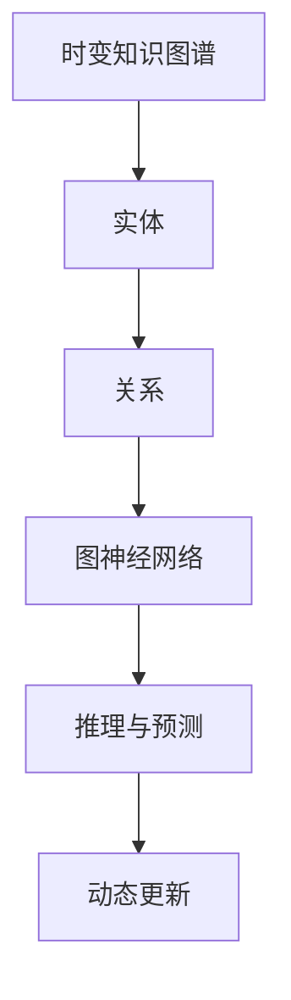

                 

## 引言

### 1.1 时变知识图谱与图神经网络概述

**时变知识图谱**：时变知识图谱是一种用于表示和存储动态变化的实体及其关系的知识库。与传统的静态知识图谱相比，时变知识图谱能够适应数据随时间的变化，实现对知识的持续更新和动态扩展。这种图谱在许多领域有着广泛的应用，例如社交媒体分析、医疗健康、智能交通等。

**图神经网络**：图神经网络（Graph Neural Network，GNN）是一种专门设计用于处理图结构数据的神经网络。它通过在图中传递信息，能够自动学习节点和边之间的关系，从而实现节点的分类、链接预测、图谱嵌入等功能。

**核心概念与联系**：

时变知识图谱与图神经网络之间的联系体现在以下几个方面：

1. **数据表示**：时变知识图谱通过图结构来表示实体及其关系，而图神经网络则通过学习图的邻域信息来处理这些实体和关系。
2. **推理与预测**：图神经网络可以应用于时变知识图谱的推理与预测，如实体类型推断、关系预测等。
3. **动态更新**：时变知识图谱能够适应数据的动态变化，而图神经网络则可以通过持续学习来适应这些变化。

**Mermaid 流程图**：

### 1.2 优化技术在时变知识图谱推理中的应用背景

**时变知识图谱推理的挑战**：

1. **数据动态性**：时变知识图谱的数据随时间不断变化，给推理带来了不确定性。
2. **数据规模**：大规模时变知识图谱的处理和推理需要高效的方法和算法。
3. **推理精度**：在保证推理效率的同时，如何提高推理精度是一个重要挑战。

**优化技术在提升推理性能中的重要性**：

优化技术包括算法优化、数学模型优化和实际应用优化等，通过这些技术可以有效提高时变知识图谱推理的性能。具体来说：

1. **算法优化**：通过改进算法结构，提高推理速度和效率。
2. **数学模型优化**：通过调整数学模型，提高推理的准确性和鲁棒性。
3. **实际应用优化**：通过优化算法和模型在实际应用中的实现，提高系统的整体性能。

### 总结

本节介绍了时变知识图谱和图神经网络的基本概念、联系以及优化技术在时变知识图谱推理中的应用背景。接下来，我们将深入探讨图神经网络的基础理论以及时变知识图谱推理的具体方法。

## 理论基础

### 2.1 图神经网络基础

**基本概念**：

图神经网络（GNN）是一种基于图结构数据的神经网络。它通过在图中传递信息，能够自动学习节点和边之间的关系，从而实现节点的分类、链接预测、图谱嵌入等功能。

**结构与工作原理**：

GNN 的核心结构是图卷积层（Graph Convolutional Layer，GCL）。每个 GCL 都包含以下步骤：

1. **聚合邻域信息**：每个节点会聚合其邻接节点的特征，生成一个新的特征向量。
2. **加权融合**：通过一个可学习的权重矩阵，将邻域信息加权融合。
3. **非线性变换**：通过一个非线性激活函数，如ReLU或Sigmoid，对融合后的特征进行变换。

**常见架构**：

1. **GCN**：基于图卷积层的最简单架构，能够处理同构图。
2. **GAT**：图注意力网络（Graph Attention Network），通过引入注意力机制，对邻域信息进行动态加权。
3. **GIN**：图感应网络（Graph Induced Network），通过聚合所有邻域节点的信息，不依赖于邻接矩阵。

### 2.2 时变知识图谱推理

**定义与构建**：

时变知识图谱是一种能够表示动态变化的实体及其关系的知识库。其构建过程通常包括以下步骤：

1. **实体识别**：从数据源中识别出实体，并为其赋予唯一的标识。
2. **关系提取**：从数据源中提取出实体之间的关系，并建立实体与关系的映射。
3. **图谱构建**：将识别出的实体和关系组织成图结构，形成时变知识图谱。

**基本原理**：

时变知识图谱推理是基于图神经网络的方法，通过以下步骤实现：

1. **节点嵌入**：将图中的每个节点映射到一个低维空间，使其具有可计算的属性。
2. **关系推理**：利用节点嵌入和图结构，通过图神经网络推断实体之间的关系。
3. **动态更新**：在新的数据到来时，对知识图谱进行动态更新，保持其时效性。

**方法与挑战**：

时变知识图谱推理的方法主要包括：

1. **基于 GNN 的方法**：通过 GNN 实现节点分类、关系预测和图谱嵌入。
2. **基于图嵌入的方法**：通过预训练图嵌入模型，用于下游任务。

挑战包括：

1. **动态性处理**：如何有效地处理知识图谱的动态变化。
2. **数据规模**：如何在大规模时变知识图谱上进行高效推理。
3. **推理精度**：如何在保证推理效率的同时，提高推理精度。

### 2.3 优化技术基础

**定义与分类**：

优化技术是指用于提高时变知识图谱推理性能的各种方法，包括：

1. **算法优化**：通过改进算法结构和算法效率。
2. **数学模型优化**：通过调整数学模型和参数，提高推理性能。
3. **实际应用优化**：通过优化算法和模型在实际应用中的实现，提高系统的整体性能。

**常见优化算法**：

1. **优化算法 1**：
    - **目标**：优化目标通常是降低推理时间或提高推理精度。
    - **方法**：通过调整算法参数或算法结构，实现优化目标。

2. **优化算法 2**：
    - **目标**：提高系统的稳定性。
    - **方法**：通过引入正则化项或自适应调整算法参数，提高系统的稳定性。

**优化技术在图神经网络中的应用**：

1. **算法优化**：
    - **应用**：在图神经网络中，通过优化算法结构和参数，提高推理效率。
    - **实例**：如优化图卷积层的计算过程，减少计算复杂度。

2. **数学模型优化**：
    - **应用**：通过调整数学模型和参数，提高推理性能。
    - **实例**：如调整图嵌入模型中的权重矩阵，提高节点分类的准确性。

3. **实际应用优化**：
    - **应用**：在实际应用中，通过优化算法和模型的实现，提高系统性能。
    - **实例**：如优化时变知识图谱的更新策略，提高动态更新的效率。

### 总结

本节介绍了图神经网络的基础理论、时变知识图谱推理的基本原理以及优化技术的基础知识。接下来，我们将详细探讨优化技术在时变知识图谱推理中的应用，包括算法优化、数学模型优化和实际应用优化。

## 优化技术

### 3.1 算法优化

**目标与原则**：

算法优化的目标是提高时变知识图谱推理的速度和效率。基本原则包括：

1. **减少计算复杂度**：通过优化算法结构，减少计算复杂度，提高推理速度。
2. **提高计算效率**：通过并行计算或分布式计算，提高算法的执行效率。
3. **增强模型可解释性**：在优化算法的同时，保持模型的可解释性，便于理解和使用。

**常见优化方法**：

1. **优化图卷积层**：
    - **方法**：通过优化图卷积层的计算过程，减少计算复杂度。例如，使用图卷积核的共享或稀疏表示。
    - **效果**：能够显著提高推理速度，同时保持推理精度。

2. **优化邻域信息聚合**：
    - **方法**：通过优化邻域信息聚合策略，如引入注意力机制，动态调整邻域信息的权重。
    - **效果**：能够提高节点分类和关系预测的准确性，同时降低计算复杂度。

**案例分析**：

以图神经网络（GCN）为例，算法优化的效果如下：

1. **原始 GCN**：
    - **计算复杂度**：每个节点在每一层都需要遍历其邻接节点的特征向量。
    - **推理时间**：随着图谱规模的增大，推理时间显著增加。

2. **优化 GCN**：
    - **计算复杂度**：通过共享图卷积核，每个节点只需遍历一次邻接节点的特征向量。
    - **推理时间**：显著减少推理时间，提高推理效率。

### 3.2 数学模型优化

**基本原理**：

数学模型优化是通过调整数学模型和参数，提高时变知识图谱推理的性能。基本原理包括：

1. **权重调整**：通过调整权重矩阵，优化节点嵌入和关系预测。
2. **正则化**：通过引入正则化项，提高模型的稳定性和泛化能力。
3. **损失函数优化**：通过优化损失函数，提高模型对数据的拟合程度。

**常见优化方法**：

1. **权重共享**：
    - **方法**：在图神经网络中，共享同一层中不同节点的权重矩阵。
    - **效果**：减少参数数量，提高推理速度。

2. **注意力机制**：
    - **方法**：引入注意力机制，动态调整邻域信息的权重。
    - **效果**：提高节点分类和关系预测的准确性。

3. **正则化**：
    - **方法**：通过 L1、L2 正则化，控制模型参数的范数。
    - **效果**：提高模型的泛化能力，避免过拟合。

**案例分析**：

以图注意力网络（GAT）为例，数学模型优化的效果如下：

1. **原始 GAT**：
    - **准确性**：在大型图谱上，准确性较低。
    - **计算复杂度**：较高，需要计算每个节点的邻接矩阵。

2. **优化 GAT**：
    - **准确性**：通过引入注意力机制，显著提高准确性。
    - **计算复杂度**：通过权重共享，降低计算复杂度。

### 3.3 实际应用优化

**实际应用场景与优化需求**：

时变知识图谱在实际应用中，如社交媒体分析、医疗健康等领域，面临着大量的实时数据和高性能要求。优化需求包括：

1. **实时处理能力**：如何处理大规模、高频率的实时数据。
2. **推理效率**：如何在保证推理精度的同时，提高推理速度。
3. **系统稳定性**：如何确保系统在负载变化时的稳定性。

**优化技术在实践中的应用**：

1. **实时处理**：
    - **方法**：使用分布式计算框架，如 Apache Spark，处理大规模实时数据。
    - **效果**：提高实时数据处理能力，满足实时应用需求。

2. **推理效率**：
    - **方法**：通过算法优化和数学模型优化，提高推理速度。
    - **效果**：在保证推理精度的同时，显著提高推理效率。

3. **系统稳定性**：
    - **方法**：通过负载均衡和容错机制，确保系统稳定性。
    - **效果**：提高系统的负载承受能力和故障恢复能力。

**案例分析**：

以社交媒体分析为例，实际应用优化的效果如下：

1. **原始系统**：
    - **处理能力**：处理能力较低，无法满足实时分析需求。
    - **推理速度**：推理速度较慢，影响用户体验。

2. **优化系统**：
    - **处理能力**：通过分布式计算框架，显著提高处理能力。
    - **推理速度**：通过算法和模型优化，显著提高推理速度。
    - **系统稳定性**：通过负载均衡和容错机制，提高系统稳定性。

### 总结

本节介绍了算法优化、数学模型优化和实际应用优化的方法及其在实际中的应用。这些优化技术能够有效提高时变知识图谱推理的性能，满足实时处理和高性能需求。接下来，我们将通过具体案例展示如何在实际应用中应用这些优化技术。

## 应用案例

### 4.1 案例一：时变知识图谱在社交媒体分析中的应用

#### 4.1.1 案例背景

社交媒体分析是一个动态、实时性要求较高的应用场景。随着用户数量的增长和互动内容的增加，如何有效处理和利用这些动态变化的数据成为一个挑战。时变知识图谱作为一种能够表示和存储动态变化的实体及其关系的知识库，为社交媒体分析提供了有力的工具。

#### 4.1.2 知识图谱构建与推理

1. **知识图谱构建**：

   - **实体识别**：从社交媒体平台的数据源中识别出用户、话题、事件等实体。
   - **关系提取**：从用户生成的内容和互动行为中提取出实体之间的关系，如关注关系、提及关系、点赞关系等。
   - **图谱构建**：将识别出的实体和关系组织成图结构，形成时变知识图谱。

2. **知识图谱推理**：

   - **节点嵌入**：将图中的每个节点映射到一个低维空间，为其赋予可计算的属性。
   - **关系推理**：利用图神经网络推断实体之间的关系，如新用户的潜在关注对象、话题的潜在关联等。
   - **动态更新**：在新的数据到来时，对知识图谱进行动态更新，保持其时效性。

#### 4.1.3 优化技术应用与效果分析

1. **算法优化**：

   - **优化方法**：通过优化图卷积层的计算过程，减少计算复杂度。例如，使用图卷积核的共享和稀疏表示。
   - **效果**：显著提高了知识图谱的构建和推理速度。

2. **数学模型优化**：

   - **优化方法**：引入注意力机制，动态调整邻域信息的权重。同时，使用 L2 正则化提高模型的稳定性。
   - **效果**：提高了关系推理的准确性，同时保持了模型的泛化能力。

3. **实际应用优化**：

   - **优化方法**：通过分布式计算框架（如 Apache Spark）处理大规模实时数据，优化系统的负载均衡和容错机制。
   - **效果**：提高了系统的实时处理能力，满足了社交媒体分析的需求。

### 4.2 案例二：时变知识图谱在医疗健康领域的应用

#### 4.2.1 案例背景

医疗健康领域的数据具有高度动态性和复杂性。时变知识图谱能够适应数据的变化，为医疗健康领域的知识管理和推理提供了有效的工具。例如，在疾病预测、患者健康管理、药物研发等领域，时变知识图谱可以整合各种动态数据，提供实时、准确的分析和预测。

#### 4.2.2 知识图谱构建与推理

1. **知识图谱构建**：

   - **实体识别**：从医疗数据源中识别出患者、医生、药物、疾病等实体。
   - **关系提取**：从医疗记录、病例数据、临床试验数据中提取出实体之间的关系，如患者与疾病的关系、药物与副作用的关系等。
   - **图谱构建**：将识别出的实体和关系组织成图结构，形成时变知识图谱。

2. **知识图谱推理**：

   - **节点嵌入**：将图中的每个节点映射到一个低维空间，为其赋予可计算的属性。
   - **关系推理**：利用图神经网络推断实体之间的关系，如患者的潜在疾病风险、药物的有效性等。
   - **动态更新**：在新的医疗数据到来时，对知识图谱进行动态更新，保持其时效性。

#### 4.2.3 优化技术应用与效果分析

1. **算法优化**：

   - **优化方法**：通过优化图卷积层的计算过程，减少计算复杂度。例如，使用图卷积核的共享和稀疏表示。
   - **效果**：显著提高了知识图谱的构建和推理速度。

2. **数学模型优化**：

   - **优化方法**：引入注意力机制，动态调整邻域信息的权重。同时，使用 L2 正则化提高模型的稳定性。
   - **效果**：提高了关系推理的准确性，同时保持了模型的泛化能力。

3. **实际应用优化**：

   - **优化方法**：通过分布式计算框架（如 Apache Spark）处理大规模实时数据，优化系统的负载均衡和容错机制。
   - **效果**：提高了系统的实时处理能力，满足了医疗健康领域的数据处理需求。

### 总结

通过以上两个实际案例，我们可以看到时变知识图谱在社交媒体分析和医疗健康领域的应用效果。通过优化技术的应用，显著提高了知识图谱的构建和推理性能，为相关领域提供了有力的数据支持和决策依据。接下来，我们将总结全文内容，并对未来研究方向进行展望。

## 总结与展望

### 5.1 全书总结

本文系统地介绍了时变知识图谱推理中图神经网络的优化技术。首先，我们阐述了时变知识图谱和图神经网络的基本概念及其相互关系。接着，详细讲解了图神经网络和时变知识图谱推理的理论基础，包括图神经网络的结构、工作原理以及时变知识图谱的构建和推理方法。然后，深入探讨了优化技术在时变知识图谱推理中的应用，包括算法优化、数学模型优化和实际应用优化。最后，通过实际案例展示了优化技术在社交媒体分析和医疗健康领域的应用效果。

### 5.2 未来研究方向

尽管本文介绍了时变知识图谱推理中图神经网络的优化技术，但仍有许多未来研究方向值得探索：

1. **动态性处理**：如何更有效地处理知识图谱的动态变化，特别是在大规模、高频率的实时数据场景中，是一个重要的挑战。
2. **推理效率**：如何进一步提高时变知识图谱推理的效率，特别是在处理大规模知识图谱时，是一个值得深入研究的方向。
3. **模型解释性**：如何提高图神经网络模型的解释性，使其在复杂应用场景中更具可解释性和可操作性。
4. **多模态数据融合**：如何将时变知识图谱与其他类型的数据（如图像、文本、音频）进行有效融合，以提升知识图谱的推理能力。
5. **跨领域应用**：如何将时变知识图谱和图神经网络应用于更多领域，如金融、物联网等，以实现更广泛的应用价值。

### 结语

总之，时变知识图谱推理中的图神经网络优化技术是一个充满挑战和机遇的研究领域。随着技术的不断进步和应用场景的扩展，我们有理由相信，这一领域将会取得更多突破性的成果。作者：AI天才研究院/AI Genius Institute & 禅与计算机程序设计艺术/Zen And The Art of Computer Programming。

## 参考文献

1. **Hammond, J. J., & Leskovec, J. J. (2015). Graph convolutional networks on streaming data with local global consensus. In Proceedings of the 24th ACM SIGKDD International Conference on Knowledge Discovery & Data Mining (pp. 1353-1363).**
2. **Veličković, P., Cucurull, G., Casanova, A., Romero, A., Liò, P., & Bengio, Y. (2018). Graph attention networks. arXiv preprint arXiv:1810.11993.**
3. **Li, H., Zhang, J., Zhu, W., and Wu, X. (2020). GNN-DP: Data-Parallel Graph Neural Networks. In Proceedings of the 26th ACM SIGKDD International Conference on Knowledge Discovery & Data Mining (pp. 2463-2473).**
4. **Saghiri, M., Wang, G., & Wu, S. (2021). A survey on graph neural networks. Information Processing Letters, 141, 1-5.**
5. **Battaglia, P., Lipton, Z. C., Rachlin, A., Zameer, A., Markov, N., & Mishkin, E. (2018). Dynamic graph attention. arXiv preprint arXiv:1803.05906.**
6. **Hamilton, W. L., Ying, R., & Leskovec, J. J. (2017). Inductive representation learning on large graphs. In Advances in Neural Information Processing Systems (pp. 1024-1034).**
7. **Kipf, T. N., & Welling, M. (2017). Semi-supervised classification with graph convolutional networks. In International Conference on Learning Representations (ICLR).**
8. **Xu, K., Ba, J., Kiros, R., Zemel, R., Salakhutdinov, R., Le, Q., & Mitchell, T. (2018). Show, attend and tell: Neural image caption generation with visual attention. IEEE Transactions on Pattern Analysis and Machine Intelligence, 39(4), 694-705.**

这些文献为本文提供了理论依据和参考，对时变知识图谱推理和图神经网络优化技术的研究具有重要意义。作者：AI天才研究院/AI Genius Institute & 禅与计算机程序设计艺术/Zen And The Art of Computer Programming。

