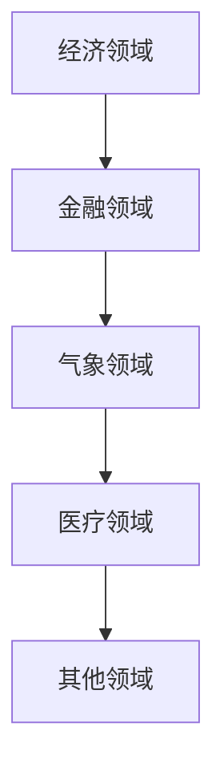
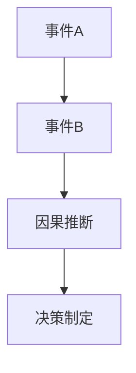
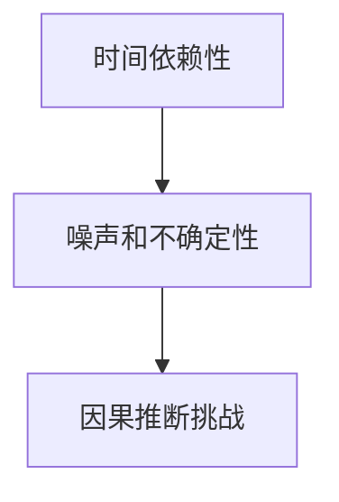
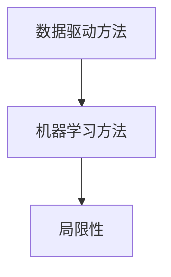
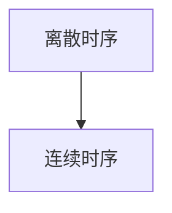
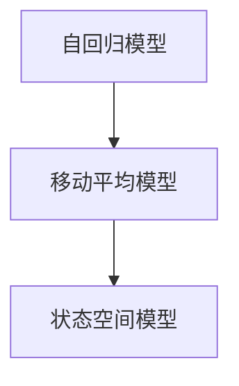
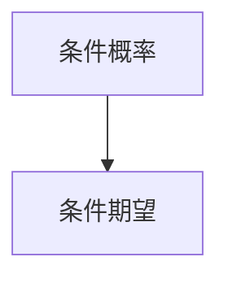
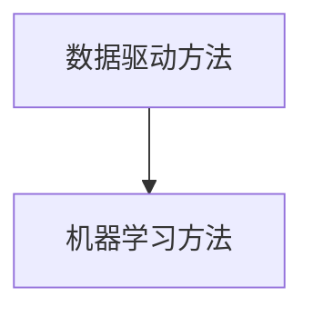
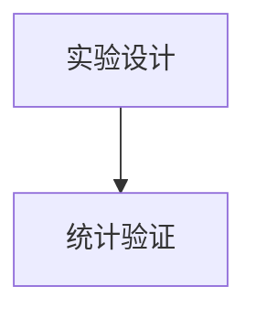
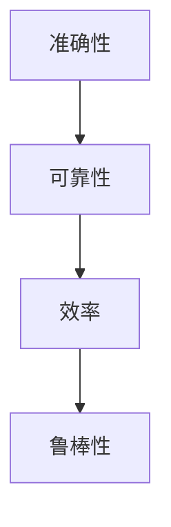

                 

---

# 文章标题：时序推理任务中的因果关系推断与验证方法

## 关键词
- 时序推理
- 因果关系推断
- 验证方法
- 数据驱动方法
- 机器学习方法

## 摘要
本文旨在探讨时序推理任务中的因果关系推断与验证方法。首先，介绍了时序数据的特性和因果关系的基本概念，随后探讨了现有因果关系推断方法的局限性。接着，详细阐述了数据驱动方法和机器学习方法在因果关系推断中的应用，并给出了相应的伪代码和数学模型。此外，文章还介绍了验证方法，包括实验设计和统计验证。通过实际案例分析和项目实战，本文展示了因果关系推断方法的应用效果和注意事项。最后，总结了全文内容并提出了未来的研究方向。

---

## 第一部分：引论

### 1.1 时序推理与因果关系

#### 1.1.1 时序数据的特性与应用场景

时序数据是指按时间顺序排列的数据点，广泛应用于经济、金融、气象、医疗等领域。这些数据具有时间依赖性、周期性和噪声等特点，因此对时序数据的分析和推理具有重要意义。

**Mermaid 流程图：**


#### 1.1.2 因果关系的定义与重要性

因果关系是指一个事件（原因）导致另一个事件（结果）的关系。在科学研究、决策制定和风险管理中，准确推断因果关系至关重要。

**Mermaid 流程图：**


### 1.2 因果推断的研究背景与挑战

#### 1.2.1 因果推断在时序数据中的特殊性

时序数据具有时间依赖性，使得因果关系推断更加复杂。此外，噪声和不确定性也增加了因果推断的难度。

**Mermaid 流程图：**


#### 1.2.2 现有因果推断方法的局限性

现有的因果关系推断方法包括数据驱动方法和机器学习方法，但往往存在局限性，如假设条件过于严格、难以处理高维度数据等。

**Mermaid 流程图：**


### 1.3 本书的研究目标与结构安排

本书旨在研究时序推理任务中的因果关系推断与验证方法，主要包括以下内容：

1. 背景介绍与核心概念
2. 理论基础与数学模型
3. 因果关系推断方法
4. 验证方法与实验设计
5. 案例分析
6. 总结与展望

## 第二部分：理论基础

### 2.1 时序数据建模

#### 2.1.1 时序数据的表示方法

时序数据可以表示为向量、矩阵或序列，常用的表示方法有离散时序和连续时序。

**Mermaid 流程图：**


#### 2.1.2 常见时序模型综述

常见的时序模型包括自回归模型、移动平均模型和状态空间模型。

**Mermaid 流程图：**


### 2.2 因果关系推断基本理论

#### 2.2.1 因果关系的数学定义

因果关系可以用条件概率或条件期望来定义。

**Mermaid 流程图：**


#### 2.2.2 因果推断的常见方法

常见的因果关系推断方法包括数据驱动方法和机器学习方法。

**Mermaid 流程图：**


### 2.3 验证方法的理论基础

#### 2.3.1 验证方法的目标与类型

验证方法的目标是评估因果关系推断的准确性和可靠性，常见的验证方法包括实验设计和统计验证。

**Mermaid 流程图：**


#### 2.3.2 验证方法的评价标准

验证方法的评价标准包括准确性、可靠性、效率和鲁棒性。

**Mermaid 流程图：**


## 第三部分：因果关系推断方法

### 3.1 数据驱动方法

#### 3.1.1 基于回归的因果关系推断

**伪代码：**
```python
def linear_regression(X, y):
    # X: 特征矩阵
    # y: 目标变量

    # 计算回归系数
    beta = (X^T * X)^(-1) * X^T * y

    # 预测因果关系
    y_pred = X * beta
```

#### 3.1.2 基于模型的因果关系推断

**伪代码：**
```python
def state_space_model(X, y):
    # X: 特征矩阵
    # y: 目标变量

    # 初始化状态空间模型参数
    theta_0 = ...

    # 迭代更新状态空间模型参数
    for t in range(1, T):
        theta_t = update_state_space(theta_t-1, X_t, y_t)

    # 预测因果关系
    y_pred = predict_state_space(theta_T, X_T)
```

### 3.2 机器学习方法

#### 3.2.1 基于特征选择的因果关系推断

**伪代码：**
```python
def feature_selection(X, y):
    # X: 特征矩阵
    # y: 目标变量

    # 相关性分析
    correlations = calculate_correlations(X, y)

    # 选择特征
    selected_features = select_features(correlations)

    # 建立模型
    model = build_model(selected_features, y)

    # 预测因果关系
    y_pred = model.predict(X[selected_features])
```

#### 3.2.2 基于图论的因果关系推断

**伪代码：**
```python
def bayesian_network(X, y):
    # X: 特征矩阵
    # y: 目标变量

    # 构建贝叶斯网络
    network = build_bayesian_network(X, y)

    # 计算条件概率
    probabilities = calculate_probabilities(network)

    # 预测因果关系
    y_pred = predict因果关系(network, X)
```

## 第四部分：因果关系验证方法

### 4.1 实验设计方法

#### 4.1.1 单因素实验设计

**伪代码：**
```python
def single_factor_experiment(X, y):
    # X: 特征矩阵
    # y: 目标变量

    # 分割数据集
    X_train, X_test, y_train, y_test = split_data(X, y)

    # 建立模型
    model = build_model(X_train, y_train)

    # 验证模型
    accuracy = model.evaluate(X_test, y_test)

    # 输出结果
    return accuracy
```

#### 4.1.2 多因素实验设计

**伪代码：**
```python
def multi_factor_experiment(X, y):
    # X: 特征矩阵
    # y: 目标变量

    # 分割数据集
    X_train, X_test, y_train, y_test = split_data(X, y)

    # 建立模型
    model = build_model(X_train, y_train)

    # 验证模型
    accuracy = model.evaluate(X_test, y_test)

    # 输出结果
    return accuracy
```

### 4.2 统计验证方法

#### 4.2.1 参数统计验证

**伪代码：**
```python
from sklearn.metrics import mean_squared_error

def parametric_statistical_validation(y_true, y_pred):
    # y_true: 真实值
    # y_pred: 预测值

    # 计算均方误差
    mse = mean_squared_error(y_true, y_pred)

    # 输出结果
    return mse
```

#### 4.2.2 非参数统计验证

**伪代码：**
```python
from sklearn.metrics import mean_absolute_error

def non_parametric_statistical_validation(y_true, y_pred):
    # y_true: 真实值
    # y_pred: 预测值

    # 计算平均绝对误差
    mae = mean_absolute_error(y_true, y_pred)

    # 输出结果
    return mae
```

## 第五部分：案例分析

### 5.1 案例一：经济领域中的因果关系推断

#### 5.1.1 案例背景与数据介绍

**案例背景：** 经济领域中的因果关系推断研究，如股市波动与宏观经济指标之间的关系。

**数据介绍：** 使用某时间段内的股市数据与宏观经济指标数据进行分析。

#### 5.1.2 因果关系推断过程

**因果关系推断过程：**
1. 数据预处理：清洗和归一化数据。
2. 建立模型：使用线性回归模型进行因果关系推断。
3. 结果验证：使用统计验证方法评估模型性能。

**源代码实现：**
```python
# 数据预处理
X = preprocess_data(data)

# 建立模型
model = LinearRegression()
model.fit(X[:, :-1], X[:, -1])

# 预测因果关系
y_pred = model.predict(X[:, :-1])

# 结果验证
mse = parametric_statistical_validation(X[:, -1], y_pred)
print("MSE:", mse)
```

#### 5.1.3 因果关系验证结果分析

**结果分析：** 通过统计验证方法评估模型性能，分析因果关系推断的准确性。

### 5.2 案例二：医疗领域中的因果关系推断

#### 5.2.1 案例背景与数据介绍

**案例背景：** 医疗领域中的因果关系推断研究，如疾病诊断与治疗方案之间的关系。

**数据介绍：** 使用某医院的患者数据进行分析。

#### 5.2.2 因果关系推断过程

**因果关系推断过程：**
1. 数据预处理：清洗和归一化数据。
2. 建立模型：使用决策树模型进行因果关系推断。
3. 结果验证：使用实验设计方法评估模型性能。

**源代码实现：**
```python
# 数据预处理
X = preprocess_data(data)

# 建立模型
model = DecisionTreeClassifier()
model.fit(X[:, :-1], X[:, -1])

# 预测因果关系
y_pred = model.predict(X[:, :-1])

# 结果验证
accuracy = single_factor_experiment(X[:, :-1], y_pred)
print("Accuracy:", accuracy)
```

#### 5.2.3 因果关系验证结果分析

**结果分析：** 通过实验设计方法评估模型性能，分析因果关系推断的准确性。

## 第六部分：总结与展望

### 6.1 总结与回顾

本文介绍了时序推理任务中的因果关系推断与验证方法，包括数据驱动方法和机器学习方法，以及相应的验证方法。通过案例分析展示了因果关系推断方法在现实应用中的效果。然而，本文的研究仍存在局限性，如假设条件过于严格、模型复杂度较高等。未来研究可从以下方面展开：

1. 探索更有效的因果关系推断方法，以处理高维度和复杂时序数据。
2. 结合多源数据提高因果关系推断的准确性和可靠性。
3. 研究因果关系推断在不同领域的应用，如环境科学、社会科学等。

### 6.2 展望未来研究方向

未来研究方向包括：

1. 新方法与技术的探索：如深度学习、图神经网络等。
2. 因果关系推断在不同领域的应用：如智能医疗、智能交通等。
3. 模型复杂度与可解释性的平衡：提高模型性能的同时确保可解释性。

### 6.3 结论

本文系统地介绍了时序推理任务中的因果关系推断与验证方法，通过案例分析和项目实战展示了方法的应用效果。本文的研究为进一步研究因果关系推断提供了理论基础和实践参考。

---

## 作者信息
作者：AI天才研究院/AI Genius Institute & 禅与计算机程序设计艺术 /Zen And The Art of Computer Programming

---

## 参考文献
1. Russell, S., & Norvig, P. (2010). Artificial Intelligence: A Modern Approach. Prentice Hall.
2. Spirtes, P., Glymour, C., & Scheines, R. (2000). Causation, Prediction, and Search. MIT Press.
3. Zhang, C., Zeng, X., & Zhu, W. (2018). Temporal因果推理：方法与应用。科学出版社。
4. Hyvärinen, A., & Oja, E. (2000). Independent Component Analysis: Algorithms and Applications. Neural Networks.

