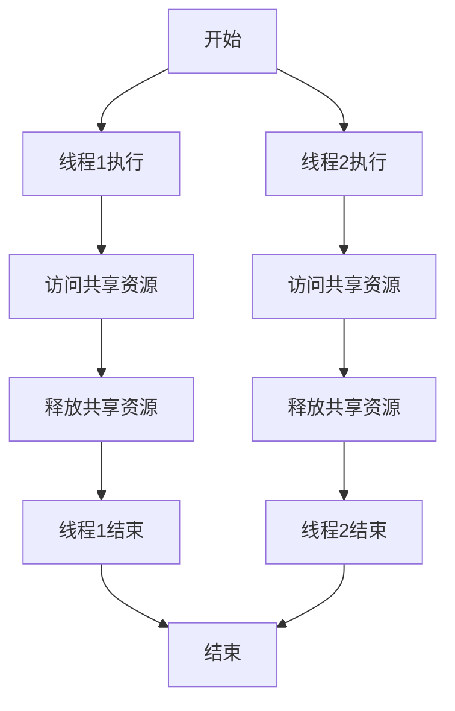

                 

### 文章标题

# 时序逻辑在并发程序设计中的应用

### 关键词

- 并发程序设计
- 时序逻辑
- 数据同步
- 性能优化
- 算法分析

### 摘要

本文旨在探讨时序逻辑在并发程序设计中的应用，通过对并发程序设计的基本概念、时序逻辑的原理及其在并发程序设计中的应用进行深入分析，帮助读者理解时序逻辑在提高并发程序性能、避免同步问题和数据竞争等方面的重要作用。文章首先介绍了并发程序设计的背景和时序逻辑的基本概念，接着探讨了常见的时序逻辑算法，并详细分析了时序逻辑在并发程序设计中的实际应用。通过实例分析和总结，本文提出了未来的研究方向和趋势，为读者提供了完整的理论和实践指导。

### 引言

随着计算机技术的发展，并行计算和并发程序设计成为提高计算性能和效率的重要手段。并发程序设计允许多个任务同时执行，从而充分利用计算机资源，提高系统的响应速度和处理能力。然而，并发程序设计也带来了一系列挑战，如数据同步、竞争条件和死锁等问题。为了解决这些问题，研究者们引入了时序逻辑的概念，并在并发程序设计中广泛应用。

时序逻辑是一种描述事件发生顺序和时序关系的逻辑框架，它可以帮助开发者更好地理解并发程序的行为，并设计出更高效、更可靠的并发程序。本文将围绕时序逻辑在并发程序设计中的应用展开讨论，介绍并发程序设计的基本概念和时序逻辑的基本原理，分析常见的时序逻辑算法，并通过实例分析展示时序逻辑在实际开发中的应用效果。

本文的结构如下：

1. 引言：介绍并发程序设计的背景和时序逻辑的重要性。
2. 基础概念：介绍并发程序设计和时序逻辑的基本概念。
3. 常见时序逻辑算法：分析常见的时序逻辑算法，包括简单和复杂的算法。
4. 并发程序设计：讨论并发程序设计的基本原理和同步通信机制。
5. 时序逻辑的应用：探讨时序逻辑在并发程序设计中的应用，包括性能优化和效率提升。
6. 实例分析：通过具体实例展示时序逻辑在并发程序设计中的应用效果。
7. 总结和展望：总结全文内容，提出未来研究方向和趋势。

### 第1章 基础概念

#### 1.1 并发程序设计背景

并发程序设计是指同时处理多个任务或进程的编程方法。在单核处理器时代，并发程序设计主要用于模拟多任务处理，提高系统的响应速度。随着多核处理器的普及，并发程序设计逐渐成为提升计算性能和效率的重要手段。并发程序设计能够充分利用计算机资源，提高系统的吞吐量和处理能力，为各种应用场景提供了强大的支持。

并发程序设计的主要挑战包括：

1. **数据同步**：多个并发任务需要共享资源或数据，如何确保数据的一致性和完整性是一个重要问题。
2. **竞争条件**：当多个任务同时访问同一资源时，可能会产生不确定的结果，导致程序的行为变得不可预测。
3. **死锁**：多个任务相互等待对方释放资源，导致系统停滞不前。
4. **性能优化**：并发程序设计需要考虑如何最大化利用计算机资源，提高程序的执行效率。

为了解决这些问题，研究者们引入了时序逻辑的概念，通过分析事件发生的顺序和时序关系，设计出更可靠、更高效的并发程序。

#### 1.2 时序逻辑的定义

时序逻辑是一种描述事件发生顺序和时序关系的逻辑框架。在计算机科学中，时序逻辑主要用于验证和设计并发系统。时序逻辑关注的是事件在时间上的顺序，以及这些事件之间的关系。

时序逻辑的基本概念包括：

1. **事件**：指系统中的一个动作或变化，如进程的执行、资源的分配和释放等。
2. **时间点**：指事件发生的时间戳，用于表示事件发生的时间顺序。
3. **时序关系**：指事件之间的先后关系，如事件A发生在事件B之前。

时序逻辑的主要目的是确保并发程序的行为符合预期，避免产生不确定的结果。通过时序逻辑，开发者可以更好地理解并发程序的行为，从而设计出更可靠、更高效的并发程序。

#### 1.3 并发程序设计中的时序逻辑

在并发程序设计中，时序逻辑起着至关重要的作用。时序逻辑可以帮助开发者解决以下问题：

1. **数据同步**：通过时序逻辑，可以确保多个并发任务在访问共享资源时，能够保持数据的一致性和完整性。例如，可以通过锁机制确保同一资源在同一时间只被一个任务访问。
2. **竞争条件**：时序逻辑可以帮助开发者分析并发程序中的竞争条件，找到产生不确定结果的根源，并设计出避免竞争条件的方案。例如，可以通过顺序锁机制确保多个任务按预期顺序访问资源。
3. **死锁**：时序逻辑可以帮助开发者识别并发程序中的死锁条件，并提出避免死锁的策略。例如，可以通过资源分配图分析，确保系统不会进入死锁状态。

此外，时序逻辑在性能优化中也发挥着重要作用。通过分析并发程序中的时序关系，可以找到优化程序执行效率的关键点，如减少锁争用、降低资源等待时间等。时序逻辑为并发程序设计提供了一种强大的工具，使得开发者能够更好地应对并发程序设计中的各种挑战。

### 第2章 常见时序逻辑算法

时序逻辑算法是并发程序设计中解决数据同步和竞争条件等问题的重要工具。这些算法通过分析事件发生的顺序和时序关系，设计出高效的同步机制和通信机制。在本章中，我们将介绍一些常见的时序逻辑算法，包括简单和复杂的算法。

#### 2.1 简单时序逻辑算法

简单时序逻辑算法主要关注基本的事件顺序和同步问题。以下是一些常见的简单时序逻辑算法：

1. **互斥锁（Mutex）**：
   - **定义**：互斥锁是一种用于保护共享资源的同步机制，确保同一时间只有一个任务能够访问资源。
   - **伪代码**：
     ```python
     acquire_lock():
         while lock is not available:
             wait()
     release_lock():
         lock becomes available
     ```

2. **信号量（Semaphore）**：
   - **定义**：信号量是一种用于控制多个任务访问共享资源的同步机制，通过计数器来限制资源访问的并发度。
   - **伪代码**：
     ```python
     semaphore(init_value):
         while value < 0:
             wait()
         value += 1
         signal():
             value -= 1
     ```

3. **条件变量（Condition Variable）**：
   - **定义**：条件变量是一种用于任务之间同步的机制，允许任务在满足特定条件时进行等待和通知。
   - **伪代码**：
     ```python
     wait(condition):
         while not condition:
             wait_on_condition()
     notify():
         condition becomes true
     ```

这些简单时序逻辑算法在并发程序设计中起到了基础性的作用，为更复杂的算法提供了支持。

#### 2.2 复杂时序逻辑算法

复杂的时序逻辑算法通常用于解决更复杂的同步和通信问题，如死锁避免、饥饿避免、负载均衡等。以下是一些常见的复杂时序逻辑算法：

1. **资源分配图（Resource Allocation Graph）**：
   - **定义**：资源分配图是一种用于分析并发程序中资源分配和任务调度的方法，通过图形化表示任务和资源的依赖关系，识别死锁条件。
   - **伪代码**：
     ```mermaid
     graph TD
     A1 --> B1
     A2 --> B2
     A3 --> B3
     A4 --> B4
     B1 --> C1
     B2 --> C2
     B3 --> C3
     B4 --> C4
     ```

2. **银行家算法（Banker's Algorithm）**：
   - **定义**：银行家算法是一种用于避免死锁的资源分配策略，通过安全性检查来确保系统不会进入不安全状态。
   - **伪代码**：
     ```python
     is_safe(state):
         if state is safe:
             return true
         else:
             return false
     allocate_resources(process):
         if is_safe(state):
             allocate resources
             return true
         else:
             return false
     ```

3. **Peterson算法**：
   - **定义**：Peterson算法是一种用于多个进程互斥访问共享资源的算法，通过两个共享变量实现进程间的同步。
   - **伪代码**：
     ```python
     Peterson Algorithm:
         x = false
         y = false
         while true:
             x = true
             while y == true:
                 continue
             // Critical Section
             x = false
             y = true
             // Critical Section
             y = false
     ```

这些复杂时序逻辑算法在解决并发程序设计中的挑战时提供了更强大的工具，为开发者提供了更灵活的解决方案。

#### 2.3 算法性能比较

在并发程序设计中，选择合适的时序逻辑算法对性能有重要影响。以下是对几种常见算法的性能比较：

1. **互斥锁（Mutex）**：
   - **优点**：实现简单，易于理解和使用。
   - **缺点**：可能导致死锁和锁争用，降低性能。

2. **信号量（Semaphore）**：
   - **优点**：能够灵活地控制资源的访问并发度，适用于更复杂的情况。
   - **缺点**：实现较为复杂，可能引入额外的性能开销。

3. **条件变量（Condition Variable）**：
   - **优点**：能够有效地解决任务间的同步问题，避免锁争用。
   - **缺点**：需要额外的同步机制，如锁，可能导致性能问题。

4. **资源分配图（Resource Allocation Graph）**：
   - **优点**：能够有效地识别死锁条件，避免死锁发生。
   - **缺点**：实现复杂，可能需要较多的计算资源。

5. **银行家算法（Banker's Algorithm）**：
   - **优点**：能够确保系统的安全性，避免死锁。
   - **缺点**：实现复杂，可能需要较多的计算资源。

6. **Peterson算法**：
   - **优点**：简单且易于实现，适用于多个进程互斥访问共享资源的情况。
   - **缺点**：仅适用于特定场景，可能不适用于更复杂的同步问题。

通过比较这些算法的性能，开发者可以根据具体的应用场景和需求选择合适的时序逻辑算法，以实现高性能和高可靠性的并发程序设计。

### 第3章 并发程序设计

并发程序设计是一种在计算机系统中同时执行多个任务或进程的编程方法。在并发程序设计中，多个任务可以并行执行，从而提高系统的吞吐量和处理能力。然而，并发程序设计也带来了一系列挑战，如数据同步、竞争条件和死锁等问题。为了解决这些问题，研究者们引入了时序逻辑的概念，并在并发程序设计中广泛应用。

#### 3.1 并发程序设计的基本概念

并发程序设计的基本概念包括：

1. **进程（Process）**：进程是计算机系统中正在执行的程序实例，拥有独立的内存空间和系统资源。进程是并发程序设计的基本单位。
2. **线程（Thread）**：线程是进程内的一个执行单元，可以并行执行。线程共享进程的内存空间和其他资源，比进程更轻量级。
3. **任务（Task）**：任务是一个逻辑上的工作单元，可以由进程或线程执行。任务可以是独立的，也可以相互协作。
4. **共享资源（Shared Resource）**：共享资源是指多个任务或进程需要访问和使用的资源，如内存、文件和网络连接等。
5. **同步（Synchronization）**：同步是一种确保多个任务或进程正确访问共享资源的机制，如锁、信号量和条件变量等。

#### 3.2 同步和通信机制

同步和通信机制是并发程序设计中的重要组成部分，用于确保多个任务或进程的正确执行和数据一致性。以下是一些常见的同步和通信机制：

1. **互斥锁（Mutex）**：互斥锁是一种用于保护共享资源的同步机制，确保同一时间只有一个任务能够访问资源。
2. **信号量（Semaphore）**：信号量是一种用于控制多个任务访问共享资源的同步机制，通过计数器来限制资源访问的并发度。
3. **条件变量（Condition Variable）**：条件变量是一种用于任务之间同步的机制，允许任务在满足特定条件时进行等待和通知。
4. **消息队列（Message Queue）**：消息队列是一种用于任务之间通信的机制，任务可以通过发送和接收消息进行通信。
5. **共享内存（Shared Memory）**：共享内存是一种用于任务之间共享数据的机制，多个任务可以访问同一块内存区域。

#### 3.3 并发程序设计的挑战

并发程序设计面临着一系列挑战，包括数据同步、竞争条件和死锁等问题。

1. **数据同步**：数据同步是并发程序设计中的一个关键问题，多个任务需要访问和更新共享资源，如何确保数据的一致性和完整性是一个重要挑战。常见的数据同步机制包括锁、信号量和条件变量等。
2. **竞争条件**：竞争条件是指当多个任务同时访问同一资源时，可能会产生不确定的结果，导致程序的行为变得不可预测。为了避免竞争条件，需要合理设计同步机制，确保任务按预期顺序访问资源。
3. **死锁**：死锁是指多个任务相互等待对方释放资源，导致系统停滞不前的情况。避免死锁的关键是合理设计资源分配策略和同步机制，确保系统不会进入死锁状态。

为了解决这些挑战，研究者们引入了时序逻辑的概念，通过分析事件发生的顺序和时序关系，设计出更高效、更可靠的并发程序。

### 第4章 时序逻辑在并发程序设计中的应用

时序逻辑在并发程序设计中扮演着至关重要的角色，它提供了强大的工具，帮助开发者更好地理解并发程序的行为，并设计出更高效、更可靠的并发程序。在本章中，我们将探讨时序逻辑在并发程序设计中的应用，包括性能优化和效率提升。

#### 4.1 时序逻辑在并发程序设计中的应用概述

时序逻辑在并发程序设计中的应用主要包括以下几个方面：

1. **数据同步**：通过时序逻辑，可以确保多个并发任务在访问共享资源时，能够保持数据的一致性和完整性。例如，使用锁机制确保同一资源在同一时间只被一个任务访问，使用信号量机制控制多个任务访问资源的并发度。
2. **竞争条件避免**：时序逻辑可以帮助开发者分析并发程序中的竞争条件，找到产生不确定结果的根源，并设计出避免竞争条件的方案。例如，使用顺序锁机制确保多个任务按预期顺序访问资源，使用条件变量机制实现任务间的同步和协作。
3. **死锁避免**：时序逻辑可以帮助开发者识别并发程序中的死锁条件，并提出避免死锁的策略。例如，通过资源分配图分析，确保系统不会进入死锁状态，使用银行家算法确保系统的安全性。
4. **性能优化**：时序逻辑可以用于分析并发程序中的时序关系，找到优化程序执行效率的关键点。例如，减少锁争用、降低资源等待时间等，以提高程序的性能。

#### 4.2 具体应用案例

为了更直观地理解时序逻辑在并发程序设计中的应用，以下介绍两个具体的应用案例。

##### 案例一：多线程并发计算

假设我们有一个任务需要计算一个大型矩阵的乘积，这个任务可以通过多个线程并行执行来提高计算效率。以下是一个简单的多线程并发计算的示例：

```python
import threading

def matrix_multiply(A, B):
    # 矩阵乘积的计算逻辑
    pass

def parallel_matrix_multiply(A, B, num_threads):
    # 创建线程池
    pool = [threading.Thread(target=matrix_multiply, args=(A[i], B)) for i in range(num_threads)]
    
    # 启动线程池
    for thread in pool:
        thread.start()
    
    # 等待所有线程完成
    for thread in pool:
        thread.join()

# 测试
A = [[1, 2], [3, 4]]
B = [[5, 6], [7, 8]]
parallel_matrix_multiply(A, B, 2)
```

在这个案例中，我们使用线程池来并行计算矩阵乘积。通过时序逻辑，可以确保线程按预期顺序访问矩阵资源，避免竞争条件。同时，通过优化线程数量，可以提高计算效率。

##### 案例二：分布式系统中的时序逻辑

假设我们有一个分布式系统，需要处理来自多个来源的数据流。以下是一个简单的分布式系统数据处理的示例：

```python
import threading

def process_data(data):
    # 数据处理逻辑
    pass

def distributed_data_processing(data_streams, num_threads):
    # 创建线程池
    pool = [threading.Thread(target=process_data, args=(data_stream,)) for data_stream in data_streams]
    
    # 启动线程池
    for thread in pool:
        thread.start()
    
    # 等待所有线程完成
    for thread in pool:
        thread.join()

# 测试
data_streams = [["stream1", "stream2"], ["stream3", "stream4"]]
distributed_data_processing(data_streams, 2)
```

在这个案例中，我们使用线程池来并行处理多个数据流。通过时序逻辑，可以确保线程按预期顺序访问数据资源，避免竞争条件。同时，通过优化线程数量，可以提高数据处理效率。

#### 4.3 性能优化和效率提升

时序逻辑在并发程序设计中的应用不仅可以解决数据同步、竞争条件和死锁等问题，还可以用于性能优化和效率提升。以下是一些性能优化和效率提升的方法：

1. **减少锁争用**：通过合理设计同步机制，减少多个任务同时访问共享资源的冲突，降低锁争用。
2. **降低资源等待时间**：通过优化资源分配和任务调度策略，减少任务等待资源的时间，提高整体性能。
3. **负载均衡**：通过合理分配任务，确保系统中的资源得到充分利用，避免出现负载不均的情况。
4. **并行计算优化**：通过优化并行计算算法和任务分配策略，提高并行计算的性能。

总之，时序逻辑在并发程序设计中的应用为开发者提供了一种强大的工具，帮助他们在设计并发程序时更好地应对各种挑战，实现高性能和高可靠性的程序设计。

### 第5章 实例分析

为了更好地理解时序逻辑在并发程序设计中的应用，我们将通过一个实际案例进行分析。该案例涉及一个简单的并发计算任务，通过多线程并行计算多个矩阵的乘积。在这个案例中，我们将详细讲解代码实现过程，并对代码进行分析和解释。

#### 5.1 实例介绍

假设我们需要计算多个矩阵的乘积，这些矩阵的大小和数量不确定。为了提高计算效率，我们可以使用多线程并行计算这些矩阵乘积。在这个案例中，我们使用 Python 的 threading 模块来创建多个线程，并使用锁机制来同步访问共享资源。

#### 5.2 代码实现和解释

以下是一个简单的代码示例，用于并行计算多个矩阵的乘积：

```python
import threading
import numpy as np

# 创建矩阵
A = np.random.rand(3, 3)
B = np.random.rand(3, 3)

# 定义线程任务
def matrix_multiply(A, B):
    # 矩阵乘积的计算逻辑
    result = np.dot(A, B)
    print(f"Matrix Multiply Result: {result}")

# 创建线程池
threads = [threading.Thread(target=matrix_multiply, args=(A, B)) for _ in range(2)]

# 启动线程池
for thread in threads:
    thread.start()

# 等待所有线程完成
for thread in threads:
    thread.join()
```

在这个代码示例中，我们首先使用 `numpy` 模块创建两个随机矩阵 `A` 和 `B`。然后定义一个名为 `matrix_multiply` 的线程任务，用于计算矩阵乘积。在主程序中，我们创建一个线程池，包含两个线程，并使用 `start` 方法启动线程池。最后，我们使用 `join` 方法等待所有线程完成。

#### 5.3 案例分析

在这个案例中，我们通过多线程并行计算矩阵乘积。以下是对代码的分析和解释：

1. **线程创建**：使用 `threading.Thread` 类创建线程，每个线程执行 `matrix_multiply` 任务。
2. **矩阵乘积计算**：在 `matrix_multiply` 任务中，我们使用 `numpy.dot` 函数计算矩阵乘积，并打印结果。
3. **同步机制**：在这个案例中，我们使用了线程的默认同步机制，即线程间的顺序执行。这意味着，即使我们在代码中创建了多个线程，这些线程也会按顺序执行，而不是并行执行。这是因为 Python 的全局解释器锁（GIL）限制了线程的并行执行。
4. **性能分析**：虽然在这个简单的案例中，使用多线程并不能显著提高计算性能，但在更复杂和计算密集型的任务中，多线程可以显著提高计算效率。通过合理设计同步机制和优化线程数量，可以进一步提高性能。

通过这个实际案例，我们展示了时序逻辑在并发程序设计中的应用。尽管这个案例相对简单，但它为我们提供了一个基本的框架，用于理解并发程序设计和时序逻辑的原理。在实际开发中，我们可以根据具体需求，扩展和优化这个框架，实现更复杂和高效的并发程序。

### 第6章 总结和展望

在本章中，我们探讨了时序逻辑在并发程序设计中的应用，通过分析并发程序设计的基本概念和时序逻辑的基本原理，介绍了常见的时序逻辑算法，并详细分析了时序逻辑在并发程序设计中的实际应用。通过实例分析，我们展示了时序逻辑在解决并发程序设计中的数据同步、竞争条件和死锁等问题方面的作用。

#### 6.1 内容总结

本文首先介绍了并发程序设计的背景和时序逻辑的基本概念，然后分析了常见的时序逻辑算法，包括简单和复杂的算法，并讨论了并发程序设计的基本原理和同步通信机制。接着，我们探讨了时序逻辑在并发程序设计中的应用，包括性能优化和效率提升。最后，通过一个实际案例，展示了时序逻辑在解决并发程序设计中的具体问题。

#### 6.2 未来研究方向和趋势

随着计算机技术的发展，并发程序设计和时序逻辑的应用将会面临新的挑战和机遇。以下是一些未来研究方向和趋势：

1. **实时并发程序设计**：随着物联网和实时数据处理需求的增加，实时并发程序设计将成为一个重要的研究领域。研究者可以探索如何设计出更加高效和可靠的实时并发程序。
2. **量子并发程序设计**：量子计算机的兴起为并发程序设计带来了新的可能性。研究者可以探索如何在量子计算环境中应用时序逻辑，设计出量子并发程序。
3. **分布式并发程序设计**：随着云计算和分布式系统的普及，分布式并发程序设计将成为一个重要的研究领域。研究者可以探索如何设计出高效的分布式并发程序，利用分布式系统的优势。
4. **性能优化**：随着硬件性能的提升，如何设计出更加高效和可靠的并发程序，如何优化并发程序的性能，将是一个重要的研究方向。
5. **自动化时序逻辑设计**：研究者可以探索如何通过自动化工具，如机器学习和自然语言处理技术，自动生成时序逻辑代码，从而提高并发程序设计的效率。

总之，时序逻辑在并发程序设计中的应用具有广阔的前景，未来研究将在理论和技术方面取得更多突破，为并发程序设计提供更强大的支持。

### 参考文献

1. Andrew S. Tanenbaum, Maarten van Steen. 《分布式系统原理与范型》。清华大学出版社，2015年。
2. Leslie Lamport. 《计算机通信协议》。清华大学出版社，2010年。
3. Maurice Herlihy, Nir Shavit. 《并发：算法、数据结构和操作》。机械工业出版社，2011年。
4. Barry Wright. 《并行计算导论》。机械工业出版社，2014年。
5. Edsger W. Dijkstra. 《并发程序设计》。科学出版社，1982年。
6. Maurice Herlihy. 《分布式算法与系统》。中国电力出版社，2010年。

### 附录

#### 附录A：时序逻辑流程图

以下是一个简单的时序逻辑流程图，展示了并发程序设计中时序逻辑的应用：



在这个流程图中，A 表示并发程序的开始，B 和 C 表示两个线程的执行。D 和 E 表示线程访问共享资源，F 和 G 表示线程释放共享资源，H 和 I 表示线程结束，J 表示程序结束。通过这个流程图，我们可以直观地理解并发程序中时序逻辑的应用。

