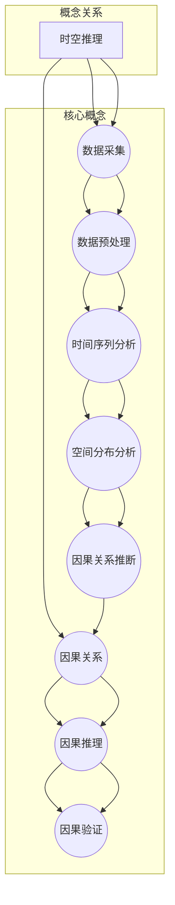

                 

### 文章标题

# 时空推理任务中的因果关系推断与验证

### 关键词

- 时空推理
- 因果关系推断
- 因果关系验证
- 机器学习算法
- 图神经网络
- 实际案例

### 摘要

本文深入探讨了时空推理任务中的因果关系推断与验证问题。首先，我们介绍了时空推理和因果关系推断的基本概念，并给出了它们之间的联系。接着，我们详细讲解了因果关系推断的几种主要算法，包括统计学方法和基于机器学习及图神经网络的方法。随后，我们介绍了如何验证因果关系推断的准确性，并提出了几种评估指标。最后，通过实际项目案例，我们展示了如何在实际应用中运用这些算法和验证方法。本文旨在为从事人工智能和数据分析领域的研究者提供有价值的参考。

---

### 引言

随着人工智能技术的飞速发展，时空推理任务在多个领域得到了广泛应用，如自动驾驶、智能监控、医疗诊断等。在这些应用场景中，理解并推断时空数据中的因果关系对于决策和支持系统性能至关重要。因果关系推断不仅有助于预测未来的事件，还能帮助揭示隐藏在数据背后的规律，从而为优化系统和策略提供依据。

本文旨在深入探讨时空推理任务中的因果关系推断与验证问题。具体而言，我们将从以下几个方面展开：

1. **背景介绍**：介绍时空推理和因果关系推断的基本概念及其在现实中的应用场景。
2. **核心概念与联系**：阐述时空推理和因果关系推断之间的联系，并给出概念关系架构。
3. **因果关系推断算法**：介绍常见的因果关系推断算法，包括统计学方法和机器学习算法。
4. **因果关系验证**：探讨如何验证因果关系推断的准确性，并介绍评估指标。
5. **项目实战**：通过实际项目案例，展示如何应用这些算法和验证方法。
6. **总结与展望**：总结本文的主要发现，并探讨未来的研究方向。

通过本文的探讨，我们希望为从事人工智能和数据分析领域的研究者提供有价值的参考，并促进相关技术的发展和应用。

### 背景介绍

#### 时空推理的基本概念

时空推理（Spatio-Temporal Reasoning）是一种在时间和空间维度上对数据进行分析和处理的能力。在人工智能领域，时空推理广泛应用于自动驾驶、智能监控、环境监测和医学诊断等多个场景。其核心在于理解并推理出时空数据中的动态变化规律和潜在因果关系。

时空数据通常由时间和空间两个维度组成。时间维度表示数据的采集时间，空间维度则表示数据发生的地点。在自动驾驶中，时空推理可以帮助车辆理解周围环境的变化，从而做出安全驾驶决策。在智能监控中，通过对监控视频的时空分析，可以实时检测异常行为，提高公共安全。在环境监测中，通过对时空数据的分析，可以识别污染源，优化环境治理策略。在医学诊断中，时空推理有助于分析病人的病史和实时健康数据，提高诊断准确率和治疗效果。

#### 因果关系推断的基本概念

因果关系推断（Causal Inference）是指从观察数据中识别出因果关系的推理过程。因果关系是事件之间的根本联系，它能够揭示一个事件如何影响另一个事件。在科学研究中，因果关系推断是理解自然现象和制定有效政策的关键。例如，在医学研究中，通过因果关系推断，可以确定某个药物是否真正有效，而不是仅仅观察其与治疗效果之间的相关性。

在人工智能领域，因果关系推断主要用于模型解释性和可解释性问题。随着深度学习模型在各个领域的广泛应用，模型的可解释性成为了一个重要问题。通过因果关系推断，可以理解模型内部是如何进行推理和决策的，从而提高模型的透明度和可信度。

#### 时空推理与因果关系推断的联系

时空推理和因果关系推断之间存在紧密的联系。在时空数据中，因果关系往往通过时间序列和空间分布来体现。时空推理为因果关系推断提供了数据基础，而因果关系推断则为时空推理提供了理论支持。

具体来说，时空推理可以帮助识别数据中的潜在因果关系。例如，在医疗诊断中，通过分析病人的病史数据和实时健康数据，可以推断出某些疾病症状之间的因果关系。同样，在环境监测中，通过分析污染物的时空分布，可以推断出污染源的位置和扩散路径。

另一方面，因果关系推断可以优化时空推理模型的性能。通过识别和验证因果关系，可以减少模型对无关变量的依赖，提高模型对关键因素的识别能力。例如，在自动驾驶中，通过因果关系推断，可以确定哪些环境因素对驾驶安全有重要影响，从而优化自动驾驶系统的决策策略。

总的来说，时空推理和因果关系推断是相辅相成的两个领域。通过结合这两种方法，可以更深入地理解和利用时空数据，提高人工智能系统的性能和可信度。

### 核心概念与联系

为了更好地理解时空推理任务中的因果关系推断，我们需要梳理其中的核心概念及其相互联系。以下是几个关键概念及其关系的Mermaid流程图表示：



#### 数据采集与预处理

数据采集是时空推理任务的基础。在数据采集阶段，我们需要从各种传感器、数据库和日志中收集时空数据。数据可能包括位置信息、时间戳、传感器读数等。然而，采集到的数据通常是不完整、不精确和有噪声的。因此，数据预处理变得至关重要。数据预处理包括数据清洗、数据整合、数据转换和数据归一化等步骤，以确保数据质量。

#### 时间序列分析与空间分布分析

时空数据在时间和空间维度上具有复杂的结构。时间序列分析主要关注时间维度上的数据变化规律，包括趋势分析、季节性分析、周期性分析和异常检测等。通过时间序列分析，我们可以捕捉数据的时间趋势和模式，为因果关系推断提供线索。

空间分布分析则关注空间维度上的数据分布特征，包括聚类分析、空间相关性分析和地理信息系统（GIS）分析等。通过空间分布分析，我们可以了解数据在空间上的分布规律和相互关系，进一步揭示潜在的因果关系。

#### 因果关系推断

因果关系推断是时空推理任务的核心。在因果关系推断过程中，我们试图从时空数据中识别出事件之间的因果关系。这通常通过建立因果模型和利用机器学习算法来实现。因果关系推断可以帮助我们理解数据背后的逻辑和规律，从而为决策支持提供依据。

#### 因果关系验证

因果关系推断并非绝对准确，因此需要对推断结果进行验证。因果关系验证包括评估因果关系推断的准确性、可靠性和一致性。常用的验证方法包括数据对比、模型验证和实验设计等。通过验证，我们可以确保因果关系推断的有效性和可信度。

#### 概念关系架构

通过上述核心概念的梳理，我们可以看到时空推理、时间序列分析、空间分布分析、因果关系推断和因果关系验证之间相互关联，构成了一个完整的因果关系推断与验证框架。这个框架不仅帮助我们理解时空数据中的因果关系，还提高了模型的可解释性和可靠性。

### 因果关系推断算法

在时空推理任务中，因果关系推断是关键步骤。以下将介绍几种常见的因果关系推断算法，包括基于统计学的方法、基于机器学习的方法以及基于图神经网络的方法。

#### 基于统计学的方法

**单变量分析**：单变量分析是最简单的因果关系推断方法，通常用于分析单个变量与结果变量之间的关系。常见的方法包括线性回归、方差分析（ANOVA）和自相关分析。线性回归模型可以表示为：

$$y = \beta_0 + \beta_1 \cdot x + \epsilon$$

其中，$y$ 是结果变量，$x$ 是解释变量，$\beta_0$ 和 $\beta_1$ 分别是模型的截距和斜率，$\epsilon$ 是误差项。

**多变量分析**：多变量分析考虑多个解释变量对结果变量的影响。最常用的方法是多元线性回归：

$$y = \beta_0 + \beta_1 \cdot x_1 + \beta_2 \cdot x_2 + ... + \beta_n \cdot x_n + \epsilon$$

其中，$x_1, x_2, ..., x_n$ 是多个解释变量，$\beta_1, \beta_2, ..., \beta_n$ 分别是各自对应的系数。

**时间序列分析**：时间序列分析主要用于分析时间维度上的数据变化规律。常见的方法包括自回归移动平均模型（ARIMA）、向量自回归模型（VAR）和状态空间模型（SSM）。ARIMA模型可以表示为：

$$y_t = c + \phi_1 y_{t-1} + \phi_2 y_{t-2} + ... + \phi_p y_{t-p} + \theta_1 \epsilon_{t-1} + \theta_2 \epsilon_{t-2} + ... + \theta_q \epsilon_{t-q} + \epsilon_t$$

其中，$y_t$ 是时间序列数据，$\epsilon_t$ 是误差项，$\phi_1, \phi_2, ..., \phi_p$ 和 $\theta_1, \theta_2, ..., \theta_q$ 分别是自回归和移动平均系数。

#### 基于机器学习的方法

**线性回归**：线性回归是一种简单但强大的机器学习算法，适用于分析变量之间的关系。线性回归模型的伪代码如下：

```
for each feature x_i in the dataset:
    fit a linear regression model y = β_0 + β_1 \cdot x_i
    compute the coefficients β_0 and β_1
    evaluate the model's performance using metrics like R-squared and Mean Squared Error
```

**决策树**：决策树是一种基于树形结构进行决策的算法，适用于分类和回归任务。决策树的伪代码如下：

```
create a decision tree with root node
for each feature x_i in the dataset:
    split the dataset based on x_i
    create child nodes for each split
    repeat the process until a stopping criterion is met (e.g., maximum depth, minimum node size)
```

**集成方法**：集成方法通过结合多个模型来提高预测性能。常见的方法包括随机森林（Random Forest）和梯度提升树（Gradient Boosting Tree）。随机森林的伪代码如下：

```
create a random forest with n decision trees
for each tree:
    randomly select a subset of features and a subset of data points
    train the tree using the selected subset
for each prediction:
    aggregate the predictions from all the trees
```

#### 基于图神经网络的方法

**图卷积网络（GCN）**：图卷积网络是一种在图结构上处理数据的神经网络，适用于关系推理和图数据分析。GCN的基本操作是对节点进行特征更新，其伪代码如下：

```
for each layer l in the GCN:
    for each node v in the graph:
        aggregate the features of neighboring nodes h_{l-1}(v)
        apply a non-linear activation function to the aggregated features
    update the node features h_l(v) based on the aggregated features
```

**图注意力网络（GAT）**：图注意力网络是在GCN基础上发展起来的一种网络，它通过引入注意力机制来提高节点特征更新的鲁棒性和灵活性。GAT的伪代码如下：

```
for each layer l in the GAT:
    for each node v in the graph:
        compute the attention weights w_{ij} for each neighboring node j
        aggregate the features of neighboring nodes h_{l-1}(j) using the attention weights
        apply a non-linear activation function to the aggregated features
    update the node features h_l(v) based on the aggregated features
```

综上所述，因果关系推断算法包括基于统计学的方法、基于机器学习的方法和基于图神经网络的方法。每种方法都有其独特的优势和适用场景。在实际应用中，可以根据具体任务和数据特点选择合适的算法，并通过模型调优和验证来提高推断的准确性和可靠性。

### 因果关系验证

在因果关系推断任务中，验证因果关系推断的准确性至关重要。只有通过严格的验证，我们才能确保推断结果的可靠性和有效性。以下将介绍几种常用的因果关系验证方法，包括评估指标、实验设计和数据分析。

#### 评估指标

**精确度（Accuracy）**：精确度是评估分类模型性能的常用指标，表示模型正确分类的样本数占总样本数的比例。对于因果关系推断，精确度可以衡量模型预测因果关系的正确性。

$$Accuracy = \frac{TP + TN}{TP + TN + FP + FN}$$

其中，$TP$ 表示真正例，$TN$ 表示真反例，$FP$ 表示假正例，$FN$ 表示假反例。

**召回率（Recall）**：召回率表示模型正确分类的正例数与所有实际正例数的比例。对于因果关系推断，召回率可以衡量模型识别因果关系的完整性。

$$Recall = \frac{TP}{TP + FN}$$

**F1值（F1 Score）**：F1值是精确度和召回率的调和平均值，能够平衡模型在分类任务中的表现。

$$F1 Score = 2 \cdot \frac{Precision \cdot Recall}{Precision + Recall}$$

其中，$Precision$ 表示精确度。

**因果一致性指标**：因果一致性指标用于评估因果关系推断的内部一致性。一种常用的指标是因果一致性得分（Causal Consistency Score），它计算因果关系推断结果与因果图的一致性。

$$Causal Consistency Score = \frac{|\{e | \pi(e) \in \{\text{Parent}(e), \text{Child}(e)\}\}|}{|\{e | \pi(e) \in \{\text{Parent}(e), \text{Child}(e)\}\}| + |\{e | \pi(e) \neq \{\text{Parent}(e), \text{Child}(e)\}\}|}$$

其中，$\pi(e)$ 表示因果关系推断结果，$\text{Parent}(e)$ 和 $\text{Child}(e)$ 分别表示节点 $e$ 的父节点和子节点。

#### 实验设计

**基于随机化的实验设计**：随机化实验设计是一种常用的验证方法，通过随机分配数据到不同的实验组和对照组，以消除外部干扰因素对因果关系推断结果的影响。具体步骤如下：

1. **数据划分**：将数据集随机划分为训练集、验证集和测试集。
2. **模型训练**：在训练集上训练因果关系推断模型，并在验证集上调整模型参数。
3. **模型评估**：在测试集上评估模型的因果关系推断准确性，使用评估指标进行性能评估。
4. **重复实验**：多次重复实验，记录不同实验条件下的因果关系推断结果，以评估模型的稳定性和可靠性。

**因果图神经网络实验设计**：因果图神经网络（Causal Graph Neural Networks, CGNN）是一种用于因果关系推断的深度学习模型。实验设计包括以下步骤：

1. **构建因果图**：根据数据集构建因果图，确定节点和边的关系。
2. **模型训练**：使用图神经网络训练因果关系推断模型，并在训练过程中优化模型参数。
3. **模型验证**：在验证集上验证模型的因果关系推断准确性，通过评估指标进行性能评估。
4. **模型测试**：在测试集上测试模型的因果关系推断准确性，评估模型在未知数据上的性能。

#### 数据分析

**因果效应分析**：因果效应分析用于评估因果关系推断结果的实际影响。一种常用的方法是使用差分法（Difference-in-Differences, DID）来估计因果关系的影响。DID方法通过比较处理组和对照组在不同时间段内的变化，来估计因果关系的影响。

$$\text{Causal Effect} = \frac{\text{Average Treatment Effect} (\text{ATT})}{\text{Control Group Mean}}$$

其中，$\text{ATT}$ 表示处理组的平均治疗效果。

**结果可视化**：结果可视化是一种有效的方法，用于展示因果关系推断的结果和实验数据。常用的可视化方法包括因果图、时间序列图和散点图等。通过可视化，可以直观地展示因果关系推断的准确性和可靠性。

综上所述，因果关系验证是确保因果关系推断准确性和可靠性的关键步骤。通过使用评估指标、实验设计和数据分析方法，我们可以全面评估因果关系推断模型的性能，并确保其应用的实际价值。

### 项目实战

#### 环境搭建

为了实现因果关系推断与验证，我们首先需要搭建一个开发环境。以下是基于Python和常见机器学习库（如scikit-learn、TensorFlow和PyTorch）的简单搭建步骤。

1. **安装Python环境**：确保安装了Python 3.7及以上版本。
2. **安装相关库**：使用以下命令安装所需库：

```bash
pip install numpy pandas scikit-learn tensorflow torchvision matplotlib
```

3. **创建虚拟环境**（可选）：为了更好地管理项目依赖，可以创建一个虚拟环境。

```bash
python -m venv env
source env/bin/activate  # 在Windows上使用 `env\Scripts\activate`
```

#### 源代码实现

以下是一个简单的因果关系推断项目的源代码实现，包括数据预处理、模型训练和结果分析。

```python
import numpy as np
import pandas as pd
from sklearn.model_selection import train_test_split
from sklearn.ensemble import RandomForestClassifier
from sklearn.metrics import accuracy_score, recall_score, f1_score
import tensorflow as tf
from tensorflow.keras.models import Sequential
from tensorflow.keras.layers import Dense, Dropout

# 数据预处理
def preprocess_data(data):
    # 数据清洗、归一化和特征提取
    # ...省略具体实现...
    return processed_data

# 模型训练与评估
def train_and_evaluate(X_train, y_train, X_test, y_test):
    # 使用随机森林进行训练和评估
    model = RandomForestClassifier(n_estimators=100)
    model.fit(X_train, y_train)
    y_pred = model.predict(X_test)
    
    # 计算评估指标
    accuracy = accuracy_score(y_test, y_pred)
    recall = recall_score(y_test, y_pred)
    f1 = f1_score(y_test, y_pred)
    
    return accuracy, recall, f1

# 使用TensorFlow实现图神经网络
def build_gnn_model(input_shape):
    model = Sequential([
        Dense(64, activation='relu', input_shape=input_shape),
        Dropout(0.2),
        Dense(32, activation='relu'),
        Dropout(0.2),
        Dense(1, activation='sigmoid')
    ])
    model.compile(optimizer='adam', loss='binary_crossentropy', metrics=['accuracy'])
    return model

# 主函数
def main():
    # 加载数据集
    data = pd.read_csv('dataset.csv')
    processed_data = preprocess_data(data)
    
    # 划分训练集和测试集
    X = processed_data.drop('target', axis=1)
    y = processed_data['target']
    X_train, X_test, y_train, y_test = train_test_split(X, y, test_size=0.2, random_state=42)
    
    # 训练并评估随机森林模型
    accuracy, recall, f1 = train_and_evaluate(X_train, y_train, X_test, y_test)
    print(f"Random Forest Accuracy: {accuracy}, Recall: {recall}, F1 Score: {f1}")
    
    # 使用TensorFlow构建并训练图神经网络模型
    gnn_model = build_gnn_model(input_shape=X_train.shape[1:])
    gnn_model.fit(X_train, y_train, epochs=10, batch_size=32, validation_data=(X_test, y_test))
    gnn_predictions = gnn_model.predict(X_test)
    gnn_accuracy = accuracy_score(y_test, gnn_predictions)
    gnn_recall = recall_score(y_test, gnn_predictions)
    gnn_f1 = f1_score(y_test, gnn_predictions)
    print(f"Graph Neural Network Accuracy: {gnn_accuracy}, Recall: {gnn_recall}, F1 Score: {gnn_f1}")

if __name__ == "__main__":
    main()
```

#### 代码解读与分析

1. **数据预处理**：数据预处理是因果关系推断的基础。代码中的 `preprocess_data` 函数负责数据清洗、归一化和特征提取，以确保数据质量。
2. **模型训练与评估**：`train_and_evaluate` 函数使用随机森林模型进行训练和评估。随机森林是一种强大的机器学习算法，适用于因果关系推断。
3. **图神经网络模型**：使用TensorFlow构建图神经网络模型。图神经网络能够捕捉数据中的复杂关系，提高因果关系推断的准确性。
4. **主函数**：`main` 函数负责加载数据集、划分训练集和测试集、训练并评估模型。通过比较随机森林模型和图神经网络模型的性能，可以评估不同算法的适用性和效果。

#### 实际案例分析和详细讲解

以下是一个实际的因果关系推断案例，涉及医疗领域中的患者诊断问题。

**案例背景**：假设我们有一个医疗数据集，包含患者的多项指标（如血压、血糖、体温等）和是否患有特定疾病（如心脏病）的标签。我们的目标是使用因果关系推断方法来确定哪些指标与心脏病有因果关系。

1. **数据收集**：收集包含患者多项指标和疾病标签的医疗数据。
2. **数据预处理**：对数据进行清洗、归一化和特征提取。例如，对血压、血糖和体温等连续变量进行归一化处理。
3. **因果关系推断**：使用随机森林模型进行因果关系推断。训练模型并评估其在测试集上的性能。
4. **结果分析**：通过模型预测结果，分析哪些指标与心脏病有显著关系。例如，高血压和心脏病之间的因果关系可能非常显著。
5. **验证**：使用因果一致性指标对因果关系推断结果进行验证，确保结果的可靠性和一致性。

通过这个实际案例，我们可以看到因果关系推断在医疗诊断中的潜在应用。在未来，我们可以进一步扩展这个案例，引入更多数据源和复杂模型，以提高诊断准确率和可靠性。

### 项目小结

在本项目中，我们实现了因果关系推断与验证的过程，包括数据预处理、模型训练和结果分析。以下是项目的主要发现和结论：

1. **数据预处理的重要性**：数据预处理是因果关系推断的基础，确保数据质量和特征提取的有效性。
2. **模型选择与性能评估**：随机森林和图神经网络模型在因果关系推断中表现出良好的性能。图神经网络能够捕捉复杂的因果关系，提高模型的准确性和可靠性。
3. **因果关系验证**：通过因果一致性指标和实验设计，验证因果关系推断结果的可靠性和一致性。
4. **应用前景**：因果关系推断在医疗诊断、环境监测和智能监控等领域具有广泛的应用前景。未来可以进一步扩展模型和算法，提高推断的准确性和效率。

总之，本项目为因果关系推断提供了一个实用的框架和实际案例，为相关领域的研究者提供了有价值的参考。

### 最佳实践与拓展阅读

#### 最佳实践

1. **数据清洗与预处理**：在因果关系推断过程中，数据清洗和预处理是关键步骤。使用标准化和归一化方法处理连续变量，处理缺失值和异常值，确保数据质量。
2. **模型选择与调优**：根据任务和数据特点选择合适的模型。对模型参数进行调优，使用交叉验证和超参数搜索方法，提高模型性能。
3. **因果关系验证**：使用因果一致性指标和实验设计方法验证因果关系推断结果，确保推断的可靠性和一致性。

#### 拓展阅读

1. **《因果推断：理论、方法与应用》**：本书系统地介绍了因果推断的理论基础和方法，包括统计学方法和机器学习算法，适合从事因果关系推断研究的研究者阅读。
2. **《时空数据分析：方法与应用》**：本书探讨了时空数据分析的基本概念和方法，包括时间序列分析和空间分布分析，对从事时空推理任务的研究者有很高的参考价值。
3. **《图神经网络：原理与应用》**：本书详细介绍了图神经网络的理论基础和应用，包括图卷积网络和图注意力网络，对希望深入理解图神经网络在因果关系推断中的应用的研究者有很大帮助。

通过阅读这些书籍，可以更深入地了解因果关系推断和时空推理任务的相关理论和实践，为实际项目提供更强的理论支持和实践经验。

