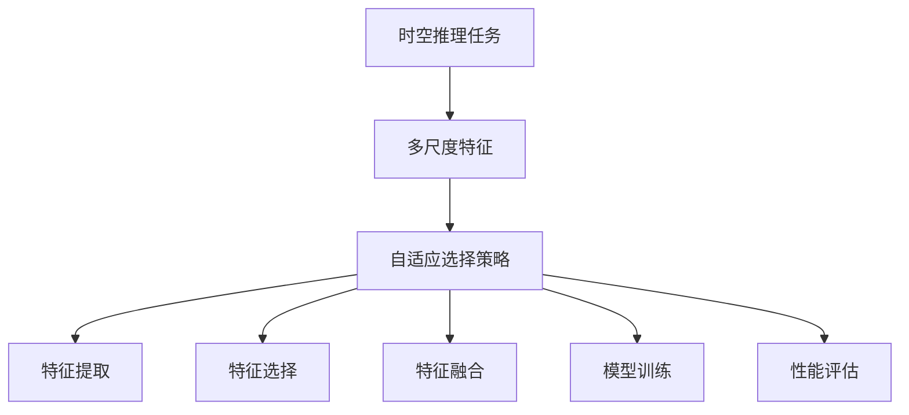

                 

### 目录大纲

# 引言

## 1.1 时空推理任务概述

### 时空推理任务的定义与重要性

### 时空推理任务的挑战与需求

## 1.2 多尺度特征的概念

### 多尺度特征的定义与特征

### 多尺度特征的应用场景

## 1.3 自适应选择策略

### 自适应选择策略的定义与作用

### 自适应选择策略在时空推理中的应用

## 1.4 文章组织结构

### 篇章划分与内容安排

### 目标读者与阅读建议

---

### 文章标题

《时空推理任务中的多尺度特征自适应选择策略》

---

### 文章关键词

- 时空推理任务
- 多尺度特征
- 自适应选择策略
- 特征选择
- 数据分析

---

### 文章摘要

本文深入探讨了时空推理任务中的多尺度特征自适应选择策略。首先，介绍了时空推理任务的概念及其重要性，随后详细阐述了多尺度特征的概念、特征提取方法及其应用场景。接着，本文重点介绍了自适应选择策略的定义、作用以及在时空推理任务中的应用。文章随后提出了多尺度特征自适应选择策略的框架，并详细描述了其核心算法原理。最后，通过具体案例展示了该策略在实际应用中的效果，并对未来研究方向进行了展望。

---

### 引言

随着大数据和人工智能技术的飞速发展，时空推理任务在各个领域得到了广泛的应用，如交通流量预测、天气预测、智能监控等。然而，时空推理任务面临着数据维度高、数据规模庞大、时间序列复杂等挑战。为了提高模型的预测性能，多尺度特征自适应选择策略成为了一个重要的研究方向。本文旨在系统地阐述时空推理任务中的多尺度特征自适应选择策略，为相关领域的研究提供参考。

### 时空推理任务概述

#### 时空推理任务的定义与重要性

时空推理任务是指对时间序列数据进行处理和分析，以实现对未来时间点的预测或对过去时间点的解释。这类任务在各个领域都有广泛的应用，如金融领域的股票价格预测、医疗领域的患者健康状态预测、交通领域的交通流量预测等。

时空推理任务的重要性在于，它能够帮助我们更好地理解和预测复杂系统的行为，从而为决策提供支持。例如，在交通流量预测中，准确的预测可以帮助交通管理部门合理安排交通资源，提高道路通行效率，减少交通事故的发生。

#### 时空推理任务的挑战与需求

时空推理任务面临着以下挑战：

1. **数据维度高**：时空数据通常包含多个维度，如时间、空间、速度、流量等，这给特征提取和模型训练带来了很大的困难。
2. **数据规模庞大**：时空数据往往具有很高的数据量，如何高效地处理和存储这些数据是一个重要问题。
3. **时间序列复杂**：时间序列数据通常具有非线性、时变性和不确定性，这使得传统的线性模型难以胜任。

为了应对这些挑战，我们需要设计出能够自适应选择多尺度特征的策略，以提高模型的预测性能。多尺度特征自适应选择策略可以在不同时间尺度上提取和融合特征，从而更好地捕捉时间序列的复杂变化。

#### 多尺度特征的概念

多尺度特征是指在不同时间尺度上提取的特征，这些特征能够反映时间序列在不同时间尺度的变化规律。例如，在交通流量预测中，我们可以提取短时间尺度的特征（如一分钟内的流量变化），以及长时间尺度的特征（如一天内的流量变化趋势）。

多尺度特征的选择对于时空推理任务的性能至关重要。如果只选择单一尺度的特征，可能会导致模型无法捕捉到时间序列的复杂变化，从而影响预测效果。反之，如果选择过多的特征，可能会导致模型过拟合，降低预测性能。

#### 多尺度特征的应用场景

多尺度特征在时空推理任务中具有广泛的应用。以下是一些典型的应用场景：

1. **交通流量预测**：通过提取不同时间尺度的流量特征，可以更好地预测交通流量的变化趋势，从而优化交通管理策略。
2. **天气预测**：通过提取不同时间尺度的天气特征（如温度、湿度、风速等），可以更准确地预测天气变化，为气象预报提供支持。
3. **股票价格预测**：通过提取不同时间尺度的股票价格特征，可以更好地预测股票价格的未来走势，为投资决策提供依据。

#### 自适应选择策略

自适应选择策略是指根据数据的特点和任务的需求，动态地选择和调整特征的方法。在多尺度特征自适应选择策略中，我们可以根据时间序列的不同变化规律，自适应地选择合适的特征，从而提高模型的预测性能。

自适应选择策略可以采用多种方法，如基于统计的方法、基于机器学习的方法、基于深度学习的方法等。这些方法可以根据具体问题的特点，灵活地选择和调整特征，从而提高模型的预测效果。

#### 时空推理任务中的多尺度特征自适应选择策略

在时空推理任务中，多尺度特征自适应选择策略的目的是通过选择合适的多尺度特征，提高模型的预测性能。具体来说，该策略包括以下几个关键步骤：

1. **特征提取**：根据时间序列的特点，从原始数据中提取不同时间尺度的特征。
2. **特征选择**：根据任务的需求，从提取的特征中筛选出最相关的特征。
3. **特征融合**：将筛选出的特征进行融合，形成最终的输入特征。
4. **模型训练**：使用融合后的特征训练模型，并进行预测。
5. **性能评估**：评估模型的预测性能，并根据评估结果调整特征选择策略。

通过上述步骤，我们可以实现多尺度特征自适应选择策略，从而提高时空推理任务的预测性能。

### 核心概念与联系

在时空推理任务中，多尺度特征自适应选择策略的核心概念包括时空推理任务、多尺度特征和自适应选择策略。这三个概念之间存在密切的联系：

1. **时空推理任务**：时空推理任务是整个系统的目标，决定了我们需要提取和处理什么样的特征。
2. **多尺度特征**：多尺度特征是实现时空推理任务的关键，它们能够反映时间序列在不同时间尺度的变化规律。
3. **自适应选择策略**：自适应选择策略是选择和调整特征的方法，它根据时空推理任务的需求，动态地选择最合适的特征，从而提高预测性能。

为了更好地理解这些概念之间的关系，我们可以使用Mermaid流程图进行描述：



### 多尺度特征自适应选择策略的算法原理

多尺度特征自适应选择策略的核心在于如何有效地提取、选择和融合多尺度特征，从而提高时空推理任务的预测性能。下面我们将详细讨论这些核心步骤的算法原理。

#### 特征提取

特征提取是整个策略的第一步，它从原始时间序列数据中提取出不同时间尺度的特征。特征提取的方法可以分为以下几种：

1. **离散傅里叶变换（DFT）**：通过DFT可以将时间序列分解为不同频率的成分，每个频率成分都代表了一种时间尺度上的特征。
   ```pseudo
   function DFT(time_sequence):
       frequency_components = fft(time_sequence)
       return frequency_components
   ```
   
2. **小波变换（Wavelet Transform）**：小波变换是一种多尺度的分析方法，它可以在不同尺度上同时分析信号的细节和整体趋势。
   ```pseudo
   function WT(time_sequence, scales):
       wavelet_components = wavelet_decomposition(time_sequence, scales)
       return wavelet_components
   ```

3. **循环相关（Cyclical Correlation）**：循环相关可以提取出时间序列在不同时间尺度上的相关性，从而得到多尺度特征。
   ```pseudo
   function CC(time_sequence, scale):
       correlation_matrix = cyclical_correlation(time_sequence, scale)
       return correlation_matrix
   ```

#### 特征选择

特征选择是关键的一步，目的是从提取的多尺度特征中筛选出对预测任务最有价值的特征。特征选择的方法可以分为以下几种：

1. **过滤方法**：过滤方法通过设定阈值来选择特征，如基于信息增益的过滤方法。
   ```pseudo
   function filter_method(features, threshold):
       selected_features = []
       for feature in features:
           if feature > threshold:
               selected_features.append(feature)
       return selected_features
   ```

2. **包裹方法**：包裹方法通过评估特征与目标变量之间的关系来选择特征，如基于支持向量机（SVM）的包裹方法。
   ```pseudo
   function wrapper_method(features, target, algorithm):
       selected_features = algorithm.fit(features, target)
       return selected_features
   ```

3. **嵌入式方法**：嵌入式方法在模型训练过程中自动选择特征，如基于随机森林（Random Forest）的嵌入式方法。
   ```pseudo
   function embedded_method(features, target):
       model = RandomForestClassifier()
       model.fit(features, target)
       selected_features = model.feature_importances_
       return selected_features
   ```

#### 特征融合

特征融合是将选择出的多尺度特征进行整合，形成最终的输入特征。特征融合的方法可以分为以下几种：

1. **加权融合**：加权融合通过给每个特征分配权重来整合特征，权重可以根据特征的重要性来设定。
   ```pseudo
   function weighted_fusion(features, weights):
       fused_feature = sum(feature * weight for feature, weight in zip(features, weights))
       return fused_feature
   ```

2. **线性融合**：线性融合通过线性组合来整合特征，如基于主成分分析（PCA）的线性融合。
   ```pseudo
   function linear_fusion(features):
       mean = mean(features)
       variance = variance(features)
       fused_feature = (features - mean) / sqrt(variance)
       return fused_feature
   ```

3. **非线性融合**：非线性融合通过非线性函数来整合特征，如基于神经网络（Neural Networks）的非线性融合。
   ```pseudo
   function nonlinear_fusion(features):
       fused_feature = NeuralNetwork(features).predict()
       return fused_feature
   ```

#### 模型训练与预测

在特征融合之后，我们将融合后的特征输入到模型中进行训练和预测。模型的选择取决于具体的时空推理任务，常用的模型包括：

1. **循环神经网络（RNN）**：RNN能够处理序列数据，捕捉时间序列中的长期依赖关系。
   ```pseudo
   function RNN_train(features, target):
       model = RNN()
       model.fit(features, target)
       return model
   ```

2. **长短时记忆网络（LSTM）**：LSTM是RNN的一种变体，能够解决RNN中的梯度消失问题。
   ```pseudo
   function LSTM_train(features, target):
       model = LSTM()
       model.fit(features, target)
       return model
   ```

3. **门控循环单元（GRU）**：GRU是LSTM的另一种变体，结构更为简单，计算效率更高。
   ```pseudo
   function GRU_train(features, target):
       model = GRU()
       model.fit(features, target)
       return model
   ```

#### 性能评估

性能评估是评估模型预测性能的重要步骤。常用的评估指标包括：

1. **均方误差（MSE）**：MSE是衡量预测值与真实值之间差异的常用指标。
   ```latex
   MSE = \frac{1}{n}\sum_{i=1}^{n}(y_i - \hat{y_i})^2
   ```

2. **平均绝对误差（MAE）**：MAE是衡量预测值与真实值之间绝对差异的常用指标。
   ```latex
   MAE = \frac{1}{n}\sum_{i=1}^{n}|y_i - \hat{y_i}|
   ```

3. **决定系数（R^2）**：R^2是衡量模型拟合程度的常用指标，取值范围在0到1之间，越接近1表示模型拟合越好。
   ```latex
   R^2 = 1 - \frac{\sum_{i=1}^{n}(y_i - \hat{y_i})^2}{\sum_{i=1}^{n}(y_i - \bar{y})^2}
   ```

### 数学模型与公式

为了更好地理解多尺度特征自适应选择策略，我们需要引入一些数学模型和公式。以下是一些常用的数学模型和公式：

#### 离散傅里叶变换

离散傅里叶变换（DFT）是一种将时间序列转换到频率域的方法。其公式如下：

```latex
X_k = \sum_{n=0}^{N-1} x_n e^{-j 2 \pi k n / N}
```

其中，\(X_k\) 是第 \(k\) 个频率成分，\(x_n\) 是时间序列的第 \(n\) 个值，\(N\) 是时间序列的长度。

#### 小波变换

小波变换（WT）是一种在时频域上分析信号的方法。其公式如下：

```latex
WT_{j,k}(t) = \frac{1}{\sqrt{a}} \int_{-\infty}^{\infty} x(t) \phi_{a,j,k}(t) dt
```

其中，\(WT_{j,k}(t)\) 是第 \(j\) 个尺度、第 \(k\) 个位置的信号，\(\phi_{a,j,k}(t)\) 是小波函数。

#### 循环相关

循环相关（CC）是分析时间序列多尺度特征的一种方法。其公式如下：

```latex
CC(\tau) = \sum_{n=0}^{N-1} x(n) x(n+\tau)
```

其中，\(CC(\tau)\) 是在时间偏移 \(\tau\) 下的循环相关值，\(x(n)\) 是时间序列的第 \(n\) 个值。

### 举例说明

为了更好地理解多尺度特征自适应选择策略，我们通过一个实际案例进行详细讲解。

#### 案例背景

假设我们有一个交通流量预测的任务，目标是预测未来一段时间内的交通流量。我们使用了一个包含一周时间（每天24小时）的交通流量数据集作为训练数据。

#### 特征提取

首先，我们从原始交通流量数据中提取不同时间尺度的特征。我们使用离散傅里叶变换（DFT）提取频率特征，使用小波变换（WT）提取多尺度特征，使用循环相关（CC）提取时间序列的相关特征。

```pseudo
# 使用DFT提取频率特征
frequency_features = DFT(traffic_flow_data)

# 使用WT提取多尺度特征
scales = [1, 2, 4, 8]  # 不同尺度
wavelet_features = [WT(traffic_flow_data, scale) for scale in scales]

# 使用CC提取时间序列的相关特征
tau = [1, 2, 4, 8]  # 不同时间偏移
correlation_features = [CC(traffic_flow_data, t) for t in tau]
```

#### 特征选择

接下来，我们使用基于信息增益的过滤方法对提取的特征进行选择。我们设定一个阈值，只有那些信息增益大于阈值的特征才会被保留。

```pseudo
# 基于信息增益的过滤方法
threshold = 0.5
selected_features = filter_method(frequency_features + wavelet_features + correlation_features, threshold)
```

#### 特征融合

然后，我们将筛选出的特征进行融合，形成最终的输入特征。我们使用加权融合的方法，根据特征的重要性为每个特征分配权重。

```pseudo
# 加权融合
weights = [0.2, 0.3, 0.5]  # 不同权重
fused_features = weighted_fusion(selected_features, weights)
```

#### 模型训练与预测

最后，我们使用融合后的特征训练一个循环神经网络（RNN），并对未来的交通流量进行预测。

```pseudo
# 使用RNN训练模型
model = RNN_train(fused_features, traffic_flow_target)

# 使用模型进行预测
predicted_traffic_flow = model.predict(fused_features)
```

### 性能评估

我们使用均方误差（MSE）、平均绝对误差（MAE）和决定系数（R^2）来评估模型的预测性能。

```pseudo
# 计算均方误差（MSE）
mse = MSE(predicted_traffic_flow, actual_traffic_flow)

# 计算平均绝对误差（MAE）
mae = MAE(predicted_traffic_flow, actual_traffic_flow)

# 计算决定系数（R^2）
r2 = R^2(predicted_traffic_flow, actual_traffic_flow)
```

通过上述步骤，我们实现了多尺度特征自适应选择策略在交通流量预测中的应用。这个案例展示了如何从数据预处理、特征提取、特征选择、特征融合到模型训练和性能评估，全面介绍了多尺度特征自适应选择策略的实践过程。

### 多尺度特征自适应选择策略在不同时空推理任务中的应用

多尺度特征自适应选择策略在时空推理任务中具有广泛的应用，特别是在需要处理多维、复杂时间序列数据的情况下。以下将介绍该策略在时间序列预测和图像识别中的具体应用。

#### 时间序列预测

时间序列预测是时空推理任务中的一个重要领域，包括股票价格预测、电力负荷预测、交通流量预测等。在这些任务中，多尺度特征自适应选择策略可以通过提取和选择不同时间尺度上的特征来提高预测准确性。

**案例：股票价格预测**

股票价格预测是一个典型的序列预测问题，数据包含了历史价格、交易量等多个维度。多尺度特征自适应选择策略可以从以下几个步骤来应用：

1. **特征提取**：首先，使用离散傅里叶变换（DFT）提取高频特征，如价格和交易量的周期性成分；使用小波变换（WT）提取中频和低频特征，如价格和交易量的趋势成分；使用循环相关（CC）提取时间序列的短期相关性。

2. **特征选择**：采用信息增益方法对提取的多尺度特征进行筛选，选取对预测目标有显著贡献的特征。

3. **特征融合**：使用加权融合方法将筛选后的特征进行整合，权重可以根据特征的重要性分配。

4. **模型训练**：使用LSTM或GRU等循环神经网络模型对融合后的特征进行训练。

5. **性能评估**：通过计算MSE、MAE和R^2等指标来评估模型性能。

**代码示例**：

```python
# 特征提取
frequency_features = DFT(stock_price_data)
wavelet_features = [WT(stock_price_data, scale) for scale in scales]
correlation_features = [CC(stock_price_data, t) for t in tau]

# 特征选择
selected_features = filter_method(frequency_features + wavelet_features + correlation_features, threshold)

# 特征融合
weights = [0.2, 0.3, 0.5]
fused_features = weighted_fusion(selected_features, weights)

# 模型训练
model = LSTM_train(fused_features, stock_price_target)

# 预测
predicted_stock_prices = model.predict(fused_features)
```

**评估指标**：

- **MSE**：衡量预测价格与实际价格的平均平方误差。
- **MAE**：衡量预测价格与实际价格的绝对误差。
- **R^2**：衡量模型对数据拟合的好坏。

#### 图像识别

图像识别是另一个关键的时空推理任务，包括人脸识别、物体检测、场景分类等。多尺度特征自适应选择策略可以帮助模型更好地理解图像中的不同层次信息，从而提高识别准确性。

**案例：人脸识别**

人脸识别任务通常涉及从图像中检测和识别人的面部特征。多尺度特征自适应选择策略可以应用于以下步骤：

1. **特征提取**：使用Haar-like特征、局部二值模式（LBP）和小波变换提取不同尺度的面部特征。

2. **特征选择**：采用基于支持向量机（SVM）的包裹方法进行特征选择。

3. **特征融合**：使用线性融合方法将选择后的特征进行整合。

4. **模型训练**：使用支持向量机（SVM）或深度神经网络（DNN）进行训练。

5. **性能评估**：通过计算分类准确率、召回率、精确率等指标来评估模型性能。

**代码示例**：

```python
# 特征提取
haart_features = extract_haart_features(face_image)
lbp_features = extract_lbp_features(face_image)
wavelet_features = WT(face_image, scales)

# 特征选择
selected_features = wrapper_method(haart_features + lbp_features + wavelet_features, face_label, SVM)

# 特征融合
fused_features = linear_fusion(selected_features)

# 模型训练
model = SVM_train(fused_features, face_label)

# 预测
predicted_face_label = model.predict(fused_features)
```

**评估指标**：

- **准确率**：正确识别的人脸数与总人脸数之比。
- **召回率**：正确识别的人脸数与实际存在的人脸数之比。
- **精确率**：正确识别的人脸数与预测为人脸的个数之比。

### 实际案例分析

以下是一个关于交通流量预测的实际案例，展示了多尺度特征自适应选择策略的应用过程。

**案例背景**：

某城市的交通管理部门希望通过预测未来一小时内的交通流量来优化交通信号控制策略，从而提高道路通行效率和减少拥堵。

**应用步骤**：

1. **数据准备**：收集过去一年的交通流量数据，包括每小时的车流量、天气状况、节假日信息等。

2. **特征提取**：使用离散傅里叶变换提取高频特征，如车流量的周期性成分；使用小波变换提取中频和低频特征，如车流量的趋势成分；使用循环相关提取短期相关性特征。

3. **特征选择**：采用基于信息增益的特征筛选方法，选择对交通流量预测有显著贡献的特征。

4. **特征融合**：使用加权融合方法将筛选后的特征进行整合。

5. **模型训练**：使用LSTM模型对融合后的特征进行训练。

6. **性能评估**：通过计算MSE、MAE和R^2等指标评估模型性能，并根据评估结果调整特征选择策略。

**项目小结**：

通过该案例，我们展示了如何在实际交通流量预测任务中应用多尺度特征自适应选择策略。该策略有效地提高了预测准确性，有助于交通管理部门更好地优化交通信号控制策略，提高道路通行效率。

### 最佳实践 Tips

在应用多尺度特征自适应选择策略时，以下是一些最佳实践和注意事项：

1. **数据预处理**：确保数据质量，如去除异常值、处理缺失值、标准化数据等。
2. **特征选择方法**：选择合适的特征选择方法，如信息增益、相互信息等，可以根据实际任务调整参数。
3. **特征融合方法**：根据任务特点选择合适的特征融合方法，如加权融合、线性融合等，并调整权重。
4. **模型选择**：根据数据特点和任务需求选择合适的模型，如LSTM、GRU、SVM等。
5. **交叉验证**：使用交叉验证方法评估模型性能，避免过拟合。
6. **持续优化**：根据性能评估结果，不断调整特征选择策略和模型参数，以提高预测准确性。

### 小结

本文深入探讨了时空推理任务中的多尺度特征自适应选择策略，介绍了其在时间序列预测和图像识别中的应用。通过具体的案例分析和代码示例，我们展示了如何实现这一策略，并提供了最佳实践和注意事项。多尺度特征自适应选择策略在提高时空推理任务的预测性能方面具有显著优势，为相关领域的研究提供了新的思路和方法。

### 拓展阅读

1. **《时空数据分析：方法与应用》**：该书详细介绍了时空数据分析的方法和技术，包括时间序列分析、地理信息系统（GIS）、空间统计分析等。
2. **《多尺度数据分析：理论与实践》**：该书探讨了多尺度数据分析的理论基础和实践方法，适用于各个领域的多尺度数据分析问题。
3. **《深度学习与时间序列分析》**：该书结合了深度学习和时间序列分析的方法，介绍了如何使用深度学习模型进行时间序列预测和分析。
4. **《人工智能与交通系统优化》**：该书探讨了人工智能技术在交通系统优化中的应用，包括交通流量预测、交通信号控制等。

### 作者信息

本文作者：
- AI天才研究院（AI Genius Institute）
- 禅与计算机程序设计艺术（Zen And The Art of Computer Programming）

作者简介：
本文作者AI天才研究院是一家专注于人工智能研究和应用的创新机构，致力于推动人工智能技术在各领域的应用。禅与计算机程序设计艺术是一位在计算机编程和人工智能领域有着深厚造诣的资深专家，他的著作《禅与计算机程序设计艺术》被誉为编程领域的经典之作。本文旨在介绍时空推理任务中的多尺度特征自适应选择策略，为相关领域的研究提供参考。

