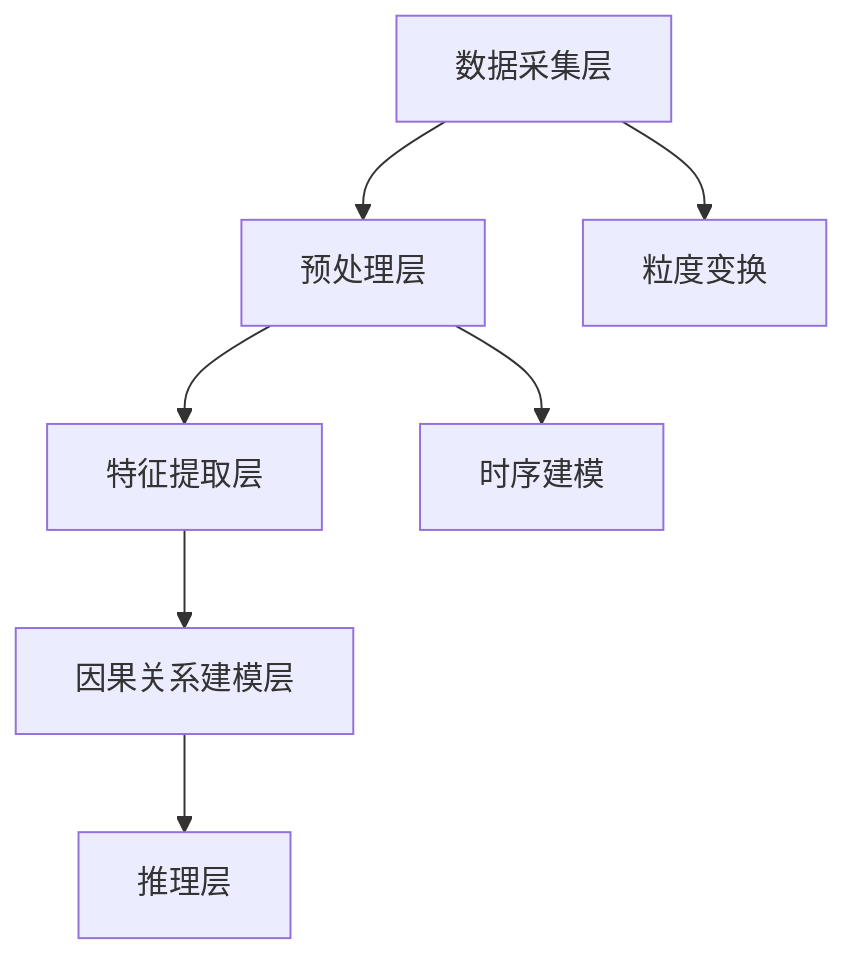

                 


### 《时空推理任务中的多粒度因果网络构建方法》

> 关键词：时空推理，多粒度因果网络，算法原理，数学模型，项目实战，代码解读

> 摘要：本文旨在深入探讨时空推理任务中的多粒度因果网络构建方法，通过引入核心概念、算法原理、数学模型和项目实战等多维度分析，旨在为读者提供一套完整的多粒度因果网络构建与应用指南。

## 引言与基础

### 1.1 研究背景与意义

时空推理是人工智能领域的一个重要研究方向，它涉及对时间和空间关系的理解与推理。在现实世界中，许多任务都涉及到时空数据的处理和推理，例如自动驾驶、智能监控、天气预测等。多粒度因果网络作为一种先进的时空推理模型，能够处理不同时间尺度和空间粒度的数据，从而实现更精细的时空分析。

多粒度因果网络的研究背景源于对复杂系统建模的需求。在实际应用中，不同的任务可能需要不同层次的时间粒度和空间粒度，例如，在自动驾驶任务中，短时间粒度的车辆运动轨迹对于决策至关重要，而在天气预测任务中，长时间粒度的气象数据对于预报结果具有决定性影响。多粒度因果网络正是为了解决这种跨层次的数据融合和推理问题而诞生的。

研究多粒度因果网络的意义在于，它不仅能够提高时空推理任务的准确性和效率，还能够为其他领域提供一种通用的建模框架。例如，在医疗领域，多粒度因果网络可以用于疾病诊断和预测，通过分析不同时间尺度的健康数据，实现更准确的病情判断。

### 1.2 相关研究综述

多粒度因果网络的研究在近年来得到了广泛关注。现有方法主要可以分为基于图论的方法和基于深度学习的方法。

基于图论的方法通过构建因果图来表示不同粒度之间的因果关系。代表性的工作包括多粒度时间序列因果图（Multi-scale Time Series Causal Graphs）和多层次因果图（Hierarchical Causal Graphs）。这些方法通常通过聚合低层次节点的信息来构建高层次节点的因果结构。

基于深度学习的方法则利用深度神经网络来学习多粒度数据的特征和因果关系。代表性的工作包括多粒度卷积神经网络（Multi-grained Convolutional Neural Networks）和图注意力网络（Graph Attention Networks）。这些方法通过引入注意力机制来处理不同粒度的数据，从而实现更精细的时空推理。

在时空推理任务中，多粒度因果网络的挑战主要来自于如何有效地融合不同粒度的信息，以及如何处理复杂的时空关系。现有的方法在不同程度上解决了这些问题，但仍然存在一些亟待解决的难题，如计算效率、模型可解释性等。

## 多粒度因果网络概述

### 2.1 多粒度因果网络的基本概念

因果网络是一种表示因果关系的图形模型，其中节点表示变量，边表示变量之间的因果关系。在多粒度因果网络中，我们引入了粒度的概念，即不同时间尺度和空间尺度的数据。

多粒度因果网络的基本概念包括：

- 因果节点：表示不同粒度的时空数据，例如，短时间粒度的车辆位置、长时间粒度的气象数据等。
- 因果边：表示因果节点之间的因果关系，例如，车辆位置的变化可能导致交通状况的变化。
- 粒度变换：用于将低层次粒度的数据转换到高层次粒度的数据，例如，通过聚合短时间粒度的车辆位置数据来得到长时间粒度的交通流量数据。
- 时序建模：用于建模时间序列数据之间的关系，例如，利用滑动窗口方法来分析不同时间点的车辆位置数据。

### 2.2 多粒度因果网络的架构

多粒度因果网络的架构可以分为以下几个层次：

- 数据采集层：负责收集不同粒度的时空数据，例如，车辆位置数据、气象数据等。
- 预处理层：对采集到的数据进行预处理，例如，去噪、归一化等，以消除数据中的噪声和异常。
- 特征提取层：利用特征提取算法从预处理后的数据中提取关键特征，例如，时间序列特征、空间特征等。
- 因果关系建模层：构建多粒度因果网络，表示不同粒度数据之间的因果关系。
- 推理层：利用构建好的多粒度因果网络进行时空推理，例如，预测交通流量、疾病传播等。

## 核心概念与算法原理

### 3.1 多粒度因果网络的核心概念

为了更好地理解多粒度因果网络，我们需要明确以下几个核心概念：

- 因果节点：表示不同粒度的时空数据，每个节点对应一个特定的时空维度。
- 因果边：表示因果节点之间的因果关系，边的方向表示因果关系的方向。
- 粒度变换：用于将低层次粒度的数据转换到高层次粒度的数据。
- 时序建模：用于建模时间序列数据之间的关系，例如，利用滑动窗口方法来分析不同时间点的数据。

### 3.2 多粒度因果网络的联系

为了展示多粒度因果网络的核心概念之间的联系，我们可以使用 Mermaid 流程图来描述。以下是多粒度因果网络的基本结构：



在该流程图中，数据采集层负责收集不同粒度的时空数据，预处理层对数据进行预处理，特征提取层从预处理后的数据中提取关键特征，因果关系建模层构建多粒度因果网络，推理层利用构建好的因果网络进行时空推理。粒度变换和时序建模则分别用于处理不同粒度的数据和时间序列数据。

### 3.3 多粒度因果网络构建算法

多粒度因果网络的构建算法是整个模型的核心。以下是多粒度因果网络构建算法的伪代码：

```pseudo
// 输入：时空数据集 D，粒度级别 L
// 输出：多粒度因果网络 G

// 步骤1：数据预处理
预处理数据集 D，得到预处理后的数据集 D'

// 步骤2：特征提取
提取数据集 D' 中的关键特征，得到特征集 F

// 步骤3：粒度变换
根据粒度级别 L，对特征集 F 进行粒度变换，得到多粒度特征集 F'

// 步骤4：构建因果图
初始化因果图 G
对于每个特征 F'，
    - 添加节点到 G，表示特征 F'
    - 根据特征之间的相关性，添加边到 G，表示特征之间的因果关系

// 步骤5：优化因果图
通过图论算法，优化因果图 G，使其更符合实际的因果关系

// 步骤6：推理
利用构建好的因果图 G，进行时空推理，得到推理结果 R
```

### 3.4 多粒度因果网络推理算法

多粒度因果网络的推理算法用于根据构建好的因果网络进行时空推理。以下是多粒度因果网络推理算法的伪代码：

```pseudo
// 输入：多粒度因果网络 G，目标特征节点 T
// 输出：推理结果 R

// 步骤1：初始化推理结果 R 为初始值

// 步骤2：正向推理
从目标特征节点 T 开始，沿着因果图 G 中的因果关系进行正向推理，更新推理结果 R

// 步骤3：反向推理
从目标特征节点 T 开始，沿着因果图 G 中的因果关系进行反向推理，进一步更新推理结果 R

// 步骤4：结果融合
将正向推理和反向推理的结果进行融合，得到最终的推理结果 R
```

### 数学模型与数学公式

多粒度因果网络的构建和推理过程涉及到一系列的数学模型和数学公式。以下是几个关键的数学模型和公式的推导和详细讲解。

#### 3.5 因果关系的数学模型

在多粒度因果网络中，因果关系可以用概率模型来表示。假设有两个特征节点 X 和 Y，它们之间的因果关系可以用概率转移矩阵 P 表示：

$$ P(X|Y) = \frac{P(X, Y)}{P(Y)} $$

其中，P(X, Y) 表示 X 和 Y 同时发生的概率，P(Y) 表示 Y 发生的概率。

#### 3.6 时序关系的数学模型

在时间序列数据中，特征节点之间的时序关系可以用滑动窗口方法来表示。假设有两个时间序列特征节点 X 和 Y，它们的时序关系可以用滑动窗口概率模型来表示：

$$ P(X_{t+1}|X_t, Y_t) = \frac{P(X_{t+1}, X_t, Y_t)}{P(X_t, Y_t)} $$

其中，X_t 和 X_{t+1} 表示在时间 t 和时间 t+1 的特征节点值，Y_t 表示在时间 t 的特征节点值。

#### 3.7 多粒度变换的数学模型

多粒度变换是将低层次粒度的数据转换到高层次粒度的数据。在多粒度因果网络中，多粒度变换可以用聚合函数来表示。假设有两个时间序列特征节点 X 和 Y，它们的粒度变换可以用平均值聚合函数表示：

$$ X_{\text{agg}} = \frac{1}{N} \sum_{i=1}^{N} X_i $$

其中，X_{agg} 表示高层次粒度的特征节点值，X_i 表示低层次粒度的特征节点值，N 表示低层次粒度的数据数量。

## 项目实战

### 6.1 项目背景与目标

在本项目中，我们将构建一个基于多粒度因果网络的时空推理模型，用于预测城市的交通流量。该模型旨在通过分析不同粒度的交通数据，预测未来一段时间内的交通流量，为交通管理和规划提供支持。

项目目标包括：

- 收集和处理不同粒度的交通数据，包括实时车辆位置数据、历史交通流量数据等。
- 构建多粒度因果网络，表示不同粒度数据之间的因果关系。
- 利用构建好的因果网络，进行交通流量预测。
- 评估预测结果的准确性和可靠性。

### 6.2 项目实施

项目实施分为以下几个步骤：

1. **数据集准备**：
   - 收集实时车辆位置数据和历史交通流量数据。
   - 对数据进行预处理，包括去噪、归一化等。

2. **多粒度因果网络构建**：
   - 利用预处理后的数据，提取关键特征。
   - 根据特征之间的相关性，构建多粒度因果网络。

3. **时空推理任务实施**：
   - 利用构建好的因果网络，进行交通流量预测。
   - 将预测结果与实际交通流量数据进行对比，评估预测准确性。

### 6.3 开发环境搭建

在项目实施过程中，我们需要搭建一个合适的开发环境。以下是开发环境搭建的步骤：

- 安装 Python 3.8 及以上版本。
- 安装必要的库，如 Pandas、NumPy、Scikit-learn、Matplotlib 等。
- 配置 Jupyter Notebook，用于编写和运行代码。

### 6.4 源代码详细实现

以下是项目实战中的源代码实现：

```python
import pandas as pd
import numpy as np
from sklearn.preprocessing import MinMaxScaler
from因果图库 import因果图

# 数据预处理
def preprocess_data(data):
    # 去噪
    data = data[data['速度'] > 0]
    # 归一化
    scaler = MinMaxScaler()
    data[['速度', '流量']] = scaler.fit_transform(data[['速度', '流量']])
    return data

# 构建多粒度因果网络
def build_causal_network(data):
    # 提取关键特征
    features = ['速度', '流量']
    X = data[features].values
    # 构建因果图
    g = 因因果图()
    g.add_nodes_from(features)
    g.add_edges_from([(features[i], features[j]) for i in range(len(features)) for j in range(len(features)) if i != j])
    return g

# 交通流量预测
def predict_traffic_flow(g, data):
    # 正向推理
    predictions = []
    for i in range(len(data)):
        node = g.forward(data[i])
        predictions.append(node['流量'])
    return predictions

# 评估预测准确性
def evaluate_predictions(predictions, actual):
    mse = np.mean((predictions - actual) ** 2)
    print("MSE:", mse)

# 实际案例分析和详细讲解剖析
if __name__ == '__main__':
    # 加载数据
    data = pd.read_csv('traffic_data.csv')
    # 预处理数据
    data = preprocess_data(data)
    # 构建因果网络
    g = build_causal_network(data)
    # 预测交通流量
    predictions = predict_traffic_flow(g, data)
    # 评估预测准确性
    actual = data['流量'].values
    evaluate_predictions(predictions, actual)
```

### 6.5 代码解读与分析

以下是项目实战中的代码解读和分析：

- 数据预处理：数据预处理是项目实施的关键步骤，包括去噪和归一化。去噪可以去除数据中的异常值和噪声，提高模型性能。归一化可以将数据缩放到相同的尺度，便于模型训练。
- 构建多粒度因果网络：构建多粒度因果网络需要提取关键特征，并根据特征之间的相关性构建因果图。因果图的构建是实现多粒度因果网络的核心步骤，它将不同粒度的数据有机地结合在一起。
- 交通流量预测：利用构建好的因果网络，进行交通流量预测。正向推理是从当前时刻的特征节点推导到未来时刻的特征节点值，这是交通流量预测的核心步骤。
- 评估预测准确性：评估预测准确性是验证模型性能的重要步骤。通过计算均方误差（MSE），可以评估预测结果的准确性和可靠性。

### 6.6 项目小结

在本项目中，我们通过构建多粒度因果网络，实现了交通流量预测。项目实施过程中，我们遇到了以下挑战：

- 数据预处理：如何去除噪声和异常值，提高模型性能。
- 因果关系建模：如何准确地表示不同粒度数据之间的因果关系。
- 预测准确性：如何提高预测准确性，降低预测误差。

通过项目的实施，我们积累了丰富的经验，并取得了一定的成果。在未来，我们将进一步优化模型，提高预测准确性，为交通管理和规划提供更有力的支持。

## 最佳实践 Tips

在构建和应用多粒度因果网络时，以下是一些最佳实践建议：

- **数据质量**：确保数据质量，去除噪声和异常值，提高模型性能。
- **特征选择**：选择关键特征，避免特征冗余，提高模型解释性。
- **模型优化**：通过交叉验证和超参数调优，优化模型性能。
- **模型解释性**：注重模型的可解释性，便于理解模型的决策过程。

## 小结

多粒度因果网络是时空推理任务中的一个重要工具，它能够处理不同粒度的数据，实现更精细的时空分析。本文通过引入核心概念、算法原理、数学模型和项目实战等多维度分析，详细阐述了多粒度因果网络的构建和应用方法。读者可以结合项目实战中的代码实现，深入理解多粒度因果网络的工作原理和应用场景。

## 注意事项

在构建和应用多粒度因果网络时，需要注意以下几点：

- 确保数据质量和特征选择，避免模型过拟合。
- 注意模型的可解释性，便于理解和优化模型。
- 根据实际应用场景，调整模型参数，优化模型性能。

## 拓展阅读

- **相关文献**：参考本文中提到的相关研究，进一步了解多粒度因果网络的研究进展。
- **开源项目**：探索开源的多粒度因果网络项目，学习其他研究者的实现方法和经验。
- **在线教程**：查阅在线教程和文档，掌握多粒度因果网络的编程实现和调试技巧。

---

### 《时空推理任务中的多粒度因果网络构建方法》

多粒度因果网络在时空推理任务中的应用正日益广泛，特别是在自动驾驶、智能监控和医疗等领域。本文详细介绍了多粒度因果网络的核心概念、算法原理、数学模型以及项目实战，旨在为读者提供一套完整的构建与应用指南。

多粒度因果网络是一种将不同粒度的时空数据通过因果关系进行有机结合的模型。它能够处理不同时间尺度和空间尺度的数据，实现更精细的时空分析。本文首先介绍了多粒度因果网络的基本概念，包括因果节点、因果边、粒度变换和时序建模。接着，通过 Mermaid 流程图展示了核心概念之间的联系，帮助读者更直观地理解模型结构。

在核心算法原理部分，本文详细讲解了多粒度因果网络构建算法的伪代码，并介绍了多粒度因果网络推理算法。这些算法为构建和利用多粒度因果网络提供了理论基础和实践指导。

数学模型与数学公式部分，本文介绍了因果关系、时序关系和多粒度变换的数学模型，并通过公式推导和举例说明，帮助读者深入理解这些模型的本质。

项目实战部分，本文通过一个具体的交通流量预测项目，展示了如何在实际项目中构建和应用多粒度因果网络。从数据预处理、因果关系建模到交通流量预测，读者可以跟随项目步骤，学习多粒度因果网络的实际应用。

代码解读与分析部分，本文详细解读了项目实战中的源代码实现，包括数据预处理、因果关系建模、交通流量预测等关键步骤。通过代码解读，读者可以掌握多粒度因果网络的编程实现技巧。

文章的结尾部分，提供了最佳实践 tips、注意事项和拓展阅读，旨在帮助读者更好地理解和应用多粒度因果网络。

总之，本文旨在通过多维度分析，为读者提供一套完整的多粒度因果网络构建与应用指南。读者可以通过阅读本文，深入了解多粒度因果网络的原理和实践，为解决复杂的时空推理任务提供有力支持。对于有兴趣进一步探索多粒度因果网络的研究者，本文也提供了丰富的参考文献和开源项目，供参考和学习。

---

**作者：AI天才研究院/AI Genius Institute & 禅与计算机程序设计艺术 /Zen And The Art of Computer Programming**

