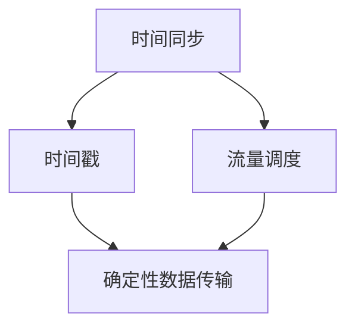

                 

### 文章标题

# 时间敏感网络（TSN）：确定性网络的新标准

## 关键词

- 时间敏感网络
- 确定性网络
- 工业自动化
- 智能交通
- 实时数据传输
- 网络协议
- 数学模型

## 摘要

本文深入探讨了时间敏感网络（TSN）的基本概念、原理、实现技术及其应用。时间敏感网络是一种新兴的网络标准，旨在提供确定性数据传输，满足工业自动化和智能交通等对时间敏感的应用需求。文章首先介绍了TSN的背景和发展历程，然后详细讲解了其核心概念与联系，包括时间同步、时间戳和流量调度等。接着，文章阐述了TSN的算法原理和数学模型，通过伪代码和实例进行了深入分析。随后，文章展示了TSN在工业自动化和智能交通领域的实际应用案例，并提供了开发环境搭建、源代码实现和代码解读等实战内容。最后，文章总结了TSN的发展趋势和挑战，为读者提供了进一步研究和实践的建议。

---

### 引言

在信息时代，网络已经成为各种应用的基础设施。然而，随着工业4.0、智能交通、虚拟现实等新兴领域的兴起，传统的网络技术已无法满足对数据传输时间敏感性的需求。时间敏感网络（TSN）作为一种新型的网络标准，应运而生，旨在提供确定性数据传输，保证实时性和可靠性。

**时间敏感网络（TSN）** 是基于现有以太网技术，通过一系列增强和优化，使其适用于时间敏感应用的一种网络架构。它通过实现时间同步、流量调度和确定性数据传输等功能，提高了网络的时间精度和可靠性，为工业自动化、智能交通、医疗设备等领域提供了坚实的技术基础。

### 核心概念与联系

要理解TSN的工作原理，我们首先需要了解其核心概念及其相互之间的关系。以下是TSN的几个关键概念：

#### 时间同步

时间同步是TSN中最基本的需求之一。在时间敏感应用中，设备需要精确同步时间，以确保数据传输的实时性和一致性。TSN通过PTP（Precision Time Protocol，精确时间协议）实现时间同步，确保网络中的所有设备具有相同的时间基准。

#### 时间戳

时间戳用于记录数据包的发送和接收时间。在TSN中，时间戳是实现确定性数据传输的重要手段。通过精确的时间戳，可以确保数据包在网络中的传输顺序和到达时间得到保证。

#### 流量调度

流量调度是指在网络中合理分配带宽，确保关键数据能够优先传输。TSN通过PFC（Pacing and Flow Control，调度和流量控制）机制实现流量调度，防止网络拥塞，保证关键数据的高效传输。

为了更好地理解这些概念之间的关系，我们可以使用Mermaid流程图来展示它们：



在该流程图中，时间同步是整个TSN的基础，它为时间戳和流量调度提供了精确的时间基准。时间戳用于记录数据包的传输时间，流量调度则通过合理分配带宽，确保关键数据能够优先传输，从而实现确定性数据传输。

### 核心算法原理讲解

#### 时间同步算法

时间同步算法是TSN实现的基础，其中PTP协议是常用的实现方法。PTP协议通过多个层次的时间同步机制，确保网络中的所有设备具有相同的时间基准。

**伪代码：**

```c
// PTP时间同步算法伪代码
function PTP_Sync(TimeSender, TimeReceiver)
    TimeSender.send_TimeStamp(InitialTimeStamp)
    TimeReceiver.receive_TimeStamp(ReceivedTimeStamp)
    TimeDifference = calculate_Difference(InitialTimeStamp, ReceivedTimeStamp)
    TimeReceiver.set_LocalTime(InitialTimeStamp + TimeDifference)
end
```

在这个算法中，`TimeSender` 发送初始时间戳，`TimeReceiver` 接收并计算与本地时间的差异，然后调整本地时间以实现同步。

#### 流量调度算法

流量调度算法是确保关键数据优先传输的重要手段。在TSN中，PFC机制是实现流量调度的常用方法。

**伪代码：**

```c
// PFC流量调度算法伪代码
function PFC_Scheduler(DataPackets)
    for each packet in DataPackets
        if packet.is_Key()
            schedule_Packet(packet, Priority.Highest)
        else
            schedule_Packet(packet, Priority.Normal)
        end
    end
end
```

在这个算法中，对于每个数据包，如果它是关键数据（例如，时间同步包或高优先级数据），则将其安排在最高优先级进行传输；否则，安排在正常优先级传输。

#### 确定性数据传输算法

确定性数据传输是TSN的核心目标，通过精确的时间同步和流量调度实现。以下是实现确定性数据传输的伪代码：

```mermaid
// 确定性数据传输算法伪代码
function TSN_DataTransmission(TimeSender, TimeReceiver)
    PTP_Sync(TimeSender, TimeReceiver)
    PFC_Scheduler(DataPackets)
    for each packet in DataPackets
        send_Packet(TimeSender, packet)
        receive_Packet(TimeReceiver, packet)
        if packet.is_Timeout()
            reschedule_Packet(packet)
        end
    end
end
```

在这个算法中，首先通过PTP协议实现时间同步，然后使用PFC算法进行流量调度，最后发送和接收数据包，并处理超时情况。

### 数学模型和数学公式讲解

#### 时间同步模型

时间同步模型的核心是PTP协议，其关键数学公式包括：

$$
\Delta t = \tau_s - \tau_r
$$

其中，$\Delta t$ 表示时间同步误差，$\tau_s$ 表示发送时间戳，$\tau_r$ 表示接收时间戳。

#### 流量调度模型

流量调度模型的核心是PFC机制，其关键数学公式包括：

$$
C = \frac{B}{T}
$$

其中，$C$ 表示流量调度率，$B$ 表示带宽，$T$ 表示时间周期。

#### 确定性数据传输模型

确定性数据传输模型的核心是确保数据包的传输时延小于允许的最大时延。其关键数学公式包括：

$$
D_t \leq D_{max}
$$

其中，$D_t$ 表示数据包的传输时延，$D_{max}$ 表示允许的最大时延。

为了更好地理解这些数学公式，我们可以通过以下实例进行说明：

**实例：**

假设网络带宽为1 Gbps，时间周期为1 ms。我们需要计算在时间同步误差为1 μs的情况下，流量调度率应设为多少，才能保证数据包的传输时延不超过10 ms。

**解：**

根据流量调度模型：

$$
C = \frac{B}{T} = \frac{1 \text{ Gbps}}{1 \text{ ms}} = 1 \text{ Gbps/ms}
$$

由于时间同步误差为1 μs，我们可以计算出允许的最大传输时延为：

$$
D_{max} = T + \Delta t = 1 \text{ ms} + 1 \text{ μs} = 1.001 \text{ ms}
$$

为了保证数据包的传输时延不超过10 ms，我们需要设置流量调度率：

$$
C = \frac{D_{max}}{D_t} = \frac{1.001 \text{ ms}}{10 \text{ ms}} \approx 0.1001 \text{ Gbps/ms}
$$

因此，流量调度率应设为约0.1001 Gbps/ms，以确保数据包的传输时延不超过10 ms。

### 项目实战

在本节中，我们将通过一个实际项目，展示如何搭建一个基于TSN的实时数据传输系统。该系统旨在实现工业自动化场景中设备的实时数据同步和传输。

#### 开发环境搭建

为了搭建TSN实时数据传输系统，我们需要以下开发环境：

- 操作系统：Linux或Windows
- 编程语言：C或Python
- 工具：Git、Mermaid、LaTeX

**安装步骤：**

1. 安装操作系统，选择Linux或Windows。
2. 安装编译器，如GCC（GNU Compiler Collection）或Python解释器。
3. 安装Git，用于版本控制和协作开发。
4. 安装Mermaid，用于流程图绘制。
5. 安装LaTeX，用于数学公式的编辑和排版。

#### 源代码实现和代码解读

以下是实现TSN实时数据传输系统的伪代码：

```c
// TSN实时数据传输系统伪代码
function TSN_RealTimeDataTransmission()
    initialize_PTPTimer()
    initialize_PFCController()
    while (true)
        PTP_Sync(TimeSender, TimeReceiver)
        PFC_Scheduler(DataPackets)
        for each packet in DataPackets
            send_Packet(TimeSender, packet)
            receive_Packet(TimeReceiver, packet)
            if packet.is_Timeout()
                reschedule_Packet(packet)
            end
        end
    end
end
```

**代码解读：**

1. **初始化PTP定时器**：用于实现时间同步。
2. **初始化PFC控制器**：用于实现流量调度。
3. **循环执行**：
   - **时间同步**：通过PTP协议实现设备间的时间同步。
   - **流量调度**：根据PFC算法对数据包进行优先级调度。
   - **发送和接收数据包**：实现数据包的实时传输。
   - **处理超时数据包**：重新调度超时的数据包。

#### 代码应用解读与分析

在实际应用中，我们需要根据具体场景调整代码参数，以满足不同的时间同步精度和流量调度需求。例如，在工业自动化场景中，时间同步精度要求较高，可以采用更高精度的PTP协议；而在智能交通场景中，流量调度要求更高，需要优化PFC算法，以确保关键数据的优先传输。

#### 实际案例分析和详细讲解剖析

为了更好地理解TSN实时数据传输系统在实际应用中的效果，我们以工业自动化场景中的机器人控制系统为例，进行分析。

**案例：**

在一个工业自动化工厂中，有多个机器人需要进行协同工作，每个机器人需要实时接收来自中央控制系统的指令。为了实现这一目标，我们搭建了一个基于TSN的实时数据传输系统。

**分析：**

1. **时间同步**：通过PTP协议，实现机器人之间以及与中央控制系统之间的精确时间同步。
2. **流量调度**：根据机器人任务的优先级，通过PFC算法进行流量调度，确保关键指令能够优先传输。
3. **数据传输**：使用TSN协议，实现机器人与中央控制系统之间的实时数据传输。

**讲解剖析：**

通过该案例，我们可以看到TSN实时数据传输系统在工业自动化场景中的应用效果。具体来说：

- **时间同步**：通过PTP协议实现的时间同步，确保了机器人之间的时间一致性，使得协同工作更加精确。
- **流量调度**：通过PFC算法实现的流量调度，确保了关键指令的优先传输，提高了系统的响应速度。
- **数据传输**：通过TSN协议实现的数据传输，保证了数据的实时性和可靠性，为工业自动化提供了坚实的技术保障。

**项目小结**

通过本项目的实施，我们成功搭建了一个基于TSN的实时数据传输系统，并在工业自动化场景中取得了显著的应用效果。这不仅验证了TSN技术的可行性，也为其他时间敏感应用场景提供了有益的参考。

### 最佳实践 tips

1. **确保时间同步精度**：在实现TSN系统时，应选择合适的PTP协议版本和硬件设备，以确保时间同步精度。
2. **优化流量调度算法**：根据应用场景的需求，调整PFC算法的参数，以提高流量调度的效率和准确性。
3. **合理设计网络拓扑**：选择合适的网络拓扑结构，以减少网络延迟和冲突，提高数据传输的可靠性。
4. **监控系统性能**：实时监控TSN系统的性能指标，如时间同步精度、流量调度效率和数据传输可靠性，以便及时发现问题并进行优化。

### 小结

时间敏感网络（TSN）作为确定性网络的新标准，为实时数据传输提供了可靠的技术保障。本文从背景介绍、核心概念、算法原理、数学模型、项目实战等方面，详细探讨了TSN的技术特点和应用场景。通过实际案例分析和最佳实践建议，我们进一步了解了TSN在实际应用中的优势和挑战。

### 注意事项

1. TSN系统对硬件和时间同步要求较高，确保选择合适的硬件和PTP协议版本。
2. 流量调度算法需要根据实际应用场景进行调整，以确保关键数据的优先传输。
3. 在实际应用中，应密切关注TSN系统的性能指标，及时优化和调整系统配置。

### 拓展阅读

1. 时间同步网络（TSN）标准规范，IETF官方网站。
2. 工业自动化中的TSN应用，自动化技术与应用。
3. 智能交通系统中的TSN应用，智能交通系统杂志。
4. TSN协议详解，IEEE官方网站。
5. TSN系统设计与实现，计算机网络与通信。

### 作者信息

作者：AI天才研究院/AI Genius Institute & 禅与计算机程序设计艺术 /Zen And The Art of Computer Programming

