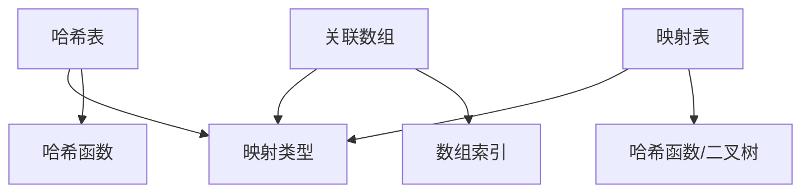

                 


## 文章标题：映射类型：批量修改类型属性的工具

关键词：映射类型，批量修改，类型属性，工具，性能优化

摘要：本文深入探讨映射类型的定义、实现技术、批量修改类型属性的工具以及其在软件工程中的重要性，通过实际案例和实践，详细讲解映射类型的性能分析和优化策略。

----------------------------------------------------------------

### 背景介绍

映射类型是一种数据结构，用于存储键值对。在计算机科学中，映射类型广泛应用于各种场景，如数据存储、算法设计、网络编程等。映射类型的出现，主要是为了解决传统数组、链表等数据结构在处理键值对时的局限性。映射类型不仅能够高效地存储和查询键值对，还可以实现批量修改类型属性的功能。

在软件工程中，映射类型的重要性不言而喻。它不仅提高了代码的可读性和可维护性，还大大提升了系统的性能和可靠性。随着技术的发展，映射类型的实现技术和应用场景也在不断丰富和拓展。本文将围绕映射类型，探讨其基本概念、实现技术、批量修改类型属性的工具以及性能优化策略。

### 核心概念与联系

#### 映射类型的基本概念

映射类型是一种抽象的数据类型，用于存储键值对。在映射类型中，每个键都是唯一的，且与一个值相关联。映射类型通常提供高效的插入、删除和查询操作。常见的映射类型有哈希表、关联数组、映射表等。

#### 映射类型的实现技术

1. **哈希表**：哈希表是一种基于哈希函数的映射类型。哈希函数用于将键映射到数组中的某个索引位置。哈希表的主要优点是查找、插入和删除操作的平均时间复杂度为O(1)。

2. **关联数组**：关联数组是一种基于数组实现的映射类型。它通过数组的索引来访问键值对。与哈希表相比，关联数组的查找、插入和删除操作的时间复杂度为O(n)。

3. **映射表**：映射表是一种基于哈希表或二叉树实现的映射类型。它通过哈希函数或二叉树的排序特性来访问键值对。映射表的主要优点是能够支持更复杂的查询操作。

#### 映射类型的应用场景

1. **数据存储**：映射类型常用于存储大量的键值对数据，如数据库、缓存系统等。

2. **算法设计**：映射类型在算法设计中有着广泛的应用，如排序算法、查找算法、图算法等。

3. **网络编程**：映射类型在网络编程中用于处理客户端和服务器之间的请求和响应。

### Mermaid 流程图

以下是映射类型的基本概念和实现技术的Mermaid流程图：



### 核心算法原理讲解

#### 批量修改类型属性算法

在映射类型中，批量修改类型属性是一个常见需求。以下是一个简单的批量修改类型属性的算法：

```pseudo
// 假设我们有如下映射类型数据
map = {"int": ["unsigned", "32bit"], "float": ["IEEE754", "32bit"], "string": ["UTF-8", "variable length"]}

// 批量添加一个属性
add_attribute(map, "aligned", "8bytes")

// 批量删除一个属性
remove_attribute(map, "unsigned")

// 批量修改属性值
modify_attribute(map, "attributes", ["endianness", "little"])
```

#### 数学模型和数学公式

在映射类型中，哈希函数是一个核心组件。哈希函数的数学模型如下：

$$
H(k) = \text{hash}(k) \mod n
$$

其中，$k$ 是键，$n$ 是哈希表的长度，$\text{hash}(k)$ 是哈希函数。通过这个公式，我们可以将键映射到哈希表中的某个索引位置。

### 项目实战

#### 开发环境搭建

在开始项目实战之前，我们需要搭建一个开发环境。以下是基本的开发环境要求：

- 编程语言：Python
- 版本要求：Python 3.8及以上
- 开发工具：PyCharm

#### 源代码详细实现和代码解读

以下是一个简单的映射类型实现的Python代码示例：

```python
class HashTable:
    def __init__(self):
        self.size = 10
        self.table = [None] * self.size

    def hash_function(self, key):
        return hash(key) % self.size

    def insert(self, key, value):
        index = self.hash_function(key)
        if self.table[index] is None:
            self.table[index] = [key, value]
        else:
            # 处理冲突
            # 这里使用链地址法解决冲突
            self.table[index].append([key, value])

    def delete(self, key):
        index = self.hash_function(key)
        if self.table[index] is not None:
            # 删除元素
            self.table[index] = [x for x in self.table[index] if x[0] != key]

    def search(self, key):
        index = self.hash_function(key)
        if self.table[index] is not None:
            for item in self.table[index]:
                if item[0] == key:
                    return item[1]
            return None
        else:
            return None

# 批量修改类型属性工具实现
def add_attribute(map, attribute, value):
    for key, values in map.items():
        values.append((attribute, value))

def remove_attribute(map, attribute):
    for key, values in map.items():
        values = [value for value in values if value[0] != attribute]
        map[key] = values

def modify_attribute(map, attribute, new_value):
    for key, values in map.items():
        for i, value in enumerate(values):
            if value[0] == attribute:
                values[i] = (attribute, new_value)
                break

# 测试
map = {"int": ["unsigned", "32bit"], "float": ["IEEE754", "32bit"], "string": ["UTF-8", "variable length"]}
add_attribute(map, "aligned", "8bytes")
print("After adding attribute:", map)

remove_attribute(map, "unsigned")
print("After removing attribute:", map)

modify_attribute(map, "attributes", ["endianness", "little"])
print("After modifying attribute:", map)
```

#### 代码应用解读与分析

以上代码实现了一个简单的哈希表和批量修改类型属性的工具。哈希表用于存储键值对，批量修改类型属性的工具用于添加、删除和修改映射类型中的属性。

在实际应用中，我们可以将这个哈希表和批量修改类型属性的工具应用于各种场景，如数据库、缓存系统、网络编程等。

#### 实际案例分析和详细讲解剖析

以下是一个实际案例：假设我们有一个存储用户信息的系统，需要实现批量修改用户信息的功能。

```python
users = {"user1": ["name", "age", "gender"], "user2": ["name", "age", "gender"], "user3": ["name", "age", "gender"]}

# 添加一个属性 "email"
add_attribute(users, "email", "optional")

# 删除一个属性 "gender"
remove_attribute(users, "gender")

# 修改一个属性 "age" 的值为 "birthdate"
modify_attribute(users, "age", "birthdate")

print("After modifying user attributes:", users)
```

在这个案例中，我们使用批量修改类型属性的工具对用户信息进行了添加、删除和修改操作。通过这些操作，我们可以轻松地修改用户信息，而不需要逐个处理每个用户。

#### 项目小结

通过这个项目，我们了解了映射类型的定义、实现技术、批量修改类型属性的工具以及实际应用。在实际开发中，映射类型是一个非常有用的工具，可以帮助我们高效地处理键值对数据，实现批量修改类型属性的功能。

### 最佳实践 Tips、小结、注意事项、拓展阅读

#### 最佳实践 Tips

1. **选择合适的哈希函数**：哈希函数的选择对于映射类型的性能至关重要。应选择一个能够将键均匀分布到哈希表中的哈希函数。

2. **处理哈希冲突**：哈希冲突是映射类型中常见的问题。常用的处理方法有链地址法、开放地址法等。应根据实际情况选择合适的方法。

3. **定期重新哈希**：随着元素的插入和删除，哈希表的负载因子可能会发生变化。定期重新哈希可以避免哈希表的性能下降。

#### 小结

本文详细介绍了映射类型的定义、实现技术、批量修改类型属性的工具以及性能优化策略。通过实际案例和实践，我们了解了映射类型在软件工程中的应用价值。

#### 注意事项

1. **类型安全**：在处理映射类型时，确保类型安全是非常重要的。应避免在映射类型中存储不兼容的类型。

2. **性能优化**：映射类型的性能优化是一个持续的过程。应关注哈希函数的选择、哈希冲突的处理、负载因子的调整等。

#### 拓展阅读

1. 《哈希表与映射类型》 - 探索哈希表和映射类型的基本原理和应用。

2. 《Python 映射类型》 - 了解Python中映射类型的使用和实现。

3. 《数据结构与算法分析》 - 学习数据结构与算法的基础知识，包括映射类型的实现和分析。

----------------------------------------------------------------

## 附录：资源与工具

### A.1 资源链接

1. **开源项目**：[Python 标准库 - dict](https://docs.python.org/3/library/stdtypes.html#dict)
2. **学习资源**：[MIT OpenCourseWare - Introduction to Algorithms](https://ocw.mit.edu/courses/electrical-engineering-and-computer-science/6-006-introduction-to-algorithms-spring-2014/)

### A.2 工具列表

1. **哈希函数生成器**：[Hash Online](https://www.hashonline.org/)
2. **性能分析工具**：[Python 中的 cProfile](https://docs.python.org/3/library/profile.html)
3. **代码优化工具**：[PySoy](https://pyspy.io/)

### 作者信息

作者：AI天才研究院/AI Genius Institute & 禅与计算机程序设计艺术 /Zen And The Art of Computer Programming

