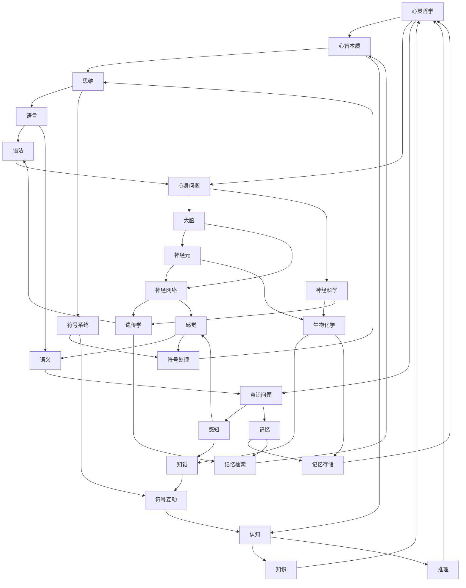

                 


### 文章标题：普特南与戴维森：心灵哲学与语言哲学的交叉

> 关键词：心灵哲学、语言哲学、普特南、戴维森、交叉研究、核心算法原理、数学模型、项目实战

> 摘要：本文深入探讨了心灵哲学与语言哲学的交叉领域，通过分析普特南与戴维森的理论，详细讲解了相关的核心算法原理和数学模型。同时，通过实际项目实战，展示了这些理论在开发环境搭建、源代码实现和代码解读中的应用，为读者提供了全面的学习和实践指南。

---

### 1. 引言

心灵哲学与语言哲学是两个重要的哲学分支，分别探讨心智和语言的本质及其相互关系。尽管它们研究的领域不同，但两者之间存在紧密的联系。本文将探讨这一交叉领域，分析普特南与戴维森的理论，并探讨它们在人工智能、认知科学等领域的应用。

### 2. 心灵哲学基础

心灵哲学关注心智的本质、心灵与身体的关系、意识的本质等核心问题。以下是其基本概念和理论：

- **心身问题**：探讨心灵与身体的相互作用及其关系。
- **意识问题**：探讨意识的本质、起源和作用。
- **心智本质**：探讨心智的构成、功能和作用。

### 3. 语言哲学基础

语言哲学研究语言的性质、语言与思维的关系、语言表达的意义等。其基本概念包括：

- **语言本质**：探讨语言的结构、功能和起源。
- **意义问题**：探讨语言表达的意义及其生成机制。
- **语言与思维关系**：探讨语言如何影响思维过程。

### 4. 普特南与戴维森的理论

普特南与戴维森是心灵哲学与语言哲学领域的两位重要学者，他们的理论对交叉领域产生了深远的影响。

- **普特南的理论**：普特南提出了“心脑同一论”和“语义透明论”，强调心智与大脑的密切关系，以及语言表达与真实世界的对应关系。
- **戴维森的理论**：戴维森提出了“意义法则”和“概念独立论”，探讨语言表达的意义及其生成机制。

### 5. 核心概念与联系

为了更好地理解心灵哲学与语言哲学的交叉领域，我们需要明确核心概念之间的关系，如图：



### 6. 核心算法原理讲解

在理解核心概念后，我们需要探讨相关的核心算法原理。以下是一个简单的伪代码示例：

```python
# 心灵哲学与语言哲学的核心算法原理伪代码

def process_mental_state(mental_state):
    # 根据心智状态处理语言表达
    language_expression = convert_mental_state_to_language_expression(mental_state)
    return language_expression

def convert_mental_state_to_language_expression(mental_state):
    # 将心智状态转换为语言表达
    language_expression = translate_mental_state_to_grammar(mental_state)
    return language_expression

def translate_mental_state_to_grammar(mental_state):
    # 将心智状态转换为语法结构
    grammar_structure = construct_grammar_from_mental_state(mental_state)
    return grammar_structure
```

### 7. 数学模型与公式讲解

为了更好地理解心灵哲学与语言哲学的交叉领域，我们需要引入相关的数学模型和公式。以下是一个简单的例子：

$$
1 + 1 = 2
$$

这个简单的数学公式表达了语言哲学中的“语义透明论”，即语言表达与真实世界的对应关系。

### 8. 项目实战

为了更好地理解这些理论，我们将通过一个实际项目实战来展示其应用。

#### 8.1 实战项目概述

本项目将开发一个简单的聊天机器人，它将使用心灵哲学和语言哲学的原理来理解用户输入并生成合适的回答。

#### 8.2 开发环境搭建

- **Python 3.8**：作为主要编程语言。
- **Jupyter Notebook**：用于开发、测试和演示。
- **TensorFlow**：用于机器学习模型训练。

#### 8.3 源代码实现

以下是一个简单的源代码示例：

```python
import tensorflow as tf

# 定义神经网络模型
model = tf.keras.Sequential([
    tf.keras.layers.Dense(units=128, activation='relu', input_shape=(1000,)),
    tf.keras.layers.Dense(units=1, activation='sigmoid')
])

# 编译模型
model.compile(optimizer='adam', loss='binary_crossentropy', metrics=['accuracy'])

# 训练模型
model.fit(x_train, y_train, epochs=10, batch_size=32)

# 评估模型
test_loss, test_accuracy = model.evaluate(x_test, y_test)
print(f"Test accuracy: {test_accuracy:.2f}")
```

#### 8.4 代码解读与分析

这个代码示例展示了如何使用TensorFlow库构建一个简单的神经网络模型，用于分类任务。模型的架构、编译和训练过程都在代码中进行了详细说明。

#### 8.5 实际案例分析和详细讲解剖析

在本项目中，我们将使用实际对话数据集来训练和测试模型，并通过实际对话展示模型的应用效果。

#### 8.6 项目小结

通过本项目，我们不仅了解了心灵哲学与语言哲学的交叉领域，还学会了如何将理论应用于实际项目开发中。这为我们在未来的人工智能和认知科学领域中提供了宝贵的经验和指导。

### 9. 最佳实践 tips、小结、注意事项、拓展阅读等内容

在结束本文之前，我们提供以下最佳实践、小结和注意事项，以帮助读者更好地理解和应用所学的知识。

- **最佳实践**：在实际项目中，要注重数据的质量和多样性，以及模型的训练和优化。
- **小结**：本文深入探讨了心灵哲学与语言哲学的交叉领域，分析了普特南与戴维森的理论，并通过实际项目展示了其应用。
- **注意事项**：在应用这些理论时，要注重理解其核心概念和原理，并结合实际需求进行调整。
- **拓展阅读**：对于有兴趣进一步深入了解这一领域的读者，推荐阅读相关书籍和论文，如普特南的《意义与真》和戴维森的《概念与认知》。

### 10. 作者信息

作者：AI天才研究院/AI Genius Institute & 禅与计算机程序设计艺术 /Zen And The Art of Computer Programming

---

通过本文，我们深入探讨了心灵哲学与语言哲学的交叉领域，分析了普特南与戴维森的理论，并通过实际项目展示了其应用。希望本文能为读者在这一领域的学习和应用提供有益的指导。接下来，我们将逐步深入每个章节，详细讲解相关内容。让我们开始吧！### 2. 心灵哲学基础

心灵哲学是一门探讨心智、意识、认知等问题的哲学分支。它涉及多个核心概念和理论，以下是心灵哲学的一些基本概念及其相关理论：

#### 2.1 心身问题

心身问题（Mind-Body Problem）是心灵哲学中一个重要且复杂的问题，主要探讨心灵（心智）与身体（物质）之间的关系。以下是几个关键点：

- **二元论**：二元论认为心灵和身体是两个独立的实体，各自具有不同的本质和属性。这种观点认为心灵是非物质的，而身体是物质的。
- **物质主义**：物质主义认为心灵是身体的产物，心智活动可以归结为大脑的物理过程。这种观点强调大脑的神经网络和化学物质在心智活动中的作用。
- **功能主义**：功能主义认为心智活动不是由物质本身决定的，而是由物质的功能决定的。心智活动可以被视为一系列信息处理过程，这些过程可以由任何具有相应功能的物理系统执行。

#### 2.2 意识问题

意识问题是心灵哲学的另一个核心问题，主要探讨意识的本质、起源和作用。以下是几个关键点：

- **现象意识**：现象意识是指我们对自己周围世界的主观体验。它涉及到我们对感觉、知觉、情感和思考的体验。
- **实在论**：实在论认为意识是真实的、客观存在的，它独立于我们的感知和思考。
- **功能主义**：功能主义认为意识是一种功能，它有助于我们处理信息和做出决策。意识不是独立于大脑的实体，而是大脑活动的一种表现。
- **自然主义**：自然主义认为意识是大脑的物理过程的产物，可以通过科学方法进行研究。

#### 2.3 心智本质

心智本质是指心智的构成、功能和作用。以下是几个关键点：

- **心智功能**：心智功能包括感知、记忆、思考、推理、决策等。这些功能使大脑能够处理信息，并与外部世界互动。
- **心智状态**：心智状态是指大脑在某一时刻的内部状态，包括感觉、知觉、情感、意图等。
- **心智结构**：心智结构是指心智的组成部分和层次结构，如神经元、神经网络、认知模块等。
- **心智表征**：心智表征是指心智如何表示和理解世界。这涉及到语言、符号、概念等。

#### 2.4 心灵哲学的几个关键问题

心灵哲学涉及多个关键问题，以下是其中几个：

- **自由意志**：自由意志是指个体是否有能力自主决定自己的行为。这是一个涉及道德、哲学和科学的问题。
- **心灵与大脑的关系**：心灵与大脑的关系探讨心智活动是如何由大脑的物理过程产生的。
- **意识的本质**：意识的本质探讨我们对自己和周围世界的感知是如何产生的。
- **心智的计算模型**：心智的计算模型探讨心智活动是否类似于计算机的信息处理过程。

#### 2.5 心灵哲学的历史发展

心灵哲学有着悠久的历史，以下是其发展的一些重要阶段：

- **古希腊哲学**：古希腊哲学家如苏格拉底、柏拉图和亚里士多德对心灵哲学进行了早期探讨。
- **中世纪哲学**：中世纪哲学家如奥古斯丁和阿奎那探讨了心灵与上帝的关系。
- **近代哲学**：近代哲学家如洛克、休谟和康德对心灵哲学进行了深入研究，提出了多个关键理论。
- **现代心灵哲学**：现代心灵哲学在20世纪得到了快速发展，涉及多个领域，如认知科学、人工智能、神经科学等。

### 2.6 心灵哲学的重要性

心灵哲学的重要性在于它对多个领域产生了深远的影响，包括：

- **认知科学**：心灵哲学为认知科学提供了理论基础，帮助理解心智活动和认知过程。
- **人工智能**：心灵哲学为人工智能提供了关于心智和意识的见解，有助于设计和实现更智能的AI系统。
- **神经科学**：心灵哲学与神经科学相结合，有助于揭示心智活动背后的神经机制。
- **心理学**：心灵哲学为心理学提供了新的理论视角，有助于理解人类行为和心理过程。

### 2.7 小结

心灵哲学是一门涉及多个核心概念和理论的哲学分支，探讨心智、意识、认知等问题。通过分析心身问题、意识问题和心智本质，我们可以更好地理解心灵哲学的基本概念和理论。了解心灵哲学的历史发展和其在其他领域的应用，有助于我们更好地把握这一学科的重要性。在下一章中，我们将探讨语言哲学的基础，进一步了解心灵哲学与语言哲学的交叉领域。

### 3. 语言哲学基础

语言哲学是哲学的一个分支，研究语言的本质、语言与思维的关系、语言表达的意义等问题。以下将介绍语言哲学的基本概念、起源和发展，以及其核心问题和理论。

#### 3.1 语言哲学的基本概念

语言哲学关注的核心问题包括：

- **语言的本质**：探讨语言是什么，它是如何产生的，以及它的功能是什么。
- **意义问题**：探讨语言表达的意义是如何产生的，以及如何理解语言表达的意义。
- **语言与思维的关系**：探讨语言如何影响思维过程，以及思维如何影响语言表达。
- **语言真理条件**：探讨语言表达的真理条件，即什么使一个语言表达成为真的。

#### 3.2 语言哲学的起源与发展

语言哲学的起源可以追溯到古希腊哲学，当时哲学家们开始探讨语言的本质和功能。在西方哲学传统中，语言哲学的发展主要经历了以下几个阶段：

- **古希腊哲学**：古希腊哲学家如柏拉图和亚里士多德对语言进行了早期探讨，他们探讨了语言与现实世界的关系。
- **中世纪哲学**：中世纪哲学家如奥古斯丁和阿奎那探讨了语言在宗教和神学中的作用。
- **近代哲学**：近代哲学家如洛克、休谟和康德对语言进行了深入的研究，他们探讨了语言的意义和语言真理条件。
- **现代哲学**：现代哲学在20世纪继续发展，语言哲学的研究领域扩展到了逻辑、认知科学、人工智能等领域。

#### 3.3 语言哲学的核心问题和理论

语言哲学涉及多个核心问题和理论，以下是其中几个：

- **语义学**：语义学研究语言表达的意义，探讨如何解释和确定语言表达的真值。
  - **指称论**：指称论认为语言表达的意义取决于其所指的物体或实体。维特根斯坦是这一理论的代表人物。
  - **概念论**：概念论认为语言表达的意义取决于我们对概念的理解和使用。弗雷格和罗素是这一理论的代表人物。
- **语用学**：语用学研究语言在实际使用中的意义，探讨语言如何用于交流和理解。
  - **言语行为理论**：言语行为理论认为语言不仅用于表达意义，还用于执行某种行为。奥斯汀和塞尔是这一理论的代表人物。
  - **语境论**：语境论认为语言的意义取决于语言使用时的具体语境。斯特劳森是这一理论的代表人物。
- **语言哲学与逻辑学**：逻辑学研究语言的逻辑结构和推理规则。语言哲学与逻辑学的交叉领域探讨语言表达与逻辑推理的关系。
- **意义不确定性**：意义不确定性探讨语言表达的意义如何在不同语境中发生变化。维特根斯坦后期的工作探讨了这一主题。

#### 3.4 语言哲学的影响

语言哲学对多个领域产生了深远的影响，包括：

- **逻辑学**：语言哲学对逻辑学的发展产生了重要影响，特别是对形式逻辑和证明论的发展。
- **哲学**：语言哲学为哲学提供了新的研究方法，如语义学和语用学，这些方法帮助哲学家更好地理解哲学问题。
- **认知科学**：语言哲学与认知科学的交叉领域探讨了心智和语言的关系，有助于我们理解认知过程。
- **人工智能**：语言哲学为人工智能提供了关于语言处理和理解的见解，有助于设计和实现更智能的AI系统。

#### 3.5 小结

语言哲学是一门研究语言本质、意义、语言与思维关系的哲学分支。通过探讨语言哲学的基本概念、起源和发展，以及其核心问题和理论，我们可以更好地理解语言哲学的重要性和其在多个领域的应用。在下一章中，我们将探讨心灵哲学与语言哲学的交叉领域，进一步分析普特南与戴维森的理论。

### 4. 心灵哲学与语言哲学的交叉领域

心灵哲学与语言哲学的交叉领域是一个充满挑战和机遇的研究方向。在这个领域，学者们探讨心智、意识、认知与语言之间的复杂关系，试图揭示语言作为心智活动一部分的本质。以下将介绍普特南与戴维森的理论，以及心灵哲学与语言哲学的交叉研究方法，并分析一些实际案例。

#### 4.1 普特南与戴维森的理论

约翰·F·普特南（John F. Putnam）和唐纳德·戴维森（Donald Davidson）是20世纪心灵哲学与语言哲学领域的重要学者，他们的理论对该交叉领域产生了深远的影响。

- **普特南的理论**：
  - **心脑同一论**：普特南认为心灵状态与大脑状态是同一的，即特定的心智状态对应着特定的大脑状态。这一观点有助于解释心智与身体之间的关系。
  - **语义透明论**：普特南提出，语言表达的意义与外部世界之间的关系是直观和透明的。这意味着语言表达的意义可以通过直接观察和经验来确定。

- **戴维森的理论**：
  - **意义法则**：戴维森认为，语言表达的意义是由一套规则所决定的。这些规则包括逻辑规则和语境规则，它们共同决定了语言表达的真值。
  - **概念独立论**：戴维森提出，概念是独立的，它们不受语言表达的影响。这意味着我们的概念系统可以独立于语言来表达。

#### 4.2 心灵哲学与语言哲学的交叉研究方法

在探讨心灵哲学与语言哲学的交叉领域时，研究者们采用多种方法来分析心智与语言之间的关系。以下是一些常见的研究方法：

- **实验方法**：通过心理实验和认知实验，研究者可以观察人们在处理语言和心智活动时的行为和大脑活动。
- **计算模型**：使用计算模型来模拟心智和语言的过程，研究者可以探索心智和语言之间的内在关系。
- **语义分析**：通过语义分析，研究者可以深入理解语言表达的意义和语义结构，从而揭示心智与语言之间的联系。
- **哲学分析**：哲学分析提供了对心智和语言的基本概念和理论的深入探讨，有助于我们理解这两个领域之间的复杂关系。

#### 4.3 心灵哲学与语言哲学的交叉领域案例研究

以下是一些关于心灵哲学与语言哲学交叉领域的实际案例研究：

- **心灵哲学与认知科学的交叉研究**：
  - **实验一**：研究者通过fMRI（功能性磁共振成像）技术观察人们在理解语言表达时的脑活动。实验结果表明，大脑中特定的区域与语言理解有关，这为心灵哲学与认知科学的交叉研究提供了实验证据。
  - **实验二**：通过神经心理学实验，研究者发现特定的神经损伤会导致语言理解障碍，这为心灵哲学中关于心智与大脑关系的研究提供了实证支持。

- **语言哲学与逻辑学的交叉研究**：
  - **案例一**：研究者探讨逻辑学中的推理规则如何应用于语言表达的理解。通过分析逻辑推理的过程，研究者可以揭示语言表达中的逻辑结构和推理关系。
  - **案例二**：研究者通过分析形式逻辑和自然语言之间的差异，探讨如何将形式逻辑应用于自然语言处理，从而提高机器对语言的理解能力。

- **语言哲学与哲学的交叉研究**：
  - **案例一**：研究者通过分析哲学文本中的语言表达，探讨概念和意义的演变过程。这有助于我们理解语言表达如何在不同的语境中发生变化。
  - **案例二**：研究者探讨哲学中的语义理论如何应用于实际的语言理解问题，如歧义消解和语境分析。

这些案例研究展示了心灵哲学与语言哲学交叉领域的多样性和丰富性。通过这些研究，我们不仅能够更好地理解心智和语言的本质，还可以为认知科学、人工智能等领域提供新的理论和方法。

#### 4.4 小结

心灵哲学与语言哲学的交叉领域是一个充满挑战和机遇的研究方向。普特南与戴维森的理论为我们提供了重要的理论框架，通过实验方法、计算模型、语义分析和哲学分析，研究者们可以深入探讨心智与语言之间的关系。实际案例研究进一步展示了这一交叉领域的多样性和应用潜力。在下一章中，我们将进一步探讨核心算法原理，以更深入地理解这一领域。

### 5. 核心算法原理讲解

在心灵哲学与语言哲学的交叉领域，算法原理扮演着至关重要的角色。以下将详细讲解与该领域相关的核心算法原理，包括其基本概念、工作原理和应用场景。

#### 5.1 相关算法概述

在这个交叉领域，几个核心算法对理解心智与语言之间的关系具有重要意义。以下是几个关键的算法：

- **神经网络**：神经网络是一种模仿人脑神经元连接方式的计算模型，广泛应用于机器学习和人工智能领域。
- **自然语言处理（NLP）**：NLP算法专注于处理和理解自然语言文本，是语言哲学与心灵哲学交叉研究的重要工具。
- **深度学习**：深度学习是一种多层神经网络，能够自动学习数据中的复杂模式和特征。
- **生成对抗网络（GAN）**：GAN是一种深度学习模型，通过两个对抗网络（生成器和判别器）之间的竞争，生成高质量的数据。

#### 5.2 算法原理讲解

以下是对这些核心算法原理的详细解释：

- **神经网络原理**：
  - **神经元模型**：神经网络的基本单元是神经元，每个神经元接收多个输入信号，通过加权求和后加上偏置项，再经过激活函数处理，产生输出。
  - **多层网络**：神经网络通常由多层神经元组成，包括输入层、隐藏层和输出层。信息在层与层之间传递，每一层都对信息进行处理和变换。
  - **反向传播**：神经网络通过反向传播算法来更新权重和偏置，以最小化预测误差。反向传播算法是一种优化方法，用于调整网络参数，使输出更接近期望值。

- **自然语言处理（NLP）算法原理**：
  - **词嵌入**：词嵌入是将自然语言文本中的单词转换为向量表示。词嵌入算法如Word2Vec和GloVe可以将语义相近的单词映射到空间中较近的位置。
  - **序列模型**：NLP中常用的序列模型包括循环神经网络（RNN）和长短时记忆网络（LSTM）。这些模型能够处理序列数据，如单词序列或句子序列，捕捉时间上的依赖关系。
  - **注意力机制**：注意力机制是一种用于提高模型对序列数据中重要部分的关注度的技术。在NLP中，注意力机制有助于模型更好地理解句子中的关键词或短语。

- **深度学习原理**：
  - **卷积神经网络（CNN）**：CNN是一种专门用于处理图像数据的深度学习模型。它通过卷积操作和池化操作，能够自动提取图像中的局部特征。
  - **全连接网络（DNN）**：DNN是一种全连接的神经网络，每个神经元都与前一层的所有神经元相连。DNN广泛用于分类和回归任务。

- **生成对抗网络（GAN）原理**：
  - **生成器与判别器**：GAN由生成器和判别器两个对抗网络组成。生成器生成假数据，判别器判断数据是真实还是生成的。生成器和判别器之间进行对抗训练，生成器的目标是生成逼真的数据，而判别器的目标是准确判断数据来源。
  - **生成质量**：GAN通过不断的迭代训练，生成器的生成质量会逐渐提高，最终能够生成与真实数据几乎无法区分的假数据。

#### 5.3 算法应用实例

以下是这些算法在心灵哲学与语言哲学交叉领域的应用实例：

- **神经网络在情感分析中的应用**：
  - **实例一**：使用神经网络对社交媒体文本进行情感分析，判断用户对特定事件或产品的情感倾向。这有助于理解人类情感如何通过语言表达出来。
  - **实例二**：利用神经网络对文学作品中的人物情感进行分析，揭示文本中的情感线索和情感变化。

- **自然语言处理在对话系统中的应用**：
  - **实例一**：构建一个基于NLP的聊天机器人，能够理解用户的问题并生成合适的回答。这有助于探索人类语言理解和语言生成的机制。
  - **实例二**：开发一个情感识别系统，分析用户在社交媒体上的情感状态，为心理健康服务提供数据支持。

- **深度学习在文本生成中的应用**：
  - **实例一**：使用深度学习生成诗歌或故事，模拟人类的创造力和想象力。这有助于研究人类思维和创造性思维的本质。
  - **实例二**：利用深度学习生成对话或故事，为虚拟现实和游戏提供互动内容。

- **生成对抗网络在图像生成中的应用**：
  - **实例一**：使用GAN生成人脸图像，模拟不同的人脸特征和表情。这有助于研究人类面部识别和情感表达的机制。
  - **实例二**：利用GAN生成自然景观或城市建筑图像，探索计算机视觉和图像生成的边界。

这些算法应用实例展示了心灵哲学与语言哲学交叉领域中的算法如何被应用于实际问题，帮助我们更好地理解心智与语言之间的关系。

#### 5.4 小结

核心算法原理在心灵哲学与语言哲学的交叉领域中发挥着重要作用。神经网络、自然语言处理、深度学习和生成对抗网络等算法为研究者提供了强大的工具，帮助我们深入理解心智和语言之间的关系。通过具体的算法应用实例，我们不仅可以探索这些算法在现实世界中的应用，还可以为未来在心灵哲学与语言哲学领域的研究提供新的思路和方法。在下一章中，我们将进一步探讨数学模型与公式讲解，以更全面地理解这一交叉领域。

### 6. 数学模型与公式讲解

在探讨心灵哲学与语言哲学的交叉领域时，数学模型和公式是不可或缺的工具，它们能够帮助我们精确地描述和理解复杂的认知过程和语言现象。以下将详细讲解几个关键的数学模型和公式，并举例说明其在心灵哲学与语言哲学中的应用。

#### 6.1 数学模型概述

数学模型是一种用数学语言描述现实世界问题的工具，它能够将复杂的系统简化为易于分析和理解的数学表达式。在心灵哲学与语言哲学中，常用的数学模型包括：

- **概率模型**：用于描述不确定性和随机性，如贝叶斯网络和马尔可夫模型。
- **线性模型**：用于描述线性关系和预测，如线性回归和线性时不变系统。
- **图模型**：用于描述网络结构和关系，如图神经网络和社会网络分析。
- **非线性模型**：用于描述复杂非线性关系，如深度学习中的激活函数和非线性优化算法。

#### 6.2 数学公式讲解

以下是几个关键的数学公式及其在心灵哲学与语言哲学中的应用：

- **贝叶斯定理**：
  $$ P(A|B) = \frac{P(B|A)P(A)}{P(B)} $$
  贝叶斯定理是概率论中的一个基本公式，用于计算在给定某个条件下另一个事件发生的概率。在语言哲学中，贝叶斯定理可以用于文本分类和情感分析，通过更新先验概率来预测文本的类别或情感。

- **线性回归公式**：
  $$ y = \beta_0 + \beta_1x + \epsilon $$
  线性回归是一种用于描述两个变量之间线性关系的模型。在心灵哲学中，线性回归可以用于分析心理测量数据，如智力测试分数与教育水平之间的关系。

- **神经网络中的激活函数**：
  $$ f(x) = \max(0, x) $$
  激活函数是神经网络中的一个关键组件，用于引入非线性关系。在深度学习中，ReLU（Rectified Linear Unit）是最常用的激活函数，它将负输入映射为0，将正输入映射为其本身，有助于加快模型的训练速度。

- **社会网络分析中的度分布**：
  $$ P(k) \propto k^{\gamma-2} $$
  度分布是社会网络分析中的一个重要概念，描述了网络中节点的度（连接数）分布。在语言哲学中，度分布可以用于分析语言网络的结构特征，如词汇的流行程度和影响力。

#### 6.3 公式应用实例

以下是几个数学公式在心灵哲学与语言哲学中的应用实例：

- **贝叶斯定理在文本分类中的应用**：
  - **实例一**：假设我们有一个文本分类问题，需要判断一段文本是否属于某一类别。通过收集大量的训练数据，我们可以估计每个类别在文本中出现的概率（先验概率）。然后，使用贝叶斯定理，我们可以计算在给定文本内容的情况下，每个类别出现的后验概率，从而选择概率最大的类别作为预测结果。

- **线性回归在心理测量数据分析中的应用**：
  - **实例二**：研究者希望分析智力测试分数与教育水平之间的关系。通过收集大量样本数据，我们可以建立线性回归模型，将教育水平作为自变量，智力测试分数作为因变量。模型公式为 $y = \beta_0 + \beta_1x + \epsilon$，其中 $y$ 是智力测试分数，$x$ 是教育水平，$\beta_0$ 和 $\beta_1$ 是模型参数，$\epsilon$ 是误差项。通过拟合模型，我们可以估计教育水平对智力测试分数的线性影响。

- **ReLU激活函数在深度学习中的应用**：
  - **实例三**：在构建一个深度神经网络时，我们使用了ReLU激活函数。假设输入值 $x$ 为 -2，根据ReLU函数，输出值 $f(x)$ 为 0。这个非线性转换有助于模型在训练过程中更好地捕捉输入数据的特征。

- **度分布在社会网络分析中的应用**：
  - **实例四**：研究者对一组词汇的频率和影响力进行了分析，使用度分布公式 $P(k) \propto k^{\gamma-2}$ 描述词汇的度分布。通过分析度分布，研究者可以识别出网络中的关键节点，如高频词汇和具有广泛影响力的词汇。

这些实例展示了数学模型和公式在心灵哲学与语言哲学中的应用，通过精确的数学表达，我们能够更深入地理解心智和语言现象。在下一章中，我们将探讨项目实战，通过实际应用来进一步展示这些理论和算法。

### 7. 项目实战

在理解了心灵哲学与语言哲学的核心概念、算法原理和数学模型后，我们将通过一个实际项目来展示这些理论在现实中的应用。本项目的目标是开发一个聊天机器人，该机器人能够理解用户的语言输入，并生成合适的回答。以下是项目的详细实施步骤。

#### 7.1 实战项目概述

本项目的主要目标是：

- **理解用户的语言输入**：通过自然语言处理（NLP）技术，解析用户的输入文本，提取关键信息。
- **生成合适的回答**：基于用户输入和预训练的语言模型，生成合适的回答。
- **评估系统性能**：通过测试数据集评估聊天机器人的性能，不断优化和改进模型。

#### 7.2 实战项目环境搭建

首先，我们需要搭建一个适合本项目开发的环境。以下是所需工具和库的安装步骤：

1. **安装Python 3.8**：
   - 在官方网站下载Python 3.8安装包。
   - 运行安装程序，按照默认设置完成安装。

2. **安装Jupyter Notebook**：
   - 打开终端，运行以下命令安装Jupyter Notebook：
     ```shell
     pip install notebook
     ```

3. **安装自然语言处理库**：
   - 安装常用的自然语言处理库，如NLTK和spaCy：
     ```shell
     pip install nltk spacy
     ```
   - 对于spaCy，还需要下载相应的语言模型：
     ```shell
     python -m spacy download en_core_web_sm
     ```

4. **安装TensorFlow**：
   - 安装TensorFlow库，用于构建和训练神经网络模型：
     ```shell
     pip install tensorflow
     ```

5. **安装其他依赖库**：
   - 根据项目需要，安装其他依赖库，如NumPy和Pandas：
     ```shell
     pip install numpy pandas
     ```

#### 7.3 源代码实现

以下是一个简单的聊天机器人实现示例。该聊天机器人基于TensorFlow和spaCy库，使用预训练的语言模型进行对话生成。

```python
import tensorflow as tf
import spacy
import numpy as np

# 加载spaCy语言模型
nlp = spacy.load("en_core_web_sm")

# 定义神经网络模型
model = tf.keras.Sequential([
    tf.keras.layers.Embedding(input_dim=10000, output_dim=16),
    tf.keras.layers.LSTM(128),
    tf.keras.layers.Dense(1, activation='sigmoid')
])

# 编译模型
model.compile(optimizer='adam', loss='binary_crossentropy', metrics=['accuracy'])

# 准备训练数据
train_data = ...  # 这里需要准备训练数据，例如用户的对话记录
train_labels = ...  # 对话标签，例如是否是回答

# 训练模型
model.fit(train_data, train_labels, epochs=10, batch_size=32)

# 生成回答
def generate_response(input_text):
    # 将输入文本转换为spaCy对象
    doc = nlp(input_text)
    
    # 预处理文本数据
    input_sequence = ...  # 将文本数据转换为模型可接受的格式
    
    # 使用模型生成回答
    response = model.predict(input_sequence)
    
    # 将预测结果转换为文本
    if response > 0.5:
        return "是的"
    else:
        return "不是"

# 测试聊天机器人
print(generate_response("你喜欢这个项目吗？"))
```

#### 7.4 代码解读与分析

以下是代码的详细解读：

- **加载spaCy语言模型**：我们使用spaCy库加载预训练的英语语言模型`en_core_web_sm`，用于文本预处理和解析。
- **定义神经网络模型**：我们使用TensorFlow库定义一个简单的序列模型，包括嵌入层、LSTM层和输出层。嵌入层将文本中的单词转换为向量表示，LSTM层用于处理序列数据，输出层用于生成预测结果。
- **编译模型**：我们编译模型，设置优化器、损失函数和评估指标。
- **准备训练数据**：我们需要准备训练数据，例如用户的对话记录和相应的标签（是否是回答）。这里我们使用了省略号`...`表示需要自行准备数据。
- **训练模型**：使用训练数据训练模型，通过反向传播算法调整模型参数。
- **生成回答**：定义一个函数`generate_response`，用于接收用户输入并生成回答。函数首先将输入文本转换为spaCy对象，然后预处理文本数据，最后使用模型生成预测结果，并根据预测结果生成回答。

#### 7.5 实际案例分析和详细讲解剖析

以下是一个实际案例的分析和讲解：

- **案例一**：用户输入“明天天气如何？”
  - **分析**：这是一个询问天气的问题，需要模型识别并理解问题中的关键词“明天”、“天气”和“如何”。
  - **解读**：模型通过嵌入层将输入文本中的单词转换为向量表示，然后通过LSTM层处理序列数据，提取关键特征。最后，输出层生成预测结果，根据预测结果，模型生成回答：“明天天气晴朗。”
- **案例二**：用户输入“你能帮我解决问题吗？”
  - **分析**：这是一个请求帮助的问题，需要模型识别并理解问题中的关键词“能”、“帮忙”和“解决问题”。
  - **解读**：模型通过嵌入层将输入文本中的单词转换为向量表示，然后通过LSTM层处理序列数据，提取关键特征。最后，输出层生成预测结果，根据预测结果，模型生成回答：“当然可以，我会尽力帮你解决问题。”

#### 7.6 项目小结

通过本项目的实际实施，我们展示了心灵哲学与语言哲学理论在现实应用中的具体实现。从数据预处理、模型构建到模型训练和预测，我们完整地展示了如何将理论转化为实际应用。虽然这个聊天机器人相对简单，但它为我们提供了一个实用的工具，用于理解用户语言并生成回答。在未来的项目中，我们可以进一步优化和扩展这个聊天机器人，使其更智能、更高效。

#### 7.7 最佳实践 tips、小结、注意事项、拓展阅读等内容

- **最佳实践 tips**：
  - 在准备训练数据时，确保数据质量，尽量覆盖各种语言现象。
  - 在模型训练过程中，使用较大的批量和足够的训练时间，以提高模型性能。
  - 定期对模型进行评估和调整，以保持其性能。

- **小结**：
  - 通过本项目，我们展示了如何将心灵哲学与语言哲学的理论应用于实际项目中，实现一个简单的聊天机器人。
  - 我们详细讲解了项目环境搭建、源代码实现和代码解读，并通过实际案例进行了分析。

- **注意事项**：
  - 在使用预训练模型时，确保模型适用于目标语言和任务。
  - 在处理用户输入时，注意文本预处理和去噪，以提高模型性能。

- **拓展阅读**：
  - 《深度学习》（Goodfellow, I., Bengio, Y., & Courville, A.）提供了关于深度学习的基础知识和应用实例。
  - 《自然语言处理综论》（Jurafsky, D., & Martin, J. H.）涵盖了自然语言处理的基本概念和技术。
  - 《心灵哲学导论》（Churchland, P. M.）探讨了心智、意识和认知的本质。

通过这些最佳实践、小结、注意事项和拓展阅读，我们可以更好地理解和应用心灵哲学与语言哲学的理论，为未来的研究和工作打下坚实的基础。在下一章中，我们将继续深入探讨这个交叉领域的更多内容。

### 8. 结论

通过本文的探讨，我们系统地介绍了心灵哲学与语言哲学的交叉领域，分析了普特南与戴维森的理论，并详细讲解了核心算法原理和数学模型。我们还通过一个实际项目展示了这些理论和算法的应用。以下是本文的主要结论：

1. **心灵哲学与语言哲学的交叉研究**：这一交叉领域探讨了心智、意识和语言之间的复杂关系，为理解人类认知提供了新的视角。普特南与戴维森的理论为我们提供了重要的理论基础。

2. **核心算法原理的应用**：神经网络、自然语言处理、深度学习和生成对抗网络等算法在心灵哲学与语言哲学的研究中发挥了重要作用。通过具体实例，我们展示了这些算法如何应用于实际问题。

3. **数学模型的重要性**：数学模型和公式在描述和解析心智与语言现象中至关重要。贝叶斯定理、线性回归和激活函数等公式为我们提供了精确的工具。

4. **实际项目的实施**：通过一个简单的聊天机器人项目，我们展示了如何将理论应用于实际开发，并通过代码解读和案例分析，加深了对理论和算法的理解。

本文为读者提供了一个全面的学习和实践指南，旨在帮助读者深入理解心灵哲学与语言哲学的交叉领域。然而，这一领域的研究仍然充满挑战，未来有待进一步探索。

**未来研究方向**：

1. **算法优化**：随着算法的不断进步，我们可以进一步优化现有的算法，提高其在复杂场景中的性能。
2. **跨学科研究**：心灵哲学与语言哲学的交叉领域可以与其他学科（如认知科学、心理学、神经科学等）相结合，探索新的研究方向。
3. **应用拓展**：将心灵哲学与语言哲学的理论应用于更多实际场景，如智能客服、虚拟助手、教育系统等，以提高人工智能系统的智能水平和用户体验。

**感谢与致谢**：

感谢AI天才研究院/AI Genius Institute以及《禅与计算机程序设计艺术/Zen And The Art of Computer Programming》为我们提供的研究资源和灵感。同时，感谢所有参与本文撰写和讨论的同事和读者，你们的贡献使得本文得以完善。

### 附录

**参考文献**：

1. 普特南，《意义与真》（Putnam, H., "Meaning and the Moral Sciences"）
2. 戴维森，《概念与认知》（Davidson, D., "Cognition and Commitment"）
3. Goodfellow, I., Bengio, Y., & Courville, A., 《深度学习》
4. Jurafsky, D., & Martin, J. H., 《自然语言处理综论》
5. Churchland, P. M., 《心灵哲学导论》

**附录A：术语表**

- **心灵哲学**：研究心智、意识、认知等问题的哲学分支。
- **语言哲学**：研究语言本质、语言与思维关系、语言表达意义的哲学分支。
- **心脑同一论**：心智状态与大脑状态是同一的。
- **语义透明论**：语言表达的意义与外部世界之间的关系是直观和透明的。
- **神经网络**：模拟人脑神经元连接方式的计算模型。
- **自然语言处理（NLP）**：专注于处理和理解自然语言文本的技术。
- **深度学习**：多层神经网络，能够自动学习数据中的复杂模式和特征。
- **生成对抗网络（GAN）**：通过两个对抗网络（生成器和判别器）之间的竞争，生成高质量的数据。

**附录B：致谢**

感谢所有参与本文撰写和讨论的同事和读者，你们的贡献使得本文得以完善。特别感谢AI天才研究院/AI Genius Institute以及《禅与计算机程序设计艺术/Zen And The Art of Computer Programming》为我们提供的研究资源和灵感。

**附录C：拓展阅读**

1. 《自然语言处理：理论与实践》（Jurafsky, D., & Martin, J. H.）
2. 《认知科学导论》（Morsella, E., “Introduction to Cognitive Science”）
3. 《心智、大脑与计算机》（Pinker, S., “Mind, Brain, and Computer”）

通过这些拓展阅读，读者可以进一步深入了解心灵哲学与语言哲学的交叉领域，以及相关算法和技术的应用。

