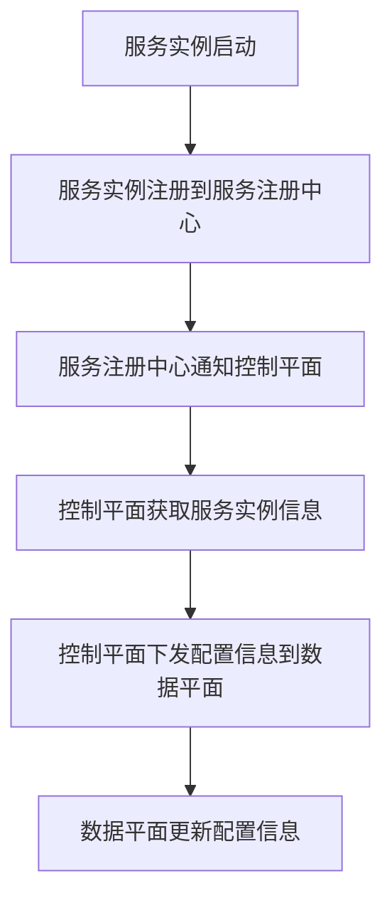
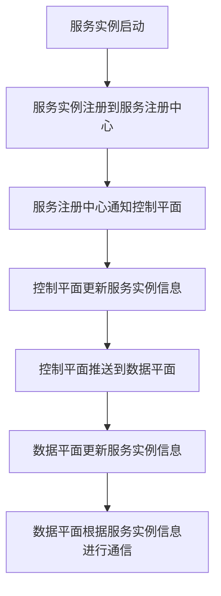
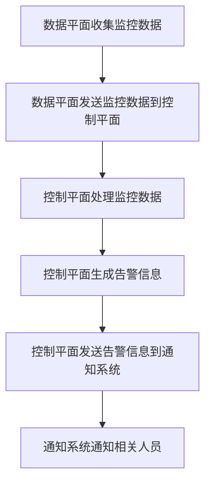
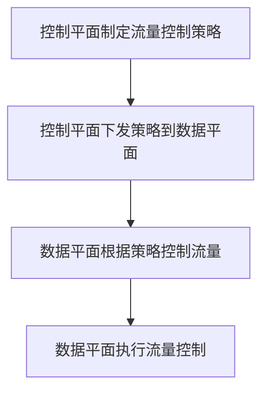

                 

# 服务网格数据平面vs控制平面：微服务通信的两个维度

> 关键词：服务网格、数据平面、控制平面、微服务通信、架构设计

> 摘要：本文将深入探讨服务网格的数据平面和控制平面，从背景介绍、核心概念、架构关系、算法原理、实战案例等方面，全面解析这两个维度在微服务通信中的作用与影响。通过本文的阅读，读者将能够了解服务网格的基本概念，掌握数据平面和控制平面的工作原理，以及在实际项目中如何有效应用这两个关键组成部分。

## 引言

在微服务架构的浪潮中，服务网格（Service Mesh）作为一种新型的基础设施架构，逐渐成为现代分布式系统的关键技术。服务网格旨在解决微服务通信中的复杂性，提供一种统一的、抽象的通信机制。服务网格的核心在于将服务之间的通信抽象出来，从而使得开发者能够专注于业务逻辑的实现，而无需过多关注服务之间的网络通信细节。

服务网格主要由数据平面（Data Plane）和控制平面（Control Plane）两个关键组成部分构成。数据平面负责实现服务之间的数据传输和路由，而控制平面则负责管理服务网格的配置、监控和策略控制。本文将围绕这两个维度，逐步深入探讨它们在微服务通信中的作用与设计。

## 背景介绍

### 微服务架构的兴起

微服务架构（Microservices Architecture）是一种基于组件的分布式系统设计方法，通过将大型单体应用拆分为多个小型、独立的服务组件，从而实现系统的可扩展性和灵活性。每个微服务都负责实现特定的业务功能，独立部署、独立扩展，并通过轻量级的通信协议进行交互。

### 微服务通信的挑战

随着微服务数量的增多，微服务之间的通信复杂度也急剧上升。传统的方法如直接通过DNS进行服务发现，或者在代码中硬编码服务地址，都难以应对微服务通信的动态性和高可靠性要求。同时，随着负载的增加，如何高效地进行负载均衡、熔断、限流等操作也成为了微服务架构面临的挑战。

### 服务网格的诞生

服务网格（Service Mesh）作为一种新的基础设施层，旨在解决微服务通信中的复杂性。通过引入数据平面和控制平面，服务网格提供了一种统一的、抽象的通信机制，使得微服务之间的通信更加简单、可靠和高效。服务网格的主要目标是实现服务之间的解耦，让开发者能够专注于业务逻辑的实现，而无需过多关注网络通信的细节。

## 核心概念

### 数据平面

数据平面（Data Plane）是服务网格中的一个关键组成部分，主要负责实现服务之间的数据传输和路由。数据平面通常由一组边车（Sidecar）代理组成，这些代理与服务实例共处于同一进程空间，从而实现透明代理。数据平面的主要职责包括：

- **服务发现**：通过服务注册中心获取其他服务的地址和元数据，实现服务的自动发现和动态更新。
- **服务路由**：根据路由规则，将请求路由到对应的服务实例。
- **负载均衡**：实现服务实例之间的请求负载均衡，提高系统的可用性和性能。
- **安全性**：对请求进行身份验证和授权，确保通信的安全性。

### 控制平面

控制平面（Control Plane）是服务网格的另一个关键组成部分，主要负责管理数据平面的配置、监控和策略控制。控制平面通常由一组管理控制模块组成，通过API与数据平面进行交互。控制平面的主要职责包括：

- **服务配置**：管理服务的元数据，如服务地址、端口、路由规则等。
- **服务监控**：收集和监控数据平面的运行状态，如请求延迟、错误率等。
- **策略控制**：根据业务需求，制定相应的流量控制策略，如熔断、限流等。
- **服务治理**：实现服务的自动发现、自动扩展、自动恢复等功能，提高系统的可靠性。

## 架构关系

服务网格的架构关系可以理解为数据平面和控制平面之间的协同工作。数据平面负责实现服务之间的数据传输和路由，而控制平面则负责管理数据平面的配置、监控和策略控制。两者的交互机制如下：

1. **配置管理**：控制平面通过API接口向数据平面下发配置信息，如服务地址、端口、路由规则等。数据平面根据这些配置信息，实现服务之间的路由和通信。
2. **服务发现**：控制平面通过服务注册中心或配置中心获取服务的最新状态和元数据，并将这些信息推送到数据平面。数据平面根据服务发现机制，动态更新服务的地址和路由规则。
3. **监控与告警**：数据平面收集运行时的监控数据，如请求延迟、错误率等，并将其发送给控制平面。控制平面根据监控数据，生成告警信息，并根据策略控制进行相应的处理，如熔断、限流等。
4. **策略控制**：控制平面根据业务需求，制定相应的流量控制策略，如熔断、限流、灰度发布等。控制平面将这些策略下发到数据平面，数据平面根据策略进行流量控制。

## 数据平面原理

### 数据平面的组件

数据平面的主要组件包括边车代理、服务发现机制、负载均衡算法和安全机制等。以下是这些组件的详细介绍：

1. **边车代理**：边车代理（Sidecar Proxy）是数据平面的核心组件，它与服务实例共处于同一进程空间，从而实现透明代理。边车代理负责处理服务之间的通信，如服务发现、路由、负载均衡和安全等操作。边车代理通常采用轻量级的通信协议，如gRPC、HTTP/2等，以提高通信效率。
2. **服务发现机制**：服务发现机制是数据平面实现动态服务注册和发现的关键。服务发现机制可以基于服务注册中心（如Eureka、Consul等），或者基于DNS、Kubernetes API等。通过服务发现机制，数据平面可以动态获取服务的地址和元数据，实现服务的自动发现和动态更新。
3. **负载均衡算法**：负载均衡算法是实现服务之间请求负载均衡的关键。常用的负载均衡算法包括轮询（Round Robin）、随机（Random）、最小连接数（Least Connections）等。负载均衡算法可以根据服务实例的负载情况，将请求均衡地分配到不同的服务实例上，从而提高系统的可用性和性能。
4. **安全机制**：安全机制是数据平面实现通信安全的关键。数据平面可以通过加密（如TLS）、身份认证、授权等机制，确保服务之间的通信安全。此外，数据平面还可以通过黑白名单、访问控制列表（ACL）等机制，控制服务之间的访问权限，防止恶意请求的攻击。

### 数据平面的工作原理

数据平面的工作原理可以分为以下几个步骤：

1. **服务注册**：服务实例启动时，会向服务注册中心注册自己的地址和元数据。服务注册中心将服务实例的信息存储在缓存中，并监听服务实例的变更。
2. **服务发现**：数据平面通过服务注册中心或配置中心，获取服务的最新状态和元数据。数据平面根据服务发现机制，动态更新服务的地址和路由规则。
3. **请求路由**：当服务A需要调用服务B时，数据平面根据路由规则，将请求转发到对应的服务实例。路由规则可以基于服务名、标签、路径等。
4. **负载均衡**：数据平面根据负载均衡算法，将请求均衡地分配到不同的服务实例上。负载均衡算法可以根据服务实例的负载情况，动态调整请求的分配策略。
5. **安全通信**：数据平面通过加密、身份认证、授权等安全机制，确保服务之间的通信安全。同时，数据平面还可以通过黑白名单、访问控制列表（ACL）等机制，控制服务之间的访问权限。

### 数据平面的性能优化

数据平面的性能优化是确保系统高可用性和高性能的关键。以下是一些常见的性能优化策略：

1. **服务发现缓存**：为了减少服务发现机制的延迟，可以在数据平面中实现服务发现缓存。数据平面可以定期从服务注册中心获取服务实例的元数据，并将其缓存起来。当服务实例发生变更时，数据平面可以根据缓存信息进行快速响应。
2. **负载均衡算法优化**：选择合适的负载均衡算法，可以提高系统的负载均衡效果。例如，最小连接数（Least Connections）算法可以根据服务实例的当前连接数进行负载均衡，从而避免某个服务实例过载。
3. **边车代理优化**：边车代理的优化可以提高系统的通信效率。例如，可以使用高效的通信协议（如gRPC、HTTP/2），减少网络传输的延迟。此外，可以优化边车代理的配置，如调整超时时间、连接池大小等。
4. **安全机制优化**：数据平面的安全机制也需要进行优化，以确保通信的安全性。例如，可以采用更安全的加密算法（如TLS 1.3），提高通信的安全性。此外，可以优化身份认证和授权机制，减少认证和授权的延迟。

## 控制平面原理

### 控制平面的组件

控制平面的组件包括服务注册中心、配置中心、监控中心和管理控制模块等。以下是这些组件的详细介绍：

1. **服务注册中心**：服务注册中心是控制平面中的核心组件，负责管理服务的注册和发现。服务实例启动时，会向服务注册中心注册自己的地址和元数据。服务注册中心将服务实例的信息存储在缓存中，并监听服务实例的变更。
2. **配置中心**：配置中心是控制平面中的另一个核心组件，负责管理服务的配置信息。配置中心可以存储服务的地址、端口、路由规则、负载均衡策略等配置信息。配置中心可以实时更新配置信息，并通知数据平面进行同步。
3. **监控中心**：监控中心是控制平面中的组件，负责收集和监控数据平面的运行状态。监控中心可以收集数据平面的监控数据，如请求延迟、错误率等，并将其存储在监控系统中。
4. **管理控制模块**：管理控制模块是控制平面中的组件，负责管理服务的策略和控制。管理控制模块可以制定服务的流量控制策略，如熔断、限流、灰度发布等。管理控制模块还可以根据监控数据，进行服务的自动扩展、自动恢复等操作。

### 控制平面的工作原理

控制平面的工作原理可以分为以下几个步骤：

1. **服务注册**：服务实例启动时，会向服务注册中心注册自己的地址和元数据。服务注册中心将服务实例的信息存储在缓存中，并监听服务实例的变更。
2. **服务发现**：控制平面通过服务注册中心，获取服务的最新状态和元数据。控制平面根据服务发现机制，动态更新服务的地址和路由规则。
3. **配置管理**：控制平面通过配置中心，管理服务的配置信息。配置中心可以实时更新配置信息，并通知数据平面进行同步。
4. **监控管理**：控制平面通过监控中心，收集和监控数据平面的运行状态。监控中心可以收集数据平面的监控数据，如请求延迟、错误率等，并将其存储在监控系统中。
5. **策略控制**：控制平面根据业务需求，制定服务的流量控制策略，如熔断、限流、灰度发布等。控制平面将策略下发到数据平面，数据平面根据策略进行流量控制。

### 控制平面的安全性

控制平面的安全性是确保服务网格安全的关键。以下是一些常见的控制平面安全措施：

1. **身份认证**：控制平面可以采用身份认证机制，确保只有经过认证的管理员才能访问控制平面。常见的身份认证机制包括密码认证、多因素认证等。
2. **授权管理**：控制平面可以采用授权管理机制，确保管理员只能访问被授权的资源。常见的授权管理机制包括基于角色的访问控制（RBAC）、基于属性的访问控制（ABAC）等。
3. **加密通信**：控制平面可以使用加密通信机制，确保通信的安全性。常见的加密通信机制包括TLS、SSL等。
4. **审计日志**：控制平面可以记录操作日志，以便在发生安全事件时进行审计。审计日志可以包括用户操作记录、访问记录、错误记录等。
5. **入侵检测**：控制平面可以采用入侵检测机制，检测并阻止恶意攻击。常见的入侵检测机制包括基于规则的检测、基于行为的检测等。

## 数据平面与控制平面的交互

数据平面与控制平面之间的交互是服务网格架构的核心。这种交互机制不仅确保了数据平面的正常运行，还实现了服务网格的可扩展性和灵活性。以下是数据平面与控制平面之间的主要交互机制：

1. **配置管理**：控制平面通过API接口向数据平面下发配置信息，如服务地址、端口、路由规则等。数据平面根据这些配置信息，实现服务之间的路由和通信。配置管理是数据平面与控制平面之间最基本的交互机制，确保数据平面的配置信息与控制平面保持一致。
2. **服务发现**：控制平面通过服务注册中心或配置中心获取服务的最新状态和元数据，并将其推送到数据平面。数据平面根据服务发现机制，动态更新服务的地址和路由规则。服务发现是确保数据平面能够实时获取服务信息的关键机制，有助于实现服务的自动发现和动态更新。
3. **监控与告警**：数据平面收集运行时的监控数据，如请求延迟、错误率等，并将其发送给控制平面。控制平面根据监控数据，生成告警信息，并根据策略控制进行相应的处理，如熔断、限流等。监控与告警是数据平面与控制平面之间的重要交互机制，有助于实现服务的实时监控和自动化处理。
4. **策略控制**：控制平面根据业务需求，制定相应的流量控制策略，如熔断、限流、灰度发布等。控制平面将策略下发到数据平面，数据平面根据策略进行流量控制。策略控制是数据平面与控制平面之间的高级交互机制，有助于实现服务的流量管理和优化。

### 配置管理

配置管理是数据平面与控制平面之间最核心的交互机制之一。以下是一个配置管理流程的示意图：

#### 配置管理流程：

1. **服务实例启动**：服务实例启动时，会向服务注册中心注册自己的地址和元数据。
2. **服务实例注册到服务注册中心**：服务注册中心将服务实例的信息存储在缓存中，并监听服务实例的变更。
3. **服务注册中心通知控制平面**：当服务实例发生变更时，服务注册中心通知控制平面。
4. **控制平面获取服务实例信息**：控制平面从服务注册中心获取服务实例的元数据，并存储在本地缓存中。
5. **控制平面下发配置信息到数据平面**：控制平面根据服务实例的元数据，生成配置信息，并将其下发到数据平面。
6. **数据平面更新配置信息**：数据平面根据收到的配置信息，更新自己的配置，实现服务之间的路由和通信。

### 服务发现

服务发现是数据平面与控制平面之间的另一个重要交互机制。以下是一个服务发现流程的示意图：

#### 服务发现流程：

1. **服务实例启动**：服务实例启动时，会向服务注册中心注册自己的地址和元数据。
2. **服务实例注册到服务注册中心**：服务注册中心将服务实例的信息存储在缓存中，并监听服务实例的变更。
3. **服务注册中心通知控制平面**：当服务实例发生变更时，服务注册中心通知控制平面。
4. **控制平面更新服务实例信息**：控制平面从服务注册中心获取服务实例的元数据，并更新本地缓存。
5. **控制平面推送到数据平面**：控制平面将更新后的服务实例信息推送到数据平面。
6. **数据平面更新服务实例信息**：数据平面根据收到的服务实例信息，更新自己的服务发现缓存。
7. **数据平面根据服务实例信息进行通信**：数据平面根据服务发现缓存，实现服务之间的路由和通信。

### 监控与告警

监控与告警是数据平面与控制平面之间的一个重要交互机制，用于实现服务的实时监控和自动化处理。以下是一个监控与告警流程的示意图：

#### 监控与告警流程：

1. **数据平面收集监控数据**：数据平面在运行过程中，会收集一系列监控数据，如请求延迟、错误率、吞吐量等。
2. **数据平面发送监控数据到控制平面**：数据平面将收集到的监控数据发送到控制平面。
3. **控制平面处理监控数据**：控制平面对接收到的监控数据进行分析和处理，生成监控报表和告警信息。
4. **控制平面生成告警信息**：控制平面根据预设的告警规则，生成告警信息。
5. **控制平面发送告警信息到通知系统**：控制平面将告警信息发送到通知系统。
6. **通知系统通知相关人员**：通知系统将告警信息通过短信、邮件、微信等方式通知相关人员，以便他们及时处理异常情况。

### 策略控制

策略控制是数据平面与控制平面之间的高级交互机制，用于实现服务的流量管理和优化。以下是一个策略控制流程的示意图：

#### 策略控制流程：

1. **控制平面制定流量控制策略**：控制平面根据业务需求，制定相应的流量控制策略，如熔断、限流、灰度发布等。
2. **控制平面下发策略到数据平面**：控制平面将制定的流量控制策略下发到数据平面。
3. **数据平面根据策略控制流量**：数据平面根据收到的策略，对流量进行控制，如将部分流量转发到备用服务实例、限制特定服务的请求等。
4. **数据平面执行流量控制**：数据平面根据策略控制流量的具体执行操作，如修改请求头、添加请求标签等。

## 微服务通信中的数据平面

### 数据平面在服务发现中的作用

数据平面在服务发现中起着至关重要的作用。通过服务发现机制，数据平面能够动态获取服务的最新状态和元数据，从而实现服务的自动发现和动态更新。以下是数据平面在服务发现中的作用：

1. **自动发现服务**：数据平面通过监听服务注册中心或配置中心的变更事件，能够自动发现新增或下线的服务实例。当服务实例上线时，数据平面会更新自己的服务发现缓存，并将服务实例的信息纳入路由规则中；当服务实例下线时，数据平面会从服务发现缓存中移除对应的服务实例。
2. **动态更新路由规则**：数据平面根据服务发现机制，动态更新路由规则。当服务实例的状态发生变更时，如地址、端口等，数据平面会立即更新路由规则，确保请求能够正确路由到对应的服务实例。
3. **服务健康检查**：数据平面可以通过健康检查机制，判断服务实例的健康状态。当服务实例出现异常时，数据平面会从服务发现缓存中移除对应的服务实例，并尝试重新发现可用的服务实例。

### 数据平面在服务负载均衡中的应用

数据平面在服务负载均衡中起着核心作用。通过负载均衡算法，数据平面能够将请求均衡地分配到不同的服务实例上，从而提高系统的可用性和性能。以下是数据平面在服务负载均衡中的应用：

1. **负载均衡算法**：数据平面采用不同的负载均衡算法，如轮询（Round Robin）、随机（Random）、最小连接数（Least Connections）等，根据服务实例的负载情况，动态调整请求的分配策略。
2. **动态调整负载均衡策略**：数据平面可以根据服务实例的负载情况，动态调整负载均衡策略。例如，当某个服务实例的负载过高时，数据平面可以将部分请求转发到其他负载较低的服务实例上，从而实现负载均衡。
3. **服务实例健康状态监控**：数据平面通过健康检查机制，监控服务实例的健康状态。当服务实例出现异常时，数据平面会从负载均衡池中移除对应的服务实例，并尝试重新发现可用的服务实例。

### 数据平面在服务熔断与限流中的应用

数据平面在服务熔断与限流中起着关键作用。通过熔断和限流机制，数据平面能够保护系统免受异常请求的冲击，确保系统的稳定运行。以下是数据平面在服务熔断与限流中的应用：

1. **熔断机制**：数据平面实现熔断机制，当某个服务实例的错误率达到预设阈值时，数据平面会立即熔断对该服务实例的请求，防止异常请求继续进入系统，从而保护系统的稳定性。
2. **限流机制**：数据平面实现限流机制，通过对请求进行流量控制，限制每个服务实例的请求速率，从而避免某个服务实例因请求过多而出现异常。
3. **动态调整熔断与限流策略**：数据平面可以根据系统的运行状态，动态调整熔断和限流策略。例如，当系统负载较低时，可以适当放宽熔断和限流阈值，提高系统的响应速度；当系统负载较高时，可以收紧熔断和限流阈值，确保系统的稳定性。

## 微服务通信中的控制平面

### 控制平面在服务治理中的作用

控制平面在服务治理中起着核心作用。通过服务治理机制，控制平面能够对服务实例进行管理、监控和优化，从而确保系统的稳定性和高效性。以下是控制平面在服务治理中的作用：

1. **服务管理**：控制平面负责管理服务实例的生命周期，包括服务的注册、发现、扩展、缩容、下线等操作。控制平面可以自动发现新增的服务实例，并将它们纳入服务治理范围。
2. **服务监控**：控制平面通过监控机制，实时收集服务实例的运行状态和性能指标，如请求延迟、错误率、吞吐量等。控制平面可以根据监控数据，生成监控报表和告警信息，帮助管理员及时发现和解决系统异常。
3. **服务优化**：控制平面可以根据监控数据和业务需求，对服务实例进行优化操作，如调整负载均衡策略、熔断阈值、限流阈值等。通过优化服务实例，可以提高系统的性能和稳定性。

### 控制平面在服务监控中的应用

控制平面在服务监控中起着关键作用。通过监控机制，控制平面能够实时收集服务实例的运行状态和性能指标，从而帮助管理员了解系统的运行状况。以下是控制平面在服务监控中的应用：

1. **实时监控**：控制平面通过监控机制，实时收集服务实例的运行状态和性能指标，如请求延迟、错误率、吞吐量等。监控数据可以存储在时序数据库中，供后续分析和告警使用。
2. **监控报表**：控制平面可以根据监控数据，生成各种监控报表，如服务状态报表、性能指标报表、异常事件报表等。报表可以帮助管理员快速了解系统的运行状况，发现潜在问题。
3. **告警通知**：控制平面可以根据监控数据和告警规则，生成告警信息，并通过短信、邮件、微信等方式通知相关人员。告警通知可以帮助管理员及时发现和解决系统异常，确保系统的稳定运行。

### 控制平面在服务路由中的应用

控制平面在服务路由中起着核心作用。通过路由机制，控制平面能够根据业务需求，动态调整服务之间的请求路由，从而实现服务的负载均衡、故障转移和流量控制。以下是控制平面在服务路由中的应用：

1. **动态路由**：控制平面可以根据服务实例的健康状态和负载情况，动态调整服务之间的请求路由。当某个服务实例出现异常时，控制平面可以自动将请求路由到其他健康的服务实例上，从而实现故障转移。
2. **路由策略**：控制平面可以根据业务需求，制定不同的路由策略。例如，可以通过权重调整，将更多的请求路由到负载较低的服务实例上，从而实现负载均衡；可以通过标签匹配，将请求路由到具有特定功能的业务实例上，从而实现服务差异化。
3. **路由规则管理**：控制平面可以管理路由规则，如服务名称、路径匹配、参数匹配等。通过管理路由规则，可以实现更灵活的服务路由策略，满足不同业务场景的需求。

## 实践案例与分析

### 案例介绍

为了更好地理解服务网格的数据平面和控制平面的应用，我们选择了一个典型的微服务项目——在线购物平台。该项目包括商品管理、订单管理、库存管理等多个微服务，通过服务网格实现了微服务之间的通信和管理。

### 案例分析

1. **服务注册与发现**：在项目启动时，每个微服务实例会向服务注册中心（如Consul）注册自己的地址和元数据。服务注册中心将服务实例的信息存储在本地缓存中，并监听服务实例的变更。数据平面通过服务注册中心获取服务的最新状态和元数据，动态更新服务发现缓存。

2. **服务路由与负载均衡**：在订单管理服务需要调用商品管理服务时，数据平面根据路由规则，将请求路由到对应的服务实例。通过轮询算法，数据平面将请求均衡地分配到不同的商品管理服务实例上，从而实现负载均衡。

3. **服务熔断与限流**：在系统高峰期，当某个商品管理服务实例的请求量过大时，数据平面会触发熔断机制，将请求直接拒绝，以保护系统稳定性。同时，通过限流机制，数据平面限制每个商品管理服务实例的请求速率，避免某个实例过载。

4. **服务监控与告警**：控制平面通过监控机制，实时收集每个微服务实例的运行状态和性能指标。当出现异常时，控制平面生成告警信息，并通过短信、邮件等方式通知相关人员。监控报表和告警通知帮助管理员及时发现和解决系统异常。

5. **配置管理与策略控制**：控制平面管理服务配置信息，如服务地址、路由规则、熔断阈值等。根据业务需求，控制平面可以动态调整配置信息，实现更灵活的服务管理。例如，在系统升级时，控制平面可以设置灰度发布策略，逐步将流量切换到新版本。

### 案例总结与启示

通过该案例，我们可以看到服务网格的数据平面和控制平面在微服务通信中的重要作用。数据平面实现了服务之间的透明代理和高效通信，而控制平面实现了服务的动态管理、监控和策略控制。以下是一些启示：

1. **简化微服务通信**：服务网格通过抽象化通信机制，简化了微服务之间的通信复杂度，使得开发者能够更专注于业务逻辑的实现。
2. **提高系统稳定性**：服务网格提供了熔断、限流等机制，有效提高了系统的稳定性，避免了单个服务实例过载导致的系统崩溃。
3. **灵活的流量管理**：服务网格通过动态路由、权重调整等机制，实现了更灵活的流量管理，提高了系统的性能和可用性。
4. **全面的监控与告警**：服务网格提供了全面的监控与告警机制，帮助管理员实时了解系统的运行状况，及时发现问题并采取相应措施。

## 最佳实践 Tips

### 数据平面优化

1. **服务发现缓存**：为了减少服务发现机制的延迟，可以在数据平面中实现服务发现缓存。数据平面可以定期从服务注册中心获取服务实例的元数据，并将其缓存起来。当服务实例发生变更时，数据平面可以根据缓存信息进行快速响应。

2. **负载均衡算法优化**：选择合适的负载均衡算法，可以提高系统的负载均衡效果。例如，最小连接数（Least Connections）算法可以根据服务实例的当前连接数进行负载均衡，从而避免某个服务实例过载。

3. **边车代理优化**：边车代理的优化可以提高系统的通信效率。例如，可以使用高效的通信协议（如gRPC、HTTP/2），减少网络传输的延迟。此外，可以优化边车代理的配置，如调整超时时间、连接池大小等。

### 控制平面优化

1. **配置中心优化**：配置中心可以实现配置的实时更新和同步。为了提高配置更新的效率，可以采用分布式配置中心，如Consul、etcd等。此外，可以优化配置中心的缓存机制，减少配置更新的延迟。

2. **监控中心优化**：监控中心可以采用分布式架构，提高监控数据的收集和处理能力。可以采用时序数据库（如InfluxDB、Prometheus等）存储监控数据，并使用数据处理框架（如Kafka、Flink等）进行实时数据处理和分析。

3. **策略控制优化**：控制平面可以根据不同的业务场景，定制化流量控制策略。例如，可以根据用户行为数据，动态调整熔断和限流阈值，实现更精细的流量管理。

## 小结

本文从背景介绍、核心概念、架构关系、算法原理、实战案例等方面，全面解析了服务网格的数据平面和控制平面。通过本文的阅读，读者将能够了解服务网格的基本概念，掌握数据平面和控制平面的工作原理，以及在实际项目中如何有效应用这两个关键组成部分。服务网格的数据平面和控制平面为微服务通信提供了高效、稳定和安全的保障，有助于提高系统的性能和稳定性，为企业的数字化转型提供了有力支持。

## 注意事项

1. **服务网格的部署与维护**：在部署服务网格时，需要充分考虑系统的可扩展性和高可用性。同时，在维护服务网格时，需要注意配置信息的更新和管理，确保服务网格的稳定运行。

2. **安全性考虑**：服务网格涉及大量的服务实例和通信数据，因此在设计和部署服务网格时，需要充分考虑安全性。应采用加密通信、身份认证、授权等安全措施，确保服务之间的通信安全。

3. **性能优化**：在服务网格的优化过程中，需要关注数据平面和控制平面的性能。通过优化服务发现、负载均衡、熔断和限流等机制，可以提高服务网格的性能和稳定性。

## 拓展阅读

1. **服务网格技术概述**：《服务网格：微服务架构的最佳实践》
2. **数据平面实现**：《Service Mesh：数据平面实战》
3. **控制平面设计**：《服务网格控制平面设计与实现》
4. **微服务架构**：《微服务设计：从架构到实践》

## 附录

### 附录A：常见服务网格工具和框架

1. **Istio**：开源的服务网格平台，支持Kubernetes和Consul等环境。
2. **Linkerd**：开源的服务网格代理，支持gRPC、HTTP/2等协议。
3. **Conduit**：开源的服务网格平台，基于Rust语言实现。
4. **Service Mesh Model**：服务网格模型，提供服务网格的抽象和定义。

### 附录B：实践指南

1. **服务网格部署指南**：详细介绍了服务网格的部署过程和配置。
2. **服务网格监控与告警**：介绍了如何对服务网格进行监控和告警设置。
3. **服务网格性能优化**：介绍了如何对服务网格进行性能优化。

### 附录C：参考文献

1. **Kubernetes官方文档**：详细介绍了Kubernetes的基本概念和操作。
2. **Service Mesh官方文档**：详细介绍了Service Mesh的基本概念和架构。
3. **微服务架构最佳实践**：介绍了微服务架构的设计原则和实现方法。

## 作者信息

**作者：AI天才研究院/AI Genius Institute & 禅与计算机程序设计艺术 /Zen And The Art of Computer Programming**

