                 

### 文章标题

《服务网格架构：P9工程师的流量治理之道》

### 文章关键词

- 服务网格
- 流量治理
- 微服务架构
- Kubernetes
- 云原生技术
- 边缘计算
- AI融合

### 文章摘要

本文深入探讨了服务网格架构的核心概念、实现原理、应用场景以及未来发展趋势。作为P9级别工程师，本文旨在帮助读者理解服务网格在流量治理中的重要性，并通过具体的案例和实践，展示其在现代微服务架构、云原生技术和边缘计算等领域的广泛应用。文章将结合伪代码、数学模型、项目实战等多种方式，逐步剖析服务网格的架构原理，并展望其在AI领域的融合趋势，为读者提供全面的指导。

## 目录

### 第1章 服务网格架构概述

1.1 服务网格的起源与发展  
1.2 服务网格的核心组件  
1.3 服务网格的关键特性  
1.4 服务网格的应用场景

### 第2章 服务网格架构原理

2.1 服务网格的架构模型  
2.2 流量治理机制  
2.3 服务发现与负载均衡  
2.4 安全性与策略配置

### 第3章 服务网格实现与部署

3.1 服务网格的部署策略  
3.2 环境搭建与工具选择  
3.3 服务网格配置与管理  
3.4 故障排除与性能优化

### 第4章 服务网格应用案例解析

4.1 微服务架构中的服务网格  
4.2 容器化环境下的服务网格  
4.3 服务网格在金融行业的应用  
4.4 服务网格在电商领域的实践

### 第5章 服务网格与云原生技术

5.1 云原生技术概述  
5.2 服务网格与Kubernetes集成  
5.3 服务网格与CI/CD流水线  
5.4 服务网格与云服务的融合

### 第6章 服务网格未来发展趋势

6.1 服务网格的新技术趋势  
6.2 服务网格在边缘计算中的应用  
6.3 服务网格与AI的融合  
6.4 服务网格生态圈的建设

### 第7章 服务网格架构师的成长之路

7.1 服务网格架构师的角色与职责  
7.2 技术积累与实践经验  
7.3 职业规划与发展路径  
7.4 持续学习与创新

### 第1章 服务网格架构概述

#### 1.1 服务网格的起源与发展

服务网格（Service Mesh）的概念起源于容器化技术和微服务架构的快速发展。随着微服务架构的普及，服务的数量和复杂性急剧增加，传统的服务管理方式（如服务注册与发现、负载均衡、流量管理、安全性等）面临巨大的挑战。为了解决这些问题，服务网格作为一种新型基础设施架构应运而生。

服务网格起源于Google的Sidecar模型，并在Netflix OSS项目中得到广泛应用。随着时间的推移，服务网格逐渐成为了云原生技术的重要组成部分，如Kubernetes、Istio、Linkerd等开源项目的推出，标志着服务网格技术的成熟和普及。

#### 1.2 服务网格的核心组件

服务网格主要由以下核心组件构成：

1. **控制平面（Control Plane）**：负责配置管理、服务发现、流量路由等全局性任务。例如，Istio的控制平面包括Pilot、Citadel、Galley等组件。
2. **数据平面（Data Plane）**：负责处理服务间通信，通常使用代理（如Envoy）来实现。数据平面代理负责流量转发、监控、安全性等任务。

#### 1.3 服务网格的关键特性

服务网格具有以下关键特性：

1. **服务抽象**：通过抽象服务接口，实现服务间的解耦，提高系统的灵活性和可维护性。
2. **流量管理**：提供灵活的流量路由策略，支持灰度发布、熔断、限流等高级功能。
3. **安全性**：通过服务网格实现服务间通信的安全性，如TLS加密、身份验证等。
4. **可观测性**：提供丰富的监控和日志功能，帮助开发者诊断问题和优化服务性能。

#### 1.4 服务网格的应用场景

服务网格适用于以下场景：

1. **微服务架构**：在微服务架构中，服务网格可以帮助实现服务间通信的规范化和管理。
2. **容器化环境**：在容器化环境中，服务网格可以提供高效的流量管理和安全性保障。
3. **云原生技术**：服务网格与云原生技术的集成，可以提升云原生应用的性能和可靠性。
4. **边缘计算**：在边缘计算场景中，服务网格可以优化边缘服务的流量管理和安全性。

### 第2章 服务网格架构原理

#### 2.1 服务网格的架构模型

服务网格的架构模型可以分为控制平面和数据平面两部分。以下是一个简化的服务网格架构模型：

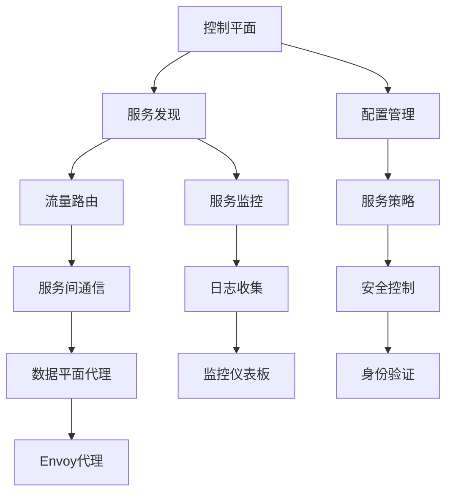

在这个模型中，控制平面负责全局配置管理和服务发现，数据平面负责具体的服务间通信处理。通过控制平面和数据平面的协同工作，实现服务网格的功能。

#### 2.2 流量治理机制

流量治理是服务网格的核心功能之一，主要包括以下机制：

1. **服务发现**：服务网格通过控制平面自动发现服务实例，并将这些信息传递给数据平面代理。
2. **流量路由**：服务网格支持多种流量路由策略，如轮询、随机、按权重分配等，可以根据实际需求进行配置。
3. **灰度发布**：服务网格支持灰度发布，可以在发布新版本时控制流量比例，确保系统稳定运行。
4. **熔断与限流**：服务网格可以检测服务实例的健康状态，当服务不可用时自动熔断，并限制访问流量，防止系统过载。
5. **安全控制**：服务网格通过加密、认证、授权等手段，确保服务间通信的安全性。

#### 2.3 服务发现与负载均衡

服务发现是服务网格的基础功能之一，主要涉及以下方面：

1. **服务注册**：服务实例启动时，自动向服务发现组件注册，包括服务名称、IP地址、端口号等信息。
2. **服务发现**：数据平面代理通过服务发现组件获取服务实例的信息，实现服务间的通信。
3. **负载均衡**：服务网格支持多种负载均衡策略，如轮询、最小连接数、按权重分配等，可以根据实际需求进行配置。

以下是一个简化的服务发现与负载均衡模型：

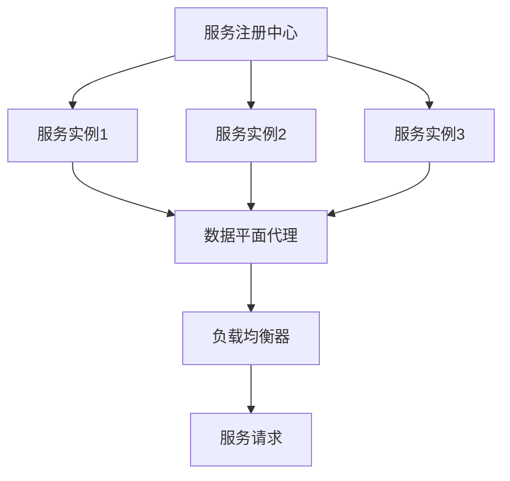

在这个模型中，服务注册中心负责服务实例的注册和发现，负载均衡器负责根据策略分配服务请求。

#### 2.4 安全性与策略配置

服务网格的安全性是保障服务间通信安全的关键，主要包括以下方面：

1. **加密**：服务网格支持TLS加密，确保数据在传输过程中的安全性。
2. **认证**：服务网格可以基于身份认证机制，确保只有授权的服务实例可以访问其他服务。
3. **授权**：服务网格可以配置访问控制策略，控制服务间的访问权限。

以下是一个简化的安全性与策略配置模型：

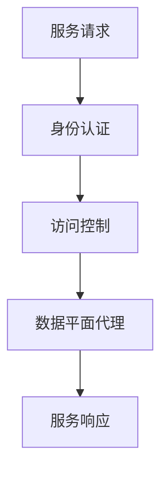

在这个模型中，服务请求经过身份认证和访问控制后，由数据平面代理处理并返回服务响应。

### 第3章 服务网格实现与部署

#### 3.1 服务网格的部署策略

部署服务网格时，需要考虑以下策略：

1. **集群部署**：在Kubernetes集群中部署服务网格组件，确保服务网格与集群环境无缝集成。
2. **灰度部署**：在部署服务网格时，可以采用灰度部署策略，逐步增加服务网格的覆盖范围，减少对系统的影响。
3. **备份与恢复**：服务网格的部署和配置需要备份，以便在出现问题时快速恢复。

以下是一个简化的服务网格部署模型：

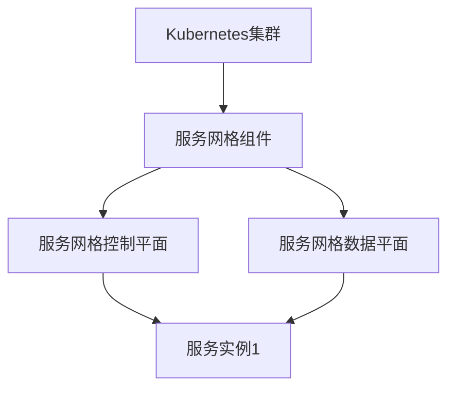

在这个模型中，服务网格组件在Kubernetes集群中部署，包括控制平面和数据平面，服务实例通过数据平面代理进行通信。

#### 3.2 环境搭建与工具选择

搭建服务网格环境时，需要选择合适的工具和软件：

1. **Kubernetes集群**：选择合适的Kubernetes集群版本，并确保集群运行稳定。
2. **服务网格组件**：根据实际需求选择合适的服务网格组件，如Istio、Linkerd等。
3. **开发工具**：安装和配置必要的开发工具，如Kubectl、Helm等。

以下是一个简化的环境搭建模型：

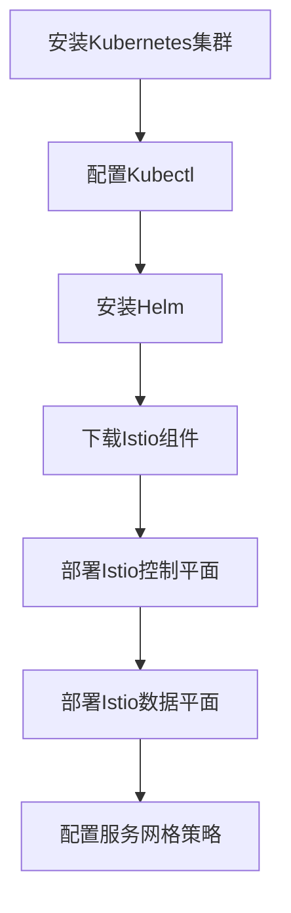

在这个模型中，首先安装Kubernetes集群和Kubectl，然后使用Helm下载Istio组件，并部署控制平面和数据平面，最后配置服务网格策略。

#### 3.3 服务网格配置与管理

配置和管理服务网格时，需要关注以下方面：

1. **服务网格策略**：配置服务网格策略，包括流量路由、灰度发布、熔断与限流等。
2. **监控与日志**：配置监控和日志系统，确保服务网格运行状况可观测。
3. **备份与恢复**：定期备份服务网格配置，以便在出现问题时快速恢复。

以下是一个简化的服务网格配置与管理模型：

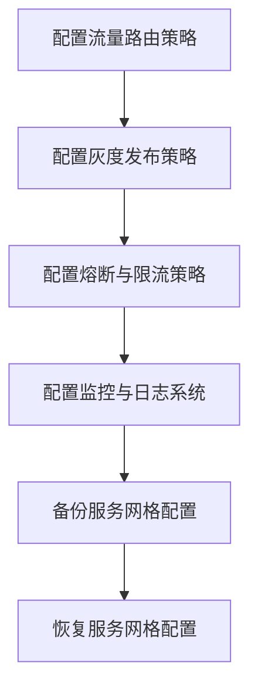

在这个模型中，首先配置流量路由、灰度发布、熔断与限流策略，然后配置监控与日志系统，并定期备份和恢复服务网格配置。

#### 3.4 故障排除与性能优化

在服务网格运行过程中，可能会遇到各种故障和性能问题，需要及时排除和优化：

1. **故障排除**：根据监控和日志信息，定位故障原因，并采取相应的措施进行修复。
2. **性能优化**：根据实际需求，调整服务网格配置和参数，提升系统性能。

以下是一个简化的故障排除与性能优化模型：

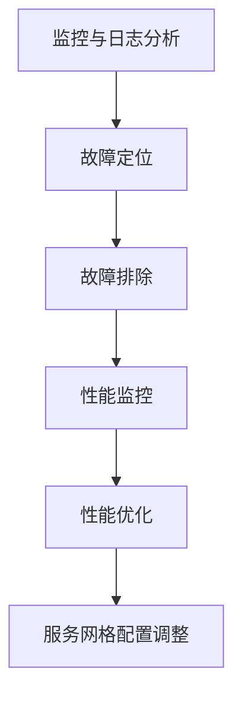

在这个模型中，首先通过监控和日志分析定位故障，然后进行故障排除和性能优化，并根据实际情况调整服务网格配置。

### 第4章 服务网格应用案例解析

#### 4.1 微服务架构中的服务网格

在微服务架构中，服务网格可以显著提高系统的稳定性和可维护性。以下是一个微服务架构中的服务网格应用案例：

1. **场景描述**：假设有一个电商系统，包括商品服务、订单服务、支付服务等多个微服务。
2. **服务网格部署**：在Kubernetes集群中部署服务网格，如Istio，为所有微服务添加数据平面代理。
3. **流量路由策略**：配置流量路由策略，实现灰度发布，逐步将流量切换到新版本。

以下是一个简化的微服务架构中的服务网格模型：

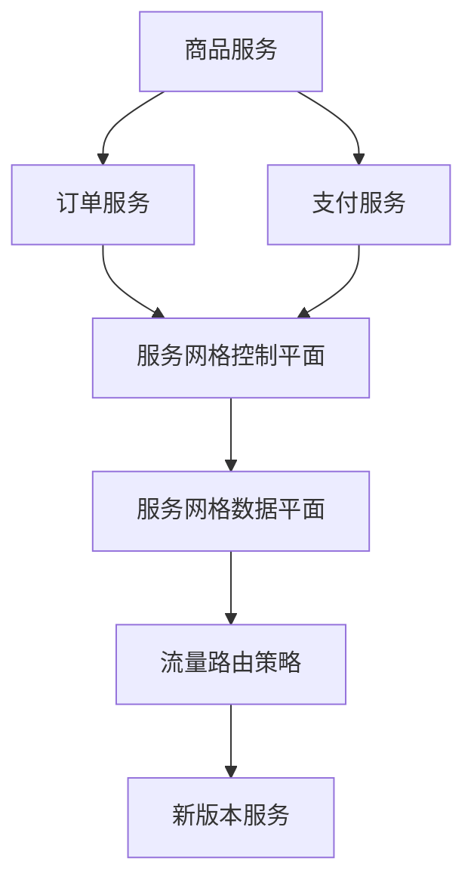

在这个模型中，服务网格控制平面负责配置流量路由策略，数据平面代理负责实现流量转发。

#### 4.2 容器化环境下的服务网格

在容器化环境中，服务网格可以提供高效的流量管理和安全性保障。以下是一个容器化环境下的服务网格应用案例：

1. **场景描述**：假设有一个基于Docker容器的后台系统，包括用户服务、认证服务、数据库服务等。
2. **服务网格部署**：在容器编排工具（如Kubernetes）中部署服务网格，如Linkerd，为容器添加数据平面代理。
3. **安全性配置**：配置TLS加密、身份认证等安全性措施，确保容器间通信的安全性。

以下是一个简化的容器化环境下的服务网格模型：

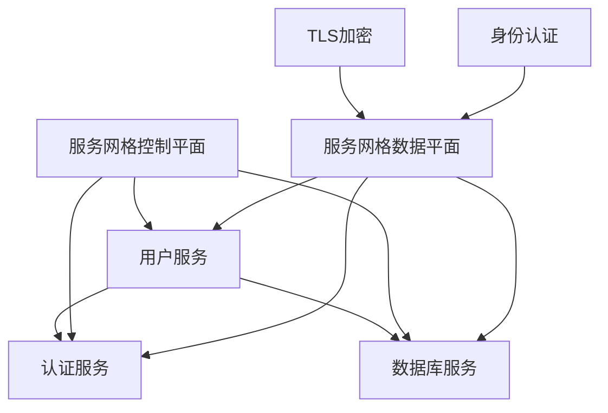

在这个模型中，服务网格控制平面负责配置安全性措施，数据平面代理负责实现容器间通信的安全性。

#### 4.3 服务网格在金融行业的应用

在金融行业，服务网格可以优化交易系统的性能和可靠性。以下是一个金融行业中的服务网格应用案例：

1. **场景描述**：假设有一个金融交易系统，包括订单处理服务、交易引擎服务、风控服务等。
2. **服务网格部署**：在Kubernetes集群中部署服务网格，如Istio，为交易系统中的微服务添加数据平面代理。
3. **性能优化**：通过配置流量路由策略、熔断与限流等机制，优化交易系统的性能。

以下是一个简化的金融行业中的服务网格模型：

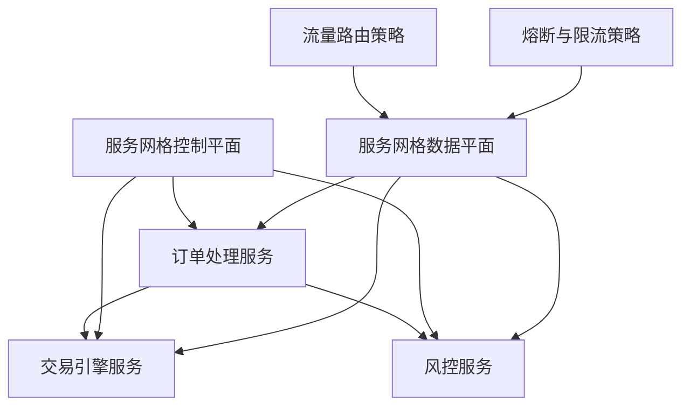

在这个模型中，服务网格控制平面负责配置流量路由策略和熔断与限流策略，数据平面代理负责实现流量转发。

#### 4.4 服务网格在电商领域的实践

在电商领域，服务网格可以优化订单处理和支付流程，提高用户购物体验。以下是一个电商领域的服务网格实践案例：

1. **场景描述**：假设有一个电商平台，包括商品查询服务、订单创建服务、支付服务等多个微服务。
2. **服务网格部署**：在Kubernetes集群中部署服务网格，如Istio，为电商平台中的微服务添加数据平面代理。
3. **流量控制**：配置流量控制策略，实现订单创建和支付服务的负载均衡和灰度发布。

以下是一个简化的电商领域中的服务网格模型：

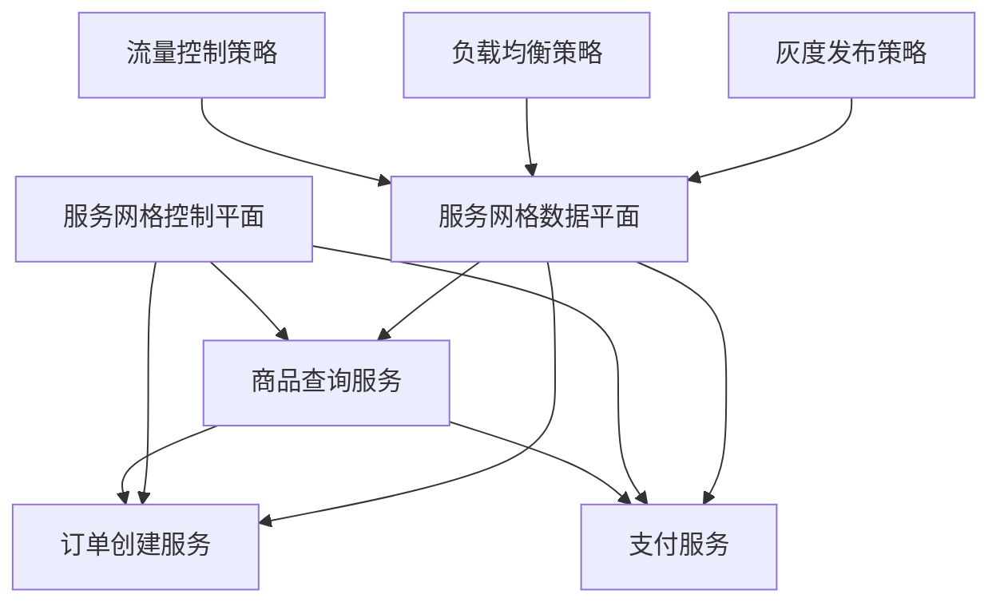

在这个模型中，服务网格控制平面负责配置流量控制、负载均衡和灰度发布策略，数据平面代理负责实现流量转发。

### 第5章 服务网格与云原生技术

#### 5.1 云原生技术概述

云原生技术（Cloud Native Technology）是指基于云计算和容器技术，能够快速交付和动态伸缩的应用架构。云原生技术具有以下特点：

1. **容器化**：应用以容器形式运行，实现轻量级、可移植、可伸缩的部署方式。
2. **动态管理**：通过自动化工具（如Kubernetes）实现应用的自动化部署、扩缩容和资源管理。
3. **微服务架构**：应用以微服务形式构建，实现服务间的解耦、独立开发和部署。
4. **持续交付**：通过持续集成和持续部署（CI/CD）实现快速迭代和交付。

#### 5.2 服务网格与Kubernetes集成

服务网格与Kubernetes的集成是实现云原生应用流量管理和安全性的关键。以下是一个简化的服务网格与Kubernetes集成模型：

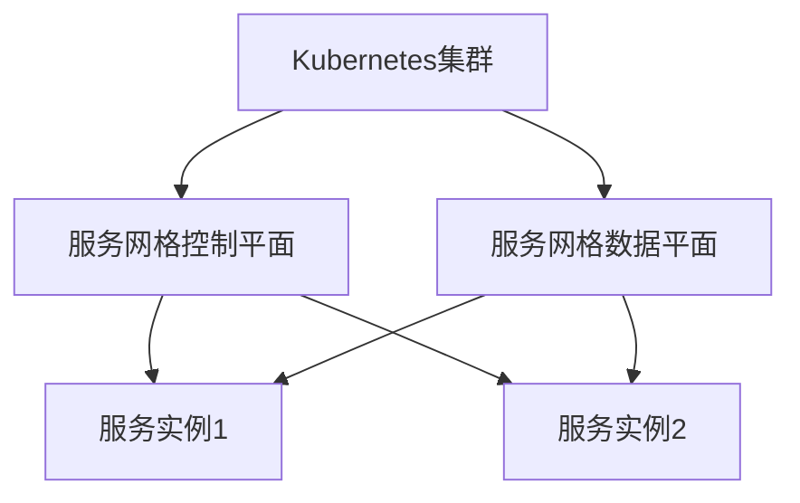

在这个模型中，Kubernetes集群负责部署和管理服务实例，服务网格控制平面负责配置和管理流量路由策略，服务网格数据平面负责实现服务间通信。

#### 5.3 服务网格与CI/CD流水线

服务网格可以与CI/CD流水线（如Jenkins、GitLab CI/CD）集成，实现自动化部署和流量管理。以下是一个简化的服务网格与CI/CD流水线集成模型：

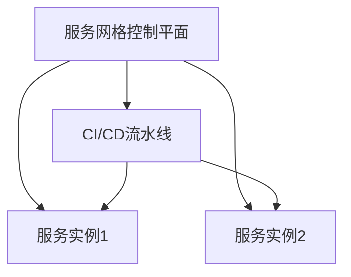

在这个模型中，CI/CD流水线负责构建和部署服务实例，服务网格控制平面负责配置流量路由策略，实现自动化部署和流量管理。

#### 5.4 服务网格与云服务的融合

服务网格与云服务的融合可以实现更灵活、更可靠的云原生应用架构。以下是一个简化的服务网格与云服务融合模型：

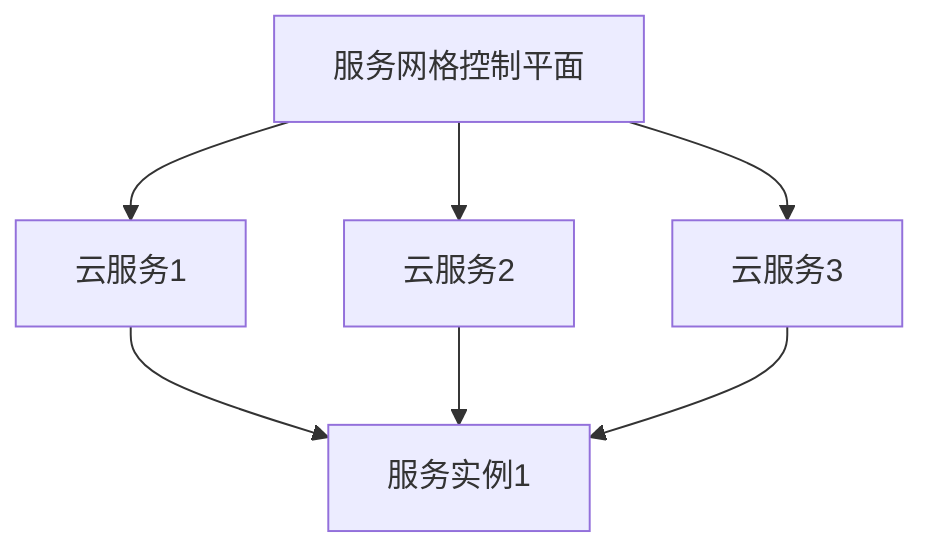

在这个模型中，服务网格控制平面负责配置和管理云服务间的流量路由策略，云服务与Kubernetes集群中的服务实例进行通信。

### 第6章 服务网格未来发展趋势

#### 6.1 服务网格的新技术趋势

随着云计算、容器化、微服务架构等技术的发展，服务网格也在不断演进。以下是一些服务网格的新技术趋势：

1. **服务网格标准化**：服务网格的标准化工作正在积极推进，以实现跨平台、跨语言的服务网格功能。
2. **服务网格与AI融合**：服务网格与人工智能技术的融合，可以实现智能流量路由、故障预测和优化等高级功能。
3. **边缘计算中的服务网格**：随着边缘计算的兴起，服务网格在边缘计算场景中的应用也逐渐受到关注。
4. **服务网格安全性的提升**：服务网格在安全性方面的研究不断深入，包括加密、认证、访问控制等方面的优化。

#### 6.2 服务网格在边缘计算中的应用

边缘计算（Edge Computing）是一种分布式计算架构，通过在靠近数据源的位置处理数据，降低延迟和提高响应速度。服务网格在边缘计算中的应用主要包括：

1. **边缘服务网格**：在边缘节点上部署服务网格，实现边缘服务的流量管理和安全性保障。
2. **边缘流量路由**：通过服务网格实现边缘节点之间的流量路由，提高边缘计算系统的性能和可伸缩性。
3. **边缘智能**：结合边缘计算和服务网格，实现边缘智能应用，如实时数据分析、智能监控等。

#### 6.3 服务网格与AI的融合

服务网格与人工智能技术的融合，可以实现更智能、更高效的流量管理和优化。以下是一些应用场景：

1. **智能流量路由**：通过机器学习算法，实现基于流量特征的服务实例选择和流量分配，提高系统性能和用户体验。
2. **故障预测与优化**：通过大数据分析和机器学习技术，预测系统故障并采取优化措施，提高系统稳定性和可靠性。
3. **边缘智能服务**：在边缘计算场景中，结合服务网格和人工智能技术，实现智能边缘应用，如智能监控、智能分析等。

#### 6.4 服务网格生态圈的建设

服务网格生态圈是指围绕服务网格技术构建的产业链和生态系统。以下是一些服务网格生态圈的建设方向：

1. **开源社区**：积极推动服务网格技术的开源，吸引更多开发者参与，促进技术发展。
2. **企业合作**：加强企业间的合作，推动服务网格技术在不同场景下的应用和实践。
3. **教育培训**：提供丰富的教育培训资源，培养服务网格架构师和开发者，提升整个行业的技术水平。
4. **标准化工作**：积极参与国际标准化组织，推动服务网格技术的标准化，提高其普及性和兼容性。

### 第7章 服务网格架构师的成长之路

#### 7.1 服务网格架构师的角色与职责

服务网格架构师是负责设计和实现服务网格系统的高级工程师。其主要职责包括：

1. **架构设计**：根据业务需求，设计符合服务网格原则的系统架构。
2. **技术选型**：选择合适的服务网格组件和工具，确保系统性能和可维护性。
3. **系统实施**：负责服务网格系统的部署、配置和管理，确保系统正常运行。
4. **性能优化**：对服务网格系统进行性能优化，提高系统响应速度和稳定性。
5. **安全管理**：确保服务网格系统的安全性，防范潜在的安全威胁。

#### 7.2 技术积累与实践经验

成为一名优秀的服务网格架构师，需要不断积累技术知识和实践经验。以下是一些建议：

1. **深入学习服务网格技术**：了解服务网格的核心原理、架构模型和实现细节。
2. **掌握容器化和微服务架构**：熟悉容器化和微服务架构的基本概念和技术，为服务网格的应用奠定基础。
3. **实践项目经验**：参与实际项目，了解服务网格在真实业务场景中的应用和实践。
4. **持续学习**：关注行业动态和技术发展趋势，不断更新自己的知识和技能。

#### 7.3 职业规划与发展路径

服务网格架构师的发展路径可以从以下几个方面进行规划：

1. **初级架构师**：负责小型项目的服务网格设计实施，积累实践经验。
2. **高级架构师**：负责复杂项目的服务网格设计和优化，具备丰富的项目经验。
3. **技术专家**：成为服务网格领域的技术专家，参与开源项目和技术社区。
4. **技术领导**：担任技术团队领导，负责团队的技术发展和项目实施。

#### 7.4 持续学习与创新

在快速发展的技术领域，持续学习和创新是服务网格架构师必备的素质。以下是一些建议：

1. **参加技术会议和培训**：参加行业会议和培训，了解最新的技术动态和应用案例。
2. **阅读专业书籍和论文**：阅读专业的书籍和论文，深入理解服务网格技术的原理和应用。
3. **参与开源项目**：参与开源项目，与业界同仁共同推动服务网格技术的发展。
4. **实践创新**：在实际项目中尝试新的技术方案和应用模式，不断探索和改进。

作者：AI天才研究院/AI Genius Institute & 禅与计算机程序设计艺术 /Zen And The Art of Computer Programming

