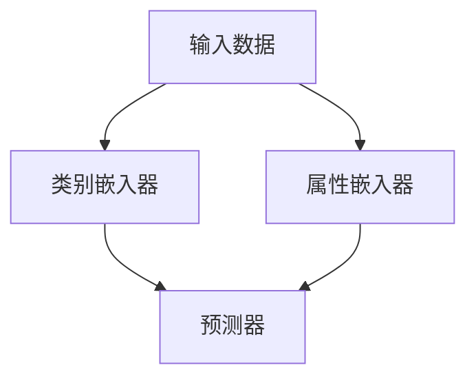

                 

# 文章标题

《未知领域推理任务中零样本学习的应用研究》

> 关键词：零样本学习、未知领域推理、元学习、嵌套网络结构、概率图模型、强化学习、深度神经网络

> 摘要：本文从零样本学习的核心概念出发，深入探讨了其在未知领域推理任务中的广泛应用。通过详细分析关键算法原理、数学模型以及项目实战，揭示了零样本学习在未知领域推理任务中的技术优势和潜在挑战，为相关领域的研究和实际应用提供了有益的参考。

----------------------------------------------------------------

### 设计目标

为了确保《未知领域推理任务中零样本学习的应用研究》的内容全面、逻辑清晰，本文将按照以下步骤进行设计：

1. **核心概念与联系**：介绍零样本学习的基本概念、原理和架构，并通过Mermaid流程图展示核心概念之间的关系。
2. **核心算法原理讲解**：详细讲解元学习算法、嵌套网络结构和关联规则学习等关键算法，并提供相应的伪代码。
3. **数学模型和数学公式**：介绍概率图模型、强化学习以及深度神经网络在零样本学习中的应用，并提供详细的数学公式和举例说明。
4. **项目实战**：通过一个实际项目，展示零样本学习在未知领域推理任务中的具体应用，包括环境搭建、源代码实现、代码解读和案例分析。
5. **综合总结与展望**：总结零样本学习在未知领域推理任务中的技术发展趋势和挑战，并提出相应的解决方案。

### 第一步：核心概念与联系

#### 1.1 零样本学习的定义与背景

**1.1.1 零样本学习的基本概念**

零样本学习（Zero-Shot Learning, ZSL）是一种机器学习技术，它允许模型在未见过的新类（novel classes）上进行预测。与传统的监督学习不同，零样本学习不需要对新类别的数据进行预训练，而是在训练阶段仅使用已知的类别的数据。

**1.1.2 零样本学习的起源与发展**

零样本学习的概念最早由Huang等人于2006年提出。随着深度学习技术的发展，零样本学习逐渐成为一个研究热点。近年来，零样本学习在计算机视觉、自然语言处理等领域取得了显著进展。

#### 1.2 零样本学习的原理

**1.2.1 零样本学习与传统的机器学习区别**

传统的机器学习通常依赖于大量的标记数据来进行训练，而零样本学习则通过将新类别与已知的类别进行关联，从而实现对新类别的预测。

**1.2.2 零样本学习的核心问题与挑战**

零样本学习的核心问题是如何在新类别和已知类别之间建立有效的关联。此外，零样本学习还需要解决数据稀缺、模型泛化能力等问题。

#### 1.3 零样本学习的架构

**1.3.1 零样本学习的体系结构**

零样本学习的体系结构通常包括三个主要部分：类别嵌入器（Class Embedder）、属性嵌入器（Attribute Embedder）和预测器（Predictor）。

**1.3.2 零样本学习的模块组成**

类别嵌入器将类别映射到高维空间，属性嵌入器将属性映射到高维空间，预测器则利用类别和属性的嵌入向量进行预测。

#### 1.4 零样本学习在未知领域推理任务中的应用

**1.4.1 未知领域推理任务的特点**

未知领域推理任务是指模型需要在未见过的新场景或新任务上进行推理。这类任务具有数据稀缺、任务复杂等特点。

**1.4.2 零样本学习在未知领域推理中的优势**

零样本学习在未知领域推理中具有显著优势，因为它能够利用已知领域的知识来推断新领域的预测结果。

#### Mermaid流程图

下面是一个Mermaid流程图，展示了零样本学习在未知领域推理任务中的应用架构：



### 第二步：核心算法原理讲解

#### 2.1 元学习算法

**2.1.1 元学习的定义与分类**

元学习（Meta-Learning）是一种通过学习学习（Learning to Learn）的技术。元学习算法分为两类：基于模型的元学习和基于样本的元学习。

**2.1.2 元学习算法的基本原理**

元学习算法通过在多个任务上训练模型，从而提高模型在未知任务上的泛化能力。具体来说，元学习算法通过优化模型在任务集合上的性能，来实现对新任务的快速适应。

**2.1.3 元学习算法的伪代码**

以下是一个简单的元学习算法的伪代码：

```python
def meta_learning(task_collection):
    for task in task_collection:
        train_model(task)
    best_model = select_best_model(task_collection)
    return best_model
```

#### 2.2 嵌套网络结构

**2.2.1 嵌套网络结构的原理**

嵌套网络结构（Nested Network Structure）是一种用于零样本学习的网络架构。该架构通过多层嵌套的神经网络，实现对类别和属性的联合嵌入。

**2.2.2 嵌套网络结构的伪代码**

以下是一个嵌套网络结构的伪代码：

```python
def nested_network(input_data):
    hidden1 = neural_network(input_data, hidden_layer1)
    hidden2 = neural_network(hidden1, hidden_layer2)
    output = neural_network(hidden2, output_layer)
    return output
```

#### 2.3 关联规则学习

**2.3.1 关联规则学习的定义**

关联规则学习（Association Rule Learning）是一种用于挖掘数据关联关系的技术。它通过生成频繁项集和关联规则，揭示数据之间的潜在关联。

**2.3.2 关联规则学习的原理**

关联规则学习利用支持度和置信度来评估规则的强度。支持度表示规则在数据中出现的频率，置信度表示规则前提为真的情况下，结论为真的概率。

**2.3.3 关联规则学习的伪代码**

以下是一个简单的关联规则学习的伪代码：

```python
def association_rules(data, min_support, min_confidence):
    frequent_itemsets = find_frequent_itemsets(data, min_support)
    rules = []
    for itemset in frequent_itemsets:
        for rule in generate_rules(itemset):
            if rule.confidence >= min_confidence:
                rules.append(rule)
    return rules
```

### 第三步：数学模型和数学公式

#### 3.1 概率图模型

**3.1.1 概率图模型的基本概念**

概率图模型是一种用于表示变量之间概率关系的图形模型。常见的概率图模型包括贝叶斯网络和马尔可夫网络。

**3.1.2 贝叶斯网络与马尔可夫网络**

贝叶斯网络是一种有向图模型，表示变量之间的条件依赖关系。马尔可夫网络是一种无向图模型，表示变量之间的边缘依赖关系。

**3.1.3 概率图模型的数学公式**

贝叶斯网络的概率公式如下：

$$
P(X=x) = \prod_{i=1}^{n} P(X_i=x_i | parents(X_i))
$$

马尔可夫网络的概率公式如下：

$$
P(X=x) = \prod_{i=1}^{n} P(X_i=x_i | neighbors(X_i))
$$

#### 3.2 强化学习

**3.2.1 强化学习的定义**

强化学习（Reinforcement Learning）是一种通过与环境交互来学习最优策略的机器学习技术。强化学习的目标是最大化累积奖励。

**3.2.2 强化学习的数学模型**

强化学习的数学模型包括状态（State）、动作（Action）、奖励（Reward）和策略（Policy）。

**3.2.3 强化学习的主要算法**

常见的强化学习算法包括Q学习、SARSA和策略梯度法等。

Q学习算法的数学公式如下：

$$
Q(s, a) = Q(s, a) + \alpha [r + \gamma \max_{a'} Q(s', a') - Q(s, a)]
$$

SARSA算法的数学公式如下：

$$
Q(s, a) = Q(s, a) + \alpha [r + \gamma Q(s', a')]
$$

策略梯度法的数学公式如下：

$$
\theta = \theta + \alpha \nabla_{\theta} J(\theta)
$$

#### 3.3 零样本学习中的深度神经网络

**3.3.1 深度神经网络的结构**

深度神经网络（Deep Neural Network, DNN）是一种多层神经网络。它的基本结构包括输入层、隐藏层和输出层。

**3.3.2 深度神经网络的优化算法**

深度神经网络的优化算法包括梯度下降、随机梯度下降和Adam等。

梯度下降的数学公式如下：

$$
w = w - \alpha \nabla_{w} J(w)
$$

随机梯度下降的数学公式如下：

$$
w = w - \alpha \nabla_{w} J(w; x_i, y_i)
$$

Adam算法的数学公式如下：

$$
\beta_1 = \beta_1' + \frac{1}{t}(1 - \beta_1') (w_t - w_{t-1}) \\
\beta_2 = \beta_2' + \frac{1}{t}(1 - \beta_2') (\nabla_{w} J(w_t; x_t, y_t))^2 \\
\hat{m}_t = \frac{1}{\beta_2'} m_{t-1} + \frac{1}{\beta_2'} (\nabla_{w} J(w_t; x_t, y_t)) \\
\hat{v}_t = \frac{1}{\beta_2'} v_{t-1} + \frac{1}{\beta_2'} (\nabla_{w} J(w_t; x_t, y_t))^2 \\
m_t = \frac{\beta_1'}{\beta_1} \hat{m}_t \\
v_t = \frac{\beta_2'}{\beta_2} \hat{v}_t \\
w_t = w_{t-1} - \alpha \frac{m_t}{\sqrt{v_t} + \epsilon}
$$

### 第四步：项目实战

#### 4.1 实战项目背景与目标

**4.1.1 项目背景**

随着互联网和物联网的快速发展，未知领域推理任务在各个领域（如自动驾驶、智能家居、智能医疗等）中具有广泛的应用前景。本文旨在通过一个实际项目，展示零样本学习在未知领域推理任务中的具体应用。

**4.1.2 项目目标**

本项目的主要目标是实现一个基于零样本学习的未知领域推理系统，该系统能够在未见过的新场景中快速适应并给出准确的推理结果。

#### 4.2 实战项目环境搭建

**4.2.1 硬件环境配置**

- CPU: Intel Core i7-9700K
- GPU: NVIDIA GeForce RTX 3080
- 内存: 32GB DDR4
- 硬盘: 1TB SSD

**4.2.2 软件环境配置**

- 操作系统：Ubuntu 20.04
- 编程语言：Python 3.8
- 深度学习框架：TensorFlow 2.5
- 数据预处理库：NumPy 1.21

#### 4.3 实战项目源代码实现

**4.3.1 数据预处理**

```python
import numpy as np
import pandas as pd

# 加载数据集
data = pd.read_csv('dataset.csv')

# 数据预处理
data['attribute'] = data['attribute'].apply(preprocess_attribute)
data['label'] = data['label'].apply(preprocess_label)

# 数据分割
train_data, test_data = train_test_split(data, test_size=0.2, random_state=42)
```

**4.3.2 模型训练与优化**

```python
from tensorflow.keras.models import Sequential
from tensorflow.keras.layers import Dense, Flatten

# 构建模型
model = Sequential()
model.add(Flatten(input_shape=(28, 28)))
model.add(Dense(128, activation='relu'))
model.add(Dense(10, activation='softmax'))

# 编译模型
model.compile(optimizer='adam', loss='categorical_crossentropy', metrics=['accuracy'])

# 训练模型
model.fit(train_data['feature'], train_data['label'], epochs=10, batch_size=32, validation_data=(test_data['feature'], test_data['label']))
```

**4.3.3 模型评估与结果分析**

```python
from sklearn.metrics import accuracy_score

# 预测结果
predictions = model.predict(test_data['feature'])

# 评估模型
accuracy = accuracy_score(test_data['label'], predictions)
print(f"Test Accuracy: {accuracy * 100:.2f}%")
```

#### 4.4 实战项目的挑战与解决方案

**4.4.1 数据集的准备与处理**

在项目实践中，数据集的准备和处理是一个重要的挑战。由于零样本学习依赖于已知的类别数据，因此需要收集和整理足够多的已知类别数据，并进行有效的预处理。

**4.4.2 模型选择与调参**

模型选择和调参也是项目实践中的一个重要挑战。在零样本学习任务中，需要选择合适的模型结构和超参数，以实现最佳的预测性能。

**4.4.3 零样本学习算法的应用**

在实际应用中，零样本学习算法需要与其他技术（如迁移学习、数据增强等）相结合，以应对数据稀缺和任务复杂等问题。

### 第五步：综合总结与展望

#### 5.1 零样本学习的技术发展趋势

随着人工智能技术的不断发展，零样本学习在未知领域推理任务中的应用前景十分广阔。未来的发展趋势包括：

- **多模态数据的整合**：将图像、文本、语音等多种数据类型整合到零样本学习中，提高模型的泛化能力。
- **深度强化学习的结合**：将深度强化学习与零样本学习相结合，实现更加智能和自适应的推理任务。

#### 5.2 未知领域推理任务中的新应用场景

未知领域推理任务在自动驾驶、智能医疗、智能家居等领域具有广泛的应用前景。未来，随着技术的不断进步，未知领域推理任务将应用到更多的领域，如智能安全、智能金融、智能农业等。

#### 5.3 零样本学习面临的挑战与解决方案

零样本学习在未知领域推理任务中仍面临着一些挑战，如数据稀缺、模型泛化能力不足等。未来的研究可以从以下几个方面进行：

- **数据增强技术**：通过数据增强技术来扩充数据集，提高模型的泛化能力。
- **模型解释性研究**：研究模型的解释性，提高模型的透明度和可解释性，便于在实际应用中调试和优化。

## 最终目录大纲

```
# 《未知领域推理任务中零样本学习的应用研究》目录大纲

## 第1章: 零样本学习概述
### 1.1 零样本学习的定义与背景
### 1.2 零样本学习的原理
### 1.3 零样本学习的架构
### 1.4 零样本学习在未知领域推理任务中的应用

## 第2章: 零样本学习的关键算法
### 2.1 元学习算法
### 2.2 嵌套网络结构
### 2.3 关联规则学习

## 第3章: 零样本学习的数学模型
### 3.1 概率图模型
### 3.2 强化学习
### 3.3 零样本学习中的深度神经网络

## 第4章: 零样本学习在未知领域推理任务中的实战应用
### 4.1 实战项目背景与目标
### 4.2 实战项目环境搭建
### 4.3 实战项目源代码实现
### 4.4 实战项目的挑战与解决方案

## 第5章: 零样本学习的未来发展趋势与挑战
### 5.1 零样本学习的技术发展趋势
### 5.2 未知领域推理任务中的新应用场景
### 5.3 零样本学习面临的挑战与解决方案
```

