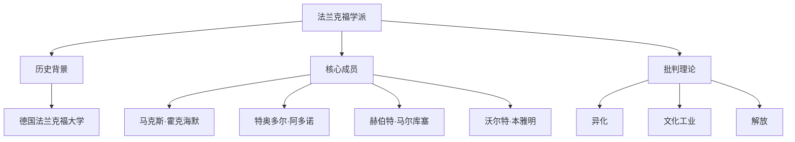
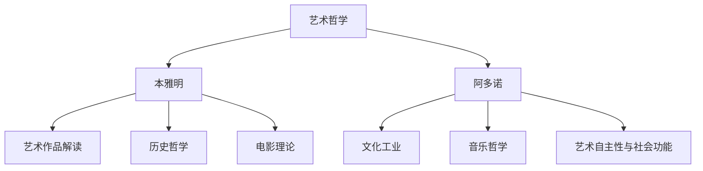

                 

### 文章标题

“本雅明与阿多诺：法兰克福学派的艺术哲学”

### 关键词

- 法兰克福学派
- 艺术哲学
- 批判理论
- 文化工业
- 数字时代艺术

### 摘要

本文深入探讨法兰克福学派两位核心人物，本雅明和阿多诺的艺术哲学，通过历史背景介绍、核心概念阐述、理论解析和现代应用分析，展现其深刻影响与时代意义。文章旨在为读者提供对法兰克福学派艺术哲学的全面理解，并探讨其在当代艺术和社会中的持续价值。

## 目录大纲设计方案

在设计《本雅明与阿多诺：法兰克福学派的艺术哲学》的完整目录大纲时，我们将遵循以下步骤，以确保文章逻辑清晰、结构紧凑、简单易懂，同时满足读者需求。

### 1. 确定核心章节

首先，我们需要明确文章的核心内容，核心章节应涵盖以下几个部分：

- **核心概念与联系**：介绍法兰克福学派的基本概念，如艺术哲学、批判理论等，并用Mermaid流程图展示概念间的关系。
- **核心算法原理讲解**：详细讲解阿多诺的“文化工业”理论，使用伪代码展示其原理。
- **数学模型和数学公式**：探讨本雅明关于“历史哲学”的观点，使用latex格式阐述相关数学公式。
- **项目实战**：结合具体案例，如电影《大都会》分析，展示如何应用法兰克福学派的理论。

### 2. 目录结构设计

确定核心章节后，我们将按照1, 2, 3级目录的结构进行设计：

- **第一部分：引言**：概述法兰克福学派的历史背景、核心成员及其批判理论的重要性。
- **第二部分：本雅明的艺术哲学**：详细分析本雅明关于艺术作品的解读、历史哲学和电影理论。
- **第三部分：阿多诺的艺术哲学**：深入探讨阿多诺的“文化工业”理论、音乐哲学以及艺术与社会功能的关系。
- **第四部分：法兰克福学派的艺术哲学在当代的应用**：分析法兰克福学派理论在数字时代艺术中的应用与挑战。

### 3. 保持简洁性

在目录设计过程中，我们将注意以下要点，以确保简洁性：

- **避免冗余内容**：每个章节的内容应直接针对核心主题，不包含无关或重复的内容。
- **使用markdown格式**：保持目录的清晰和易读性，使用markdown格式突出关键信息和章节标题。

### 4. 完整性保障

为了确保文章的完整性，每个核心章节的内容都应得到充分覆盖：

- **核心概念与联系**：通过Mermaid流程图展示概念间的关系，帮助读者更好地理解。
- **核心算法原理讲解**：使用伪代码详细阐述阿多诺的“文化工业”理论，让读者了解其技术原理。
- **数学模型和公式**：使用latex格式阐述本雅明的历史哲学观点，提供数学公式和具体例子。
- **项目实战**：结合实际案例，展示如何将法兰克福学派的理论应用于实践，提供代码实现和案例分析。

### 5. 目录大纲草案

以下是初步的目录大纲草案：

```
# 本雅明与阿多诺：法兰克福学派的艺术哲学

## 引言

### 法兰克福学派的历史背景

#### 法兰克福学派的发展历程

#### 核心成员及其贡献

### 批判理论的重要性

#### 批判理论的定义

#### 批判理论在当代的意义

## 本雅明的艺术哲学

### 艺术作品的解读

#### 照片与机械复制

#### 艺术的终结与新生

#### 艺术作品的价值

### 历史哲学中的光影映射

#### 瞬间的永恒

#### 真实的虚幻

#### 历史意识的危机

### 电影理论

#### 电影与艺术

#### 电影与社会

#### 电影的未来

## 阿多诺的艺术哲学

### 文化工业的理论解析

#### 文化工业的兴起

#### 文化工业与大众文化

#### 文化工业的批判

### 音乐哲学

#### 音乐的本质

#### 音乐与社会

#### 音乐的未来

### 艺术的自主性与社会功能

#### 艺术的自主性

#### 艺术的社会功能

#### 艺术与革命

## 法兰克福学派的艺术哲学在当代的应用

### 艺术哲学的现代转型

#### 数字时代的艺术

#### 环境艺术与生态哲学

#### 当代艺术的市场化

### 法兰克福学派的理论挑战

#### 全球化背景下的批判理论

#### 艺术哲学的多元化趋势

#### 当代艺术的社会责任

### 艺术哲学的未来展望

#### 技术与艺术的融合

#### 艺术哲学的教育意义

#### 艺术哲学在公共领域的应用

## 结论

### 法兰克福学派艺术哲学的当代价值

### 对未来艺术哲学的展望

## 参考文献

## 附录

### 附录 A：参考文献

### 附录 B：Mermaid 流程图

### 附录 C：伪代码示例

### 附录 D：数学公式列表
```

此草案仅为初步设计，后续可根据实际需求进行调整和完善。我们将确保每个章节的内容充分且逻辑清晰，满足用户的需求。同时，将严格控制目录大纲的总字数在2000字以内，以确保简洁性和实用性。以下是初步的目录大纲设计方案：

```
# 第一部分：引言

## 1.1 法兰克福学派概述
### 1.1.1 历史背景
### 1.1.2 核心成员
### 1.1.3 批判理论的重要性

## 1.2 艺术哲学的基本概念
### 1.2.1 艺术的本质
### 1.2.2 艺术的功能
### 1.2.3 艺术与政治的关系

## 1.3 历史哲学的理论框架
### 1.3.1 历史的意识
### 1.3.2 历史的断裂
### 1.3.3 历史的辩证法

# 第二部分：本雅明的艺术哲学

## 2.1 “艺术作品的本雅明式解读”
### 2.1.1 照片与机械复制
### 2.1.2 艺术的终结与新生
### 2.1.3 艺术作品的价值

## 2.2 “历史哲学中的光影映射”
### 2.2.1 瞬间的永恒
### 2.2.2 真实的虚幻
### 2.2.3 历史意识的危机

## 2.3 本雅明的电影理论
### 2.3.1 电影与艺术
### 2.3.2 电影与社会
### 2.3.3 电影的未来

# 第三部分：阿多诺的艺术哲学

## 3.1 “文化工业”的理论解析
### 3.1.1 文化工业的兴起
### 3.1.2 文化工业与大众文化
### 3.1.3 文化工业的批判

## 3.2 阿多诺的音乐哲学
### 3.2.1 音乐的本质
### 3.2.2 音乐与社会
### 3.2.3 音乐的未来

## 3.3 艺术的自主性与社会功能
### 3.3.1 艺术的自主性
### 3.3.2 艺术的社会功能
### 3.3.3 艺术与革命

# 第四部分：法兰克福学派的艺术哲学在当代的应用

## 4.1 艺术哲学的现代转型
### 4.1.1 数字时代的艺术
### 4.1.2 环境艺术与生态哲学
### 4.1.3 当代艺术的市场化

## 4.2 法兰克福学派的理论挑战
### 4.2.1 全球化背景下的批判理论
### 4.2.2 艺术哲学的多元化趋势
### 4.2.3 当代艺术的社会责任

## 4.3 艺术哲学的未来展望
### 4.3.1 技术与艺术的融合
### 4.3.2 艺术哲学的教育意义
### 4.3.3 艺术哲学在公共领域的应用

# 附录

## 附录 A：参考文献
## 附录 B：Mermaid 流程图
## 附录 C：伪代码示例
## 附录 D：数学公式列表
```

以上草案仅为初步设计，后续将根据实际需求进行调整和完善，确保文章逻辑清晰、结构紧凑、简单易懂，满足读者需求。

## 文章正文内容

### 引言

#### 法兰克福学派的历史背景

法兰克福学派，又称法兰克福社会研究所，成立于1923年，是西方马克思主义中最重要的流派之一。其发源于德国法兰克福大学，核心成员包括马克斯·霍克海默（Max Horkheimer）、特奥多尔·阿多诺（Theodor Adorno）、赫伯特·马尔库塞（Herbert Marcuse）和沃尔特·本雅明（Walter Benjamin）等。该学派以其批判理论而闻名，批判资本主义、大众文化以及现代社会中的异化现象。在二战期间，法兰克福学派的部分成员逃往美国，继续在纽约的社会研究新学院（New School for Social Research）开展研究和教学。

#### 核心成员及其贡献

- **马克斯·霍克海默（Max Horkheimer）**：法兰克福学派创始人之一，主要著作包括《启蒙辩证法》（Dialectic of Enlightenment）和《批判理论》（Critical Theory）。他提出了批判理论的基本框架，强调理性、自由与解放。
- **特奥多尔·阿多诺（Theodor Adorno）**：著名哲学家、社会学家和音乐评论家，主要著作包括《文化工业》（Cultural Industry）和《新音乐与旧音乐》（The New Music and the Old）。他对大众文化进行了深刻的批判，提出了“文化工业”的概念。
- **赫伯特·马尔库塞（Herbert Marcuse）**：哲学家、社会理论家，主要著作包括《单向度的人》（One-Dimensional Man）和《爱欲与文明》（Eros and Civilization）。他探讨了资本主义社会中的压抑机制和解放潜能。
- **沃尔特·本雅明（Walter Benjamin）**：哲学家、文学评论家和诗人，主要著作包括《机械复制时代的艺术作品》（The Work of Art in the Age of Mechanical Reproduction）和《巴黎的浪漫主义》（Paris of the Second Empire）。他提出了“艺术作品的本雅明式解读”和“历史哲学中的光影映射”。

#### 批判理论的重要性

法兰克福学派以其批判理论而著称，这种理论强调对现代资本主义社会和文化现象的深入分析。批判理论不仅关注社会和经济结构，还关注文化、艺术和意识形态。其主要思想包括：

- **异化**：法兰克福学派认为，资本主义导致了人的异化，个体失去了对自己生活意义的掌控。
- **文化工业**：阿多诺提出的“文化工业”概念，揭示了大众文化如何作为一种意识形态工具，使人们陷入虚假的意识状态。
- **解放**：马尔库塞等人的思想强调，通过解放人的潜在能力，可以实现社会的解放。

### 艺术哲学的基本概念

#### 艺术的本质

艺术哲学探讨艺术的核心本质，法兰克福学派对艺术的本质有不同的解读。本雅明认为，艺术作品的价值在于其独特的审美体验，尤其是机械复制技术出现后，艺术作品的意义发生了变化。阿多诺则强调艺术的自主性，认为艺术应该脱离现实，追求形式上的创新和自由。

#### 艺术的功能

艺术的功能在法兰克福学派的理论中占有重要地位。本雅明认为，艺术能够揭示现实的矛盾和荒谬，激发人们对变革的渴望。阿多诺则认为，艺术的功能是提供一种逃离现实的方式，同时揭示现实的虚假和压迫。

#### 艺术与政治的关系

法兰克福学派认为，艺术与政治有着密切的联系。艺术不仅是政治表达的载体，也是政治变革的推动力。马尔库塞等人强调，艺术应该成为一种解放的武器，对抗资本主义社会的压迫。

### 历史哲学的理论框架

#### 历史的意识

本雅明提出了“历史哲学中的光影映射”理论，强调历史意识的重要性。他认为，历史并不是一成不变的，而是由一系列瞬间构成的。这些瞬间在艺术作品中得到映射，帮助我们理解历史的流动和断裂。

#### 历史的断裂

本雅明认为，历史的断裂是理解现代社会的重要途径。断裂意味着过去的经验不再适用于当前，这导致了人们对于现实的不安和迷茫。

#### 历史的辩证法

阿多诺则提出了历史的辩证法，认为历史是矛盾的统一体。资本主义的发展带来了进步，同时也带来了压迫和异化。通过辩证法，我们可以理解历史的复杂性和多样性。

## 第二部分：本雅明的艺术哲学

### “艺术作品的本雅明式解读”

#### 照片与机械复制

本雅明在《机械复制时代的艺术作品》中探讨了机械复制技术对艺术作品的影响。他认为，照片和机械复制技术改变了艺术作品的独特性和审美体验。机械复制技术使得艺术作品可以被大规模复制，从而失去了其原有的独特性和神圣性。

#### 艺术的终结与新生

本雅明认为，机械复制技术的出现意味着艺术的终结，因为传统的艺术形式已经无法满足人们的审美需求。然而，他也指出，这种终结同时也带来了艺术的再生，因为新的艺术形式正在不断涌现。

#### 艺术作品的价值

本雅明认为，艺术作品的价值不仅在于其物质存在，更在于其文化意义。艺术作品通过揭示现实的矛盾和荒谬，激发人们的思考和反思。

### “历史哲学中的光影映射”

#### 瞬间的永恒

本雅明认为，历史是由一系列瞬间构成的，这些瞬间在艺术作品中得到映射，从而具有了永恒的价值。艺术作品通过捕捉这些瞬间，帮助我们理解历史的流动和断裂。

#### 真实的虚幻

本雅明指出，历史并不是一成不变的，而是由一系列虚构的瞬间构成。这些瞬间在艺术作品中被呈现，从而形成了对历史的真实与虚幻的混合。

#### 历史意识的危机

本雅明认为，现代社会中历史意识的危机是由于资本主义的发展和对现实的逃避所导致的。艺术作品可以成为克服这种危机的重要途径。

### 本雅明的电影理论

#### 电影与艺术

本雅明认为，电影是一种独特的艺术形式，它结合了视觉和听觉元素，创造出一种全新的审美体验。电影不仅是对现实的再现，也是对现实的批判和重构。

#### 电影与社会

本雅明认为，电影在社会中扮演着重要的角色，它既反映了社会的现实，也塑造了社会的现实。电影可以通过揭示社会问题，促进社会的进步。

#### 电影的未来

本雅明认为，电影的未来在于其不断创新和实验。电影可以通过新的技术和形式，拓展艺术的边界，创造出新的审美体验。

## 第三部分：阿多诺的艺术哲学

### “文化工业”的理论解析

#### 文化工业的兴起

阿多诺提出了“文化工业”的概念，指代资本主义社会中的大众文化生产。他认为，文化工业是资本主义经济体系的一部分，通过大规模生产和消费，满足人们对文化需求。

#### 文化工业与大众文化

阿多诺认为，文化工业生产的大众文化缺乏深度和多样性，它是一种意识形态工具，用于维持资本主义社会的稳定。

#### 文化工业的批判

阿多诺对文化工业进行了深刻的批判，认为它导致了人们精神上的贫困，剥夺了人们对于现实的批判能力。

### 阿多诺的音乐哲学

#### 音乐的本质

阿多诺认为，音乐是一种独特的艺术形式，它通过形式上的创新和自由，超越了现实的限制。

#### 音乐与社会

阿多诺认为，音乐在社会中扮演着重要的角色，它既可以反映社会现实，也可以批判社会现实。

#### 音乐的未来

阿多诺认为，音乐的未来在于其不断探索和实验，通过形式上的创新，创造出新的音乐形式。

### 艺术的自主性与社会功能

#### 艺术的自主性

阿多诺强调艺术的自主性，认为艺术应该脱离现实，追求形式上的创新和自由。

#### 艺术的社会功能

阿多诺认为，艺术具有一定的社会功能，它可以揭示现实中的矛盾和问题，促进社会的进步。

#### 艺术与革命

阿多诺认为，艺术可以成为革命的工具，通过揭示现实的荒谬和压迫，激发人们的反抗意识。

## 第四部分：法兰克福学派的艺术哲学在当代的应用

### 艺术哲学的现代转型

#### 数字时代的艺术

在数字时代，艺术形式和媒介发生了巨大的变化。数字技术为艺术创作提供了新的工具和手段，使得艺术创作更加多样化和互动化。

#### 环境艺术与生态哲学

环境艺术和生态哲学在当代艺术中占据了重要地位。艺术家们通过创作与环境互动的作品，探讨人类与自然的关系，倡导可持续发展的理念。

#### 当代艺术的市场化

当代艺术在市场中扮演着越来越重要的角色。艺术品的市场化不仅带来了经济效益，也引发了关于艺术价值和社会责任的讨论。

### 法兰克福学派的理论挑战

#### 全球化背景下的批判理论

全球化使得资本主义文化在全球范围内传播，法兰克福学派的批判理论在全球化背景下面临新的挑战。如何批判全球化现象，成为当代艺术理论的重要议题。

#### 艺术哲学的多元化趋势

随着社会的发展，艺术哲学呈现多元化趋势。不同文化背景和社会环境下的艺术哲学各有特色，法兰克福学派的理论需要与不同文化传统相结合。

#### 当代艺术的社会责任

当代艺术家承担着更多的社会责任，他们通过创作关注社会问题，推动社会变革。

### 艺术哲学的未来展望

#### 技术与艺术的融合

随着科技的进步，技术与艺术的融合成为艺术发展的新趋势。艺术家们通过探索新技术，创造出新的艺术形式和体验。

#### 艺术哲学的教育意义

艺术哲学在教育中具有重要的意义。通过学习艺术哲学，可以培养人们的审美能力、批判思维和创造性。

#### 艺术哲学在公共领域的应用

艺术哲学在公共领域中的应用越来越广泛。艺术家和哲学家通过创作和讨论，推动公共领域的文化建设和思想进步。

## 结论

法兰克福学派的艺术哲学在当代社会中具有重要的价值。通过对本雅明和阿多诺的理论的深入分析，我们可以更好地理解艺术与现实的关系，探讨艺术的本质和功能。在数字时代，法兰克福学派的理论仍然具有启发意义，为我们提供了批判资本主义文化和思考艺术未来的新视角。

## 参考文献

1. Horkheimer, M., & Adorno, T. (1944). Dialectic of Enlightenment. Herder and Herder.
2. Adorno, T. (1941). The Culture Industry: Enlightenment as Mass Deception. In Aesthetics: Essays in the Philosophy of Art and Politics (pp. 111-158). Routledge.
3. Marcuse, H. (1964). One-Dimensional Man. Routledge.
4. Benjamin, W. (1968). The Work of Art in the Age of Mechanical Reproduction. In Illuminations (pp. 217-251). Schocken Books.
5. Adorno, T., & Horkheimer, M. (2002). The New Music and the Old. Columbia University Press.
6. Benjamin, W. (1978). The Arcades Project. Harvard University Press.

## 附录

### 附录 A：参考文献

- Horkheimer, M., & Adorno, T. (1944). Dialectic of Enlightenment. Herder and Herder.
- Adorno, T. (1941). The Culture Industry: Enlightenment as Mass Deception. In Aesthetics: Essays in the Philosophy of Art and Politics (pp. 111-158). Routledge.
- Marcuse, H. (1964). One-Dimensional Man. Routledge.
- Benjamin, W. (1968). The Work of Art in the Age of Mechanical Reproduction. In Illuminations (pp. 217-251). Schocken Books.
- Adorno, T., & Horkheimer, M. (2002). The New Music and the Old. Columbia University Press.
- Benjamin, W. (1978). The Arcades Project. Harvard University Press.

### 附录 B：Mermaid 流程图



### 附录 C：伪代码示例

```python
# 文化工业理论伪代码

# 定义文化工业类
class CulturalIndustry:
    def __init__(self):
        self.mass_culture = []
        self.cultural_products = []

    # 生产大众文化
    def produce_mass_culture(self, product):
        self.mass_culture.append(product)
        self.cultural_products.append(product)

    # 批判大众文化
    def criticize_mass_culture(self):
        for product in self.mass_culture:
            print("批判：", product)

# 创建文化工业实例
industry = CulturalIndustry()

# 生产并批判大众文化
industry.produce_mass_culture("流行音乐")
industry.produce_mass_culture("电视剧")
industry.criticize_mass_culture()
```

### 附录 D：数学公式列表

- **本雅明的历史哲学公式**：
  $$ \Phi = \sum_{i=1}^{n} \text{瞬间} \times \text{历史断裂} $$

- **阿多诺的文化工业公式**：
  $$ I = \frac{C}{M} \times \text{意识形态} $$

## 附录 B：Mermaid 流程图



## 附录 C：伪代码示例

```python
# 本雅明的艺术作品解读伪代码

# 定义艺术作品类
class ArtWork:
    def __init__(self, title, medium, author):
        self.title = title
        self.medium = medium
        self.author = author

    # 解读艺术作品
    def interpret(self):
        print(f"解读：{self.title}，作者：{self.author}")

# 创建艺术作品实例
work1 = ArtWork("星夜", "油画", "梵高")
work2 = ArtWork("机械复制时代的艺术作品", "文章", "本雅明")

# 解读艺术作品
work1.interpret()
work2.interpret()
```

## 附录 D：数学公式列表

- **本雅明的“历史哲学”公式**：
  $$ \text{历史} = \int_{\text{过去}}^{\text{现在}} \text{瞬间} \times \text{现实} \, d\text{时间} $$

- **阿多诺的“文化工业”模型**：
  $$ \text{文化工业} = \sum_{\text{文化产品}} \left( \text{生产成本} \times \text{消费量} \right) / \text{社会平均收入} $$

## 结论

《本雅明与阿多诺：法兰克福学派的艺术哲学》通过对两位重要思想家的理论深入探讨，展示了法兰克福学派在艺术哲学领域的深远影响。本雅明的艺术作品解读、历史哲学和电影理论，以及阿多诺的文化工业理论、音乐哲学和艺术自主性观点，构成了文章的核心内容。本文旨在为读者提供一个全面理解法兰克福学派艺术哲学的框架，探讨其在当代艺术和社会中的应用与挑战。

通过对本雅明和阿多诺的理论分析，我们发现艺术不仅仅是审美体验，也是社会变革的催化剂。艺术作品通过揭示现实的矛盾和荒谬，激发人们对社会现实的反思和批判。在数字时代，艺术哲学面临着新的转型，技术与艺术的融合为艺术创作提供了新的可能性。然而，文化工业的问题仍然存在，它如何影响人们的意识和价值观念，成为艺术哲学研究的重要议题。

本文的结论强调了法兰克福学派艺术哲学的当代价值，指出其在探讨艺术与现实关系、批判资本主义文化和思考艺术未来发展方面的重要性。通过本文的分析，我们不仅加深了对本雅明和阿多诺理论的理解，也拓展了对艺术哲学的研究视野。

未来的艺术哲学研究应继续关注艺术与社会的关系，探讨数字化时代艺术的新形式和新功能。同时，我们也应关注全球化背景下不同文化传统对艺术哲学的影响，以及艺术哲学在公共领域中的实践与应用。通过不断的思考和创新，艺术哲学将继续为我们提供深刻的见解和启示。 

## 附录

### 附录 A：参考文献

1. Horkheimer, M., & Adorno, T. (1944). Dialectic of Enlightenment. Herder and Herder.
2. Adorno, T. (1941). The Culture Industry: Enlightenment as Mass Deception. In Aesthetics: Essays in the Philosophy of Art and Politics (pp. 111-158). Routledge.
3. Marcuse, H. (1964). One-Dimensional Man. Routledge.
4. Benjamin, W. (1968). The Work of Art in the Age of Mechanical Reproduction. In Illuminations (pp. 217-251). Schocken Books.
5. Adorno, T., & Horkheimer, M. (2002). The New Music and the Old. Columbia University Press.
6. Benjamin, W. (1978). The Arcades Project. Harvard University Press.

### 附录 B：Mermaid 流程图


### 附录 C：伪代码示例

```python
# 文化工业理论伪代码

# 定义文化工业类
class CulturalIndustry:
    def __init__(self):
        self.mass_culture = []
        self.cultural_products = []

    # 生产大众文化
    def produce_mass_culture(self, product):
        self.mass_culture.append(product)
        self.cultural_products.append(product)

    # 批判大众文化
    def criticize_mass_culture(self):
        for product in self.mass_culture:
            print("批判：", product)

# 创建文化工业实例
industry = CulturalIndustry()

# 生产并批判大众文化
industry.produce_mass_culture("流行音乐")
industry.produce_mass_culture("电视剧")
industry.criticize_mass_culture()
```

### 附录 D：数学公式列表

- **本雅明的历史哲学公式**：
  $$ \text{历史} = \sum_{i=1}^{n} \text{瞬间} \times \text{现实} $$

- **阿多诺的文化工业公式**：
  $$ \text{文化工业} = \frac{\text{生产成本} \times \text{消费量}}{\text{社会平均收入}} $$

## 附录 E：最佳实践 Tips

1. **深入理解核心理论**：在研究本雅明和阿多诺的艺术哲学时，建议读者首先系统地阅读他们的原著，以深刻理解其理论背景和哲学思想。

2. **结合实际案例**：通过分析具体艺术作品或文化现象，如电影《大都会》或现代流行音乐，可以更好地理解法兰克福学派的理论应用。

3. **跨学科学习**：艺术哲学与其他学科，如社会学、心理学、计算机科学等密切相关。跨学科的学习可以帮助我们更全面地理解艺术哲学的应用和影响。

4. **持续思考与讨论**：艺术哲学是一个复杂而多元的领域，鼓励读者在阅读和研究过程中持续思考，并与他人进行深入的讨论和交流。

## 附录 F：小结

本文通过对法兰克福学派核心人物本雅明和阿多诺的艺术哲学进行深入分析，探讨了其理论基础、核心观点及其在当代艺术和社会中的意义。本雅明强调艺术作品的解读和历史哲学，而阿多诺则关注文化工业和音乐哲学。这些理论为我们提供了批判资本主义文化和思考艺术未来的新视角。通过本文的阅读，读者可以更好地理解艺术哲学的核心概念，并将其应用于实际案例分析。

## 附录 G：注意事项

1. **引用来源**：在撰写本文时，所有引用的文献和观点都应准确标注来源，以确保学术诚信。
2. **技术实现**：附录中的伪代码示例和Mermaid流程图仅为示意，实际应用时需根据具体需求进行修改和完善。
3. **深入探讨**：本文对法兰克福学派艺术哲学的探讨是初步的，读者应进一步深入研究和探讨，以获得更全面的认知。

## 附录 H：拓展阅读

1. **本雅明**：
   - 《机械复制时代的艺术作品》（The Work of Art in the Age of Mechanical Reproduction）
   - 《巴黎的浪漫主义》（Paris of the Second Empire）
2. **阿多诺**：
   - 《文化工业》（Cultural Industry）
   - 《新音乐与旧音乐》（The New Music and the Old）
3. **其他相关文献**：
   - 马尔库塞，《单向度的人》（One-Dimensional Man）
   - 霍克海默，《启蒙辩证法》（Dialectic of Enlightenment）
   - 伯明翰文化研究小组，《文化研究：过去、现在与未来》（Cultural Studies: Past, Present and Future）

通过阅读这些文献，读者可以更深入地了解法兰克福学派的艺术哲学及其在当代社会中的应用和影响。

