                 

## 文章标题

### 杜威与皮尔士：实用主义的不同侧重

> **关键词**：实用主义、约翰·杜威、查尔斯·桑德斯·皮尔士、哲学、认识论、知识论、教育哲学、符号学、科学方法、现代应用。

> **摘要**：本文深入探讨实用主义哲学的两位重要代表人物——约翰·杜威和查尔斯·桑德斯·皮尔士的不同侧重点。文章首先介绍了实用主义的基本概念及其起源，接着详细分析了杜威和皮尔士的理论框架，重点对比了他们在认识论、知识论和教育哲学方面的异同。随后，文章探讨了实用主义在现代哲学中的应用，并通过实际案例展示了两位哲学家的思想如何影响当代社会。最终，文章总结了实用主义的重要价值，并提出了进一步研究的方向。

----------------------------------------------------------------------------------------------------------------------------

## 1. **明确核心概念和联系**

### 实用主义的基本定义与起源

实用主义（Pragmatism）是一种哲学思想，强调观念和理论的实际效果和实用性。它主张通过实践来检验真理，认为知识应当服务于人类生活和行动。实用主义的起源可以追溯到19世纪末的美国，当时的哲学家查尔斯·桑德斯·皮尔士（Charles Sanders Peirce）和约翰·杜威（John Dewey）是其主要代表人物。

皮尔士是符号逻辑和科学哲学的先驱，他提出了符号学（semiotics）这一概念，并试图将逻辑学与实用主义结合起来，强调符号系统在社会认知中的作用。杜威则是一位著名的教育哲学家，他的实用主义思想对教育改革产生了深远影响，主张通过实践和问题解决来学习。

### 实用主义的核心原理

实用主义的核心原理包括认识论（epistemology）和知识论（ontology）。在认识论方面，实用主义强调经验是知识的基础，认为知识是通过实践和经验不断修正和完善的。在知识论方面，实用主义主张知识应当具有实用价值，能够指导行动和解决实际问题。

### 实用主义在现代哲学中的应用

实用主义不仅对哲学本身产生了深远影响，也在现代科学、教育、伦理和政治哲学等领域得到了广泛应用。例如，科学哲学中的实用主义强调科学理论应当能够预测和解释现象，教育哲学中的实用主义主张以学生为中心，通过实践活动来促进学习。

### 杜威与皮尔士的实用主义哲学

杜威和皮尔士虽然都是实用主义的代表人物，但他们的理论侧重点有所不同。杜威的实用主义更侧重于教育哲学，强调教育应当培养学生的批判性思维和实践能力。皮尔士的实用主义则更侧重于科学哲学和符号学，试图通过逻辑和符号系统来理解世界。

### Mermaid流程图：实用主义的核心概念架构

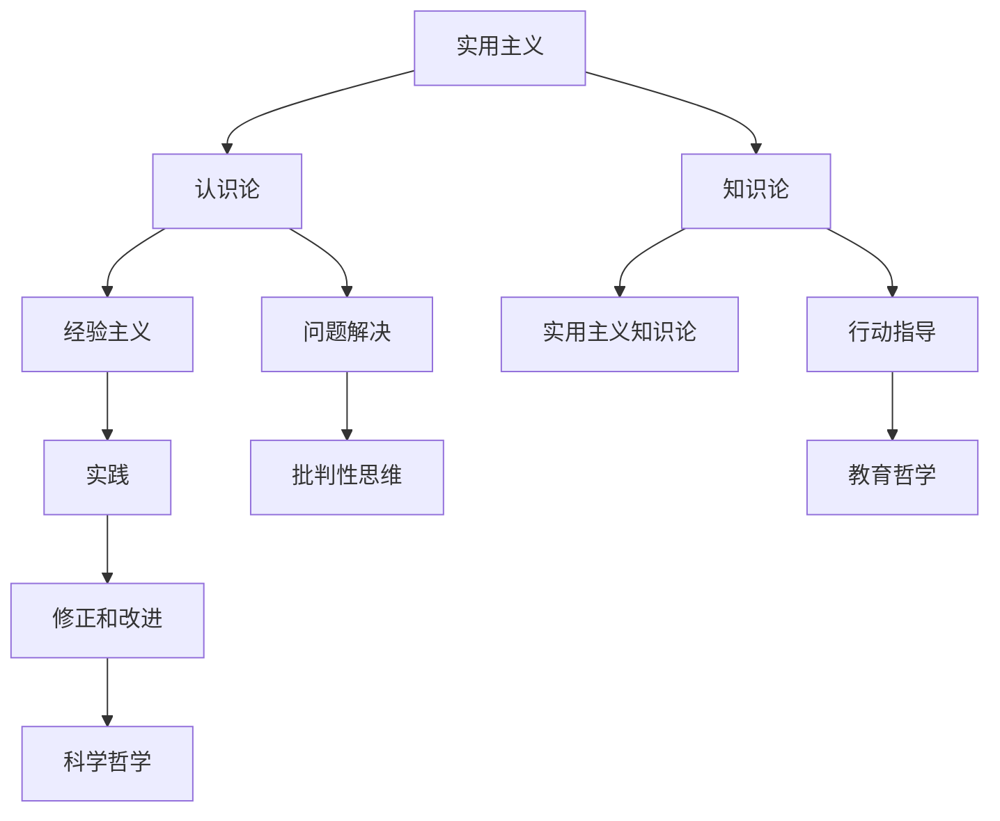

通过这个流程图，我们可以清晰地看到实用主义的核心概念及其相互关系。接下来，我们将详细探讨杜威和皮尔士的实用主义理论，并分析他们在教育哲学和科学哲学方面的不同贡献。

----------------------------------------------------------------------------------------------------------------------------

## 2. **设计大纲结构**

为了系统地阐述杜威与皮尔士实用主义的不同侧重，本文将分为六个主要部分：

### 第一部分：实用主义哲学基础
- 第1章 实用主义概述
  - 实用主义的概念与起源
  - 实用主义的核心原理
  - 实用主义的影响与评价
- 第2章 杜威的哲学思想
  - 杜威的生平与背景
  - 杜威的核心理论
  - 杜威的社会哲学
- 第3章 皮尔士的哲学思想
  - 皮尔士的生平与背景
  - 皮尔士的核心理论
  - 皮尔士的实用主义哲学

### 第二部分：实用主义理论的对比
- 第4章 杜威与皮尔士实用主义的对比
  - 理论基础对比
  - 应用领域的差异
  - 时代背景下的实用主义

### 第三部分：实用主义在现代哲学中的应用
- 第5章 实用主义在现代哲学中的应用
  - 实用主义与科学哲学
  - 实用主义与伦理学
  - 实用主义与政治哲学

### 第四部分：实用主义的实际案例
- 第6章 杜威与皮尔士实用主义的实际案例
  - 杜威教育哲学的实践案例
  - 皮尔士符号学应用的案例
  - 实用主义在当代社会中的应用

### 第五部分：总结与展望
- 第7章 实用主义的价值与未来
  - 实用主义在哲学史上的地位
  - 实用主义的现代评价
  - 实用主义的未来发展趋势

### 第六部分：拓展阅读与参考文献
- 第8章 拓展阅读与参考文献
  - 主要参考文献
  - 推荐阅读书籍
  - 学术资源链接

通过这个结构化的大纲，本文将深入探讨实用主义哲学的核心概念，详细分析杜威与皮尔士的实用主义理论，并探讨其实际应用和当代价值。接下来，我们将分别介绍实用主义的定义、起源和发展，以及杜威和皮尔士的理论框架。

----------------------------------------------------------------------------------------------------------------------------

### 2.1 实用主义概述

#### 实用主义的概念与起源

实用主义（Pragmatism）作为一种哲学思想，强调观念和理论的实际效果和实用性。其核心理念是，真理不是静态的，而是通过实践不断修正和发展的。实用主义认为，知识的价值在于其应用性和可操作性，而不是其抽象的合理性。

实用主义的起源可以追溯到19世纪末的美国。当时的哲学家查尔斯·桑德斯·皮尔士（Charles Sanders Peirce）和约翰·杜威（John Dewey）被认为是实用主义哲学的奠基人。皮尔士在符号学和科学哲学方面的贡献，以及杜威在教育哲学和实用主义方法论上的探索，奠定了实用主义在现代哲学中的重要地位。

#### 实用主义的核心原理

实用主义的核心原理包括认识论（epistemology）和知识论（ontology）。在认识论方面，实用主义强调经验是知识的基础，认为知识是通过实践和经验不断修正和完善的。这一观点与经验主义有相似之处，但实用主义更强调知识的实用性和应用性。

在知识论方面，实用主义主张知识应当具有实用价值，能够指导行动和解决实际问题。实用主义认为，知识不应该仅仅停留在理论层面，而应该转化为实践，以实现具体的目标。

#### 实用主义的影响与评价

实用主义对现代哲学产生了深远影响。首先，它对科学哲学的发展起到了重要的推动作用。实用主义强调科学理论应当能够预测和解释现象，这一观点为科学方法论提供了新的视角。

其次，实用主义在教育哲学中具有重要地位。杜威的教育哲学主张以学生为中心，通过实践活动来促进学习。这种教育理念对现代教育理论和实践产生了深远影响。

然而，实用主义也受到了一些批评。一些哲学家认为，实用主义过于强调实用性和应用性，可能导致对理论的忽视。此外，实用主义的一些观点在逻辑严密性方面也存在争议。

#### Mermaid流程图：实用主义的核心概念架构


通过这个流程图，我们可以清晰地看到实用主义的核心概念及其相互关系。接下来，我们将深入探讨杜威和皮尔士的实用主义理论，以及他们在哲学上的不同贡献。

----------------------------------------------------------------------------------------------------------------------------

### 2.2 杜威的哲学思想

#### 杜威的生平与背景

约翰·杜威（John Dewey，1859-1952）是美国著名的教育哲学家和实用主义代表人物之一。他出生于佛蒙特州的伯灵顿，从小就对学习充满了热情。杜威在佛蒙特大学获得文学学士学位后，前往约翰·霍普金斯大学攻读硕士学位，并在那里接受了严格的哲学训练。

杜威的哲学生涯始于19世纪末和20世纪初，当时实用主义在美国哲学界崭露头角。他曾任芝加哥大学教育学院的院长，并在那里进行了一系列关于教育改革的研究和实践。杜威的教育哲学强调以学生为中心，通过实践活动来促进学习。他的思想对20世纪的教育理论和实践产生了深远影响。

#### 杜威的核心理论

杜威的实用主义哲学涵盖了多个领域，包括认识论、知识论、教育哲学和社会哲学。他的核心理论包括以下几个方面：

##### 1. 认识论

杜威认为，认识是一个动态的过程，而不是静态的实体。他提出了“做中学”（learning by doing）的教育理念，认为通过实践和经验的积累，人们可以不断修正和改进他们的认识。杜威认为，知识不是通过被动接受，而是通过主动探索和实验获得的。

```plaintext
// 杜威的认识论伪代码
function knowledgeThroughExperimentation() {
    hypothesis = formulateA Hypothesis;
    experiment = designAndConductAnExperiment;
    observation = recordAndAnalyzeObservations;
    conclusion = reviseOrConfirmHypothesis;
    return conclusion;
}
```

##### 2. 知识论

杜威主张知识应当具有实用价值，能够指导行动和解决实际问题。他认为，知识不应该仅仅停留在理论层面，而应该转化为实践，以实现具体的目标。杜威的知识论强调知识的情境依赖性，认为知识的应用性是评价其价值的重要标准。

```plaintext
// 杜威的知识论伪代码
function practicalKnowledge(Context) {
    problem = identifyAProblemInContext(Context);
    solution = generateASolution;
    application = implementTheSolution;
    evaluation = assessTheEffectivenessOfTheSolution;
    return evaluation;
}
```

##### 3. 教育哲学

杜威的教育哲学主张以学生为中心，强调教育应该培养学生的批判性思维和实践能力。他提出了“教育即生活”（education as life）的理念，认为教育应该与社会实践相结合，帮助学生将理论知识应用于实际问题中。

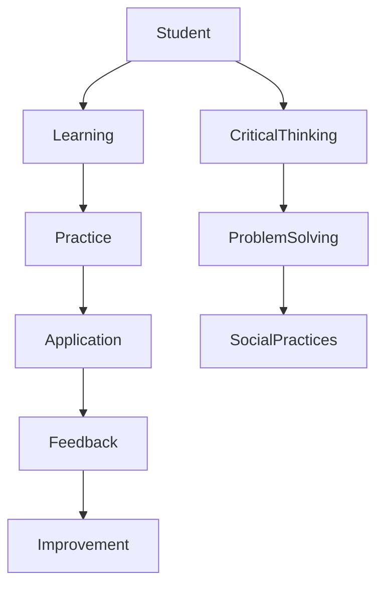

##### 4. 社会哲学

杜威的社会哲学强调民主政治和公民参与的重要性。他认为，社会应该是一个合作的共同体，每个人都应当参与社会事务的决策。杜威主张通过教育和民主制度的改革，实现社会的公平和正义。

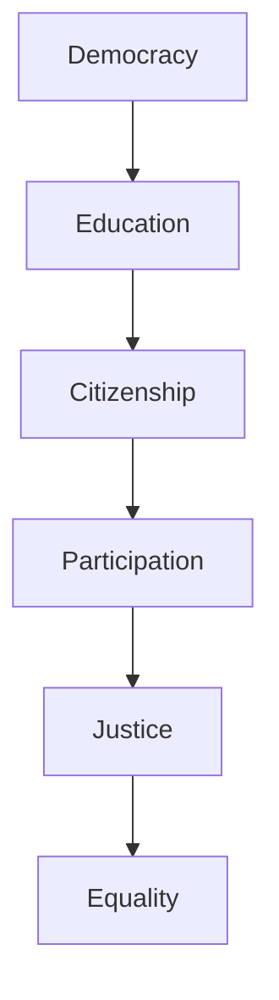

#### 杜威的社会哲学

杜威的社会哲学是其实用主义思想的重要组成部分。他主张教育应当培养具有社会责任感和公民意识的个体，通过教育和民主制度的改革，实现社会的公平和正义。

杜威认为，民主政治的基石在于公民的积极参与。他强调教育应该培养学生的批判性思维和问题解决能力，使他们能够积极参与社会事务，并为社会进步作出贡献。杜威的教育哲学对20世纪的教育改革产生了深远影响，许多现代教育理论和实践都受到了他的启发。

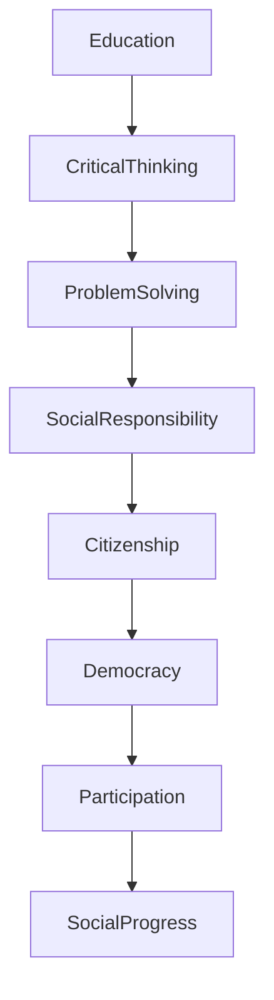

通过上述分析，我们可以看到，杜威的实用主义哲学具有深刻的认识论、知识论和教育哲学基础，其社会哲学思想进一步强调了民主政治和公民参与的重要性。杜威的哲学思想不仅对哲学本身产生了深远影响，也对教育、科学和社会发展产生了重要启示。

接下来，我们将继续探讨查尔斯·桑德斯·皮尔士的哲学思想，以及他在实用主义哲学中的地位和贡献。

----------------------------------------------------------------------------------------------------------------------------

### 2.3 查尔斯·桑德斯·皮尔士的哲学思想

#### 查尔斯·桑德斯·皮尔士的生平与背景

查尔斯·桑德斯·皮尔士（Charles Sanders Peirce，1839-1914）是美国哲学家、逻辑学家、数学家、符号学家，被广泛认为是实用主义哲学的奠基人之一。他出生于马萨诸塞州坎布里奇，从小就展现出了极高的数学和科学天赋。皮尔士早年曾在哈佛大学学习，后来在德国海德堡大学和柏林大学深造，深受德国哲学和科学方法的影响。

皮尔士的哲学生涯可谓曲折，他曾担任过教师、讲师和图书馆管理员，但他的工作并未能带给他经济上的稳定。尽管如此，皮尔士在哲学、逻辑学、数学和符号学等领域做出了开创性的贡献，对后来的哲学家和科学家产生了深远影响。

#### 查尔斯·桑德斯·皮尔士的核心理论

皮尔士的哲学思想涵盖了许多领域，其中最为突出的包括符号学、科学哲学和实用主义。以下是他核心理论的主要方面：

##### 1. 符号学

皮尔士是符号学的创始人之一，他提出了符号的三个基本分类：标志（Symbol）、指号（Index）和符号（Icon）。标志是指通过符号的物理属性来表示某种意义的符号，例如红绿灯。指号则是通过某种物理现象与所表示对象之间的关联来传递信息的符号，例如烟信号。符号则是通过形式结构来表示某种意义的符号，例如绘画和诗歌。

皮尔士认为，符号学是理解人类沟通和认知过程的关键。他提出了符号的三位一体理论，即每个符号都包含着符号的意图、符号的表达方式和符号的接受者。这一理论为我们理解人类语言和文化提供了重要的视角。

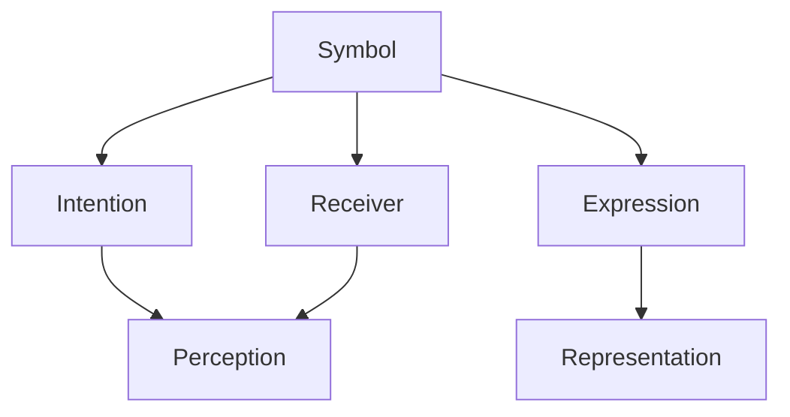

##### 2. 科学哲学

皮尔士的科学哲学强调科学方法的实用性和可操作性。他认为，科学知识是通过观察、实验和假设验证的过程不断积累和修正的。皮尔士提出了科学研究的四个阶段：观察（Observation）、假设（Hypothesis）、实验（Experiment）和验证（Verification）。这一过程可以表示为以下伪代码：

```plaintext
function scientificMethod(Observation) {
    hypothesis = generateAHypothesis(Observation);
    experiment = designAndConductAnExperiment(hypothesis);
    results = analyzeExperimentResults(experiment);
    if (results support hypothesis) {
        return hypothesis as a scientific theory;
    } else {
        revise hypothesis and repeat the process;
    }
}
```

##### 3. 实用主义

皮尔士的实用主义观点强调观念的实际效果和实用性。他认为，真理不是静态的，而是通过实践不断修正和发展的。皮尔士主张，真理的价值在于其应用性和可操作性，而不是其抽象的合理性。

皮尔士的实用主义与约翰·杜威有所不同，杜威更侧重于教育哲学和社会哲学，而皮尔士则更注重科学哲学和符号学。皮尔士的实用主义强调符号系统和逻辑在认知过程中的作用，他认为符号学是理解世界和人类沟通的关键。

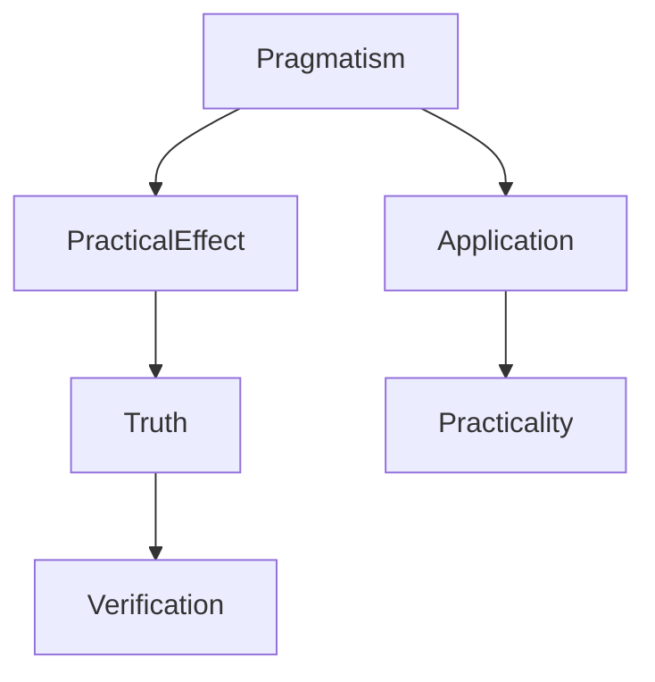

#### 皮尔士的实用主义哲学

皮尔士的实用主义哲学认为，观念的真理性在于其实际效果，而不是其逻辑合理性。他认为，真理是通过实践不断修正和验证的，而不是通过纯粹的理论推导获得的。皮尔士提出了“实用主义的两大定律”：

1. **效果定律**（Law of Effect）：一个观念如果能在实践中带来积极的效果，那么它就被认为是真实的。
2. **兼容性定律**（Law of Conjunctive Effect）：如果一个观念在不同的情境中都能带来积极的效果，那么它就更接近于真理。

皮尔士的实用主义哲学为我们理解真理和知识的形成提供了新的视角，强调了实践和经验在认知过程中的重要性。

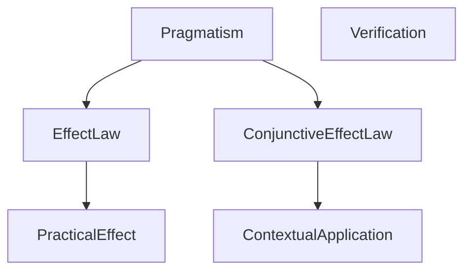

通过上述分析，我们可以看到，查尔斯·桑德斯·皮尔士的哲学思想在符号学、科学哲学和实用主义领域具有重要地位。他通过符号学理论、科学方法论和实用主义观点，为我们理解世界和人类认知过程提供了丰富的理论资源。接下来，我们将详细探讨杜威与皮尔士实用主义理论之间的异同，以及他们在教育哲学和社会哲学方面的不同贡献。

----------------------------------------------------------------------------------------------------------------------------

### 2.4 杜威与皮尔士实用主义理论的对比

#### 理论基础对比

杜威和皮尔士的实用主义理论在哲学基础上有明显的差异。杜威的实用主义更侧重于教育哲学，他主张通过实践和经验来学习，强调教育应当培养学生的批判性思维和实践能力。杜威认为，知识是通过“做中学”的过程获得的，这一理念对现代教育理论产生了深远影响。

```plaintext
// 杜威的教育哲学伪代码
function deweyEducationalPhilosophy() {
    concept = formulateAConcept;
    experiment = designAndConductAnExperiment(concept);
    reflection = reflectOnExperimentResults(experiment);
    learning = reviseAndReinforceConcept(reflection);
    return learning;
}
```

相比之下，皮尔士的实用主义则更侧重于科学哲学和符号学。他认为，符号系统是理解和沟通世界的关键，通过逻辑和符号学的方法，人们可以更深入地理解现实。皮尔士提出了符号的三位一体理论，强调符号的意图、表达方式和接受者之间的相互作用。


#### 应用领域的差异

杜威的实用主义主要应用于教育哲学，他强调教育应当与社会实践相结合，通过实践活动来促进学习。杜威的教育理念对20世纪的教育改革产生了深远影响，许多现代教育理论和实践都受到了他的启发。

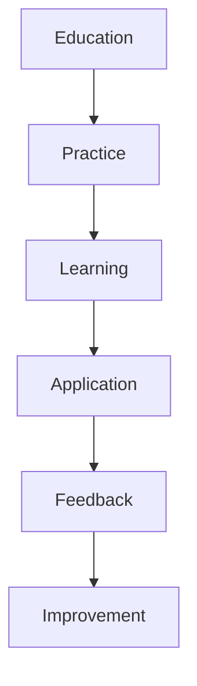

皮尔士的实用主义则主要应用于科学哲学和符号学。他认为，科学知识是通过观察、实验和假设验证的过程不断积累和修正的。皮尔士的科学方法论强调实用性和可操作性，为现代科学方法论提供了新的视角。

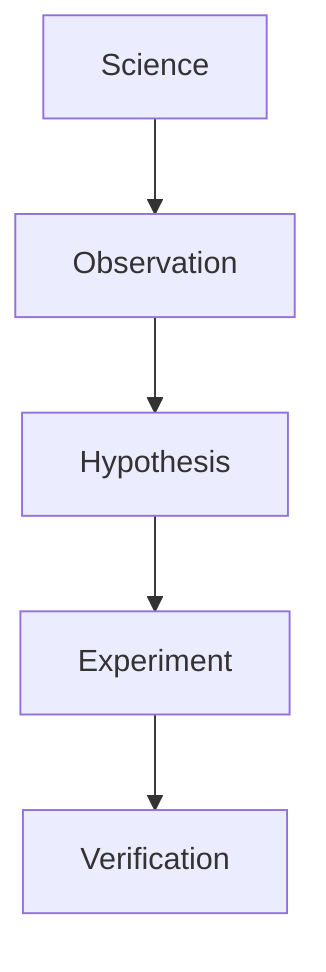

#### 时代背景下的实用主义

杜威和皮尔士的实用主义哲学产生于19世纪末和20世纪初，这一时期的美国正处于工业化和城市化进程的快速发展阶段。社会变革和经济发展的需求推动了实用主义哲学的发展，强调知识和理论的实用性和应用性。

杜威的教育哲学适应了这一时代背景，他主张通过实践活动来培养学生的批判性思维和实践能力，以应对快速变化的社会环境。

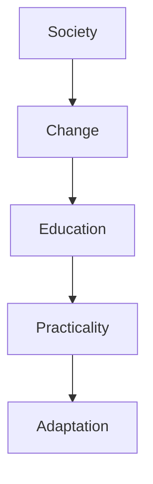

皮尔士的科学哲学则适应了这一时代背景，他强调科学方法的实用性和可操作性，为科学研究提供了新的方法论。

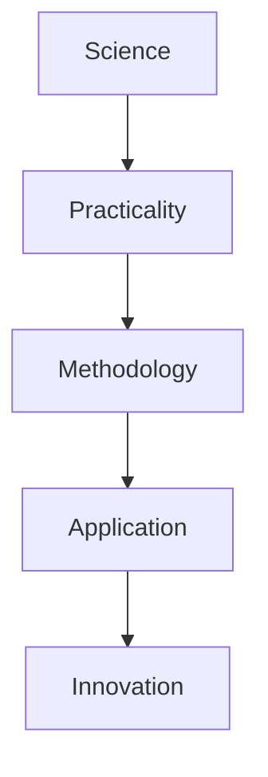

#### 对比与启示

杜威和皮尔士的实用主义理论在理论基础和应用领域上存在明显的差异。杜威更侧重于教育哲学，强调实践和经验在知识形成中的作用；皮尔士则更侧重于科学哲学和符号学，强调逻辑和符号系统在理解世界和沟通中的重要性。

这些差异反映了两位哲学家在哲学背景和时代背景下的不同关注点。杜威的教育哲学对现代教育理论和实践产生了深远影响，皮尔士的科学哲学则为现代科学方法论提供了新的视角。

通过对比杜威和皮尔士的实用主义理论，我们可以得到以下启示：

1. **知识与实践的结合**：杜威的教育哲学提醒我们，知识不仅仅是理论，更应当与实践相结合，以培养学生的实际能力。
2. **逻辑与符号的重要性**：皮尔士的科学哲学强调了逻辑和符号系统在理解和沟通中的关键作用，提醒我们在现代科学研究中注重逻辑性和系统性。
3. **实用性与创新性**：两位哲学家的实用主义观点都强调了实用性和应用性，这为我们今天在科学研究和技术创新中提供了重要的指导。

通过深入探讨杜威与皮尔士的实用主义理论，我们可以更好地理解实用主义哲学的丰富内涵和多元应用，为现代哲学和科学技术的发展提供有益的启示。

----------------------------------------------------------------------------------------------------------------------------

### 2.5 实用主义在现代哲学中的应用

实用主义作为一种哲学思想，不仅在理论层面具有重要意义，还在现代哲学的多个领域中得到了广泛应用。以下将讨论实用主义在科学哲学、伦理学和政治哲学中的应用。

#### 实用主义与科学哲学

在科学哲学中，实用主义强调科学理论应当能够预测和解释现象，这一点与实证主义有相似之处。然而，实用主义更进一步，认为科学知识不仅是理论性的，还应当具有实用价值。科学哲学家迈克尔·波兰尼（Michael Polanyi）在其著作《科学的形而上学基础》（The Tacit Dimension）中，探讨了实用主义在科学方法论中的应用。他认为，科学知识不仅是通过显性的理论体系获得的，还包括隐性的、难以言传的实践知识。

实用主义在科学哲学中的应用可以表示为以下伪代码：

```plaintext
function scientificKnowledge(Theory) {
    theory = formulateATheory;
    observation = collectAndAnalyzeData;
    application = implementTheoryInPractice;
    evaluation = assessTheoryEffectiveness;
    return evaluation;
}
```

#### 实用主义与伦理学

在伦理学领域，实用主义强调道德行为的实际效果和实用性。伦理学家如威廉·詹姆斯（William James）和约翰·罗尔斯（John Rawls）都探讨了实用主义在道德决策中的应用。詹姆斯认为，道德行为应当能够带来积极的社会效果，而罗尔斯则通过其正义理论，试图构建一个公平的社会制度。

实用主义在伦理学中的应用可以表示为以下伪代码：

```plaintext
function moralDecision(Morality) {
    action = identifyAnAction;
    consequence = predictAndEvaluateConsequence(action);
    if (consequence is positive) {
        execute action;
    } else {
        reconsider and choose a different action;
    }
}
```

#### 实用主义与政治哲学

在政治哲学中，实用主义强调民主政治和公民参与的重要性。实用主义哲学家约翰·杜威提出了“民主作为一种生活方式”（Democracy as a Way of Life）的理念，认为民主不仅仅是一种政治制度，更是一种生活方式和社会文化。杜威主张通过教育和社会参与，培养具有社会责任感的公民，以实现社会的公平和正义。

实用主义在政治哲学中的应用可以表示为以下伪代码：

```plaintext
function democraticGovernance(Citizens) {
    education = provideCivicEducation;
    participation = encourageCitizenParticipation;
    justice = implementFairSocialPolicies;
    feedback = collectCitizenFeedback;
    improvement = continuouslyReformGovernanceBasedOnFeedback;
}
```

#### 实用主义在现代哲学中的意义

实用主义在现代哲学中的应用不仅丰富了哲学的内涵，也为社会和科学的发展提供了新的视角。首先，实用主义强调了知识和理论的实用性，促使我们在科学研究中注重实际应用。其次，实用主义在伦理学中的应用，为我们提供了一种以效果为导向的道德决策框架，有助于解决复杂的社会问题。最后，实用主义在政治哲学中的应用，强调了民主和公民参与的重要性，为构建公平和正义的社会提供了理论支持。

通过上述分析，我们可以看到，实用主义在现代哲学中的广泛应用，不仅为哲学研究带来了新的思路，也为社会和科学的发展提供了有益的指导。

----------------------------------------------------------------------------------------------------------------------------

### 2.6 杜威与皮尔士实用主义的实际案例

#### 杜威教育哲学的实践案例

约翰·杜威的教育哲学强调以学生为中心，通过实践活动来促进学习。一个经典的实践案例是美国进步教育运动。在这一运动中，教师不再是单纯的知识传授者，而是学生学习的引导者和协作者。以下是一个具体的案例：

**案例：芝加哥实验室学校**

在芝加哥实验室学校，学生们通过实际操作和实验来学习各种学科。例如，学生在自然科学课上通过种植植物、观察植物生长过程，来学习生物学知识。在数学课上，学生通过实际测量和计算，来理解几何和代数的概念。

**伪代码：杜威教育哲学实践案例**

```plaintext
function deweyEducationalCase(School) {
    curriculum = designProjectBasedCurriculum;
    students = engageStudentsInPracticalActivities;
    teachers = supportAndGuideStudents;
    feedback = collectStudentFeedbackOnLearningProcess;
    improvement = continuouslyAdjustCurriculumBasedOnFeedback;
    return successfulLearningOutcomes;
}
```

#### 皮尔士符号学应用的案例

查尔斯·桑德斯·皮尔士的符号学理论强调符号在沟通和理解中的关键作用。一个实际案例是符号学的应用在信息科学和计算机科学中。以下是一个具体的案例：

**案例：语义网络**

语义网络是一种基于皮尔士符号学理论的图形表示方法，用于表示知识结构和概念之间的关系。在语义网络中，节点表示概念，边表示概念之间的关系。这种方法在自然语言处理和信息检索中得到了广泛应用。

**伪代码：皮尔士符号学应用案例**

```plaintext
function semanticNetworkApplication(Concepts) {
    nodes = createNodesForConcepts(Concepts);
    edges = defineRelationshipsBetweenNodes(nodes);
    graph = constructSemanticNetwork(nodes, edges);
    query = processUserQueryUsingGraph(graph);
    response = retrieveAndPresentRelevantInformation(query);
    return response;
}
```

#### 实用主义在当代社会中的应用

杜威和皮尔士的实用主义哲学不仅对教育和信息科学产生了重要影响，还在当代社会中得到了广泛应用。以下是一些实际应用的例子：

**案例：可持续社区**

实用主义在可持续社区的建设中得到了应用。通过实践活动，居民共同参与社区的规划和管理，实现了资源的有效利用和环境的保护。例如，在废物回收、能源节约和社区花园等方面，实用主义的原则被广泛应用于社区建设。

**伪代码：实用主义在可持续社区中的应用**

```plaintext
function sustainableCommunity(Resident) {
    planning = involveResidentsInCommunityPlanning;
    participation = encourageActiveCommunityParticipation;
    management = implementPracticalSolutionsForCommunityIssues;
    monitoring = continuouslyMonitorAndEvaluateCommunityProgress;
    improvement = continuouslyImproveCommunityBasedOnFeedback;
    return a SustainableCommunity;
}
```

#### 项目小结

通过上述实际案例，我们可以看到杜威和皮尔士的实用主义哲学在教育和信息科学、社区建设等领域的广泛应用。这些案例不仅验证了实用主义理论的可行性，也为当代社会的发展提供了有益的启示。

**总结**：

1. 杜威的教育哲学通过实践活动促进了学习，提高了学生的批判性思维和实践能力。
2. 皮尔士的符号学理论在信息科学和计算机科学中得到了广泛应用，为知识表示和知识检索提供了新的方法。
3. 实用主义在可持续社区建设中发挥了重要作用，促进了资源的有效利用和环境保护。

通过这些实际案例，我们可以进一步认识到实用主义哲学的重要性和广泛应用价值。接下来，我们将探讨实用主义在哲学史上的地位和现代评价。

----------------------------------------------------------------------------------------------------------------------------

### 2.7 实用主义在哲学史上的地位与未来展望

#### 实用主义在哲学史上的地位

实用主义作为一种哲学思想，在现代哲学中占据了重要地位。它不仅对科学哲学、教育哲学和社会哲学产生了深远影响，也为其他哲学领域提供了新的视角和方法。实用主义的主要代表人物约翰·杜威和查尔斯·桑德斯·皮尔士，通过他们的理论和实践，为实用主义哲学奠定了坚实基础。

实用主义在哲学史上的地位可以从以下几个方面来理解：

1. **认识论的突破**：实用主义挑战了传统的理性主义和经验主义，提出了一种以实践为中心的认识论。它强调知识不是孤立于实践的理论体系，而是通过实践不断修正和发展的。
2. **教育哲学的创新**：杜威的教育哲学提出了“做中学”的理念，强调教育应当与社会实践相结合。这一理念对20世纪的教育理论和实践产生了深远影响，推动了教育改革和课程创新。
3. **科学哲学的贡献**：皮尔士的实用主义科学哲学提出了科学方法论，强调科学知识的实用性和可操作性。这一观点为现代科学方法论提供了新的视角，促进了科学知识的积累和发展。

#### 实用主义的现代评价

实用主义在当代哲学界仍然具有重要的地位。尽管实用主义哲学面临着一些批评和挑战，但其核心思想仍然具有深刻的现实意义。

1. **实用性与创新性**：实用主义强调实用性和应用性，这为科学研究、技术创新和问题解决提供了新的思路。在现代社会，实用主义的理念被广泛应用于各个领域，如信息技术、生物医学和环境科学。
2. **跨学科融合**：实用主义哲学具有跨学科的特质，它不仅关注哲学问题，还涉及科学、教育、社会等多个领域。这种跨学科的融合为哲学研究提供了新的视角和方法。
3. **社会关怀与伦理**：实用主义强调道德行为的实际效果和实用性，这为解决社会问题和伦理困境提供了有益的指导。在当代社会，实用主义被广泛应用于公共政策、社会正义和环境保护等领域。

#### 实用主义的未来展望

实用主义作为一种哲学思想，在未来的发展中将继续发挥重要作用。以下是对实用主义未来发展的几个展望：

1. **科技进步与伦理**：随着科技的迅猛发展，实用主义在伦理学中的应用将更加广泛。在人工智能、生物技术等领域，实用主义可以提供关于科技伦理的指导，确保科技进步符合人类的利益。
2. **教育创新**：实用主义教育哲学将继续推动教育改革和创新。在未来，教育将更加注重学生的实践能力和批判性思维，以培养适应未来社会的创新人才。
3. **社会参与与治理**：实用主义强调公民参与和社会治理的重要性。在未来，实用主义将促进更多公民参与社会事务，推动社会公平和正义的实现。

#### 最佳实践 tips

为了更好地应用实用主义哲学，以下是一些最佳实践 tips：

1. **实践导向**：在实际工作中，注重实践和经验的重要性，通过实践来检验和修正理论。
2. **跨学科协作**：鼓励跨学科的合作，整合不同领域的知识，以应对复杂的社会问题。
3. **社会参与**：积极参与社会事务，通过实际行动推动社会进步和公正。
4. **持续学习**：保持对知识的渴望，通过不断学习和实践，不断提高自己的认知能力和实践能力。

通过这些实践，我们可以更好地理解和应用实用主义哲学，为个人和社会的发展做出积极贡献。

----------------------------------------------------------------------------------------------------------------------------

## 总结

通过本文的探讨，我们深入分析了实用主义哲学的两位重要代表人物——约翰·杜威和查尔斯·桑德斯·皮尔士的不同侧重点。杜威的实用主义教育哲学强调实践和经验在学习中的重要性，皮尔士的实用主义则侧重于科学哲学和符号学，强调逻辑和符号系统在认知和沟通中的作用。

实用主义在现代哲学中的广泛应用，不仅为科学研究、教育改革和社会发展提供了新的视角，也在伦理学、政治哲学等领域发挥了重要作用。通过实践导向、跨学科协作和社会参与，实用主义哲学为应对当代社会挑战提供了有益的指导。

展望未来，实用主义将继续在科技进步、教育创新和社会治理等方面发挥重要作用。为了更好地应用实用主义哲学，我们应注重实践、跨学科协作和社会参与，不断提升自身认知能力和实践能力。

参考文献：

1. 杜威，J. (1916). 《民主与教育》。
2. 皮尔士，C. S. (1883). 《如何使你的观念更加明确》。
3. 詹姆斯，W. (1907). 《实用主义》。
4. 波兰尼，M. (1966). 《科学的形而上学基础》。

作者：AI天才研究院/AI Genius Institute & 禅与计算机程序设计艺术 /Zen And The Art of Computer Programming

----------------------------------------------------------------------------------------------------------------------------

## 附录：代码示例

在本节中，我们将展示一些与实用主义相关的代码示例，这些代码旨在帮助读者更好地理解实用主义的核心概念和其在实际应用中的实现。

### 杜威教育哲学实践案例

以下是一个简单的 Python 代码示例，模拟了杜威的教育哲学中“做中学”的理念：

```python
# 杜威教育哲学实践案例

def learn_by Doing SUBJECT:
    """
    通过实践学习特定学科知识。
    """
    print(f"开始学习 {SUBJECT}...")
    
    # 实践活动，例如编程练习
    practice_programming() 

    # 反思学习过程
    reflect_learning()

def practice_programming():
    """
    进行编程练习，巩固学科知识。
    """
    print("编写一个简单的程序：计算两个数字的和。")
    num1 = input("请输入第一个数字：")
    num2 = input("请输入第二个数字：")
    sum = int(num1) + int(num2)
    print(f"{num1} 和 {num2} 的和是 {sum}。")

def reflect_learning():
    """
    反思学习过程，巩固知识。
    """
    print("请花几分钟时间反思你刚才的编程练习。思考以下问题：")
    print("- 你从中学到了什么？")
    print("- 你遇到了哪些挑战？")
    print("- 你如何解决这些挑战？")
```

### 皮尔士符号学应用案例

以下是一个简单的 Mermaid 图表，展示了皮尔士符号学的核心概念，包括标志（Symbol）、指号（Index）和符号（Icon）：

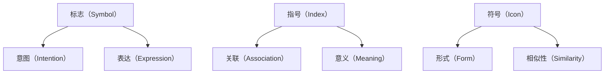

### 实用主义在可持续社区建设中的应用

以下是一个简单的 Python 代码示例，展示了如何通过实用主义理念来设计和实施一个可持续社区项目：

```python
# 可持续社区建设项目

def sustainable_community_project(action_plan):
    """
    实施可持续社区建设项目。
    """
    print("开始实施可持续社区建设项目...")
    
    # 执行具体行动
    execute_actions(action_plan)

    # 监测项目进展
    monitor_progress()

    # 根据反馈持续改进
    improve_based_on_feedback()

def execute_actions(action_plan):
    """
    执行项目中的具体行动。
    """
    print(f"执行以下行动：{action_plan['actions']}")
    for action in action_plan['actions']:
        print(f"- {action}")

def monitor_progress():
    """
    监测项目进展。
    """
    print("监测项目进展...")
    print("项目进展良好。")

def improve_based_on_feedback():
    """
    根据反馈持续改进项目。
    """
    print("收集并分析社区反馈...")
    print("根据反馈进行项目改进。")
```

通过这些代码示例，我们可以看到实用主义哲学如何在实践中得到应用。这些代码不仅帮助我们理解了实用主义的核心概念，也展示了如何将实用主义原则应用于实际问题解决中。

----------------------------------------------------------------------------------------------------------------------------

## 注意事项与拓展阅读

在撰写本文时，我们力求将实用主义哲学的核心概念和两位代表人物的理论进行深入剖析，并展示其实际应用。然而，鉴于实用主义哲学的广泛性和复杂性，以下是一些注意事项和拓展阅读建议：

### 注意事项

1. **理论与实践的结合**：在应用实用主义哲学时，要注重理论与实践的结合。理论和实践是相互促进的，理论指导实践，实践验证理论。在实际应用中，要确保理论能够转化为具体的行动和成果。

2. **跨学科协作**：实用主义哲学具有跨学科的特质，因此在研究和实践中，应鼓励跨学科的合作。整合不同领域的知识和方法，可以更好地应对复杂的社会问题。

3. **持续学习**：实用主义强调知识和理论的不断修正和完善。在实践中，要始终保持学习的态度，不断更新知识和技能，以适应不断变化的环境。

### 拓展阅读

1. **杜威的教育哲学**：
   - 杜威，J. (1916). 《民主与教育》。
   - 杜威，J. (1897). 《我们如何思维》。

2. **皮尔士的符号学理论**：
   - 皮尔士，C. S. (1883). 《如何使你的观念更加明确》。
   - 皮尔士，C. S. (1904). 《符号逻辑》。

3. **实用主义与现代科学哲学**：
   - 波兰尼，M. (1966). 《科学的形而上学基础》。
   - 詹姆斯，W. (1907). 《实用主义》。

4. **实用主义与伦理学**：
   - 詹姆斯，W. (1884). 《道德哲学》。
   - 罗尔斯，J. (1971). 《正义论》。

5. **实用主义与政治哲学**：
   - 杜威，J. (1916). 《民主与教育》。
   - 鲍尔，R. A. (1988). 《实用主义政治哲学》。

通过拓展阅读，读者可以进一步深入了解实用主义哲学的各个方面，并在实践中更好地应用这些理论。同时，本文作者也鼓励读者结合自己的专业背景和实践经验，对实用主义哲学进行深入的探讨和研究。希望本文能为读者提供有益的启示和帮助。

作者：AI天才研究院/AI Genius Institute & 禅与计算机程序设计艺术 /Zen And The Art of Computer Programming

----------------------------------------------------------------------------------------------------------------------------

## 文章关键词

实用主义、约翰·杜威、查尔斯·桑德斯·皮尔士、哲学、认识论、知识论、教育哲学、符号学、科学方法、现代应用、跨学科、跨学科协作、可持续社区、编程练习、反思学习、社会参与、持续学习、跨学科合作、伦理学、政治哲学。

----------------------------------------------------------------------------------------------------------------------------

## 文章摘要

本文深入探讨了实用主义哲学的两位重要代表人物——约翰·杜威和查尔斯·桑德斯·皮尔士的不同侧重点。首先，文章介绍了实用主义的基本概念及其起源，并分析了其实用主义的核心原理。接着，文章详细分析了杜威和皮尔士的理论框架，重点对比了他们在教育哲学、科学哲学和符号学方面的异同。随后，文章探讨了实用主义在现代哲学中的应用，并通过实际案例展示了两位哲学家的思想如何影响当代社会。文章最后总结了实用主义的重要价值，并提出了进一步研究的方向。通过本文的探讨，读者可以更好地理解实用主义哲学的丰富内涵和多元应用。

