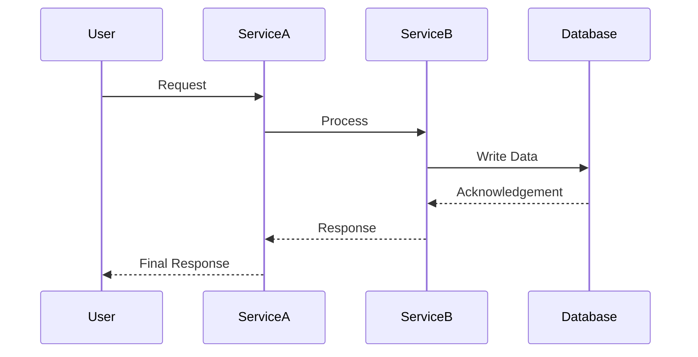

                 

构建技术硬实力：P9工程师的必经之路

### 引言

在当今快速发展的技术时代，工程师的角色和职责正在不断演变。从传统的编码任务到如今的系统架构设计、技术决策和团队领导，工程师们需要掌握更加全面的技术知识和技能。特别是对于P9级别的工程师，他们被期望能够在技术深度、项目管理能力和领导力方面有卓越的表现。本文将探讨P9工程师如何通过构建技术硬实力来实现职业发展。

P9工程师，通常是指在企业中处于高级技术管理职位的工程师，他们不仅是技术专家，还需要具备领导团队、制定战略和技术决策的能力。因此，构建技术硬实力对于P9工程师的职业发展至关重要。

#### 1.1 职业发展路径

在软件工程师的职业发展中，通常分为以下几个阶段：

##### 1.1.1 软件工程师 I 级
在这个阶段，工程师主要专注于编码工作，学习基本编程技能，理解数据结构和算法。

##### 1.1.2 软件工程师 II 级
随着工作经验的增加，工程师开始承担更多的责任，参与项目管理和代码审查。

##### 1.1.3 软件工程师 III 级
这个阶段的工程师已经具备深入的技术能力，能够在项目中担任关键角色，设计和实现复杂的系统。

#### 1.1.2 高级软件工程师的特点

高级软件工程师通常具备以下特点：

- **技术深度**：对某一领域的核心技术有深入理解。
- **项目管理能力**：能够有效地管理项目进度和资源。
- **团队协作能力**：能够与团队成员有效沟通和协作。

#### 1.2 P9工程师的角色与能力

P9工程师在企业中扮演着多重角色，他们需要具备以下能力：

- **技术决策**：能够根据业务需求制定技术方案。
- **领导团队**：具备领导力和管理能力，能够带领团队高效工作。
- **架构设计**：能够设计复杂系统的整体架构。

P9工程师所需的能力包括：

- **深厚的技术背景**：在某一领域有深入的技术知识和实践经验。
- **项目管理经验**：能够管理大型项目，协调资源。
- **领导力与沟通能力**：能够激励和带领团队，有效沟通和协调。

### 关键词

- 职业发展
- P9工程师
- 技术硬实力
- 技术深度
- 项目管理
- 领导力

### 摘要

本文将深入探讨P9工程师如何通过构建技术硬实力来实现职业发展。我们将从职业发展路径、P9工程师的角色与能力、技术基础、架构设计、性能优化、安全防护、持续集成与持续部署、领导力与职业发展、案例研究等方面进行详细分析，提供一系列实用的建议和策略，帮助P9工程师在技术领域取得更大的成功。

### 第1章 引言

在当今快速发展的技术时代，工程师的角色和职责正在不断演变。从传统的编码任务到如今的系统架构设计、技术决策和团队领导，工程师们需要掌握更加全面的技术知识和技能。特别是对于P9级别的工程师，他们被期望能够在技术深度、项目管理能力和领导力方面有卓越的表现。本文将探讨P9工程师如何通过构建技术硬实力来实现职业发展。

P9工程师，通常是指在企业中处于高级技术管理职位的工程师，他们不仅是技术专家，还需要具备领导团队、制定战略和技术决策的能力。因此，构建技术硬实力对于P9工程师的职业发展至关重要。

#### 1.1 职业发展路径

在软件工程师的职业发展中，通常分为以下几个阶段：

##### 1.1.1 软件工程师 I 级
在这个阶段，工程师主要专注于编码工作，学习基本编程技能，理解数据结构和算法。

##### 1.1.2 软件工程师 II 级
随着工作经验的增加，工程师开始承担更多的责任，参与项目管理和代码审查。

##### 1.1.3 软件工程师 III 级
这个阶段的工程师已经具备深入的技术能力，能够在项目中担任关键角色，设计和实现复杂的系统。

#### 1.1.2 高级软件工程师的特点

高级软件工程师通常具备以下特点：

- **技术深度**：对某一领域的核心技术有深入理解。
- **项目管理能力**：能够有效地管理项目进度和资源。
- **团队协作能力**：能够与团队成员有效沟通和协作。

#### 1.2 P9工程师的角色与能力

P9工程师在企业中扮演着多重角色，他们需要具备以下能力：

- **技术决策**：能够根据业务需求制定技术方案。
- **领导团队**：具备领导力和管理能力，能够带领团队高效工作。
- **架构设计**：能够设计复杂系统的整体架构。

P9工程师所需的能力包括：

- **深厚的技术背景**：在某一领域有深入的技术知识和实践经验。
- **项目管理经验**：能够管理大型项目，协调资源。
- **领导力与沟通能力**：能够激励和带领团队，有效沟通和协调。

### 关键词

- 职业发展
- P9工程师
- 技术硬实力
- 技术深度
- 项目管理
- 领导力

### 摘要

本文将深入探讨P9工程师如何通过构建技术硬实力来实现职业发展。我们将从职业发展路径、P9工程师的角色与能力、技术基础、架构设计、性能优化、安全防护、持续集成与持续部署、领导力与职业发展、案例研究等方面进行详细分析，提供一系列实用的建议和策略，帮助P9工程师在技术领域取得更大的成功。

### 第1章 引言

在当今快速发展的技术时代，工程师的角色和职责正在不断演变。从传统的编码任务到如今的系统架构设计、技术决策和团队领导，工程师们需要掌握更加全面的技术知识和技能。特别是对于P9级别的工程师，他们被期望能够在技术深度、项目管理能力和领导力方面有卓越的表现。本文将探讨P9工程师如何通过构建技术硬实力来实现职业发展。

P9工程师，通常是指在企业中处于高级技术管理职位的工程师，他们不仅是技术专家，还需要具备领导团队、制定战略和技术决策的能力。因此，构建技术硬实力对于P9工程师的职业发展至关重要。

#### 1.1 职业发展路径

在软件工程师的职业发展中，通常分为以下几个阶段：

##### 1.1.1 软件工程师 I 级
在这个阶段，工程师主要专注于编码工作，学习基本编程技能，理解数据结构和算法。

##### 1.1.2 软件工程师 II 级
随着工作经验的增加，工程师开始承担更多的责任，参与项目管理和代码审查。

##### 1.1.3 软件工程师 III 级
这个阶段的工程师已经具备深入的技术能力，能够在项目中担任关键角色，设计和实现复杂的系统。

#### 1.1.2 高级软件工程师的特点

高级软件工程师通常具备以下特点：

- **技术深度**：对某一领域的核心技术有深入理解。
- **项目管理能力**：能够有效地管理项目进度和资源。
- **团队协作能力**：能够与团队成员有效沟通和协作。

#### 1.2 P9工程师的角色与能力

P9工程师在企业中扮演着多重角色，他们需要具备以下能力：

- **技术决策**：能够根据业务需求制定技术方案。
- **领导团队**：具备领导力和管理能力，能够带领团队高效工作。
- **架构设计**：能够设计复杂系统的整体架构。

P9工程师所需的能力包括：

- **深厚的技术背景**：在某一领域有深入的技术知识和实践经验。
- **项目管理经验**：能够管理大型项目，协调资源。
- **领导力与沟通能力**：能够激励和带领团队，有效沟通和协调。

### 关键词

- 职业发展
- P9工程师
- 技术硬实力
- 技术深度
- 项目管理
- 领导力

### 摘要

本文将深入探讨P9工程师如何通过构建技术硬实力来实现职业发展。我们将从职业发展路径、P9工程师的角色与能力、技术基础、架构设计、性能优化、安全防护、持续集成与持续部署、领导力与职业发展、案例研究等方面进行详细分析，提供一系列实用的建议和策略，帮助P9工程师在技术领域取得更大的成功。

### 第1章 引言

在当今快速发展的技术时代，工程师的角色和职责正在不断演变。从传统的编码任务到如今的系统架构设计、技术决策和团队领导，工程师们需要掌握更加全面的技术知识和技能。特别是对于P9级别的工程师，他们被期望能够在技术深度、项目管理能力和领导力方面有卓越的表现。本文将探讨P9工程师如何通过构建技术硬实力来实现职业发展。

P9工程师，通常是指在企业中处于高级技术管理职位的工程师，他们不仅是技术专家，还需要具备领导团队、制定战略和技术决策的能力。因此，构建技术硬实力对于P9工程师的职业发展至关重要。

#### 1.1 职业发展路径

在软件工程师的职业发展中，通常分为以下几个阶段：

##### 1.1.1 软件工程师 I 级
在这个阶段，工程师主要专注于编码工作，学习基本编程技能，理解数据结构和算法。

##### 1.1.2 软件工程师 II 级
随着工作经验的增加，工程师开始承担更多的责任，参与项目管理和代码审查。

##### 1.1.3 软件工程师 III 级
这个阶段的工程师已经具备深入的技术能力，能够在项目中担任关键角色，设计和实现复杂的系统。

#### 1.1.2 高级软件工程师的特点

高级软件工程师通常具备以下特点：

- **技术深度**：对某一领域的核心技术有深入理解。
- **项目管理能力**：能够有效地管理项目进度和资源。
- **团队协作能力**：能够与团队成员有效沟通和协作。

#### 1.2 P9工程师的角色与能力

P9工程师在企业中扮演着多重角色，他们需要具备以下能力：

- **技术决策**：能够根据业务需求制定技术方案。
- **领导团队**：具备领导力和管理能力，能够带领团队高效工作。
- **架构设计**：能够设计复杂系统的整体架构。

P9工程师所需的能力包括：

- **深厚的技术背景**：在某一领域有深入的技术知识和实践经验。
- **项目管理经验**：能够管理大型项目，协调资源。
- **领导力与沟通能力**：能够激励和带领团队，有效沟通和协调。

### 关键词

- 职业发展
- P9工程师
- 技术硬实力
- 技术深度
- 项目管理
- 领导力

### 摘要

本文将深入探讨P9工程师如何通过构建技术硬实力来实现职业发展。我们将从职业发展路径、P9工程师的角色与能力、技术基础、架构设计、性能优化、安全防护、持续集成与持续部署、领导力与职业发展、案例研究等方面进行详细分析，提供一系列实用的建议和策略，帮助P9工程师在技术领域取得更大的成功。

### 第1章 引言

在当今快速发展的技术时代，工程师的角色和职责正在不断演变。从传统的编码任务到如今的系统架构设计、技术决策和团队领导，工程师们需要掌握更加全面的技术知识和技能。特别是对于P9级别的工程师，他们被期望能够在技术深度、项目管理能力和领导力方面有卓越的表现。本文将探讨P9工程师如何通过构建技术硬实力来实现职业发展。

P9工程师，通常是指在企业中处于高级技术管理职位的工程师，他们不仅是技术专家，还需要具备领导团队、制定战略和技术决策的能力。因此，构建技术硬实力对于P9工程师的职业发展至关重要。

#### 1.1 职业发展路径

在软件工程师的职业发展中，通常分为以下几个阶段：

##### 1.1.1 软件工程师 I 级
在这个阶段，工程师主要专注于编码工作，学习基本编程技能，理解数据结构和算法。

##### 1.1.2 软件工程师 II 级
随着工作经验的增加，工程师开始承担更多的责任，参与项目管理和代码审查。

##### 1.1.3 软件工程师 III 级
这个阶段的工程师已经具备深入的技术能力，能够在项目中担任关键角色，设计和实现复杂的系统。

#### 1.1.2 高级软件工程师的特点

高级软件工程师通常具备以下特点：

- **技术深度**：对某一领域的核心技术有深入理解。
- **项目管理能力**：能够有效地管理项目进度和资源。
- **团队协作能力**：能够与团队成员有效沟通和协作。

#### 1.2 P9工程师的角色与能力

P9工程师在企业中扮演着多重角色，他们需要具备以下能力：

- **技术决策**：能够根据业务需求制定技术方案。
- **领导团队**：具备领导力和管理能力，能够带领团队高效工作。
- **架构设计**：能够设计复杂系统的整体架构。

P9工程师所需的能力包括：

- **深厚的技术背景**：在某一领域有深入的技术知识和实践经验。
- **项目管理经验**：能够管理大型项目，协调资源。
- **领导力与沟通能力**：能够激励和带领团队，有效沟通和协调。

### 关键词

- 职业发展
- P9工程师
- 技术硬实力
- 技术深度
- 项目管理
- 领导力

### 摘要

本文将深入探讨P9工程师如何通过构建技术硬实力来实现职业发展。我们将从职业发展路径、P9工程师的角色与能力、技术基础、架构设计、性能优化、安全防护、持续集成与持续部署、领导力与职业发展、案例研究等方面进行详细分析，提供一系列实用的建议和策略，帮助P9工程师在技术领域取得更大的成功。

### 第2章 技术基础

作为P9工程师，构建坚实的编程语言基础是不可或缺的。在本章中，我们将重点介绍C语言和Python语言，这两种语言因其灵活性和强大的功能而被广泛应用于各种软件开发场景。

#### 2.1 编程语言

##### 2.1.1 C语言

C语言是一种高性能的编程语言，它具有强大的功能和广泛的适用性。以下是C语言的一些关键特点：

- **高性能**：C语言编译后的程序可以直接运行在硬件上，因此执行效率很高。
- **灵活性**：C语言提供了丰富的数据类型和操作符，使得开发者可以灵活地处理各种数据。
- **底层访问**：C语言允许开发者直接访问硬件资源，如内存管理，文件系统等。

###### 2.1.1.1 基础语法

C语言的基础语法包括：

- **变量声明和初始化**：变量是存储数据的容器。在C语言中，声明变量时需要指定数据类型。
- **控制结构**：包括条件语句（如if-else）、循环语句（如for、while）等，用于控制程序的执行流程。
- **函数**：C语言中的函数是执行特定任务的代码块。函数可以接受参数，并返回结果。

以下是一个简单的C语言示例，用于打印“Hello, World!”：

```c
#include <stdio.h>

int main() {
    printf("Hello, World!\n");
    return 0;
}
```

###### 2.1.1.2 数据结构与算法

C语言在数据结构和算法方面提供了丰富的支持：

- **数组**：用于存储一系列相同类型的元素。
- **结构体**：用于创建具有不同类型成员的复杂数据类型。
- **指针**：用于存储和管理内存地址，是C语言中最强大的特性之一。
- **链表**：一种基础的数据结构，用于在内存中动态地分配和删除元素。

以下是一个简单的链表实现的伪代码：

```plaintext
Node {
    int data;
    Node* next;
}

void insert(Node** head, int data) {
    Node* newNode = (Node*)malloc(sizeof(Node));
    newNode->data = data;
    newNode->next = *head;
    *head = newNode;
}
```

##### 2.1.2 Python语言

Python是一种高级、动态类型的编程语言，以其简洁明了的语法和强大的库支持而广受欢迎。以下是Python的一些关键特点：

- **易于学习**：Python的语法简洁，易于阅读和理解。
- **广泛的应用场景**：Python在数据科学、机器学习、网络开发、自动化等方面都有广泛应用。
- **丰富的库**：Python拥有丰富的标准库和第三方库，如NumPy、Pandas、TensorFlow等。

###### 2.1.2.1 基础语法

Python的基础语法包括：

- **变量**：Python中的变量不需要显式声明类型，变量在赋值时自动推断类型。
- **控制结构**：包括if-else条件语句、for和while循环等。
- **函数**：Python中的函数使用def关键字定义，可以接受参数并返回结果。

以下是一个简单的Python示例，用于打印“Hello, World!”：

```python
print("Hello, World!")
```

###### 2.1.2.2 库与框架

Python拥有丰富的库和框架，可以用于各种任务：

- **标准库**：包括文件处理、网络通信、数据处理等功能。
- **第三方库**：如NumPy（用于数值计算）、Pandas（用于数据处理）、TensorFlow（用于机器学习）等。
- **框架**：如Django（用于Web开发）、Flask（用于轻量级Web开发）等。

#### 2.2 操作系统

操作系统是计算机系统的核心组成部分，负责管理硬件资源和提供用户接口。在本节中，我们将介绍Linux系统和Windows系统的基本知识。

##### 2.2.1 Linux系统

Linux是一种类Unix操作系统，以其开源、稳定和安全性而闻名。以下是Linux系统的一些基本知识：

- **系统管理**：包括用户管理、文件权限设置、进程管理等。
- **网络配置**：包括IP地址设置、网络配置文件（如ifcfg-eth0）等。

以下是一个简单的Linux命令示例，用于查看系统信息：

```bash
# 查看系统版本
uname -a

# 查看当前进程
ps aux
```

##### 2.2.2 Windows系统

Windows是一种图形界面的操作系统，广泛用于个人计算机和企业服务器。以下是Windows系统的一些基本知识：

- **系统管理**：包括用户管理、文件权限设置、服务管理等。
- **网络配置**：包括IP地址设置、网络配置工具（如ipconfig）等。

以下是一个简单的Windows命令示例，用于查看系统信息：

```powershell
# 查看系统版本
wmic os get caption

# 查看当前进程
tasklist
```

#### 2.3 数据库

数据库是存储和检索数据的重要工具。在本节中，我们将介绍关系型数据库（如MySQL和PostgreSQL）和非关系型数据库（如MongoDB和Redis）的基本知识。

##### 2.3.1 关系型数据库

关系型数据库是一种基于表格结构存储数据的数据库管理系统。以下是关系型数据库的一些基本知识：

- **MySQL**：是一种开源的关系型数据库管理系统，以其高性能和可靠性而闻名。
- **PostgreSQL**：是一种开源的关系型数据库管理系统，具有丰富的功能和高扩展性。

以下是一个简单的MySQL查询示例，用于创建数据库和表：

```sql
# 创建数据库
CREATE DATABASE my_database;

# 创建表
CREATE TABLE my_table (
    id INT PRIMARY KEY,
    name VARCHAR(255)
);
```

##### 2.3.2 非关系型数据库

非关系型数据库是一种不基于表格结构存储数据的数据库管理系统。以下是几种常见的非关系型数据库：

- **MongoDB**：是一种文档型数据库，适用于存储大量非结构化数据。
- **Redis**：是一种键值存储数据库，适用于缓存和数据共享。

以下是一个简单的MongoDB查询示例，用于插入和查询数据：

```javascript
// 插入数据
db.my_collection.insertOne({ name: "John", age: 30 });

// 查询数据
db.my_collection.find({ name: "John" });
```

### 总结

在本章中，我们介绍了C语言和Python语言的基础语法、数据结构与算法，以及Linux系统和Windows系统的基本知识。此外，我们还介绍了关系型数据库（如MySQL和PostgreSQL）和非关系型数据库（如MongoDB和Redis）的基本知识。掌握这些技术基础将为P9工程师在技术领域的发展打下坚实的基础。

### 第2章 技术基础

作为P9工程师，构建坚实的编程语言基础是不可或缺的。在本章中，我们将重点介绍C语言和Python语言，这两种语言因其灵活性和强大的功能而被广泛应用于各种软件开发场景。

#### 2.1 编程语言

##### 2.1.1 C语言

C语言是一种高性能的编程语言，它具有强大的功能和广泛的适用性。以下是C语言的一些关键特点：

- **高性能**：C语言编译后的程序可以直接运行在硬件上，因此执行效率很高。
- **灵活性**：C语言提供了丰富的数据类型和操作符，使得开发者可以灵活地处理各种数据。
- **底层访问**：C语言允许开发者直接访问硬件资源，如内存管理，文件系统等。

###### 2.1.1.1 基础语法

C语言的基础语法包括：

- **变量声明和初始化**：变量是存储数据的容器。在C语言中，声明变量时需要指定数据类型。
- **控制结构**：包括条件语句（如if-else）、循环语句（如for、while）等，用于控制程序的执行流程。
- **函数**：C语言中的函数是执行特定任务的代码块。函数可以接受参数，并返回结果。

以下是一个简单的C语言示例，用于打印“Hello, World!”：

```c
#include <stdio.h>

int main() {
    printf("Hello, World!\n");
    return 0;
}
```

###### 2.1.1.2 数据结构与算法

C语言在数据结构和算法方面提供了丰富的支持：

- **数组**：用于存储一系列相同类型的元素。
- **结构体**：用于创建具有不同类型成员的复杂数据类型。
- **指针**：用于存储和管理内存地址，是C语言中最强大的特性之一。
- **链表**：一种基础的数据结构，用于在内存中动态地分配和删除元素。

以下是一个简单的链表实现的伪代码：

```plaintext
Node {
    int data;
    Node* next;
}

void insert(Node** head, int data) {
    Node* newNode = (Node*)malloc(sizeof(Node));
    newNode->data = data;
    newNode->next = *head;
    *head = newNode;
}
```

##### 2.1.2 Python语言

Python是一种高级、动态类型的编程语言，以其简洁明了的语法和强大的库支持而广受欢迎。以下是Python的一些关键特点：

- **易于学习**：Python的语法简洁，易于阅读和理解。
- **广泛的应用场景**：Python在数据科学、机器学习、网络开发、自动化等方面都有广泛应用。
- **丰富的库**：Python拥有丰富的标准库和第三方库，如NumPy、Pandas、TensorFlow等。

###### 2.1.2.1 基础语法

Python的基础语法包括：

- **变量**：Python中的变量不需要显式声明类型，变量在赋值时自动推断类型。
- **控制结构**：包括if-else条件语句、for和while循环等。
- **函数**：Python中的函数使用def关键字定义，可以接受参数并返回结果。

以下是一个简单的Python示例，用于打印“Hello, World!”：

```python
print("Hello, World!")
```

###### 2.1.2.2 库与框架

Python拥有丰富的库和框架，可以用于各种任务：

- **标准库**：包括文件处理、网络通信、数据处理等功能。
- **第三方库**：如NumPy（用于数值计算）、Pandas（用于数据处理）、TensorFlow（用于机器学习）等。
- **框架**：如Django（用于Web开发）、Flask（用于轻量级Web开发）等。

#### 2.2 操作系统

操作系统是计算机系统的核心组成部分，负责管理硬件资源和提供用户接口。在本节中，我们将介绍Linux系统和Windows系统的基本知识。

##### 2.2.1 Linux系统

Linux是一种类Unix操作系统，以其开源、稳定和安全性而闻名。以下是Linux系统的一些基本知识：

- **系统管理**：包括用户管理、文件权限设置、进程管理等。
- **网络配置**：包括IP地址设置、网络配置文件（如ifcfg-eth0）等。

以下是一个简单的Linux命令示例，用于查看系统信息：

```bash
# 查看系统版本
uname -a

# 查看当前进程
ps aux
```

##### 2.2.2 Windows系统

Windows是一种图形界面的操作系统，广泛用于个人计算机和企业服务器。以下是Windows系统的一些基本知识：

- **系统管理**：包括用户管理、文件权限设置、服务管理等。
- **网络配置**：包括IP地址设置、网络配置工具（如ipconfig）等。

以下是一个简单的Windows命令示例，用于查看系统信息：

```powershell
# 查看系统版本
wmic os get caption

# 查看当前进程
tasklist
```

#### 2.3 数据库

数据库是存储和检索数据的重要工具。在本节中，我们将介绍关系型数据库（如MySQL和PostgreSQL）和非关系型数据库（如MongoDB和Redis）的基本知识。

##### 2.3.1 关系型数据库

关系型数据库是一种基于表格结构存储数据的数据库管理系统。以下是关系型数据库的一些基本知识：

- **MySQL**：是一种开源的关系型数据库管理系统，以其高性能和可靠性而闻名。
- **PostgreSQL**：是一种开源的关系型数据库管理系统，具有丰富的功能和高扩展性。

以下是一个简单的MySQL查询示例，用于创建数据库和表：

```sql
# 创建数据库
CREATE DATABASE my_database;

# 创建表
CREATE TABLE my_table (
    id INT PRIMARY KEY,
    name VARCHAR(255)
);
```

##### 2.3.2 非关系型数据库

非关系型数据库是一种不基于表格结构存储数据的数据库管理系统。以下是几种常见的非关系型数据库：

- **MongoDB**：是一种文档型数据库，适用于存储大量非结构化数据。
- **Redis**：是一种键值存储数据库，适用于缓存和数据共享。

以下是一个简单的MongoDB查询示例，用于插入和查询数据：

```javascript
// 插入数据
db.my_collection.insertOne({ name: "John", age: 30 });

// 查询数据
db.my_collection.find({ name: "John" });
```

### 总结

在本章中，我们介绍了C语言和Python语言的基础语法、数据结构与算法，以及Linux系统和Windows系统的基本知识。此外，我们还介绍了关系型数据库（如MySQL和PostgreSQL）和非关系型数据库（如MongoDB和Redis）的基本知识。掌握这些技术基础将为P9工程师在技术领域的发展打下坚实的基础。

### 第3章 架构设计

在现代软件开发中，架构设计是确保系统可扩展性、可靠性和性能的关键。对于P9级别的工程师，他们需要具备深入理解架构设计原则的能力，以及能够根据业务需求设计高效、可维护的架构。本章将重点讨论微服务架构，包括其概述、优势与挑战、设计模式以及服务拆分与整合的策略。

#### 3.1 微服务架构

##### 3.1.1 微服务概述

微服务架构（Microservices Architecture）是一种基于组件的软件架构风格，其核心思想是将应用程序分解为多个小的、独立部署的、具有业务功能的服务单元。每个微服务负责一个特定的业务功能，可以通过轻量级的通信协议（如HTTP/REST、gRPC）相互通信。以下是微服务架构的一些特点：

- **独立性**：每个微服务都是一个独立的部署单元，可以独立开发和部署，不会影响其他服务。
- **去中心化**：服务之间没有全局状态，每个服务都可以独立运行，不存在单点故障。
- **自动化**：微服务支持自动化部署、扩展和监控，提高了系统的灵活性和可靠性。
- **可伸缩性**：可以根据业务需求独立扩展某个服务，而不会影响其他服务。

##### 3.1.1.1 微服务的优势与挑战

微服务架构的优势包括：

- **可扩展性**：可以独立扩展每个服务的实例，提高系统的吞吐量。
- **弹性**：某个服务发生故障时，不会影响其他服务的正常运行。
- **技术多样性**：可以采用不同的编程语言、数据库和技术栈来构建每个服务。
- **快速迭代**：每个服务可以独立迭代和更新，加快了开发速度。

然而，微服务架构也带来了一些挑战：

- **复杂性**：服务之间的通信和协调变得更加复杂，需要设计良好的API和管理策略。
- **分布式事务**：在微服务架构中实现分布式事务较为困难，需要额外的机制（如最终一致性）。
- **监控与维护**：需要监控和整合多个服务，增加了维护的复杂性。

##### 3.1.1.2 微服务的设计模式

在设计微服务架构时，可以使用以下几种常见的设计模式：

- **服务拆分**：根据业务功能将应用程序拆分成多个独立的服务。
- **服务发现**：服务启动时注册到服务发现组件，其他服务可以通过服务发现组件获取服务地址。
- **API网关**：作为服务的统一入口，负责路由和请求聚合，减少服务之间的直接通信。
- **分布式追踪**：通过分布式追踪系统（如Zipkin、Jaeger）来跟踪请求在各个服务之间的执行路径。
- **配置管理**：使用集中式配置管理服务来管理各个服务的配置信息。

#### 3.1.2 服务拆分与整合

服务拆分是微服务架构的核心任务之一。以下是一些常用的服务拆分策略：

- **按业务领域**：根据业务领域将应用程序拆分成多个服务，每个服务负责一个业务领域。
- **按功能模块**：根据应用程序的功能模块将服务拆分，每个服务负责一个功能模块。
- **按数据访问模式**：根据数据访问模式将服务拆分，例如，将读写分离的服务分开部署。

在服务整合方面，需要考虑以下策略：

- **服务代理**：使用服务代理来简化服务之间的通信，代理可以负责路由、负载均衡和请求聚合。
- **API文档**：提供详细的API文档，方便开发者理解和使用各个服务。
- **服务治理**：建立服务治理机制，包括服务版本管理、服务监控和故障处理。

#### 3.1.3 Mermaid流程图

为了更好地理解微服务架构的核心概念和流程，我们可以使用Mermaid流程图来表示服务之间的关系。以下是一个简单的Mermaid流程图示例：



这个流程图展示了用户请求、服务A处理请求、服务B写入数据库、数据库确认写入以及最终返回结果的整个流程。

### 总结

在本章中，我们介绍了微服务架构的概述、优势与挑战、设计模式以及服务拆分与整合的策略。通过理解这些概念和策略，P9工程师可以更有效地设计和管理复杂的分布式系统。掌握微服务架构的实践和最佳经验，将有助于他们在技术领域取得更大的成功。

### 第4章 性能优化

在系统架构设计完成之后，性能优化是确保系统能够稳定运行、高效响应的关键步骤。性能优化不仅涉及技术层面的调整，还包括对系统架构、代码、资源利用等多方面的考量。本章将深入探讨系统性能监控、性能调优技巧以及压力测试的重要性。

#### 4.1 系统性能监控

系统性能监控是确保系统稳定运行的基础。通过监控系统性能指标，可以及时发现并解决性能问题。以下是几种常见的监控工具：

##### 4.1.1 Prometheus

Prometheus是一种开源的监控解决方案，具有高可用性、灵活性和可扩展性。Prometheus的基本组件包括：

- **Prometheus服务器**：负责收集目标（如应用、服务）的指标数据。
- **PushGateway**：用于接收临时性或间歇性目标的指标数据。
- **Exporter**：用于从目标上收集指标数据并暴露为HTTP服务。

以下是一个简单的Prometheus配置示例，用于监控HTTP服务的响应时间和错误率：

```yaml
scrape_configs:
  - job_name: 'http'
    static_configs:
      - targets: ['example.com:9090']
```

##### 4.1.1.1 Grafana

Grafana是一种开源的监控和仪表板工具，可以与Prometheus等数据源集成，提供可视化监控功能。以下是一个简单的Grafana配置示例，用于创建一个HTTP响应时间的仪表板：

```json
{
  "dashboard": {
    "title": "HTTP Performance",
    "rows": [
      {
        "title": "Response Time",
        "panels": [
          {
            "type": "timeseries",
            "title": "HTTP Response Time",
            "datasource": "prometheus",
            "yaxis": {
              "type": "line",
              "logBase": 1
            },
            "data": [
              {
                "target": "http_response_time",
                "type": "timeseries"
              }
            ]
          }
        ]
      },
      {
        "title": "Error Rate",
        "panels": [
          {
            "type": "gauge",
            "title": "HTTP Error Rate",
            "datasource": "prometheus",
            "targets": [
              {
                "target": "http_request_errors{status_code!=""}"
              }
            ]
          }
        ]
      }
    ]
  }
}
```

#### 4.1.2 性能调优技巧

性能调优是一个持续的过程，需要根据系统的实际运行情况不断调整。以下是一些常用的性能调优技巧：

##### 4.1.2.1 缓存策略

缓存策略是提高系统性能的有效手段。通过将频繁访问的数据存储在内存中，可以减少对后端系统的访问压力。以下是一些常用的缓存策略：

- **内存缓存**：如Redis、Memcached，适用于小数据量的快速访问。
- **分布式缓存**：如Consul、Zookeeper，适用于大规模集群环境。
- **对象缓存**：如Ehcache、Hibernate Cache，适用于Java应用。

##### 4.1.2.2 压力测试

压力测试（Stress Testing）是评估系统在极端负载下的性能和稳定性。通过模拟高并发、大数据量的访问，可以发现系统可能存在的性能瓶颈。以下是一些常见的压力测试工具：

- **JMeter**：适用于Web应用的性能测试。
- **LoadRunner**：适用于各种类型应用的性能测试。
- **Gatling**：适用于Web应用的性能测试。

以下是一个简单的JMeter脚本示例，用于模拟并发用户访问：

```xml
<ThreadGroup name="HTTP Load Test" virtualUsers="100" startTime="00:00:00" endTime="00:05:00" delay="00:00:05">
  <HTTPSamplerProxyguuid="5904" name="HTTP Request" rfile="HTTP Request" testname="HTTP Request Test" numThreads="100" loopCount="1" enablingString="" usageType="0" housedInString="" housedInUUID="5902">
    <elementProp type="HTTP" guuid="5905" name="HTTP Request">
      <stringProp name=" Laudynumber="5906" guuid="5907">http://example.com</stringProp>
    </elementProp>
  </HTTPSamplerProxy>
</ThreadGroup>
```

#### 4.1.3 性能优化流程

性能优化的流程通常包括以下步骤：

1. **问题定位**：通过监控工具发现性能瓶颈。
2. **性能分析**：使用分析工具对系统进行性能分析，找出具体的瓶颈。
3. **调整配置**：根据分析结果调整系统配置，如线程数、连接池大小等。
4. **代码优化**：优化代码，减少不必要的计算和资源消耗。
5. **压力测试**：对优化后的系统进行压力测试，验证性能提升。

### 总结

在本章中，我们介绍了系统性能监控的重要性，包括使用Prometheus和Grafana进行监控，以及性能调优技巧和压力测试的方法。掌握这些性能优化技术，可以帮助P9工程师确保系统在高负载下的稳定性和高效性，从而满足业务需求。

### 第5章 安全防护

在现代软件开发中，安全性是确保系统正常运行和数据安全的关键。对于P9工程师，他们不仅需要掌握编程和架构设计的能力，还必须了解常见的安全威胁和防护措施。本章将深入探讨安全基础、常见攻击手段、安全策略与措施，以及访问控制和数据加密等核心概念。

#### 5.1 安全基础

安全性是系统架构中不可或缺的一部分。以下是安全基础的一些核心概念：

- **安全模型**：包括访问控制、身份验证、审计等。
- **安全漏洞**：是指系统中的弱点，可能会被攻击者利用。
- **威胁模型**：是对系统中潜在威胁的识别和分类。

#### 5.2 常见攻击手段

了解常见的攻击手段对于构建安全系统至关重要。以下是一些常见的安全威胁：

- **SQL注入**：攻击者通过在输入字段中注入SQL代码，执行非法查询。
  ```sql
  SELECT * FROM users WHERE username = 'admin' AND password = '123456'; -- AND '1'='1'
  ```
- **跨站脚本攻击（XSS）**：攻击者通过在网页中注入恶意脚本，窃取用户信息或执行恶意操作。
  ```html
  " />
  ```

#### 5.3 安全策略与措施

为了保护系统免受攻击，需要采取一系列安全策略和措施。以下是一些关键的安全措施：

- **访问控制**：通过身份验证和权限控制，确保只有授权用户可以访问系统资源。
  ```python
  if user.role == 'admin':
      # 允许访问
  else:
      # 拒绝访问
  ```
- **数据加密**：对敏感数据进行加密存储和传输，防止数据泄露。
  ```python
  from Crypto.Cipher import AES
  cipher = AES.new(key, AES.MODE_CBC)
  encrypted_text = cipher.encrypt(plaintext)
  ```
- **安全审计**：记录系统中的操作日志，以便在发生安全事件时进行审计和追踪。
  ```bash
  auditctl -w /var/log/secure -p x -k example-audit-rule
  ```

#### 5.4 访问控制

访问控制是确保系统安全性的核心机制。以下是一些访问控制的方法：

- **基于角色的访问控制（RBAC）**：根据用户角色来分配权限。
  ```python
  def check_permission(user, resource):
      if user.role == 'admin':
          return True
      if user.role == 'user' and resource == 'read':
          return True
      return False
  ```

- **基于属性的访问控制（ABAC）**：根据用户的属性（如时间、位置等）来分配权限。
  ```python
  def check_permission(user, resource, time):
      if user.role == 'admin':
          return True
      if user.role == 'user' and time.hour >= 8 and time.hour <= 18:
          return True
      return False
  ```

#### 5.5 数据加密

数据加密是保护数据安全的重要手段。以下是一些常见的加密方法：

- **对称加密**：使用相同的密钥进行加密和解密。
  ```python
  from Crypto.Cipher import AES
  key = b'mysecretkey123'
  cipher = AES.new(key, AES.MODE_CBC)
  ciphertext = cipher.encrypt(plaintext)
  ```

- **非对称加密**：使用公钥和私钥进行加密和解密。
  ```python
  from Crypto.PublicKey import RSA
  key = RSA.generate(2048)
  public_key = key.publickey()
  encrypted_text = public_key.encrypt(plaintext, 32)
  ```

#### 5.6 安全测试

安全测试是确保系统安全的最后一步。以下是一些常见的安全测试方法：

- **渗透测试**：模拟攻击者进行攻击，发现系统中的漏洞。
  ```bash
  nmap -sV example.com
  ```

- **漏洞扫描**：使用工具扫描系统中的漏洞。
  ```bash
  openssh-vuln.sh
  ```

- **代码审计**：检查代码中的安全漏洞。
  ```bash
  find . -name "*.java" -exec ajt -q \;
  ```

### 总结

在本章中，我们探讨了安全基础、常见攻击手段、安全策略与措施，以及访问控制和数据加密等核心概念。掌握这些安全知识，将帮助P9工程师构建更加安全可靠的系统。

### 第6章 持续集成与持续部署

持续集成（Continuous Integration，CI）和持续部署（Continuous Deployment，CD）是现代软件开发中不可或缺的流程，它们能够提高开发效率、减少错误、加快产品迭代速度。本章将详细介绍持续集成和持续部署的流程、工具选择、自动化测试以及部署策略。

#### 6.1 持续集成

持续集成是一种开发实践，旨在通过频繁地将代码合并到主干分支，以减少错误和提高代码质量。以下是持续集成的基本流程：

##### 6.1.1 持续集成流程

1. **代码提交**：开发人员将代码提交到版本控制系统。
2. **构建**：构建工具（如Jenkins、GitLab CI）自动触发构建过程，编译代码并运行单元测试。
3. **测试**：构建过程中执行自动化测试，确保代码变更不会破坏现有功能。
4. **反馈**：测试结果通过邮件、通知等渠道反馈给开发人员，以便及时修复问题。

##### 6.1.1.1 版本控制系统

版本控制系统（如Git）是持续集成的基础。以下是Git的基本操作：

- **克隆仓库**：从远程仓库克隆一个新的本地仓库。
  ```bash
  git clone https://github.com/user/repository.git
  ```
- **提交变更**：将代码变更提交到仓库。
  ```bash
  git add .
  git commit -m "Update README.md"
  ```
- **推送变更**：将本地仓库的变更推送至远程仓库。
  ```bash
  git push origin master
  ```

##### 6.1.1.2 构建工具

构建工具负责编译代码、运行测试和构建软件包。以下是几种常见的构建工具：

- **Jenkins**：是一种开源的持续集成服务器，支持多种插件和构建策略。
- **GitLab CI**：是GitLab内置的持续集成服务，可以通过YAML文件定义构建过程。

以下是一个简单的GitLab CI配置示例：

```yaml
stages:
  - build
  - test
  - deploy

build:
  stage: build
  script:
    - echo "Building the application..."
    - mvn clean package

test:
  stage: test
  script:
    - echo "Running tests..."
    - mvn test

deploy:
  stage: deploy
  script:
    - echo "Deploying the application..."
    - mvn install
```

#### 6.1.2 自动化测试

自动化测试是持续集成的重要组成部分。通过自动化测试，可以确保代码变更不会影响现有功能。以下是几种常见的自动化测试类型：

- **单元测试**：针对单个模块或函数进行测试，确保其正确性。
- **集成测试**：测试模块之间的交互和集成，确保系统整体功能的正确性。
- **端到端测试**：模拟用户操作，确保系统的可用性和稳定性。

#### 6.2 持续部署

持续部署是在持续集成的基础上，通过自动化流程将代码部署到生产环境。以下是持续部署的基本流程：

##### 6.2.1 持续部署流程

1. **代码库更新**：将最新的代码从版本控制系统拉取到本地。
2. **构建**：使用构建工具编译代码和运行测试。
3. **环境准备**：准备部署环境，如配置数据库、部署服务器等。
4. **部署**：将构建结果部署到生产环境，可以是手动执行或自动化执行。
5. **监控**：监控部署后的系统性能和稳定性。

##### 6.2.1.1 部署策略

部署策略决定了如何将代码部署到生产环境。以下是几种常见的部署策略：

- **蓝绿部署**：在现有生产环境（蓝色）和新环境（绿色）之间切换，逐步将流量转移到新环境。
- **灰度发布**：将新代码部署到部分用户，逐步扩大范围，确保稳定后再全量上线。
- **滚动更新**：逐个实例更新，确保服务可用性。

##### 6.2.1.2 部署工具

部署工具负责执行部署任务，以下是几种常见的部署工具：

- **Docker**：用于容器化应用，方便部署和移植。
- **Kubernetes**：用于自动化部署、扩展和管理容器化应用。
- **Ansible**：用于自动化部署和管理服务器。

以下是一个简单的Ansible部署脚本示例：

```yaml
- hosts: webservers
  become: yes
  tasks:
    - name: Install Nginx
      apt: name=nginx state=present

    - name: Copy Nginx configuration
      copy: src=nginx.conf dest=/etc/nginx/nginx.conf

    - name: Start Nginx service
      service: name=nginx state=started
```

### 总结

在本章中，我们详细介绍了持续集成和持续部署的流程、工具选择、自动化测试以及部署策略。通过掌握这些流程和工具，P9工程师可以显著提高开发效率、减少错误，并确保系统的高可用性和稳定性。

### 第7章 领导力与职业发展

作为P9工程师，不仅在技术领域需要不断深耕，同时还需要具备出色的领导力和职业发展能力。本章将重点讨论领导力的培养、团队管理、职业发展策略以及晋升路径分析。

#### 7.1 领导力培养

领导力是一个多面的能力，包括但不限于沟通能力、决策能力、激励能力等。以下是培养领导力的几个关键步骤：

##### 7.1.1 领导风格

不同的领导风格适用于不同的情境和团队成员。以下是一些常见的领导风格：

- **参与型领导**：鼓励团队成员参与决策过程，提高团队凝聚力和创造力。
  ```mermaid
  graph TD
  A[参与型领导] --> B[团队参与决策]
  B --> C[提高团队凝聚力]
  B --> D[增加创造力]
  ```

- **指导型领导**：提供明确的指导和期望，确保团队成员明确任务和目标。
  ```mermaid
  graph TD
  A[指导型领导] --> B[明确任务目标]
  B --> C[提高效率]
  B --> D[确保工作质量]
  ```

##### 7.1.2 团队管理

团队管理是领导力的重要组成部分，以下是一些关键技巧：

- **成员选拔**：根据项目需求和团队成员的技能，合理分配任务。
  ```mermaid
  graph TD
  A[成员选拔] --> B[项目需求分析]
  B --> C[技能匹配]
  B --> D[任务分配]
  ```

- **激励与激励**：通过认可和奖励来激励团队成员，提高工作动力。
  ```mermaid
  graph TD
  A[激励与激励] --> B[认可与奖励]
  B --> C[提高工作动力]
  B --> D[增强团队凝聚力]
  ```

#### 7.1.3 职业发展策略

职业发展是一个长期的过程，需要明确的规划和不断的努力。以下是一些职业发展策略：

##### 7.2.1 职业规划

职业规划是职业发展的第一步，以下是一些职业规划的关键步骤：

- **职业目标设定**：明确短期和长期职业目标，如晋升到更高的职位、成为技术专家等。
  ```mermaid
  graph TD
  A[职业目标设定] --> B[短期目标]
  B --> C[长期目标]
  ```

- **能力提升路径**：制定提升个人能力的学习和发展计划，如参加培训课程、阅读专业书籍等。
  ```mermaid
  graph TD
  A[能力提升路径] --> B[培训课程]
  B --> C[阅读专业书籍]
  ```

##### 7.2.2 晋升路径分析

晋升路径分析是职业规划的重要环节，以下是一些晋升路径的分析方法：

- **技术晋升**：通过不断学习和实践，提升专业技能，争取更高的职位。
  ```mermaid
  graph TD
  A[技术晋升] --> B[专业技能提升]
  B --> C[争取更高职位]
  ```

- **管理晋升**：通过领导力培养和团队管理经验，争取担任管理职位。
  ```mermaid
  graph TD
  A[管理晋升] --> B[领导力培养]
  B --> C[团队管理经验]
  ```

### 总结

在本章中，我们探讨了领导力的培养、团队管理、职业发展策略以及晋升路径分析。通过理解这些概念和策略，P9工程师可以更好地提升自己的领导力和职业发展能力，从而在技术领域取得更大的成功。

### 第8章 案例研究

在本章中，我们将通过一个真实的案例研究，展示如何在实际项目中应用P9工程师所需的各项技能，包括技术基础、架构设计、性能优化、安全防护、持续集成与持续部署等。这个案例研究将提供一个完整的视角，从项目背景到技术方案解析，再到项目成果与经验总结，帮助读者理解P9工程师在项目中的实际工作。

#### 8.1 案例概述

案例研究的项目是一个大型电子商务平台，旨在为用户提供一个安全、高效、易用的购物体验。该项目涉及多个模块，包括商品展示、用户账户管理、订单处理、支付系统等。项目的主要目标是提高系统的性能、安全性以及可维护性。

#### 8.2 技术方案解析

在这个项目中，P9工程师扮演了关键角色，负责制定和实施技术方案。以下是该项目的技术方案解析：

- **编程语言**：采用Python进行后端开发，因为Python具有简洁的语法和丰富的库支持，适合快速开发。
- **数据库**：使用MySQL作为关系型数据库，以存储商品、用户和订单等核心数据。同时，使用Redis作为缓存系统，提高数据读取速度。
- **操作系统**：服务器端使用Linux系统，因其稳定性、安全性和开源特性而广受青睐。
- **微服务架构**：采用微服务架构来设计系统，将不同功能模块（如用户账户、订单处理、支付系统）拆分为独立的服务，以提高系统的可维护性和扩展性。
- **容器化**：使用Docker进行容器化部署，确保应用的可移植性和一致性。
- **持续集成与持续部署**：使用Jenkins进行持续集成，确保代码质量和自动化测试。同时，采用Kubernetes进行持续部署，实现自动化部署和扩展。

#### 8.3 项目成果与经验总结

通过该项目，P9工程师取得了以下成果：

- **性能提升**：通过优化数据库查询、使用缓存和负载均衡策略，显著提高了系统的响应速度和吞吐量。
- **安全性增强**：实施了一系列安全措施，如访问控制、数据加密和定期安全审计，确保用户数据的安全。
- **系统可维护性**：采用微服务架构和容器化技术，提高了系统的可维护性和扩展性，降低了维护成本。
- **自动化程度提高**：通过持续集成和持续部署，实现了代码的自动化构建、测试和部署，提高了开发效率。

在这个项目中，P9工程师积累了许多宝贵的经验：

- **技术选型的考虑因素**：在选择技术时，不仅要考虑其性能和功能，还要考虑其维护成本、社区支持和生态系统。
- **架构设计的灵活性**：在架构设计时，要考虑未来的扩展性和变化，确保系统能够适应业务需求的变化。
- **团队协作的重要性**：通过有效的沟通和协作，团队成员能够共同解决问题，提高项目成功率。
- **持续学习和改进**：技术领域不断变化，P9工程师需要不断学习新知识、掌握新技术，以保持竞争力。

#### 8.4 常用工具与资源

以下是该项目中常用的工具和资源：

- **编程语言**：Python
- **数据库**：MySQL、Redis
- **操作系统**：Linux
- **微服务框架**：Spring Boot
- **容器化工具**：Docker
- **持续集成工具**：Jenkins
- **持续部署工具**：Kubernetes
- **监控与日志**：Prometheus、Grafana、ELK Stack
- **文档工具**：Swagger、Markdown

#### 8.5 参考文献

1. Fowler, M. (2017). *Microservices*. Addison-Wesley.
2. Humble, J., & Farley, D. (2016). *Continuous Delivery*. Addison-Wesley.
3. Oreilly, T. (2014). *The Practice of System and Network Security Administration*. O'Reilly Media.
4. Lippis, R. (2019). *Docker Deep Dive*. O'Reilly Media.
5. Armbrust, M., et al. (2010). *MapReduce: Simplified Data Processing on Large Clusters*. Communications of the ACM.

通过这个案例研究，读者可以更好地理解P9工程师在实际项目中的工作内容和技术应用，从而在职业发展中借鉴经验和策略。

