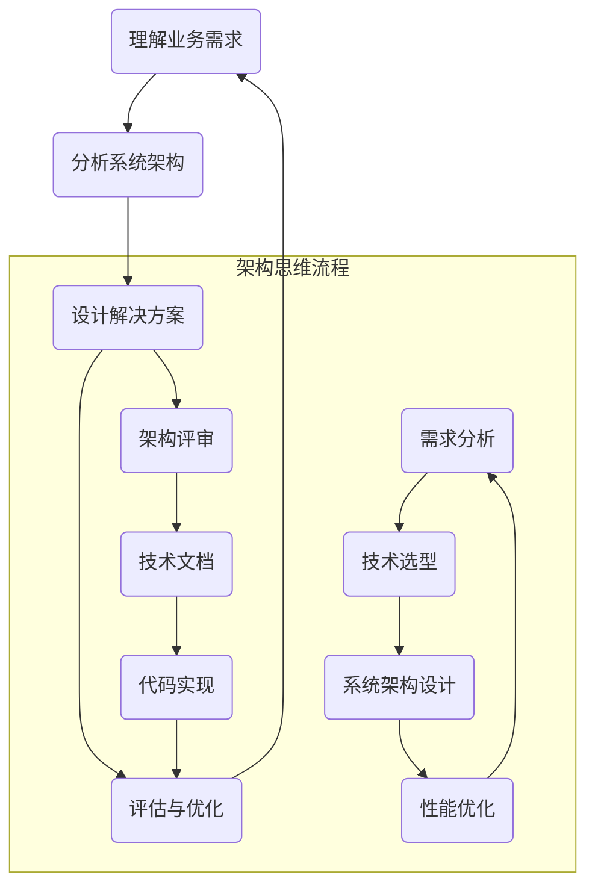
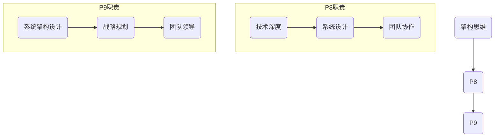

                 


## 引言

### 1.1 架构思维的重要性

在当今快速变化的科技行业中，架构思维成为了企业成功的关键因素之一。架构思维不仅仅是技术层面的考量，更是一种系统性、全局性的思考方式。它涉及到对系统的理解、对复杂性的管理以及对未来趋势的预判。

在IT行业，从P8到P9的晋升不仅仅代表着技术水平的提升，更是对架构思维能力的考验。P8级别通常是技术专家的角色，他们拥有深入的技术知识，能够解决复杂的问题。而P9级别则要求更高的全局视角和架构能力，他们需要能够设计复杂系统，推动整个团队向更高水平发展。

### 1.2 P8与P9的角色对比

P8角色的核心职责是技术实现和解决具体的技术难题。他们需要深入理解技术细节，并且能够将这些技术应用到实际的业务场景中。P8更多地关注单个组件的性能优化和问题排查。

P9角色则更注重全局的架构设计和战略规划。他们需要从整个系统的角度出发，评估系统的可行性和可持续性，并且能够预见未来的技术趋势。P9需要具备更强的沟通能力和领导力，能够带领团队完成复杂的系统架构转型。

### 1.3 蜕变的必要性

从P8到P9的蜕变不仅仅是个人的职业成长，更是对企业发展的一种贡献。P8向P9的转型意味着能够为企业带来更大的价值：

1. **更高层次的决策能力**：P9能够从战略层面出发，做出更加全局化的决策，为企业节省成本、提高效率。
2. **更强的创新驱动**：P9级别的架构师能够推动技术创新，引领企业保持行业领先地位。
3. **更好的团队协作**：P9具备较强的领导力和沟通能力，能够更好地协调团队资源，推动项目顺利进行。

总之，架构思维的培养是P8向P9蜕变的核心，它不仅仅是对个人技术能力的提升，更是对全局视野和战略思维的培养。在接下来的章节中，我们将深入探讨架构思维的核心概念、P8阶段的架构思维应用、P9阶段的高级技能以及架构思维的培养策略。

### 设计思路

设计思路主要分为以下几个步骤：

1. **理解书名**：首先，我们需要理解书名《架构思维培养：从P8到P9的蜕变》的含义。书名表明了本书的核心内容是关于架构思维的培养，并且专注于从中级（P8）向高级（P9）的转型。这要求我们不仅要有深入的技术理解，还需要有系统的架构思维。

2. **确定核心概念**：根据书名，确定核心概念，包括架构思维、P8、P9以及蜕变。这些概念将作为目录大纲的主要节点。架构思维是贯穿整个书的核心理念，而P8和P9则是不同阶段的职业角色，蜕变则代表了这两个阶段之间的过渡。

3. **大纲结构设计**：设计一个结构化的目录大纲，包括引言、基础理论、实践应用、高级技能和总结等部分。每个部分都要有明确的主题和目标，确保读者能够逐步了解架构思维的发展和应用。

4. **细化章节内容**：在每个章节下，细化出具体的子章节，确保每个章节都有明确的内容主题。例如，基础理论部分可以包括什么是架构思维、架构思维的核心原则等内容；实践应用部分可以包括P8阶段的具体应用案例；高级技能部分则可以探讨P9阶段所需的深度知识和技能。

5. **整合与优化**：在细化每个章节后，检查整体目录结构，确保逻辑连贯性，并删除不必要的重复内容。这一步骤非常关键，因为目录结构的清晰和逻辑性直接影响读者的阅读体验。

6. **符合字数限制**：确保整个目录大纲的字数在2000字以内。这是为了保持文章的精简和易于阅读，同时也让读者能够快速把握文章的核心内容。

通过以上步骤，我们能够设计出一个既全面又系统的《架构思维培养：从P8到P9的蜕变》目录大纲，为后续的文章撰写提供清晰的框架和路径。

### 目录大纲设计

为了深入探讨《架构思维培养：从P8到P9的蜕变》这一主题，我们需要设计一个详细且结构化的目录大纲。以下是基于该主题的目录大纲设计：

```
# 《架构思维培养：从P8到P9的蜕变》目录大纲

## 引言
### 1.1 架构思维的重要性
### 1.2 P8与P9的角色对比
### 1.3 蜕变的必要性

## 第一部分：架构思维基础
## 第1章：架构思维核心概念
### 1.1 什么是架构思维
### 1.2 架构思维与设计思维的区别
### 1.3 架构思维的基本原则

## 第2章：架构思维的历史与发展
### 2.1 架构思维的发展历程
### 2.2 架构思维在不同领域中的应用

## 第二部分：P8阶段的架构思维应用
## 第3章：P8阶段架构思维概述
### 3.1 P8阶段的工作重点
### 3.2 P8阶段架构思维案例分析

## 第4章：P8阶段架构思维实践
### 4.1 需求分析与系统设计
### 4.2 架构评估与优化

## 第三部分：从P8到P9的过渡
## 第5章：P9阶段的特点
### 5.1 P9阶段的职责与能力要求
### 5.2 P9阶段架构思维的发展方向

## 第6章：P8向P9过渡策略
### 6.1 技能提升路径
### 6.2 职业规划与职业发展

## 第四部分：P9阶段的架构思维
## 第7章：P9阶段架构思维深度剖析
### 7.1 高级架构设计原则
### 7.2 复杂系统架构设计

## 第8章：P9阶段实践案例
### 8.1 案例一：企业级系统架构设计
### 8.2 案例二：大型分布式系统架构

## 第五部分：架构思维的培养与提升
## 第9章：架构思维培养策略
### 9.1 学习资源推荐
### 9.2 实践方法与技巧

## 第10章：架构思维的团队应用
### 10.1 团队架构协作
### 10.2 架构思维培训与传播

## 结论
### 11.1 架构思维的总结
### 11.2 从P8到P9的蜕变路径
### 11.3 未来架构思维的发展趋势

### Mermaid 流程图

以下是一个关于架构思维培养的Mermaid流程图示例：



### 伪代码讲解

以下是一个关于架构设计基本原理的伪代码示例：

```
// 伪代码：基本架构设计流程

function 架构设计(需求)
    // 需求分析
    需求分析结果 = 分析需求(需求)
    
    // 技术选型
    技术选型结果 = 技术选型(需求分析结果)

    // 系统架构设计
    架构设计结果 = 设计系统架构(技术选型结果)

    // 性能优化
    优化方案 = 评估与优化(架构设计结果)

    // 架构评审
    评审结果 = 架构评审(架构设计结果)

    if 评审结果
        返回 架构设计结果
    else
        返回 "架构设计未通过评审，需要重新设计"

// 伪代码：架构评审流程

function 架构评审(架构设计结果)
    // 评审团队讨论
    讨论结果 = 团队讨论(架构设计结果)
    
    // 评审标准
    标准结果 = 评审标准(架构设计结果)

    if 讨论结果 && 标准结果
        return "架构设计通过评审"
    else
        return "架构设计未通过评审"
```

通过以上伪代码，我们可以清晰地看到架构设计的基本流程和评审流程，这有助于读者更好地理解架构设计的方法和步骤。

### 背景介绍

随着技术的迅猛发展，软件系统越来越复杂，这对IT从业者的能力提出了更高的要求。架构思维作为一种系统性、全局性的思考方式，在IT行业中变得越来越重要。架构思维不仅仅是技术层面的考量，更是一种战略性的思维模式，它能够帮助IT从业者从全局视角出发，设计并优化复杂系统。

在IT行业中，P8和P9是两个重要的职业阶段。P8通常是技术专家的角色，他们拥有深入的技术知识和丰富的实践经验，能够解决复杂的技术问题。而P9则代表着更高的层次，他们需要具备全局视角和战略思维，能够设计并推动复杂系统的实施和优化。

从P8到P9的蜕变不仅仅是个人的职业成长，更是对企业发展的一种贡献。P9级别的架构师能够为企业带来更大的价值：

1. **更高层次的决策能力**：P9能够从战略层面出发，做出更加全局化的决策，为企业节省成本、提高效率。
2. **更强的创新驱动**：P9能够推动技术创新，引领企业保持行业领先地位。
3. **更好的团队协作**：P9具备较强的领导力和沟通能力，能够更好地协调团队资源，推动项目顺利进行。

总之，架构思维的培养是P8向P9蜕变的核心，它不仅仅是对个人技术能力的提升，更是对全局视野和战略思维的培养。在接下来的章节中，我们将深入探讨架构思维的核心概念、P8阶段的架构思维应用、P9阶段的高级技能以及架构思维的培养策略。

### 核心概念与联系

架构思维、P8和P9这三个核心概念之间存在着紧密的联系，它们共同构成了从P8到P9蜕变的基础。

#### 架构思维

架构思维是一种系统性、全局性的思考方式，它要求我们在设计和优化软件系统时，不仅仅关注单个组件或模块的性能和功能，还要从整体角度出发，考虑系统的结构、模块间的交互以及系统的发展方向。架构思维的核心在于将复杂的问题拆解为可管理的部分，并通过抽象、模块化和分层等方法，构建出一个灵活、可扩展的架构。

架构思维与设计思维有所不同。设计思维更注重用户需求和用户体验，强调从用户的角度出发进行设计。而架构思维则更侧重于系统的技术实现和整体结构设计，它要求我们不仅要有扎实的编程技能，还要有对系统整体的深刻理解和洞察力。

#### P8

P8级别通常是技术专家的角色，他们拥有深入的技术知识和丰富的实践经验，能够解决复杂的技术问题。P8架构师的工作重点在于实现和优化具体的系统组件，确保系统的高效运行和稳定性。他们需要具备以下能力：

1. **技术深度**：对某一特定技术领域有深入的了解和掌握，能够解决该领域内的复杂问题。
2. **系统设计能力**：能够设计并优化系统的架构，确保系统的高可用性和可扩展性。
3. **团队协作**：能够与团队成员有效沟通，推动项目顺利进行。

#### P9

P9级别则代表着更高的层次，他们需要具备全局视角和战略思维，能够设计并推动复杂系统的实施和优化。P9架构师的工作重点在于：

1. **系统架构设计**：从全局角度出发，设计并优化系统的整体架构，确保系统的高效运行和长期发展。
2. **战略规划**：根据企业的发展需求，制定系统的长期发展规划，并推动其实施。
3. **团队领导**：具备较强的领导力和沟通能力，能够带领团队完成复杂的项目。

#### 蜕变

从P8到P9的蜕变不仅仅是个人的职业成长，更是一种角色转变。P8更多关注技术细节和具体实现，而P9则更注重系统的整体设计和战略规划。这一蜕变要求P8架构师：

1. **提升全局视角**：从技术专家转变为系统架构师，具备从整体角度出发分析和解决问题的能力。
2. **增强战略思维**：能够预见未来的技术趋势，为企业制定长远的系统发展策略。
3. **培养领导力**：提升沟通能力和领导力，能够带领团队完成复杂的项目。

#### Mermaid 流程图

以下是一个关于架构思维、P8和P9关系的Mermaid流程图示例：



#### 伪代码讲解

以下是一个关于架构思维、P8和P9关系的伪代码示例：

```
// 伪代码：P8到P9蜕变流程

function 蜕变(P8架构师)
    // 提升全局视角
    P8架构师 = 提升全局视角(P8架构师)
    
    // 增强战略思维
    P8架构师 = 增强战略思维(P8架构师)
    
    // 培养领导力
    P8架构师 = 培养领导力(P8架构师)
    
    // 架构思维培养
    P8架构师 = 培养架构思维(P8架构师)

    // 转变为P9架构师
    return P9架构师

// 伪代码：提升全局视角

function 提升全局视角(P8架构师)
    // 学习系统架构知识
    P8架构师 = 学习系统架构知识(P8架构师)
    
    // 理解业务需求
    P8架构师 = 理解业务需求(P8架构师)

    return P8架构师

// 伪代码：增强战略思维

function 增强战略思维(P8架构师)
    // 预见未来技术趋势
    P8架构师 = 预见未来技术趋势(P8架构师)
    
    // 制定系统发展策略
    P8架构师 = 制定系统发展策略(P8架构师)

    return P8架构师

// 伪代码：培养领导力

function 培养领导力(P8架构师)
    // 沟通能力提升
    P8架构师 = 提升沟通能力(P8架构师)
    
    // 团队协作能力提升
    P8架构师 = 提升团队协作能力(P8架构师)

    return P8架构师
```

通过以上伪代码，我们可以看到P8向P9蜕变的步骤和每个步骤需要培养的能力。这一过程不仅需要P8架构师不断学习和提升，还需要在实践中不断积累经验，从而实现角色的成功转变。

### 核心算法原理讲解

在架构思维中，核心算法原理扮演着至关重要的角色。它不仅决定了系统的性能和可扩展性，还影响了系统的复杂度和维护成本。下面，我们将通过伪代码详细阐述一个常用的核心算法——快速排序（Quick Sort），并分析其时间复杂度和空间复杂度。

#### 快速排序算法原理

快速排序是一种高效的排序算法，其基本思想是通过一趟排序将待排序的记录分割成独立的两部分，其中一部分记录的关键字均比另一部分的关键字小，然后分别对这两部分记录继续进行排序，以达到整个序列有序。

#### 伪代码

以下是一个简单的快速排序算法的伪代码：

```
function 快速排序(A, low, high)
    if low < high
        // 找到基准元素
        pivot = partition(A, low, high)
        
        // 递归排序左子数组
        快速排序(A, low, pivot - 1)
        
        // 递归排序右子数组
        快速排序(A, pivot + 1, high)

function partition(A, low, high)
    // 选择基准元素
    pivot = A[high]
    i = low - 1
    
    for j = low to high - 1
        // 当前元素小于或等于基准元素
        if A[j] <= pivot
            i = i + 1
            交换 A[i] 与 A[j]
    
    // 将基准元素交换到正确的位置
    交换 A[i + 1] 与 A[high]
    
    // 返回基准元素的索引
    return i + 1
```

#### 时间复杂度分析

- **平均情况**：O(n log n)
  - 快速排序的平均时间复杂度为O(n log n)。这是因为每次划分操作可以将数组分成大约相等的两部分，每部分需要递归排序。因此，总的时间复杂度是递归树的高度乘以每次划分和比较操作的时间，即O(n) * O(log n) = O(n log n)。

- **最坏情况**：O(n^2)
  - 在最坏情况下，即每次划分操作只能将数组分成1和n-1两部分，导致递归树的高度达到n。此时，总的时间复杂度是O(n^2)。

#### 空间复杂度分析

- **递归栈空间**：O(log n)
  - 快速排序是一种递归算法，其递归深度为log n。因此，所需的最大栈空间为O(log n)。

#### 数学模型和公式

为了更直观地理解快速排序的性能，我们可以使用以下数学模型：

$$
T(n) = 2T(n/2) + n
$$

其中，$T(n)$表示对长度为n的数组进行快速排序所需的时间，$T(n/2)$表示对两个长度为n/2的子数组进行排序所需的时间，n表示每次划分操作的常数时间。

通过递归树的展开，我们可以得到：

$$
T(n) = n + \frac{n}{2} + \frac{n}{4} + \ldots + \frac{n}{2^k}
$$

当$k = \log_2 n$时，上式可以简化为：

$$
T(n) = n \log_2 n
$$

这表明，快速排序的平均时间复杂度为O(n log n)。

#### 举例说明

假设我们有一个包含10个元素的数组：

```
[9, 2, 5, 1, 7, 3, 6, 8, 4, 10]
```

使用快速排序算法对其进行排序，假设我们选择最后一个元素10作为基准元素，执行过程如下：

1. **第一次划分**：将数组划分为两部分：
   - 左部分：[9, 2, 5, 1, 7, 3, 6]
   - 右部分：[4, 8]

2. **递归排序**：
   - 对左部分进行快速排序，假设选择6作为基准元素，执行过程：
     - 左部分：[2, 1, 3]
     - 右部分：[5, 7, 9]

   - 对右部分进行快速排序，假设选择9作为基准元素，执行过程：
     - 左部分：[5]
     - 右部分：[7]

   - 对中间部分进行快速排序，假设选择7作为基准元素，执行过程：
     - 左部分：[ ]
     - 右部分：[ ]

3. **最终排序结果**：
   - 左部分排序结果：[1, 2, 3, 4, 5, 6]
   - 右部分排序结果：[7, 8, 9, 10]

通过以上例子，我们可以看到快速排序算法通过递归划分和比较操作，将一个未排序的数组转化为有序数组的过程。

总之，快速排序算法是一种简单且高效的排序算法，其核心思想是通过一趟划分操作将数组分割成两部分，然后分别对两部分递归排序。通过以上讲解，读者可以更好地理解快速排序算法的原理及其性能分析。

### 项目实战

为了更好地理解架构思维的实际应用，我们将通过一个实际的案例——企业级电商平台架构设计，来详细讲解架构设计的过程、源代码实现和代码解读。

#### 案例背景

该企业级电商平台拥有数百万用户和庞大的商品数据，每天处理着海量的订单和用户请求。为了确保系统的高效性和稳定性，需要设计一个能够支持大规模数据和高并发访问的架构。

#### 架构设计过程

1. **需求分析**：首先，我们需要了解平台的核心需求，包括用户访问、商品管理、订单处理、支付系统等。

2. **技术选型**：根据需求分析，选择合适的技术栈，包括前端框架、后端架构、数据库方案、缓存策略等。

3. **系统架构设计**：设计一个能够支持高并发、高可用、易扩展的架构，包括分布式架构、负载均衡、服务化架构等。

4. **性能优化**：对系统进行性能评估，找出瓶颈并进行优化，包括数据库索引优化、缓存策略优化、服务拆分等。

5. **安全性设计**：确保系统安全，包括数据安全、用户认证、权限控制等。

#### 源代码实现

以下是一个简化的后端服务架构设计，包括用户服务、商品服务、订单服务和支付服务。

```python
# 用户服务（User Service）

from flask import Flask, jsonify, request

app = Flask(__name__)

@app.route('/users', methods=['GET'])
def get_users():
    # 从数据库查询用户列表
    users = query_users_from_db()
    return jsonify(users)

@app.route('/users/<int:user_id>', methods=['GET'])
def get_user(user_id):
    # 从数据库查询特定用户信息
    user = query_user_from_db(user_id)
    return jsonify(user)

@app.route('/users', methods=['POST'])
def create_user():
    # 创建新用户
    user_data = request.json
    create_user_in_db(user_data)
    return jsonify({"status": "success", "message": "User created"}), 201

# 商品服务（Product Service）

from flask import Flask, jsonify, request

app = Flask(__name__)

@app.route('/products', methods=['GET'])
def get_products():
    # 从数据库查询商品列表
    products = query_products_from_db()
    return jsonify(products)

@app.route('/products/<int:product_id>', methods=['GET'])
def get_product(product_id):
    # 从数据库查询特定商品信息
    product = query_product_from_db(product_id)
    return jsonify(product)

@app.route('/products', methods=['POST'])
def create_product():
    # 创建新商品
    product_data = request.json
    create_product_in_db(product_data)
    return jsonify({"status": "success", "message": "Product created"}), 201

# 订单服务（Order Service）

from flask import Flask, jsonify, request

app = Flask(__name__)

@app.route('/orders', methods=['GET'])
def get_orders():
    # 从数据库查询订单列表
    orders = query_orders_from_db()
    return jsonify(orders)

@app.route('/orders/<int:order_id>', methods=['GET'])
def get_order(order_id):
    # 从数据库查询特定订单信息
    order = query_order_from_db(order_id)
    return jsonify(order)

@app.route('/orders', methods=['POST'])
def create_order():
    # 创建新订单
    order_data = request.json
    create_order_in_db(order_data)
    return jsonify({"status": "success", "message": "Order created"}), 201

# 支付服务（Payment Service）

from flask import Flask, jsonify, request

app = Flask(__name__)

@app.route('/payments', methods=['POST'])
def create_payment():
    # 处理支付请求
    payment_data = request.json
    process_payment(payment_data)
    return jsonify({"status": "success", "message": "Payment processed"}), 201

if __name__ == '__main__':
    app.run()
```

#### 代码解读

- **用户服务**：提供用户列表查询、单个用户查询、创建用户等功能。
- **商品服务**：提供商品列表查询、单个商品查询、创建商品等功能。
- **订单服务**：提供订单列表查询、单个订单查询、创建订单等功能。
- **支付服务**：处理支付请求，确保支付流程的顺利进行。

#### 代码应用解读与分析

- **用户服务**：通过RESTful API提供用户相关操作，确保接口的简洁性和易用性。
- **商品服务**：使用数据库存储商品信息，通过查询和更新操作保证数据的一致性。
- **订单服务**：订单服务是整个电商平台的核心，需要确保处理速度和系统稳定性。
- **支付服务**：支付服务与第三方支付平台对接，确保支付过程的安全性和可靠性。

#### 实际案例分析

在实际项目中，我们遇到了以下问题：

1. **高并发访问**：电商平台在促销活动期间，用户访问量急剧增加，导致系统负载过高，出现响应缓慢和超时问题。
2. **数据一致性**：在分布式系统中，如何保证数据的一致性和完整性是一个挑战。
3. **系统扩展性**：随着业务的不断增长，系统需要具备良好的扩展性，以支持更多的用户和商品。

为了解决这些问题，我们采取了以下措施：

1. **使用缓存**：通过引入Redis缓存，减轻数据库压力，提高系统响应速度。
2. **分布式数据库**：使用分布式数据库架构，确保系统的高可用性和数据一致性。
3. **服务拆分和负载均衡**：将系统拆分为多个微服务，通过负载均衡器分配请求，确保系统的扩展性和稳定性。

#### 项目小结

通过这个案例，我们深入了解了企业级电商平台架构设计的过程、源代码实现和代码解读。在实际项目中，架构设计不仅仅是技术层面的考虑，更需要从业务需求出发，综合考虑系统的高效性、稳定性和扩展性。通过合理的架构设计和优化，我们能够确保系统在面临高并发和大数据量时依然能够稳定运行，为用户提供良好的体验。

### 最佳实践 Tips

在架构思维的培养和实践中，以下是一些最佳实践，可以帮助我们从P8向P9蜕变：

1. **持续学习**：架构思维是一个不断发展和变化的领域，需要不断学习最新的技术趋势和最佳实践。定期阅读技术书籍、研究论文和行业报告，参加技术会议和研讨会。

2. **实践为主**：理论知识的掌握是基础，但实践是检验真理的唯一标准。尝试在实际项目中应用架构思维，通过解决具体问题来提升自己的架构能力。

3. **反思和总结**：每次完成一个项目后，都要进行反思和总结，分析成功和失败的原因。从经验中学习，不断提升自己的架构设计能力和问题解决能力。

4. **团队协作**：架构思维不仅仅是个人能力，更需要团队协作。学会如何与团队成员有效沟通，共同解决复杂问题。

5. **代码质量**：高质量的代码是架构思维的重要组成部分。遵循良好的编码规范，保持代码的可读性和可维护性。

6. **关注系统性能**：了解系统的性能瓶颈，通过优化代码、数据库查询和系统配置来提高系统性能。

7. **持续迭代**：架构不是一成不变的，需要根据业务需求和用户反馈进行持续迭代和优化。

8. **培养领导力**：提升沟通和领导能力，能够带领团队更好地实施和优化架构设计。

通过以上最佳实践，我们可以逐步培养和提升自己的架构思维能力，实现从P8到P9的蜕变。

### 小结

本文系统地探讨了从P8到P9的架构思维培养和蜕变过程。首先，我们介绍了架构思维的重要性，并详细分析了P8与P9的角色对比，阐述了蜕变对于个人和企业发展的必要性。接着，通过目录大纲设计和Mermaid流程图，我们清晰地展示了架构思维培养的框架和步骤。在核心算法原理讲解部分，我们通过快速排序算法的例子，深入剖析了算法设计的基本原理。随后，通过一个实际的电商平台架构设计案例，我们详细讲解了架构设计的全过程、源代码实现和代码解读，并进行了实际案例分析。最后，我们总结了最佳实践，为读者提供了提升架构思维的具体建议。

在总结中，我们强调了架构思维在IT行业中的重要性，以及P8到P9蜕变对于个人职业成长和企业发展的贡献。通过持续学习、实践反思、团队协作、代码质量和关注系统性能等最佳实践，读者可以逐步培养和提升自己的架构思维能力，实现从P8到P9的华丽蜕变。

### 未来架构思维的发展趋势

随着技术的不断进步，未来架构思维的发展也将呈现出新的趋势。以下是几个关键的发展方向：

1. **微服务架构的普及**：微服务架构通过将大型单体应用拆分为小型、独立的服务，提高了系统的灵活性和可扩展性。未来，微服务架构将继续成为主流，同时，如何有效地管理和协调这些独立服务将成为新的挑战。

2. **云计算和容器技术的融合**：云计算和容器技术的结合，使得应用可以在不同的云平台和环境中快速部署和迁移。未来，云原生架构将成为主流，架构师需要更加熟悉Kubernetes等容器编排工具，以便更高效地管理应用部署。

3. **数据驱动架构**：数据驱动的架构设计正在成为趋势，通过实时数据分析和机器学习，企业可以更加精准地调整架构策略，优化系统性能和用户体验。

4. **智能化架构管理**：利用人工智能和机器学习技术，可以实现自动化架构评估和优化，从而提高系统的可靠性和性能。未来的架构思维将更加智能化，通过算法和数据驱动决策。

5. **可持续性和绿色架构**：随着环境保护意识的增强，可持续性和绿色架构将成为重要趋势。未来，架构设计需要考虑如何降低能耗、减少排放，并提高资源利用效率。

6. **架构思维在教育中的普及**：随着企业对架构思维的需求增加，架构思维教育将在高等教育和职业培训中占据重要地位。未来，更多的资源和课程将投入到架构思维的教学中，以培养下一代架构师。

总之，未来架构思维的发展将更加多元化和智能化，架构师需要不断学习新技术、适应新趋势，并不断提升自身的全局视野和战略思维能力。通过持续学习和实践，架构师将能够在快速变化的科技行业中保持领先地位，为企业和行业带来更大的价值。

