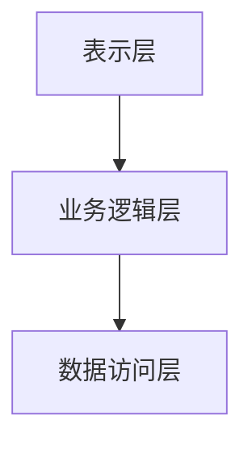
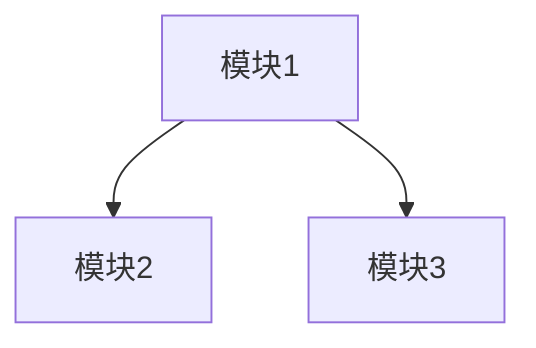
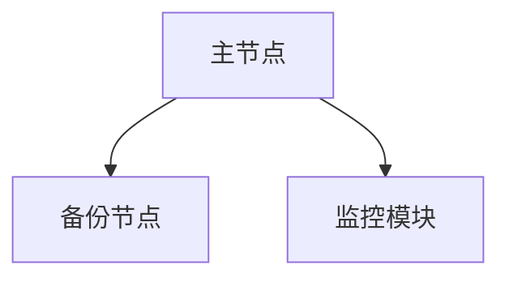
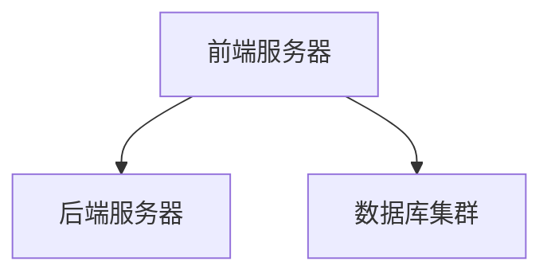

                 

### 文章标题：架构的本质：从虚到实定义系统能力

> 关键词：系统架构、系统能力、虚拟架构、实体架构、架构设计原则、架构优化

> 摘要：本文将深入探讨系统架构的本质，从虚拟到实体的转换过程，以及如何定义和提升系统能力。通过分析系统架构的基本概念、设计原则、方法，结合实际项目案例，我们将揭示架构设计的核心要素和最佳实践，帮助读者在复杂的IT领域中构建高效、可靠的系统。

### 引言

在现代信息技术高速发展的背景下，系统架构设计已经成为IT行业中不可或缺的重要环节。一个优秀的设计不仅能够提升系统的性能和稳定性，还能够提高开发效率和降低维护成本。然而，面对日益复杂的系统需求和技术环境，如何理解和应用架构设计原则，从虚到实定义系统能力，成为了一个亟待解决的重要问题。

本文旨在通过以下四个方面展开讨论：

1. **系统架构的基本概念**：介绍系统架构的定义、重要性以及其发展历程。
2. **系统架构设计原则**：阐述分层设计、模块化设计、容错性设计、可伸缩性设计等核心设计原则。
3. **系统架构设计方法**：探讨面向对象设计、微服务架构、云原生架构等常见的设计方法。
4. **系统能力的定义与提升**：从虚拟到实体架构的转换过程，以及如何评估和提升系统能力。

通过以上四个方面的详细分析，我们希望读者能够对系统架构的本质有一个深入的理解，并掌握从虚到实定义系统能力的方法。

### 系统架构的基本概念

系统架构，作为现代软件工程的基石，其重要性不言而喻。首先，我们需要明确什么是系统架构。系统架构是指一个系统的整体结构，包括其组件、组件之间的关系以及组件之间的通信机制。它可以被视为一个系统的“骨架”，决定了系统的性能、可维护性和可扩展性。

#### 定义

系统架构的定义可以从不同的角度进行解释。从宏观角度来看，系统架构是一个复杂的系统，它由多个子系统组成，这些子系统通过一定的接口和协议进行通信和协作。从微观角度来看，系统架构关注的是系统的内部组织结构，包括组件的层次、模块的划分、数据流的传递等。

#### 重要性

系统架构的重要性体现在以下几个方面：

1. **性能优化**：合理的架构设计可以最大化系统的性能，确保在高负载情况下系统依然能够高效运行。
2. **可维护性**：良好的架构使得系统更加模块化，便于维护和更新，降低了系统维护的难度和成本。
3. **可扩展性**：灵活的架构设计使得系统可以轻松应对未来的扩展需求，保持系统的长期生命力。
4. **安全性**：系统架构中的安全设计原则有助于防止潜在的安全漏洞，确保系统的安全性。

#### 发展历程

系统架构的发展历程可以追溯到计算机科学的早期阶段。从最初的单一程序结构到模块化设计，再到面向对象设计，每一次的架构变革都极大地推动了软件工程的发展。

- **早期阶段**：早期计算机系统主要是单机结构，系统架构相对简单，主要由单个程序组成。
- **模块化阶段**：随着系统规模的扩大，模块化设计开始出现，通过将系统划分为多个模块来提高系统的可维护性和可扩展性。
- **面向对象阶段**：面向对象设计（OOD）的出现进一步推动了系统架构的演进，通过封装、继承和多态等机制，实现了系统的模块化和复用性。
- **微服务阶段**：微服务架构（MSA）是当前系统架构设计的主流方法，通过将系统划分为多个独立的、可部署的服务，实现了高可扩展性和高容错性。
- **云原生阶段**：云原生架构（CNaaS）结合了云计算、容器化和微服务等技术，使得系统在云环境中的部署和运行更加高效和灵活。

综上所述，系统架构是一个复杂而重要的概念，其定义和重要性在IT领域中得到了广泛的认可。接下来，我们将进一步探讨系统架构设计的基本原则，帮助读者理解如何构建一个高效、可靠的系统。

#### 系统架构设计原则

系统架构设计的原则是确保系统在性能、可维护性、可扩展性和安全性等方面达到最佳状态的关键。以下是一些核心设计原则：

##### 1. 分层设计

分层设计是系统架构设计的基本原则之一，它通过将系统划分为多个层次，实现组件之间的逻辑隔离。每个层次负责不同的功能，如表示层、业务逻辑层和数据访问层。这种设计方法不仅提高了系统的可维护性，还使得每个层次都可以独立扩展和更新。

**优点**：

- **模块化**：每个层次可以独立开发、测试和部署，提高了系统的灵活性和可维护性。
- **可扩展性**：可以通过增加或修改某一层的组件来实现系统的扩展，而不会影响到其他层次。

**缺点**：

- **复杂度增加**：分层设计可能引入额外的通信开销和复杂性。
- **耦合性**：如果设计不当，不同层次之间的依赖可能导致系统的耦合度增加。

**适用场景**：分层设计适用于大多数大型系统，尤其是在需要高可维护性和可扩展性的场景中。

**示例**：



##### 2. 模块化设计

模块化设计是将系统划分为多个独立的模块，每个模块负责特定的功能。模块之间通过定义良好的接口进行通信，从而降低了组件之间的耦合度，提高了系统的可维护性和复用性。

**优点**：

- **低耦合**：模块之间通过接口通信，降低了组件之间的耦合度，使得系统更易于维护和扩展。
- **高复用性**：模块可以独立开发和测试，便于复用。

**缺点**：

- **接口设计复杂**：模块化设计需要定义良好的接口，这可能会增加设计复杂度。
- **依赖管理**：模块之间的依赖关系需要妥善管理，以避免版本冲突等问题。

**适用场景**：模块化设计适用于大多数大型系统，尤其是在需要高复用性和高可维护性的场景中。

**示例**：



##### 3. 容错性设计

容错性设计是指系统在出现故障时能够自动恢复，确保系统的连续性和可靠性。这通常通过冗余设计、故障检测和自动恢复机制来实现。

**优点**：

- **高可靠性**：系统能够在出现故障时自动恢复，确保服务的连续性。
- **高可用性**：系统可以在有故障的情况下保持运行，减少了系统的停机时间。

**缺点**：

- **成本增加**：冗余设计和故障检测可能增加系统的硬件和软件成本。
- **性能影响**：冗余机制和故障检测可能会引入额外的性能开销。

**适用场景**：容错性设计适用于对可靠性要求极高的系统，如金融系统、医疗系统等。

**示例**：



##### 4. 可伸缩性设计

可伸缩性设计是指系统能够根据需求的变化进行水平扩展或垂直扩展，以应对更高的负载和需求。这通常通过分布式架构和云计算技术来实现。

**优点**：

- **高可扩展性**：系统可以根据需求进行弹性扩展，提高了系统的灵活性和适应性。
- **高性能**：通过水平扩展，系统可以处理更大的负载，提高了系统的性能。

**缺点**：

- **复杂性增加**：分布式架构和云计算技术引入了额外的复杂性，需要更多的管理和维护。
- **数据一致性**：在分布式系统中保持数据一致性是一个挑战。

**适用场景**：可伸缩性设计适用于需要高扩展性和高性能的系统，如电子商务平台、社交媒体平台等。

**示例**：



通过以上四个核心设计原则的介绍，我们可以看到，系统架构设计不仅仅是技术的堆砌，更是一种深入思考和系统性的设计方法。在接下来的章节中，我们将进一步探讨系统架构设计的方法，以及如何在实际项目中应用这些方法。

### 系统架构设计方法

在了解了系统架构设计的基本概念和原则后，我们需要进一步探讨具体的系统架构设计方法。这些方法不仅有助于我们构建高效的系统，还能够提升系统的可维护性和可扩展性。以下是一些常见的系统架构设计方法：

#### 1. 面向对象设计（OOD）

面向对象设计（Object-Oriented Design，简称OOD）是一种基于面向对象编程（Object-Oriented Programming，简称OOP）原则的系统设计方法。OOD通过封装、继承和多态等机制，将系统划分为多个对象，每个对象代表系统中的一个功能模块。

**优点**：

- **模块化**：OOD使得系统更加模块化，每个对象可以独立开发、测试和部署。
- **复用性**：通过继承和接口，OOD提高了系统的复用性。
- **可维护性**：OOD使得系统的代码结构更加清晰，便于维护和更新。

**缺点**：

- **复杂性**：面向对象设计可能引入额外的设计复杂度，特别是在大规模系统中。
- **性能**：面向对象设计可能会引入额外的性能开销，尤其是在频繁的继承和多态操作中。

**适用场景**：OOD适用于大多数软件系统，尤其是在需要高可维护性和高复用性的场景中。

**示例**：

```python
# 定义一个学生类
class Student:
    def __init__(self, name, age):
        self.name = name
        self.age = age
    
    def study(self):
        print(f"{self.name} 正在学习。")

# 创建学生对象
student1 = Student("Alice", 20)
student1.study()
```

#### 2. 微服务架构（Microservices Architecture）

微服务架构（Microservices Architecture，简称MSA）是一种将系统拆分成多个独立服务的方法。每个服务都是独立的、可部署的单元，负责系统中的特定功能。微服务之间通过轻量级的通信机制（如REST API）进行交互。

**优点**：

- **高可扩展性**：每个服务都可以独立扩展，系统可以根据需求进行水平扩展。
- **高容错性**：服务之间的独立性使得一个服务的故障不会影响整个系统。
- **灵活性**：微服务可以采用不同的编程语言和技术栈，提高了系统的灵活性。

**缺点**：

- **复杂性**：服务拆分和通信可能会增加系统的复杂性。
- **数据一致性**：在分布式系统中保持数据一致性是一个挑战。

**适用场景**：微服务架构适用于大型、复杂系统，尤其是需要高扩展性和高容错性的场景。

**示例**：

```java
// Student服务
@RestController
@RequestMapping("/students")
public class StudentController {
    @Autowired
    private StudentService studentService;
    
    @GetMapping("/{id}")
    public Student getStudent(@PathVariable Long id) {
        return studentService.getStudent(id);
    }
}

// Student服务接口
public interface StudentService {
    Student getStudent(Long id);
}
```

#### 3. 云原生架构（Cloud-Native Architecture）

云原生架构（Cloud-Native Architecture，简称CNA）是一种利用云计算、容器化和微服务等技术，构建高度可扩展、自动化和自我修复的系统的设计方法。云原生架构的核心思想是将系统作为微服务部署在容器中，并通过自动化工具进行管理和部署。

**优点**：

- **高可扩展性**：云原生架构可以通过水平扩展来应对更高的负载。
- **自动化**：通过自动化工具，如Kubernetes，实现系统的自动化部署、扩展和管理。
- **弹性**：系统可以根据需求自动调整资源，提高了系统的弹性。

**缺点**：

- **复杂性**：云原生架构引入了额外的复杂性和管理需求。
- **迁移成本**：从传统架构迁移到云原生架构可能需要一定的成本和时间。

**适用场景**：云原生架构适用于需要高度可扩展性和自动化的现代系统，如云计算平台、大数据处理系统等。

**示例**：

```yaml
# Kubernetes部署配置文件
apiVersion: apps/v1
kind: Deployment
metadata:
  name: student-service
spec:
  replicas: 3
  selector:
    matchLabels:
      app: student-service
  template:
    metadata:
      labels:
        app: student-service
    spec:
      containers:
      - name: student-service
        image: student-service:latest
        ports:
        - containerPort: 8080
```

通过以上三种系统架构设计方法的介绍，我们可以看到，不同的方法适用于不同的场景和需求。在实际项目中，根据具体的应用场景和需求，选择合适的设计方法，是构建高效、可靠系统的重要步骤。在接下来的章节中，我们将进一步探讨如何从虚到实定义和提升系统能力。

### 系统能力的定义与分类

在系统架构设计中，系统能力是一个关键的概念，它决定了系统在实际应用中的表现和效果。系统能力的定义和分类对于理解和评估系统的性能至关重要。

#### 定义

系统能力是指系统在特定条件下，完成特定任务的能力水平。它不仅包括系统的计算能力、存储能力和通信能力，还涵盖了系统的可靠性、可用性、可维护性等多个方面。

**具体定义**：

- **计算能力**：系统处理数据和处理请求的能力，通常用计算速度、处理能力等指标来衡量。
- **存储能力**：系统存储数据的能力，包括存储容量、读写速度等。
- **通信能力**：系统与其他系统或组件进行数据交换的能力，包括传输速度、传输效率等。
- **可靠性**：系统在长时间运行过程中，保持稳定运行的能力，包括故障率、恢复速度等。
- **可用性**：系统在需要时能够正常运行的能力，包括响应时间、故障恢复时间等。
- **可维护性**：系统在维护和更新过程中的难易程度，包括代码可读性、文档完善程度等。

#### 分类

根据系统能力的作用和表现形式，可以将系统能力分为以下几类：

1. **功能性能力**：这类能力关注系统是否能够按照预定要求完成特定的功能。例如，一个电子商务系统的功能性能力包括商品展示、订单处理、支付处理等。

2. **性能能力**：这类能力关注系统在实际运行中的表现，包括响应时间、吞吐量、并发处理能力等。性能能力是评估系统能否满足用户需求的关键指标。

3. **可靠性能力**：这类能力关注系统在长时间运行过程中，保持稳定性的能力。可靠性能力通常通过故障率、恢复时间等指标来衡量。

4. **可用性能力**：这类能力关注系统在需要时是否能够正常运行。可用性能力包括系统的响应时间、故障恢复速度等。

5. **可维护性能力**：这类能力关注系统在维护和更新过程中的难易程度。可维护性能力包括代码质量、文档完善程度、测试覆盖率等。

#### 评估指标

为了准确评估系统能力，需要制定相应的评估指标。以下是一些常见的评估指标：

1. **响应时间**：系统处理请求所需的时间，是衡量系统性能的关键指标。
2. **吞吐量**：系统在单位时间内处理请求的数量，是衡量系统性能的重要指标。
3. **并发处理能力**：系统同时处理多个请求的能力，是衡量系统性能的关键指标。
4. **故障率**：系统在一段时间内发生故障的次数，是衡量系统可靠性的关键指标。
5. **恢复时间**：系统从故障中恢复的时间，是衡量系统可靠性和可用性的关键指标。
6. **维护成本**：系统在维护和更新过程中的成本，是衡量系统可维护性的关键指标。

通过以上对系统能力的定义、分类和评估指标的讨论，我们可以更全面地理解和评估系统的能力水平。在接下来的章节中，我们将探讨如何从虚拟架构到实体架构，实现系统能力的提升。

### 虚拟架构与实体架构的对比

虚拟架构和实体架构是系统设计中的两种不同概念，它们各自具有独特的特点和适用场景。理解这两种架构的区别和联系，有助于我们在实际项目中做出更明智的设计决策。

#### 虚拟架构

虚拟架构主要指的是通过软件实现的系统架构，它利用虚拟化技术将硬件资源抽象化，从而创建一个虚拟的运行环境。这种架构具有以下几个特点：

1. **灵活性**：虚拟架构可以动态调整资源分配，根据需求的变化快速调整系统配置。
2. **高可用性**：通过虚拟化技术，可以实现故障转移和负载均衡，提高系统的可靠性。
3. **成本效益**：虚拟架构可以利用现有的硬件资源，降低系统的硬件成本。
4. **可扩展性**：虚拟架构可以轻松实现水平扩展，以应对更高的负载。

虚拟架构的典型应用场景包括云计算平台、虚拟机、容器等。

#### 实体架构

实体架构指的是基于物理硬件的系统架构，它依赖于实际的硬件设备和网络设施来运行。实体架构的特点如下：

1. **稳定性**：实体架构依赖于实际的物理硬件，具有较高的稳定性。
2. **性能**：实体架构通常具有更高的性能，特别是在处理大量数据和高并发场景中。
3. **可控性**：实体架构的硬件和软件环境相对固定，更容易进行性能优化和控制。
4. **安全性**：实体架构可以通过物理隔离和特定的硬件安全机制提高系统的安全性。

实体架构的典型应用场景包括传统的企业级服务器、数据中心、网络设备等。

#### 对比

虚拟架构与实体架构的对比可以从多个维度进行：

1. **灵活性**：虚拟架构更加灵活，可以动态调整资源分配，而实体架构在资源分配上相对固定。
2. **性能**：实体架构通常具有更高的性能，特别是在处理大量数据和高并发场景中，而虚拟架构可能会因为虚拟化层的额外开销而性能略低。
3. **成本**：虚拟架构可以利用现有的硬件资源，降低系统的硬件成本，而实体架构需要投入更多的硬件资源。
4. **可用性**：虚拟架构通过虚拟化技术可以实现高可用性，如故障转移和负载均衡，而实体架构的可用性通常依赖于具体的硬件和软件配置。
5. **扩展性**：虚拟架构可以轻松实现水平扩展，以应对更高的负载，而实体架构通常需要通过硬件升级来实现扩展。

#### 融合

在实际应用中，虚拟架构和实体架构并不是相互排斥的，而是可以相互融合，发挥各自的优势。以下是一些融合的方式：

1. **混合云**：将虚拟架构和实体架构结合，构建混合云环境，既利用了虚拟架构的灵活性和成本效益，也利用了实体架构的稳定性和高性能。
2. **分布式系统**：通过虚拟架构实现系统的分布式部署，同时利用实体架构的特定硬件资源进行性能优化。
3. **微服务架构**：在微服务架构中，部分服务可以部署在虚拟架构上，以利用其灵活性和成本效益，而关键服务可以部署在实体架构上，以利用其稳定性和高性能。

通过以上对比和融合方式的讨论，我们可以更好地理解虚拟架构和实体架构的不同特点和应用场景，从而在实际项目中做出更合理的设计决策。

### 系统架构设计的最佳实践

系统架构设计是软件工程中的核心环节，其质量直接影响到系统的性能、可维护性和可扩展性。以下是系统架构设计的最佳实践，旨在帮助开发者构建高效、可靠的系统。

#### 1. 设计评审流程

设计评审是确保系统架构质量的重要环节。以下是一个简单但有效的设计评审流程：

1. **需求分析**：在开始设计之前，进行详细的需求分析，确保所有需求都明确且具体。
2. **初步设计**：基于需求分析，制定初步的系统架构设计，包括组件划分、接口设计和数据流设计等。
3. **评审会议**：组织设计评审会议，邀请相关利益相关者（如项目经理、开发人员、测试人员等）参与，对初步设计进行讨论和反馈。
4. **修订设计**：根据评审反馈，对设计进行修订和完善。
5. **文档化**：将设计评审结果文档化，包括设计文档、接口定义、数据流图等，确保设计过程和结果的可追溯性。

#### 2. 架构迭代与演化策略

系统架构不是一成不变的，随着需求和技术的变化，架构需要不断地进行迭代和演化。以下是几种常见的架构迭代与演化策略：

1. **增量式开发**：逐步实现系统的各个功能模块，每个模块都可以独立部署和运行。这种方法可以降低项目的风险，同时提高开发效率。
2. **持续集成与部署**：通过持续集成和部署（CI/CD）流程，实现自动化构建、测试和部署，确保每次代码更新都不会影响系统的稳定性。
3. **架构重构**：定期对系统架构进行评估，识别潜在的瓶颈和改进点，进行架构重构，以提高系统的性能和可维护性。
4. **技术选型**：根据项目需求和未来发展，定期评估和选择合适的技术栈和工具，确保系统技术的先进性和可持续性。

#### 3. 安全性设计原则

安全性是系统架构设计中的重要考虑因素。以下是一些安全性设计原则：

1. **最小权限原则**：每个组件和用户都只拥有执行其任务所需的最小权限，以减少潜在的安全威胁。
2. **访问控制**：通过身份验证、授权和访问控制策略，确保只有授权用户才能访问系统的关键资源和功能。
3. **数据加密**：对敏感数据进行加密处理，确保数据在传输和存储过程中的安全性。
4. **安全审计**：定期进行安全审计，检查系统的安全配置和操作记录，及时发现和解决潜在的安全漏洞。
5. **异常检测与响应**：通过异常检测机制，实时监控系统的异常行为和攻击事件，及时采取相应的响应措施。

#### 4. 持续学习和改进

系统架构设计是一个不断学习和改进的过程。以下是一些建议：

1. **参与社区和研讨会**：积极参与技术社区和研讨会，了解最新的技术趋势和最佳实践。
2. **技术培训**：定期进行技术培训，提升团队的技术水平和设计能力。
3. **知识共享**：鼓励团队成员分享经验和知识，促进团队内部的协作和学习。
4. **项目回顾**：在项目结束后，进行项目回顾，总结经验教训，识别改进点。

通过以上最佳实践，开发者可以更好地进行系统架构设计，构建高效、可靠的系统。同时，这些实践也帮助团队不断提升设计能力和技术水平。

### 系统架构设计的可持续发展

在当今快速变化的技术环境中，系统架构设计的可持续发展变得尤为重要。这不仅关乎系统的长期稳定性，还涉及资源利用、环境保护以及社会责任等方面。以下是一些确保系统架构设计可持续发展的策略：

#### 1. 绿色架构

绿色架构（Green Architecture）是指在设计系统时，充分考虑环境保护和资源节约的原则。具体策略包括：

- **能源效率**：选择能耗较低的硬件和软件技术，优化系统性能以减少能源消耗。
- **资源优化**：通过合理的资源管理和分配，减少资源浪费，提高资源利用效率。
- **废物处理**：设计过程中考虑废物的回收和处理，减少对环境的影响。

#### 2. 持续改进

系统架构的可持续发展离不开持续的改进和优化。以下是一些改进策略：

- **定期评估**：定期对系统架构进行评估，识别潜在的问题和改进点，及时进行调整。
- **反馈机制**：建立有效的反馈机制，收集用户和团队的反馈，用于指导后续的架构改进。
- **技术升级**：根据技术发展趋势和项目需求，及时进行技术升级，确保系统架构的先进性和可持续性。

#### 3. 社会责任

系统架构设计还应考虑社会责任，以下是一些相关策略：

- **包容性设计**：确保系统设计能够满足不同用户群体的需求，包括老年人、残疾人等特殊群体。
- **透明度和公平性**：确保系统的设计和运营过程公开透明，避免歧视和不公平现象。
- **道德标准**：在设计过程中遵循道德规范，确保系统不会对用户和社会产生负面影响。

#### 4. 案例研究

为了更好地理解可持续发展在系统架构设计中的应用，以下是一个实际案例：

**案例：** 绿色云计算平台

某企业为了实现绿色可持续发展，决定构建一个绿色云计算平台。具体策略包括：

- **能效优化**：采用高效能的服务器硬件，优化数据中心布局，减少能源消耗。
- **虚拟化技术**：通过虚拟化技术，提高服务器资源利用率，减少物理服务器的数量。
- **可再生能源**：采用太阳能和风能等可再生能源，降低对化石燃料的依赖。
- **废弃物管理**：建立废弃物回收和再利用机制，减少废弃物的产生和处理。

通过上述策略，该企业成功构建了一个绿色、高效且可持续发展的云计算平台，不仅降低了运营成本，还获得了良好的社会效益。

总之，系统架构设计的可持续发展是一个涉及多方面策略的综合过程。通过绿色架构、持续改进、社会责任等多方面的努力，我们可以构建高效、可靠且具有长期可持续性的系统。

### 总结

本文系统地探讨了系统架构的本质，从虚到实定义系统能力的方法，以及系统架构设计的最佳实践。通过详细分析系统架构的基本概念、设计原则、方法，结合实际项目案例，我们揭示了架构设计的核心要素和最佳实践。以下是对文章内容的总结：

1. **系统架构的基本概念**：系统架构是系统的“骨架”，决定了系统的性能、可维护性和可扩展性。其重要性体现在性能优化、可维护性、可扩展性和安全性等方面。

2. **系统架构设计原则**：分层设计、模块化设计、容错性设计、可伸缩性设计是系统架构设计的重要原则。这些原则帮助我们在设计过程中确保系统的稳定性、灵活性和高效性。

3. **系统架构设计方法**：面向对象设计、微服务架构、云原生架构等是常见的系统架构设计方法。每种方法都有其独特的优势和适用场景，根据具体需求进行选择。

4. **系统能力的定义与分类**：系统能力是系统在特定条件下完成特定任务的能力水平。功能性能力、性能能力、可靠性能力、可用性能力和可维护性能力是常见的系统能力分类。

5. **虚拟架构与实体架构的对比**：虚拟架构和实体架构各有特点，虚拟架构灵活、高可用性，实体架构稳定、高性能。在实际项目中，根据需求和应用场景，可以融合两者优势。

6. **系统架构设计的最佳实践**：设计评审流程、架构迭代与演化策略、安全性设计原则和持续学习改进是确保系统架构设计质量的关键。

7. **系统架构设计的可持续发展**：绿色架构、持续改进、社会责任是确保系统架构设计的可持续发展策略。通过合理利用资源、保护环境和履行社会责任，可以构建高效、可靠且具有长期可持续性的系统。

通过本文的探讨，我们希望能够帮助读者深入理解系统架构的本质，掌握从虚到实定义系统能力的方法，并在实际项目中应用这些原则和实践，构建出高效、可靠的系统。

### 作者信息

作者：AI天才研究院/AI Genius Institute & 禅与计算机程序设计艺术 /Zen And The Art of Computer Programming

AI天才研究院致力于推动人工智能领域的科技创新与应用，探索前沿技术，培养未来科技领袖。研究院在计算机科学、人工智能、大数据分析等领域具有丰富的经验，并致力于将最前沿的理论和实践应用于实际项目中。

《禅与计算机程序设计艺术》是作者在计算机科学领域的代表作，通过深刻剖析计算机编程的核心原理，引导读者从哲学和艺术的角度理解编程的本质，深受全球程序员和软件工程师的喜爱。该书被誉为计算机编程领域的经典之作，影响了无数程序员的发展道路。

