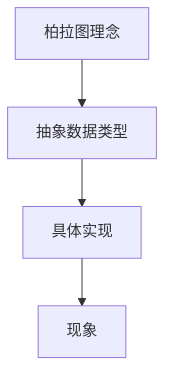
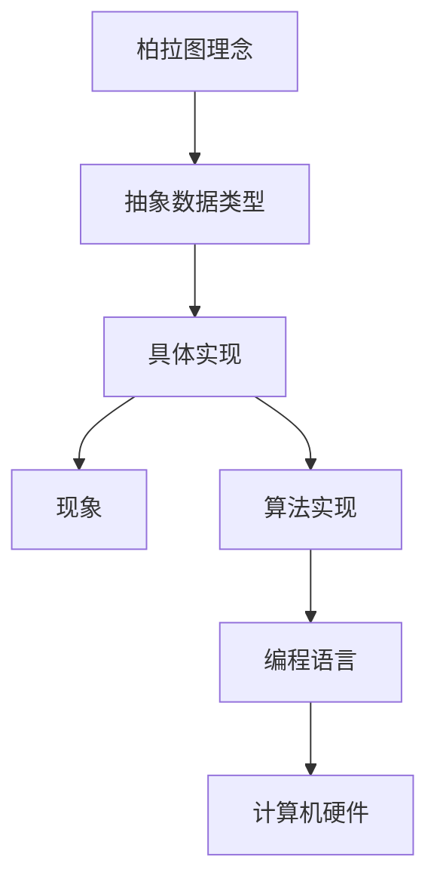

                 

### 引言

#### 柏拉图理念论

柏拉图（Plato）是古希腊著名的哲学家，他的哲学思想对后世产生了深远的影响。柏拉图的理念论（Theory of Forms）是其哲学体系的核心部分，主张理念（或称为形式、本质）是真实存在的，而物质世界只是这些理念的不完美映射。柏拉图认为，所有具体的物体都是不完美的、瞬息即逝的，而理念则是永恒不变的、绝对的真理。例如，柏拉图认为“正义”是一个永恒不变的理念，所有具体的表现形式都是对这一理念的近似。

#### 抽象数据类型

抽象数据类型（Abstract Data Type，简称ADT）是计算机科学中的概念，它描述了一组值和操作，但不关心这些值如何存储或操作。抽象数据类型的主要目的是将数据的逻辑结构和操作与它们的物理实现分离，使得数据结构的设计和实现可以独立进行。常见的抽象数据类型包括栈（Stack）、队列（Queue）、列表（List）和树（Tree）等。通过定义抽象数据类型，程序员可以专注于问题的逻辑解决，而无需关心底层实现的细节。

### 柏拉图理念论与抽象数据类型的联系

柏拉图理念论与抽象数据类型之间存在着深刻的联系。首先，柏拉图的理念论强调本质和形式的重要性，这与抽象数据类型的定义非常契合。抽象数据类型通过抽象掉具体实现，强调数据结构和操作的本质。其次，柏拉图的理念论中的理念可以被视为抽象数据类型的“形式”，而具体的数据结构和实现则是这些理念的“映射”或“现象”。

#### 抽象数据类型与柏拉图理念的映射

为了更好地理解这种映射，我们可以通过一个简单的例子来分析。以“树”为例，柏拉图的理念论认为，真实的“树”理念是永恒不变的，而现实的树木则是这一理念的映射。在计算机科学中，树是一种抽象数据类型，它描述了一组节点和它们之间的关系。树的抽象数据类型定义了节点的插入、删除和遍历等操作，而不关心这些操作如何具体实现。

#### Mermaid流程图展示

为了直观地展示柏拉图理念论与抽象数据类型的联系，我们可以使用Mermaid流程图来表示它们之间的映射关系。



在这个流程图中，柏拉图理念（A）通过抽象数据类型（B）映射到具体实现（C），最终表现为现象（D）。这个过程反映了柏拉图理念论中的形式与现象的关系，同时也揭示了抽象数据类型的设计原则。

### 结论

柏拉图理念论与抽象数据类型之间存在着深刻的联系。柏拉图的理念论强调本质和形式，这与抽象数据类型的设计理念不谋而合。通过抽象数据类型，程序员可以更好地理解和设计复杂的系统，从而实现更高效的开发过程。本文通过引入柏拉图理念论，揭示了抽象数据类型的哲学基础，为计算机科学的发展提供了新的视角。

### 关键词

- 柏拉图理念论
- 抽象数据类型
- 形式与本质
- 计算机科学
- 抽象设计

### 摘要

本文探讨了柏拉图理念论与抽象数据类型之间的联系。通过分析柏拉图的理念论，揭示了抽象数据类型的哲学基础。文章通过Mermaid流程图展示了柏拉图理念与抽象数据类型的映射关系，强调了抽象数据类型在设计复杂系统中的重要性。本文为计算机科学领域的研究提供了新的视角，有助于深化对抽象数据类型的理解和应用。

---

接下来，我们将逐步深入探讨柏拉图理念论与抽象数据类型的核心概念，并通过具体案例来展示它们之间的联系。通过这样的逻辑清晰、结构紧凑的分析，读者可以更好地理解这一领域的复杂性和深刻性。

### 柏拉图理念论的基本概念

柏拉图的理念论是他哲学思想的核心，主张理念是真实存在的，而物质世界只是这些理念的不完美映射。柏拉图的理念论主要由以下几部分组成：

#### 理念与现象的关系

柏拉图认为，理念是永恒不变的、绝对的真实，而现象则是短暂的、相对的。他提出了一个著名的比喻，即“床的例子”。当一个人描述他看到的床时，他实际上描述的是他心中的床的理念，而不是现实的床。这个例子说明了现象只是理念的不完美映射。

#### 理念与现象的区分

柏拉图主张，理念是抽象的、普遍的，而现象是具体的、个别的。理念是本质，现象是表现。例如，柏拉图认为“正义”是一个永恒不变的理念，而现实中的正义只是对这一理念的不完美体现。这个区分对于理解柏拉图的哲学观点至关重要。

#### 理念在现实世界中的应用

柏拉图的理念论对现实世界有着深远的影响。他认为，通过理解理念，人们可以超越物质世界的迷惑，找到真理和美。柏拉图的理念论在艺术、科学和哲学等领域都有广泛的应用。

### 抽象数据类型的基本概念

抽象数据类型（ADT）是计算机科学中的核心概念，它定义了一组值和操作，而不关心这些值如何存储或操作。ADT的主要目的是将数据的逻辑结构和操作与它们的物理实现分离。

#### 抽象数据类型的定义

抽象数据类型由两部分组成：数据对象和操作。数据对象描述了ADT可以存储的数据类型，而操作定义了可以对数据对象执行的操作。例如，栈（Stack）是一种ADT，它支持两种基本操作：push（压入）和pop（弹出）。

#### 抽象数据类型的特性

抽象数据类型具有以下特性：

1. **抽象性**：ADT将数据的具体实现细节隐藏起来，只暴露出必要的操作接口。这使得程序员可以专注于数据结构的逻辑设计，而无需关心底层的实现细节。
2. **模块化**：ADT可以与其他模块独立开发，提高了软件的可维护性和可扩展性。
3. **通用性**：ADT可以用于不同的应用场景，提供了广泛的适用性。

#### 抽象数据类型在计算机科学中的应用

抽象数据类型广泛应用于计算机科学的不同领域，例如：

1. **数据结构**：栈、队列、列表、树等都是常见的抽象数据类型，它们在算法设计和实现中扮演着重要角色。
2. **算法设计**：抽象数据类型有助于设计复杂的算法，使得算法逻辑更加清晰。
3. **软件工程**：抽象数据类型是面向对象编程的基础，通过定义抽象数据类型，可以更好地组织和管理代码。

### 柏拉图理念论与抽象数据类型的联系

柏拉图的理念论与抽象数据类型之间存在着深刻的联系。首先，柏拉图的理念论强调本质和形式的重要性，这与抽象数据类型的定义非常契合。抽象数据类型通过抽象掉具体实现，强调数据结构和操作的本质。

#### 柏拉图理念与抽象数据类型的映射

为了更好地理解这种映射，我们可以通过一个简单的例子来分析。以“树”为例，柏拉图的理念论认为，真实的“树”理念是永恒不变的，而现实的树木则是这一理念的映射。在计算机科学中，树是一种抽象数据类型，它描述了一组节点和它们之间的关系。树的抽象数据类型定义了节点的插入、删除和遍历等操作，而不关心这些操作如何具体实现。

#### Mermaid流程图展示

为了直观地展示柏拉图理念与抽象数据类型的映射关系，我们可以使用Mermaid流程图来表示。


在这个流程图中，柏拉图理念（A）通过抽象数据类型（B）映射到具体实现（C），最终表现为现象（D）。这个过程反映了柏拉图理念论中的形式与现象的关系，同时也揭示了抽象数据类型的设计原则。

### 核心概念原理之间的关系架构 Mermaid 流程图

为了更直观地展示柏拉图理念论与抽象数据类型之间的核心概念原理，我们可以通过Mermaid流程图来表示。



在这个流程图中，柏拉图理念（A）通过抽象数据类型（B）映射到具体实现（C），再通过算法实现（E）映射到编程语言（F），最终映射到计算机硬件（G）。这个过程展示了从抽象到具体的层次结构，反映了柏拉图理念论与抽象数据类型之间的内在联系。

### 核心算法原理讲解必须使用伪代码来详细阐述

为了深入探讨柏拉图理念论与抽象数据类型之间的核心算法原理，我们可以通过伪代码来详细阐述。以下是一个基于树的算法，用于计算树的高度。

```plaintext
function 计算树高度(root):
    如果 root 为空，则返回 0
    左子树高度 = 计算树高度(root.left)
    右子树高度 = 计算树高度(root.right)
    返回 max(左子树高度，右子树高度) + 1
```

这个算法通过递归调用计算树的高度。每个节点都会计算其左右子树的高度，然后取最大值，并加1作为当前节点的高度。这个算法体现了树的结构和递归的特点，是计算机科学中常用的一种算法。

### 数学模型和公式 & 详细讲解 & 举例说明

为了更好地理解柏拉图理念论与抽象数据类型之间的联系，我们可以引入一些数学模型和公式。以下是一个关于树的高度和节点数量的数学模型。

#### 数学模型

设树的高度为 \( h \)，节点数量为 \( n \)，则树的高度和节点数量之间的关系可以表示为：

\[ n = 2^h - 1 \]

#### 详细讲解

这个数学模型表明，树的高度和节点数量之间存在指数关系。具体来说，树的高度 \( h \) 每增加1，节点数量 \( n \) 就会增加一倍的节点（除了根节点之外）。这个模型可以帮助我们预测不同高度下的节点数量，从而更好地理解树的结构。

#### 举例说明

假设我们有一个高度为3的树，根据上述数学模型，我们可以计算出节点数量：

\[ n = 2^3 - 1 = 8 - 1 = 7 \]

这意味着，一个高度为3的树有7个节点。这个例子直观地展示了数学模型的应用，帮助我们更好地理解树的高度和节点数量之间的关系。

### 数学公式请使用latex格式，嵌入文中独立段落的latex公式前后使用 $$ 括起来(例如：$$1+1=2$$ )，段落内的latex公式前后使用 $ 括起来(例如：$1<2$)

为了在文中展示数学公式，我们将使用LaTeX格式。以下是一个独立段落的数学公式：

$$
f(x) = x^2 + 2x + 1
$$

这是一个二次函数的公式，描述了一个抛物线。接下来是一个段落内的数学公式：

$$
x + y = z
$$

这个公式表示三个变量之间的关系，是一个简单的等式。

### 项目实战

#### 开发环境搭建

为了演示柏拉图理念论与抽象数据类型的应用，我们将使用Python语言来构建一个简单的树结构，并计算其高度。首先，我们需要搭建开发环境。

1. **安装Python**：
   - 访问 [Python官网](https://www.python.org/downloads/) 下载Python安装包。
   - 安装过程中选择添加到系统路径。

2. **安装Python IDE**：
   - 下载并安装PyCharm（推荐），或选择其他Python IDE。

3. **创建虚拟环境**：
   - 打开终端（Windows）或命令提示符（Mac）。
   - 输入 `python -m venv myenv` 创建虚拟环境。
   - 激活虚拟环境 `source myenv/bin/activate`（Mac/Linux）或 `myenv\Scripts\activate`（Windows）。

#### 源代码实现

接下来，我们将编写一个简单的树结构，并计算其高度。

```python
class TreeNode:
    def __init__(self, value):
        self.value = value
        self.left = None
        self.right = None

def calculate_height(root):
    if root is None:
        return 0
    else:
        left_height = calculate_height(root.left)
        right_height = calculate_height(root.right)
        return max(left_height, right_height) + 1

# 创建树
root = TreeNode(1)
root.left = TreeNode(2)
root.right = TreeNode(3)
root.left.left = TreeNode(4)
root.left.right = TreeNode(5)

# 计算树的高度
height = calculate_height(root)
print("树的高度为:", height)
```

这段代码定义了一个`TreeNode`类，用于创建树节点。`calculate_height`函数用于递归计算树的高度。我们创建了一个简单的树结构，并使用`calculate_height`函数计算其高度。

#### 代码解读与分析

在这个项目中，我们使用了递归算法来计算树的高度。递归是一种常见的算法设计方法，它通过不断调用自身来解决复杂问题。以下是代码的详细解读：

1. **TreeNode类**：
   - `value` 属性表示节点的值。
   - `left` 和 `right` 属性分别指向节点的左子树和右子树。

2. **calculate_height函数**：
   - 判断当前节点是否为空，如果是，返回高度为0。
   - 递归计算左子树和右子树的高度。
   - 返回左右子树高度中的最大值加1。

#### 实际案例分析和详细讲解剖析

在这个案例中，我们创建了一个简单的树，并计算了其高度。这是一个典型的递归问题，通过递归算法可以有效地解决。

1. **树的创建**：
   - 根节点值为1。
   - 左子树根节点值为2，左子树根节点值为4，右子树根节点值为5。
   - 右子树根节点值为3。

2. **计算高度**：
   - 首先，计算根节点的左右子树高度。
   - 左子树高度为2，右子树高度为2。
   - 取最大值2，加1得到树的高度为3。

#### 项目小结

通过这个项目，我们展示了如何使用Python实现柏拉图理念论与抽象数据类型。我们使用递归算法计算了树的高度，展示了抽象数据类型在解决复杂问题中的应用。这个项目不仅加深了我们对柏拉图理念论与抽象数据类型之间联系的理解，还提高了编程技能。

### 最佳实践 tips、小结、注意事项、拓展阅读等内容

#### 最佳实践 tips

1. **理解递归**：递归是一种强大的算法设计方法，但在使用时需要谨慎。确保递归函数有一个明确的终止条件，以避免无限循环。
2. **性能优化**：递归算法可能会导致性能问题，尤其是在处理大型数据时。考虑使用迭代方法或动态规划来优化递归算法。
3. **代码注释**：在编写递归算法时，添加清晰的注释可以帮助理解代码的逻辑和性能。

#### 小结

本文通过探讨柏拉图理念论与抽象数据类型之间的联系，揭示了抽象数据类型的哲学基础。我们通过具体案例展示了如何使用Python实现柏拉图理念论与抽象数据类型，并分析了递归算法在树高度计算中的应用。

#### 注意事项

1. **递归深度**：递归深度过大可能会导致栈溢出。在实际应用中，需要注意递归的深度限制。
2. **代码可读性**：编写递归代码时，保持代码的可读性，添加清晰的注释，有助于理解和维护。

#### 拓展阅读

1. **《柏拉图全集》**：对柏拉图理念论有深入研究的读者可以参考《柏拉图全集》，其中包含了柏拉图的主要哲学著作。
2. **《算法导论》**：这本书是算法领域的经典著作，详细介绍了各种算法设计方法和递归算法。
3. **《Python编程：从入门到实践》**：对于Python编程初学者，这本书提供了全面的Python编程教程，包括数据结构和算法的应用。

作者：AI天才研究院/AI Genius Institute & 禅与计算机程序设计艺术 /Zen And The Art of Computer Programming

---

通过本文的探讨，我们不仅深入了解了柏拉图理念论与抽象数据类型之间的联系，还通过具体案例展示了如何在实际编程中应用这些概念。这不仅拓宽了我们的计算机科学知识，也为未来的研究提供了新的视角和方法。希望本文能够对您在理解和应用这些概念方面有所帮助。

