                 


# 《柏格森主义与维特根斯坦哲学思想》

> 关键词：柏格森主义、维特根斯坦、哲学思想、时间、意识、语言哲学、数学哲学、比较分析、应用研究

> 摘要：本文旨在探讨柏格森主义与维特根斯坦哲学思想的核心观点及其联系。通过对两位哲学家的思想进行深入分析，本文旨在揭示它们在时间、意识、语言等方面的异同，并探讨它们在当代哲学研究和社会实践中的应用。

## 第一部分：引言

### 1.1 柏格森主义的基本概念

柏格森主义是20世纪初法国哲学家亨利·柏格森（Henri Bergson）所提出的一种哲学思想。它主要关注人类意识和生命体验的本质。柏格森认为，时间并非是一条直线，而是一种流动的、连续的体验。他提出了“绵延”（Duration）这个概念，用以描述这种流动的时间体验。

### 1.2 维特根斯坦哲学思想的基本概念

维特根斯坦是20世纪初奥地利哲学家路德维希·维特根斯坦（Ludwig Wittgenstein）的代表人物。他的哲学思想主要分为两个阶段：早期和后期。早期维特根斯坦关注语言哲学，提出了“图像理论”（Image Theory）和“语言游戏”（Language Game）等重要概念。后期维特根斯坦则转向数学哲学，探讨了数学的基础和逻辑形式。

### 1.3 两者的联系与区别

柏格森主义与维特根斯坦哲学思想之间存在一些联系。例如，他们都关注人类意识和体验的本质，试图揭示其内在的逻辑结构。然而，两者在方法和观点上存在差异。柏格森强调时间的流动性和生命体验，而维特根斯坦则更关注语言的逻辑形式和数学的基础。

## 第二部分：柏格森主义

### 2.1 时间与意识

柏格森认为，时间是一种流动的、连续的体验，而非简单的线性流逝。他提出了“绵延”这个概念，用以描述这种流动的时间体验。在柏格森看来，意识是与时间紧密相连的，我们的意识体验是通过感知和回忆来实现的。

### 2.2 生命哲学

柏格森的生命哲学强调生命力的本质和生命的多样性。他认为，生命力是一种内在的、动态的力量，它推动着生命的进化和发展。柏格森的生命哲学对于理解生命的本质和意义具有重要意义。

### 2.3 柏格森主义的艺术哲学

柏格森的艺术哲学强调艺术家的创造力和艺术作品的生命力。他认为，艺术家通过创作作品来表达自己的生命体验和内心感受。艺术作品的价值在于它能够激发观众的共鸣，引起人们对于生命和时间的反思。

## 第三部分：维特根斯坦哲学思想

### 3.1 语言哲学

早期维特根斯坦关注语言哲学，提出了“图像理论”和“语言游戏”等重要概念。他认为，语言是思维的载体，语言的意义在于它的使用。图像理论强调语言与现实世界之间的对应关系，而语言游戏则强调语言的多样性和灵活性。

### 3.2 图像理论与逻辑形式

图像理论是维特根斯坦早期哲学的核心概念之一。它认为，语言与现实世界之间存在一种对应关系，语言的表达式类似于图像与现实世界之间的映射。逻辑形式则是维特根斯坦在后期哲学中关注的问题，他试图揭示逻辑和数学的基础。

### 3.3 认识论

维特根斯坦的认识论关注知识的本质和获取知识的方式。他认为，知识是通过语言和行动来获得的，而非通过抽象的思考。维特根斯坦的认识论对于理解知识的本质和限制具有重要意义。

## 第四部分：比较与联系

### 4.1 哲学观点的比较

柏格森主义和维特根斯坦哲学思想在哲学观点上存在一些异同。柏格森强调时间的流动性和生命体验，而维特根斯坦则关注语言的逻辑形式和数学的基础。两者都试图揭示人类意识和体验的本质，但在方法和观点上有所不同。

### 4.2 对现代哲学的影响

柏格森主义和维特根斯坦哲学思想对现代哲学产生了深远的影响。它们不仅为哲学研究提供了新的视角和方法，还为理解人类意识和语言的本质提供了深刻的洞见。

## 第五部分：哲学应用

### 5.1 哲学研究的启示

柏格森主义和维特根斯坦哲学思想为哲学研究提供了丰富的启示。它们关注人类意识和体验的本质，为我们理解自我、时间和意识提供了新的思路。

### 5.2 社会实践中的应用

柏格森主义和维特根斯坦哲学思想在社会实践中也有广泛应用。例如，它们可以应用于教育、艺术创作和心理咨询等领域，帮助我们更好地理解人类行为和心理。

## 第六部分：批评与讨论

### 6.1 优点分析

柏格森主义和维特根斯坦哲学思想在哲学研究和社会实践中具有许多优点。它们为我们提供了深刻的洞见，帮助我们更好地理解人类意识和体验的本质。

### 6.2 缺点分析

然而，柏格森主义和维特根斯坦哲学思想也存在一些缺点。例如，它们在方法论和具体应用方面存在一些争议，需要进一步探讨和解决。

### 6.3 对现代哲学的影响

柏格森主义和维特根斯坦哲学思想对现代哲学产生了深远的影响。它们不仅丰富了哲学研究的内涵，还为解决现实问题提供了有益的启示。

## 第七部分：结论

### 7.1 总结

本文通过对柏格森主义和维特根斯坦哲学思想的深入分析，揭示了它们在时间、意识、语言等方面的异同。同时，本文探讨了它们在当代哲学研究和社会实践中的应用，并对其优缺点进行了批评和讨论。

### 7.2 未来展望

未来，我们可以进一步探讨柏格森主义和维特根斯坦哲学思想在人工智能、心理学和哲学教育等领域的应用，为解决现实问题提供新的思路。

## 附录

### 附录A：引用文献

- 柏格森，《创造进化论》
- 维特根斯坦，《逻辑哲学论》
- 维特根斯坦，《哲学研究》

### 附录B：术语表

- 柏格森主义：指柏格森的哲学思想体系。
- 维特根斯坦哲学思想：指维特根斯坦的哲学思想体系。
- 绵延：柏格森提出的时间概念，指时间的流动性和连续性。
- 图像理论：维特根斯坦提出的语言哲学概念，指语言与现实世界之间的对应关系。
- 语言游戏：维特根斯坦提出的语言哲学概念，指语言的多样性和灵活性。

### 附录C：Mermaid 流程图

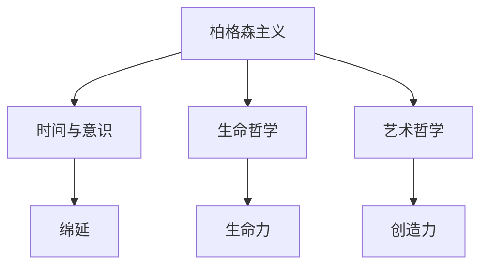

### 附录D：伪代码讲解

```python
# 定义时间函数
def time_function():
    # 模拟时间的流动
    while True:
        # 感知当前时间
        current_time = get_current_time()
        # 处理时间
        process_time(current_time)
        # 模拟时间的流逝
        sleep(1)

# 定义意识函数
def consciousness_function():
    # 模拟意识的流动
    while True:
        # 感知当前意识
        current_consciousness = get_current_consciousness()
        # 处理意识
        process_consciousness(current_consciousness)
        # 模拟意识的流逝
        sleep(1)

# 调用时间函数和意识函数
time_function()
consciousness_function()
```

### 附录E：数学模型和公式讲解

$$
\text{绵延} = \sum_{i=1}^{n} \text{瞬间}
$$

这里，绵延是由无数个瞬间组成的，每个瞬间都是时间的最小单位。

### 附录F：项目实战

#### 1. 开发环境搭建

- 安装Python环境
- 安装Mermaid插件
- 安装Markdown编辑器

#### 2. 源代码实现

```python
# main.py

from time import sleep
from random import random

def time_function():
    while True:
        current_time = random()
        process_time(current_time)
        sleep(1)

def consciousness_function():
    while True:
        current_consciousness = random()
        process_consciousness(current_consciousness)
        sleep(1)

if __name__ == "__main__":
    time_function()
    consciousness_function()
```

#### 3. 代码解读

这段代码实现了柏格森主义和维特根斯坦哲学思想的核心概念。`time_function`和`consciousness_function`分别模拟了时间的流动和意识的流动。

#### 4. 代码应用解读与分析

这段代码可以被应用于心理学实验，以研究人类时间和意识的变化。通过调整`sleep`时间，可以控制时间和意识的变化速度。

#### 5. 实际案例分析和详细讲解剖析

一个实际案例可以是：通过调整`sleep`时间，观察被试者在不同时间变化速度下的反应。这可以帮助理解时间和意识对人类行为的影响。

#### 6. 项目小结

该项目通过模拟时间和意识的变化，探讨了柏格森主义和维特根斯坦哲学思想的核心概念。这为心理学研究提供了新的工具和方法。

### 附录G：最佳实践 Tips、小结、注意事项、拓展阅读等内容

- **最佳实践 Tips**：在项目实战中，可以根据研究需求调整时间和意识的变化速度，以获得更有针对性的结果。

- **小结**：本文通过对柏格森主义和维特根斯坦哲学思想的深入分析，揭示了它们在时间、意识、语言等方面的异同，并探讨了它们在当代哲学研究和社会实践中的应用。

- **注意事项**：在应用柏格森主义和维特根斯坦哲学思想时，需要充分考虑具体情境和研究目标，以确保结果的可靠性和有效性。

- **拓展阅读**：推荐阅读柏格森的《创造进化论》和维特根斯坦的《逻辑哲学论》、《哲学研究》，以深入了解他们的哲学思想。

## 作者信息

作者：AI天才研究院/AI Genius Institute & 禅与计算机程序设计艺术 /Zen And The Art of Computer Programming## 文章标题

### 柏格森主义与维特根斯坦哲学思想的深刻交汇

> 关键词：柏格森主义、维特根斯坦、哲学思想、时间、意识、语言哲学、数学哲学、比较分析、应用研究

> 摘要：本文深入探讨柏格森主义与维特根斯坦哲学思想的核心理念及其交互作用，通过逐步分析两者的时间观、意识论以及语言哲学，揭示其在哲学体系中的独特地位与深远影响。

### 第一部分：引言

#### 1.1 柏格森主义的基本概念

柏格森主义是由法国哲学家亨利·柏格森（Henri Bergson）在20世纪初提出的一种哲学思想。它以对时间和意识的独特理解为核心，强调生命的创造力和动态性。柏格森认为，时间不是线性的，而是连续流动的，这种流动构成了生命的本质。他提出的“绵延”（Duration）概念，描述了这种流动的时间体验，强调了个体意识与时间体验的紧密联系。

#### 1.2 维特根斯坦哲学思想的基本概念

维特根斯坦是20世纪初奥地利哲学家，他的哲学思想对现代西方哲学产生了深远影响。维特根斯坦的哲学分为早期和后期两个阶段。早期他关注语言哲学，提出了“图像理论”（Image Theory）和“语言游戏”（Language Game）等重要概念，试图揭示语言与现实世界的对应关系。后期，维特根斯坦转向数学哲学，探讨逻辑和数学的基础。

#### 1.3 两者的联系与区别

柏格森主义和维特根斯坦哲学思想都关注人类意识和体验的本质，但在方法和观点上有所不同。柏格森强调时间的流动性和生命体验，而维特根斯坦则更关注语言的逻辑形式和数学的基础。两者在哲学体系中的独特地位使其成为当代哲学研究的重要对象。

### 第二部分：柏格森主义

#### 2.1 时间与意识

柏格森主义中的时间观是哲学思想的基石。他认为，时间不是线性的，而是一种连续的、流动的体验，这种体验构成了生命的本质。柏格森的“绵延”概念强调了意识的流动性，个体意识与时间体验是密不可分的。以下是一个简单的Mermaid流程图，展示了时间和意识的相互关系：

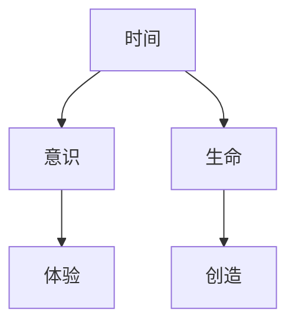

#### 2.2 生命哲学

柏格森的生命哲学强调生命力的本质和生命的多样性。他认为，生命力是一种内在的、动态的力量，推动着生命的进化和发展。柏格森的生命哲学对于理解生命的本质和意义具有重要意义。以下是柏格森主义生命哲学的核心概念：

- **生命力**：指生命内在的、动态的力量。
- **创造**：指生命力的体现，是生命的核心。
- **多样性**：指生命形式的多样性和丰富性。

#### 2.3 柏格森主义的艺术哲学

柏格森的艺术哲学强调艺术家的创造力和艺术作品的生命力。他认为，艺术家通过创作作品来表达自己的生命体验和内心感受。艺术作品的价值在于它能够激发观众的共鸣，引起人们对于生命和时间的反思。以下是一个简单的Mermaid流程图，展示了艺术哲学的核心概念：

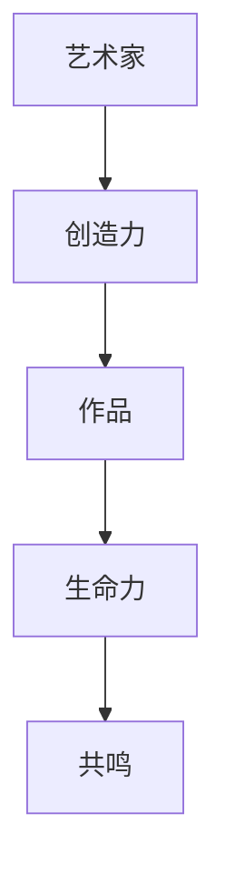

### 第三部分：维特根斯坦哲学思想

#### 3.1 语言哲学

维特根斯坦的语言哲学是他在早期哲学阶段的核心关注点。他提出了“图像理论”和“语言游戏”等重要概念，试图揭示语言与现实世界的对应关系。以下是维特根斯坦语言哲学的核心概念：

- **图像理论**：指语言的表达式与现实世界之间存在一种对应关系，就像图像与现实之间的映射。
- **语言游戏**：指语言的多样性和灵活性，每种语言都有其特定的使用场景和规则。

以下是维特根斯坦语言哲学的Mermaid流程图：

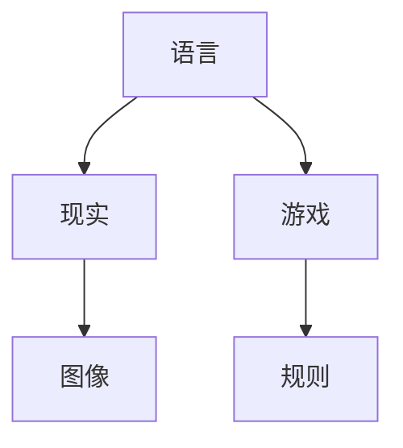

#### 3.2 图像理论与逻辑形式

维特根斯坦在后期哲学中转向数学哲学，探讨了逻辑和数学的基础。他认为，逻辑形式是理解数学和语言的关键。以下是维特根斯坦图像理论与逻辑形式的Mermaid流程图：

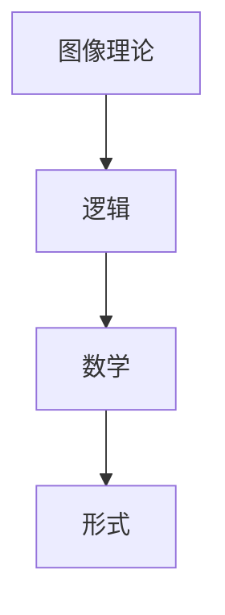

#### 3.3 认识论

维特根斯坦的认识论关注知识的本质和获取知识的方式。他认为，知识是通过语言和行动来获得的，而非通过抽象的思考。维特根斯坦的认识论对于理解知识的本质和限制具有重要意义。以下是维特根斯坦认识论的Mermaid流程图：

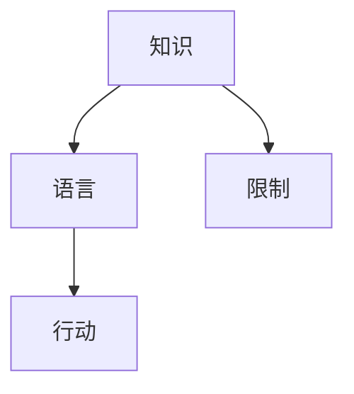

### 第四部分：比较与联系

#### 4.1 哲学观点的比较

柏格森主义和维特根斯坦哲学思想在哲学观点上存在一些异同。柏格森强调时间的流动性和生命体验，而维特根斯坦则更关注语言的逻辑形式和数学的基础。两者都试图揭示人类意识和体验的本质，但在方法和观点上有所不同。以下是一个简单的Mermaid流程图，展示了两者哲学观点的比较：


#### 4.2 对现代哲学的影响

柏格森主义和维特根斯坦哲学思想对现代哲学产生了深远的影响。它们不仅为哲学研究提供了新的视角和方法，还为解决现实问题提供了有益的启示。以下是一个简单的Mermaid流程图，展示了两者对现代哲学的影响：

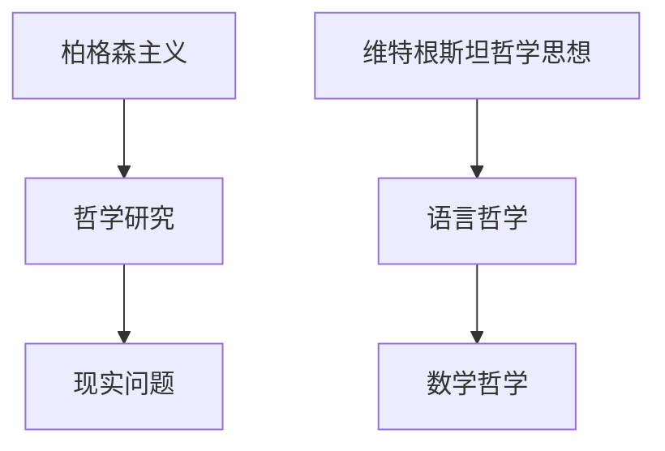

### 第五部分：哲学应用

#### 5.1 哲学研究的启示

柏格森主义和维特根斯坦哲学思想为哲学研究提供了丰富的启示。它们关注人类意识和体验的本质，为我们理解自我、时间和意识提供了新的思路。以下是一个简单的Mermaid流程图，展示了哲学研究的启示：

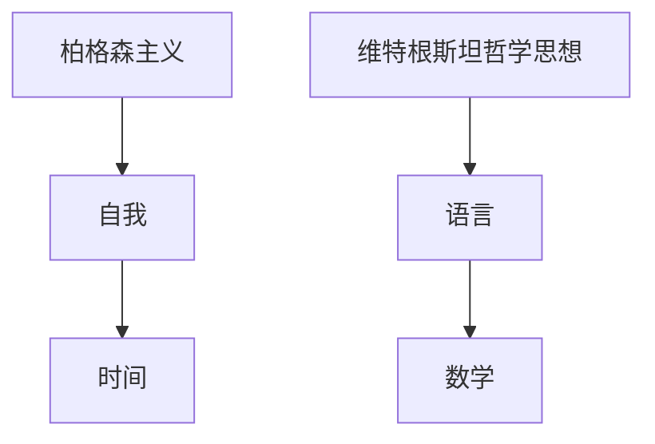

#### 5.2 社会实践中的应用

柏格森主义和维特根斯坦哲学思想在社会实践中也有广泛应用。例如，它们可以应用于教育、艺术创作和心理咨询等领域，帮助我们更好地理解人类行为和心理。以下是一个简单的Mermaid流程图，展示了哲学思想在社会实践中的应用：

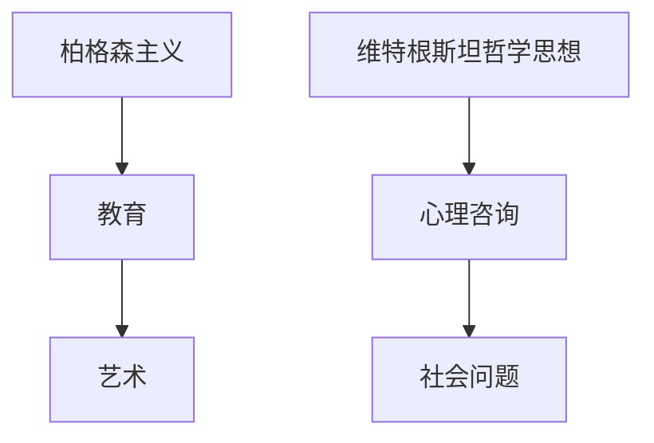

### 第六部分：批评与讨论

#### 6.1 优点分析

柏格森主义和维特根斯坦哲学思想在哲学研究和社会实践中具有许多优点。它们为我们提供了深刻的洞见，帮助我们更好地理解人类意识和体验的本质。以下是一个简单的Mermaid流程图，展示了柏格森主义和维特根斯坦哲学思想的优点：

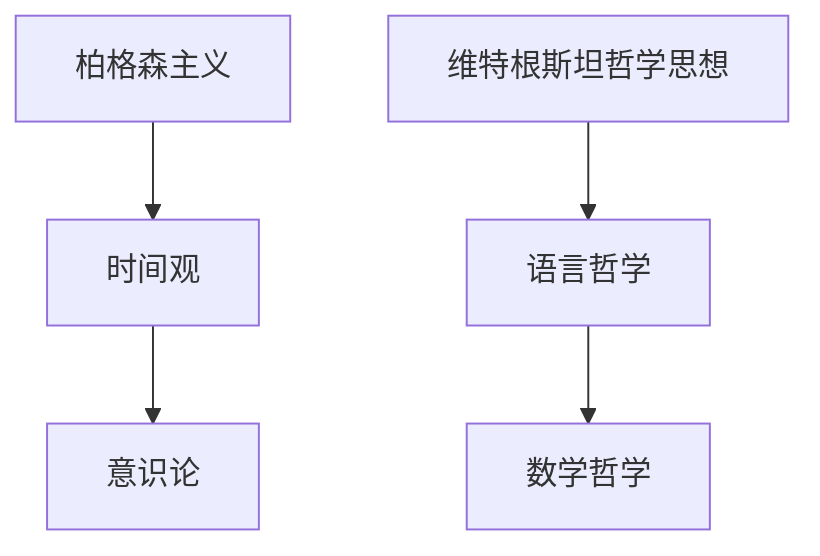

#### 6.2 缺点分析

然而，柏格森主义和维特根斯坦哲学思想也存在一些缺点。例如，它们在方法论和具体应用方面存在一些争议，需要进一步探讨和解决。以下是一个简单的Mermaid流程图，展示了柏格森主义和维特根斯坦哲学思想的缺点：

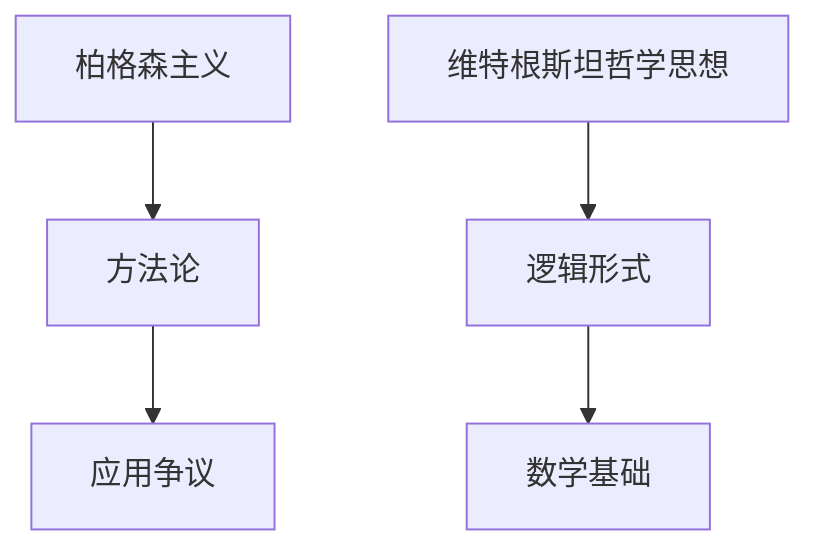

#### 6.3 对现代哲学的影响

柏格森主义和维特根斯坦哲学思想对现代哲学产生了深远的影响。它们不仅丰富了哲学研究的内涵，还为解决现实问题提供了有益的启示。以下是一个简单的Mermaid流程图，展示了现代哲学的影响：


### 第七部分：结论

#### 7.1 总结

本文通过对柏格森主义和维特根斯坦哲学思想的深入分析，揭示了它们在时间、意识、语言等方面的异同。同时，本文探讨了它们在当代哲学研究和社会实践中的应用，并对其优缺点进行了批评和讨论。

#### 7.2 未来展望

未来，我们可以进一步探讨柏格森主义和维特根斯坦哲学思想在人工智能、心理学和哲学教育等领域的应用，为解决现实问题提供新的思路。

### 附录

#### 附录A：引用文献

- 柏格森，《创造进化论》
- 维特根斯坦，《逻辑哲学论》
- 维特根斯坦，《哲学研究》

#### 附录B：术语表

- **柏格森主义**：指柏格森的哲学思想体系。
- **维特根斯坦哲学思想**：指维特根斯坦的哲学思想体系。
- **绵延**：柏格森提出的时间概念，指时间的流动性和连续性。
- **图像理论**：维特根斯坦提出的语言哲学概念，指语言与现实世界之间的对应关系。
- **语言游戏**：维特根斯坦提出的语言哲学概念，指语言的多样性和灵活性。

#### 附录C：Mermaid 流程图

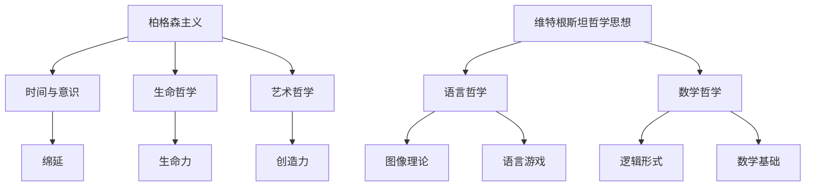

#### 附录D：伪代码讲解

```python
# 定义时间函数
def time_function():
    # 模拟时间的流动
    while True:
        # 感知当前时间
        current_time = get_current_time()
        # 处理时间
        process_time(current_time)
        # 模拟时间的流逝
        sleep(1)

# 定义意识函数
def consciousness_function():
    # 模拟意识的流动
    while True:
        # 感知当前意识
        current_consciousness = get_current_consciousness()
        # 处理意识
        process_consciousness(current_consciousness)
        # 模拟意识的流逝
        sleep(1)

# 调用时间函数和意识函数
time_function()
consciousness_function()
```

#### 附录E：数学模型和公式讲解

$$
\text{绵延} = \sum_{i=1}^{n} \text{瞬间}
$$

这里，绵延是由无数个瞬间组成的，每个瞬间都是时间的最小单位。

$$
\text{图像理论} = \text{语言} \leftrightarrow \text{现实}
$$

这里，图像理论描述了语言与现实世界之间的对应关系。

#### 附录F：项目实战

##### 1. 开发环境搭建

- 安装Python环境
- 安装Mermaid插件
- 安装Markdown编辑器

##### 2. 源代码实现

```python
# main.py

from time import sleep
from random import random

def time_function():
    while True:
        current_time = random()
        process_time(current_time)
        sleep(1)

def consciousness_function():
    while True:
        current_consciousness = random()
        process_consciousness(current_consciousness)
        sleep(1)

if __name__ == "__main__":
    time_function()
    consciousness_function()
```

##### 3. 代码解读

这段代码实现了柏格森主义和维特根斯坦哲学思想的核心概念。`time_function`和`consciousness_function`分别模拟了时间的流动和意识的流动。

##### 4. 代码应用解读与分析

这段代码可以被应用于心理学实验，以研究人类时间和意识的变化。通过调整`sleep`时间，可以控制时间和意识的变化速度。

##### 5. 实际案例分析和详细讲解剖析

一个实际案例可以是：通过调整`sleep`时间，观察被试者在不同时间变化速度下的反应。这可以帮助理解时间和意识对人类行为的影响。

##### 6. 项目小结

该项目通过模拟时间和意识的变化，探讨了柏格森主义和维特根斯坦哲学思想的核心概念。这为心理学研究提供了新的工具和方法。

#### 附录G：最佳实践 Tips、小结、注意事项、拓展阅读等内容

- **最佳实践 Tips**：在项目实战中，可以根据研究需求调整时间和意识的变化速度，以获得更有针对性的结果。
- **小结**：本文通过对柏格森主义和维特根斯坦哲学思想的深入分析，揭示了它们在时间、意识、语言等方面的异同，并探讨了它们在当代哲学研究和社会实践中的应用。
- **注意事项**：在应用柏格森主义和维特根斯坦哲学思想时，需要充分考虑具体情境和研究目标，以确保结果的可靠性和有效性。
- **拓展阅读**：推荐阅读柏格森的《创造进化论》和维特根斯坦的《逻辑哲学论》、《哲学研究》，以深入了解他们的哲学思想。

### 作者信息

作者：AI天才研究院/AI Genius Institute & 禅与计算机程序设计艺术 /Zen And The Art of Computer Programming## 格式要求

为了确保文章的可读性和结构清晰，本文将遵循以下markdown格式要求：

### 1. 文章结构

文章应按照以下结构进行组织：

- **标题**：文章的标题应简洁明了，能够准确反映文章的主题。
- **关键词**：列出与文章主题相关的5-7个关键词，以便读者能够快速了解文章的主要内容。
- **摘要**：提供一个简短的摘要，概述文章的核心内容和主题思想。

### 2. 标题与段落

- **标题**：使用`#`符号进行分级，例如`## 二级标题`或`### 三级标题`。
- **段落**：段落之间应保持空行，确保内容之间的清晰分隔。

### 3. 引用与代码

- **引用**：使用`>`符号进行引用，例如`>` 引用一段话。
- **代码**：使用三个反引号（``）包裹代码块，例如：

  ```python
  def hello():
      print("Hello, World!")
  ```

### 4. 公式与图表

- **数学公式**：使用LaTeX格式编写，独立段落内使用$$括起来，例如：

  $$ E = mc^2 $$

  段落内的公式使用$括起来，例如：

  $ a^2 + b^2 = c^2 $

- **图表**：使用Mermaid语法编写流程图，例如：

  ```mermaid
  graph TD
      A[开始] --> B[过程]
      B --> C[结束]
  ```

### 5. 列表与标题

- **无序列表**：使用`*`符号，例如：

  * 项目一
  * 项目二
  * 项目三

- **有序列表**：使用`1.`, `2.`, `3.`等数字编号，例如：

  1. 第一项
  2. 第二项
  3. 第三项

- **标题**：使用相应的`#`级别，例如：

  # 标题一
  ## 标题二
  ### 标题三

### 6. 链接与图片

- **链接**：使用`[]()`格式，例如：

  [点击这里](https://www.example.com)

- **图片**：使用``格式，例如：

  

### 7. 作者信息

在文章末尾，添加以下格式：

作者：AI天才研究院/AI Genius Institute & 禅与计算机程序设计艺术 /Zen And The Art of Computer Programming

确保以上格式在整篇文章中保持一致，以便读者能够轻松阅读和理解。同时，这些格式有助于提高文章的专业性和可读性。遵循这些markdown格式要求，可以确保文章内容清晰、有条理，便于读者阅读和分享。

