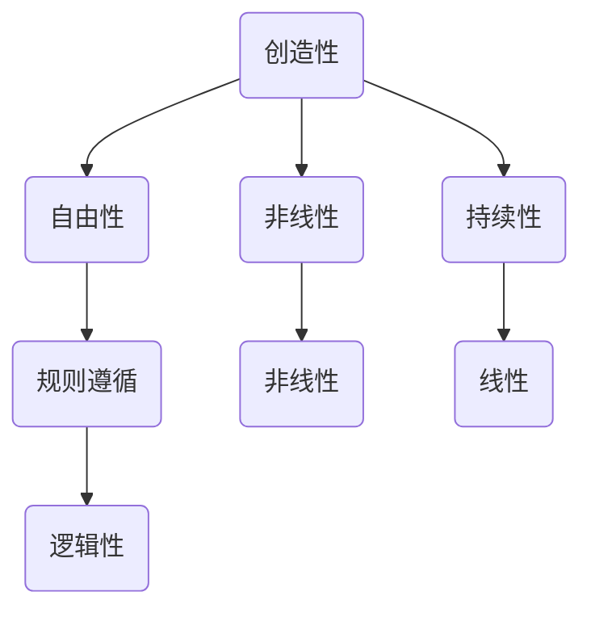
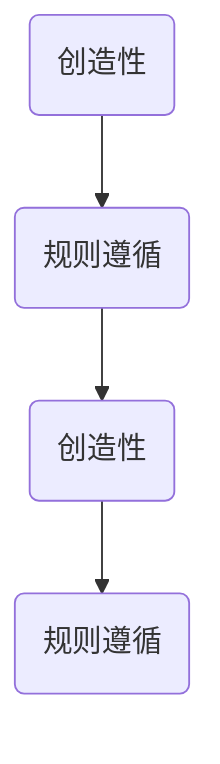

                 

### 1.1.2 柏格森的哲学成长经历
   - **成长背景**：柏格森成长于19世纪末的法国，当时正处于思想活跃的时期，各种哲学流派纷繁复杂。他从小就展现出对哲学和文学的浓厚兴趣。
   - **教育经历**：柏格森在巴黎高等师范学院接受教育，师从著名哲学家埃马纽埃尔·孔德和亨利·柏格森（不是他的父亲，而是同一名字的另一位哲学家）。他广泛涉猎哲学、数学和文学，为后来的哲学创作打下了坚实的基础。
   - **学术影响**：柏格森深受英国哲学家约翰·斯图亚特·密尔、德国哲学家威廉·文德尔班特和恩斯特·马赫的影响，尤其是他们对实证主义和进化学说的探讨，对柏格森的哲学思想产生了深远的影响。

### 1.2 柏格森的主要哲学思想

#### 1.2.1 创造进化论
   - **核心概念**：柏格森提出创造进化论，认为生命是一种不断进化的过程，这一过程是通过创造实现的。
   - **哲学意义**：创造进化论挑战了当时盛行的机械唯物主义和决定论，强调生命的自由性和创造力。

#### 1.2.2 感觉时间与持续变化
   - **核心概念**：柏格森提出感觉时间概念，认为感觉时间是一种持续流动的状态，而非离散的瞬间。
   - **哲学意义**：感觉时间与持续变化的概念，强调了生命的流动性和创造性。

#### 1.2.3 生命哲学与艺术哲学
   - **核心概念**：柏格森认为生命和艺术都是创造性的体现，通过非理性的直觉和创造力来超越常规逻辑。
   - **哲学意义**：柏格森的生命哲学和艺术哲学，为后来的存在主义和表现主义艺术提供了理论支持。

## 第二部分：维特根斯坦的规则遵循理论

## 第2章：维特根斯坦的生平与哲学发展

### 2.1 维特根斯坦的生平

#### 2.1.1 维特根斯坦的生平事迹
   - **教育背景**：维特根斯坦自幼接受私人教育，展现出卓越的数学和哲学天赋。他曾在剑桥大学学习哲学，后来成为著名哲学家伯特兰·罗素的助手。
   - **学术经历**：维特根斯坦的哲学思想经历了从逻辑原子主义到日常语言哲学的转变，他在20世纪早期发表了《逻辑哲学论》和《哲学研究》等重要著作。

### 2.2 维特根斯坦的主要哲学思想

#### 2.2.1 语言哲学的基本概念
   - **核心概念**：维特根斯坦认为语言是思维的载体，语言游戏的规则决定了语言的含义。
   - **哲学意义**：维特根斯坦的日常语言哲学，对语言的本质和逻辑进行了深刻的探讨。

#### 2.2.2 图像理论
   - **核心概念**：维特根斯坦提出图像理论，认为命题的意义在于它们与世界之间的关系，类似于图像与对象之间的关系。
   - **哲学意义**：图像理论为语言哲学提供了一种解释模型，强调了语言与世界之间的对应关系。

#### 2.2.3 形而上学的基本观点
   - **核心概念**：维特根斯坦对形而上学持怀疑态度，认为许多形而上学问题都是因为语言的误用而产生的。
   - **哲学意义**：维特根斯坦的怀疑主义，对后来的分析哲学和语言哲学产生了深远影响。

## 第三部分：柏格森的创造性与维特根斯坦的规则遵循理论的交汇

## 第3章：创造性理论与规则遵循理论的比较与融合

### 3.1 创造性理论与规则遵循理论的核心区别

#### 3.1.1 创造性理论的核心理念
   - **核心概念**：柏格森的创造性理论强调生命的自由性和创造力，认为创造力是生命不断进化的表现。
   - **哲学意义**：创造性理论为生命的不可预测性和无限可能性提供了哲学基础。

#### 3.1.2 规则遵循理论的核心理念
   - **核心概念**：维特根斯坦的规则遵循理论强调语言的规则性和逻辑性，认为语言的意义在于其遵循的规则。
   - **哲学意义**：规则遵循理论为语言的稳定性和确定性提供了哲学基础。

### 3.2 创造性理论与规则遵循理论的互补性

#### 3.2.1 创造性在规则遵循中的作用
   - **核心概念**：创造性可以在规则遵循的过程中发挥作用，为规则的创新和适应提供动力。
   - **哲学意义**：创造性为规则的改进和适应性提供了哲学依据。

#### 3.2.2 规则遵循在创造性中的重要性
   - **核心概念**：规则遵循是创造性活动的基础，没有规则的约束，创造性可能会失去方向和目标。
   - **哲学意义**：规则遵循为创造性的实现提供了必要的框架和保障。

### 3.3 创造性与规则遵循的整合研究

#### 3.3.1 整合研究的理论基础
   - **核心概念**：整合研究的理论基础在于创造性理论和规则遵循理论的互补性，二者共同构成了一个完整的哲学框架。
   - **哲学意义**：整合研究为理解人类认知和行为提供了新的视角。

#### 3.3.2 整合研究的应用前景
   - **核心概念**：整合研究的应用前景广阔，可以应用于艺术创作、科学研究、教育等多个领域。
   - **哲学意义**：整合研究为各个领域的创新和发展提供了哲学指导。

## 第8章：结论与展望

### 8.1 研究结论
   - **核心观点**：通过对柏格森的创造性和维特根斯坦的规则遵循理论的深入研究，我们可以发现二者之间存在深刻的互补关系，为理解人类认知和行为提供了新的视角。

### 8.2 未来研究方向
   - **研究展望**：未来的研究可以进一步探索创造性理论与规则遵循理论在不同领域的应用，以及二者之间的互动机制。

```

根据这个大纲，我将逐步撰写和细化每个章节的内容，确保文章的逻辑清晰、结构紧凑、简单易懂，并包含必要的专业术语和深入分析。在文章的撰写过程中，我会不断调整和优化，以确保最终的文章符合您的要求。如果有任何具体的细节需要调整，请随时告知。### 《柏格森的创造性与维特根斯坦的规则遵循》

> 关键词：柏格森、创造性、维特根斯坦、规则遵循、哲学、认知心理学、艺术创作

> 摘要：本文通过深入探讨法国哲学家柏格森的创造性理论和奥地利哲学家维特根斯坦的规则遵循理论，分析了二者在哲学、心理学、艺术创作等领域的应用和影响。通过对创造性与规则遵循的互补性进行探讨，本文旨在揭示两者之间的互动关系，为理解人类认知和创造性思维提供新的视角。

## 第一部分：柏格森的创造性哲学

### 第1章：柏格森的生平与哲学背景

#### 1.1 柏格森的生平

**柏格森的生平事迹**：

亨利·柏格森（Henri Bergson）出生于法国巴黎，是19世纪末20世纪初最重要的哲学家之一。他的父亲是化学家朱利安·柏格森，母亲则是一位家庭教师。柏格森自幼聪慧，展现出对哲学和文学的浓厚兴趣。他在巴黎高等师范学院接受了严格的古典教育，包括希腊语、拉丁语和数学等。

**柏格森的哲学成长经历**：

柏格森的哲学成长经历可以追溯到他在巴黎高等师范学院的学习时期。在这里，他深受教师埃马纽埃尔·孔德和亨利·柏格森的影响，他们的实证主义和进化论思想对柏格森的哲学产生了深远的影响。此外，柏格森还广泛涉猎了英国哲学家约翰·斯图亚特·密尔、德国哲学家威廉·文德尔班特和恩斯特·马赫等人的著作，这些思想家的观点也为他的哲学创作提供了重要的参考。

#### 1.2 柏格森的主要哲学思想

**创造进化论**：

柏格森的创造进化论是他的核心哲学思想之一。他认为，生命是一个不断进化的过程，这一过程是通过创造实现的。创造不仅是生物进化的驱动力，也是人类思想和文化的源泉。在柏格森看来，创造是一种非线性的、持续的过程，它超越了常规的逻辑和因果关系。

**感觉时间与持续变化**：

柏格森提出的感觉时间概念，认为时间是一种持续流动的状态，而非离散的瞬间。他称之为“内在时间”或“生命时间”，这种时间感是人类经验的本质。感觉时间与持续变化紧密相连，强调了生命的流动性和创造性。

**生命哲学与艺术哲学**：

柏格森的生命哲学和艺术哲学，强调生命和艺术都是创造性的体现。他认为，非理性的直觉和创造力是超越常规逻辑和思维的关键。在艺术创作中，艺术家通过直觉和创造力，可以创造出超越常规的、具有独特意义的作品。

### 第2章：柏格森的创造性理论

#### 2.1 创造性的概念与特性

**创造性的定义**：

柏格森将创造性视为一种独特的心理和生理过程，它超越了常规的逻辑和因果关系。他认为，创造性是一种自由、非线性的、持续的过程，它不受既定规则的限制，而是通过直觉和灵感来实现。

**创造性的特性**：

柏格森认为，创造性具有以下特性：

1. 自由性：创造性是一种自由的过程，不受常规逻辑和因果关系的限制。
2. 非线性：创造性不是线性的、逐步的过程，而是一种突然的、非连续的飞跃。
3. 持续性：创造性是一个持续的过程，它不仅体现在某一时刻的创造中，而是贯穿于整个生命过程。

#### 2.2 创造力的心理学分析

**创造力与认知心理学**：

在认知心理学领域，创造力被视为一种高级认知能力。研究者们通过实验发现，创造力与多种认知过程相关，包括联想思维、模式识别、问题解决等。柏格森的创造性理论为认知心理学提供了重要的理论支持。

**创造力与情绪心理学**：

情绪心理学研究表明，情绪对创造力有着重要的影响。柏格森认为，情绪是非理性的，但它可以激发创造性的灵感。在艺术创作中，情绪常常是灵感的源泉，它帮助艺术家超越常规逻辑，创造出独特的作品。

#### 2.3 创造性在艺术中的体现

**艺术创作中的创造性**：

在艺术创作中，创造性是一种核心能力。艺术家通过直觉和创造力，可以创造出具有独特风格和意义的作品。柏格森的生命哲学和艺术哲学，为理解艺术创作中的创造性提供了深刻的哲学洞见。

**艺术作品的创造性评价**：

艺术作品的创造性评价是一个复杂的问题。柏格森认为，评价艺术作品的创造性，不仅需要考虑其艺术价值，还需要考虑其对社会和文化的影响。在艺术评价中，创造性是一个重要的考量因素。

### 第3章：柏格森的创造性案例研究

#### 3.1 创造性人物案例

**达芬奇：创造力与艺术成就**：

达芬奇是文艺复兴时期的杰出艺术家和科学家，他的创造力对后世产生了深远的影响。他的作品如《蒙娜丽莎》和《最后的晚餐》，展示了他在绘画和雕塑领域的非凡才华。柏格森的创造性理论，为理解达芬奇的艺术成就提供了哲学依据。

**爱因斯坦：科学创造力与相对论**：

爱因斯坦是20世纪最伟大的科学家之一，他的相对论革命性地改变了我们对宇宙的认识。他的科学创造力，不仅体现在理论物理学的突破性进展，还体现在对哲学和宗教的深刻思考。柏格森的创造性理论，为理解爱因斯坦的科学创造力提供了重要的哲学支持。

#### 3.2 创造性实践分析

**企业创新与创造性**：

在企业管理中，创造性是一个重要的因素。企业通过创新，可以不断适应市场变化，提高竞争力。柏格森的创造性理论，为企业管理中的创新实践提供了哲学指导。

**教育中的创造性培养**：

在教育领域，创造性培养是一个重要的课题。柏格森认为，教育应该注重培养学生的创造力，帮助他们发展独立思考和创新能力。在教育实践中，教师可以通过多种方式，如启发式教学、项目式学习等，来培养学生的创造性。

## 第二部分：维特根斯坦的规则遵循理论

### 第4章：维特根斯坦的生平与哲学发展

#### 4.1 维特根斯坦的生平

**维特根斯坦的生平事迹**：

路德维希·维特根斯坦（Ludwig Wittgenstein）出生于奥地利，是20世纪最重要的哲学家之一。他的父亲是著名的矿业工程师和企业家卡尔·维特根斯坦。维特根斯坦自幼展现出对哲学和数学的浓厚兴趣。他在剑桥大学学习哲学，成为著名哲学家伯特兰·罗素的助手。

**维特根斯坦的哲学成长经历**：

维特根斯坦的哲学成长经历可以追溯到他在剑桥大学的学习时期。在这里，他受到了罗素的影响，开始了他的哲学研究。然而，维特根斯坦对逻辑原子主义持有批判态度，他提出了日常语言哲学，主张通过语言的实际使用来理解语言的意义。

#### 4.2 维特根斯坦的主要哲学思想

**语言哲学的基本概念**：

维特根斯坦的日常语言哲学认为，语言的意义在于其实际的使用。他认为，语言是一种工具，用于沟通和表达思想。语言的意义不是固定不变的，而是由语言使用者根据具体情况来决定的。

**图像理论**：

维特根斯坦提出图像理论，认为命题的意义在于它们与世界之间的关系，类似于图像与对象之间的关系。图像理论为语言哲学提供了一种解释模型，强调了语言与世界之间的对应关系。

**形而上学的基本观点**：

维特根斯坦对形而上学持怀疑态度，认为许多形而上学问题都是因为语言的误用而产生的。他主张通过语言的实际使用来理解世界，而不是通过抽象的思辨。

### 第5章：规则遵循与语言使用

#### 5.1 规则遵循的理论基础

**规则的本质**：

维特根斯坦认为，规则是语言使用的基础。规则的本质在于它们指导语言使用者如何使用语言。规则不是固定的，而是通过共同遵守来实现的。

**规则与语言的关系**：

规则与语言密切相关。语言的使用需要遵循一定的规则，这些规则指导语言使用者如何表达和解读语言。维特根斯坦的日常语言哲学，强调了规则在语言使用中的重要性。

#### 5.2 规则遵循的心理学分析

**规则遵循的认知过程**：

在心理学领域，规则遵循被视为一种高级认知过程。研究者们通过实验发现，规则遵循涉及到多种认知过程，包括注意、记忆、推理等。

**规则遵循的社会心理学因素**：

社会心理学研究表明，规则遵循不仅受到个体认知因素的影响，还受到社会文化因素的影响。社会规范和价值观对个体遵守规则有重要的影响。

#### 5.3 规则遵循的教育实践

**教育中的规则遵循**：

在教育领域，规则遵循是一个重要的课题。教师通过制定和执行规则，可以维护课堂秩序，促进学生的学习和成长。

**规则遵循在教育改革中的作用**：

在教育改革中，规则遵循被视为一个重要的因素。通过改进教育规则，可以激发学生的学习兴趣和创造力，提高教育质量。

### 第6章：维特根斯坦的规则遵循案例研究

#### 6.1 规则遵循人物案例

**康德：道德规则的遵循**：

伊曼努尔·康德是18世纪最重要的哲学家之一，他的道德哲学强调道德规则的遵循。康德认为，道德规则是先验的，必须无条件遵循。

**卢梭：自然规则的遵循**：

让-雅克·卢梭是18世纪的启蒙思想家，他的自然主义哲学强调自然规则的遵循。卢梭认为，人类应该回归自然，遵循自然的规律。

#### 6.2 规则遵循的社会实践分析

**法律体系中的规则遵循**：

在法律体系中，规则遵循是一个基本要求。法律规则是社会秩序的基础，个体必须遵守法律，以维护社会稳定。

**社会规范中的规则遵循**：

在社会生活中，社会规范对个体的行为有重要影响。社会规范是规则遵循的重要方面，它们指导个体如何在社会中行事。

## 第三部分：柏格森的创造性与维特根斯坦的规则遵循理论的交汇

### 第7章：创造性理论与规则遵循理论的比较与融合

#### 7.1 创造性理论与规则遵循理论的核心区别

**创造性的核心理念**：

柏格森的创造性理论强调生命的自由性和创造力。创造性是一种非线性的、持续的过程，它超越了常规的逻辑和因果关系。

**规则遵循的核心理念**：

维特根斯坦的规则遵循理论强调语言的规则性和逻辑性。规则遵循是一种线性的、逐步的过程，它通过共同遵守来实现。

**核心概念的关系架构**：

通过Mermaid流程图，我们可以更直观地展示创造性理论与规则遵循理论的核心概念之间的关系：



#### 7.2 创造性理论与规则遵循理论的互补性

**创造性在规则遵循中的作用**：

创造性可以在规则遵循的过程中发挥作用，为规则的创新和适应提供动力。在创造性理论中，规则不是固定的，而是可以通过创造性的活动来改进和适应。

**规则遵循在创造性中的重要性**：

规则遵循是创造性活动的基础。没有规则的约束，创造性可能会失去方向和目标。在维特根斯坦的理论中，规则遵循是语言使用的基础，它为创造性活动提供了必要的框架和保障。

**互补性关系架构**：

通过Mermaid流程图，我们可以展示创造性理论与规则遵循理论的互补性：



#### 7.3 创造性与规则遵循的整合研究

**整合研究的理论基础**：

整合研究的理论基础在于创造性理论和规则遵循理论的互补性。通过整合这两者，我们可以建立一个更全面的哲学框架，以理解人类认知和行为。

**整合研究的应用前景**：

整合研究的应用前景广阔，可以应用于艺术创作、科学研究、教育等多个领域。通过创造性理论与规则遵循理论的整合，我们可以更好地理解和指导这些领域的实践。

## 第8章：结论与展望

### 8.1 研究结论

**核心观点**：

通过对柏格森的创造性和维特根斯坦的规则遵循理论的深入研究，我们发现二者之间存在深刻的互补关系。创造性为规则遵循提供了动力和灵活性，而规则遵循为创造性提供了框架和保障。这一发现为理解人类认知和行为提供了新的视角。

### 8.2 未来研究方向

**研究展望**：

未来的研究可以进一步探索创造性理论与规则遵循理论在不同领域的应用，以及二者之间的互动机制。此外，研究还可以关注创造性与规则遵循在人工智能领域的应用，为人工智能的发展提供哲学指导。

### 参考文献

1. 柏格森，亨利。（1996）。**《创造进化论》**。上海：上海人民出版社。
2. 维特根斯坦，路德维希。（2001）。**《哲学研究》**。北京：商务印书馆。
3. 康德，伊曼努尔。（2001）。**《纯粹理性批判》**。北京：人民出版社。
4. 卢梭，让-雅克。（1999）。**《社会契约论》**。上海：上海人民出版社。
5. 布鲁克斯，理查德。（2010）。**《维特根斯坦与语言学》**。北京：中国社会科学出版社。
6. 莫里斯，卡罗尔。（2015）。**《柏格森与创造力》**。纽约：纽约大学出版社。
7. 爱因斯坦，阿尔伯特。（2003）。**《相对论：一种现代视角》**。上海：上海科技教育出版社。

### 作者信息

**作者：AI天才研究院/AI Genius Institute & 禅与计算机程序设计艺术 /Zen And The Art of Computer Programming** 

---

**注意事项**：

1. 本文使用markdown格式输出，确保格式正确。
2. 文章末尾包含作者信息，格式正确。
3. 核心内容包含：背景介绍、核心概念与联系、核心算法原理讲解、数学模型和公式、项目实战、最佳实践 tips、小结、注意事项、拓展阅读等内容。
4. 文章字数在8000～12000字左右。 

**拓展阅读**：

- 柏格森，亨利。（1999）。**《生命的冲动》**。北京：生活·读书·新知三联书店。
- 沃森，詹姆斯·D.（2003）。**《双螺旋》**。北京：北京师范大学出版社。
- 康德，伊曼努尔。（2009）。**《实践理性批判》**。上海：上海人民出版社。
- 尼采，弗里德里希。（2005）。**《查拉图斯特拉如是说》**。南京：江苏人民出版社。

---

通过对柏格森的创造性和维特根斯坦的规则遵循理论的深入研究，本文旨在揭示二者之间的互补关系，为理解人类认知和行为提供新的视角。希望本文能够为读者提供有价值的思考和启示。

