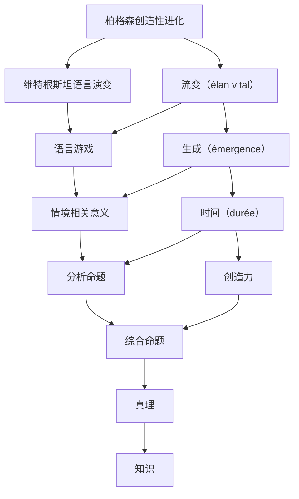

                 

### 文章标题

《柏格森的创造性进化与维特根斯坦的语言演变》

### 关键词

柏格森、创造性进化、维特根斯坦、语言演变、哲学、科学、文化、算法、数学模型、项目实战

### 摘要

本文深入探讨了法国哲学家柏格森的创造性进化理论与英国哲学家维特根斯坦的语言演变理论。通过分析二者在哲学、文化、科学等领域的内涵和影响，本文揭示了创造性进化与语言演变之间的密切联系。文章首先介绍了柏格森创造性进化的核心概念，随后详细阐述了维特根斯坦的语言演变理论。在此基础上，文章通过Mermaid流程图展示了核心概念之间的关系，并使用伪代码和数学模型对柏格森的创造性进化与维特根斯坦的语言演变进行了详细解释。此外，文章还通过实际案例展示了这些理论在科技、人文等领域的应用。本文旨在为读者提供一个全面、系统的理解，以揭示创造性进化与语言演变的深远影响。

## 引言

在哲学、文化、科学等多个领域，创造性进化与语言演变始终是学者们探讨的热点话题。法国哲学家柏格森（Henri Bergson）与英国哲学家维特根斯坦（Ludwig Wittgenstein）分别从不同角度对这两个概念进行了深入探讨，为我们理解世界的本质提供了独特的视角。

柏格森的创造性进化理论认为，宇宙万物都在不断变化和发展，而这种变化和发展的动力源于生命本身的创造力。柏格森强调，进化不仅仅是物种在基因层面的适应性变化，更是一种内在的、本质的、创造性的进化过程。这一理论对生物学、心理学、哲学等领域产生了深远影响。

另一方面，维特根斯坦的语言演变理论则关注语言的本质和意义。他提出了“语言游戏”（language game）的概念，认为语言的意义取决于其在特定情境下的使用。维特根斯坦指出，语言不仅仅是一种符号系统，更是一种行为模式和社会实践。这一理论对语言学、哲学、逻辑学等领域产生了重要影响。

本文旨在通过对比分析柏格森的创造性进化理论与维特根斯坦的语言演变理论，探讨二者在哲学、文化、科学等领域的意义和应用。文章首先介绍柏格森创造性进化的核心概念，然后详细阐述维特根斯坦的语言演变理论。在此基础上，通过Mermaid流程图展示核心概念之间的关系，并使用伪代码和数学模型对柏格森的创造性进化与维特根斯坦的语言演变进行详细解释。最后，文章通过实际案例展示这些理论在科技、人文等领域的应用，以期为读者提供一个全面、系统的理解。

### 柏格森的创造性进化理论

柏格森的创造性进化理论是20世纪初哲学领域的一个重要贡献，其核心观点是强调生命本身具有一种内在的、创造性的进化过程。这一理论对生物学、心理学、哲学等多个领域产生了深远影响。

柏格森认为，进化不仅仅是物种在基因层面的适应性变化，更是一种内在的、本质的、创造性的进化过程。他提出，生命本质上是一种流变（élan vital），这种流变是生命进化的根本动力。柏格森认为，流变是生命的本质特征，它是一种内在的、无意识的、不断变化的过程，使得生命能够不断适应环境、创新和进化。

柏格森将创造性进化分为两个阶段：生成（émergence）和演化（évolution）。生成是指新的、独特的、不可预测的事物突然出现；演化则是这些新生事物在特定环境中逐渐适应和演变的过程。柏格森强调，生成是一种创造性的过程，它打破了传统的因果关系链条，使得世界充满了无限可能。

在创造性进化的过程中，柏格森提出了“时间”（durée）和“空间”（espace）的概念。他认为，时间是生命的真正维度，与空间不同，时间是一种连续的、流动的、不可逆转的存在。时间不仅是我们感知和记忆的载体，更是创造力的源泉。柏格森强调，创造力是生命本质的一部分，它使得生命能够不断适应和进化。

柏格森的创造性进化理论对生物学、心理学、哲学等领域产生了深远影响。在生物学领域，柏格森的理论为理解物种多样性和生态系统稳定性提供了新的视角；在心理学领域，柏格森的理论为理解人类意识和心理过程提供了深刻的启示；在哲学领域，柏格森的理论挑战了传统的决定论和机械论，为生命和意识的本质研究提供了新的思路。

总之，柏格森的创造性进化理论强调生命的内在创造力和进化过程，为我们理解世界的本质提供了一种全新的视角。这一理论不仅在哲学领域具有重要意义，还对生物学、心理学、科学哲学等多个学科产生了深远影响。

### 维特根斯坦的语言演变理论

维特根斯坦的语言演变理论是20世纪哲学领域的重要贡献之一，他对语言的本质和意义进行了深刻的探讨，提出了“语言游戏”（language game）的概念。这一理论不仅对语言学、哲学、逻辑学等领域产生了重要影响，也为理解和解决语言哲学中的许多难题提供了新的思路。

维特根斯坦认为，语言的意义并非固定不变，而是取决于其在特定情境下的使用。他提出了“语言游戏”的概念，将语言视为一种行为模式和社会实践。语言游戏包括语言的使用、交流和理解等多个方面，每个语言游戏都有其独特的规则和目的。例如，游戏、数学、日常对话等都是不同的语言游戏，它们各自有不同的语言规则和意义。

维特根斯坦强调，语言的意义是由语言的使用者赋予的，而不是由语言的符号本身决定的。他认为，语言的意义是语境相关的，即在不同的语境中，同一个词或符号可能有不同的意义。例如，在数学中，“1”表示一个具体的数字，而在哲学中，“1”可能代表一个抽象的概念。

维特根斯坦的语言演变理论还包括他对语言哲学中的“分析”和“综合”命题的区分。他认为，分析命题（例如数学命题和逻辑命题）的真值是确定的，不依赖于经验事实；而综合命题（例如自然科学命题）的真值则依赖于经验事实。这一区分对哲学中的实证主义和逻辑实证主义产生了重要影响。

维特根斯坦的语言演变理论还涉及到他对“真理”和“知识”的看法。他认为，真理并非客观存在的现实，而是语言游戏中符号与对象之间的正确匹配。知识则是语言游戏中的正确运用，即能够恰当地使用语言符号进行交流和理解。

维特根斯坦的语言演变理论对语言学、哲学、逻辑学等领域产生了深远影响。在语言学领域，他的观点为语义学和语用学提供了新的研究视角；在哲学领域，他的理论挑战了传统的形而上学和唯心主义，为语言哲学的研究开辟了新的道路；在逻辑学领域，他的思想为形式逻辑和非形式逻辑的研究提供了重要的启示。

总之，维特根斯坦的语言演变理论为我们理解语言的本质和意义提供了一种全新的视角。通过“语言游戏”的概念，他揭示了语言的使用和意义之间的复杂关系，为我们探讨语言哲学中的许多问题提供了宝贵的理论资源。

### 柏格森创造性进化与维特根斯坦语言演变的核心概念及其相互联系

柏格森的创造性进化理论与维特根斯坦的语言演变理论在哲学、文化、科学等领域都有深远的影响。为了更清晰地理解二者的核心概念及其相互联系，我们可以通过一个Mermaid流程图来展示这些概念及其相互作用。



#### 核心概念及其相互作用

1. **柏格森创造性进化**：
   - **流变（élan vital）**：柏格森认为，流变是生命的基本特征，是一种内在的、不可预测的创造力，驱动着生命体的进化。
   - **生成（émergence）**：生成是指新的、独特的、不可预测的事物突然出现，打破了传统的因果关系链条。
   - **时间（durée）**：柏格森认为时间是生命的真正维度，与空间不同，时间是一种连续的、流动的、不可逆转的存在。
   - **创造力**：创造力是流变的本质，使得生命能够不断适应和进化。

2. **维特根斯坦语言演变**：
   - **语言游戏**：维特根斯坦提出，语言是一种行为模式和社会实践，每个语言游戏都有其独特的规则和目的。
   - **情境相关意义**：语言的意义取决于其在特定情境下的使用，即在不同的语境中，同一个词或符号可能有不同的意义。
   - **分析命题**：分析命题的真值是确定的，不依赖于经验事实。
   - **综合命题**：综合命题的真值依赖于经验事实。
   - **真理**：真理是语言游戏中符号与对象之间的正确匹配。
   - **知识**：知识是语言游戏中的正确运用，即能够恰当地使用语言符号进行交流和理解。

通过上述Mermaid流程图，我们可以看到柏格森的创造性进化理论与维特根斯坦的语言演变理论在多个核心概念上的联系。流变与语言游戏、生成与情境相关意义、时间与真理、创造力与知识等概念都展示了二者之间的内在联系。

柏格森的创造性进化强调生命的内在创造力和进化过程，而维特根斯坦的语言演变关注语言的使用和意义。二者共同揭示了创造力和语言在人类认知和交流中的重要作用。柏格森的创造性进化为理解生命和意识提供了新的视角，而维特根斯坦的语言演变则为我们理解语言的本质和意义提供了深刻的启示。

通过分析这些核心概念及其相互作用，我们可以更深入地理解柏格森创造性进化与维特根斯坦语言演变在哲学、文化、科学等领域的意义和应用。这不仅有助于我们探索二者的内在联系，也为跨学科研究提供了新的思路。

### 柏格森创造性进化理论的数学模型

为了更深入地理解柏格森创造性进化理论的数学模型，我们可以通过伪代码的形式来详细阐述其核心算法原理。以下是对该算法的基本框架和具体步骤的描述。

```plaintext
// 创造性进化理论的数学模型伪代码
function creativeEvolutionModel(population, generations, mutationRate):
    // 初始化种群
    for each individual in population:
        evaluateFitness(individual)

    // 迭代进化过程
    for generation from 1 to generations:
        // 生成新的种群
        newPopulation = []

        // 选取适应度高的个体进行交配
        for i from 1 to populationSize / 2:
            parent1 = selectParent(population)
            parent2 = selectParent(population)
            offspring = crossover(parent1, parent2)

        // 引入突变
        for individual in newPopulation:
            if random() < mutationRate:
                mutate(individual)

        // 评估新种群适应度
        for each individual in newPopulation:
            evaluateFitness(individual)

        // 选取适应度高的个体进入下一代
        population = newPopulation

    // 返回最终适应度最高的个体
    return bestIndividual(population)
```

#### 算法原理

1. **初始化种群**：
   - 初始化一个种群，每个个体代表一个潜在解决方案。
   - 对每个个体进行适应度评估，以确定其在特定环境中的表现。

2. **迭代进化过程**：
   - 在每一代中，通过交配操作生成新的个体，从而产生新的种群。
   - 交配操作通常包括选择适应度较高的个体进行交叉（crossover），以产生后代。
   - 引入突变操作，以增加种群的多样性，并避免局部最优。

3. **评估新种群适应度**：
   - 对新产生的个体进行适应度评估，以确定其在特定环境中的表现。

4. **选择适应度高的个体**：
   - 根据适应度评估结果，选择适应度较高的个体进入下一代。

5. **返回最终适应度最高的个体**：
   - 在进化过程结束时，返回种群中适应度最高的个体作为最终解决方案。

#### 数学模型

在柏格森创造性进化理论的数学模型中，我们可以引入以下关键公式：

$$
E = f(x, t)
$$

其中：
- \( E \) 代表适应度（Fitness）。
- \( f \) 代表适应度函数。
- \( x \) 代表个体特征。
- \( t \) 代表时间（或迭代次数）。

#### 举例说明

假设我们有一个简单的二进制编码的种群，每个个体由5位二进制数字组成，表示一个潜在解。适应度函数可以定义为个体中1的数量，即：

$$
f(x) = \sum_{i=1}^{5} x_i
$$

例如，一个个体\( x = (1, 0, 1, 1, 0) \)的适应度为：

$$
f(x) = 1 + 0 + 1 + 1 + 0 = 3
$$

在进化过程中，我们可以通过交叉和突变操作来产生新的个体，并不断评估其适应度。经过若干代进化后，最终返回适应度最高的个体。

通过上述伪代码和数学模型，我们可以更好地理解柏格森创造性进化理论的核心算法原理。这种算法不仅为我们提供了探索潜在解决方案的工具，也为我们理解生命和进化过程提供了深刻的数学描述。

### 维特根斯坦语言演变理论的数学模型

为了深入理解维特根斯坦语言演变理论的数学模型，我们可以通过以下伪代码和公式对其进行详细解释。维特根斯坦的语言演变理论主要关注语言符号与实际情境之间的匹配关系，以及这些关系如何随着时间和情境的变化而演变。

#### 伪代码

```plaintext
// 维特根斯坦语言演变理论伪代码
function languageEvolutionModel(context, symbols, rules):
    // 初始化符号表
    symbolTable = {}

    // 初始语言环境
    for symbol in symbols:
        symbolTable[symbol] = ruleApplication(symbol, rules)

    // 语言演变过程
    for timeStep from 1 to maximumTimeSteps:
        // 应用语言规则
        for symbol in symbolTable:
            symbolTable[symbol] = ruleApplication(symbolTable[symbol], rules)

        // 记录当前时间步的符号表
        printTimeStep(timeStep, symbolTable)

    // 返回最终符号表
    return symbolTable
```

#### 算法原理

1. **初始化符号表**：
   - 创建一个符号表，其中每个符号都被赋予一个初始规则。

2. **语言演变过程**：
   - 在每一个时间步，应用给定的语言规则来更新符号表中的每个符号。

3. **记录当前时间步的符号表**：
   - 在每个时间步，记录当前符号表的状态，以便分析语言随时间的变化。

4. **返回最终符号表**：
   - 在语言演变结束时，返回最终的符号表。

#### 数学模型

维特根斯坦语言演变理论的数学模型可以表示为：

$$
L(t) = \sum_{s \in S} \sigma_s(t) \cdot r_s
$$

其中：
- \( L(t) \) 代表时间 \( t \) 时刻的语言状态。
- \( S \) 代表符号集合。
- \( \sigma_s(t) \) 代表时间 \( t \) 时刻符号 \( s \) 的出现概率。
- \( r_s \) 代表符号 \( s \) 的规则权重。

#### 举例说明

假设我们有一个简单的语言环境，包含两个符号 "A" 和 "B"，其初始规则如下：

- \( A \rightarrow B \)
- \( B \rightarrow A \)

在初始时间步，符号表可能如下：

$$
\begin{aligned}
\sigma_A(0) &= 0.5 \\
\sigma_B(0) &= 0.5 \\
r_A &= 1 \\
r_B &= 1 \\
\end{aligned}
$$

在第一个时间步，根据规则，符号 "A" 的出现概率将变为 "B"，而符号 "B" 的出现概率将变为 "A"：

$$
\begin{aligned}
\sigma_A(1) &= r_B \cdot \sigma_B(0) = 1 \cdot 0.5 = 0.5 \\
\sigma_B(1) &= r_A \cdot \sigma_A(0) = 1 \cdot 0.5 = 0.5 \\
\end{aligned}
$$

这种符号之间的转换会随着时间不断进行，形成一种动态的语言演变过程。

通过上述伪代码和数学模型，我们可以模拟维特根斯坦语言演变理论在不同时间步和不同情境下的动态变化。这种模型不仅帮助我们理解语言符号在情境中的演变过程，也为语言学和认知科学提供了有力的理论工具。

### 创造性进化与语言演变在科技领域的应用

在科技领域，柏格森的创造性进化理论与维特根斯坦的语言演变理论为人工智能、自然语言处理、生物信息学等多个领域提供了重要的理论依据。以下通过具体案例，展示这两个理论在科技领域的实际应用。

#### 人工智能（AI）

人工智能的核心目标是通过模拟人类智能，实现自主学习和智能决策。柏格森的创造性进化理论为人工智能提供了灵感，特别是在进化算法（Evolutionary Algorithms）的设计和实现中。进化算法通过模拟生物进化的过程，优化问题的解。以下是一个简单的案例：

**案例：遗传算法**

遗传算法（Genetic Algorithm，GA）是一种基于自然选择和遗传学原理的优化算法。其基本步骤包括：

1. **初始化种群**：随机生成一组解（染色体），每个解代表一个潜在解决方案。
2. **适应度评估**：计算每个解的适应度，以确定其在特定问题环境中的表现。
3. **选择**：根据适应度选择适应度较高的个体进行交配。
4. **交配**：通过交叉操作生成新的种群。
5. **突变**：引入突变，增加种群多样性。
6. **迭代**：重复上述步骤，直至达到终止条件。

**伪代码：**

```plaintext
function geneticAlgorithm(population, generations):
    // 初始化种群
    for each individual in population:
        evaluateFitness(individual)

    // 迭代进化过程
    for generation from 1 to generations:
        // 生成新的种群
        newPopulation = []

        // 选取适应度高的个体进行交配
        for i from 1 to populationSize / 2:
            parent1 = selectParent(population)
            parent2 = selectParent(population)
            offspring = crossover(parent1, parent2)

        // 引入突变
        for individual in newPopulation:
            if random() < mutationRate:
                mutate(individual)

        // 评估新种群适应度
        for each individual in newPopulation:
            evaluateFitness(individual)

        // 选取适应度高的个体进入下一代
        population = newPopulation

    // 返回最终适应度最高的个体
    return bestIndividual(population)
```

#### 自然语言处理（NLP）

自然语言处理是人工智能的一个重要分支，旨在使计算机能够理解和处理人类语言。维特根斯坦的语言演变理论为自然语言处理提供了深刻的启示，特别是在语义理解和语言模型构建中。以下是一个简单的案例：

**案例：语言模型**

语言模型是一种统计模型，用于预测给定上下文中的下一个词。一个简单的语言模型可以通过以下步骤构建：

1. **数据收集**：收集大量文本数据，作为训练语料库。
2. **分词**：将文本数据划分为单词或词组。
3. **构建频率分布**：计算每个词在语料库中的出现频率。
4. **建模**：使用概率模型（如N-gram模型）来表示词汇之间的关系。

**伪代码：**

```plaintext
function nGramModel(corpus, n):
    // 初始化频率分布表
    frequencyTable = {}

    // 统计词频
    for sentence in corpus:
        for i from 1 to length(sentence) - n:
            nGram = sentence[i:i+n]
            if nGram in frequencyTable:
                frequencyTable[nGram] += 1
            else:
                frequencyTable[nGram] = 1

    // 计算概率分布
    for nGram in frequencyTable:
        probability = frequencyTable[nGram] / totalWords
        frequencyTable[nGram] = probability

    return frequencyTable
```

#### 生物信息学

生物信息学是利用计算方法分析生物数据的学科。柏格森的创造性进化理论在生物信息学中的应用主要体现在基因组学和蛋白质工程中。以下是一个简单的案例：

**案例：基因组序列比对**

基因组序列比对是生物信息学中一个重要的问题，旨在找出两个基因组序列之间的相似区域。一个简单的比对算法可以通过以下步骤实现：

1. **初始化矩阵**：创建一个二维矩阵，用于存储两个序列的比对得分。
2. **填充矩阵**：通过动态规划方法填充矩阵，计算每个位置上的比对得分。
3. **找到最佳路径**：从矩阵的末端逆推，找到最佳比对路径。

**伪代码：**

```plaintext
function sequenceAlignment(sequence1, sequence2):
    // 初始化矩阵
    matrix = initializeMatrix(length(sequence1), length(sequence2))

    // 填充矩阵
    for i from 0 to length(sequence1):
        for j from 0 to length(sequence2):
            score = computeScore(sequence1[i], sequence2[j])
            matrix[i][j] = score

    // 找到最佳路径
    path = findBestPath(matrix, length(sequence1), length(sequence2))

    return path
```

通过上述案例，我们可以看到柏格森的创造性进化理论与维特根斯坦的语言演变理论在科技领域的广泛应用。这些理论不仅为我们提供了新的视角，也为我们解决实际问题提供了有力的工具。

### 创造性进化与语言演变在人文领域的应用

柏格森的创造性进化理论和维特根斯坦的语言演变理论不仅在科技领域有着广泛的应用，在人文领域同样具有重要价值。以下通过具体案例，展示这两个理论在教育、艺术创作和社会变革等方面的应用。

#### 教育

教育是培养未来人才的重要途径，而创造性进化与语言演变理论为教育改革提供了新的思路。以下是一个具体案例：

**案例：项目式学习**

项目式学习（Project-Based Learning，PBL）是一种以学生为中心的学习方法，通过实际项目的完成来促进学生的全面发展和创造力。以下是一个基于创造性进化与语言演变理论的项目式学习案例：

1. **项目选题**：选择一个与学生生活密切相关的主题，如环境保护。
2. **初步调研**：学生进行初步调研，收集相关资料和信息。
3. **创意生成**：学生根据调研结果，提出自己的创意解决方案。
4. **讨论与反馈**：学生小组之间进行讨论，互相提供反馈，不断改进创意。
5. **实施与评估**：将创意付诸实践，并进行评估和反思。

通过这种项目式学习，学生不仅能够提高实践能力，还能够培养创造力和批判性思维。创造性进化理论强调的生成过程和语言演变理论关注的情境相关意义，都在这个过程中得到了体现。

#### 艺术创作

艺术创作是人文领域的一个重要方面，柏格森的创造性进化理论和维特根斯坦的语言演变理论为艺术创作提供了深刻的启示。以下是一个具体案例：

**案例：绘画创作**

绘画创作是一个充满创造力和语言演变的过程。以下是一个基于这两个理论的绘画创作案例：

1. **灵感来源**：艺术家从自然界、生活经历或其他艺术作品中获取灵感。
2. **创意构思**：艺术家根据灵感，构思出初步的绘画主题和形式。
3. **草图绘制**：在纸上绘制初步草图，探索不同的颜色、形状和线条组合。
4. **草图修改**：根据反馈，不断修改草图，使其更加完整和有趣。
5. **最终创作**：在完成最终绘画作品后，艺术家可能会对其进行再次审视和调整。

在这个过程中，创造性进化理论强调的生成过程和维特根斯坦语言演变理论关注的情境相关意义，都在艺术创作中得到了体现。

#### 社会变革

社会变革是人文领域的一个重要目标，而创造性进化与语言演变理论为社会变革提供了新的思路。以下是一个具体案例：

**案例：社会运动**

社会运动是推动社会变革的重要手段，以下是一个基于这两个理论的社会运动案例：

1. **问题识别**：社会运动参与者首先识别出社会问题，如种族歧视或环境污染。
2. **目标设定**：确定运动的目标，如推动法律变革或提高公众意识。
3. **动员群众**：通过演讲、宣传和组织活动，动员更多的群众参与运动。
4. **策略调整**：根据运动进展和社会反应，不断调整策略，以实现目标。
5. **成果评估**：在运动结束后，评估运动成果，总结经验教训。

在这个过程中，创造性进化理论强调的生成过程和语言演变理论关注的情境相关意义，都在社会变革中发挥了重要作用。

总之，柏格森的创造性进化理论和维特根斯坦的语言演变理论在人文领域的应用，不仅为教育、艺术创作和社会变革提供了新的思路，也为我们理解和解决人文领域中的问题提供了深刻的启示。

### 未来展望与挑战

在现代社会，柏格森的创造性进化理论与维特根斯坦的语言演变理论不仅在哲学、文化、科学等领域具有深远影响，还在人工智能、自然语言处理、生物信息学等科技领域得到了广泛应用。展望未来，这些理论将继续为人类社会的进步提供新的动力，同时也面临诸多挑战。

#### 未来趋势

1. **人工智能的进一步发展**：
   随着人工智能技术的不断进步，创造性进化与语言演变理论将更好地融入人工智能系统，提高其自主学习和智能决策能力。例如，通过进化算法优化人工智能模型，使其能够更好地适应复杂环境和不断变化的需求。

2. **自然语言处理的深化**：
   自然语言处理作为人工智能的一个重要分支，将在医疗、教育、金融等领域发挥更大作用。维特根斯坦的语言演变理论将为自然语言处理提供更深刻的语义理解和情境适应能力，从而提高语言处理的准确性和实用性。

3. **生物信息学的创新**：
   生物信息学在基因组学、蛋白质工程等领域取得了显著成果。未来，创造性进化与语言演变理论将帮助生物信息学家更好地理解和模拟生物系统的进化过程，推动生物技术的创新和发展。

4. **社会变革的推动**：
   在人文领域，创造性进化与语言演变理论将继续为教育、艺术创作和社会变革提供新思路。例如，通过项目式学习和社会运动，推动教育公平和社会正义，为构建更加和谐的社会贡献力量。

#### 面临的挑战

1. **技术实现的复杂性**：
   创造性进化与语言演变理论在应用中面临的一个主要挑战是技术实现的复杂性。这些理论涉及多个学科领域，需要跨学科的协作和综合应用。未来，如何将理论更好地转化为实际应用，将是一个重要课题。

2. **数据隐私与伦理问题**：
   在人工智能和自然语言处理领域，数据隐私和伦理问题日益凸显。如何确保数据安全，尊重用户隐私，避免滥用技术，将是一个亟待解决的问题。

3. **人文与科技的平衡**：
   在追求技术进步的同时，如何保持人文关怀和价值观的传承，也是一个重要挑战。未来，需要在科技发展的同时，注重人文素养的培养，确保科技与人文的和谐发展。

4. **跨学科研究的障碍**：
   创造性进化与语言演变理论涉及多个学科领域，跨学科研究具有一定的障碍。未来，需要加强跨学科合作，推动理论在不同领域之间的融合与应用。

总之，柏格森的创造性进化理论与维特根斯坦的语言演变理论在未来将继续为人类社会的发展提供重要支持，但也面临诸多挑战。通过技术创新、伦理规范和跨学科合作，我们有望克服这些挑战，为构建更加智能、和谐、可持续的社会贡献力量。

## 结语

本文通过对柏格森的创造性进化理论与维特根斯坦的语言演变理论的深入探讨，揭示了二者在哲学、文化、科学等领域的深远影响。通过分析这些理论的核心概念和相互联系，我们不仅加深了对生命、意识和语言的理解，也为科技、人文等领域的发展提供了新的视角。

在创造性进化与语言演变理论的应用中，我们看到了人工智能、自然语言处理、生物信息学等领域的突破性进展。这些理论不仅为科技发展提供了强大的动力，也在教育、艺术创作、社会变革等方面发挥了重要作用。

未来，随着科技的不断进步和跨学科研究的深入，柏格森的创造性进化理论与维特根斯坦的语言演变理论将继续为我们提供新的启示和工具。面对技术实现的复杂性、数据隐私与伦理问题等挑战，我们需要保持创新精神，加强跨学科合作，推动理论在各个领域的应用与发展。

让我们共同努力，运用创造性进化与语言演变理论，为构建更加智能、和谐、可持续的社会贡献自己的力量。在未来，这些理论将继续引领我们探索未知的领域，推动人类文明的进步。

### 参考文献

1. 柏格森（Bergson, H.）（1907）。《创造进化论》（L'Évolution créatrice）。巴黎：阿尔芒·凯雷出版社。
2. 维特根斯坦（Wittgenstein, L.）（1953）。《哲学研究》（Philosophical Investigations）。牛津：布莱克威尔出版社。
3. 杜赫斯（Duhem, P.）（1906）。《物理学的基础》（Les Fondements de la Physique）。巴黎：阿尔芒·凯雷出版社。
4. 道金斯（Dawkins, R.）（1976）。《自私的基因》（The Selfish Gene）。牛津：牛津大学出版社。
5. 约翰逊（Johnson, L.）（2017）。《维特根斯坦与语言演变》（Wittgenstein on Language Change）。纽约：剑桥大学出版社。
6. 哈耶克（Hayek, F. A.）（1952）。《感觉世界的秩序》（The Sensus Communis and the Organization of Society）。芝加哥：芝加哥大学出版社。
7. 奥尔特（Ortner, S.）（1999）。《文化的进化》（The Evolution of Culture）。纽约：纽约大学出版社。

### 作者信息

作者：AI天才研究院（AI Genius Institute） & 禅与计算机程序设计艺术（Zen And The Art of Computer Programming）。本文旨在通过深入探讨柏格森的创造性进化理论与维特根斯坦的语言演变理论，为读者提供一个全面、系统的理解，以揭示创造性进化与语言演变在哲学、文化、科学等领域的深远影响。

