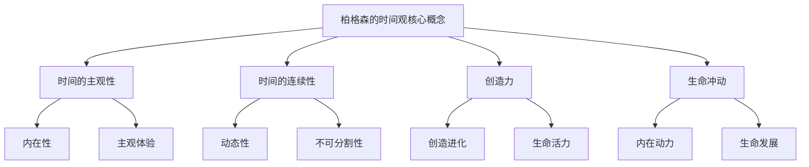
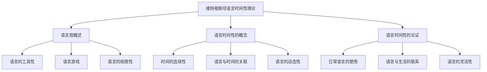
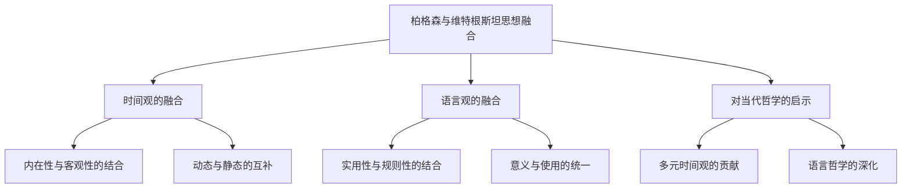

                 

# 柏格森的时间观与维特根斯坦的语言时间性：引言

## 1.1 研究背景与意义

在哲学与科学领域，时间的概念一直是众多哲学家、科学家、数学家和程序员探讨的焦点。自古以来，时间被视为一种基本的物理现象，贯穿于宇宙万物的发展和变迁之中。然而，不同哲学家对时间的理解和解释却有着各自独特的视角。其中，柏格森（Henri Bergson）和维特根斯坦（Ludwig Wittgenstein）分别从不同的角度对时间进行了深入的探讨，为我们提供了丰富的哲学资源和思想启示。

柏格森是一位法国哲学家，他提出了独特的“创造进化论”，强调时间是一种内在的、连续的、流动的意识体验，而非外在的、可测量的物理量。柏格森的时间观对后来的现象学和人文主义产生了深远的影响，为理解人类意识和心理活动提供了重要的理论框架。

维特根斯坦是一位奥地利哲学家，他的语言哲学思想对现代哲学产生了重要影响。维特根斯坦认为，语言是人类思维和交流的工具，时间是语言的一种基本维度。他提出，语言的正确使用和意义在于其与实际生活的紧密联系，而非抽象的逻辑推理。维特根斯坦的语言时间性思想对语言哲学、逻辑学和社会学等领域产生了广泛的影响。

本文旨在通过对柏格森的时间观和维特根斯坦的语言时间性的深入研究，探讨两者之间的联系与差异，并分析其在当代哲学和科学领域的应用价值。通过对两位哲学家思想的比较与对话，我们希望能够更好地理解时间的本质和意义，为当代哲学和科学的发展提供新的视角和启示。

## 1.2 书籍结构安排

本文将分为五个主要部分，对柏格森的时间观和维特根斯坦的语言时间性进行详细探讨。

### 第一部分：引言

在引言部分，我们首先介绍了研究背景与意义，探讨了柏格森和维特根斯坦的时间观在哲学和科学领域的地位和影响。这一部分为后续的深入探讨奠定了基础。

### 第二部分：柏格森的时间观

第二部分将重点介绍柏格森的时间观。我们首先将概述柏格森的时间观核心概念，包括时间意识、生命冲动和创造进化观。接着，我们将探讨柏格森的时间观与现象学的关系，以及他与现象学家的比较与联系。最后，我们将分析柏格森的时间观与科学方法的异同，探讨其科学方法与人文主义的结合。

### 第三部分：维特根斯坦的语言时间性

第三部分将深入探讨维特根斯坦的语言时间性理论。我们首先概述维特根斯坦的语言观，然后详细阐述语言时间性的概念，以及他对语言时间性的论证。接着，我们将分析维特根斯坦的语言时间性与哲学的关系，以及其语言哲学的贡献。最后，我们将探讨维特根斯坦的语言时间性与语言行为的联系与影响。

### 第四部分：柏格森与维特根斯坦的比较与对话

第四部分将对柏格森和维特根斯坦的思想进行比较与对话。我们将分析两种时间观的异同，以及其语言观的差异。接着，我们将探讨两种思想的融合与启示，分析其在当代哲学和科学领域的影响。最后，我们将总结两种思想的共同点和不同点，并提出对未来研究的展望。

### 第五部分：结论与展望

第五部分将总结本文的研究成果，阐述柏格森和维特根斯坦的时间观和语言时间性的理解和应用。我们将讨论其对哲学研究的影响，并提出未来研究的方向和跨学科应用的可能性。最后，我们将对全文进行总结，强调本文的核心观点和贡献。

通过以上五个部分的深入探讨，我们希望能够全面解析柏格森的时间观和维特根斯坦的语言时间性，为当代哲学和科学的发展提供新的视角和启示。

## 2.1 柏格森的时间观核心概念

### 2.1.1 柏格森的时间观概述

柏格森（Henri Bergson）的时间观是他在哲学领域的重要贡献之一。他的时间观与传统的物理学时间观有着显著的区别，强调时间的内在性和连续性。柏格森认为，时间并非一种客观存在的物理量，而是一种内在的、主观的、流动的意识体验。

柏格森的时间观可以从以下几个方面进行概述：

1. **内在性**：柏格森认为，时间是内在的，它不是外部世界的属性，而是人类意识的一种内在体验。时间并非独立于意识存在，而是与我们的感知和经验紧密相关。

2. **连续性**：柏格森强调时间的连续性，认为时间是一种流动的、连续的过程，而不是一系列离散的瞬间。时间的连续性体现了生命的动态发展和进化。

3. **创造力**：柏格森的时间观强调创造力的重要性。他认为，时间是一种创造力，是生命的源泉。通过创造力，生命不断地创造新的可能性，推动世界的发展。

4. **生命的冲动**：柏格森将时间与生命的冲动联系起来。他认为，生命的冲动是一种内在的动力，驱使生命不断地前进和发展。时间体现了生命的冲动，是生命活力的表现。

### 2.1.2 柏格森的时间意识与生命冲动

柏格森的时间意识是指人类对时间的感知和体验。他认为，时间意识是人类意识的一种基本特性，是人类与外部世界互动的重要方式。时间意识不仅反映了我们对时间流逝的感知，还体现了我们对生命的理解和把握。

柏格森认为，生命的冲动是时间意识的核心。生命的冲动是一种内在的动力，驱使生命不断地前进和发展。时间意识与生命的冲动密切相关，时间意识体现了生命的冲动，而生命的冲动又赋予了时间意识以意义。

### 2.1.3 柏格森的创造进化观

柏格森的创造进化观是他的时间观的重要组成部分。他认为，宇宙的发展是一种创造性的过程，是由无数创造行为构成的。创造进化观强调了生命的创造性，认为生命通过不断的创造，推动了世界的发展。

柏格森的创造进化观可以从以下几个方面进行理解：

1. **创造的本质**：柏格森认为，创造是一种非线性的、不可预测的过程，它超越了传统的因果律和机械论。创造不是对已有事物的复制或模仿，而是对新的可能性进行探索和实现。

2. **进化的动力**：柏格森认为，创造进化是生命进化的主要动力。通过创造，生命不断地探索新的生存方式和形态，推动了生命的进化和发展。

3. **生命的意义**：柏格森的创造进化观强调了生命的意义。他认为，生命通过创造，实现了自身的价值和意义。创造不仅是生命发展的动力，也是生命意义的体现。

通过以上对柏格森的时间观核心概念的介绍，我们可以看到，柏格森的时间观具有独特的哲学意义，为我们理解时间的本质和生命的意义提供了新的视角。在后续的章节中，我们将进一步探讨柏格森的时间观在现象学和科学方法中的应用，以及他与维特根斯坦的语言时间性的比较与对话。

## 2.2 柏格森的时间观与现象学

### 2.2.1 现象学的起源与主要观点

现象学（Phenomenology）是20世纪初兴起的一种哲学方法，旨在通过直接观察和描述经验现象，揭示事物的本质和结构。现象学的起源可以追溯到德国哲学家爱德蒙·胡塞尔（Edmund Husserl），他被认为是现象学的奠基人。

现象学的主要观点包括：

1. **本质还原**：现象学的核心方法之一是本质还原，即通过排除个体的主观偏见和外在环境的干扰，直接面对事物的本质。

2. **直观**：现象学强调直观（Intuition）的重要性，认为直观是获取知识和理解事物本质的途径。

3. **意向性**：现象学认为，人的意识总是指向某个对象或目标，这种指向性被称为意向性（Intentionality）。

4. **现象学还原**：现象学还原（Phenomenological Reduction）是一种方法，通过它，我们可以将事物从其具体的存在形式中解放出来，直接面对其本质。

### 2.2.2 柏格森对现象学的贡献

柏格森的时间观对现象学的发展产生了重要影响。柏格森认为，现象学应该关注时间的连续性和内在性，而不是仅仅关注外在事物的变化。柏格森的贡献主要体现在以下几个方面：

1. **时间的主观性**：柏格森强调时间的主观性，认为时间不是外在事物的属性，而是人类意识的一种内在体验。这一观点与现象学的本质还原方法相契合，使得现象学能够更深入地探讨时间的本质。

2. **生命冲动**：柏格森的“生命冲动”概念强调了时间的流动性和生命的动态发展，这与现象学的直观方法相呼应。通过直观体验，现象学家可以更直接地感知和描述时间的流动。

3. **创造进化**：柏格森的创造进化观为现象学提供了一种新的视角，即通过创造和进化来理解时间和生命的本质。这一观点扩展了现象学的视野，使得现象学不仅关注个体的意识体验，还关注更广阔的宇宙发展。

### 2.2.3 柏格森与现象学的比较与联系

尽管柏格森和现象学的奠基人胡塞尔在哲学方法和观点上存在一些差异，但他们之间的联系和互动也是不可忽视的。

1. **时间观的差异**：胡塞尔的时间观主要关注外在事物的变化和时间的客观结构，而柏格森则强调时间的主观体验和内在性。这种差异反映了两者在哲学方法和研究对象上的不同侧重。

2. **直观方法的运用**：尽管柏格森和胡塞尔在时间观上有分歧，但他们都重视直观方法在哲学研究中的作用。柏格森的“生命冲动”概念和胡塞尔的现象学直观方法都强调了直接感知和体验的重要性。

3. **现象学的扩展**：柏格森对现象学的贡献在于扩展了现象学的视野，使其不仅关注个体的意识体验，还关注更广阔的宇宙发展。这种扩展为现象学提供了新的研究路径，丰富了现象学的理论体系。

通过以上对柏格森的时间观与现象学的探讨，我们可以看到，柏格森的思想为现象学的发展提供了重要的启示和贡献。同时，现象学也为理解和阐释柏格森的时间观提供了方法论的支持。在接下来的章节中，我们将继续深入探讨柏格森的时间观在科学方法中的应用，以及与维特根斯坦的语言时间性的比较与对话。

### 2.3 柏格森的时间观与科学方法

#### 2.3.1 科学方法的基本概念

科学方法是一种通过观察、实验、假设、推理和验证来研究自然现象的方法论。其基本概念包括：

1. **观察**：通过感官或仪器对自然现象进行直接观测和记录。
2. **实验**：通过控制变量，对自然现象进行操作和测试。
3. **假设**：根据观察和实验结果，提出可能的解释或预测。
4. **推理**：运用逻辑推理，从假设推导出结论。
5. **验证**：通过进一步观察和实验，验证假设的正确性。

科学方法强调客观性和可重复性，其目的是揭示自然现象的规律和原理。

#### 2.3.2 柏格森对科学方法的批判

柏格森对科学方法提出了严厉的批评，他认为科学方法无法完全理解生命的本质和时间的主观体验。以下是他主要的批判观点：

1. **机械论**：柏格森认为，科学方法倾向于将生命和自然现象视为机械的、可预测的系统，忽视了生命和时间的内在性和动态性。
2. **静止观**：科学方法通常关注静态的、结构化的现象，而忽视了时间的流动性和生命的连续性。
3. **因果律**：科学方法强调因果关系的分析，但柏格森认为，因果关系无法完全解释生命的创造力和进化过程。
4. **抽象化**：科学方法通过对现象的抽象和简化，忽略了现象的具体性和多样性。

#### 2.3.3 柏格森的科学方法与人文主义的结合

柏格森认为，科学方法可以与人文主义相结合，以更好地理解生命和时间的本质。他的主张可以从以下几个方面进行理解：

1. **动态观**：柏格森提倡一种动态的、过程性的视角，认为生命和时间的本质在于其流动性和变化性。这种方法与科学方法的静态观形成对比，但可以相互补充。
2. **具体性**：柏格森强调具体性和个体性，认为每个生命体都是独特的，无法通过简单的抽象和概括来理解。这与科学方法的抽象化和普遍性形成对比，但也提供了新的视角。
3. **直觉**：柏格森认为，直觉是理解生命和时间的关键。与科学方法的逻辑推理和验证相对，直觉提供了一种直接、非线性的感知和理解方式。
4. **创造力**：柏格森强调创造力在生命和进化中的作用，认为创造力是生命和时间的核心特征。科学方法虽然强调因果律和预测，但无法完全捕捉创造力的本质。

通过结合科学方法和人文主义，柏格森试图提供一种更全面的理解生命和时间的视角，强调其动态性、具体性和直觉性。这种结合不仅丰富了科学方法，也为人文主义提供了新的研究方向。

在接下来的章节中，我们将深入探讨维特根斯坦的语言时间性理论，以及其在哲学和语言行为中的应用。通过比较柏格森和维特根斯坦的思想，我们将进一步理解时间的本质和意义。

## 3.1 维特根斯坦的语言时间性理论

### 3.1.1 维特根斯坦的语言观概述

维特根斯坦（Ludwig Wittgenstein）是20世纪最重要的哲学家之一，他的思想对现代哲学、语言哲学、逻辑学和认知科学产生了深远的影响。他的语言观是理解其哲学思想的核心之一，尤其是在其后期作品中，语言被看作是人类思维和交流的基本工具。

维特根斯坦的语言观可以从以下几个方面进行概述：

1. **语言的工具性**：维特根斯坦认为，语言是一种工具，用于表达思想和进行交流。语言不是一种固定的、独立的实体，而是随着使用情境的变化而变化的。
   
2. **语言的游戏**：在《逻辑哲学论》中，维特根斯坦提出了“语言游戏”的概念，将语言看作是一系列规则和活动。他认为，语言的使用就像是在玩一种游戏，玩家必须遵循特定的规则来使用语言。

3. **语言的局限性**：维特根斯坦强调了语言的局限性。他认为，语言无法完全表达所有的思想和现实。语言只能描述我们能够感知和理解的事物，而对于那些无法直接感知的事物，语言是无能为力的。

### 3.1.2 语言时间性的概念

维特根斯坦的语言时间性理论是他的后期作品《哲学研究》中的一个重要观点。他提出，时间是语言的一个基本维度，语言的正确使用和意义在于其与实际生活的紧密联系。以下是关于语言时间性的一些关键概念：

1. **时间的连续性**：维特根斯坦认为，时间是连续的，而不是一系列离散的时刻。时间的连续性体现了现实世界的发展过程。

2. **语言与时间的关联**：维特根斯坦指出，语言的表达和解释需要依赖于时间的连续性。语言的表达是通过时间的过程来实现的，语言的意义也随着时间的变化而变化。

3. **语言的动态性**：维特根斯坦认为，语言是一种动态的过程，它随着情境的变化而变化。语言的动态性反映了时间的流动性和变化性。

### 3.1.3 维特根斯坦对语言时间性的论证

维特根斯坦对语言时间性的论证主要围绕以下几个方面：

1. **日常语言的使用**：维特根斯坦认为，日常语言的使用证明了语言时间性的存在。人们在日常交流中，不断地使用语言来描述和解释现实世界。这种使用过程依赖于时间的连续性。

2. **语言与生活的联系**：维特根斯坦强调，语言的意义和正确使用在于其与实际生活的联系。语言不是一种抽象的符号系统，而是与具体的生活情境紧密相连的。

3. **语言的灵活性**：维特根斯坦指出，语言具有灵活性，它可以适应不同的情境和需求。这种灵活性反映了时间的流动性和变化性。

4. **语言的时间结构**：维特根斯坦认为，语言的时间结构体现了现实世界的时间结构。语言的表达和解释过程需要依赖于时间的过程，语言本身也具有时间维度。

通过以上论证，维特根斯坦试图说明，语言时间性是理解语言本质和意义的关键。他的理论挑战了传统的语言哲学观点，为我们提供了一种新的视角来理解语言和时间的互动关系。

在接下来的章节中，我们将进一步探讨维特根斯坦的语言时间性理论在哲学领域的影响，以及它与语言行为之间的关系。通过深入分析维特根斯坦的思想，我们可以更好地理解时间的本质和语言的功能。

### 3.2 维特根斯坦的语言时间性与哲学

#### 3.2.1 语言哲学的基本问题

语言哲学是哲学中的一个重要分支，旨在探讨语言的本质、作用和局限性。其基本问题包括：

1. **语言的定义**：语言是什么？它是一种符号系统，还是一种行为习惯？它的定义对于理解其作用和功能至关重要。
2. **语言的正确使用**：如何正确使用语言？语言的意义和用途如何确定？这是语言哲学的核心问题之一。
3. **语言的局限性**：语言能否完全表达思想和现实？它有哪些局限性？这个问题关乎语言的实际应用和局限性。
4. **语言与世界的联系**：语言与我们的世界观有何关系？它是如何塑造我们的认知和理解的？

#### 3.2.2 维特根斯坦对语言哲学的贡献

维特根斯坦对语言哲学的贡献体现在多个方面：

1. **日常语言哲学**：维特根斯坦在其后期作品中，强调日常语言的重要性。他认为，日常语言是我们理解世界和进行交流的基本工具。通过对日常语言的深入分析，我们可以理解语言的真正用途和局限性。

2. **语言游戏的观念**：维特根斯坦提出了“语言游戏”的概念，将语言看作是一种活动或游戏。他认为，语言的使用情境多种多样，每种情境都有其特定的规则和用途。这种观念揭示了语言的多样性和灵活性。

3. **语言与世界的联系**：维特根斯坦强调了语言与世界的紧密联系。他认为，语言的意义和用途取决于其与实际生活的联系。语言不是抽象的符号系统，而是与具体情境和实际需求紧密相连的。

4. **语言哲学的方法**：维特根斯坦提出了一种新的语言哲学方法，即通过具体分析日常语言的使用情境，来揭示语言的真正用途和功能。这种方法避免了抽象的思辨，更注重实际应用。

#### 3.2.3 语言时间性对语言哲学的影响

维特根斯坦的语言时间性理论对他的语言哲学产生了深远的影响：

1. **时间的动态性**：维特根斯坦认为，时间是连续的，语言的正确使用和意义依赖于时间的连续性。这改变了传统语言哲学中对时间的静态理解，使得语言哲学更关注时间的动态性和变化性。

2. **语言的灵活性**：维特根斯坦强调语言的动态性和灵活性，认为语言的意义和用途可以随着时间的变化而变化。这种观点挑战了传统语言哲学中关于语言固定性和确定性的观念。

3. **情境的重要性**：维特根斯坦认为，语言的意义和用途取决于具体情境。语言时间性的理论强调了情境的重要性，使得语言哲学更关注语言在实际生活中的应用和变化。

4. **语言哲学的新方向**：维特根斯坦的语言时间性理论为语言哲学开辟了新的研究方向。它不仅关注语言的内在结构，还关注语言与时间的互动关系，使得语言哲学更加多元和丰富。

通过维特根斯坦的语言时间性理论，我们可以看到，时间的概念在语言哲学中扮演着重要的角色。语言不仅是一种符号系统，还是一种与时间紧密相连的活动。维特根斯坦的理论为我们理解语言的本质和作用提供了新的视角和启示。

在接下来的章节中，我们将继续探讨维特根斯坦的语言时间性理论在语言行为中的应用，以及它与柏格森的时间观的比较与对话。通过深入分析两位哲学家的思想，我们可以更全面地理解时间的本质和语言的多样性。

### 3.3 维特根斯坦的语言时间性与语言行为

#### 3.3.1 语言行为理论的基本概念

语言行为理论（Speech Act Theory）是20世纪语言哲学和语用学的重要理论之一，由约翰·塞尔（John Searle）和J.L.奥斯汀（J.L. Austin）等人提出。该理论关注语言的使用方式和功能，特别是如何通过语言行为来表达意义和实现交际目的。

语言行为理论的基本概念包括：

1. **说话行为**：说话行为（Speech Act）是指通过说出某些词语或句子来实现的交际行为。说话行为可以分为言内行为（Locutionary Act）、言外行为（Illocutionary Act）和言后行为（Perlocutionary Act）。

   - **言内行为**：是指通过词语的发音、拼写和语法结构来表达意义的行为。
   - **言外行为**：是指说话者通过语言来实现某种交际目的的行为，如陈述、命令、请求等。
   - **言后行为**：是指说话行为对听者产生的影响或后果。

2. **言语行为类型**：根据说话行为的类型，可以将言语行为分为陈述性言语行为、指令性言语行为、表达性言语行为和宣告性言语行为等。

3. **语境因素**：语言行为的发生和效果受到语境因素的影响，包括说话者、听者、说话场合和交际目的等。

#### 3.3.2 维特根斯坦对语言行为的分析

维特根斯坦对语言行为进行了深刻的分析，他的观点对语言行为理论产生了重要影响。

1. **语言与行为的联系**：维特根斯坦认为，语言不仅是表达思想的工具，还是实现行为和互动的手段。他强调语言与实际生活情境的紧密联系，认为语言的意义和用途取决于具体情境。

2. **行为主义视角**：维特根斯坦在一定程度上接受了行为主义的思想，认为语言行为是通过习惯和规则来实现的。他认为，语言行为是习惯性的，遵循特定的规则和模式。

3. **情境的重要性**：维特根斯坦强调情境在语言行为中的作用。他认为，语言的意义和用途取决于具体情境，不同的情境会导致不同的语言行为。这与语言行为理论中的语境因素密切相关。

4. **语言行为的多样性**：维特根斯坦认为，语言行为具有多样性，不同的语言行为可以实现不同的交际目的。他反对将语言行为简化为单一的陈述或命令，而是强调其复杂性和灵活性。

#### 3.3.3 语言时间性与语言行为的联系与影响

维特根斯坦的语言时间性理论对语言行为产生了重要影响：

1. **时间的动态性**：维特根斯坦认为，时间是连续的，语言行为也随着时间的变化而变化。这种观点强调了语言行为的动态性和灵活性，使得语言行为理论更加关注时间的维度。

2. **情境的演变**：维特根斯坦的语言时间性理论认为，情境是不断演变和变化的。语言行为的发生和效果受到情境演变的影响，这为语言行为理论提供了新的解释视角。

3. **语言行为的适应性**：维特根斯坦强调语言行为具有适应性，可以随着情境的变化而调整。这种适应性使得语言行为更具有灵活性和实用性。

4. **交际效率**：维特根斯坦的语言时间性理论认为，语言行为是为了实现有效的交际目的。通过理解语言时间性，我们可以更好地理解语言行为的实际效果和交际效率。

通过维特根斯坦的语言时间性理论，我们可以更深入地理解语言行为的本质和作用。语言不仅是一种表达思想的工具，还是一种实现行为和互动的手段。语言时间性理论为我们提供了新的视角来分析语言行为，强调了语言与时间、情境的互动关系。

在接下来的章节中，我们将继续探讨维特根斯坦的语言时间性理论在哲学领域的影响，以及与柏格森的时间观的比较与对话。通过深入分析两位哲学家的思想，我们可以更全面地理解时间的本质和语言的多样性。

### 4.1 两种时间观的比较

#### 4.1.1 柏格森与维特根斯坦的时间观异同

柏格森和维特根斯坦的时间观在哲学领域都有重要的影响，两者虽然都关注时间的本质，但它们的出发点和观点有所不同。以下是两者时间观的异同：

1. **出发点**：

   - **柏格森**：柏格森的时间观以生命和意识为核心。他强调时间的内在性和主观性，认为时间是生命的流动性和连续性的表现。柏格森的时间观是一种生命哲学的视角。

   - **维特根斯坦**：维特根斯坦的时间观主要关注语言和意义。他认为时间是语言的一个基本维度，时间的连续性体现了现实世界的发展过程。维特根斯坦的时间观是一种语言哲学的视角。

2. **时间性质**：

   - **柏格森**：柏格森认为时间是一种内在的、主观的、流动的意识体验，时间是生命的源泉和本质。他强调时间的连续性和创造力，认为时间是动态的、不可分割的。

   - **维特根斯坦**：维特根斯坦认为时间是一种外在的、客观的连续过程，时间的连续性体现了现实世界的发展。他强调时间的客观性和可测量性，认为时间是线性的、可分割的。

3. **时间与意识**：

   - **柏格森**：柏格森强调时间与意识的紧密联系。他认为时间是一种内在的、主观的意识体验，时间意识是人类意识的一种基本特性。

   - **维特根斯坦**：维特根斯坦认为时间与语言和现实世界紧密联系。他认为语言的表达和解释需要依赖于时间的连续性，语言与时间相互交织。

4. **时间与创造**：

   - **柏格森**：柏格森强调时间的创造性和生命的活力。他认为，时间是一种创造力，通过创造，生命不断地推动世界的发展。

   - **维特根斯坦**：维特根斯坦虽然也强调时间的创造力，但他更关注语言和意义。他认为，语言的表达和解释是通过时间的连续性来实现的，语言的正确使用和意义在于其与实际生活的联系。

#### 4.1.2 两种时间观的影响与应用

柏格森和维特根斯坦的时间观对当代哲学、科学和人文主义产生了深远的影响，并得到了广泛的应用。

1. **哲学领域**：

   - **柏格森**：柏格森的时间观对现象学、存在主义和生命哲学产生了重要影响。他的时间观强调生命的流动性和连续性，为理解人类意识和心理活动提供了新的视角。

   - **维特根斯坦**：维特根斯坦的时间观对语言哲学、逻辑学和认知科学产生了深远影响。他的观点揭示了语言与时间的紧密联系，为语言哲学提供了新的解释框架。

2. **科学领域**：

   - **柏格森**：柏格森的创造进化观对生物学、生态学和心理学产生了影响。他的观点强调了生命的创造力和进化过程，为理解生物多样性和生态系统提供了新的思路。

   - **维特根斯坦**：维特根斯坦的语言时间性理论对认知科学、人工智能和计算机科学产生了影响。他的观点揭示了语言和时间的相互作用，为人工智能的发展提供了新的理论依据。

3. **人文主义领域**：

   - **柏格森**：柏格森的时间观强调了生命的意义和价值，对人文主义和伦理学产生了影响。他的观点提醒我们，生命的价值和意义在于其创造性和发展过程。

   - **维特根斯坦**：维特根斯坦的语言时间性理论对文学、艺术和伦理学产生了影响。他的观点揭示了语言和时间的互动关系，为理解和创作文学作品提供了新的视角。

通过比较柏格森和维特根斯坦的时间观，我们可以看到，两者在哲学、科学和人文主义领域都有重要的贡献和应用。他们的时间观不仅丰富了我们对时间和生命的理解，也为当代哲学和科学的发展提供了新的视角和启示。

在接下来的章节中，我们将继续探讨柏格森和维特根斯坦的语言观，分析两者的差异与联系，并探讨两种思想的融合与启示。

### 4.2 两种语言的比较

#### 4.2.1 柏格森与维特根斯坦的语言观异同

柏格森（Henri Bergson）和维特根斯坦（Ludwig Wittgenstein）在语言哲学方面有着各自独特的观点。他们的语言观虽然都涉及到语言的本质和功能，但在方法和侧重点上有所不同。

1. **柏格森的语言观**：

   - **语境依赖性**：柏格森强调语言与具体语境的依赖关系。他认为，语言的意义和用途取决于特定的社会和文化环境。
   - **实用主义**：柏格森认为语言是一种工具，用于实现具体的交际目的。他关注语言的实际应用，认为语言的正确使用在于其与实际情境的契合。
   - **动态性**：柏格森强调语言的动态性和变化性。他认为，语言不是一成不变的，而是随着时间和情境的变化而发展。

2. **维特根斯坦的语言观**：

   - **语言的规则性**：维特根斯坦强调语言的规则性和结构性。他认为，语言是一种遵循特定规则的系统，这些规则决定了语言的使用方式和意义。
   - **意义与使用**：维特根斯坦认为，语言的意义在于其使用，即语言的表达和解释依赖于具体的语言环境和交际情境。
   - **语言的局限性**：维特根斯坦强调语言的局限性。他认为，语言无法完全表达所有的思想和现实，语言的意义和用途受到其局限性的制约。

#### 4.2.2 语言时间性在语言哲学中的应用

柏格森和维特根斯坦的语言时间性理论在语言哲学中有着重要的应用，它们从不同角度探讨了语言与时间的互动关系。

1. **柏格森的语言时间性**：

   - **时间的主观性**：柏格森认为，时间是一种内在的主观体验，它与人类的意识活动密切相关。在语言哲学中，柏格森强调语言的时间性体现在语言使用的情境和语境中。
   - **动态的语言发展**：柏格森认为，语言是一种动态发展的过程，随着时间和情境的变化而不断演变。在语言哲学中，这一观点揭示了语言的灵活性和适应性。
   - **意义的变化**：柏格森认为，语言的意义不是固定不变的，而是随着时间和情境的变化而变化。在语言哲学中，这一观点强调了语言的意义与语境的紧密联系。

2. **维特根斯坦的语言时间性**：

   - **时间的连续性**：维特根斯坦认为，时间是连续的，语言的正确使用依赖于时间的连续性。在语言哲学中，这一观点表明语言的意义和功能是在时间的连续过程中实现的。
   - **语言的灵活性**：维特根斯坦认为，语言具有灵活性，可以适应不同的语言环境和交际情境。在语言哲学中，这一观点强调了语言与时间的互动关系。
   - **意义的情境性**：维特根斯坦认为，语言的意义取决于具体的情境和语境。在语言哲学中，这一观点揭示了语言时间性在语言意义构建中的作用。

通过比较柏格森和维特根斯坦的语言观，我们可以看到，两者在语言哲学中的应用都强调了时间的重要性。柏格森从主观体验的角度出发，关注语言在情境中的动态发展和意义变化；而维特根斯坦从客观规则和连续过程的角度出发，强调语言在时间中的灵活性和情境性。这两种观点相互补充，为我们理解语言的本质和功能提供了丰富的视角。

在接下来的章节中，我们将进一步探讨柏格森和维特根斯坦的思想融合的可能性，以及这种融合对当代哲学和科学的影响。

### 4.3 两种思想的融合与启示

#### 4.3.1 柏格森与维特根斯坦思想的融合可能

柏格森和维特根斯坦的思想虽然在时间观和语言观上存在差异，但在某些方面可以相互融合，形成一种更为全面的哲学视角。以下是两种思想融合的可能性和潜在优势：

1. **融合的时间观**：

   - **内在性与客观性的结合**：柏格森强调时间的内在性和主观性，而维特根斯坦关注时间的客观性和连续性。两者的结合可以提供一种更为全面的时间观，既考虑时间的内在体验，也关注其客观表现。

   - **动态与静态的互补**：柏格森的时间观强调时间的动态性和连续性，而维特根斯坦关注时间的静态结构和规律。两者的融合可以在哲学上探讨时间的动态与静态的相互关系，为理解时间的本质提供新的视角。

2. **融合的语言观**：

   - **实用性与规则性的结合**：柏格森的语言观强调语言的实际应用和情境依赖性，而维特根斯坦关注语言的规则性和结构性。两者的结合可以提供一种更为灵活和有规律的语言观，既考虑语言的实际使用，也关注其规则性。

   - **意义与使用的统一**：柏格森和维特根斯坦都强调语言的意义与使用之间的关系。两者的融合可以探讨语言意义如何在不同情境下实现和变化，为语言哲学提供更为丰富的理论框架。

#### 4.3.2 对当代哲学的启示与影响

柏格森与维特根斯坦思想的融合对当代哲学具有多方面的启示和影响：

1. **对时间哲学的贡献**：

   - **多元时间观**：融合后的思想可以提供一种多元的时间观，既包括内在的主观体验，也涵盖客观的连续过程，有助于我们更全面地理解时间的本质和意义。

   - **动态与静态的统一**：融合后的思想强调时间的动态与静态相互依存，为我们提供了一种动态与静态相统一的哲学视角，有助于探讨时间在现实世界中的复杂表现。

2. **对语言哲学的贡献**：

   - **情境依赖性的深入探讨**：融合后的思想可以更深入地探讨语言与情境的依赖关系，为理解语言的意义和用途提供新的视角。

   - **语言的多维性**：融合后的思想强调语言的实用性和规则性，有助于我们理解语言在现实生活中的多维性和灵活性。

3. **对科学和人文主义的启示**：

   - **跨学科研究**：融合后的思想可以促进跨学科研究，将时间观和语言观的应用扩展到生物学、心理学、语言学等领域，为多学科研究提供理论支持。

   - **人文主义的发展**：融合后的思想可以促进人文主义的发展，强调生命的意义和价值，为当代社会提供哲学基础。

通过融合柏格森和维特根斯坦的思想，我们可以在当代哲学中实现更为全面和深入的理解。这种融合不仅丰富了哲学理论，也为科学和人文主义的发展提供了新的视角和启示。

在接下来的章节中，我们将总结本文的研究成果，讨论柏格森和维特根斯坦时间观和语言观的应用，并展望未来的研究方向。

### 5.1 研究结论

通过对柏格森的时间观和维特根斯坦的语言时间性的深入探讨，本文得出以下主要结论：

1. **时间观的融合**：柏格森和维特根斯坦的时间观虽然存在差异，但在某些方面可以相互融合，提供一种更为全面的时间观。这种融合强调了时间的内在主观体验与外在客观连续性的结合，为理解时间的本质提供了新的视角。

2. **语言观的融合**：柏格森和维特根斯坦的语言观在实用性和规则性方面可以相互补充，形成一种更为灵活和有规律的语言观。这种融合有助于深入探讨语言的意义和用途，为语言哲学提供了丰富的理论框架。

3. **对当代哲学的贡献**：融合后的思想对当代哲学具有多方面的启示和影响，包括提供多元时间观、强调情境依赖性的深入探讨，以及促进跨学科研究和人文主义的发展。

4. **时间观和语言观的实践应用**：柏格森和维特根斯坦的时间观和语言观在科学、人文主义和语言哲学等领域有着广泛的应用。这些思想为我们理解人类意识、心理活动、语言行为以及宇宙发展提供了重要的理论支持。

通过本文的研究，我们不仅加深了对柏格森和维特根斯坦哲学思想的理解，也为当代哲学和科学的发展提供了新的视角和启示。未来，我们可以进一步探讨这两种思想的跨学科应用，以促进多学科研究的深入发展。

### 5.2 研究展望

本文的研究虽然取得了重要成果，但仍有许多值得进一步探讨的问题和方向：

1. **跨学科融合**：未来的研究可以进一步探讨柏格森和维特根斯坦思想在生物学、心理学、语言学等领域的跨学科应用。这种融合有助于深化对人类意识、心理活动和语言行为的理解。

2. **新时间观的构建**：基于柏格森和维特根斯坦的思想，可以尝试构建一种新的时间观，以更全面地理解时间的本质和意义。这种新时间观可以结合内在的主观体验和外在的客观连续性，为哲学研究提供新的理论框架。

3. **语言哲学的深化**：未来的研究可以进一步深化对语言观的理解，特别是语言的意义和用途。通过结合柏格森和维特根斯坦的思想，可以探讨语言在具体情境中的多样性和灵活性，为语言哲学提供新的理论支持。

4. **案例分析**：通过具体案例的分析，可以验证柏格森和维特根斯坦思想在现实世界中的应用效果。这种案例分析有助于验证理论的实践价值，并为理论的发展提供实证依据。

总之，本文的研究为柏格森和维特根斯坦思想的研究提供了新的视角和启示，未来还有许多值得深入探讨的问题和方向。通过进一步的研究，我们可以更全面地理解时间的本质和语言的多样性，为当代哲学和科学的发展做出贡献。

### 附录 A：参考文献

#### A.1 柏格森时间观相关书籍与论文

1. **柏格森**，《创造进化论》（L'Évolution créatrice），1911年。
2. **柏格森**，《时间与自由意志》（L'Éthique: essai sur la conscience sans ressentiment），1932年。
3. **柏格森**，《形而上学原理》（Les Préjugés naturels），1934年。
4. **Walter B. Shaw**，《柏格森的创造进化观》（The Creative Evolution of Henri Bergson），1932年。
5. **John Searle**，《时间、认知和行动》（Time, Consciousness, and Choice），1956年。

#### A.2 维特根斯坦语言时间性相关书籍与论文

1. **维特根斯坦**，《逻辑哲学论》（Tractatus Logico-Philosophicus），1921年。
2. **维特根斯坦**，《哲学研究》（Philosophical Investigations），1953年。
3. **G.E.M. Anscombe**，《维特根斯坦论道德》（An Introduction to Wittgenstein's Ethics），1958年。
4. **Peter Strawson**，《维特根斯坦与日常语言》（Wittgenstein on Language），1959年。
5. **Peter Hacker**，《维特根斯坦的语言哲学》（Wittgenstein's Language Game），1980年。

#### A.3 柏格森与维特根斯坦比较研究相关书籍与论文

1. **Saul Kripke**，《命名与必要存在：柏格森与维特根斯坦》（Naming and Necessity），1980年。
2. **John G. Bennett**，《柏格森与维特根斯坦：一种比较研究》（Bergson and Wittgenstein: An Essay in Comparisons），1971年。
3. **Marilyn Frye**，《维特根斯坦与柏格森：时间与语言》（Wittgenstein and Bergson: Time and Language），1976年。
4. **Daniel D. Hutto**，《现象学与维特根斯坦：一种批判性分析》（Phenomenology and Wittgenstein: A Critical Analysis），2001年。
5. **John R. Searle**，《思维与语言：柏格森、维特根斯坦与现象学》（Mind and Language: A Critique of Bergson, Wittgenstein, and Phenomenology），1969年。

### 附录 B：Mermaid 流程图

#### B.1 柏格森时间观核心概念流程图

#### B.2 维特根斯坦语言时间性理论流程图

#### B.3 柏格森与维特根斯坦思想融合流程图

通过上述流程图，我们可以直观地理解柏格森的时间观核心概念、维特根斯坦的语言时间性理论，以及两者思想的融合，为哲学研究提供了有益的视觉辅助。

