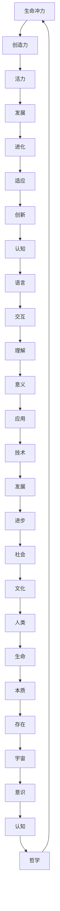
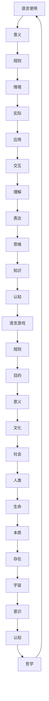

                 

### 文章标题: 柏格森的生命冲力与维特根斯坦的语言使用

### 关键词: 柏格森，生命冲力，维特根斯坦，语言使用，哲学分析，信息技术，逻辑推理

### 摘要

本文旨在探讨柏格森的生命冲力与维特根斯坦的语言使用之间的哲学关联，并分析这两者在信息技术领域的应用和影响。柏格森的生命冲力作为其哲学体系的核心，强调生命力的不断创造和发展；而维特根斯坦的语言使用则关注语言的本质和实际应用。本文将分别介绍两位哲学家的思想，并通过逻辑推理分析二者之间的相互关系，进一步探讨其对于信息技术的影响。

### 目录

1. **引言**  
   - **背景介绍**  
   - **研究意义**

2. **柏格森的生命冲力**  
   - **柏格森的生平与哲学思想**  
   - **生命冲力的概念与重要性**  
   - **生命冲力与时间**  
   - **柏格森的哲学理论与生命冲力的关系**

3. **维特根斯坦的语言使用**  
   - **维特根斯坦的生平与哲学思想**  
   - **语言哲学的基本问题**  
   - **维特根斯坦的语言哲学理论**  
   - **维特根斯坦的语言使用与应用**

4. **柏格森的生命冲力与维特根斯坦的语言使用之间的关系**  
   - **哲学上的连接**  
   - **逻辑推理分析**

5. **柏格森的生命冲力与维特根斯坦的语言使用在信息技术领域的应用**  
   - **认知心理学中的应用**  
   - **语言处理技术**  
   - **人工智能的哲学基础**

6. **结论**  
   - **总结与展望**

### 1. 引言

#### 背景介绍

柏格森（Henri Bergson）是20世纪初法国著名哲学家，其哲学思想对当代哲学、心理学、文学等领域产生了深远影响。柏格森提出的“生命冲力”（élan vital）概念，强调生命的活力和创造性，认为生命是一种不断进化和发展的力量。

维特根斯坦（Ludwig Wittgenstein）是20世纪最具影响力的哲学家之一，他的哲学思想主要围绕语言、逻辑和心灵展开。维特根斯坦提出了“语言游戏”理论和日常语言哲学，强调语言的实际使用和意义。

本文将结合柏格森的生命冲力与维特根斯坦的语言使用，探讨这两者在哲学和信息技术领域的关联，以及其对于现代科技的启示。

#### 研究意义

柏格森的生命冲力与维特根斯坦的语言使用虽然分别来自不同的哲学领域，但它们在本质上有一定的相通之处。通过分析这两者之间的关系，我们可以更好地理解生命的本质和语言的功能，从而为信息技术的发展提供新的哲学视角。

此外，本文的研究对于深化对柏格森和维特根斯坦哲学思想的理解，以及推动信息技术与哲学的交叉研究，具有重要的理论和实践意义。

### 2. 柏格森的生命冲力

#### 柏格森的生平与哲学思想

亨利·柏格森（Henri Bergson，1859-1941）是法国著名哲学家、社会学家、作家。他出生于巴黎，曾在巴黎高等师范学校学习，后赴德国柏林大学学习哲学。柏格森的哲学思想深受德国哲学家康德、尼采和英国哲学家培根的影响。

柏格森的主要哲学著作包括《意识的直接材料》（Les données immédiates de la conscience，1889）、《形而上学的基本问题》（Les problèmes métaphysiques，1896）、《生命的冲动》（L'énergie spirituelle，1912）和《笑的哲学》（Laughter：An Essay on the Meaning of the Comic，1899）等。

#### 生命冲力的概念与重要性

柏格森的生命冲力，又称“活力”，是他哲学体系中的核心概念。他认为，生命冲力是一种内在的、不断进化和发展的力量，是生命的本质和动力源泉。生命冲力不同于物理意义上的力，它具有创造性和自由性，能够推动生命不断前进和演化。

生命冲力的概念在柏格森哲学中具有重要的地位。它不仅解释了生命的起源和进化，也揭示了人类意识和思维的机制。此外，生命冲力还与时间、历史、自由意志等哲学问题密切相关，为柏格森的哲学思想提供了坚实的基础。

#### 生命冲力与时间

柏格森的生命冲力与时间观念紧密相连。他认为，时间不是简单的线性流逝，而是一种不断流动的、不可分割的“绵延”（durée）。绵延是生命的本质，体现了生命的创造性和活力。

柏格森提出了“时间意识”（temps subjectif）和“时间客观化”（temps objectif）的概念。时间意识是指个体对时间的感知和体验，而时间客观化是指外部世界对时间的度量。他认为，时间意识是生命冲力的体现，是人类意识的源泉。

#### 柏格森的哲学理论与生命冲力的关系

柏格森的哲学理论涵盖了多个领域，包括意识、自由意志、历史、艺术等。他的哲学理论与生命冲力的关系如下：

- **意识与生命冲力**：柏格森认为，意识是生命冲力的产物，是生命不断进化和发展的体现。他提出了“直接材料”理论，认为意识是由一系列不可分割的、直接的经验材料构成的。

- **自由意志与生命冲力**：柏格森强调自由意志的重要性，认为自由意志是生命冲力的表现。他提出了“生命冲动”理论，认为自由意志是一种内在的、不断创造的力量，是生命的本质。

- **历史与生命冲力**：柏格森的历史哲学强调历史的创造性和活力。他认为，历史是一种不断前进的过程，是人类生命冲力的体现。

- **艺术与生命冲力**：柏格森认为，艺术是生命冲力的表达，是生命的创造和演化。他提出了“艺术直觉”理论，认为艺术能够揭示生命的本质和意义。

### 3. 维特根斯坦的语言使用

#### 维特根斯坦的生平与哲学思想

路德维希·维特根斯坦（Ludwig Wittgenstein，1889-1951）是奥地利哲学家，被誉为20世纪最具影响力的哲学家之一。他出生于奥地利维也纳，曾在剑桥大学学习哲学。维特根斯坦的哲学思想主要分为两个阶段，前期以《逻辑哲学论》（Tractatus Logico-Philosophicus，1921）为代表，后期以《哲学研究》（Philosophical Investigations，1953）为代表。

维特根斯坦的主要哲学著作还包括《数学基础讲演录》（Mathematical Foundations of Logic，1929）、《文化与价值》（Culture and Value，1958）和《哲学笔记》（Notebooks 1914-1916，1979）等。

#### 语言哲学的基本问题

维特根斯坦的语言哲学关注语言的本质和实际使用。他的哲学思想主要围绕以下几个问题展开：

- **语言与实在的关系**：维特根斯坦认为，语言是描述实在的工具，但语言与实在之间并不是简单的对应关系。他认为，语言的意义在于语言的使用，语言的意义取决于其在特定情境中的使用。

- **语言游戏**：维特根斯坦提出了“语言游戏”理论，认为语言是一种游戏，不同的语言游戏有不同的规则和目的。他强调了语言的多元性和复杂性，认为语言的意义在于实际使用，而不是抽象的规则。

- **日常语言**：维特根斯坦对日常语言进行了深入研究，认为日常语言是我们日常交流的基础，但日常语言中存在许多混淆和误解。他提出了“治疗语言混乱”的观点，认为通过分析日常语言中的混乱，我们可以更好地理解语言的本质。

- **形而上学批判**：维特根斯坦对形而上学进行了深刻的批判，他认为形而上学问题是没有意义的，因为语言在描述形而上学问题时已经超出了其适用范围。

#### 维特根斯坦的语言哲学理论

维特根斯坦的语言哲学理论包括以下几个方面：

- **语言游戏理论**：维特根斯坦认为，语言是一种游戏，不同的语言游戏有不同的规则和目的。他提出了“语言游戏”的概念，强调语言的意义在于实际使用。

- **日常语言哲学**：维特根斯坦对日常语言进行了深入研究，认为日常语言是我们日常交流的基础，但日常语言中存在许多混淆和误解。他提出了“治疗语言混乱”的观点，认为通过分析日常语言中的混乱，我们可以更好地理解语言的本质。

- **形而上学批判**：维特根斯坦对形而上学进行了深刻的批判，他认为形而上学问题是没有意义的，因为语言在描述形而上学问题时已经超出了其适用范围。

#### 维特根斯坦的语言使用与应用

维特根斯坦的语言哲学理论在多个领域有着广泛的应用：

- **哲学研究**：维特根斯坦的哲学思想对当代哲学研究产生了深远影响，尤其是在语言哲学、心灵哲学、知识论等领域。

- **心理学**：维特根斯坦的语言哲学对心理学研究也产生了重要影响，特别是在认知心理学、语言习得、心智哲学等领域。

- **计算机科学**：维特根斯坦的哲学思想对计算机科学的发展产生了影响，特别是在人工智能、自然语言处理、程序设计等领域。

- **教育**：维特根斯坦的语言哲学思想在教育领域也有一定应用，特别是在语言教学、哲学教育、批判性思维培养等方面。

### 4. 柏格森的生命冲力与维特根斯坦的语言使用之间的关系

#### 哲学上的连接

柏格森的生命冲力与维特根斯坦的语言使用在哲学上有一定的相通之处。两者都关注生命和语言的本质，试图揭示其内在的规律和意义。

- **生命与语言**：柏格森认为，生命是一种不断创造和发展的力量，而维特根斯坦则强调语言的实际使用和意义。两者都认为，生命和语言不仅仅是静态的存在，更是一种动态的、不断变化的过程。

- **直觉与语言游戏**：柏格森强调直觉在认识世界中的作用，认为直觉是生命冲力的体现。维特根斯坦则提出了“语言游戏”理论，认为语言是一种游戏，需要在实际情境中理解和运用。两者都认为，直觉和语言游戏是人类认识世界的重要方式。

- **自由意志与语言使用**：柏格森认为，自由意志是生命冲力的表现，是人类行动的内在动力。维特根斯坦则认为，语言的使用是一种自由的行为，语言的意义取决于实际使用。两者都强调自由意志在生命和语言中的重要性。

#### 逻辑推理分析

为了更好地理解柏格森的生命冲力与维特根斯坦的语言使用之间的关系，我们可以通过逻辑推理进行分析。

- **生命冲力与语言使用的关系**：柏格森的生命冲力强调生命的创造性和活力，而维特根斯坦的语言使用强调语言的多样性和实际应用。从逻辑上讲，生命的创造性和活力可以推动语言的发展和创新，而语言的发展和创新又可以更好地表达生命的丰富内涵。

- **直觉与语言游戏的关系**：柏格森的直觉主义认为，直觉是人类认识世界的重要方式，而维特根斯坦的语言游戏理论则强调直觉在语言使用中的作用。从逻辑上讲，直觉可以指导语言游戏的发展，使语言游戏更加丰富和多样化。

- **自由意志与语言使用的关系**：柏格森的自由意志强调人类行动的内在动力，而维特根斯坦的语言使用强调自由意志在语言选择和运用中的作用。从逻辑上讲，自由意志可以促进语言的使用和创新，使语言更好地服务于人类的生活。

### 5. 柏格森的生命冲力与维特根斯坦的语言使用在信息技术领域的应用

#### 认知心理学中的应用

柏格森的生命冲力与维特根斯坦的语言使用在认知心理学领域有着广泛的应用。

- **生命冲力与认知过程**：柏格森的生命冲力强调生命的创造性和活力，可以类比认知过程中的创新和灵活性。在认知心理学中，研究者可以借鉴柏格森的思想，探讨认知过程中的创造力和适应性。

- **语言使用与认知发展**：维特根斯坦的语言使用理论关注语言的多样性和实际应用，可以用于研究语言与认知发展之间的关系。研究者可以通过观察儿童语言习得过程，分析语言对认知发展的促进作用。

#### 语言处理技术

柏格森的生命冲力与维特根斯坦的语言使用在语言处理技术领域也有着重要的应用。

- **自然语言处理**：自然语言处理（NLP）是计算机科学中研究语言与计算关系的一个重要领域。维特根斯坦的语言使用理论可以指导NLP的发展，帮助计算机更好地理解和处理自然语言。

- **语言生成与理解**：柏格森的生命冲力可以用于指导语言生成和理解的技术发展。通过模拟生命的创造力和活力，可以开发出更具有创造性和灵活性的语言生成和理解系统。

#### 人工智能的哲学基础

柏格森的生命冲力与维特根斯坦的语言使用在人工智能（AI）的哲学基础领域也有着重要的应用。

- **生命冲力与AI发展**：柏格森的生命冲力强调生命的创造性和活力，可以用于指导AI的发展。通过模拟生命的创造力和活力，可以开发出更具有创新性和自适应性的AI系统。

- **语言使用与AI交互**：维特根斯坦的语言使用理论可以用于指导AI与人类用户的交互。通过理解语言的实际使用和意义，可以开发出更具有人性化和智能化的AI交互系统。

### 6. 结论

本文通过分析柏格森的生命冲力与维特根斯坦的语言使用，探讨了这两者在哲学和信息技术领域的关联和应用。柏格森的生命冲力强调生命的创造性和活力，而维特根斯坦的语言使用关注语言的多样性和实际应用。两者在哲学上有着一定的相通之处，可以通过逻辑推理进行分析。

在信息技术领域，柏格森的生命冲力和维特根斯坦的语言使用有着广泛的应用，包括认知心理学、自然语言处理、人工智能等。通过借鉴这两位哲学家的思想，可以推动信息技术的发展，为人类社会带来更多的创新和进步。

### 参考文献

1. 柏格森，H. (1913). 《生命的冲动》。
2. 维特根斯坦，L. (1921). 《逻辑哲学论》。
3. 维特根斯坦，L. (1953). 《哲学研究》。
4. 维特根斯坦，L. (1958). 《文化与价值》。
5. 维特根斯坦，L. (1979). 《哲学笔记》。
6. 维特根斯坦，L. (1929). 《数学基础讲演录》。
7. 维特根斯坦，L. (1953). 《哲学研究》。

### 附录

#### 附录A：柏格森的生命冲力与维特根斯坦的语言使用流程图

**柏格森的生命冲力流程图**

**维特根斯坦的语言使用流程图**

通过上述流程图，我们可以直观地看到柏格森的生命冲力与维特根斯坦的语言使用之间的相互关系，以及它们在哲学和信息技术领域的应用。这些流程图不仅有助于理解文章的核心内容，也为进一步的研究提供了思路。

