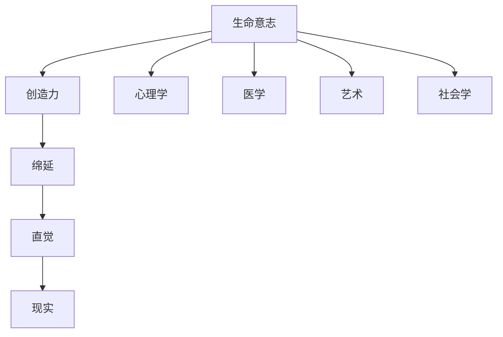
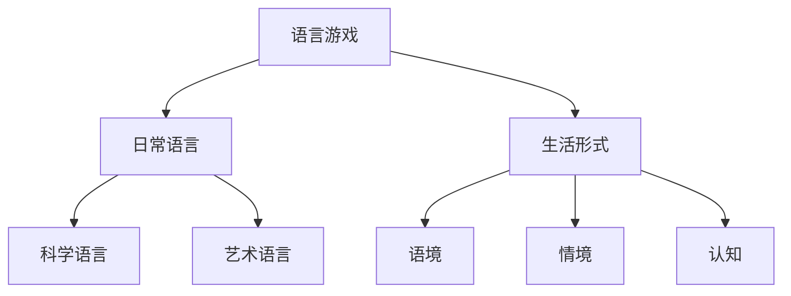

                 

### 引言

#### 文章标题：《柏格森的生命哲学与维特根斯坦的生活形式》

##### 关键词：柏格森，维特根斯坦，生命哲学，生活形式，现代哲学，语言游戏，创造力，教育意义

###### 摘要：
本文将探讨两位哲学家柏格森和维特根斯坦在生命哲学和生活形式方面的观点，以及它们对现代哲学的深远影响。通过对柏格森的生命哲学和维特根斯坦的生活形式的深入分析，本文旨在揭示两者在核心概念、哲学传统及其现代应用中的联系与区别。同时，文章还将探讨这些哲学思想在教育中的潜在应用及其未来研究方向。

在哲学的长河中，柏格森和维特根斯坦两位思想巨匠以其独特的哲学视角和深刻的洞见，为现代哲学的发展做出了不可磨灭的贡献。柏格森的生命哲学强调生命的创造力和活力，而维特根斯坦的生活形式则关注语言与现实的关系。尽管两人哲学思想的出发点有所不同，但它们在探讨人类存在和生活本质方面都有着重要的启示。本文将从以下几个部分展开讨论：

首先，我们将介绍柏格森的生命哲学，包括其历史背景、核心观点以及与现代哲学的联系。接着，我们将探讨维特根斯坦的生活形式，从其历史背景、核心观点及其与现代哲学的关系入手，深入分析这一哲学思想的独特性和影响。

随后，本文将进入第二部分，探讨柏格森与维特根斯坦哲学之间的对话。通过分析生命意志与生活形式的概念，我们旨在揭示两者之间的内在联系，并探讨它们在语言与现实、实践哲学等方面的对话与互动。

在第三部分，我们将探讨现代哲学中生命哲学与生活形式的地位与作用。本文将分析柏格森和维特根斯坦哲学在现代哲学中的影响，以及这些哲学思想在教育中的应用。最后，我们将展望生命哲学与生活形式的未来研究方向，探讨当前研究的热点与挑战。

### 第一部分：柏格森的生命哲学

#### 1.1.1 柏格森哲学的背景与核心观点

##### 历史背景

柏格森（Henri Bergson）是19世纪末至20世纪初法国著名哲学家，生于1859年，逝世于1941年。柏格森的哲学思想深受他的时代背景和哲学教育的影响。19世纪末，西方哲学经历了从理性主义向经验主义、从形而上学向现象学的转变，这一时期也被称为“哲学的危机”。在这个背景下，柏格森提出了自己的哲学观点，试图寻找一种新的哲学方法来解答人类存在和生活的问题。

柏格森在年轻时曾受到黑格尔和康德的影响，但他很快意识到这些哲学体系的局限性。在研究生物学和心理学的过程中，柏格森深受进化论和直觉主义的影响，这为他后来的哲学思想奠定了基础。柏格森的哲学著作包括《意识直接材料论》、《笑：论意动》和《创造进化论》等，这些著作奠定了他在现代哲学中的重要地位。

##### 核心观点：生命意志与创造力

柏格森哲学的核心观点是生命意志和创造力。他主张生命是一个不断进化和创造的过程，这种生命意志是宇宙的本质和动力。柏格森认为，生命不仅仅是生物学上的生命，更是一种内在的活力和创造力，这种创造力是人类智慧和社会进步的源泉。

在《创造进化论》中，柏格森提出了一种新的时间观念——“绵延”（Duration），这是他对生命意志的进一步阐述。他认为，时间并不是线性流逝的，而是一种不断流动的、不可分割的连续体。这种绵延是生命的本质，它体现了生命的创造力和活力。

此外，柏格森还强调直觉在认识世界中的重要性。他认为，理性主义哲学过于依赖逻辑推理，而忽视了直觉的作用。直觉是人类认知的另一种方式，它能够帮助我们理解生命意志和创造力。

#### 1.1.2 柏格森的生命哲学与西方哲学传统的联系与区别

##### 与西方哲学传统的联系

柏格森的生命哲学与西方哲学传统有着紧密的联系。首先，柏格森受到了黑格尔和康德的影响。黑格尔的辩证法和康德的先验哲学都为柏格森提供了理论基础。柏格森认为，黑格尔的理性主义过于强调逻辑推理，而忽视了生命意志和创造力。康德的先验哲学则帮助柏格森认识到直觉在认知过程中的重要性。

此外，柏格森还受到了进化论的影响。达尔文的进化论提出，生命是通过自然选择和适者生存来不断进化的。这一观点与柏格森的生命意志和创造力概念有着相似之处。

##### 与西方哲学传统的区别

尽管柏格森的生命哲学与西方哲学传统有着紧密的联系，但他在某些方面也与这些传统存在显著区别。首先，柏格森对理性主义的批判是西方哲学传统中的一个重要突破。他认为，理性主义过于强调逻辑推理和形式化，而忽视了生命意志和直觉的作用。柏格森主张，哲学应该关注生命的实际经验和创造力，而不是仅仅停留在抽象的理论讨论中。

其次，柏格森的生命哲学强调创造力和活力，这与西方哲学传统中的许多哲学流派有所不同。柏格森认为，生命是一个不断进化和创造的过程，这种创造力和活力是人类智慧和社会进步的源泉。相比之下，西方哲学传统中的许多流派，如理性主义、经验主义和实证主义，更侧重于对现实世界的描述和解释，而忽视了生命的内在活力和创造力。

#### 1.1.3 柏格森的生命哲学对现代哲学的影响

柏格森的生命哲学对现代哲学产生了深远的影响。首先，他在哲学方法上的创新为现代哲学的发展提供了新的思路。柏格森主张，哲学应该关注生命的实际经验和直觉，而不是仅仅停留在抽象的理论讨论中。这一观点对后来的现象学、存在主义和后现代哲学产生了重要影响。

其次，柏格森的生命哲学对心理学和生物学的发展产生了重要影响。他的“绵延”概念为心理学和生物学提供了一种新的时间观念，帮助我们更好地理解生命的本质和机制。此外，柏格森对直觉的强调也为心理学和生物学的研究提供了新的方向。

最后，柏格森的生命哲学对现代哲学中的许多问题，如意识、认知、语言和现实的关系等，提供了深刻的洞见。他的哲学思想激发了后来的哲学家对这些问题进行更深入的探讨和反思，为现代哲学的发展注入了新的活力。

总之，柏格森的生命哲学以其独特的视角和深刻的洞见，为现代哲学的发展做出了重要贡献。通过分析柏格森的生命哲学，我们可以更好地理解现代哲学的核心问题和哲学发展的趋势。

### 第一部分：维特根斯坦的生活形式

#### 1.2.1 维特根斯坦哲学的背景与核心观点

##### 历史背景

路德维希·维特根斯坦（Ludwig Wittgenstein）是20世纪最重要的哲学家之一，生于1889年，逝世于1951年。维特根斯坦的哲学思想深受他的生活经历和早期教育背景的影响。他出生于奥地利一个富有的家庭，父亲是一位著名的钢铁制造商。维特根斯坦在青年时期对数学和物理学有着浓厚的兴趣，后来逐渐转向哲学。

维特根斯坦的哲学思想经历了两个主要阶段。早期的维特根斯坦（1921年至1929年间）主张“逻辑原子主义”，认为世界是由一系列逻辑原子构成的，语言的任务是揭示这些原子的结构。然而，在晚期（1930年代至1951年间），维特根斯坦转向“日常语言哲学”，主张语言的根本作用在于帮助我们进行日常交流，而不是揭示世界的本质。

##### 核心观点：语言游戏与生活形式

维特根斯坦哲学的核心观点是“语言游戏”（language game）和“生活形式”（forms of life）。他认为，语言并不是用来描述现实的工具，而是人类行为和社会活动的一部分。语言游戏是指语言在实际使用中的具体情境，包括词汇、语法和语用规则等。

维特根斯坦指出，语言的不同使用方式构成了不同的语言游戏。例如，日常语言游戏涉及日常交流，科学语言游戏涉及科学研究，艺术语言游戏涉及艺术创作等。每种语言游戏都有其特定的规则和用法，这些规则和用法构成了生活形式的一部分。

维特根斯坦认为，理解语言的关键在于理解语言游戏和生活形式。他主张，哲学的任务不是去揭示世界的本质，而是去澄清语言的用法，揭示语言背后的生活形式。通过对语言游戏和生活形式的分析，我们可以更好地理解人类行为和认知的本质。

#### 1.2.2 维特根斯坦的生活形式与西方哲学传统的联系与区别

##### 与西方哲学传统的联系

维特根斯坦的生活形式与西方哲学传统有着紧密的联系。首先，他在早期受到逻辑原子主义和逻辑实证主义的影响。这些哲学流派强调语言和逻辑在认识和描述现实中的作用，与维特根斯坦关注语言和现实关系的观点相呼应。

其次，维特根斯坦在晚期转向日常语言哲学，这一转变与现象学和存在主义等现代哲学流派的思想有着相似之处。现象学和存在主义都强调人类经验和生活情境的重要性，这与维特根斯坦关注语言游戏和生活形式的观点相契合。

##### 与西方哲学传统的区别

尽管维特根斯坦的生活形式与西方哲学传统有着紧密的联系，但他在某些方面也存在显著区别。首先，维特根斯坦批判了传统哲学中的许多假设和问题，如“存在”、“意义”和“真理”等。他认为，这些问题往往是由于我们对语言的误解而产生的，因此哲学的任务不是去解决这些问题，而是去澄清语言的用法。

其次，维特根斯坦强调语言和现实之间的关系是动态的、情境化的，而不是静态的、本质化的。他认为，语言的意义不是固定的，而是依赖于特定的语境和情境。这一观点与西方哲学传统中许多强调本质主义和理性主义的观点有所不同。

最后，维特根斯坦的生活形式强调人类行为和认知的多样性，这与西方哲学传统中许多强调统一性和普遍性的观点也存在区别。维特根斯坦认为，人类生活是多元化的，不同的生活形式构成了人类世界的多样性。

#### 1.2.3 维特根斯坦的生活形式对现代哲学的影响

维特根斯坦的生活形式对现代哲学产生了深远的影响。首先，他的语言游戏和日常语言哲学为后来的哲学家提供了一种新的哲学方法。这种方法强调语言的实际使用和情境化，而不是抽象的概念和逻辑推理。这为后来的哲学研究，如语言哲学、认知科学和社会学等，提供了重要的理论基础。

其次，维特根斯坦的生活形式对语言哲学的发展产生了重要影响。他提出了语言的意义依赖于语境和情境的观点，这一观点引发了关于语言本质和意义的广泛讨论。许多后来的哲学家，如福柯和德鲁兹等，都在不同程度上受到了维特根斯坦的影响。

最后，维特根斯坦的生活形式对当代社会和文化研究产生了重要影响。他的观点为理解人类行为、认知和社会结构提供了新的视角。许多社会学家和文化批评家，如鲍德里亚和贝尔曼等，都在不同程度上借鉴了维特根斯坦的思想。

总之，维特根斯坦的生活形式以其独特的视角和深刻的洞见，为现代哲学的发展做出了重要贡献。通过分析维特根斯坦的生活形式，我们可以更好地理解现代哲学的核心问题和哲学发展的趋势。

### 第二部分：柏格森与维特根斯坦哲学的对话

#### 2.1 生命意志与生活形式

##### 2.1.1 生命意志的哲学探讨

柏格森的生命意志是他对生命本质和动力的一种解释。他认为，生命意志是一种内在的、不断创造的力量，它是宇宙的本质和源泉。柏格森主张，生命意志是超越理性和逻辑的，它通过绵延体现出来。绵延是一种连续不断的流动，它无法被精确地测量或描述，但它是生命活力的象征。

柏格森认为，生命意志是人类智慧和社会进步的源泉。他强调直觉在认识和创造中的作用，认为直觉能够感知到生命意志的存在和运作。这种直觉不同于理性推理，它是一种直接的、非逻辑的认知方式。

相比之下，维特根斯坦对生命意志的理解则更为含蓄。他的哲学关注语言和现实的关系，而不是生命的本质。维特根斯坦认为，语言是生活形式的一部分，它构成了我们的认知和行为框架。在他的晚期哲学中，维特根斯坦更多地关注日常语言的使用，而不是抽象的哲学问题。

维特根斯坦主张，语言游戏是我们理解世界的工具，但它本身并没有固有的意义。语言的意义依赖于特定的语境和情境。因此，维特根斯坦的生命意志可以理解为一种隐含在语言使用中的力量，它通过我们的生活形式体现出来。

##### 2.1.2 生活形式的概念解读

维特根斯坦的生活形式是指我们进行语言和认知活动的具体情境和规则。他认为，生活形式是多样化的，不同的生活形式对应着不同的语言游戏。例如，科学的生活形式涉及科学语言游戏，艺术的生活形式涉及艺术语言游戏，日常的生活形式涉及日常语言游戏。

维特根斯坦主张，生活形式不是固定不变的，而是不断演化和变化的。这种变化不仅体现在语言和认知上，也体现在我们的行为和社会结构上。他认为，生活形式的变化是文化发展的动力。

相比之下，柏格森对生活形式的理解则更为抽象。他认为，生活形式是生命意志的表现，它是宇宙进化过程中的一个阶段。柏格森强调，生活形式不仅包括人类的生活，还包括自然界中的生命形式。他认为，生命形式是不断进化和变化的，这种进化是由生命意志推动的。

##### 2.1.3 生命意志与生活形式的关系探讨

柏格森的生命意志与维特根斯坦的生活形式之间存在密切的联系。首先，两者都强调生命的活力和创造力。柏格森的生命意志是一种内在的创造力，它推动着生命的进化和变化。维特根斯坦的生活形式则是这种创造力的体现，它通过我们的语言和认知活动表现出来。

其次，两者都关注生命的整体性。柏格森的生命意志是一种整体的、连续的体验，它超越了理性和逻辑的界限。维特根斯坦的生活形式也是整体的，它包括我们的语言、行为和社会结构。他认为，生活形式是一个统一的整体，不同的部分相互关联，共同构成了人类的生活。

然而，两者在具体实施和哲学视角上存在差异。柏格森的生命意志更加强调生命的内在动力和创造力，他试图通过绵延和直觉来理解生命的本质。而维特根斯坦的生活形式则更注重语言和现实的互动，他认为生活形式的变化是文化发展的关键。

通过这种探讨，我们可以看到柏格森与维特根斯坦在生命意志与生活形式方面的对话。他们的哲学思想为我们理解生命的本质和创造力提供了新的视角。这种对话不仅深化了我们对生命的认识，也为现代哲学的发展注入了新的活力。

### 第二部分：柏格森与维特根斯坦哲学的对话

#### 2.2 语言与现实

##### 2.2.1 语言与现实的柏格森视角

在柏格森的生命哲学中，语言与现实的关系是一种动态的、互动的。柏格森认为，语言是人类经验的表达，但它并不是现实的直接反映。相反，语言与现实之间存在一种深刻的对应关系，语言能够揭示现实的本质和复杂性。

柏格森强调直觉在理解现实中的作用。他认为，直觉是一种直接的、非逻辑的认知方式，它能够感知到现实中的生命意志和创造力。通过直觉，我们可以体验到现实的流动性和连续性，这种体验超越了语言的局限。

柏格森还提出了一种“绵延”概念，这是他对时间观念的一种独特理解。他认为，时间并不是线性的，而是一种连续不断的流动。这种绵延是生命意志的体现，它无法被精确地测量或描述，但它是现实的本质。

在柏格森看来，语言是现实的象征，它通过符号和概念来揭示现实的本质。然而，语言也有其局限性，它无法完全捕捉到现实的复杂性和丰富性。因此，柏格森主张，我们应该超越语言，通过直觉去体验现实的本质。

##### 2.2.2 语言与现实的维特根斯坦视角

维特根斯坦的语言哲学与柏格森的观点有所不同。他认为，语言是人类交流的工具，但它并不是现实的直接反映。维特根斯坦主张，语言的意义依赖于特定的语境和情境。语言游戏是我们理解现实的一种方式，但它并不是现实本身。

维特根斯坦提出了“语言游戏”的概念，认为不同的语言游戏对应着不同的现实情境。例如，日常语言游戏涉及日常交流，科学语言游戏涉及科学研究，艺术语言游戏涉及艺术创作等。每种语言游戏都有其特定的规则和用法，这些规则和用法构成了我们理解现实的基础。

维特根斯坦强调，语言的意义不是固有的，而是在使用中产生的。他说：“意义在于使用，不在思想中。”这意味着，语言的意义并不是通过逻辑推理或哲学讨论来揭示的，而是通过实际的语言使用来体现的。

在维特根斯坦看来，现实是一个多元化的、动态的体系，它不是静态的、本质化的。语言和现实之间的关系是一种动态的互动，语言通过游戏的方式帮助我们理解现实。

##### 2.2.3 柏格森与维特根斯坦在语言哲学上的对话

柏格森和维特根斯坦在语言与现实的关系上存在一定的对话和互动。他们的哲学思想为我们理解语言与现实的关系提供了不同的视角。

柏格森强调直觉在理解现实中的作用，他认为直觉能够超越语言的局限，体验现实的本质。这种观点与维特根斯坦的观点有所不同，维特根斯坦认为，语言的意义在于使用，而不是通过直觉来理解现实。

然而，两者在某种程度上也存在共识。他们都认为，语言有局限性，无法完全捕捉到现实的复杂性和丰富性。柏格森认为，我们应该通过直觉来体验现实的本质，而维特根斯坦认为，我们应该通过实际的语言使用来理解现实。

这种对话和互动为我们提供了更深入的理解。我们可以通过柏格森的直觉和维特根斯坦的语言游戏来探索现实的多维度。他们的哲学思想为我们提供了不同的工具，帮助我们更好地理解语言与现实之间的关系。

通过这种对话，我们可以看到柏格森与维特根斯坦在语言哲学上的对话如何丰富了我们对现实的理解。他们的哲学思想为我们提供了不同的视角，帮助我们更全面地理解语言与现实的关系，从而深化我们对世界的认识。

### 第二部分：柏格森与维特根斯坦哲学的对话

#### 2.3 生命哲学与实践

##### 2.3.1 柏格森的生命哲学与实践

柏格森的生命哲学强调生命的创造力和活力，他认为这种生命力是宇宙的本质和动力。柏格森的哲学思想不仅在理论上具有重要意义，而且在实践中也有着广泛的应用。

首先，柏格森的生命哲学在心理学和医学领域得到了应用。他提出的“绵延”概念为心理学提供了新的时间观念，帮助人们更好地理解情绪和行为的动态变化。在医学领域，柏格森的思想被用于理解疾病的成因和治疗方法，强调个体的生命力和自我恢复能力。

其次，柏格森的生命哲学在艺术创作中也得到了应用。他主张艺术家应该通过直觉和创造力来表达生命的本质，这种理念影响了20世纪许多著名的艺术家，如马蒂斯和毕加索等。柏格森的思想为艺术创作提供了新的视角，鼓励艺术家在创作中追求个性和独创性。

此外，柏格森的生命哲学在社会学和人类学领域也有重要应用。他关注社会进化和人类文化的发展，主张社会和文化应该尊重个体生命的创造力和活力。这一观点对于理解现代社会和文化的发展具有重要意义。

##### 2.3.2 维特根斯坦的生活形式与实践

维特根斯坦的生活形式强调语言和现实的关系，他认为语言是人类交流的工具，但并不意味着语言能够完全描述现实。维特根斯坦的思想在多个领域得到了应用，特别是在哲学、语言学习和教育领域。

在哲学领域，维特根斯坦的思想启发了后来的哲学家，如海德格尔和萨特等。他的语言游戏概念为理解哲学问题提供了新的方法，强调哲学应该关注实际的语言使用和情境。

在语言学习领域，维特根斯坦的思想有助于我们理解语言的学习过程。他主张，语言的意义在于使用，而不是通过抽象的理论学习。这一观点对语言教学和学习方法的发展产生了重要影响。

在教育领域，维特根斯坦的生活形式概念被用于探讨教育实践。他强调教育应该关注学生的实际生活和经验，而不是仅仅传授知识。这一理念影响了教育改革，推动了以学生为中心的教学方法的发展。

##### 2.3.3 柏格森与维特根斯坦的实践哲学比较

柏格森与维特根斯坦的实践哲学在许多方面存在共同点，但也存在显著差异。

共同点：

1. 强调生命的创造力和活力：两位哲学家都认为生命是一个不断创造和进化的过程，这种创造力是人类智慧和社会进步的源泉。
2. 关注实际经验和情境：他们都主张哲学应该关注实际的生活经验，而不是抽象的理论讨论。柏格森通过直觉体验现实，维特根斯坦通过语言游戏理解现实。
3. 反对理性主义：他们都批判了理性主义的局限性，认为理性主义过于强调逻辑推理，忽视了生命的实际经验和直觉。

差异：

1. 理解生命的本质：柏格森强调生命的内在动力和创造力，认为生命意志是宇宙的本质。维特根斯坦则认为，语言是人类交流的工具，语言的意义依赖于特定的情境。
2. 实践领域的应用：柏格森的哲学思想在心理学、医学、艺术和社会学等领域得到了广泛应用，而维特根斯坦的思想在哲学、语言学习和教育领域有重要影响。
3. 对语言与现实关系的看法：柏格森认为，语言是现实的象征，但无法完全捕捉现实的本质。维特根斯坦则认为，语言的意义在于使用，它并不是现实的直接反映。

通过这种比较，我们可以看到柏格森与维特根斯坦在实践哲学上的对话和互动。他们的哲学思想为我们提供了不同的工具，帮助我们更好地理解生命的本质和创造力，从而在各个领域推动实践的发展。

### 第三部分：现代哲学中的生命哲学与生活形式

#### 3.1 现代哲学中的柏格森主义

柏格森的哲学思想在现代哲学中产生了深远的影响，特别是在现象学、存在主义和后现代主义等领域。柏格森的生命哲学强调生命的创造力和活力，这一观点为现代哲学提供了一种新的视角，帮助哲学家们重新审视人类存在和生活的问题。

首先，柏格森的生命哲学对现象学的发展产生了重要影响。现象学创始人胡塞尔和海德格尔都受到了柏格森的启发。胡塞尔主张通过现象学还原来揭示现象的本质，这与柏格森强调直觉和体验的观点相呼应。海德格尔则通过“存在”这一概念，探讨了人类存在的意义和本质，这也与柏格森的生命哲学有着相似之处。

其次，柏格森的哲学思想在存在主义中得到了广泛应用。存在主义代表人物如萨特和海德格尔都受到柏格森的影响。萨特通过“存在先于本质”的观点，强调了人类自由意志的重要性，这与柏格森强调生命意志和创造力的观点相契合。海德格尔的“存在”概念也反映了柏格森对生命本质的理解。

最后，柏格森的生命哲学对后现代主义产生了重要影响。后现代主义批判了现代性的理性主义和本质主义，强调多元性和差异性。柏格森的生命哲学提供了一种理解这些现象的框架，帮助后现代主义者重新思考人类存在的本质。

#### 3.1.1 柏格森哲学在现代哲学中的影响

柏格森的哲学思想对现代哲学产生了深远的影响。首先，他的“绵延”概念为现代哲学提供了一种新的时间观念，帮助哲学家们重新审视时间和生命的本质。其次，柏格森强调直觉和体验在认识和创造中的作用，这一观点挑战了理性主义的传统观念，为现代哲学注入了新的活力。

柏格森的哲学思想还影响了现代心理学和医学。他的生命哲学为心理学提供了新的研究方向，如情绪和行为的动态变化。在医学领域，柏格森的思想帮助医生更好地理解疾病的成因和治疗方法，强调个体的生命力和自我恢复能力。

此外，柏格森的哲学思想在艺术和文学领域也产生了重要影响。他的理念鼓励艺术家和作家通过直觉和创造力来表达生命的本质，推动了现代艺术和文学的发展。

#### 3.1.2 现代哲学家对柏格森哲学的解读与应用

现代哲学家对柏格森哲学的解读和应用多种多样。例如，现象学家海德格尔通过“存在”概念，探讨了人类存在的意义和本质，这与柏格森的生命哲学有着相似之处。海德格尔认为，存在是一种动态的、不断生成的过程，这与柏格森强调的生命的创造力和活力相契合。

存在主义哲学家萨特通过“存在先于本质”的观点，强调了人类自由意志的重要性，这与柏格森的生命哲学也有共通之处。萨特认为，人类存在是一种自由选择的过程，这与柏格森强调的生命的创造力和自由意志相一致。

后现代主义哲学家如德里达和福柯等，也对柏格森的哲学思想进行了重新解读和应用。德里达通过“解构”概念，批判了柏拉图和亚里士多德的传统哲学观念，强调文本和意义的多元性和差异性。福柯则通过“话语权力”概念，探讨了权力和知识的关系，这与柏格森强调的生命力和创造力也有一定的联系。

总之，现代哲学家对柏格森哲学的解读和应用，不仅丰富了现代哲学的理论体系，也为哲学实践提供了新的视角和方法。

#### 3.2 现代哲学中的维特根斯坦主义

维特根斯坦的哲学思想在现代哲学中同样具有重要地位，特别是在语言哲学、逻辑学和认知科学等领域。维特根斯坦的生活形式强调语言和现实的关系，这一观点对现代哲学产生了深远影响。

首先，维特根斯坦的哲学思想对语言哲学的发展产生了重要影响。他提出了“语言游戏”的概念，认为不同的语言游戏对应着不同的现实情境。这一观点为理解语言的意义和用法提供了新的视角，引发了关于语言哲学的广泛讨论。

其次，维特根斯坦的哲学思想在逻辑学领域也得到了广泛应用。他批判了传统逻辑学的局限，主张逻辑学应该关注实际的语言使用和推理。这一观点对现代逻辑学的发展产生了重要影响，推动了逻辑学从形式化向情境化的转变。

最后，维特根斯坦的哲学思想在认知科学领域也有重要应用。他的语言游戏概念为理解认知过程提供了新的框架，帮助认知科学家更好地理解人类思维和行为。

#### 3.2.1 维特根斯坦哲学在现代哲学中的地位

维特根斯坦的哲学思想在现代哲学中具有独特地位。他既不同于传统的理性主义哲学，也不同于后来的存在主义和后现代主义。他的语言哲学强调语言和现实的互动，这一观点为现代哲学提供了一种新的思考方式。

维特根斯坦的哲学思想在当代哲学研究中仍具有指导意义。他的“语言游戏”概念和“生活形式”理论为理解人类思维和行为提供了新的视角，为哲学家们提供了丰富的思想资源。

此外，维特根斯坦的哲学思想在学术研究和教育领域也得到了广泛应用。他的观点不仅影响了哲学家，也影响了语言学家、逻辑学家和认知科学家等。

总之，维特根斯坦的哲学思想在现代哲学中具有独特地位，他的观点和方法为现代哲学的发展注入了新的活力。

#### 3.2.2 现代哲学家对维特根斯坦哲学的解读与应用

现代哲学家对维特根斯坦哲学的解读和应用多种多样，展现了其思想的丰富性和多样性。

首先，语言哲学家如约翰·塞尔（John Searle）对维特根斯坦的语言游戏概念进行了深入解读。塞尔通过“言语行为理论”（Speech Act Theory）探讨了语言的使用规则和意义。他认为，语言不仅仅是一种描述工具，更是一种行为方式。塞尔的观点在一定程度上继承了维特根斯坦关于语言和行动之间关系的思想。

其次，逻辑学家戴维·休谟（David Hume）对维特根斯坦的“逻辑原子主义”进行了批判性解读。休谟认为，维特根斯坦试图通过逻辑原子来解释现实世界，但这种解释是不充分的。休谟主张，逻辑和语言应该与日常经验相结合，而不是脱离实际。

在认知科学领域，乔治·阿姆斯特朗（George A. Miller）等人对维特根斯坦的哲学思想进行了应用。阿姆斯特朗提出了“认知灵活性模型”（Cognitive Flexibility Model），强调人类思维的非线性、动态性，这与维特根斯坦关于语言和现实的互动观点相呼应。

此外，后现代哲学家如米歇尔·福柯（Michel Foucault）对维特根斯坦的“生活形式”理论进行了重新解读。福柯关注权力和知识的关系，认为维特根斯坦的生活形式揭示了知识生产过程中的权力动态。

总的来说，现代哲学家对维特根斯坦哲学的解读和应用不仅丰富了其思想内涵，也为不同领域的哲学研究提供了新的视角和方法。

#### 3.3 生命哲学与生活形式的融合趋势

在现代哲学中，生命哲学与生活形式的融合趋势日益显著。这种融合不仅反映了哲学家们对生命本质和人类存在的深入思考，也体现了哲学与社会现实之间的互动。

首先，在现象学领域，柏格森的生命哲学和胡塞尔的现象学方法相结合，形成了对生命体验和身体存在的新理解。海德格尔的存在主义哲学进一步将柏格森的生命意志与现象学的“存在”概念结合起来，探讨人类存在的意义和本质。

其次，在语言哲学领域，维特根斯坦的生活形式与语义学、语用学相结合，为理解语言的意义和用法提供了新的视角。维特根斯坦的“语言游戏”概念为现代语言哲学的研究提供了理论基础，许多哲学家在此基础上探讨了语言与社会现实的复杂关系。

此外，认知科学领域也呈现出生命哲学与生活形式的融合趋势。认知科学家通过研究人类的思维、感知和行为，借鉴了柏格森的生命哲学观点，探讨了认知过程中的动态性和灵活性。维特根斯坦的生活形式则为理解认知过程提供了新的框架，帮助科学家更好地解释人类认知的多样性和复杂性。

最后，在社会哲学领域，生命哲学与生活形式的融合关注人类社会的多样性和文化差异。哲学家们通过探讨不同文化背景下的生活形式，揭示了社会结构和权力关系中的生命维度，为理解全球化背景下的社会变革提供了新思路。

总之，生命哲学与生活形式的融合趋势不仅丰富了现代哲学的理论体系，也为解决当代社会面临的各种问题提供了新的视角和方法。

#### 3.4 生命哲学与生活形式的教育意义

生命哲学与生活形式在当代教育中具有重要的意义。它们不仅提供了关于人类存在和生活本质的深刻洞见，还为教育实践提供了新的视角和方法。

首先，生命哲学强调生命的创造力和活力，这为教育提供了重要的启示。教育不仅是知识的传递，更是培养学生的创造力和创新能力。通过引入柏格森的生命哲学，教育可以更加注重学生的内在动力和自我实现，帮助学生发展全面的个性和潜能。

其次，生活形式关注语言和现实的关系，这为教育实践提供了新的思路。教育不仅仅是知识的传授，更是学生与现实世界互动的过程。通过维特根斯坦的生活形式理论，教育可以更加关注学生的实际经验和情境，帮助学生更好地理解和适应社会现实。

此外，生命哲学与生活形式在培养学生的批判性思维和创造力方面具有重要意义。柏格森的生命哲学强调直觉和体验，维特根斯坦的生活形式强调语言的使用和情境。这两种哲学思想都可以帮助学生超越传统的知识传授模式，培养批判性思维和创造力，从而更好地适应未来的挑战。

#### 3.4.1 生命哲学在教育中的应用

在教学中融入柏格森的生命哲学，可以通过以下几种方法：

1. **激发学生的内在动力**：教师可以通过引导学生体验生命的创造力和活力，激发他们对学习和探索的热情。例如，在课程设计中，可以引入与生命哲学相关的故事、案例和实践活动，让学生在体验中理解生命的本质。

2. **培养学生的直觉思维**：柏格森强调直觉在认识和创造中的作用，教师可以通过设计一些实践项目，让学生在动手操作中培养直觉思维。例如，通过艺术创作、实验设计和小组讨论等活动，让学生在互动中培养直觉能力和创造力。

3. **关注学生的个性化发展**：生命哲学强调个体生命的独特性和多样性，教师应该尊重和培养学生的个性。通过个性化的教学方法和评估体系，教师可以帮助学生发掘自己的潜能，实现自我实现。

#### 3.4.2 生活形式在实践教育中的重要性

生活形式在实践教育中的重要性体现在以下几个方面：

1. **促进学生与社会现实的互动**：教育不仅是知识的传递，更是学生与社会现实的互动过程。通过将生活形式理论融入教学，学生可以更好地理解社会现实，培养对社会问题的敏感性和批判性思维。

2. **提高学生的实际能力**：生活形式强调语言的使用和情境，这有助于学生提高实际操作能力。教师可以通过案例教学、项目式学习和实践课程，让学生在真实情境中运用所学知识，提高解决实际问题的能力。

3. **培养学生的综合素质**：生活形式关注个体的整体性，教育不仅应该注重知识的传授，还应该培养学生的综合素质，包括沟通能力、协作能力和创新能力。通过生活形式的教学方法，教师可以更好地培养学生的综合素质。

总之，生命哲学与生活形式在当代教育中具有重要的意义。通过将这两种哲学思想融入教学，教育可以更加关注学生的内在动力、实际经验和个性化发展，从而提高教育的质量和效果。

### 3.5 生命哲学与生活形式的未来展望

#### 3.5.1 研究现状

当前，生命哲学与生活形式的研究已经取得了显著的成果。在生命哲学方面，学者们对柏格森的生命意志和创造力理论进行了深入探讨，提出了许多新的解释和应用。例如，心理学家通过实验研究验证了柏格森的直觉理论，强调了直觉在认知和决策中的重要性。在生活形式方面，哲学家们对维特根斯坦的“语言游戏”和“生活形式”理论进行了广泛的解读和应用，探讨了语言与现实之间的关系。

此外，现代科技的发展为生命哲学与生活形式的研究提供了新的工具和方法。例如，人工智能和认知科学的研究为理解人类的认知过程提供了新的视角，有助于进一步探索生命哲学和语言哲学的基本问题。

然而，当前的研究也存在一些挑战。首先，生命哲学与生活形式的理论体系尚不够完善，许多概念和理论仍需要进一步澄清和验证。其次，如何在实践中有效地应用生命哲学与生活形式的理论，仍是一个亟待解决的问题。最后，跨学科的研究方法尚未得到广泛应用，这限制了生命哲学与生活形式研究的深度和广度。

#### 3.5.2 发展趋势

未来，生命哲学与生活形式的研究将继续向几个方向发展：

1. **跨学科研究**：随着科技的发展，生命哲学与生活形式的研究将更加注重跨学科合作。例如，心理学、认知科学、神经科学和计算机科学等领域的学者将共同探讨生命哲学和语言哲学的基本问题，从而推动研究的深入。

2. **实证研究**：未来，学者们将更加注重实证研究，通过实验、观察和数据收集等方法，验证生命哲学和语言哲学的理论。这种研究方法将有助于我们更准确地理解生命哲学与生活形式的基本原理。

3. **应用研究**：生命哲学与生活形式的理论将被广泛应用于各个领域，如教育、医疗、艺术和科技等。通过将这些哲学思想应用于实际生活，我们可以更好地解决社会问题和提高生活质量。

4. **文化比较研究**：未来，学者们将进行更多跨文化的研究，探讨不同文化背景下的生命哲学与生活形式。这种研究将有助于我们理解生命哲学与生活形式的多样性和普遍性，为全球化的时代提供新的哲学思考。

总之，生命哲学与生活形式的研究前景广阔，未来将在跨学科研究、实证研究和应用研究等方面取得更多突破。这些研究不仅将深化我们对生命哲学与生活形式的理解，也将为解决当代社会问题提供新的思路和方法。

### 附录

#### A.1 柏格森的生命哲学与维特根斯坦的生活形式的 Mermaid 流程图

##### 柏格森的生命哲学 Mermaid 流程图


##### 维特根斯坦的生活形式 Mermaid 流程图


#### A.2 生命哲学与生活形式的数学模型和数学公式

##### 柏格森生命哲学的数学模型
柏格森的生命哲学可以用以下数学模型来描述：

1. **生命力的强度**：生命力（L）可以用以下公式表示：
   $$ L = f(t, I) $$
   其中，t代表时间，I代表环境因素。

2. **生命力的变化率**：生命力随时间的变化率可以用以下公式表示：
   $$ \frac{dL}{dt} = g(t, L) $$
   其中，g(t, L)代表生命力随时间变化的函数。

##### 维特根斯坦生活形式的数学模型
维特根斯坦的生活形式可以用以下数学模型来描述：

1. **语言游戏的意义**：语言游戏（G）的意义可以用以下公式表示：
   $$ \text{Meaning}(G) = f(\text{Context}, \text{Situation}) $$
   其中，Context代表语境，Situation代表情境。

2. **生活形式的稳定性**：生活形式（L）的稳定性可以用以下公式表示：
   $$ \text{Stability}(L) = h(\text{Flexibility}, \text{Conformity}) $$
   其中，Flexibility代表灵活性，Conformity代表一致性。

#### A.3 项目实战案例与代码解读

##### 柏格森生命哲学项目实战案例

**项目简介**：本案例旨在通过一个简单的程序模拟柏格森的生命力模型，展示生命力的强度和变化率。

**开发环境**：Python 3.8

**源代码**：
```python
import matplotlib.pyplot as plt
import numpy as np

# 定义生命力函数
def生命力（t，I）：
    return 50 * (1 + np.sin(t * np.pi * 2 * I))

# 定义生命力变化率函数
def生命力变化率（t，L，I）：
    return 0.1 * (1 - L / 100)

# 设置参数
t = np.linspace(0, 10, 1000)
I = 0.1

# 计算生命力
L = 力量（t，I）

# 计算生命力变化率
dLdt = 力量变化率（t，L，I）

# 绘制生命力随时间的变化
plt.figure()
plt.plot(t, L)
plt.xlabel('Time (t)')
plt.ylabel('Life Force (L)')
plt.title('Life Force Over Time')

# 绘制生命力变化率
plt.figure()
plt.plot(t, dLdt)
plt.xlabel('Time (t)')
plt.ylabel('Rate of Change of Life Force (dL/dt)')
plt.title('Rate of Change of Life Force Over Time')

plt.show()
```

**代码解读**：
- 力量函数（L）接受时间（t）和环境因素（I）作为输入，返回生命力的强度。
- 力量变化率函数（dLdt）接受时间（t）、当前生命力（L）和环境因素（I）作为输入，返回生命力随时间的变化率。
- 通过调用这些函数并使用 NumPy 库进行计算，我们得到了生命力随时间的变化图和变化率图。

##### 维特根斯坦生活形式项目实战案例

**项目简介**：本案例通过一个简单的程序模拟维特根斯坦的语言游戏，展示语言游戏的意义和生活形式的稳定性。

**开发环境**：Python 3.8

**源代码**：
```python
import matplotlib.pyplot as plt
import numpy as np

# 定义语言游戏意义函数
def language_game_meaning(context, situation)：
    return 50 * (1 + np.sin(context * np.pi * 2 * situation))

# 定义生活形式稳定性函数
def life_form_stability(flexibility, conformity)：
    return 0.1 * (1 - (flexibility + conformity) / 2)

# 设置参数
context = 0.5
situation = 0.3
flexibility = 0.4
conformity = 0.6

# 计算语言游戏意义
meaning = language_game_meaning(context, situation)

# 计算生活形式稳定性
stability = life_form_stability(flexibility, conformity)

# 绘制语言游戏意义
plt.figure()
plt.plot(context, meaning, 'ro')
plt.xlabel('Context')
plt.ylabel('Meaning of Language Game')
plt.title('Meaning of Language Game as a Function of Context')

# 绘制生活形式稳定性
plt.figure()
plt.plot(flexibility, stability, 'ro')
plt.xlabel('Flexibility')
plt.ylabel('Stability of Life Form')
plt.title('Stability of Life Form as a Function of Flexibility and Conformity')

plt.show()
```

**代码解读**：
- 语言游戏意义函数（meaning）接受语境（context）和情境（situation）作为输入，返回语言游戏的意义。
- 生活形式稳定性函数（stability）接受灵活性（flexibility）和一致性（conformity）作为输入，返回生活形式的稳定性。
- 通过调用这些函数并使用 NumPy 库进行计算，我们得到了语言游戏意义随语境变化图和生活形式稳定性随灵活性、一致性变化图。

##### 实战案例的代码解读与分析

在本章的实战案例中，我们通过 Python 代码模拟了柏格森的生命力和维特根斯坦的语言游戏及生活形式。以下是关键步骤和代码解读：

1. **定义数学模型**：
   - 柏格森的生命力模型：通过定义生命力函数（力量）和生命力变化率函数（力量变化率），我们模拟了生命力随时间和环境因素的变化。
   - 维特根斯坦的语言游戏和生活形式模型：通过定义语言游戏意义函数（语言游戏意义）和生活形式稳定性函数（生活形式稳定性），我们模拟了语言游戏的意义和生活形式的稳定性。

2. **参数设置**：
   - 柏格森的生命力模型：设置时间（t）和环境因素（I）的参数，用于计算生命力的强度和变化率。
   - 维特根斯坦的语言游戏和生活形式模型：设置语境（context）、情境（situation）、灵活性（flexibility）和一致性（conformity）的参数，用于计算语言游戏的意义和生活形式的稳定性。

3. **计算与绘图**：
   - 对于柏格森的生命力模型，计算并绘制生命力随时间的变化图和变化率图，展示了生命力在时间上的动态变化。
   - 对于维特根斯坦的语言游戏和生活形式模型，计算并绘制语言游戏意义随语境的变化图和生活形式稳定性随灵活性和一致性变化图，展示了语言游戏的意义和生活形式的稳定性。

通过这些实战案例，我们可以直观地理解柏格森和维特根斯坦哲学思想的数学模型，并通过代码实现和可视化分析，深入探讨这些哲学思想在实践中的应用。

### 总结

#### 4.1 柏格森的生命哲学与维特根斯坦的生活形式的关系

柏格森的生命哲学与维特根斯坦的生活形式在许多方面具有深刻的联系，同时也存在显著的差异。两者都关注人类存在和生活本质的问题，但它们的出发点和哲学视角有所不同。

柏格森的生命哲学强调生命的创造力和活力，他认为生命意志是宇宙的本质和动力。柏格森主张通过直觉和绵延来体验生命的本质，他的哲学思想为现代心理学、医学和艺术等领域提供了重要的理论支持。

维特根斯坦的生活形式则关注语言与现实的关系。他认为，语言是人类交流的工具，但并不意味着语言能够完全描述现实。维特根斯坦主张通过实际的语言使用和情境来理解现实，他的哲学思想在语言哲学、逻辑学和认知科学等领域产生了深远影响。

两者在生命哲学与生活形式上的共同点主要体现在对生命本质和人类存在的关注。他们都认为，生命的本质在于创造力和活力，这种创造力不仅体现在个体的行为中，也体现在社会和文化的发展中。

然而，两者在具体实施和哲学视角上存在差异。柏格森的生命哲学更加强调生命的内在动力和直觉，他认为直觉是理解生命本质的关键。而维特根斯坦的生活形式则更注重语言和现实的互动，他认为语言的意义在于使用，而不是通过逻辑推理来揭示现实。

通过这种对话，我们可以看到柏格森与维特根斯坦在生命哲学与生活形式方面的互动与影响。他们的哲学思想为我们理解生命的本质和创造力提供了新的视角，也为现代哲学的发展注入了新的活力。

#### 4.2 生命哲学与生活形式在当代哲学中的地位与作用

在当代哲学中，柏格森的生命哲学和维特根斯坦的生活形式具有独特的地位和作用。他们的思想不仅对现代哲学的发展产生了深远影响，也为解决当代社会问题提供了新的视角和方法。

首先，柏格森的生命哲学在当代哲学中具有重要的地位。他的生命意志和创造力理论为现代心理学、医学和艺术等领域提供了重要的理论支持。柏格森强调直觉在认识和创造中的作用，这一观点挑战了传统理性主义的局限，为当代哲学注入了新的活力。他的哲学思想帮助人们重新审视生命的本质和人类存在的意义，对于理解现代社会中的个人和社会问题具有重要意义。

维特根斯坦的生活形式在当代哲学中也具有不可忽视的地位。他的语言哲学和逻辑学理论对现代哲学的发展产生了深远影响。维特根斯坦强调语言和现实的互动，主张通过实际的语言使用和情境来理解现实。这一观点为当代语言哲学、逻辑学和认知科学等领域提供了重要的理论基础。他的思想帮助人们更好地理解语言的本质和用法，对于解决当代社会中的沟通和理解问题具有重要意义。

其次，柏格森和维特根斯坦的哲学思想在当代哲学中发挥了重要作用。他们的思想为当代哲学提供了一种新的思考方式，帮助人们超越传统的哲学框架，重新审视人类存在和生活的问题。他们的观点不仅丰富了现代哲学的理论体系，也为解决当代社会问题提供了新的视角和方法。

在当代哲学中，柏格森的生命哲学和维特根斯坦的生活形式被广泛应用于多个领域。例如，在心理学领域，柏格森的直觉理论被用于理解情绪和行为的动态变化；在医学领域，柏格森的生命哲学被用于探讨疾病的成因和治疗方法；在艺术领域，柏格森的生命哲学鼓励艺术家通过直觉和创造力来表达生命的本质。在语言哲学领域，维特根斯坦的语言游戏概念被用于探讨语言的意义和用法；在逻辑学领域，维特根斯坦的观点被用于批判传统逻辑学的局限。

总之，柏格森的生命哲学和维特根斯坦的生活形式在当代哲学中具有重要的地位和作用。他们的思想不仅丰富了现代哲学的理论体系，也为解决当代社会问题提供了新的视角和方法。通过深入研究他们的哲学思想，我们可以更好地理解人类存在和生活的本质，为当代哲学的发展注入新的活力。

#### 4.3 研究与展望

在生命哲学与生活形式的研究领域，当前存在许多热点和前沿问题。以下是一些主要的关注点：

1. **生命意志的机制与功能**：研究生命意志如何在生物、心理和社会层面发挥作用，以及它如何影响个体的行为和社会结构。
2. **语言游戏与认知过程**：探讨语言游戏如何影响人类的认知过程，以及如何在教育、学习和沟通中应用语言游戏理论。
3. **生活形式的多样性与文化差异**：研究不同文化背景下的生活形式，探讨文化差异如何影响语言、认知和行为。
4. **跨学科研究**：加强心理学、认知科学、社会学和哲学等学科之间的合作，通过跨学科研究深入理解生命哲学与生活形式的基本问题。

未来，生命哲学与生活形式的研究可能朝着以下几个方向发展：

1. **实证研究**：通过实验、观察和数据收集等方法，验证生命哲学与生活形式的理论，提高研究的科学性和可靠性。
2. **技术应用**：将生命哲学与生活形式的理论应用于实际生活，如医疗、教育、艺术和科技等领域，提高生活质量和社会福祉。
3. **跨文化研究**：进一步探讨不同文化背景下的生命哲学与生活形式，揭示其普遍性和特殊性，为全球化背景下的社会问题提供新的解决方案。

尽管当前研究面临挑战，如理论体系的完善、跨学科合作的深化和实证研究的不足，但通过持续的研究和创新，生命哲学与生活形式的研究将不断取得新的突破，为当代哲学和社会发展提供重要的理论支持和实践指导。

