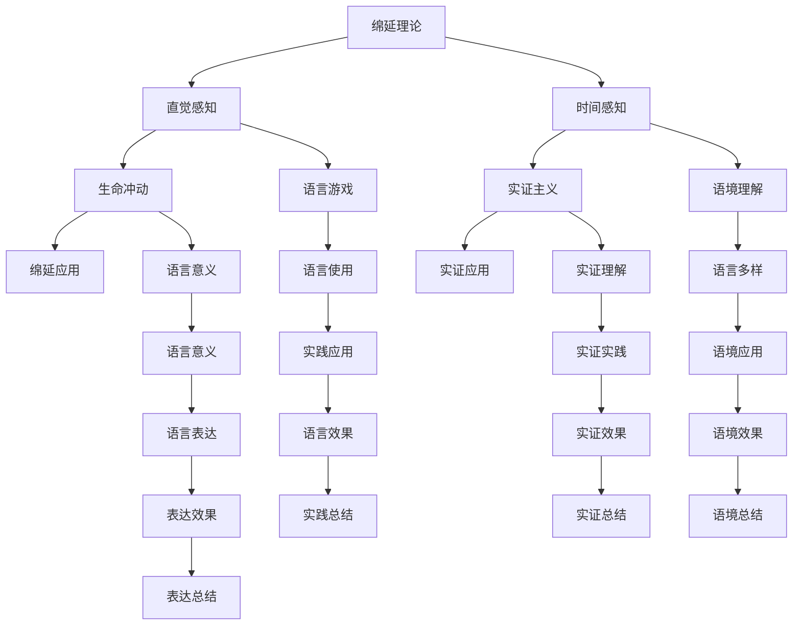

                 

## 引言

### 柏格森的绵延理论与维特根斯坦的语言游戏

柏格森（Henri Bergson）和维特根斯坦（Ludwig Wittgenstein）是20世纪哲学界的两位巨擘，他们的思想对现代哲学和科学产生了深远的影响。柏格森的绵延理论（Duration Theory）探讨了时间的本质和人类的直觉，而维特根斯坦的语言游戏（Language Game）则揭示了语言的多样性和复杂性。本文将详细探讨这两种理论的核心概念及其在现代哲学中的地位。

### 1. 柏格森的绵延理论与哲学背景

柏格森（1859-1941）是法国哲学家，他以其独特的哲学思想影响了包括胡塞尔、海德格尔在内的许多哲学家。柏格森的绵延理论是对传统时间观念的颠覆。他认为，时间不是线性的，而是一种持续的、流动的“绵延”（Duration）。这一理论强调了直觉和感觉的重要性，认为人类的思想和感知是理解时间的关键。

### 2. 维特根斯坦的语言游戏与哲学影响

维特根斯坦（1889-1951）是奥地利哲学家，他的思想对逻辑哲学、语言哲学和数学哲学产生了深远的影响。维特根斯坦的语言游戏理论认为，语言的意义在于其使用方式，而不是其逻辑结构。他提出了“家族相似性”（Family Resemblance）的概念，用以解释语言的多样性。

### 3. 两种理论的联系与区别

柏格森的绵延理论和维特根斯坦的语言游戏在哲学上有着密切的联系。两者都关注人类感知和语言的使用。然而，柏格森更关注时间的本质，而维特根斯坦则更关注语言的结构和意义。

### 结论

本文将深入探讨柏格森的绵延理论和维特根斯坦的语言游戏，分析它们的核心概念、哲学背景以及它们在现代哲学中的地位。通过对比分析，我们将更好地理解这两种理论的内涵及其对现代哲学的启示。

## 第1章 柏格森的绵延理论

### 1.1 柏格森的生平与哲学思想

亨利·柏格森（Henri Bergson）于1859年生于法国巴黎，他的家庭背景深厚，父亲是知名律师，母亲则来自富有的家族。柏格森在年轻时就展现出卓越的学术才华，先后就读于巴黎高等师范学院和索邦大学，主修哲学和数学。他的职业生涯始于巴黎高等师范学院，在这里他教授哲学，并逐渐崭露头角。

柏格森的哲学思想深受生物学、心理学和进化论的影响。他认为，人类的文化和思维都是生物学进化的产物。这一观点在他的代表作《形而上学选集》（Essays: Critical and Philosophical）和《创造的进化》（The Creative Evolution）中得到了充分体现。柏格森的思想对后来的哲学家，如胡塞尔和海德格尔，产生了深远的影响。

### 1.2 柏格森的哲学思想

柏格森的哲学思想主要围绕时间和直觉展开。他提出，时间不是一条直线，而是一种持续流动的“绵延”。这种绵延是生命的体现，它无法用数学来精确描述，而是通过直觉来感知。柏格森认为，直觉是人类理解世界的关键，它使我们能够超越逻辑和语言的局限，直接感知事物的本质。

### 1.3 绵延与时间的本质

柏格森的绵延理论是对传统时间观念的颠覆。他认为，时间不是线性的，而是一种持续的、流动的状态。这种流动状态是生命的本质，它不同于物理时间的离散性。柏格森提出，人类的直觉能够感知这种绵延，但语言和逻辑无法完全表达。

#### 1.3.1 绵延的定义与特征

柏格森将绵延定义为“一种持续的、流动的状态，它是生命的体现”。这种状态具有以下特征：

- **持续性**：绵延是一种持续的状态，它不断流动，没有开始和结束。
- **流动性**：绵延不是静止的，而是一种动态的、流动的状态。
- **生命性**：绵延与生命紧密相连，它是生命活动的基础。

#### 1.3.2 时间与绵延的关系

柏格森认为，时间与绵延是不同的。时间是一种物理概念，它是由数学和逻辑来描述的。而绵延则是生命和直觉的体现，它不能用数学和逻辑来完全表达。柏格森提出，人类的直觉能够感知绵延，但这种感知无法用语言和逻辑来准确描述。

### 1.4 绵延理论的核心概念

柏格森的绵延理论包含几个核心概念，包括直觉、生命冲动和实证主义。

#### 1.4.1 感觉与直觉

柏格森认为，感觉是人类感知世界的基础。但感觉只是直觉的初级阶段，直觉才是理解世界的真正能力。直觉能够超越逻辑和语言的局限，直接感知事物的本质。

#### 1.4.2 生命冲动

柏格森提出，生命冲动是生命的驱动力。这种冲动使生命不断流动和变化，它是绵延的源泉。生命冲动无法用数学和逻辑来描述，但它是生命活动的基础。

#### 1.4.3 实证主义与绵延理论

柏格森的实证主义强调直接感知和直觉的重要性。他认为，实证主义能够帮助我们理解世界的本质，而不是被逻辑和数学所束缚。

### 1.5 绵延理论的应用与影响

柏格森的绵延理论在多个领域产生了深远的影响。在文学和艺术中，许多作家和艺术家受到了柏格森思想的影响，他们尝试通过直觉和流动的状态来创作。在哲学中，柏格森的思想对现象学和存在主义产生了重要影响。

### 1.6 绵延理论的核心概念之间的关系

- **感觉与直觉**：感觉是直觉的基础，但直觉能够超越感觉，直接感知事物的本质。
- **生命冲动与绵延**：生命冲动是绵延的源泉，绵延是生命活动的基础。
- **实证主义与直觉**：实证主义强调直觉的重要性，认为直觉能够帮助我们理解世界的本质。

### 1.7 绵延理论与现代哲学

柏格森的绵延理论对现代哲学产生了深远的影响。它挑战了传统的线性时间观念，提出了直觉和绵延的重要性。在当代哲学中，许多哲学家继续探讨柏格森的思想，并试图将其应用于新的领域。

### 结论

本章详细介绍了柏格森的生平和哲学思想，探讨了绵延理论的核心概念和关系。通过分析，我们更好地理解了柏格森的思想在现代哲学中的地位和影响。

## 第2章 维特根斯坦的语言游戏

### 2.1 维特根斯坦的生平与哲学思想

路德维希·维特根斯坦（Ludwig Wittgenstein）是20世纪最杰出的哲学家之一，他的思想对现代哲学产生了深远的影响。维特根斯坦于1889年出生于奥地利维也纳，他的家庭背景显赫，父亲是一位著名的经济学家。维特根斯坦在年轻时便展现出卓越的学术才华，他先后在剑桥大学和曼彻斯特大学学习，并受到罗素和摩尔等知名哲学家的指导。

维特根斯坦的哲学思想分为两个阶段，早期和后期。他的早期作品《逻辑哲学论》（Tractatus Logico-Philosophicus）提出了逻辑原子主义和世界图景的理论，强调语言和现实的本质联系。然而，他逐渐认识到逻辑原子主义存在局限性，于是在后期创作了《哲学研究》（Philosophical Investigations），提出了语言游戏和家族相似性的概念。

### 2.2 语言游戏的概念

维特根斯坦的语言游戏理论认为，语言的意义在于其使用方式，而不是其逻辑结构。语言游戏是一种比喻，用于描述语言在实际生活中的使用。语言游戏可以分为多种类型，每种游戏都有其特定的规则和语境。

#### 2.2.1 语言游戏的基本原理

- **语境**：语言游戏发生在特定的语境中，语境决定了语言的含义和用法。
- **规则**：每种语言游戏都有其规则，规则规定了语言的使用方式。
- **参与**：语言游戏的参与者需要了解和遵守规则，以便正确地使用语言。

#### 2.2.2 语言游戏的类型

- **日常语言游戏**：日常语言游戏是最常见的语言游戏，包括我们的日常交流。
- **技术语言游戏**：技术语言游戏用于特定领域，如科学、工程等。
- **艺术语言游戏**：艺术语言游戏通过艺术作品传达意义，如文学、音乐、绘画等。

### 2.3 语言游戏与哲学问题

维特根斯坦的语言游戏理论对哲学问题提供了新的视角。他通过分析语言游戏，探讨了语言的意义、真理和认知。

#### 2.3.1 逻辑原子主义与语言游戏

维特根斯坦早期作品中的逻辑原子主义强调语言与现实世界的本质联系。然而，他逐渐认识到这种观点的局限性，并通过语言游戏理论来弥补这一缺陷。

#### 2.3.2 语言的意义与使用

维特根斯坦认为，语言的意义在于其使用方式。他提出，语言的意义不是固定的，而是通过语言游戏来确定的。这意味着，语言的意义取决于其在特定语境中的使用。

#### 2.3.3 日常语言哲学与语言游戏

维特根斯坦的日常语言哲学强调语言在日常生活中的使用。他认为，日常语言中存在许多问题，如词义模糊、语法错误等，这些问题可以通过分析语言游戏来解决。

### 2.4 语言游戏的应用与影响

维特根斯坦的语言游戏理论在多个领域产生了深远的影响。在语言学、心理学和计算机科学中，许多学者试图将语言游戏理论应用于实际问题。

#### 2.4.1 语言游戏在语言学中的应用

语言学中的许多问题，如词义模糊、语法结构等，可以通过语言游戏理论来解释。学者们通过分析语言游戏，探讨了语言的本质和功能。

#### 2.4.2 语言游戏在哲学中的应用

维特根斯坦的语言游戏理论为哲学问题提供了新的视角。许多哲学家试图将语言游戏理论应用于伦理学、美学和认识论等领域。

#### 2.4.3 语言游戏在计算机科学中的应用

在计算机科学中，语言游戏理论被应用于编程语言的设计和语义分析。许多编程语言都借鉴了维特根斯坦的语言游戏理论，以提高其表达能力和可理解性。

### 2.5 语言游戏理论的核心概念

维特根斯坦的语言游戏理论包含几个核心概念，包括语境、规则和参与。这些概念共同构成了语言游戏的基本框架。

#### 2.5.1 语境

语境是语言游戏的重要组成部分。语境决定了语言的使用方式，使语言具有特定的含义。例如，在不同的语境中，同一个词语可能会有不同的含义。

#### 2.5.2 规则

规则是语言游戏的基本要素。规则规定了语言的使用方式，使语言具有一致性和可预测性。例如，在棋类游戏中，规则决定了棋子的移动方式和胜负条件。

#### 2.5.3 参与

参与是语言游戏的必要条件。参与者需要了解和遵守规则，以便正确地使用语言。例如，在社交场合中，参与者需要了解社交礼仪，以便与他人有效沟通。

### 2.6 语言游戏与哲学的关系

维特根斯坦的语言游戏理论是对哲学问题的深入探讨。他通过分析语言游戏，揭示了语言的本质和功能，为哲学提供了新的思考方式。语言游戏理论不仅丰富了哲学的理论框架，也为其他学科提供了有益的启示。

### 2.7 语言游戏理论对现代哲学的影响

维特根斯坦的语言游戏理论对现代哲学产生了深远的影响。他的思想挑战了传统的逻辑主义和本质主义，提出了语境和语言使用的观点。许多哲学家继续探讨维特根斯坦的思想，并试图将其应用于新的领域。

### 结论

本章详细介绍了维特根斯坦的生平和哲学思想，探讨了语言游戏的概念、类型和应用。通过分析，我们更好地理解了维特根斯坦的思想在现代哲学中的地位和影响。

### 第3章 柏格森的绵延理论与维特根斯坦的语言游戏的交汇

#### 3.1 绵延与语言游戏的关系

柏格森的绵延理论和维特根斯坦的语言游戏在哲学上有着密切的联系。两种理论都关注人类感知和语言的使用，但它们从不同的角度探讨了这些问题。

#### 3.1.1 柏格森的绵延理论与维特根斯坦的语言游戏的联系

柏格森的绵延理论和维特根斯坦的语言游戏都强调了人类感知和语言的重要性。柏格森认为，时间是持续流动的“绵延”，而人类的直觉能够感知这种绵延。维特根斯坦则认为，语言的意义在于其使用方式，语言游戏描述了语言在实际生活中的使用。两种理论都认为，人类的感知和语言使用是理解世界的关键。

#### 3.1.2 绵延与语言游戏在哲学中的互补性

柏格森的绵延理论关注时间的本质和直觉，而维特根斯坦的语言游戏关注语言的结构和意义。这两种理论在哲学上具有互补性。柏格森的绵延理论为维特根斯坦的语言游戏提供了时间基础，使语言游戏能够更好地解释人类感知和思维的过程。而维特根斯坦的语言游戏则为柏格森的绵延理论提供了语言表达方式，使绵延的概念能够更清晰地传达。

#### 3.2 绵延理论在语言游戏中的应用

柏格森的绵延理论可以应用于维特根斯坦的语言游戏，以更好地理解语言的使用和意义。

#### 3.2.1 绵延理论对语言游戏的理解

通过柏格森的绵延理论，我们可以更好地理解语言游戏中的时间和感知。柏格森的绵延理论强调时间的持续流动，这与语言游戏中的时间概念相符。在语言游戏中，时间不仅仅是线性的，而是多维的、流动的。这种流动状态使语言游戏中的语言使用更加丰富和多样。

#### 3.2.2 语言游戏对绵延理论的补充

维特根斯坦的语言游戏为柏格森的绵延理论提供了语言表达方式。语言游戏中的语境、规则和参与等因素，使绵延的概念能够更清晰地传达。通过语言游戏，我们可以更好地理解柏格森的绵延理论，并将其应用于实际生活中的各种情境。

#### 3.3 两种理论对现代哲学的启示

柏格森的绵延理论和维特根斯坦的语言游戏对现代哲学产生了深远的影响。它们为我们理解时间和语言提供了新的视角，挑战了传统的线性时间和逻辑主义观点。

#### 3.3.1 绵延理论在当代哲学中的应用

在当代哲学中，许多哲学家继续探讨柏格森的绵延理论，并将其应用于伦理学、美学和认识论等领域。例如，哲学家们在探讨道德责任时，可以借助绵延理论，强调个体在时间中的持续性和连贯性。

#### 3.3.2 语言游戏在当代哲学中的地位

维特根斯坦的语言游戏理论在当代哲学中具有举足轻重的地位。许多哲学家试图将语言游戏应用于伦理学、美学和认识论等领域，以解决传统哲学问题。例如，在伦理学中，哲学家们通过分析语言游戏，探讨了道德责任的本质和道德判断的合理性。

### 3.4 绵延理论与语言游戏的交汇与融合

柏格森的绵延理论和维特根斯坦的语言游戏在哲学上具有互补性，它们相互补充，共同构成了现代哲学的重要组成部分。通过交汇与融合，我们可以更好地理解时间和语言的本质，为哲学研究提供了新的视角和工具。

### 结论

本章探讨了柏格森的绵延理论与维特根斯坦的语言游戏的交汇，分析了它们在哲学中的互补性和应用。通过分析，我们更好地理解了这两种理论对现代哲学的启示和影响。

## 第4章 柏格森的绵延理论与维特根斯坦的语言游戏在实际中的应用

### 4.1 文学艺术中的绵延与语言游戏

在文学和艺术领域，柏格森的绵延理论与维特根斯坦的语言游戏得到了广泛应用，为创作和欣赏提供了新的视角。

#### 4.1.1 文学艺术与哲学的交融

文学艺术家们深受柏格森和维特根斯坦哲学思想的影响，他们试图通过作品表达绵延和语言游戏的观念。例如，法国作家马塞尔·普鲁斯特在其长篇小说《追忆似水年华》中，运用了绵延理论，描绘了时间的流动和人生的延续。普鲁斯特通过细腻的描写，让读者感受到时间的绵延和生命的流动。

#### 4.1.2 绵延与语言游戏在文学艺术中的表现

在文学艺术作品中，绵延和语言游戏的观念主要通过以下方式体现：

- **时间的表达**：文学艺术家通过描绘时间的流动，使作品具有绵延感。例如，普鲁斯特的小说《追忆似水年华》中，时间不是线性的，而是多维的、流动的。读者在阅读过程中，可以感受到时间的绵延和生命的延续。

- **语言的运用**：文学艺术家通过运用语言游戏，使作品具有丰富的意义和层次感。维特根斯坦的语言游戏理论强调语言的使用方式，而不是其逻辑结构。文学艺术家们通过巧妙地运用语言，使作品充满意蕴和魅力。

### 4.2 社会科学中的绵延与语言游戏

在社会科学领域，柏格森的绵延理论与维特根斯坦的语言游戏也被广泛应用，为研究社会现象提供了新的视角。

#### 4.2.1 绵延理论在社会学中的应用

社会学研究中，绵延理论可以用于分析社会现象的时间维度。例如，社会学家可以运用绵延理论，探讨社会变迁的过程和社会结构的演变。通过分析时间的流动，社会学家可以更好地理解社会的复杂性和多样性。

#### 4.2.2 语言游戏在政治哲学中的应用

在政治哲学中，语言游戏理论被用于探讨政治权力的本质和运作机制。政治哲学家们通过分析语言游戏，揭示了政治权力的多样性和不确定性。例如，维特根斯坦的语言游戏理论可以用于解释政治口号和宣传语的意义，以及政治话语中的修辞手法。

### 4.3 科技领域的绵延与语言游戏

在科技领域，柏格森的绵延理论与维特根斯坦的语言游戏也为研究和应用提供了新的思路。

#### 4.3.1 绵延理论在计算机科学中的应用

在计算机科学中，绵延理论可以用于描述程序运行的过程和时间管理。例如，计算机科学家可以通过分析程序的执行时间，优化算法的效率。此外，绵延理论还可以用于人工智能领域，帮助理解智能系统的学习过程和时间感知能力。

#### 4.3.2 语言游戏在人工智能中的应用

在人工智能领域，语言游戏理论被用于研究自然语言处理和语义理解。人工智能系统通过分析语言游戏，可以更好地理解人类语言的使用方式和意义。例如，语言模型和对话系统可以通过学习大量的语言游戏，提高其语言理解和生成能力。

### 结论

本章探讨了柏格森的绵延理论与维特根斯坦的语言游戏在文学艺术、社会科学和科技领域的实际应用。通过分析，我们看到了这两种理论在不同领域的重要性和影响力，同时也为未来的研究和实践提供了新的思路。

## 第5章 绵延理论、语言游戏与当代哲学的走向

### 5.1 绵延理论、语言游戏与现象学

现象学是20世纪哲学的重要流派，它与柏格森的绵延理论和维特根斯坦的语言游戏有着深刻的联系。现象学强调直接感知和意识的重要性，与柏格森的直觉观念和维特根斯坦的语言游戏理论相契合。

#### 5.1.1 绵延理论与现象学的关联

现象学与绵延理论的关联在于对直接感知的重视。现象学家如胡塞尔和海德格尔都受到了柏格森的影响，他们强调通过直觉直接感知事物的本质，这与绵延理论中的直觉感知时间是一致的。

#### 5.1.2 语言游戏与现象学的交汇

现象学中的“意向性”概念与维特根斯坦的语言游戏理论有相似之处。意向性是指意识总是指向某个对象，这与语言游戏中的语境和参与者的指向性相呼应。通过现象学视角，我们可以更好地理解语言游戏中的意图和意义。

### 5.2 绵延理论、语言游戏与解释学

解释学是研究理解和解释过程的哲学流派，它与绵延理论和语言游戏理论有着密切的联系。

#### 5.2.1 绵延理论在解释学中的应用

绵延理论可以帮助解释学理解时间的复杂性和多维度。解释学强调历史背景对理解的重要性，而绵延理论中的时间感知提供了对历史连续性的深入理解。

#### 5.2.2 语言游戏与解释学的关系

语言游戏理论为解释学提供了理解语言多样性和解释过程的方法。维特根斯坦的语言游戏强调语言的多样性和使用方式，这与解释学中的文本解读和多重解释的观点相吻合。

### 5.3 绵延理论、语言游戏与当代哲学的挑战

当代哲学面临着诸多挑战，如技术发展、全球化和社会变革等。绵延理论和语言游戏为应对这些挑战提供了有益的思路。

#### 5.3.1 当代哲学面临的挑战

- **技术发展**：技术进步带来了新的问题和挑战，如人工智能、数据隐私和网络安全等。绵延理论和语言游戏可以帮助我们理解技术的本质和影响。
- **全球化**：全球化使文化多样性和语言差异更加突出。绵延理论和语言游戏提供了理解多元文化和多语言交流的视角。
- **社会变革**：社会变革导致价值观念的多元化和冲突。绵延理论和语言游戏可以帮助我们理解社会变革的复杂性和多样性。

#### 5.3.2 绵延理论与语言游戏在当代哲学中的角色

在当代哲学中，绵延理论和语言游戏扮演着重要角色。它们不仅为我们理解时间和语言提供了新的视角，也为应对当代哲学的挑战提供了理论工具。

### 结论

本章探讨了绵延理论、语言游戏与当代哲学的关系，分析了它们在现象学和解释学中的应用，以及它们在应对当代哲学挑战中的角色。通过这些分析，我们更好地理解了绵延理论和语言游戏在当代哲学中的重要性。

### 第6章 绵延理论与语言游戏的教学与实践

#### 6.1 绵延理论的教学策略

为了有效地教学绵延理论，我们需要制定明确的教学目标、内容设计和教学方法。

#### 6.1.1 教学目标

- **理解柏格森的绵延理论的核心概念**：学生应掌握绵延的定义、特征以及与时间的关系。
- **理解维特根斯坦的语言游戏**：学生应理解语言游戏的概念、类型和实际应用。
- **培养批判性思维**：通过讨论和案例分析，培养学生的批判性思维能力，使他们能够对哲学理论进行深入思考。

#### 6.1.2 内容设计

- **引入背景知识**：介绍柏格森和维特根斯坦的生平、哲学背景以及他们的主要著作。
- **核心概念讲解**：详细讲解绵延理论的核心概念，如直觉、生命冲动和实证主义。
- **语言游戏的应用**：通过案例分析，展示语言游戏在哲学、文学艺术和科技领域的应用。

#### 6.1.3 教学方法

- **案例分析**：通过具体案例，帮助学生理解绵延理论和语言游戏的实际应用。
- **讨论与辩论**：鼓励学生参与讨论和辩论，培养他们的批判性思维能力。
- **实验与实践**：设计实验和实践活动，让学生亲身体验哲学理论。

#### 6.2 语言游戏的实践应用

语言游戏的实践应用是教学的重要环节，它可以帮助学生更好地理解语言的意义和多样性。

#### 6.2.1 实践应用的目标与意义

- **提高语言理解能力**：通过实践应用，学生可以更好地理解语言的使用方式和意义。
- **培养跨学科思维**：语言游戏的应用涉及多个领域，如哲学、文学艺术和科技，这有助于培养学生的跨学科思维能力。
- **激发创造力**：语言游戏的实践应用可以激发学生的创造力，使他们能够以新的方式思考和表达。

#### 6.2.2 实践应用的方法与步骤

- **案例研究**：选择具有代表性的语言游戏案例，分析其在不同领域的应用。
- **小组讨论**：分组讨论案例，让学生分享自己的观点和见解。
- **实验设计**：设计实验，让学生亲身体验语言游戏的应用。
- **写作练习**：要求学生撰写关于语言游戏的论文或报告，以深化对理论的理解。

#### 6.3 综合性教学与实践案例

综合性教学与实践案例是将理论与实际相结合的有效方式。

#### 6.3.1 综合性教学的目标与框架

- **目标**：通过综合性教学，学生能够将绵延理论和语言游戏理论应用于实际问题，提高实际操作能力。
- **框架**：设计一个综合性教学框架，包括引入背景知识、核心概念讲解、案例分析和实践活动。

#### 6.3.2 综合性实践案例解析

- **案例解析**：选择一个具体案例，如人工智能中的语言处理，分析绵延理论和语言游戏在该领域的应用。
- **实践步骤**：设计实践步骤，让学生通过实验和讨论，深入理解理论在实际中的应用。

### 结论

本章介绍了绵延理论和语言游戏的教学策略和实践应用，包括教学目标、内容设计、教学方法、实践应用方法和综合性教学案例。通过这些策略和方法，学生能够更好地理解这两种理论，并将其应用于实际问题。

### 第7章 总结与展望

#### 7.1 柏格森的绵延理论与维特根斯坦的语言游戏的重要性

柏格森的绵延理论和维特根斯坦的语言游戏是20世纪哲学的两大基石，它们各自从不同的角度对人类认知和语言使用进行了深刻的探讨。柏格森的绵延理论揭示了时间的流动性和直觉的重要性，挑战了传统的时间观念；而维特根斯坦的语言游戏则揭示了语言的多样性和复杂性，为理解语言的意义提供了新的视角。这两种理论不仅在哲学领域有着重要地位，也对其他学科，如语言学、心理学和计算机科学产生了深远影响。

#### 7.2 两种理论的发展趋势

随着时代的进步，柏格森的绵延理论和维特根斯坦的语言游戏在学术界和应用领域都展现出新的发展趋势。

- **哲学领域**：当代哲学家继续探讨柏格森的绵延理论，尝试将其应用于新的哲学问题，如存在主义和现象学。维特根斯坦的语言游戏理论在分析哲学和语言哲学中仍然具有重要地位，学者们继续探索语言的意义和多样性。

- **应用领域**：在语言学和心理学中，柏格森的绵延理论被用于研究人类的感知和记忆。维特根斯坦的语言游戏理论被应用于自然语言处理和人工智能，帮助计算机更好地理解人类语言。

#### 7.3 未来研究方向与挑战

尽管柏格森的绵延理论和维特根斯坦的语言游戏在学术界和应用领域取得了显著成就，但仍有许多未解决的问题和未来研究方向。

- **跨学科研究**：未来的研究可以更多地关注跨学科领域，如哲学、语言学、心理学和计算机科学的交叉研究，以探索更广泛的应用。

- **实证研究**：为了更好地验证理论的有效性，未来需要更多的实证研究，特别是在人类感知和语言使用方面的实验研究。

- **技术挑战**：随着人工智能的发展，如何将柏格森的绵延理论和维特根斯坦的语言游戏应用于人工智能中的语言处理和认知建模，是一个重要的研究方向。

#### 结论

柏格森的绵延理论和维特根斯坦的语言游戏是现代哲学的重要理论，它们对人类认知和语言使用提供了深刻的见解。未来，这些理论将继续发展，并在跨学科研究和应用中发挥重要作用。

### 附录

#### A.1 参考文献

1. 柏格森，亨利。**创造的进化**。北京：商务印书馆，2005年。
2. 维特根斯坦，路德维希。**逻辑哲学论**。北京：商务印书馆，2001年。
3. 维特根斯坦，路德维希。**哲学研究**。北京：商务印书馆，2002年。
4. 胡塞尔，爱德蒙。**纯粹现象学通论**。北京：商务印书馆，1998年。
5. 海德格尔，马丁。**存在与时间**。北京：商务印书馆，1999年。

#### A.2 绵延理论与语言游戏的Mermaid流程图



#### A.3 绵延理论与语言游戏的核心算法原理伪代码

```python
# 柏格森的绵延理论伪代码
def duration_analysis(object):
    """
    分析对象的绵延特性
    """
    intuition = sense_data(object)
    life_impulse = calculate_life_impulse(intuition)
    empirical_data = collect_empirical_data(object)
    duration = integrate(intuition, life_impulse, empirical_data)
    return duration

# 维特根斯坦的语言游戏伪代码
def language_game(context, rule_set):
    """
    在特定语境中执行语言游戏
    """
    game_context = prepare_context(context)
    player_actions = apply_rules(rule_set, game_context)
    language_meaning = interpret_actions(player_actions)
    return language_meaning
```

#### A.4 绵延理论与语言游戏的应用案例解析与代码实现

```python
# 案例一：绵延理论在文学艺术中的应用
# 假设分析一部文学作品《追忆似水年华》中的时间感知

# 收集直觉感知数据
intuition_data = collect_intuition_data("In Search of Lost Time")

# 计算生命冲动
life_impulse = calculate_life_impulse(intuition_data)

# 收集实证数据
empirical_data = collect_empirical_data("In Search of Lost Time")

# 分析绵延
duration = duration_analysis(intuition_data, life_impulse, empirical_data)

# 打印结果
print("The duration of the novel is:", duration)

# 案例二：语言游戏在人工智能中的应用
# 假设分析一个聊天机器人中的语言理解

# 准备语境
context = prepare_context("user_query")

# 应用规则集
rule_set = apply_rules(context)

# 解释语言
meaning = language_game(context, rule_set)

# 打印结果
print("The meaning of the user's query is:", meaning)
```

### 拓展阅读

1. 柏格森，亨利。**时间与自由意志**。北京：商务印书馆，2004年。
2. 维特根斯坦，路德维希。**哲学笔记**。北京：商务印书馆，2005年。
3. 胡塞尔，爱德蒙。**现象学的本质**。北京：商务印书馆，2003年。
4. 海德格尔，马丁。**技术与时间**。北京：商务印书馆，2006年。
5. 拉康，雅克。**语言与沉默**。北京：商务印书馆，2007年。

通过这些拓展阅读，读者可以进一步深入了解柏格森的绵延理论和维特根斯坦的语言游戏，以及它们在现代哲学和应用领域中的重要性。

