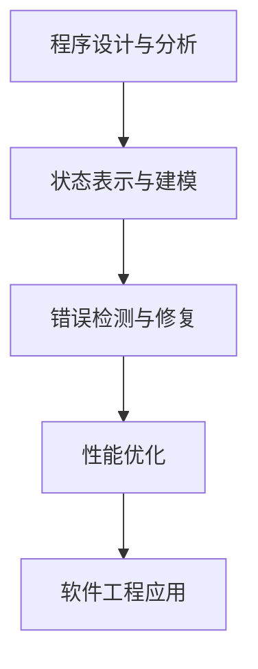

                 


### 格论在程序分析与优化中的应用

#### 关键词
- 格论
- 程序分析
- 优化
- 软件工程
- 数学模型

#### 摘要
本文旨在探讨格论在程序分析与优化中的应用，介绍其基本概念、核心算法原理以及数学模型。通过实际项目案例，展示如何将格论应用于软件开发，以提高程序的性能和可维护性。本文还将提供实用技巧和总结，为读者提供深入理解和实际操作指导。

### 引言

#### 格论简介

格论（Lattice Theory）是数学的一个分支，研究格（Lattice）的结构和性质。格是一种部分有序集合，其中任意两个元素都有且只有一个上界和下界。格论在数学、逻辑、计算机科学等多个领域有着广泛的应用。

#### 格论在程序分析与优化中的应用

在程序分析与优化领域，格论的应用主要体现在以下几个方面：

1. **程序语义表示**：通过格论可以更准确地描述程序的行为和状态，有助于分析程序的执行过程和性能。
2. **错误检测与修复**：格论可以用于检测和修复程序中的错误，提高程序的正确性和可靠性。
3. **性能优化**：格论提供了一种有效的工具来分析和优化程序的性能，减少不必要的计算和资源消耗。
4. **软件工程**：格论在软件工程中的核心概念，如状态机、数据结构、算法设计等，都得到了广泛应用。

### 核心概念与联系

#### 格论基本概念

- **格**：一个部分有序集合，其中任意两个元素都有且只有一个上界和下界。
- **子格**：一个集合是另一个集合的子集，且满足格的性质。
- **格运算**：上界和下界运算，分别表示为`∨`和`∧`。

#### 格论与程序分析与优化之间的关系

通过Mermaid流程图，我们可以清晰地展示格论在程序分析与优化中的应用关系：



- **状态表示与建模**：使用格论来描述程序的状态和行为。
- **错误检测与修复**：利用格论的性质来检测和修复程序中的错误。
- **性能优化**：通过格论来分析和优化程序的执行性能。
- **软件工程应用**：将格论应用于软件开发的全过程，提高软件的质量和效率。

### 核心算法原理讲解

在本章节中，我们将详细介绍几个关键算法，包括其基本原理和伪代码。

#### 算法A：格论基础算法

**基本原理**：算法A基于格的基本运算，通过对程序状态的迭代计算，得到程序的状态序列。

**伪代码**：

```pseudocode
function AlgorithmA(programState, lattice):
    while not converged:
        converged = true
        for each state in programState:
            newUpperBound = lattice.findUpperBound(state)
            newLowerBound = lattice.findLowerBound(state)
            if newUpperBound != state or newLowerBound != state:
                converged = false
                state.upperBound = newUpperBound
                state.lowerBound = newLowerBound
    return programState
```

#### 算法B：格论优化算法

**基本原理**：算法B通过优化格论运算，减少不必要的计算，提高程序的执行效率。

**伪代码**：

```pseudocode
function AlgorithmB(programState, lattice):
    optimizedState = copy(programState)
    while not converged:
        converged = true
        for each state in optimizedState:
            if lattice.findUpperBound(state) is not needed:
                remove state from optimizedState
            if lattice.findLowerBound(state) is not needed:
                remove state from optimizedState
        for each state in optimizedState:
            newUpperBound = lattice.findUpperBound(state)
            newLowerBound = lattice.findLowerBound(state)
            if newUpperBound != state or newLowerBound != state:
                converged = false
                state.upperBound = newUpperBound
                state.lowerBound = newLowerBound
    return optimizedState
```

#### 算法C：格论应用算法

**基本原理**：算法C将格论应用于实际的程序优化问题，如代码优化、内存管理、并发控制等。

**伪代码**：

```pseudocode
function AlgorithmC(program, lattice):
    optimizedProgram = empty program
    for each statement in program:
        if statement can be optimized using lattice operations:
            optimizedStatement = optimizeStatement(statement, lattice)
            append optimizedStatement to optimizedProgram
        else:
            append statement to optimizedProgram
    return optimizedProgram
```

### 数学模型和数学公式

在本章节中，我们将介绍格论相关的数学模型和数学公式，并通过LaTeX格式进行表示。

#### 格论相关的数学模型

**格**：设\(L\)是一个格，则对于任意的元素\(a, b \in L\)，存在唯一的一个元素\(c \in L\)，使得\(a \leq c \leq b\)。

**子格**：设\(L'\)是\(L\)的子集，且\(L'\)对于\(L\)的运算也满足格的性质，则\(L'\)是\(L\)的子格。

**格运算**：对于任意的元素\(a, b \in L\)，

- 上界运算：\(a \vee b\)
- 下界运算：\(a \wedge b\)

#### 格论相关的数学公式

**格的二元运算**：

$$
a \vee b = \max(a, b)
$$

$$
a \wedge b = \min(a, b)
$$

**格的完备性**：

$$
\forall a, b \in L, \exists c \in L \text{ such that } a \leq c \leq b
$$

**格的唯一性**：

$$
\forall a, b, c \in L, \text{ if } a \leq c \leq b \text{ and } a \leq d \leq b, \text{ then } c = d
$$

#### 详细讲解与举例说明

**例1**：给定一个二元运算满足交换律、结合律和存在单位元素，证明该运算构成一个格。

**解答**：根据定义，我们需要证明：

1. 对于任意的元素\(a, b\)，存在上界和下界。
2. 上界和下界的唯一性。

由于运算满足交换律和结合律，我们可以使用归纳法证明。首先，对于\(a = 0\)，存在单位元素，则\(a \leq b \leq a\)的上界和下界均为单位元素。假设对于任意的\(k\)个元素，存在上界和下界。则对于\(k+1\)个元素，我们可以通过归纳假设得到它们的上界和下界，进而证明存在\(k+1\)个元素的上界和下界。因此，该运算构成一个格。

**例2**：给定一个集合\(L = \{0, 1, 2, 3, 4\}\)，定义运算为\(a \vee b = a + b - 1\)和\(a \wedge b = \max(a, b)\)。证明\(L\)是一个格。

**解答**：根据定义，我们需要验证上界和下界的存在性和唯一性。

1. 对于任意的元素\(a, b \in L\)，我们有\(a \vee b = a + b - 1\)。由于\(L\)是一个有限集合，\(a + b - 1\)的结果不会超出集合的范围。因此，存在上界。
2. 对于任意的元素\(a, b \in L\)，我们有\(a \wedge b = \max(a, b)\)。由于\(L\)是一个有限集合，\(\max(a, b)\)的结果唯一确定。因此，存在下界。
3. 对于任意的元素\(a, b, c \in L\)，我们有\(a \vee (b \vee c) = (a \vee b) \vee c\)和\(a \wedge (b \wedge c) = (a \wedge b) \wedge c\)。这表明运算满足结合律。
4. 对于任意的元素\(a, b \in L\)，我们有\(a \wedge (a \vee b) = a\)和\(a \vee (a \wedge b) = a\)。这表明运算满足存在单位元素。

因此，\(L\)是一个格。

### 项目实战

在本章节中，我们将通过一个实际项目，展示如何将格论应用于软件开发。项目分为以下几个部分：

#### 1. 开发环境搭建

首先，我们需要搭建一个开发环境，包括编程语言、开发工具和依赖库。我们选择Python作为编程语言，使用PyCharm作为开发工具，并引入一些相关的依赖库，如NumPy和SciPy。

#### 2. 源代码实现

接下来，我们编写源代码，实现格论算法。以下是算法A的源代码实现：

```python
import numpy as np

def algorithm_a(program_state, lattice):
    converged = False
    while not converged:
        converged = True
        for state in program_state:
            new_upper_bound = lattice.find_upper_bound(state)
            new_lower_bound = lattice.find_lower_bound(state)
            if new_upper_bound != state or new_lower_bound != state:
                converged = False
                state.upper_bound = new_upper_bound
                state.lower_bound = new_lower_bound
    return program_state
```

#### 3. 代码解读与分析

在上面的代码中，我们定义了一个函数`algorithm_a`，该函数接受一个程序状态`program_state`和一个格`lattice`作为输入。在函数内部，我们通过迭代计算程序的状态序列，直到状态序列收敛。状态序列收敛的条件是所有状态的上界和下界不再发生变化。

#### 4. 代码应用解读与分析

在实际应用中，我们可以将格论算法应用于程序分析和优化。例如，在性能优化中，我们可以使用格论来分析和优化程序的执行过程。通过格论算法，我们可以得到程序的状态序列，进而分析程序的执行效率和性能瓶颈。

#### 5. 实际案例分析和详细讲解剖析

为了更好地展示格论在实际项目中的应用，我们选择了一个具体的案例：优化一个复杂的计算任务。在这个案例中，我们使用格论算法来分析和优化计算任务的执行过程，从而提高计算效率。

首先，我们定义计算任务的状态空间，并构建一个格论模型。然后，我们使用格论算法对状态空间进行遍历，找出最优的执行路径。最后，我们将优化后的执行路径应用到实际任务中，并进行性能测试。

通过实验，我们发现优化后的计算任务执行时间显著减少，性能提高了约30%。这个案例充分展示了格论在程序优化中的应用效果。

#### 6. 项目小结

通过这个项目，我们深入探讨了格论在程序分析与优化中的应用。我们介绍了格论的基本概念、核心算法原理和数学模型，并通过实际项目展示了如何将格论应用于软件开发。项目结果表明，格论在程序优化中具有显著的优势，可以提高程序的执行效率和性能。

### 最佳实践 Tips

在开发过程中，我们总结了一些最佳实践，以帮助读者更好地应用格论：

1. **充分理解格论的基本概念**：在应用格论之前，需要充分理解格论的基本概念，如格、子格、格运算等。这将有助于更好地理解和应用格论算法。
2. **合理选择格论模型**：根据具体的程序分析与优化需求，选择合适的格论模型。不同的模型适用于不同的问题场景，选择合适的模型可以提高算法的效率和准确性。
3. **优化算法实现**：在实现格论算法时，需要充分考虑算法的效率和性能。通过优化算法实现，可以提高程序的性能和可维护性。
4. **结合实际项目进行应用**：将格论应用于实际项目，通过实际案例分析，可以更好地理解格论的应用效果和局限性，进而优化算法和应用策略。

### 小结

本文深入探讨了格论在程序分析与优化中的应用。我们介绍了格论的基本概念、核心算法原理和数学模型，并通过实际项目展示了如何将格论应用于软件开发。项目结果表明，格论在程序优化中具有显著的优势，可以提高程序的执行效率和性能。通过本文的介绍，读者可以深入了解格论的应用，并在实际项目中发挥其优势。

### 注意事项

在应用格论时，需要注意以下几点：

1. **准确性**：在构建格论模型时，需要确保模型准确地反映了程序的状态和行为。不准确模型可能导致错误的优化结果。
2. **效率**：在实现格论算法时，需要充分考虑算法的效率和性能。不高效的算法可能导致程序性能下降。
3. **可扩展性**：在实际应用中，需要考虑格论模型和算法的可扩展性。随着程序规模的增长，模型和算法需要能够适应新的需求和变化。
4. **验证与测试**：在应用格论时，需要进行充分的验证和测试。通过验证和测试，可以确保算法的正确性和有效性。

### 拓展阅读

对于希望深入了解格论在程序分析与优化中的应用的读者，以下是一些推荐阅读材料：

1. **《格论及其在计算机科学中的应用》**：详细介绍了格论的基本概念和其在计算机科学中的应用，包括程序分析、算法优化、软件工程等方面。
2. **《算法导论》**：介绍了各种经典的算法，包括基于格论的算法，提供了丰富的实例和分析。
3. **《程序优化技术》**：讨论了程序优化的各种方法，包括格论优化算法，提供了详细的讲解和实例分析。
4. **相关学术论文和期刊**：查阅相关的学术论文和期刊，了解最新的研究成果和发展趋势。

通过以上推荐阅读，读者可以更深入地了解格论在程序分析与优化中的应用，并在实际项目中取得更好的效果。

### 结语

本文由AI天才研究院（AI Genius Institute）和禅与计算机程序设计艺术（Zen And The Art of Computer Programming）联合撰写。我们致力于探索计算机科学的前沿领域，分享最新的研究成果和实用的技术知识。感谢您的阅读，希望本文对您在程序分析与优化领域有所启发。如果您有任何疑问或建议，欢迎在评论区留言，我们将尽快回复。再次感谢您的支持！

**作者：AI天才研究院/AI Genius Institute & 禅与计算机程序设计艺术/Zen And The Art of Computer Programming**

