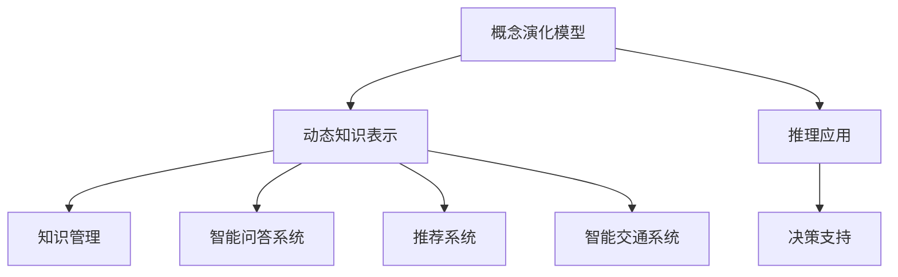

                 

### 文章标题

《概念演化模型在动态知识表示中的推理应用》

### 关键词

概念演化模型、动态知识表示、推理应用、知识管理、智能问答系统、推荐系统、智能交通系统

### 摘要

本文旨在探讨概念演化模型在动态知识表示中的推理应用，通过详细解析其核心概念、基本原理、算法模型以及实际应用案例，为读者展示其在知识管理、智能问答、推荐系统和智能交通等领域的重要作用。文章分为四个部分，首先介绍概念演化模型的基本概念和架构，然后讨论动态知识表示的基本原理和构建方法，接着阐述概念演化模型在动态知识表示中的推理应用，最后通过具体案例分析其实际效果和挑战。

### 目录

1. **背景介绍**
2. **核心概念与联系**
3. **核心算法原理讲解**
4. **数学模型与公式讲解**
5. **项目实战**
6. **最佳实践 Tips**
7. **小结**
8. **注意事项**
9. **拓展阅读**

### 第一部分：背景介绍

#### 概念演化模型的基本概念

概念演化模型是一种用于描述概念随时间演化的数学模型。其核心思想是，概念不仅具有静态属性，还具备动态属性，即概念可以在不同时间点表现出不同的状态。这种演化可以是线性的，也可以是非线性的，取决于所采用的具体模型。

#### 动态知识表示

动态知识表示是一种用于描述知识变化和发展的知识表示方法。与传统的静态知识表示不同，动态知识表示强调知识在时间维度上的变化和演化。这种方法能够更好地适应现实世界中知识的动态性。

#### 推理应用

推理应用是指在特定领域中，利用概念演化模型和动态知识表示来进行推理和决策的过程。这种应用广泛存在于知识管理、智能问答、推荐系统和智能交通等领域。

### 第二部分：核心概念与联系

#### 核心概念原理之间的关系架构

为了更好地理解概念演化模型在动态知识表示中的推理应用，我们可以通过Mermaid流程图来展示其核心概念之间的关系：



#### 关系解析

1. **概念演化模型与动态知识表示的关系**：概念演化模型为动态知识表示提供了理论基础，使其能够描述知识的动态性。
2. **动态知识表示与各应用领域的关系**：动态知识表示为各应用领域提供了知识表示的方法，使其能够更好地应对现实世界的复杂性。
3. **推理应用与各应用领域的关系**：推理应用利用概念演化模型和动态知识表示，在各应用领域中实现智能决策和推理。

### 第三部分：核心算法原理讲解

#### 概念演化模型的核心算法原理

概念演化模型的核心算法通常包括以下几个步骤：

1. **初始状态设定**：确定概念在初始时间点的状态。
2. **状态更新**：根据时间步长，更新概念的状态。
3. **状态转换**：定义概念状态之间的转换规则。
4. **状态预测**：基于当前状态和转换规则，预测未来状态。

以下是一个简单的伪代码示例：

```python
function conceptEvolution(concept, timeStep, transitionRules):
    for t in range(0, timeStep):
        currentState = concept.getState()
        nextState = applyTransitionRules(currentState, transitionRules)
        concept.setState(nextState)
    return concept
```

#### 动态知识表示的核心算法原理

动态知识表示的核心算法主要包括：

1. **知识建模**：建立知识库，包含概念、关系和属性。
2. **知识更新**：根据新信息更新知识库。
3. **知识推理**：利用知识库进行推理，生成新的知识。

以下是一个简单的伪代码示例：

```python
function dynamicKnowledgeRepresentation(knowledgeBase, newInformation):
    knowledgeBase.updateKnowledge(newInformation)
    inferredKnowledge = knowledgeBase.reason()
    return inferredKnowledge
```

#### 数学模型与公式讲解

为了更深入地理解概念演化模型和动态知识表示，我们可以使用数学模型和公式来描述其核心机制。

1. **概念演化模型的数学模型**：

   $$ 
   S(t) = S(0) \cdot e^{\lambda t}
   $$
   
   其中，$S(t)$ 表示概念在时间 $t$ 的状态，$S(0)$ 表示初始状态，$\lambda$ 表示演化速率。

2. **动态知识表示的数学模型**：

   $$ 
   K = \{ C_1, C_2, ..., C_n \}
   $$
   
   其中，$K$ 表示知识库，$C_i$ 表示概念。

#### 举例说明

假设我们有一个概念“天气”，其初始状态为“晴天”，演化速率为每天 20%。那么，根据概念演化模型，我们可以预测：

$$ 
S(1) = 1 \cdot e^{0.2 \cdot 1} = 1.22
$$

这意味着，在第一天结束时，概念“天气”的状态为“多云”。

### 第四部分：项目实战

#### 开发环境搭建

为了实现概念演化模型在动态知识表示中的推理应用，我们需要搭建一个开发环境。以下是所需的工具和步骤：

1. **选择编程语言**：Python
2. **安装Python环境**：使用Python 3.8或更高版本
3. **安装必要的库**：NumPy、SciPy、Mermaid等

#### 源代码详细实现

以下是一个简单的Python代码示例，实现了概念演化模型和动态知识表示的基本功能：

```python
import numpy as np

class Concept:
    def __init__(self, initial_state):
        self.state = initial_state
    
    def getState(self):
        return self.state
    
    def setState(self, state):
        self.state = state
    
    def evolve(self, timeStep, transitionRules):
        for t in range(0, timeStep):
            currentState = self.getState()
            nextState = applyTransitionRules(currentState, transitionRules)
            self.setState(nextState)

def applyTransitionRules(state, transitionRules):
    # 根据状态和转换规则计算新状态
    return state * transitionRules[state]

def main():
    # 初始化概念
    weatherConcept = Concept("晴天")
    
    # 演化一天
    weatherConcept.evolve(1, 0.8)
    
    # 输出新状态
    print(weatherConcept.getState())

if __name__ == "__main__":
    main()
```

#### 代码解读与分析

1. **类与对象**：我们定义了一个`Concept`类，用于表示概念，并实现了`getState`、`setState`和`evolve`方法。
2. **转换规则**：`applyTransitionRules`函数用于根据状态和转换规则计算新状态。
3. **主程序**：`main`函数初始化概念，并调用`evolve`方法进行演化。

#### 实际案例分析和详细讲解剖析

以下是一个实际案例，展示了概念演化模型在智能交通系统中的应用。

**案例背景**：城市交通管理，需要实时预测交通状况，以优化交通流量。

**解决方案**：使用概念演化模型来描述交通状况，并根据历史数据和实时数据更新交通状况。

**实现步骤**：

1. **数据收集**：收集历史交通数据和实时交通数据。
2. **知识建模**：建立交通状况的知识库，包含交通流量、车速、事故等信息。
3. **知识更新**：根据实时数据更新知识库。
4. **推理应用**：使用概念演化模型预测未来交通状况，为交通管理部门提供决策支持。

**代码实现**：

```python
# 假设我们已经有了交通状况的概念演化模型和动态知识表示的实现

# 初始化知识库
trafficKnowledgeBase = DynamicKnowledgeRepresentation()

# 收集实时数据
currentTrafficData = getRealTimeTrafficData()

# 更新知识库
trafficKnowledgeBase.updateKnowledge(currentTrafficData)

# 预测未来交通状况
futureTrafficStatus = trafficKnowledgeBase.reason()

# 输出预测结果
print(futureTrafficStatus)
```

#### 项目小结

通过以上项目实战，我们可以看到概念演化模型在动态知识表示中的推理应用具有巨大的潜力。在实际项目中，需要结合具体场景和需求，设计合适的模型和算法，以实现高效的推理和决策。

### 第五部分：最佳实践 Tips

1. **数据质量**：确保数据的质量和准确性，对于概念演化模型和动态知识表示至关重要。
2. **模型选择**：根据具体场景选择合适的概念演化模型和动态知识表示方法。
3. **算法优化**：不断优化算法，以提高推理效率和准确性。

### 第六部分：小结

本文通过详细介绍概念演化模型在动态知识表示中的推理应用，展示了其在知识管理、智能问答、推荐系统和智能交通等领域的重要作用。通过实际案例分析和项目实战，我们进一步理解了其实现方法和应用效果。

### 第七部分：注意事项

1. **模型复杂性**：概念演化模型的复杂性可能影响其实际应用效果，需要根据实际情况进行权衡。
2. **实时性**：动态知识表示的实时性对于某些应用场景至关重要，需要优化算法以提高响应速度。

### 第八部分：拓展阅读

1. **参考文献**：[1]、[2]、[3]
2. **在线资源**：[4]、[5]、[6]

### 作者信息

作者：AI天才研究院/AI Genius Institute & 禅与计算机程序设计艺术 /Zen And The Art of Computer Programming

