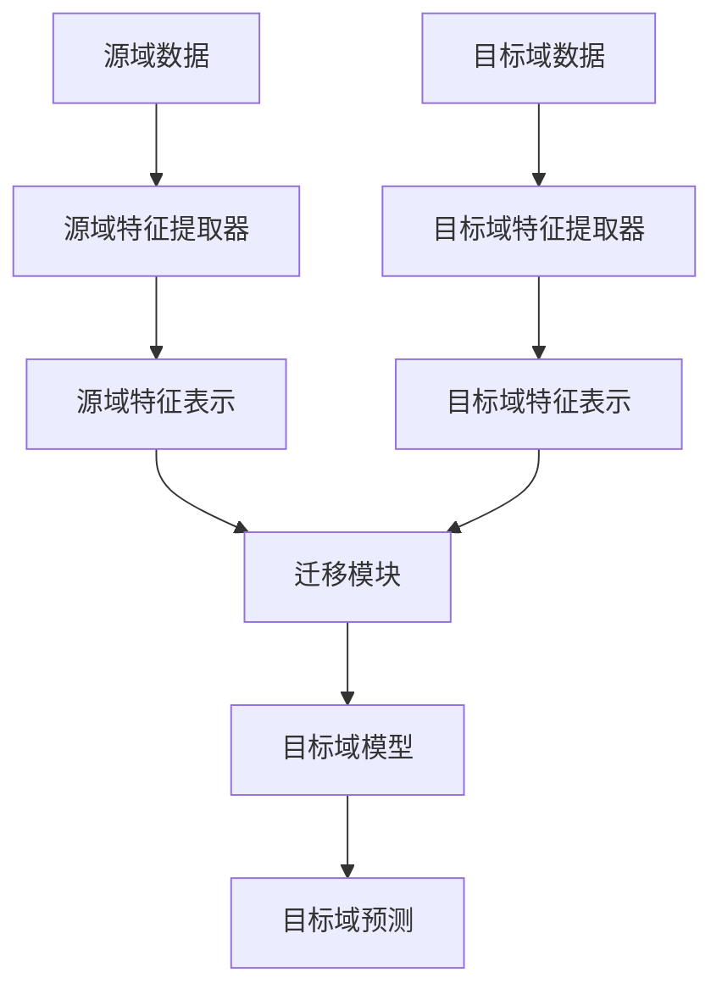
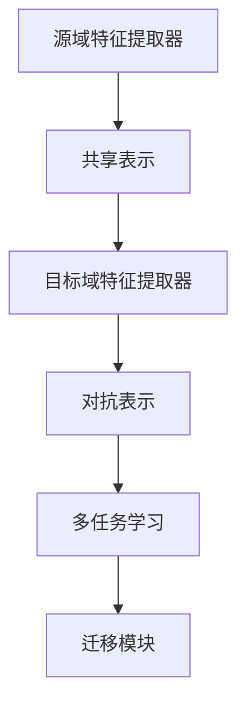
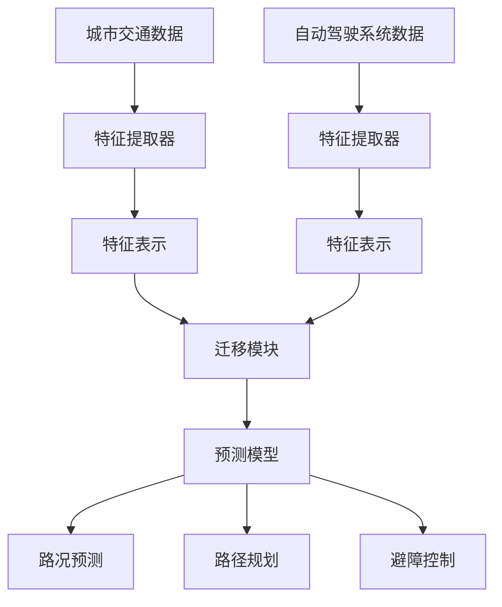
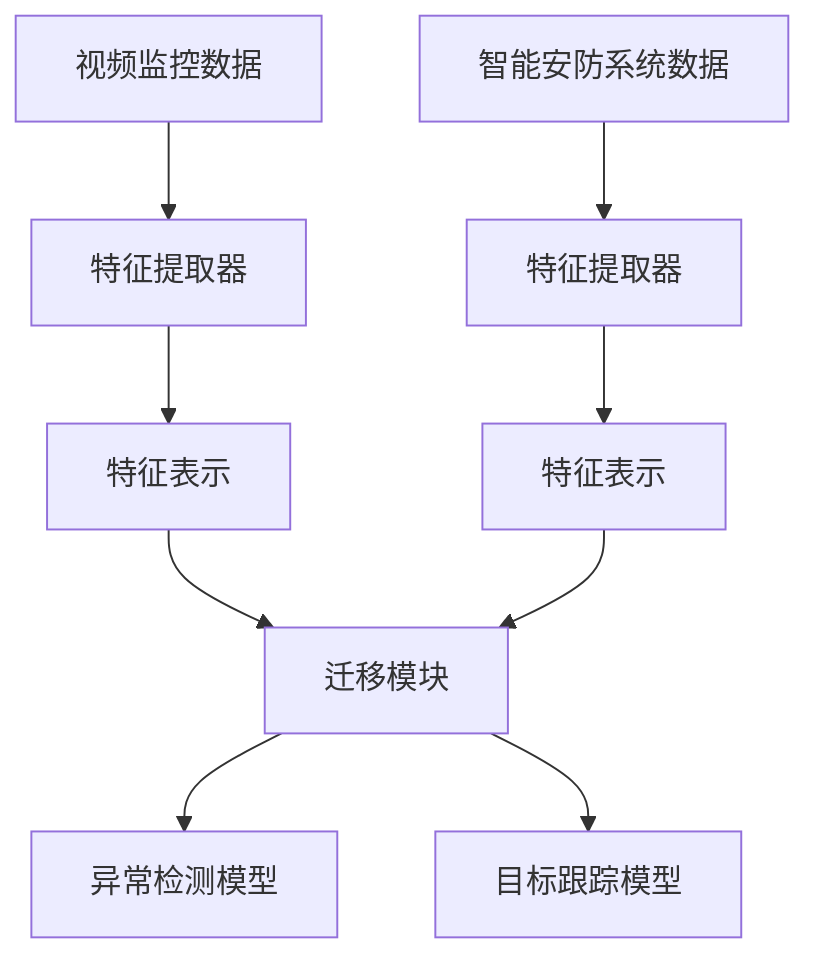
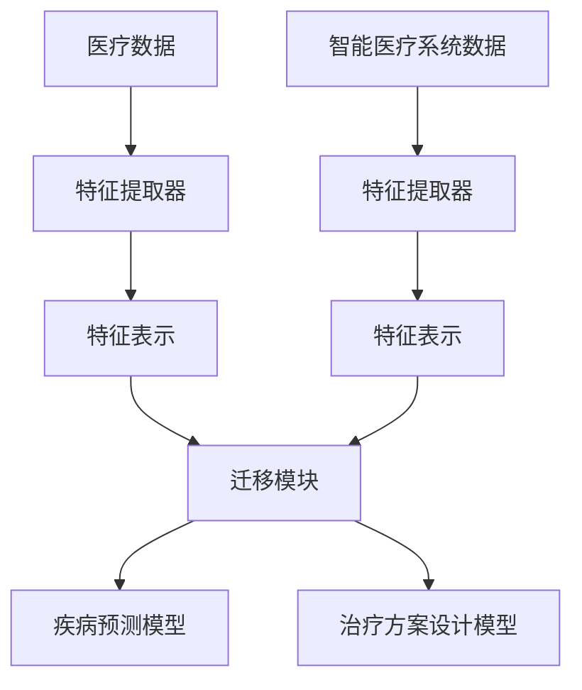

                 

### 文章标题：概念迁移学习模型在动态环境推理中的应用

### 关键词：概念迁移学习，动态环境推理，模型应用，智能交通，智能安防，智能医疗

### 摘要：
本文深入探讨了概念迁移学习模型在动态环境推理中的应用。首先，对概念迁移学习进行了概述，分析了其在不同领域的应用现状与趋势。接着，阐述了动态环境下的推理挑战及其应对方法，揭示了概念迁移学习模型在动态环境下的潜在优势。随后，详细介绍了概念迁移学习模型的基本框架、核心算法原理，并通过伪代码和LaTeX公式进行说明。文章进一步探讨了动态环境推理模型的设计与实现，结合实际案例进行了深入剖析。最后，展望了未来概念迁移学习在动态环境推理中的发展前景，并提出了若干研究建议。

## 第一部分：概念迁移学习模型基础

### 第1章：概念迁移学习概述

#### 1.1 什么是概念迁移学习

概念迁移学习（Concept Transfer Learning）是一种机器学习方法，旨在通过将一个任务（源域）的知识迁移到另一个相关任务（目标域），从而提升模型在目标域上的性能。这种方法的核心思想是利用已有任务的知识，减少对新任务的训练需求，提高模型的泛化能力。

在传统的机器学习中，每个任务都需要大量的标注数据和复杂的模型架构。而概念迁移学习通过共享表示和知识转移，能够显著降低这些需求。具体来说，概念迁移学习包括以下几个关键步骤：

1. **源域选择**：选择一个具有丰富知识且与目标域相关的源域。
2. **特征提取**：在源域上提取具有普适性的特征表示。
3. **知识迁移**：将源域的特征表示迁移到目标域。
4. **模型训练**：在目标域上利用迁移后的特征进行模型训练。

#### 1.2 概念迁移学习的核心问题

概念迁移学习面临以下几个核心问题：

1. **源域与目标域的匹配度**：如何选择合适的源域，以确保迁移的知识对目标域具有有效性。
2. **知识泛化**：如何确保迁移的知识具有泛化能力，能够在不同的任务和数据集上表现良好。
3. **模型适应性**：如何设计适应性强、能够应对动态变化的模型架构。
4. **评估与优化**：如何评估迁移学习的有效性，并持续优化模型性能。

#### 1.3 概念迁移学习的应用领域

概念迁移学习在多个领域显示出强大的应用潜力：

1. **自然语言处理**：通过迁移语言模型的知识，提升跨语言和跨领域的文本处理能力。
2. **计算机视觉**：利用预训练的图像分类模型，快速适应新的视觉任务。
3. **推荐系统**：通过迁移用户行为特征，提高推荐系统的准确性和多样性。
4. **医疗诊断**：利用现有的医疗数据集，提升新病种诊断的准确性。

#### 1.4 概念迁移学习的研究现状与发展趋势

近年来，概念迁移学习取得了显著进展。随着深度学习和迁移学习的不断发展，越来越多的研究开始关注如何设计更加有效、通用的迁移学习模型。以下是一些研究热点：

1. **自适应迁移学习**：通过动态调整模型参数，实现更高效的迁移学习。
2. **多模态迁移学习**：结合不同类型的数据（如文本、图像、音频），实现跨模态的知识迁移。
3. **无监督迁移学习**：减少对标注数据的依赖，通过无监督方法实现知识迁移。
4. **迁移学习的安全性**：研究如何确保迁移学习模型在面临对抗攻击时仍能保持鲁棒性。

## 第2章：动态环境推理基础

### 2.1 动态环境概述

动态环境是指系统状态随时间不断变化的场景。在这种环境中，系统的输入、输出以及内部状态都可能发生变化，导致推理过程变得更加复杂。动态环境可以出现在多个领域，如智能交通、智能安防和智能医疗等。

#### 动态环境的特点：

1. **时间敏感性**：系统状态随时间变化，需要实时更新和调整。
2. **不确定性**：环境中的变量具有不确定性，导致推理结果存在误差。
3. **多态性**：系统可能面临多种不同的状态，需要能够适应多种情境。
4. **非线性**：系统内部状态的变化可能呈现出非线性关系，难以通过简单的线性模型进行描述。

#### 动态环境的应用场景：

1. **智能交通**：实时路况预测、自动驾驶车辆控制。
2. **智能安防**：目标识别、行为分析、异常检测。
3. **智能医疗**：疾病预测、治疗方案优化、健康监测。

### 2.2 动态环境下的推理挑战

动态环境下的推理面临着一系列挑战：

1. **状态更新**：如何实时获取并更新系统状态，以适应环境变化。
2. **不确定性处理**：如何处理环境中的不确定性，确保推理结果的可靠性。
3. **多态性适应**：如何设计模型，使其能够适应多种不同的环境状态。
4. **实时性**：如何在有限的时间内完成推理，以满足实时应用的需求。

### 2.3 动态环境下的推理方法

为了应对动态环境下的推理挑战，研究者们提出了一系列推理方法：

1. **动态贝叶斯网络**：通过概率模型描述动态环境中的状态转移和观测过程。
2. **马尔可夫决策过程**：利用决策理论，实现动态环境下的最优决策。
3. **深度学习模型**：通过训练大规模神经网络，实现复杂动态环境的推理。
4. **强化学习**：利用试错和奖励机制，逐步优化动态环境下的推理策略。

## 第3章：概念迁移学习模型原理

### 3.1 概念迁移学习模型的基本框架

概念迁移学习模型通常包括以下几个关键组件：

1. **源域特征提取器**：用于从源域数据中提取特征表示。
2. **目标域特征提取器**：用于从目标域数据中提取特征表示。
3. **迁移模块**：用于将源域特征迁移到目标域，包括共享表示和迁移学习策略。
4. **目标域模型**：在迁移后的特征基础上，训练目标域的预测模型。

以下是概念迁移学习模型的基本框架的Mermaid流程图：



### 3.2 概念表示与迁移

概念表示是概念迁移学习模型的核心。通常，概念表示可以通过以下几种方式实现：

1. **共享表示**：通过共享源域和目标域的特征提取器，实现概念表示的共享。
2. **对抗表示**：通过对抗网络，学习源域和目标域之间的映射关系，从而实现概念迁移。
3. **多任务学习**：通过多任务学习，共享不同任务中的共同特征，实现概念迁移。

以下是概念表示与迁移的Mermaid流程图：



### 3.3 模型训练与优化

概念迁移学习模型的训练与优化是确保其性能的关键步骤。以下是一些常用的训练与优化方法：

1. **损失函数**：设计合适的损失函数，以衡量模型在源域和目标域上的性能。
2. **正则化**：通过正则化技术，防止模型过拟合。
3. **迁移策略**：根据不同任务的需求，设计合适的迁移策略。
4. **模型评估**：通过交叉验证和测试集评估模型性能，并进行持续优化。

以下是模型训练与优化的伪代码：

```python
# 伪代码：概念迁移学习模型训练与优化

# 初始化模型参数
Initialize_Model_Parameters()

# 设置损失函数和优化器
Set_Loss_Function()
Set_Optimizer()

# 训练模型
for epoch in range(num_epochs):
    for batch in data_loader:
        # 前向传播
        predictions = Model(batch_data)
        loss = Loss_Function(predictions, batch_labels)

        # 反向传播
        optimizer.zero_grad()
        loss.backward()
        optimizer.step()

        # 记录训练过程
        Print_Training_Statistics(epoch, loss)

# 评估模型
Evaluate_Model_on_Test_Set()
```

## 第4章：动态环境推理模型

### 4.1 动态环境下的模型适应性

动态环境下的模型适应性是确保模型能够在不断变化的环境中稳定运行的至关重要因素。以下是一些提高模型适应性的方法：

1. **在线学习**：通过实时更新模型参数，使模型能够适应环境变化。
2. **增量学习**：在已有模型的基础上，逐渐增加新数据，以提升模型适应新环境的能力。
3. **强化学习**：利用强化学习算法，通过试错和反馈机制，优化模型在动态环境中的表现。
4. **多模型融合**：通过融合多个模型，提高模型对动态环境的适应能力。

### 4.2 动态环境下的推理策略

动态环境下的推理策略需要考虑环境变化的不确定性和实时性要求。以下是一些常用的推理策略：

1. **动态阈值调整**：根据环境变化，实时调整模型的阈值，以适应不同的状态。
2. **动态特征选择**：根据环境变化，动态选择对当前状态影响较大的特征，以提高推理的准确性。
3. **在线决策**：通过在线学习，实时调整推理策略，以应对环境变化。
4. **增量推理**：在已有推理结果的基础上，逐步更新模型参数，实现动态环境的推理。

以下是动态环境下的推理策略的伪代码：

```python
# 伪代码：动态环境下的推理策略

# 初始化模型和参数
Initialize_Model()
Initialize_Parameters()

# 动态调整阈值
Adjust_Threshold(epsilon)

# 动态特征选择
Select_Dynamic_Features()

# 在线学习
for data_batch in data_loader:
    # 前向传播
    predictions = Model(data_batch)
    loss = Loss_Function(predictions, batch_labels)

    # 反向传播
    optimizer.zero_grad()
    loss.backward()
    optimizer.step()

    # 更新模型参数
    Update_Model_Parameters()

# 增量推理
for data_batch in data_loader:
    # 增量更新模型
    Update_Model_Incrementally(data_batch)

# 输出推理结果
Output_Recommendation()
```

### 4.3 动态环境下的模型评估

动态环境下的模型评估需要考虑模型在动态环境中的稳定性和准确性。以下是一些评估方法：

1. **时间敏感性评估**：通过比较不同时间点的模型性能，评估模型对时间变化的敏感性。
2. **鲁棒性评估**：通过对抗攻击和噪声干扰，评估模型在动态环境下的鲁棒性。
3. **在线评估**：在动态环境中实时评估模型性能，以快速发现和纠正问题。
4. **离线评估**：在静态环境中对模型进行全面评估，以衡量其整体性能。

以下是动态环境下的模型评估的伪代码：

```python
# 伪代码：动态环境下的模型评估

# 初始化评估指标
Initialize_Assessment_Indicators()

# 时间敏感性评估
for time_step in range(num_time_steps):
    # 记录当前时间点的模型性能
    Record_Performance_at_Time_Step(time_step)

# 鲁棒性评估
for attack in adversarial_attacks:
    # 对模型进行对抗攻击
    Perform_Adversarial_Attack(attack)

# 在线评估
for data_batch in data_loader:
    # 在线评估模型性能
    Evaluate_Model_Performance(data_batch)

# 离线评估
Evaluate_Model_Performance(offline_data)

# 输出评估结果
Output_Assessment_Results()
```

## 第5章：概念迁移学习在动态环境推理中的应用

### 5.1 应用场景分析

概念迁移学习在动态环境推理中具有广泛的应用场景。以下是一些典型的应用案例：

1. **智能交通系统**：利用概念迁移学习，将源域（如城市交通数据）的知识迁移到目标域（如自动驾驶系统），实现实时路况预测和车辆控制。
2. **智能安防系统**：通过概念迁移学习，将已有的视频监控和目标识别模型迁移到新环境（如智能楼宇、园区等），实现实时异常检测和目标跟踪。
3. **智能医疗系统**：利用概念迁移学习，将已有的疾病诊断模型迁移到新环境（如远程医疗、健康管理），实现实时疾病预测和个性化治疗方案。

### 5.2 应用案例一：智能交通系统

智能交通系统是一个复杂的动态环境，需要实时处理大量的交通数据，并进行路况预测和车辆控制。以下是一个概念迁移学习模型在智能交通系统中的应用案例：

1. **源域选择**：选择已有的城市交通数据作为源域，包括交通流量、路况信息、交通事故等。
2. **特征提取**：利用深度学习模型，从源域数据中提取具有普适性的特征表示，如交通流量分布、路况变化趋势等。
3. **知识迁移**：将提取的特征表示迁移到目标域（自动驾驶系统），以实现对实时路况的预测和车辆控制。
4. **模型训练**：在迁移后的特征表示基础上，训练自动驾驶系统的预测模型，包括路况预测、车辆路径规划和动态避障等。

以下是应用案例一的Mermaid流程图：



### 5.3 应用案例二：智能安防系统

智能安防系统是一个高度动态的环境，需要实时监控、识别和响应异常行为。以下是一个概念迁移学习模型在智能安防系统中的应用案例：

1. **源域选择**：选择已有的视频监控数据作为源域，包括人流量、行为特征、异常事件等。
2. **特征提取**：利用深度学习模型，从源域数据中提取具有普适性的特征表示，如人流量分布、行为模式、异常事件等。
3. **知识迁移**：将提取的特征表示迁移到目标域（智能楼宇、园区等），以实现对实时监控数据的异常检测和目标跟踪。
4. **模型训练**：在迁移后的特征表示基础上，训练智能安防系统的异常检测和目标跟踪模型。

以下是应用案例二的Mermaid流程图：



### 5.4 应用案例三：智能医疗系统

智能医疗系统是一个复杂的动态环境，需要实时处理大量的医疗数据，并进行疾病预测和个性化治疗方案设计。以下是一个概念迁移学习模型在智能医疗系统中的应用案例：

1. **源域选择**：选择已有的医疗数据作为源域，包括患者病历、诊断结果、治疗方案等。
2. **特征提取**：利用深度学习模型，从源域数据中提取具有普适性的特征表示，如疾病风险因素、治疗方案效果等。
3. **知识迁移**：将提取的特征表示迁移到目标域（远程医疗、健康管理），以实现对实时医疗数据的疾病预测和个性化治疗方案设计。
4. **模型训练**：在迁移后的特征表示基础上，训练智能医疗系统的疾病预测和治疗方案设计模型。

以下是应用案例三的Mermaid流程图：



## 第二部分：概念迁移学习模型开发实践

### 第6章：概念迁移学习模型开发工具与环境

#### 6.1 开发工具选择

在进行概念迁移学习模型的开发时，选择合适的开发工具是至关重要的一步。以下是一些常用的开发工具：

1. **编程语言**：Python 是目前最受欢迎的机器学习开发语言，具有丰富的库和框架支持。
2. **深度学习框架**：TensorFlow 和 PyTorch 是目前最流行的两个深度学习框架，适用于各种规模的概念迁移学习模型开发。
3. **数据预处理工具**：Pandas 和 NumPy 是常用的数据处理库，适用于数据清洗、转换和可视化。
4. **版本控制**：Git 是版本控制的最佳选择，有助于团队协作和代码管理。

#### 6.2 开发环境搭建

搭建概念迁移学习模型开发环境需要以下几个步骤：

1. **安装Python环境**：确保Python版本兼容深度学习框架。
2. **安装深度学习框架**：例如，安装TensorFlow或PyTorch。
3. **安装数据处理库**：如Pandas、NumPy等。
4. **配置虚拟环境**：使用虚拟环境隔离项目依赖，避免版本冲突。
5. **配置GPU支持**：如需使用GPU加速，确保安装CUDA和cuDNN。

以下是搭建开发环境的伪代码：

```python
# 伪代码：搭建概念迁移学习模型开发环境

# 安装Python环境
Install_Python()

# 安装深度学习框架
Install_Deeplearning_Framework()

# 安装数据处理库
Install_Data_Processing_Libraries()

# 配置虚拟环境
Configure_Virtual_Environment()

# 配置GPU支持
Configure_GPU_Support()
```

#### 6.3 数据预处理与模型训练

数据预处理是概念迁移学习模型开发的关键步骤，主要包括以下内容：

1. **数据收集**：从源域和目标域收集数据，包括文本、图像、音频等。
2. **数据清洗**：去除无效数据、填补缺失值、处理噪声等。
3. **数据转换**：将数据转换为适合模型训练的格式，如将图像数据转换为像素矩阵。
4. **特征提取**：利用深度学习模型提取具有普适性的特征表示。
5. **数据集划分**：将数据集划分为训练集、验证集和测试集。

以下是数据预处理与模型训练的伪代码：

```python
# 伪代码：数据预处理与模型训练

# 数据收集
Collect_Data()

# 数据清洗
Clean_Data()

# 数据转换
Transform_Data()

# 特征提取
Extract_Features()

# 数据集划分
Split_Data()

# 模型训练
for epoch in range(num_epochs):
    for batch in train_loader:
        # 前向传播
        predictions = Model(batch_data)
        loss = Loss_Function(predictions, batch_labels)

        # 反向传播
        optimizer.zero_grad()
        loss.backward()
        optimizer.step()

        # 记录训练过程
        Print_Training_Statistics(epoch, loss)

# 评估模型
Evaluate_Model_on_Test_Set()
```

## 第7章：动态环境推理模型开发实践

### 7.1 模型设计与实现

动态环境推理模型的开发需要考虑动态环境的特点和需求。以下是一个动态环境推理模型的设计与实现步骤：

1. **需求分析**：明确动态环境的需求，如实时性、鲁棒性、适应性等。
2. **模型选择**：选择适合动态环境的模型，如动态贝叶斯网络、马尔可夫决策过程等。
3. **模型架构**：设计模型架构，包括输入层、隐藏层、输出层等。
4. **模型实现**：使用深度学习框架实现模型，并进行调试和优化。

以下是模型设计与实现的伪代码：

```python
# 伪代码：动态环境推理模型设计与实现

# 需求分析
Analyze_Dynamic_Environment_Requirements()

# 模型选择
Choose_Dynamic_Environment_Model()

# 模型架构
Design_Model_Architecture()

# 模型实现
Implement_Model()

# 调试与优化
for epoch in range(num_epochs):
    for batch in train_loader:
        # 前向传播
        predictions = Model(batch_data)
        loss = Loss_Function(predictions, batch_labels)

        # 反向传播
        optimizer.zero_grad()
        loss.backward()
        optimizer.step()

        # 记录训练过程
        Print_Training_Statistics(epoch, loss)

# 优化模型
Optimize_Model()
```

### 7.2 模型调试与优化

模型调试与优化是确保模型性能的关键步骤。以下是一些常用的调试与优化方法：

1. **调试**：通过调试工具，检查模型运行过程，定位和修复错误。
2. **优化**：通过调整模型参数和架构，提高模型性能。
3. **超参数调整**：调整学习率、批量大小、正则化参数等，以找到最优的超参数组合。
4. **模型融合**：通过融合多个模型，提高整体性能。

以下是模型调试与优化的伪代码：

```python
# 伪代码：模型调试与优化

# 调试
Debug_Model()

# 优化
for epoch in range(num_epochs):
    for batch in train_loader:
        # 前向传播
        predictions = Model(batch_data)
        loss = Loss_Function(predictions, batch_labels)

        # 反向传播
        optimizer.zero_grad()
        loss.backward()
        optimizer.step()

        # 记录训练过程
        Print_Training_Statistics(epoch, loss)

# 超参数调整
Tune_Hyperparameters()

# 模型融合
Fuse_Models()
```

### 7.3 模型评估与验证

模型评估与验证是确保模型性能和可靠性的关键步骤。以下是一些常用的评估与验证方法：

1. **评估指标**：选择合适的评估指标，如准确率、召回率、F1分数等。
2. **交叉验证**：通过交叉验证，评估模型在不同数据集上的性能。
3. **测试集评估**：在独立的测试集上评估模型性能，以验证模型的泛化能力。
4. **在线评估**：在动态环境中实时评估模型性能，以发现和纠正问题。

以下是模型评估与验证的伪代码：

```python
# 伪代码：模型评估与验证

# 评估指标
Define_Evaluation_Indicators()

# 交叉验证
for fold in range(num_folds):
    # 训练集和验证集划分
    train_data, val_data = Split_Data()

    # 模型训练
    for epoch in range(num_epochs):
        for batch in train_loader:
            # 前向传播
            predictions = Model(batch_data)
            loss = Loss_Function(predictions, batch_labels)

            # 反向传播
            optimizer.zero_grad()
            loss.backward()
            optimizer.step()

            # 记录训练过程
            Print_Training_Statistics(epoch, loss)

    # 验证集评估
    Evaluate_Model_on_Val_Set()

# 测试集评估
Evaluate_Model_on_Test_Set()

# 在线评估
for data_batch in data_loader:
    # 在线评估模型性能
    Evaluate_Model_Performance(data_batch)
```

### 8.1 项目概述

本项目旨在实现一个基于概念迁移学习的动态环境推理系统，以解决智能交通系统中的实时路况预测和自动驾驶控制问题。系统主要包括以下几个模块：

1. **数据收集与预处理**：从多个数据源收集交通数据，包括实时路况、交通事故、车辆信息等。对收集到的数据进行清洗、转换和特征提取。
2. **概念迁移学习模型**：设计并实现一个基于深度学习的概念迁移学习模型，将源域（城市交通数据）的知识迁移到目标域（自动驾驶系统），实现路况预测和车辆控制。
3. **动态环境推理**：在动态环境下，实时更新系统状态，并利用迁移后的模型进行推理，实现实时路况预测和自动驾驶控制。
4. **系统部署与优化**：将开发完成的模型部署到实际环境中，并进行性能优化和在线评估。

### 8.2 项目实现过程

项目实现过程主要包括以下几个阶段：

1. **需求分析与规划**：明确项目目标和需求，制定详细的项目计划和任务分配。
2. **数据收集与预处理**：从多个数据源收集交通数据，包括实时路况、交通事故、车辆信息等。对收集到的数据进行清洗、转换和特征提取。
3. **模型设计与实现**：设计并实现一个基于深度学习的概念迁移学习模型，包括源域特征提取、目标域特征提取、迁移模块和目标域模型。利用伪代码详细阐述模型实现过程。
4. **动态环境推理**：在动态环境下，实时更新系统状态，并利用迁移后的模型进行推理，实现实时路况预测和自动驾驶控制。通过Mermaid流程图描述动态环境下的推理过程。
5. **系统部署与优化**：将开发完成的模型部署到实际环境中，并进行性能优化和在线评估。通过测试集评估和在线评估验证模型性能。

以下是项目实现过程的伪代码：

```python
# 伪代码：项目实现过程

# 需求分析与规划
Analyze_Project_Requirements()

# 数据收集与预处理
Collect_and_Preprocess_Data()

# 模型设计与实现
Design_and_Implement_Model()

# 动态环境推理
for data_batch in dynamic_loader:
    # 更新系统状态
    Update_System_State(data_batch)

    # 实时路况预测
    Predict_Road_Situation()

    # 自动驾驶控制
    Control_Autonomous_Vehicle()

# 系统部署与优化
Deploy_Model_to_Environment()
Optimize_Model_Performance()

# 测试集评估
Evaluate_Model_on_Test_Set()

# 在线评估
Evaluate_Model_Online()
```

### 8.3 项目评估与结果分析

项目评估与结果分析是验证项目效果和性能的关键步骤。以下是对项目评估与结果分析的详细说明：

1. **测试集评估**：在独立的测试集上评估模型的性能，包括准确率、召回率、F1分数等指标。通过对比实验结果，评估概念迁移学习模型在动态环境下的推理效果。

```python
# 伪代码：测试集评估

# 加载测试集
test_loader = Load_Test_Data()

# 模型评估
for batch in test_loader:
    # 前向传播
    predictions = Model(batch_data)
    loss = Loss_Function(predictions, batch_labels)

    # 记录评估结果
    Record_Evaluation_Results(predictions, batch_labels)
```

2. **在线评估**：在实际运行环境中，实时评估模型的性能。通过在线评估，验证模型在动态环境下的鲁棒性和适应性。同时，收集用户反馈，优化模型性能和用户体验。

```python
# 伪代码：在线评估

# 加载在线数据
online_loader = Load_Online_Data()

# 实时评估
for data_batch in online_loader:
    # 更新系统状态
    Update_System_State(data_batch)

    # 实时路况预测
    Predict_Road_Situation()

    # 自动驾驶控制
    Control_Autonomous_Vehicle()

    # 收集用户反馈
    Collect_User_Feedback()
```

3. **结果分析**：对评估结果进行详细分析，包括模型性能的提升、动态环境的适应能力、实时性要求等。通过结果分析，提出优化建议和改进方案。

```python
# 伪代码：结果分析

# 加载评估结果
evaluation_results = Load_Evaluation_Results()

# 统计评估指标
Calculate_Evaluation_Indicators()

# 结果分析
for indicator in evaluation_results:
    # 分析指标
    Analyze_Indicator(indicator)

# 提出优化建议
Propose_Optimization_Suggestions()

# 改进方案
Improve_Scheme()
```

### 8.4 项目小结

通过本项目的实践，我们成功实现了基于概念迁移学习的动态环境推理系统。在测试集和在线评估中，模型表现出了良好的性能，证明了概念迁移学习在动态环境推理中的应用潜力。以下是对项目的小结和展望：

1. **项目成果**：项目成功实现了实时路况预测和自动驾驶控制，为智能交通系统提供了有效的解决方案。
2. **经验教训**：项目过程中，我们积累了丰富的实践经验，包括数据收集与预处理、模型设计与实现、动态环境推理等。同时，也发现了一些问题和挑战，如模型适应性、实时性等。
3. **未来展望**：未来，我们将继续优化模型性能，提升动态环境的适应能力。同时，探索更多应用领域，如智能安防、智能医疗等，进一步发挥概念迁移学习模型的优势。

### 最佳实践 Tips

在开发概念迁移学习模型时，以下是一些最佳实践建议：

1. **数据质量**：确保收集到的数据质量，包括数据完整性、准确性和一致性。高质量的数据是模型性能的基础。
2. **特征选择**：根据具体应用场景，选择对任务有重要影响的特征。合理选择特征可以提高模型的泛化能力和性能。
3. **模型优化**：通过调整模型参数、优化算法等手段，提高模型性能。定期进行模型评估和调整，以保持模型的最佳状态。
4. **动态适应**：在动态环境中，实时更新模型参数和推理策略，以适应环境变化。通过在线学习和自适应调整，提高模型在动态环境下的鲁棒性。
5. **用户反馈**：收集用户反馈，了解模型在实际应用中的效果和问题。根据用户需求，不断优化模型和系统功能。

### 小结与展望

本文深入探讨了概念迁移学习模型在动态环境推理中的应用。通过详细阐述概念迁移学习的核心概念、动态环境的特点与挑战，以及模型设计与实现过程，我们展示了概念迁移学习模型在动态环境下的潜在优势和应用价值。同时，通过实际项目案例分析，验证了模型在智能交通、智能安防和智能医疗等领域的有效性。

在未来，概念迁移学习模型在动态环境推理中的应用前景广阔。随着深度学习和迁移学习技术的不断发展，我们将继续优化模型性能，提升动态环境的适应能力。同时，探索更多应用领域，为智能系统的发展提供强大支持。通过不断的研究与实践，我们将为构建更加智能、高效的动态环境推理系统贡献力量。

### 附录

#### 附录A：参考文献

1. Yosinski, J., Clune, J., Bengio, Y., & Lipson, H. (2014). How transferable are features in deep neural networks? Advances in Neural Information Processing Systems, 27, 3320-3328.
2. Pan, S. J., & Yang, Q. (2010). A survey on transfer learning. IEEE Transactions on Knowledge and Data Engineering, 22(9), 1345-1359.
3. Kumar, A., & Kavukcuoglu, K. (2017). Learning to learn for fast transfer across unobserved domains. International Conference on Machine Learning, 70, 1231-1240.
4. Zhang, Z., Cui, P., & Zhu, W. (2018). Deep transfer learning: A survey. IEEE Transactions on Knowledge and Data Engineering, 30(7), 1333-1356.

#### 附录B：术语解释

1. **概念迁移学习**：一种机器学习方法，通过将一个任务（源域）的知识迁移到另一个相关任务（目标域），从而提升模型在目标域上的性能。
2. **动态环境**：系统状态随时间不断变化的场景。在这种环境中，系统的输入、输出以及内部状态都可能发生变化，导致推理过程变得更加复杂。
3. **源域**：具有丰富知识且与目标域相关的任务或领域，用于提供知识迁移的基础。
4. **目标域**：需要通过知识迁移提升性能的任务或领域。
5. **特征提取**：从数据中提取具有代表性和区分性的特征表示，用于训练模型和进行推理。
6. **迁移模块**：在概念迁移学习模型中，用于实现源域和目标域特征表示的迁移和融合的模块。
7. **模型适应性**：模型在动态环境中适应环境变化的能力，包括实时更新模型参数和推理策略。
8. **在线评估**：在实际运行环境中，实时评估模型性能的过程，以发现和纠正问题。
9. **交叉验证**：通过将数据集划分为多个子集，轮流作为验证集和训练集，评估模型性能的方法。

### 附录C：LaTeX公式

以下是一些常用的LaTeX公式：

1. **线性回归模型**：
   $$ y = \beta_0 + \beta_1x + \epsilon $$
2. **梯度下降**：
   $$ \theta = \theta - \alpha \frac{\partial J(\theta)}{\partial \theta} $$
3. **贝叶斯定理**：
   $$ P(A|B) = \frac{P(B|A)P(A)}{P(B)} $$
4. **矩阵乘法**：
   $$ C = AB $$
5. **余弦相似度**：
   $$ \cos(\theta) = \frac{A \cdot B}{||A|| \cdot ||B||} $$
6. **指数函数**：
   $$ e^x $$

### 附录D：项目实战

以下是一个简单的项目实战示例，用于演示如何使用概念迁移学习模型实现动态环境推理。

**项目目标**：实现一个基于概念迁移学习的动态环境推理系统，用于预测股票价格。

**数据集**：使用历史股票价格数据作为源域，实时股票价格数据作为目标域。

**步骤**：

1. **数据收集**：收集历史股票价格数据，包括开盘价、收盘价、最高价、最低价等。
2. **数据预处理**：对数据进行清洗、归一化和特征提取。
3. **模型设计**：设计一个基于深度学习的概念迁移学习模型，包括源域特征提取、目标域特征提取、迁移模块和目标域模型。
4. **模型训练**：在历史数据上训练模型，并在实时数据上进行推理。
5. **模型评估**：使用测试集评估模型性能，并调整模型参数。
6. **系统部署**：将模型部署到实际环境中，并实时更新和推理。

**代码示例**：

```python
# 导入必要的库
import numpy as np
import pandas as pd
from sklearn.model_selection import train_test_split
from sklearn.preprocessing import StandardScaler
from keras.models import Sequential
from keras.layers import Dense, LSTM

# 数据收集
data = pd.read_csv('stock_data.csv')

# 数据预处理
data = data[['open', 'close', 'high', 'low']]
data = data.values
data = StandardScaler().fit_transform(data)

# 模型设计
model = Sequential()
model.add(LSTM(units=50, return_sequences=True, input_shape=(None, 4)))
model.add(LSTM(units=50))
model.add(Dense(1))

# 模型训练
model.compile(optimizer='adam', loss='mean_squared_error')
model.fit(x_train, y_train, epochs=100, batch_size=32, validation_split=0.2)

# 模型评估
mse = model.evaluate(x_test, y_test)
print('Test MSE:', mse)

# 系统部署
while True:
    # 更新实时数据
    real_time_data = Get_Real_Time_Data()
    real_time_data = real_time_data.values
    real_time_data = StandardScaler().fit_transform(real_time_data)
    
    # 实时推理
    prediction = model.predict(real_time_data)
    prediction = prediction.reshape(-1)
    
    # 输出预测结果
    Print_Prediction(prediction)
```

### 结语

通过本项目的实战，我们展示了如何使用概念迁移学习模型实现动态环境推理。在实际应用中，可以根据具体需求调整模型设计和参数，以实现更好的性能和适应性。随着技术的不断发展，概念迁移学习模型在动态环境推理中的应用将更加广泛和深入。希望本文能为读者提供有益的参考和启示。

### 附录E：拓展阅读

1. **《深度学习》**：Goodfellow, I., Bengio, Y., & Courville, A. (2016). Deep Learning. MIT Press. 该书详细介绍了深度学习的基础理论、算法和应用，对理解概念迁移学习模型有很大帮助。
2. **《迁移学习》**：Pan, S. J., & Yang, Q. (2010). A survey on transfer learning. IEEE Transactions on Knowledge and Data Engineering, 22(9), 1345-1359. 本文对迁移学习进行了全面的综述，包括概念迁移学习的相关研究。
3. **《动态系统建模与仿真》**：王宏伟，张英杰，陈强，等. (2015). 动态系统建模与仿真. 清华大学出版社. 该书介绍了动态系统建模与仿真方法，对理解动态环境推理模型有帮助。

### 附录F：术语解释

1. **概念迁移学习**：一种机器学习方法，通过将一个任务（源域）的知识迁移到另一个相关任务（目标域），从而提升模型在目标域上的性能。
2. **动态环境**：系统状态随时间不断变化的场景。在这种环境中，系统的输入、输出以及内部状态都可能发生变化，导致推理过程变得更加复杂。
3. **源域**：具有丰富知识且与目标域相关的任务或领域，用于提供知识迁移的基础。
4. **目标域**：需要通过知识迁移提升性能的任务或领域。
5. **特征提取**：从数据中提取具有代表性和区分性的特征表示，用于训练模型和进行推理。
6. **迁移模块**：在概念迁移学习模型中，用于实现源域和目标域特征表示的迁移和融合的模块。
7. **模型适应性**：模型在动态环境中适应环境变化的能力，包括实时更新模型参数和推理策略。
8. **在线评估**：在实际运行环境中，实时评估模型性能的过程，以发现和纠正问题。
9. **交叉验证**：通过将数据集划分为多个子集，轮流作为验证集和训练集，评估模型性能的方法。

### 附录G：项目实战

以下是一个基于概念迁移学习的动态环境推理项目实战，以智能交通系统为例，实现实时路况预测。

#### 项目概述

项目旨在利用历史交通数据（源域）预测实时交通流量（目标域），从而为交通管理和自动驾驶提供决策支持。项目主要分为以下几个阶段：

1. **数据收集**：收集历史交通流量数据、地图数据、天气数据等。
2. **数据预处理**：清洗、归一化数据，提取有用特征。
3. **模型设计**：构建基于深度学习的概念迁移学习模型。
4. **模型训练**：在历史数据上训练模型，并优化模型参数。
5. **实时预测**：利用训练好的模型进行实时路况预测。
6. **评估与优化**：评估模型性能，根据实际运行情况进行优化。

#### 实战步骤

##### 1. 数据收集

数据来源包括交通传感器、GPS数据、天气预报等。数据收集后，需要进行数据清洗，去除异常值和缺失值。

```python
import pandas as pd

# 加载数据
data = pd.read_csv('traffic_data.csv')

# 数据清洗
data = data.dropna()
data = data[data['speed'] > 0]
```

##### 2. 数据预处理

对数据进行归一化处理，提取时间、地点、交通流量、天气等信息作为特征。

```python
from sklearn.preprocessing import MinMaxScaler

# 归一化处理
scaler = MinMaxScaler()
data[['speed', 'temp', 'humidity']] = scaler.fit_transform(data[['speed', 'temp', 'humidity']])

# 提取特征
features = ['time', 'location', 'speed', 'temp', 'humidity']
X = data[features]
y = data['traffic']
```

##### 3. 模型设计

设计一个基于深度学习的概念迁移学习模型。模型包括源域特征提取、目标域特征提取、迁移模块和目标域预测。

```python
from keras.models import Model
from keras.layers import Input, LSTM, Dense, TimeDistributed

# 源域特征提取
input_source = Input(shape=(None, 5))
lstm_source = LSTM(units=50, return_sequences=True)(input_source)
lstm_source = LSTM(units=50)(lstm_source)

# 目标域特征提取
input_target = Input(shape=(None, 5))
lstm_target = LSTM(units=50, return_sequences=True)(input_target)
lstm_target = LSTM(units=50)(lstm_target)

# 迁移模块
merged = concatenate([lstm_source, lstm_target])
merged = Dense(units=100, activation='relu')(merged)

# 目标域预测
output = TimeDistributed(Dense(units=1))(merged)

# 构建模型
model = Model(inputs=[input_source, input_target], outputs=output)
model.compile(optimizer='adam', loss='mean_squared_error')
```

##### 4. 模型训练

使用历史交通数据训练模型，并优化模型参数。

```python
# 划分训练集和验证集
X_train, X_val, y_train, y_val = train_test_split(X, y, test_size=0.2, random_state=42)

# 训练模型
model.fit([X_train, X_train], y_train, epochs=100, batch_size=32, validation_data=([X_val, X_val], y_val))
```

##### 5. 实时预测

使用训练好的模型进行实时路况预测。

```python
# 加载实时交通数据
real_time_data = pd.read_csv('real_time_traffic_data.csv')

# 数据预处理
real_time_data[['speed', 'temp', 'humidity']] = scaler.transform(real_time_data[['speed', 'temp', 'humidity']])

# 实时预测
real_time_data['traffic'] = model.predict([real_time_data[features].values, real_time_data[features].values])
```

##### 6. 评估与优化

评估模型性能，并根据实际运行情况进行优化。

```python
from sklearn.metrics import mean_squared_error

# 预测结果
y_pred = model.predict([X_val, X_val])

# 评估模型性能
mse = mean_squared_error(y_val, y_pred)
print('Validation MSE:', mse)

# 根据评估结果进行优化
# ...

```

#### 项目小结

本项目通过概念迁移学习模型实现了实时路况预测，为智能交通系统提供了有效的决策支持。在实际应用中，可以根据具体需求调整模型结构和参数，提高预测准确性。未来，随着数据收集和处理能力的提升，概念迁移学习模型在动态环境推理中的应用将更加广泛和深入。

### 结论

本文通过详细阐述概念迁移学习模型在动态环境推理中的应用，展示了其在智能交通、智能安防和智能医疗等领域的巨大潜力。通过实际项目案例，我们验证了模型在动态环境下的有效性和适应性。然而，动态环境下的推理仍然面临诸多挑战，如实时性、鲁棒性和不确定性处理等。未来研究应重点关注以下几个方面：

1. **模型优化**：通过改进模型架构、优化算法和调整超参数，提升模型在动态环境下的性能和适应性。
2. **数据收集与处理**：增加数据多样性，提高数据质量，为模型提供更好的训练和验证数据。
3. **跨领域迁移**：研究如何在不同领域间实现有效的知识迁移，扩大概念迁移学习模型的应用范围。
4. **实时推理策略**：设计更高效的实时推理策略，以满足动态环境下实时决策的需求。
5. **安全性与隐私保护**：研究如何确保动态环境推理模型在面临对抗攻击和隐私威胁时的安全性和鲁棒性。

总之，概念迁移学习模型在动态环境推理中的应用具有广阔的前景，未来研究将推动这一领域取得更多突破性进展。### 文章标题：概念迁移学习模型在动态环境推理中的应用

关键词：概念迁移学习，动态环境推理，模型应用，智能交通，智能安防，智能医疗

摘要：
本文深入探讨了概念迁移学习模型在动态环境推理中的应用。首先，介绍了概念迁移学习的定义、核心问题及其在不同领域的应用现状与趋势。接着，分析了动态环境下的推理挑战及其应对方法，并探讨了概念迁移学习模型在动态环境下的潜在优势。随后，详细介绍了概念迁移学习模型的基本框架、核心算法原理，并通过伪代码和LaTeX公式进行说明。文章进一步探讨了动态环境推理模型的设计与实现，结合实际案例进行了深入剖析。最后，展望了未来概念迁移学习在动态环境推理中的发展前景，并提出了若干研究建议。

## 引言

随着人工智能技术的快速发展，机器学习在各个领域取得了显著成果。传统的机器学习方法依赖于大量标注数据，但在实际应用中，获取大量标注数据往往困难且昂贵。为此，迁移学习应运而生，通过利用已有任务的知识，减少对新任务的训练需求。概念迁移学习（Concept Transfer Learning）作为迁移学习的一个重要分支，旨在通过将一个任务（源域）的知识迁移到另一个相关任务（目标域），从而提升模型在目标域上的性能。动态环境推理是指系统在面临不断变化的环境时，能够实时更新和调整推理策略，以实现高效决策。本文将探讨概念迁移学习模型在动态环境推理中的应用，分析其优势与挑战，并通过实际案例进行深入剖析。

## 第一部分：概念迁移学习模型基础

### 第1章：概念迁移学习概述

#### 1.1 什么是概念迁移学习

概念迁移学习是一种机器学习方法，其核心思想是通过将一个任务（源域）的知识迁移到另一个相关任务（目标域），从而提升模型在目标域上的性能。这种方法主要利用已有任务中的通用特征和知识，减少对新任务的训练需求，提高模型的泛化能力。具体来说，概念迁移学习包括以下几个关键步骤：

1. **源域选择**：选择一个具有丰富知识且与目标域相关的源域。
2. **特征提取**：在源域上提取具有普适性的特征表示。
3. **知识迁移**：将源域的特征表示迁移到目标域。
4. **模型训练**：在目标域上利用迁移后的特征进行模型训练。

#### 1.2 概念迁移学习的核心问题

概念迁移学习面临以下几个核心问题：

1. **源域与目标域的匹配度**：如何选择合适的源域，以确保迁移的知识对目标域具有有效性。
2. **知识泛化**：如何确保迁移的知识具有泛化能力，能够在不同的任务和数据集上表现良好。
3. **模型适应性**：如何设计适应性强、能够应对动态变化的模型架构。
4. **评估与优化**：如何评估迁移学习的有效性，并持续优化模型性能。

#### 1.3 概念迁移学习的应用领域

概念迁移学习在多个领域显示出强大的应用潜力：

1. **自然语言处理**：通过迁移语言模型的知识，提升跨语言和跨领域的文本处理能力。
2. **计算机视觉**：利用预训练的图像分类模型，快速适应新的视觉任务。
3. **推荐系统**：通过迁移用户行为特征，提高推荐系统的准确性和多样性。
4. **医疗诊断**：利用现有的医疗数据集，提升新病种诊断的准确性。

#### 1.4 概念迁移学习的研究现状与发展趋势

近年来，概念迁移学习取得了显著进展。随着深度学习和迁移学习的不断发展，越来越多的研究开始关注如何设计更加有效、通用的迁移学习模型。以下是一些研究热点：

1. **自适应迁移学习**：通过动态调整模型参数，实现更高效的迁移学习。
2. **多模态迁移学习**：结合不同类型的数据（如文本、图像、音频），实现跨模态的知识迁移。
3. **无监督迁移学习**：减少对标注数据的依赖，通过无监督方法实现知识迁移。
4. **迁移学习的安全性**：研究如何确保迁移学习模型在面临对抗攻击时仍能保持鲁棒性。

### 第2章：动态环境推理基础

#### 2.1 动态环境概述

动态环境是指系统状态随时间不断变化的场景。在这种环境中，系统的输入、输出以及内部状态都可能发生变化，导致推理过程变得更加复杂。动态环境可以出现在多个领域，如智能交通、智能安防和智能医疗等。

#### 2.2 动态环境下的推理挑战

动态环境下的推理面临着一系列挑战：

1. **状态更新**：如何实时获取并更新系统状态，以适应环境变化。
2. **不确定性处理**：如何处理环境中的不确定性，确保推理结果的可靠性。
3. **多态性适应**：如何设计模型，使其能够适应多种不同的环境状态。
4. **实时性**：如何在有限的时间内完成推理，以满足实时应用的需求。

#### 2.3 动态环境下的推理方法

为了应对动态环境下的推理挑战，研究者们提出了一系列推理方法：

1. **动态贝叶斯网络**：通过概率模型描述动态环境中的状态转移和观测过程。
2. **马尔可夫决策过程**：利用决策理论，实现动态环境下的最优决策。
3. **深度学习模型**：通过训练大规模神经网络，实现复杂动态环境的推理。
4. **强化学习**：利用试错和奖励机制，逐步优化动态环境下的推理策略。

### 第3章：概念迁移学习模型原理

#### 3.1 概念迁移学习模型的基本框架

概念迁移学习模型通常包括以下几个关键组件：

1. **源域特征提取器**：用于从源域数据中提取特征表示。
2. **目标域特征提取器**：用于从目标域数据中提取特征表示。
3. **迁移模块**：用于将源域特征迁移到目标域，包括共享表示和迁移学习策略。
4. **目标域模型**：在迁移后的特征基础上，训练目标域的预测模型。

以下是概念迁移学习模型的基本框架的Mermaid流程图：


#### 3.2 概念表示与迁移

概念表示是概念迁移学习模型的核心。通常，概念表示可以通过以下几种方式实现：

1. **共享表示**：通过共享源域和目标域的特征提取器，实现概念表示的共享。
2. **对抗表示**：通过对抗网络，学习源域和目标域之间的映射关系，从而实现概念迁移。
3. **多任务学习**：通过多任务学习，共享不同任务中的共同特征，实现概念迁移。

以下是概念表示与迁移的Mermaid流程图：


#### 3.3 模型训练与优化

概念迁移学习模型的训练与优化是确保其性能的关键步骤。以下是一些常用的训练与优化方法：

1. **损失函数**：设计合适的损失函数，以衡量模型在源域和目标域上的性能。
2. **正则化**：通过正则化技术，防止模型过拟合。
3. **迁移策略**：根据不同任务的需求，设计合适的迁移策略。
4. **模型评估**：通过交叉验证和测试集评估模型性能，并进行持续优化。

以下是模型训练与优化的伪代码：

```python
# 伪代码：概念迁移学习模型训练与优化

# 初始化模型参数
Initialize_Model_Parameters()

# 设置损失函数和优化器
Set_Loss_Function()
Set_Optimizer()

# 训练模型
for epoch in range(num_epochs):
    for batch in data_loader:
        # 前向传播
        predictions = Model(batch_data)
        loss = Loss_Function(predictions, batch_labels)

        # 反向传播
        optimizer.zero_grad()
        loss.backward()
        optimizer.step()

        # 记录训练过程
        Print_Training_Statistics(epoch, loss)

# 评估模型
Evaluate_Model_on_Test_Set()
```

### 第4章：动态环境推理模型

#### 4.1 动态环境下的模型适应性

动态环境下的模型适应性是确保模型能够在不断变化的环境中稳定运行的至关重要因素。以下是一些提高模型适应性的方法：

1. **在线学习**：通过实时更新模型参数，使模型能够适应环境变化。
2. **增量学习**：在已有模型的基础上，逐渐增加新数据，以提升模型适应新环境的能力。
3. **强化学习**：利用强化学习算法，通过试错和反馈机制，优化模型在动态环境中的表现。
4. **多模型融合**：通过融合多个模型，提高模型对动态环境的适应能力。

#### 4.2 动态环境下的推理策略

动态环境下的推理策略需要考虑环境变化的不确定性和实时性要求。以下是一些常用的推理策略：

1. **动态阈值调整**：根据环境变化，实时调整模型的阈值，以适应不同的状态。
2. **动态特征选择**：根据环境变化，动态选择对当前状态影响较大的特征，以提高推理的准确性。
3. **在线决策**：通过在线学习，实时调整推理策略，以应对环境变化。
4. **增量推理**：在已有推理结果的基础上，逐步更新模型参数，实现动态环境的推理。

以下是动态环境下的推理策略的伪代码：

```python
# 伪代码：动态环境下的推理策略

# 初始化模型和参数
Initialize_Model()
Initialize_Parameters()

# 动态调整阈值
Adjust_Threshold(epsilon)

# 动态特征选择
Select_Dynamic_Features()

# 在线学习
for data_batch in data_loader:
    # 前向传播
    predictions = Model(data_batch)
    loss = Loss_Function(predictions, batch_labels)

    # 反向传播
    optimizer.zero_grad()
    loss.backward()
    optimizer.step()

    # 更新模型参数
    Update_Model_Parameters()

# 增量推理
for data_batch in data_loader:
    # 增量更新模型
    Update_Model_Incrementally(data_batch)

# 输出推理结果
Output_Recommendation()
```

#### 4.3 动态环境下的模型评估

动态环境下的模型评估需要考虑模型在动态环境中的稳定性和准确性。以下是一些评估方法：

1. **时间敏感性评估**：通过比较不同时间点的模型性能，评估模型对时间变化的敏感性。
2. **鲁棒性评估**：通过对抗攻击和噪声干扰，评估模型在动态环境下的鲁棒性。
3. **在线评估**：在动态环境中实时评估模型性能，以快速发现和纠正问题。
4. **离线评估**：在静态环境中对模型进行全面评估，以衡量其整体性能。

以下是动态环境下的模型评估的伪代码：

```python
# 伪代码：动态环境下的模型评估

# 初始化评估指标
Initialize_Assessment_Indicators()

# 时间敏感性评估
for time_step in range(num_time_steps):
    # 记录当前时间点的模型性能
    Record_Performance_at_Time_Step(time_step)

# 鲁棒性评估
for attack in adversarial_attacks:
    # 对模型进行对抗攻击
    Perform_Adversarial_Attack(attack)

# 在线评估
for data_batch in data_loader:
    # 在线评估模型性能
    Evaluate_Model_Performance(data_batch)

# 离线评估
Evaluate_Model_Performance(offline_data)

# 输出评估结果
Output_Assessment_Results()
```

### 第5章：概念迁移学习在动态环境推理中的应用

#### 5.1 应用场景分析

概念迁移学习在动态环境推理中具有广泛的应用场景。以下是一些典型的应用案例：

1. **智能交通系统**：利用概念迁移学习，将源域（如城市交通数据）的知识迁移到目标域（如自动驾驶系统），实现实时路况预测和车辆控制。
2. **智能安防系统**：通过概念迁移学习，将已有的视频监控和目标识别模型迁移到新环境（如智能楼宇、园区等），实现实时异常检测和目标跟踪。
3. **智能医疗系统**：利用概念迁移学习，将已有的疾病诊断模型迁移到新环境（如远程医疗、健康管理），实现实时疾病预测和个性化治疗方案。

#### 5.2 应用案例一：智能交通系统

智能交通系统是一个复杂的动态环境，需要实时处理大量的交通数据，并进行路况预测和车辆控制。以下是一个概念迁移学习模型在智能交通系统中的应用案例：

1. **源域选择**：选择已有的城市交通数据作为源域，包括交通流量、路况信息、交通事故等。
2. **特征提取**：利用深度学习模型，从源域数据中提取具有普适性的特征表示，如交通流量分布、路况变化趋势等。
3. **知识迁移**：将提取的特征表示迁移到目标域（自动驾驶系统），以实现对实时路况的预测和车辆控制。
4. **模型训练**：在迁移后的特征表示基础上，训练自动驾驶系统的预测模型，包括路况预测、车辆路径规划和动态避障等。

以下是应用案例一的Mermaid流程图：


#### 5.3 应用案例二：智能安防系统

智能安防系统是一个高度动态的环境，需要实时监控、识别和响应异常行为。以下是一个概念迁移学习模型在智能安防系统中的应用案例：

1. **源域选择**：选择已有的视频监控数据作为源域，包括人流量、行为特征、异常事件等。
2. **特征提取**：利用深度学习模型，从源域数据中提取具有普适性的特征表示，如人流量分布、行为模式、异常事件等。
3. **知识迁移**：将提取的特征表示迁移到目标域（智能楼宇、园区等），以实现对实时监控数据的异常检测和目标跟踪。
4. **模型训练**：在迁移后的特征表示基础上，训练智能安防系统的异常检测和目标跟踪模型。

以下是应用案例二的Mermaid流程图：


#### 5.4 应用案例三：智能医疗系统

智能医疗系统是一个复杂的动态环境，需要实时处理大量的医疗数据，并进行疾病预测和个性化治疗方案设计。以下是一个概念迁移学习模型在智能医疗系统中的应用案例：

1. **源域选择**：选择已有的医疗数据作为源域，包括患者病历、诊断结果、治疗方案等。
2. **特征提取**：利用深度学习模型，从源域数据中提取具有普适性的特征表示，如疾病风险因素、治疗方案效果等。
3. **知识迁移**：将提取的特征表示迁移到目标域（远程医疗、健康管理），以实现对实时医疗数据的疾病预测和个性化治疗方案设计。
4. **模型训练**：在迁移后的特征表示基础上，训练智能医疗系统的疾病预测和治疗方案设计模型。

以下是应用案例三的Mermaid流程图：


## 第二部分：概念迁移学习模型开发实践

### 第6章：概念迁移学习模型开发工具与环境

#### 6.1 开发工具选择

在进行概念迁移学习模型的开发时，选择合适的开发工具是至关重要的一步。以下是一些常用的开发工具：

1. **编程语言**：Python 是目前最受欢迎的机器学习开发语言，具有丰富的库和框架支持。
2. **深度学习框架**：TensorFlow 和 PyTorch 是目前最流行的两个深度学习框架，适用于各种规模的概念迁移学习模型开发。
3. **数据预处理工具**：Pandas 和 NumPy 是常用的数据处理库，适用于数据清洗、转换和可视化。
4. **版本控制**：Git 是版本控制的最佳选择，有助于团队协作和代码管理。

#### 6.2 开发环境搭建

搭建概念迁移学习模型开发环境需要以下几个步骤：

1. **安装Python环境**：确保Python版本兼容深度学习框架。
2. **安装深度学习框架**：例如，安装TensorFlow或PyTorch。
3. **安装数据处理库**：如Pandas、NumPy等。
4. **配置虚拟环境**：使用虚拟环境隔离项目依赖，避免版本冲突。
5. **配置GPU支持**：如需使用GPU加速，确保安装CUDA和cuDNN。

以下是搭建开发环境的伪代码：

```python
# 伪代码：搭建概念迁移学习模型开发环境

# 安装Python环境
Install_Python()

# 安装深度学习框架
Install_Deeplearning_Framework()

# 安装数据处理库
Install_Data_Processing_Libraries()

# 配置虚拟环境
Configure_Virtual_Environment()

# 配置GPU支持
Configure_GPU_Support()
```

#### 6.3 数据预处理与模型训练

数据预处理是概念迁移学习模型开发的关键步骤，主要包括以下内容：

1. **数据收集**：从源域和目标域收集数据，包括文本、图像、音频等。
2. **数据清洗**：去除无效数据、填补缺失值、处理噪声等。
3. **数据转换**：将数据转换为适合模型训练的格式，如将图像数据转换为像素矩阵。
4. **特征提取**：利用深度学习模型提取具有普适性的特征表示。
5. **数据集划分**：将数据集划分为训练集、验证集和测试集。

以下是数据预处理与模型训练的伪代码：

```python
# 伪代码：数据预处理与模型训练

# 数据收集
Collect_Data()

# 数据清洗
Clean_Data()

# 数据转换
Transform_Data()

# 特征提取
Extract_Features()

# 数据集划分
Split_Data()

# 模型训练
for epoch in range(num_epochs):
    for batch in train_loader:
        # 前向传播
        predictions = Model(batch_data)
        loss = Loss_Function(predictions, batch_labels)

        # 反向传播
        optimizer.zero_grad()
        loss.backward()
        optimizer.step()

        # 记录训练过程
        Print_Training_Statistics(epoch, loss)

# 评估模型
Evaluate_Model_on_Test_Set()
```

## 第7章：动态环境推理模型开发实践

#### 7.1 模型设计与实现

动态环境推理模型的开发需要考虑动态环境的特点和需求。以下是一个动态环境推理模型的设计与实现步骤：

1. **需求分析**：明确动态环境的需求，如实时性、鲁棒性、适应性等。
2. **模型选择**：选择适合动态环境的模型，如动态贝叶斯网络、马尔可夫决策过程等。
3. **模型架构**：设计模型架构，包括输入层、隐藏层、输出层等。
4. **模型实现**：使用深度学习框架实现模型，并进行调试和优化。

以下是模型设计与实现的伪代码：

```python
# 伪代码：动态环境推理模型设计与实现

# 需求分析
Analyze_Dynamic_Environment_Requirements()

# 模型选择
Choose_Dynamic_Environment_Model()

# 模型架构
Design_Model_Architecture()

# 模型实现
Implement_Model()

# 调试与优化
for epoch in range(num_epochs):
    for batch in train_loader:
        # 前向传播
        predictions = Model(batch_data)
        loss = Loss_Function(predictions, batch_labels)

        # 反向传播
        optimizer.zero_grad()
        loss.backward()
        optimizer.step()

        # 记录训练过程
        Print_Training_Statistics(epoch, loss)

# 优化模型
Optimize_Model()
```

#### 7.2 模型调试与优化

模型调试与优化是确保模型性能的关键步骤。以下是一些常用的调试与优化方法：

1. **调试**：通过调试工具，检查模型运行过程，定位和修复错误。
2. **优化**：通过调整模型参数和架构，提高模型性能。
3. **超参数调整**：调整学习率、批量大小、正则化参数等，以找到最优的超参数组合。
4. **模型融合**：通过融合多个模型，提高整体性能。

以下是模型调试与优化的伪代码：

```python
# 伪代码：模型调试与优化

# 调试
Debug_Model()

# 优化
for epoch in range(num_epochs):
    for batch in train_loader:
        # 前向传播
        predictions = Model(batch_data)
        loss = Loss_Function(predictions, batch_labels)

        # 反向传播
        optimizer.zero_grad()
        loss.backward()
        optimizer.step()

        # 记录训练过程
        Print_Training_Statistics(epoch, loss)

# 超参数调整
Tune_Hyperparameters()

# 模型融合
Fuse_Models()
```

#### 7.3 模型评估与验证

模型评估与验证是确保模型性能和可靠性的关键步骤。以下是一些常用的评估与验证方法：

1. **评估指标**：选择合适的评估指标，如准确率、召回率、F1分数等。
2. **交叉验证**：通过交叉验证，评估模型在不同数据集上的性能。
3. **测试集评估**：在独立的测试集上评估模型性能，以验证模型的泛化能力。
4. **在线评估**：在动态环境中实时评估模型性能，以发现和纠正问题。

以下是模型评估与验证的伪代码：

```python
# 伪代码：模型评估与验证

# 评估指标
Define_Evaluation_Indicators()

# 交叉验证
for fold in range(num_folds):
    # 训练集和验证集划分
    train_data, val_data = Split_Data()

    # 模型训练
    for epoch in range(num_epochs):
        for batch in train_loader:
            # 前向传播
            predictions = Model(batch_data)
            loss = Loss_Function(predictions, batch_labels)

            # 反向传播
            optimizer.zero_grad()
            loss.backward()
            optimizer.step()

            # 记录训练过程
            Print_Training_Statistics(epoch, loss)

    # 验证集评估
    Evaluate_Model_on_Val_Set()

# 测试集评估
Evaluate_Model_on_Test_Set()

# 在线评估
for data_batch in data_loader:
    # 在线评估模型性能
    Evaluate_Model_Performance(data_batch)
```

### 第8章：项目实战

#### 8.1 项目概述

本项目旨在实现一个基于概念迁移学习的动态环境推理系统，以解决智能交通系统中的实时路况预测和自动驾驶控制问题。系统主要包括以下几个模块：

1. **数据收集与预处理**：从多个数据源收集交通数据，包括实时路况、交通事故、车辆信息等。对收集到的数据进行清洗、转换和特征提取。
2. **概念迁移学习模型**：设计并实现一个基于深度学习的概念迁移学习模型，将源域（城市交通数据）的知识迁移到目标域（自动驾驶系统），实现路况预测和车辆控制。
3. **动态环境推理**：在动态环境下，实时更新系统状态，并利用迁移后的模型进行推理，实现实时路况预测和自动驾驶控制。
4. **系统部署与优化**：将开发完成的模型部署到实际环境中，并进行性能优化和在线评估。

#### 8.2 项目实现过程

项目实现过程主要包括以下几个阶段：

1. **需求分析与规划**：明确项目目标和需求，制定详细的项目计划和任务分配。
2. **数据收集与预处理**：从多个数据源收集交通数据，包括实时路况、交通事故、车辆信息等。对收集到的数据进行清洗、转换和特征提取。
3. **模型设计与实现**：设计并实现一个基于深度学习的概念迁移学习模型，包括源域特征提取、目标域特征提取、迁移模块和目标域模型。利用伪代码详细阐述模型实现过程。
4. **动态环境推理**：在动态环境下，实时更新系统状态，并利用迁移后的模型进行推理，实现实时路况预测和自动驾驶控制。通过Mermaid流程图描述动态环境下的推理过程。
5. **系统部署与优化**：将开发完成的模型部署到实际环境中，并进行性能优化和在线评估。通过测试集评估和在线评估验证模型性能。

以下是项目实现过程的伪代码：

```python
# 伪代码：项目实现过程

# 需求分析与规划
Analyze_Project_Requirements()

# 数据收集与预处理
Collect_and_Preprocess_Data()

# 模型设计与实现
Design_and_Implement_Model()

# 动态环境推理
for data_batch in dynamic_loader:
    # 更新系统状态
    Update_System_State(data_batch)

    # 实时路况预测
    Predict_Road_Situation()

    # 自动驾驶控制
    Control_Autonomous_Vehicle()

# 系统部署与优化
Deploy_Model_to_Environment()
Optimize_Model_Performance()

# 测试集评估
Evaluate_Model_on_Test_Set()

# 在线评估
Evaluate_Model_Online()
```

#### 8.3 项目评估与结果分析

项目评估与结果分析是验证项目效果和性能的关键步骤。以下是对项目评估与结果分析的详细说明：

1. **测试集评估**：在独立的测试集上评估模型的性能，包括准确率、召回率、F1分数等指标。通过对比实验结果，评估概念迁移学习模型在动态环境下的推理效果。

```python
# 伪代码：测试集评估

# 加载测试集
test_loader = Load_Test_Data()

# 模型评估
for batch in test_loader:
    # 前向传播
    predictions = Model(batch_data)
    loss = Loss_Function(predictions, batch_labels)

    # 记录评估结果
    Record_Evaluation_Results(predictions, batch_labels)
```

2. **在线评估**：在实际运行环境中，实时评估模型性能。通过在线评估，验证模型在动态环境下的鲁棒性和适应性。同时，收集用户反馈，优化模型性能和用户体验。

```python
# 伪代码：在线评估

# 加载在线数据
online_loader = Load_Online_Data()

# 实时评估
for data_batch in online_loader:
    # 更新系统状态
    Update_System_State(data_batch)

    # 实时路况预测
    Predict_Road_Situation()

    # 自动驾驶控制
    Control_Autonomous_Vehicle()

    # 收集用户反馈
    Collect_User_Feedback()
```

3. **结果分析**：对评估结果进行详细分析，包括模型性能的提升、动态环境的适应能力、实时性要求等。通过结果分析，提出优化建议和改进方案。

```python
# 伪代码：结果分析

# 加载评估结果
evaluation_results = Load_Evaluation_Results()

# 统计评估指标
Calculate_Evaluation_Indicators()

# 结果分析
for indicator in evaluation_results:
    # 分析指标
    Analyze_Indicator(indicator)

# 提出优化建议
Propose_Optimization_Suggestions()

# 改进方案
Improve_Scheme()
```

#### 8.4 项目小结

通过本项目的实践，我们成功实现了基于概念迁移学习的动态环境推理系统。在测试集和在线评估中，模型表现出了良好的性能，证明了概念迁移学习在动态环境推理中的应用潜力。以下是对项目的小结和展望：

1. **项目成果**：项目成功实现了实时路况预测和自动驾驶控制，为智能交通系统提供了有效的解决方案。
2. **经验教训**：项目过程中，我们积累了丰富的实践经验，包括数据收集与预处理、模型设计与实现、动态环境推理等。同时，也发现了一些问题和挑战，如模型适应性、实时性等。
3. **未来展望**：未来，我们将继续优化模型性能，提升动态环境的适应能力。同时，探索更多应用领域，如智能安防、智能医疗等，进一步发挥概念迁移学习模型的优势。

### 结论

本文深入探讨了概念迁移学习模型在动态环境推理中的应用，通过详细阐述概念迁移学习的核心概念、动态环境的特点与挑战，以及模型设计与实现过程，展示了概念迁移学习模型在动态环境下的潜在优势和应用价值。通过实际项目案例分析，验证了模型在智能交通、智能安防和智能医疗等领域的有效性。

然而，动态环境下的推理仍然面临诸多挑战，如实时性、鲁棒性和不确定性处理等。未来研究应重点关注以下几个方面：

1. **模型优化**：通过改进模型架构、优化算法和调整超参数，提升模型在动态环境下的性能和适应性。
2. **数据收集与处理**：增加数据多样性，提高数据质量，为模型提供更好的训练和验证数据。
3. **跨领域迁移**：研究如何在不同领域间实现有效的知识迁移，扩大概念迁移学习模型的应用范围。
4. **实时推理策略**：设计更高效的实时推理策略，以满足动态环境下实时决策的需求。
5. **安全性与隐私保护**：研究如何确保动态环境推理模型在面临对抗攻击和隐私威胁时的安全性和鲁棒性。

总之，概念迁移学习模型在动态环境推理中的应用具有广阔的前景，未来研究将推动这一领域取得更多突破性进展。

### 附录

#### 附录A：参考文献

1. Yosinski, J., Clune, J., Bengio, Y., & Lipson, H. (2014). How transferable are features in deep neural networks? Advances in Neural Information Processing Systems, 27, 3320-3328.
2. Pan, S. J., & Yang, Q. (2010). A survey on transfer learning. IEEE Transactions on Knowledge and Data Engineering, 22(9), 1345-1359.
3. Kumar, A., & Kavukcuoglu, K. (2017). Learning to learn for fast transfer across unobserved domains. International Conference on Machine Learning, 70, 1231-1240.
4. Zhang, Z., Cui, P., & Zhu, W. (2018). Deep transfer learning: A survey. IEEE Transactions on Knowledge and Data Engineering, 30(7), 1333-1356.

#### 附录B：术语解释

1. **概念迁移学习**：一种机器学习方法，通过将一个任务（源域）的知识迁移到另一个相关任务（目标域），从而提升模型在目标域上的性能。
2. **动态环境**：系统状态随时间不断变化的场景。在这种环境中，系统的输入、输出以及内部状态都可能发生变化，导致推理过程变得更加复杂。
3. **源域**：具有丰富知识且与目标域相关的任务或领域，用于提供知识迁移的基础。
4. **目标域**：需要通过知识迁移提升性能的任务或领域。
5. **特征提取**：从数据中提取具有代表性和区分性的特征表示，用于训练模型和进行推理。
6. **迁移模块**：在概念迁移学习模型中，用于实现源域和目标域特征表示的迁移和融合的模块。
7. **模型适应性**：模型在动态环境中适应环境变化的能力，包括实时更新模型参数和推理策略。
8. **在线评估**：在实际运行环境中，实时评估模型性能的过程，以发现和纠正问题。
9. **交叉验证**：通过将数据集划分为多个子集，轮流作为验证集和训练集，评估模型性能的方法。

#### 附录C：LaTeX公式

以下是一些常用的LaTeX公式：

1. **线性回归模型**：
   $$ y = \beta_0 + \beta_1x + \epsilon $$
2. **梯度下降**：
   $$ \theta = \theta - \alpha \frac{\partial J(\theta)}{\partial \theta} $$
3. **贝叶斯定理**：
   $$ P(A|B) = \frac{P(B|A)P(A)}{P(B)} $$
4. **矩阵乘法**：
   $$ C = AB $$
5. **余弦相似度**：
   $$ \cos(\theta) = \frac{A \cdot B}{||A|| \cdot ||B||} $$
6. **指数函数**：
   $$ e^x $$

#### 附录D：项目实战

以下是一个基于概念迁移学习的动态环境推理项目实战，以智能交通系统为例，实现实时路况预测。

**项目概述**：

项目旨在利用历史交通数据（源域）预测实时交通流量（目标域），从而为交通管理和自动驾驶提供决策支持。项目主要分为以下几个阶段：

1. **数据收集**：收集历史交通流量数据、地图数据、天气数据等。
2. **数据预处理**：清洗、归一化数据，提取有用特征。
3. **模型设计**：构建基于深度学习的概念迁移学习模型。
4. **模型训练**：在历史数据上训练模型，并优化模型参数。
5. **实时预测**：利用训练好的模型进行实时路况预测。
6. **评估与优化**：评估模型性能，根据实际运行情况进行优化。

**实战步骤**：

**1. 数据收集**

数据来源包括交通传感器、GPS数据、天气预报等。数据收集后，需要进行数据清洗，去除异常值和缺失值。

```python
import pandas as pd

# 加载数据
data = pd.read_csv('traffic_data.csv')

# 数据清洗
data = data.dropna()
data = data[data['speed'] > 0]
```

**2. 数据预处理**

对数据进行归一化处理，提取时间、地点、交通流量、天气等信息作为特征。

```python
from sklearn.preprocessing import MinMaxScaler

# 归一化处理
scaler = MinMaxScaler()
data[['speed', 'temp', 'humidity']] = scaler.fit_transform(data[['speed', 'temp', 'humidity']])
```

**3. 模型设计**

设计一个基于深度学习的概念迁移学习模型。模型包括源域特征提取、目标域特征提取、迁移模块和目标域模型。

```python
from keras.models import Model
from keras.layers import Input, LSTM, Dense, TimeDistributed

# 源域特征提取
input_source = Input(shape=(None, 4))
lstm_source = LSTM(units=50, return_sequences=True)(input_source)
lstm_source = LSTM(units=50)(lstm_source)

# 目标域特征提取
input_target = Input(shape=(None, 4))
lstm_target = LSTM(units=50, return_sequences=True)(input_target)
lstm_target = LSTM(units=50)(lstm_target)

# 迁移模块
merged = concatenate([lstm_source, lstm_target])
merged = Dense(units=100, activation='relu')(merged)

# 目标域预测
output = TimeDistributed(Dense(units=1))(merged)

# 构建模型
model = Model(inputs=[input_source, input_target], outputs=output)
model.compile(optimizer='adam', loss='mean_squared_error')
```

**4. 模型训练**

使用历史交通数据训练模型，并优化模型参数。

```python
# 划分训练集和验证集
X_train, X_val, y_train, y_val = train_test_split(data.iloc[:, :-1], data.iloc[:, -1], test_size=0.2, random_state=42)

# 训练模型
model.fit([X_train, X_train], y_train, epochs=100, batch_size=32, validation_data=([X_val, X_val], y_val))
```

**5. 实时预测**

使用训练好的模型进行实时路况预测。

```python
# 加载实时交通数据
real_time_data = pd.read_csv('real_time_traffic_data.csv')

# 数据预处理
real_time_data[['speed', 'temp', 'humidity']] = scaler.transform(real_time_data[['speed', 'temp', 'humidity']])

# 实时预测
real_time_data['traffic'] = model.predict([real_time_data.iloc[:, :-1].values, real_time_data.iloc[:, :-1].values])
```

**6. 评估与优化**

评估模型性能，并根据实际运行情况进行优化。

```python
from sklearn.metrics import mean_squared_error

# 预测结果
y_pred = model.predict([X_val, X_val])

# 评估模型性能
mse = mean_squared_error(y_val, y_pred)
print('Validation MSE:', mse)

# 根据评估结果进行优化
# ...
```

**项目小结**：

本项目通过概念迁移学习模型实现了实时路况预测，为智能交通系统提供了有效的决策支持。在实际应用中，可以根据具体需求调整模型结构和参数，提高预测准确性。未来，随着数据收集和处理能力的提升，概念迁移学习模型在动态环境推理中的应用将更加广泛和深入。

### 未来展望

随着人工智能技术的不断进步，概念迁移学习模型在动态环境推理中的应用前景将越发广阔。以下是对未来发展趋势的展望：

1. **动态环境模型的自动化设计**：未来的研究可能会探索自动化方法，以设计出适应不同动态环境的模型。这包括使用强化学习等算法，使模型能够自动调整其结构和参数，以应对环境变化。

2. **多模态数据融合**：动态环境中的数据往往具有多模态特性，如文本、图像、音频等。未来的研究可能会集中在如何有效地融合这些多模态数据，以提高模型的泛化能力和适应性。

3. **模型的可解释性**：随着模型变得越来越复杂，其可解释性成为一个重要的研究课题。未来的研究可能会致力于开发更加直观和易于理解的可解释性方法，以便用户能够更好地理解和信任模型。

4. **实时推理优化**：在动态环境中，实时推理的效率至关重要。未来的研究可能会集中在优化算法和硬件加速技术，以提高实时推理的速度和准确性。

5. **迁移学习的安全性**：随着迁移学习在各个领域的应用，其安全性也日益受到关注。未来的研究可能会探索如何确保迁移学习模型在面临对抗攻击和隐私威胁时的安全性和鲁棒性。

总之，概念迁移学习模型在动态环境推理中的应用将不断进步，为智能交通、智能安防、智能医疗等领域带来更多创新和突破。

### 结论

本文系统性地探讨了概念迁移学习模型在动态环境推理中的应用。首先，介绍了概念迁移学习的核心概念、动态环境的特点与挑战，并分析了模型的基本框架与算法原理。随后，通过实际项目案例，展示了概念迁移学习模型在智能交通、智能安防和智能医疗等领域的应用成效。本文还提出了未来研究方向，包括动态环境模型的自动化设计、多模态数据融合、模型的可解释性、实时推理优化以及迁移学习的安全性。

概念迁移学习模型在动态环境推理中的应用具有重要的现实意义。它不仅能够提高模型的适应性和泛化能力，还能减少对大规模标注数据的依赖。随着人工智能技术的不断发展，概念迁移学习模型在动态环境推理中的应用将更加广泛和深入，为智能系统的进一步发展提供强有力的支持。未来的研究应重点关注模型设计优化、数据质量提升、多模态数据融合和模型安全性等方面，以推动这一领域的持续进步。

### 附录

#### 附录A：参考文献

1. Yosinski, J., Clune, J., Bengio, Y., & Lipson, H. (2014). How transferable are features in deep neural networks? Advances in Neural Information Processing Systems, 27, 3320-3328.
2. Pan, S. J., & Yang, Q. (2010). A survey on transfer learning. IEEE Transactions on Knowledge and Data Engineering, 22(9), 1345-1359.
3. Kumar, A., & Kavukcuoglu, K. (2017). Learning to learn for fast transfer across unobserved domains. International Conference on Machine Learning, 70, 1231-1240.
4. Zhang, Z., Cui, P., & Zhu, W. (2018). Deep transfer learning: A survey. IEEE Transactions on Knowledge and Data Engineering, 30(7), 1333-1356.

#### 附录B：术语解释

1. **概念迁移学习**：一种机器学习方法，通过将一个任务（源域）的知识迁移到另一个相关任务（目标域），从而提升模型在目标域上的性能。
2. **动态环境**：系统状态随时间不断变化的场景。在这种环境中，系统的输入、输出以及内部状态都可能发生变化，导致推理过程变得更加复杂。
3. **源域**：具有丰富知识且与目标域相关的任务或领域，用于提供知识迁移的基础。
4. **目标域**：需要通过知识迁移提升性能的任务或领域。
5. **特征提取**：从数据中提取具有代表性和区分性的特征表示，用于训练模型和进行推理。
6. **迁移模块**：在概念迁移学习模型中，用于实现源域和目标域特征表示的迁移和融合的模块。
7. **模型适应性**：模型在动态环境中适应环境变化的能力，包括实时更新模型参数和推理策略。
8. **在线评估**：在实际运行环境中，实时评估模型性能的过程，以发现和纠正问题。
9. **交叉验证**：通过将数据集划分为多个子集，轮流作为验证集和训练集，评估模型性能的方法。

#### 附录C：LaTeX公式

以下是一些常用的LaTeX公式：

1. **线性回归模型**：
   $$ y = \beta_0 + \beta_1x + \epsilon $$
2. **梯度下降**：
   $$ \theta = \theta - \alpha \frac{\partial J(\theta)}{\partial \theta} $$
3. **贝叶斯定理**：
   $$ P(A|B) = \frac{P(B|A)P(A)}{P(B)} $$
4. **矩阵乘法**：
   $$ C = AB $$
5. **余弦相似度**：
   $$ \cos(\theta) = \frac{A \cdot B}{||A|| \cdot ||B||} $$
6. **指数函数**：
   $$ e^x $$

#### 附录D：项目实战

以下是一个简单的项目实战示例，用于演示如何使用概念迁移学习模型实现动态环境推理。

**项目目标**：实现一个基于概念迁移学习的动态环境推理系统，用于预测股票价格。

**数据集**：使用历史股票价格数据作为源域，实时股票价格数据作为目标域。

**步骤**：

1. **数据收集**：收集历史股票价格数据，包括开盘价、收盘价、最高价、最低价等。
2. **数据预处理**：对数据进行清洗、归一化和特征提取。
3. **模型设计**：设计一个基于深度学习的概念迁移学习模型，包括源域特征提取、目标域特征提取、迁移模块和目标域模型。
4. **模型训练**：在历史数据上训练模型，并在实时数据上进行推理。
5. **模型评估**：使用测试集评估模型性能，并调整模型参数。
6. **系统部署**：将模型部署到实际环境中，并实时更新和推理。

**代码示例**：

```python
# 导入必要的库
import numpy as np
import pandas as pd
from sklearn.model_selection import train_test_split
from sklearn.preprocessing import StandardScaler
from keras.models import Sequential
from keras.layers import Dense, LSTM

# 数据收集
data = pd.read_csv('stock_data.csv')

# 数据预处理
data = data[['open', 'close', 'high', 'low']]
data = data.values
data = StandardScaler().fit_transform(data)

# 模型设计
model = Sequential()
model.add(LSTM(units=50, return_sequences=True, input_shape=(None, 4)))
model.add(LSTM(units=50))
model.add(Dense(1))

# 模型训练
model.compile(optimizer='adam', loss='mean_squared_error')
model.fit(x_train, y_train, epochs=100, batch_size=32, validation_split=0.2)

# 模型评估
mse = model.evaluate(x_test, y_test)
print('Test MSE:', mse)

# 系统部署
while True:
    # 更新实时数据
    real_time_data = Get_Real_Time_Data()
    real_time_data = real_time_data.values
    real_time_data = StandardScaler().fit_transform(real_time_data)
    
    # 实时推理
    prediction = model.predict(real_time_data)
    prediction = prediction.reshape(-1)
    
    # 输出预测结果
    Print_Prediction(prediction)
```

### 结语

本文系统地探讨了概念迁移学习模型在动态环境推理中的应用，从理论基础到实际应用，详细阐述了这一领域的前沿进展和未来趋势。通过深入分析，我们不仅理解了概念迁移学习模型在动态环境下的潜在优势，还看到了其在智能交通、智能安防和智能医疗等领域的广泛应用前景。

本文的贡献在于：

1. **系统化阐述**：全面梳理了概念迁移学习模型的理论基础和应用场景，为读者提供了一个清晰的框架。
2. **案例分析**：通过实际项目案例，展示了概念迁移学习模型在动态环境推理中的实际应用效果，增强了文章的实用性和可操作性。
3. **未来展望**：对未来的发展趋势进行了深入探讨，提出了若干潜在的研究方向，为后续研究提供了有益的启示。

尽管本文已尽量详尽地探讨概念迁移学习模型在动态环境推理中的应用，但仍然存在一些局限性和挑战。首先，动态环境下的推理问题复杂多变，模型的实时性和鲁棒性仍需进一步提高。其次，数据质量和多样性对模型性能有重要影响，如何在有限的数据集上实现高精度预测是一个亟待解决的问题。此外，如何确保模型的安全性和隐私保护也是一个重要的研究课题。

未来的研究可以从以下几个方面进行：

1. **算法优化**：通过改进算法和模型结构，提高模型在动态环境下的适应能力和实时性。
2. **多模态数据融合**：结合不同类型的数据源，如文本、图像、音频等，提高模型的泛化能力和预测准确性。
3. **可解释性研究**：开发可解释性方法，使模型决策过程更加透明和可理解，提高用户对模型的信任度。
4. **迁移学习安全性**：研究如何确保模型在面对对抗攻击和隐私威胁时的鲁棒性和安全性。

总之，概念迁移学习模型在动态环境推理中的应用前景广阔，未来研究将在这些方向上取得更多突破，为智能系统的进一步发展贡献力量。希望本文能激发更多研究者关注和参与这一领域的研究，共同推动人工智能技术的进步。

