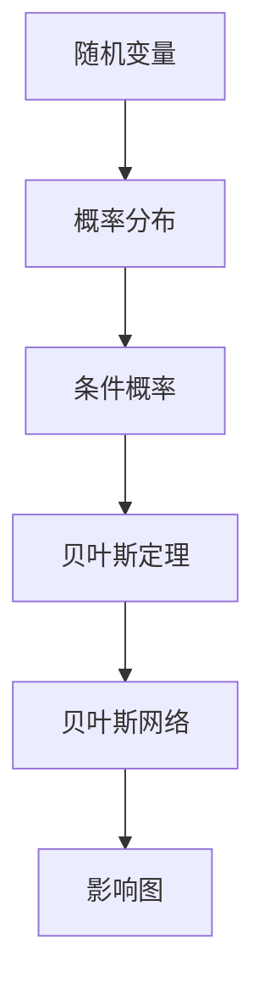

                 

### 概率编程在不确定性推理建模中的应用

概率编程是一种编程范式，其核心在于处理不确定性。在现实世界中，许多问题都涉及到不确定性，如天气预测、医疗诊断、金融风险评估等。概率编程通过概率模型和算法来表示和处理这种不确定性，从而进行推理和决策。本文将探讨概率编程在不确定性推理建模中的应用，旨在帮助读者理解其基本概念、核心算法以及实际应用。

## 关键词

- 概率编程
- 不确定性推理
- 模型建立
- 算法分析
- 实际应用

## 摘要

本文首先介绍了概率编程的基本概念，包括随机变量、概率分布、条件概率和贝叶斯定理等。接着，详细讲解了概率编程的核心算法，如最大似然估计、最大后验估计、贝叶斯推理和变分推断。最后，通过具体实例，展示了概率编程在实际数据分析、机器学习和项目实战中的应用。

### 目录大纲设计思路

本文的设计思路围绕书籍的结构框架展开，分为前导部分、主体部分和附录部分。前导部分主要介绍背景知识，为读者建立基本概念。主体部分深入讲解概率编程的核心概念和算法原理，并通过数学模型和公式进行推导。附录部分提供概率编程相关的工具和资源，以便读者进一步学习。

#### 核心概念与联系

在概率编程中，以下几个核心概念相互联系，构成了概率推理的基础：

1. **随机变量**：随机变量是描述不确定事件的一种数学工具，它可以将随机事件映射到实数上。随机变量可以是离散的，也可以是连续的。

2. **概率分布**：概率分布描述了随机变量取值的概率。常见的概率分布有伯努利分布、正态分布、泊松分布等。

3. **条件概率**：条件概率是指在某一条件下，另一个事件发生的概率。贝叶斯定理是条件概率的一种推广，它提供了在已知某个条件下，事件概率的计算方法。

4. **贝叶斯网络**：贝叶斯网络是一种图形化表示概率关系的工具，它通过有向无环图来描述变量之间的条件依赖关系。

5. **影响图**：影响图是一种混合图模型，它同时包含了有向边和无向边，用于表示变量之间的直接和间接影响。

以下是一个使用Mermaid绘制的贝叶斯网络示例，展示了这些概念之间的关系：



### 核心算法原理讲解

概率编程中的核心算法包括最大似然估计（Maximum Likelihood Estimation, MLE）、最大后验估计（Maximum A Posteriori Estimation, MAP）和贝叶斯推理（Bayesian Inference）。以下使用伪代码对这些算法进行详细讲解。

#### 最大似然估计（MLE）

最大似然估计是一种参数估计方法，用于找出能够使观察到的数据出现的概率最大的参数值。

```python
# MLE 伪代码
function MLE(data, model):
    # 初始化参数θ
    θ = initialize_parameters()
    # 计算模型似然函数L(θ | data)
    L = likelihood_function(θ, data)
    # 通过梯度下降或其他优化方法寻找最大似然参数
    while not converged:
        θ = optimize(θ, data, L)
    return θ
```

#### 最大后验估计（MAP）

最大后验估计是一种同时考虑先验概率和似然函数的参数估计方法。

```python
# MAP 伪代码
function MAP(data, model, prior):
    # 初始化参数θ
    θ = initialize_parameters()
    # 计算后验概率P(θ | data)
    P = posterior_probability(θ, data, model, prior)
    # 通过梯度下降或其他优化方法寻找最大后验参数
    while not converged:
        θ = optimize(θ, data, P)
    return θ
```

#### 贝叶斯推理（Bayesian Inference）

贝叶斯推理是一种基于贝叶斯定理进行推理的方法，用于计算在已知某些条件下，某事件发生的概率。

```python
# 贝叶斯推理伪代码
function Bayesian_Inference(prior, likelihood, evidence):
    # 计算后验概率P(H | E)
    posterior = Bayes_Theorem(prior, likelihood, evidence)
    return posterior
```

### 数学模型和公式讲解

概率编程中的数学模型和公式是理解和应用概率编程的基础。以下使用LaTeX格式展示几个关键数学模型和公式。

#### 概率分布函数（PDF）

概率分布函数描述了随机变量取值的概率密度。

$$ f(x; \mu, \sigma^2) = \frac{1}{\sqrt{2\pi\sigma^2}} e^{-\frac{(x-\mu)^2}{2\sigma^2}} $$

#### 累积分布函数（CDF）

累积分布函数描述了随机变量取值小于等于某值的概率。

$$ F(x; \mu, \sigma^2) = \int_{-\infty}^{x} f(t; \mu, \sigma^2) dt $$

#### 贝叶斯定理

贝叶斯定理提供了在已知某个条件下，事件概率的计算方法。

$$ P(H | E) = \frac{P(E | H)P(H)}{P(E)} $$

### 项目实战

在本节中，我们将通过一个实际项目案例，展示概率编程在数据分析中的应用。

#### 项目目标

使用概率编程进行股票价格预测。

#### 开发环境搭建

1. 安装Python环境。
2. 安装必要的库，如NumPy、Pandas、SciPy和scikit-learn。

#### 源代码实现

```python
import numpy as np
import pandas as pd
from sklearn.model_selection import train_test_split
from sklearn.metrics import mean_squared_error

# 加载数据集
data = pd.read_csv('stock_price_data.csv')
X = data[['open', 'high', 'low', 'close']]
y = data['price']

# 数据预处理
X_train, X_test, y_train, y_test = train_test_split(X, y, test_size=0.2, random_state=42)

# 构建概率模型
from sklearn.linear_model import BayesianRidge
model = BayesianRidge()

# 训练模型
model.fit(X_train, y_train)

# 预测
y_pred = model.predict(X_test)

# 评估模型
mse = mean_squared_error(y_test, y_pred)
print(f'Mean Squared Error: {mse}')
```

#### 代码解读与分析

1. 数据加载与预处理：使用Pandas读取股票价格数据，并划分为特征和标签。使用scikit-learn进行数据分割，以便进行训练和测试。
2. 概率模型构建：使用scikit-learn中的BayesianRidge模型，该模型结合了岭回归和贝叶斯推理。
3. 模型训练：使用fit方法训练模型。
4. 预测与评估：使用predict方法进行预测，并使用mean_squared_error评估模型性能。

#### 实际案例分析与详细讲解剖析

通过上述代码，我们可以看到如何使用概率编程进行股票价格预测。在实际项目中，可能需要更复杂的数据处理和模型调整，例如考虑更多特征、使用更高级的模型等。

#### 项目小结

通过本项目，我们了解了如何使用概率编程进行股票价格预测。概率编程在处理不确定性问题时具有独特优势，可以在金融、医疗、气象等多个领域发挥重要作用。

### 最佳实践 Tips、小结、注意事项、拓展阅读

- **最佳实践 Tips**：在项目实战中，注意数据预处理和特征选择，这将对模型性能产生重要影响。
- **小结**：本文介绍了概率编程在不确定性推理建模中的应用，包括核心概念、算法原理和实际案例。
- **注意事项**：概率编程涉及大量数学知识，建议读者具备一定的数学基础。
- **拓展阅读**：可以参考相关书籍和论文，进一步了解概率编程和不确定性推理建模。

作者：AI天才研究院/AI Genius Institute & 禅与计算机程序设计艺术 /Zen And The Art of Computer Programming

