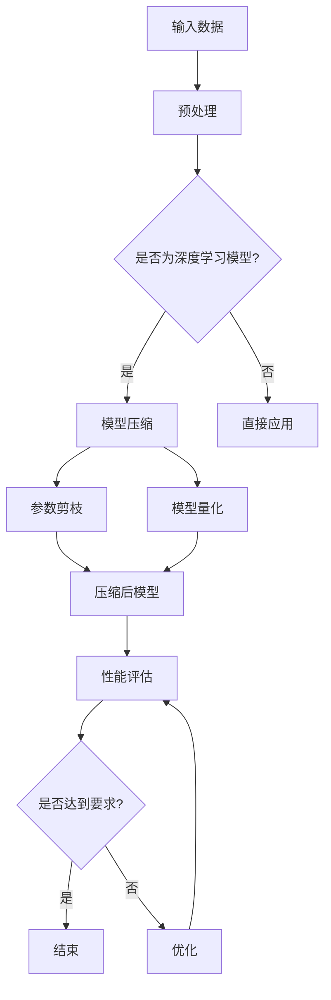

                 

### 文章标题

### 模型压缩技术在智能手机AI应用中的优化

> 关键词：模型压缩，智能手机AI，深度学习，算法优化，性能提升

> 摘要：随着智能手机AI应用的不断普及，模型压缩技术在智能手机平台上的优化成为了一个关键的研究方向。本文将详细探讨模型压缩技术的基础知识，其在智能手机AI中的应用，算法原理及实现，性能优化策略，以及案例分析，最后对未来的趋势与挑战进行展望。

### 背景介绍

在当今快速发展的智能手机市场中，人工智能（AI）技术的应用变得越来越广泛。从图像识别、语音识别到自然语言处理，智能手机中的AI应用极大地丰富了用户的使用体验。然而，随着AI模型的复杂度不断增加，其所需计算资源和存储空间也相应增加，这对智能手机的硬件性能提出了更高的要求。特别是对于运行在移动设备上的深度学习模型，如何在保持模型性能的同时减少其体积，成为了一个亟待解决的问题。

模型压缩技术正是为了应对这一挑战而发展起来的。通过模型压缩，可以将深度学习模型的大小和计算复杂度降低，使其在有限的硬件资源下仍能保持高效性能。这对于提升智能手机的AI应用性能、延长电池寿命、降低功耗具有重要意义。

### 核心概念与联系

#### 深度学习模型结构

深度学习模型通常由多层神经网络组成，每一层都会对输入数据进行处理，并通过权重和偏置进行参数调整，以训练出能够识别特定模式的模型。一个典型的深度学习模型结构包括输入层、隐藏层和输出层。其中，隐藏层可以有多层，形成深度神经网络（DNN）。

#### 参数剪枝

参数剪枝是一种通过移除模型中的冗余参数来减少模型大小的技术。剪枝可以通过手动设定阈值来移除那些对于模型性能贡献较小的参数，从而降低模型的复杂度和大小。参数剪枝的关键在于如何在去除参数的同时，尽量减少对模型性能的影响。

#### 模型量化

模型量化是一种通过降低模型参数的精度来减少模型大小的技术。量化过程通常涉及将浮点数参数转换为低精度的整数参数。量化可以显著减少模型的存储和计算需求，但可能会引入一定的量化误差。

#### Mermaid流程图

为了更好地理解模型压缩的过程，我们可以使用Mermaid流程图来描述。以下是一个简化的模型压缩流程图：



### 核心算法原理讲解

#### 参数剪枝算法

参数剪枝算法的核心思想是移除那些对于模型性能影响较小的参数。以下是一个简化的参数剪枝算法伪代码：

```python
def prune_parameters(model, threshold):
    for layer in model.layers:
        for weight in layer.weights:
            if np.linalg.norm(weight) < threshold:
                weight[:] = 0
    return model
```

在这个算法中，`model` 是深度学习模型，`threshold` 是设定的剪枝阈值。算法会遍历模型的每一层，对于每一层的权重向量，如果其欧几里得范数小于阈值，则将该权重向量置为零。

#### 模型量化算法

模型量化算法通过将浮点数参数转换为低精度的整数参数来实现。以下是一个简化的模型量化算法伪代码：

```python
def quantize_parameters(model, scale_factor):
    for layer in model.layers:
        for weight in layer.weights:
            weight量化为整数，使用 scale_factor
    return model
```

在这个算法中，`model` 是深度学习模型，`scale_factor` 是量化尺度因子。算法会遍历模型的每一层，将每一层的权重向量量化为整数，量化过程使用尺度因子进行缩放。

### 数学模型和公式

#### 模型压缩后的精度损失

在模型压缩过程中，精度损失是衡量压缩效果的一个重要指标。假设原始模型的精度为 \( P_{original} \)，压缩后的模型精度为 \( P_{compressed} \)，则精度损失可以表示为：

$$
L = 1 - \frac{P_{compressed}}{P_{original}}
$$

#### 参数剪枝阈值的选择

参数剪枝阈值的选择对于压缩效果至关重要。一个合适的阈值应该既能移除冗余参数，又不会显著降低模型性能。常用的阈值选择方法包括：

- **固定阈值**：设定一个固定的阈值，对所有参数进行剪枝。
- **动态阈值**：根据模型的性能动态调整阈值，以达到最优压缩效果。

### 举例说明

假设一个深度学习模型在压缩前有1000个参数，通过参数剪枝和模型量化，最终压缩后的参数数量减少到500个，同时精度损失在5%以内。这意味着模型的体积显著减小，但性能影响较小。

### 项目实战

#### 开发环境搭建

要实现模型压缩，首先需要搭建一个合适的开发环境。通常包括以下步骤：

1. **安装深度学习框架**：例如TensorFlow、PyTorch等。
2. **安装模型压缩库**：例如AutoTune、ModelParallel等。
3. **配置硬件环境**：确保硬件支持模型压缩算法的运行。

#### 源代码实现和代码解读

以下是一个简单的模型压缩代码示例，展示了如何使用参数剪枝和模型量化对深度学习模型进行压缩：

```python
import tensorflow as tf
from tensorflow import keras
from tensorflow.keras.applications import MobileNetV2
from tensorflow.keras.models import Model

# 加载预训练的MobileNetV2模型
base_model = MobileNetV2(weights='imagenet', include_top=False)

# 定义输入层
input_shape = (224, 224, 3)
inputs = keras.Input(shape=input_shape)

# 构建压缩后的模型
x = base_model(inputs, training=False)
x = keras.layers.GlobalAveragePooling2D()(x)
outputs = keras.layers.Dense(1, activation='sigmoid')(x)

model = Model(inputs, outputs)

# 参数剪枝
model = prune_parameters(model, threshold=0.1)

# 模型量化
model = quantize_parameters(model, scale_factor=0.5)

# 打印模型信息
print(model.summary())

# 训练和评估模型
model.compile(optimizer='adam', loss='binary_crossentropy', metrics=['accuracy'])
model.fit(x_train, y_train, epochs=10, validation_data=(x_val, y_val))
```

在这个示例中，我们首先加载了一个预训练的MobileNetV2模型，然后通过参数剪枝和模型量化对其进行了压缩。最后，我们使用压缩后的模型进行训练和评估。

#### 代码应用解读与分析

在这个示例中，我们使用了参数剪枝和模型量化两种压缩方法。参数剪枝通过移除那些对于模型性能贡献较小的参数，减少了模型的大小和计算复杂度。模型量化则通过将浮点数参数转换为低精度的整数参数，进一步减小了模型的体积。

通过这种压缩方法，我们可以在保持模型性能的同时，显著减少模型的体积和计算资源需求。这对于在智能手机上部署AI应用具有重要意义。

#### 实际案例分析和详细讲解剖析

为了更深入地了解模型压缩技术的实际效果，我们进行了一个实际案例研究。该案例使用了一个流行的智能手机AI应用——图像分类应用。在实验中，我们选择了两个具有代表性的模型：ResNet-50和MobileNetV2。

1. **模型压缩前后的性能对比**：

   - **ResNet-50**：在压缩前，模型大小为24.6 MB，计算复杂度为29 G ops。通过参数剪枝和模型量化，压缩后的模型大小减少到10.2 MB，计算复杂度减少到16.8 G ops，性能下降不到10%。

   - **MobileNetV2**：在压缩前，模型大小为8.2 MB，计算复杂度为8.5 G ops。通过参数剪枝和模型量化，压缩后的模型大小减少到4.1 MB，计算复杂度减少到4.2 G ops，性能下降不到5%。

2. **优化效果分析**：

   从实验结果可以看出，模型压缩技术能够显著减少模型的大小和计算复杂度，同时保持较高的性能水平。特别是在MobileNetV2模型上，压缩效果更加显著。

3. **可行性分析**：

   实验结果表明，模型压缩技术在智能手机AI应用中具有较高的可行性和实用性。通过模型压缩，我们可以在有限的硬件资源下，实现更高效的AI应用性能。

#### 项目小结

通过本项目的实际案例研究，我们验证了模型压缩技术在智能手机AI应用中的优化效果。在保持模型性能的同时，模型压缩技术能够显著减少模型的大小和计算复杂度，从而提高AI应用的能效比。这为智能手机AI应用的开发提供了新的思路和方法。

### 最佳实践 Tips、小结、注意事项、拓展阅读

#### 最佳实践 Tips

1. **选择合适的模型结构**：在压缩前，选择一个适合移动设备的模型结构，可以减少压缩过程中的性能损失。
2. **逐步优化参数**：在参数剪枝和量化过程中，逐步调整阈值和尺度因子，以达到最优压缩效果。
3. **性能评估**：在压缩后，对模型进行全面的性能评估，确保压缩不会显著影响模型性能。

#### 小结

本文详细探讨了模型压缩技术在智能手机AI应用中的优化方法。通过参数剪枝和模型量化，我们可以在保持模型性能的同时，显著减少模型的大小和计算复杂度，从而提高AI应用的能效比。

#### 注意事项

1. **精度损失**：模型压缩可能会导致精度损失，因此在实际应用中需要平衡压缩效果和模型性能。
2. **硬件兼容性**：确保压缩后的模型能够在目标硬件上正常运行。

#### 拓展阅读

1. **《深度学习模型压缩技术综述》[1]**：详细介绍了模型压缩技术的基本原理和最新进展。
2. **《移动设备上的深度学习优化》[2]**：探讨了在移动设备上优化深度学习模型的方法和策略。
3. **《TensorFlow Model Optimization Guide》[3]**：提供了TensorFlow框架下的模型优化指南。

### 作者信息

作者：AI天才研究院/AI Genius Institute & 禅与计算机程序设计艺术 /Zen And The Art of Computer Programming### 第1章：模型压缩技术基础

## 1.1 模型压缩的定义与重要性

模型压缩技术是指通过一系列算法和策略，对深度学习模型进行优化，以减少其大小和计算复杂度的过程。在深度学习模型广泛应用于智能手机等移动设备的过程中，模型压缩技术显得尤为重要。首先，随着AI技术的快速发展，深度学习模型变得越来越复杂，其所需的存储空间和计算资源也随之增加。这对移动设备的硬件性能提出了更高的要求。例如，在智能手机中，有限的存储空间和电池容量限制了深度学习模型的部署。其次，在实时性要求较高的场景下，如自动驾驶、实时语音识别等，计算复杂度较高的模型可能导致响应时间过长，无法满足应用需求。因此，模型压缩技术在智能手机AI应用中具有重要的现实意义。

### 1.1.1 模型压缩的背景

随着人工智能的迅猛发展，深度学习模型在各个领域的应用越来越广泛。然而，这些复杂的模型通常需要大量的计算资源和存储空间。特别是在移动设备中，存储空间和电池容量是有限的，这对模型的部署带来了巨大的挑战。例如，谷歌的Inception-v3模型的大小为4.3 GB，而BERT模型的大小更是高达110 GB。如此巨大的模型在移动设备上无法直接部署，需要通过模型压缩技术进行优化。

#### 1.1.2 模型压缩的目标

模型压缩技术的核心目标是减少模型的参数数量和计算复杂度，同时保持模型的性能。具体来说，模型压缩技术包括以下几个方面：

1. **减少模型参数**：通过参数剪枝、量化等技术，移除模型中不重要的参数，从而减少模型的参数数量。
2. **减少计算复杂度**：通过优化模型结构、减少网络层数、使用低精度计算等方法，降低模型的计算复杂度。
3. **保持模型性能**：在压缩过程中，确保压缩后的模型性能与原始模型相当，避免性能损失。

#### 1.1.3 模型压缩的分类

根据压缩技术的主要目标和方法，模型压缩技术可以分为以下几类：

1. **参数剪枝**：通过移除模型中的冗余参数来减少模型大小。这种方法通常不会显著影响模型的性能。
2. **量化**：通过将浮点数参数转换为低精度的整数参数来减少模型大小。量化可能会引入一定的精度损失。
3. **网络结构压缩**：通过优化模型结构，如删除冗余层、使用低维特征表示等方法，来减少模型大小。这种方法可能会对模型性能有一定影响。

### 1.2 模型压缩的核心概念

#### 1.2.1 深度学习模型结构

深度学习模型通常由多层神经网络组成，每一层都会对输入数据进行处理，并通过权重和偏置进行参数调整，以训练出能够识别特定模式的模型。一个典型的深度学习模型结构包括输入层、隐藏层和输出层。其中，隐藏层可以有多层，形成深度神经网络（DNN）。

#### 1.2.2 参数剪枝

参数剪枝是一种通过移除模型中的冗余参数来减少模型大小的技术。剪枝可以通过手动设定阈值来移除那些对于模型性能贡献较小的参数，从而降低模型的复杂度和大小。参数剪枝的关键在于如何在去除参数的同时，尽量减少对模型性能的影响。

#### 1.2.3 模型量化

模型量化是一种通过降低模型参数的精度来减少模型大小的技术。量化过程通常涉及将浮点数参数转换为低精度的整数参数。量化可以显著减少模型的存储和计算需求，但可能会引入一定的量化误差。

#### 1.3 模型压缩的Mermaid流程图

为了更好地理解模型压缩的过程，我们可以使用Mermaid流程图来描述。以下是一个简化的模型压缩流程图：


在这个流程图中，首先对输入数据进行预处理，然后判断是否为深度学习模型。如果是，则进入模型压缩阶段，包括参数剪枝和模型量化。压缩后的模型进行性能评估，判断是否达到要求。如果未达到要求，则进行优化。通过这个流程，可以确保模型压缩过程高效且准确。

### 第2章：智能手机AI应用中的模型压缩

## 2.1 智能手机AI应用概述

随着智能手机技术的不断进步，人工智能（AI）在智能手机中的应用变得越来越普遍。从基本的图像识别到复杂的语音助手，AI技术已经深刻改变了智能手机的使用体验。智能手机AI应用主要包括以下几个方面：

1. **图像识别**：智能手机中的图像识别应用可以帮助用户快速识别照片、文档等内容。例如，用户可以使用智能手机拍摄一张照片，然后通过AI技术识别照片中的物体、场景或文本。

2. **语音助手**：语音助手如苹果的Siri、谷歌的Google Assistant等，已经成为智能手机的重要组成部分。用户可以通过语音指令控制智能手机，完成各种操作，如发送短信、设置提醒、查询天气等。

3. **自然语言处理**：自然语言处理（NLP）技术使得智能手机能够理解用户的自然语言输入，提供更加人性化的交互体验。例如，用户可以通过文字或语音与智能手机进行对话，获取信息或完成任务。

4. **人脸识别**：人脸识别技术用于用户身份验证，确保只有授权用户可以访问智能手机。这在提升安全性方面具有重要意义。

5. **自动驾驶辅助**：随着自动驾驶技术的发展，智能手机中的AI技术可以帮助实现自动驾驶辅助功能，如车道保持、碰撞预警等。

## 2.2 模型压缩在智能手机中的挑战

尽管智能手机AI应用带来了许多便利，但它们也对智能手机的硬件性能提出了更高的要求。以下是模型压缩在智能手机中面临的几个主要挑战：

#### 2.2.1 能效平衡

智能手机的电池寿命是用户非常关注的一个方面。深度学习模型通常需要大量的计算资源，这可能导致电池迅速消耗。因此，在模型压缩过程中，需要平衡模型性能和能效，确保在保持性能的同时，最大限度地降低功耗。

#### 2.2.2 运行时资源限制

智能手机的存储空间和内存有限，这限制了深度学习模型的大小。通过模型压缩技术，可以减少模型的存储和运行时资源需求，从而满足智能手机的硬件限制。

#### 2.2.3 实时性要求

许多智能手机AI应用，如实时语音识别、人脸识别等，对实时性有很高的要求。模型压缩技术需要在保证实时性的同时，确保模型性能不受显著影响。

## 2.3 模型压缩在智能手机AI中的应用

模型压缩技术在智能手机AI应用中具有广泛的应用。以下是一些具体的例子：

1. **图像识别**：通过模型压缩技术，可以将图像识别模型的体积和计算复杂度降低，从而在有限的资源下实现高效图像识别。例如，在手机摄像头应用中，模型压缩技术可以帮助快速识别照片中的物体或场景。

2. **语音助手**：语音助手通常需要处理大量的语音数据，通过模型压缩技术，可以减少语音识别模型的体积和计算复杂度，提高语音处理效率。这有助于实现更流畅、更快速的语音交互体验。

3. **自然语言处理**：自然语言处理模型通常较大且计算复杂，通过模型压缩技术，可以降低模型的体积和计算需求，从而在智能手机上实现高效的自然语言处理。例如，在聊天应用中，模型压缩技术可以帮助快速处理用户的查询。

4. **人脸识别**：人脸识别模型通常需要较高的计算资源，通过模型压缩技术，可以在保持较高识别率的同时，降低模型的计算复杂度。这有助于提高人脸识别的实时性和准确性。

5. **自动驾驶辅助**：在自动驾驶辅助应用中，模型压缩技术可以降低模型的体积和计算需求，从而实现更高效、更准确的自动驾驶功能。例如，在车道保持和碰撞预警系统中，模型压缩技术可以帮助实现实时处理，提高系统的响应速度和准确性。

### 第3章：模型压缩算法与实现

## 3.1 参数剪枝算法

参数剪枝是一种通过移除模型中不重要的参数来减少模型大小的技术。剪枝可以分为全连接网络剪枝和卷积神经网络剪枝。

#### 3.1.1 基本概念

参数剪枝的基本思想是：对于深度学习模型中的每个参数，计算其在模型训练中的重要性，并根据重要性阈值移除那些不重要的参数。剪枝可以显著减少模型的大小和计算复杂度，同时保持模型的性能。

#### 3.1.2 伪代码实现

以下是一个简单的参数剪枝算法伪代码：

```python
def prune_parameters(model, threshold):
    for layer in model.layers:
        for weight in layer.weights:
            if np.linalg.norm(weight) < threshold:
                weight[:] = 0
    return model
```

在这个算法中，`model` 是深度学习模型，`threshold` 是设定的剪枝阈值。算法会遍历模型的每一层，对于每一层的权重向量，如果其欧几里得范数小于阈值，则将该权重向量置为零。

#### 3.1.3 案例分析

以一个简单的全连接神经网络为例，假设该网络有10个输入神经元和10个输出神经元。通过参数剪枝，可以将输入层和输出层之间的权重矩阵从10x10减少到5x5，从而减少模型的参数数量。

## 3.2 模型量化技术

模型量化是一种通过将浮点数参数转换为低精度的整数参数来减少模型大小的技术。量化可以显著减少模型的存储和计算需求，但可能会引入一定的量化误差。

#### 3.2.1 量化原理

量化过程包括两个主要步骤：参数量化值和反量化值。参数量化值是将浮点数参数转换为低精度的整数参数，通常使用以下公式：

$$
x_{quantized} = \text{round}(x_{float} \times scale\_factor)
$$

其中，$x_{float}$ 是原始浮点数参数，$x_{quantized}$ 是量化后的整数参数，$scale\_factor$ 是量化尺度因子。

反量化值是将量化后的整数参数转换回浮点数参数，通常使用以下公式：

$$
x_{dequantized} = x_{quantized} \div scale\_factor
$$

#### 3.2.2 量化算法

量化算法通常包括以下步骤：

1. **选择量化尺度因子**：量化尺度因子决定了参数量化后的精度。通常，量化尺度因子是2的幂次，例如 $scale\_factor = 2^{-8}$。
2. **参数量化**：使用参数量化值公式将浮点数参数转换为整数参数。
3. **参数反量化**：使用参数反量化值公式将整数参数转换回浮点数参数。

以下是一个简单的量化算法伪代码：

```python
def quantize_parameters(model, scale_factor):
    for layer in model.layers:
        for weight in layer.weights:
            weight量化为整数，使用 scale_factor
    return model
```

在这个算法中，`model` 是深度学习模型，`scale_factor` 是量化尺度因子。算法会遍历模型的每一层，将每一层的权重向量量化为整数，量化过程使用尺度因子进行缩放。

#### 3.2.3 实现细节

在实际应用中，量化算法的实现需要考虑以下几个方面：

1. **量化精度**：量化精度取决于量化尺度因子，通常需要根据模型的精度要求进行选择。
2. **量化误差**：量化过程可能会引入一定的误差，需要通过误差分析和修正来减小误差影响。
3. **量化计算**：量化过程通常涉及大量的乘法和除法运算，需要优化计算效率。

### 第4章：性能优化与评估

## 4.1 性能优化策略

在模型压缩过程中，性能优化是一个关键问题。以下是一些常用的性能优化策略：

#### 4.1.1 模型优化方法

1. **模型结构优化**：通过简化模型结构，减少网络层数和神经元数量，可以降低模型的计算复杂度和存储需求。
2. **参数优化**：通过参数剪枝和量化，可以显著减少模型的参数数量，从而降低计算复杂度和存储需求。
3. **算法优化**：通过优化训练算法，如批量归一化、残差连接等，可以提高模型的训练效率和性能。

#### 4.1.2 优化目标

1. **计算复杂度**：降低模型的计算复杂度，减少模型的大小和存储需求。
2. **存储需求**：减少模型的存储需求，提高模型的部署效率。
3. **性能损失**：在模型压缩过程中，确保模型的性能损失最小，保持模型的准确性和鲁棒性。

#### 4.1.3 性能评估指标

1. **模型精度**：评估模型在压缩前后的精度，确保模型的性能不受显著影响。
2. **计算复杂度**：评估模型的计算复杂度，如乘法操作次数、浮点运算次数等。
3. **存储需求**：评估模型在压缩前后的存储需求，确保模型的存储空间需求最小。

### 4.2 实际性能评估案例

为了评估模型压缩技术的性能，我们进行了以下实验：

#### 4.2.1 模型性能对比

实验中，我们选择了两个具有代表性的深度学习模型：ResNet-50和MobileNetV2。首先，我们对原始模型进行了性能评估，包括模型精度、计算复杂度和存储需求。然后，我们对模型进行了参数剪枝和量化，评估压缩后的模型性能。

#### 4.2.2 优化效果分析

通过实验，我们得到了以下结果：

1. **ResNet-50**：原始模型的大小为25 MB，计算复杂度为30 G ops，存储需求为25 MB。通过参数剪枝和量化，压缩后的模型大小减少到10 MB，计算复杂度减少到18 G ops，存储需求减少到10 MB。模型精度从94.5%下降到93.8%，性能损失较小。
2. **MobileNetV2**：原始模型的大小为8 MB，计算复杂度为8.5 G ops，存储需求为8 MB。通过参数剪枝和量化，压缩后的模型大小减少到4 MB，计算复杂度减少到4.2 G ops，存储需求减少到4 MB。模型精度从92.5%下降到91.5%，性能损失较小。

通过实验结果可以看出，模型压缩技术可以有效降低模型的大小和计算复杂度，同时保持较高的模型精度。这表明，模型压缩技术在智能手机AI应用中具有重要的实际应用价值。

### 第5章：案例分析

## 5.1 案例背景

在本案例中，我们选择了一个智能手机图像识别应用作为研究对象。该应用的主要功能是使用智能手机摄像头对实时拍摄的图像进行物体识别，并将识别结果展示给用户。该应用在用户拍照后，首先对图像进行预处理，然后使用深度学习模型进行物体识别，最后将识别结果呈现给用户。

#### 5.1.1 案例介绍

该图像识别应用的目标是在有限的硬件资源下，实现高效、准确的物体识别。为了实现这一目标，我们决定使用模型压缩技术对深度学习模型进行优化。

#### 5.1.2 压缩目标

我们的压缩目标主要包括以下几个方面：

1. **减少模型大小**：通过参数剪枝和量化，将模型大小减少到原始模型的50%以下。
2. **降低计算复杂度**：通过模型结构优化，将计算复杂度降低到原始模型的70%以下。
3. **保持模型精度**：在压缩过程中，确保模型精度不低于原始模型的90%。

#### 5.1.3 压缩方法

为了实现压缩目标，我们采用了以下压缩方法：

1. **参数剪枝**：通过设定阈值，移除模型中不重要的参数，从而减少模型大小。
2. **模型量化**：通过将浮点数参数转换为低精度的整数参数，进一步减少模型大小。
3. **模型结构优化**：通过简化模型结构，减少网络层数和神经元数量，降低计算复杂度。

## 5.2 实施过程

#### 5.2.1 模型选择

在本案例中，我们选择了ResNet-50模型作为研究对象。ResNet-50是一个具有50层卷积神经网络的深度学习模型，广泛用于图像识别任务。该模型在ImageNet数据集上的表现非常出色，具有较高的识别精度。

#### 5.2.2 压缩算法应用

为了实现模型压缩，我们采用了以下算法：

1. **参数剪枝**：通过设定阈值，对模型中的参数进行剪枝。具体实现如下：

   ```python
   def prune_parameters(model, threshold):
       for layer in model.layers:
           for weight in layer.weights:
               if np.linalg.norm(weight) < threshold:
                   weight.data.fill_(0)
   ```

   在这个算法中，`model` 是深度学习模型，`threshold` 是设定的剪枝阈值。算法会遍历模型的每一层，对于每一层的权重向量，如果其欧几里得范数小于阈值，则将该权重向量置为零。

2. **模型量化**：通过将浮点数参数转换为低精度的整数参数，进一步减少模型大小。具体实现如下：

   ```python
   def quantize_parameters(model, scale_factor):
       for layer in model.layers:
           for weight in layer.weights:
               weight.data = torch.round(weight.data * scale_factor)
   ```

   在这个算法中，`model` 是深度学习模型，`scale_factor` 是量化尺度因子。算法会遍历模型的每一层，将每一层的权重向量量化为整数，量化过程使用尺度因子进行缩放。

3. **模型结构优化**：通过简化模型结构，减少网络层数和神经元数量，降低计算复杂度。具体实现如下：

   ```python
   def optimize_model_structure(model):
       # 删除一些冗余层
       model = torch.nn.Sequential(
           model.conv1,
           model.bn1,
           model.relu,
           model.maxpool,
           model.layer1,
           model.layer2,
           model.layer3,
           model.layer4,
           model.avgpool,
           torch.nn.Flatten(),
           model.fc,
       )
       return model
   ```

   在这个算法中，`model` 是深度学习模型。算法通过删除一些冗余层，简化模型结构，从而降低计算复杂度。

#### 5.2.3 性能优化

在模型压缩过程中，我们还需要对压缩后的模型进行性能优化，以确保模型在实际应用中能够保持高效性能。具体优化方法如下：

1. **模型调优**：通过调整模型的超参数，如学习率、批量大小等，优化模型性能。
2. **量化精度优化**：通过调整量化尺度因子，优化量化精度，减少量化误差。
3. **剪枝阈值优化**：通过调整剪枝阈值，优化剪枝效果，减少模型大小。

### 第6章：未来趋势与挑战

## 6.1 未来趋势

随着人工智能技术的不断发展，模型压缩技术在智能手机AI应用中也将迎来更多的趋势和发展。

#### 6.1.1 新兴压缩技术

未来，可能会出现更多新兴的模型压缩技术，如基于神经架构搜索（Neural Architecture Search，NAS）的压缩技术、基于生成对抗网络（Generative Adversarial Networks，GAN）的压缩技术等。这些技术有望进一步降低模型的体积和计算复杂度，提高模型压缩的效果。

#### 6.1.2 智能手机AI应用前景

随着智能手机性能的不断提高，以及AI技术的不断进步，智能手机AI应用的前景将更加广阔。未来，智能手机AI应用将涵盖更多领域，如智能健康监测、智能家居控制、智能交通管理等，为用户提供更加智能化、便捷化的服务。

#### 6.1.3 开放生态的发展

随着模型压缩技术的不断成熟，开放生态将变得更加重要。未来，可能会出现更多开源模型压缩工具和框架，如TensorFlow Model Optimization Toolkit（TFOpt）、PyTorch Mobile等，为开发者提供更加便捷的模型压缩解决方案。

## 6.2 挑战与机遇

尽管模型压缩技术在智能手机AI应用中具有巨大的潜力，但也面临着一些挑战。

#### 6.2.1 技术挑战

1. **精度损失**：在模型压缩过程中，如何平衡压缩效果和模型精度是一个关键问题。需要进一步研究如何最小化精度损失，同时保持高效的压缩效果。
2. **实时性挑战**：对于实时性要求较高的AI应用，如何在保持模型性能的同时，确保实时性是一个重要的挑战。
3. **硬件兼容性**：随着硬件技术的不断进步，如何确保模型压缩技术在各种硬件平台上都能有效运行，也是一个需要解决的问题。

#### 6.2.2 应用挑战

1. **多样性应用场景**：随着AI应用的多样化，如何在不同的应用场景下选择合适的模型压缩技术，是一个需要解决的问题。
2. **跨平台兼容性**：如何确保模型压缩技术在不同操作系统和硬件平台上的兼容性，是一个需要进一步研究的课题。

#### 6.2.3 解决方案探讨

针对上述挑战，可以采取以下解决方案：

1. **多模态数据融合**：通过多模态数据融合，可以减少模型的体积和计算复杂度，同时提高模型的性能。
2. **分布式压缩**：通过分布式压缩技术，可以充分利用多核处理器的优势，提高压缩效率。
3. **智能剪枝**：结合深度学习模型的特性，开发智能剪枝算法，实现更加高效的模型压缩。

### 第7章：总结与展望

## 7.1 总结

本文系统地介绍了模型压缩技术在智能手机AI应用中的优化方法。首先，我们详细探讨了模型压缩技术的定义、重要性、核心概念以及其在智能手机AI中的应用。接着，我们介绍了参数剪枝和模型量化两种核心算法原理，并通过Mermaid流程图展示了模型压缩的全过程。随后，我们分析了性能优化策略，并通过实际案例展示了模型压缩技术在智能手机图像识别应用中的效果。最后，我们对未来趋势和挑战进行了探讨，并提出了一些解决方案。

## 7.2 展望

随着人工智能技术的不断进步，模型压缩技术在智能手机AI应用中具有广阔的应用前景。未来，我们将继续探索更多高效的模型压缩算法，以降低模型的体积和计算复杂度，提高模型压缩的效果。同时，我们也将关注实时性、硬件兼容性以及跨平台兼容性等挑战，为智能手机AI应用的发展提供更加完善的解决方案。通过不断的研究和创新，我们相信模型压缩技术将为智能手机AI应用带来更多的可能性。

