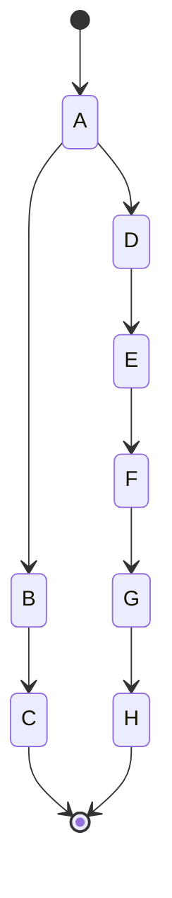
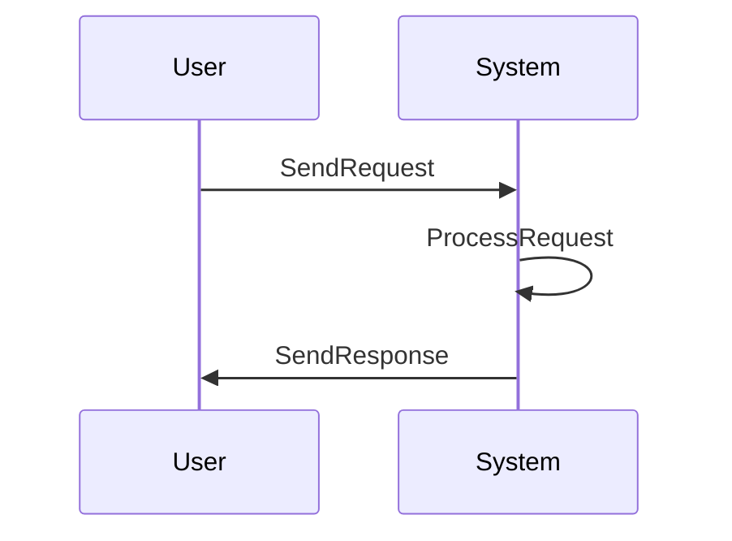

                 

### 引言

#### 并发系统及其挑战

在现代计算机系统中，并发系统已成为不可或缺的一部分。并发系统通过同时执行多个任务或进程来提高系统的效率和响应能力。这种设计允许系统利用多核处理器、分布式计算资源等，实现更高层次的性能和资源利用率。然而，并发系统的引入也带来了诸多挑战，尤其是系统中的竞态条件和死锁等问题。

竞态条件是指多个并发执行的任务因为共享资源而产生冲突，导致执行结果不确定或者不可预测的问题。死锁则是由于任务间的资源争用导致系统陷入无限等待的状态。这些问题不仅影响了系统的性能，还可能导致严重的系统故障和崩溃。

传统的测试方法通常依赖于代码执行和观察结果，但这种方法在处理复杂的并发系统时显得力不从心。一方面，并发系统的行为依赖于执行路径，不同的执行路径可能导致完全不同的结果。另一方面，测试用例的设计和执行需要耗费大量的时间和资源。

#### 模型检验技术

为了解决并发系统中的这些挑战，模型检验技术应运而生。模型检验是一种形式化的验证方法，通过对系统的模型进行数学分析，来验证系统是否满足特定的性质和约束。这种方法不仅能够发现潜在的缺陷，还能在系统设计和开发阶段提前进行验证，从而降低测试和修复的成本。

模型检验技术的核心在于建立系统的数学模型，并使用算法对模型进行验证。通过分析模型的属性，我们可以确保系统在实际执行中不会出现竞态条件和死锁等问题。此外，模型检验技术还可以帮助我们理解和优化系统的行为，提高系统的可靠性和性能。

本文将深入探讨模型检验技术在并发系统验证中的应用，通过详细的理论讲解和实际案例，展示模型检验技术如何有效地解决并发系统的挑战，提升系统的可靠性和性能。

---

### 关键词

- **并发系统**：多任务或进程同时执行的系统结构。
- **模型检验**：使用数学分析方法验证系统模型是否满足特定性质的技术。
- **竞态条件**：并发系统中因资源争用导致不确定行为的条件。
- **死锁**：多个任务因等待资源而无限期阻塞的状态。
- **数学模型**：系统行为的形式化描述。
- **状态空间探索**：模型检验中的一种算法，用于遍历系统所有可能的状态。
- **抽象解释**：一种模型检验方法，通过简化的模型分析复杂系统的行为。

---

### 摘要

本文探讨了模型检验技术在并发系统验证中的应用。首先，介绍了并发系统的基本概念及其在计算机系统中的重要性，并指出了并发系统可能面临的挑战，如竞态条件和死锁。接着，详细阐述了模型检验技术的理论基础和主要方法，包括模型建立、模型验证和模型检验算法。随后，本文介绍了并发系统的建模方法，重点讨论了状态空间建模和事件驱动建模。在此基础上，提出了并发系统的验证策略，并详细描述了验证流程和验证效果评估。随后，本文通过实际案例展示了模型检验技术在软件开发、硬件设计和网络安全等领域的应用，并分析了其在系统优化中的作用。最后，本文对模型检验技术的发展趋势、面临的挑战和机遇进行了展望，并总结了模型检验技术在并发系统验证中的核心作用和未来方向。通过本文的探讨，读者可以深入了解模型检验技术如何有效提升并发系统的可靠性和性能。

---

### 第1章：模型检验基本概念

#### 1.1 并发系统的定义与特点

并发系统是指在同一时间段内，多个任务或进程能够并行执行的系统。这些任务或进程可能由不同的用户发起，也可能由系统内部自动触发。并发系统的主要特点包括：

1. **并行性**：多个任务可以同时执行，从而提高系统的性能和响应速度。
2. **资源共享**：多个任务可能需要访问同一组共享资源，如内存、文件或网络。
3. **不确定性**：由于任务的执行时间不可预测，系统的最终输出结果具有不确定性。

并发系统的这些特点使得它在现代计算机系统中得到广泛应用，如操作系统、数据库管理系统、网络协议等。然而，并发系统也带来了许多挑战，尤其是在资源管理和同步控制方面。

#### 1.2 模型检验的重要性

模型检验是一种形式化的验证方法，通过建立系统的数学模型，并使用算法验证模型是否满足特定的性质和约束。在并发系统的背景下，模型检验的重要性体现在以下几个方面：

1. **早期发现问题**：通过在系统设计和开发阶段进行模型检验，可以提前发现潜在的竞态条件和死锁等问题，从而降低测试和修复的成本。
2. **提高系统可靠性**：模型检验可以确保系统在实际执行中不会出现不可预测的行为，从而提高系统的可靠性。
3. **优化系统性能**：通过分析模型的属性，可以优化系统的设计，提高系统的性能和资源利用率。

#### 1.3 模型检验的主要方法

模型检验主要包括以下几种方法：

1. **静态分析**：通过分析系统的源代码或设计文档，不执行程序，直接检查程序的正确性。
2. **动态分析**：通过执行程序，收集程序执行过程中的数据，进行分析和验证。
3. **组合分析**：结合静态分析和动态分析的方法，通过分析不同执行路径的组合来验证系统的正确性。

静态分析和动态分析各有优缺点。静态分析不需要执行程序，但可能无法捕捉到程序执行过程中的动态行为；动态分析可以捕捉到执行过程中的动态行为，但可能需要大量的测试用例和执行时间。组合分析则试图结合两者的优点，通过分析执行路径的组合来提高验证的全面性。

#### 1.4 模型检验技术的优势与挑战

模型检验技术相较于传统的测试方法具有明显的优势：

1. **全面性**：模型检验可以通过对整个系统的数学模型进行分析，确保系统满足所有预期性质。
2. **高效性**：模型检验可以在早期发现潜在问题，降低后期测试和修复的成本。
3. **形式化**：模型检验使用数学方法进行验证，结果具有更强的可解释性和可靠性。

然而，模型检验技术也面临一些挑战：

1. **复杂性**：建立和验证系统的数学模型需要较高的专业知识和技能。
2. **效率问题**：在处理复杂的系统时，模型检验可能需要大量的计算资源和时间。
3. **准确性**：模型的准确性和完整性直接影响验证结果，如果模型不完整或错误，可能导致误判。

尽管存在这些挑战，模型检验技术仍然是并发系统验证的重要手段，通过不断的研究和改进，其在实际应用中的效果和效率将得到进一步提升。

---

### 第2章：模型检验技术原理

#### 2.1 模型建立

模型建立是模型检验技术的第一步，其核心目标是创建一个能够准确描述系统行为的数学模型。模型建立的基本步骤包括：

1. **系统抽象**：从实际系统中提取关键组件和关系，进行抽象化处理。
2. **状态定义**：定义系统的状态变量，包括当前值和可能的取值范围。
3. **事件定义**：定义系统中的事件，包括事件的触发条件和影响。
4. **状态转换规则**：定义系统状态之间的转换规则，包括事件触发时状态的变化。

在模型建立过程中，常用的模型表示方法包括：

1. **状态机模型**：通过状态和状态之间的转换关系来描述系统行为。
2. **有限状态机（FSM）**：用于描述具有有限状态和有限事件的系统。
3. **事件图模型**：通过事件和事件之间的依赖关系来描述系统行为。

状态机模型和事件图模型都是形式化的模型表示方法，能够精确地描述系统的状态和行为，为后续的模型检验提供基础。

#### 2.2 模型验证方法

模型验证是模型检验技术的核心步骤，其目标是检查系统模型是否满足预期的性质和约束。模型验证方法主要包括以下几种：

1. **状态空间探索**：通过遍历系统模型的所有可能状态，检查是否满足指定的性质和约束。
   - **算法**：广度优先搜索（BFS）、深度优先搜索（DFS）等。
   - **优势**：全面性，能够发现系统中的所有潜在问题。
   - **劣势**：在状态空间较大时，计算时间复杂度较高。

2. **符号执行**：使用符号变量代替实际值，对程序进行执行，并推导出程序的所有可能路径。
   - **算法**：布尔表达式求解、路径条件推导等。
   - **优势**：能够自动生成测试用例，提高测试覆盖率。
   - **劣势**：对复杂程序可能产生大量的中间结果，导致计算效率较低。

3. **测试用例生成**：通过分析模型，生成满足特定性质的测试用例，并对测试用例进行验证。
   - **算法**：随机测试、进化测试等。
   - **优势**：能够针对特定性质进行优化，提高测试效率。
   - **劣势**：可能无法覆盖所有潜在问题。

4. **抽象解释**：使用简化的模型来分析复杂系统的行为，通过比较抽象模型和原始模型的结果，判断系统是否满足预期性质。
   - **算法**：抽象域求解、归纳断言等。
   - **优势**：能够在较短时间内分析复杂系统，提高验证效率。
   - **劣势**：可能存在误判和漏判的风险。

这些验证方法各有优缺点，实际应用中常根据系统的具体特点和需求，选择合适的验证方法。

#### 2.3 模型检验算法

模型检验算法是用于验证系统模型是否满足特定性质的算法。常见的模型检验算法包括：

1. **SAT求解算法**：用于求解布尔 satisfiability 问题，常用于状态空间探索和符号执行。
   - **算法**：布尔变量分配、冲突驱动搜索等。
   - **优势**：能够快速求解复杂问题，适用于大规模系统。
   - **劣势**：在状态空间较大时，计算时间复杂度较高。

2. **BDD（布尔决定图）算法**：用于表示和操作布尔函数，常用于状态空间探索和抽象解释。
   - **算法**：图展开、图合并等。
   - **优势**：能够高效地表示和操作复杂布尔函数，降低计算时间。
   - **劣势**：对大规模系统可能需要大量内存。

3. **抽象解释算法**：通过简化模型来分析复杂系统的行为，常用于符号执行和测试用例生成。
   - **算法**：抽象域求解、归纳断言等。
   - **优势**：能够在较短时间内分析复杂系统，提高验证效率。
   - **劣势**：可能存在误判和漏判的风险。

这些算法在模型检验技术中发挥着重要作用，通过合理选择和使用，可以显著提高并发系统的验证效果和效率。

---

### 第3章：并发系统建模方法

#### 3.1 并发系统模型概述

并发系统模型是用于描述并发系统行为和特性的数学结构，它能够帮助开发者理解和分析系统的运行状态。建立并发系统模型的核心目标是：

1. **捕捉系统的并行性和资源共享特性**：确保模型能够准确反映系统中任务和资源的交互。
2. **明确系统的约束和规则**：通过形式化的方式描述系统运行的基本规则和约束条件。
3. **支持验证和分析**：为后续的模型检验和性能分析提供基础。

常见的并发系统模型类型包括：

1. **状态机模型**：通过状态和状态之间的转换来描述系统的行为，适用于简单的并发系统。
2. **有限状态机（FSM）**：状态机的特殊情况，具有有限的状态和事件，适用于描述复杂的并发系统。
3. **事件图模型**：通过事件和事件之间的依赖关系来描述系统的行为，适用于具有复杂交互的并发系统。
4. **Petri网**：用于描述系统中的并发性、资源共享和同步机制，特别适用于硬件设计和通信系统。

选择合适的并发系统模型类型，需要根据具体应用场景和系统特性来决定。例如，对于简单的并发控制问题，状态机模型可能就足够了；而对于复杂的分布式系统，事件图模型或Petri网可能更为适用。

#### 3.2 状态空间建模

状态空间建模是一种常用的并发系统建模方法，它通过定义系统的所有可能状态及其转换关系来描述系统的行为。状态空间建模的主要步骤包括：

1. **状态定义**：定义系统中的所有可能状态，这些状态可以是系统变量、资源占用情况、进程状态等。
2. **事件定义**：定义系统中的所有可能事件，这些事件可以触发状态之间的转换，如进程的启动、资源的分配释放等。
3. **状态转换规则**：定义状态之间的转换规则，即事件触发时系统状态的变化。
4. **初始状态和终止状态**：定义系统的初始状态和终止状态，用于表示系统开始和结束的条件。

状态空间建模的关键在于能够清晰、准确地描述系统的所有可能状态及其转换关系。以下是一个简单的状态空间建模示例：

在这个示例中，`[*]`表示初始状态和终止状态，`A`、`B`、`C`、`D`、`E`、`F`、`G`、`H`表示不同的系统状态。箭头表示事件触发时状态的转换。

状态空间建模的优势在于其形式化和结构化的特点，使得系统行为能够被清晰地表示和分析。然而，状态空间建模也面临挑战，特别是在处理大规模并发系统时，状态空间可能非常庞大，导致建模和验证的复杂性增加。

#### 3.3 事件驱动建模

事件驱动建模是一种以事件为中心的并发系统建模方法，它通过定义事件和事件之间的依赖关系来描述系统的行为。事件驱动建模的主要步骤包括：

1. **事件定义**：定义系统中的所有可能事件，包括内部事件和外部事件。内部事件是系统内部生成的，如进程的启动、资源请求等；外部事件是系统外部生成的，如网络消息、用户输入等。
2. **事件依赖关系**：定义事件之间的依赖关系，即哪些事件必须在其他事件发生后才能发生。
3. **状态转换规则**：根据事件的发生顺序和依赖关系，定义状态之间的转换规则。
4. **初始状态和终止状态**：定义系统的初始状态和终止状态，用于表示系统开始和结束的条件。

事件驱动建模的核心在于能够准确描述事件的发生顺序和依赖关系，从而更好地理解和分析系统的行为。以下是一个简单的事件驱动建模示例：

在这个示例中，`User`代表用户，`System`代表系统。`SendRequest`、`ProcessRequest`和`SendResponse`是事件，描述了用户请求的处理过程。

事件驱动建模的优势在于其灵活性和可扩展性，能够很好地适应复杂的并发系统。然而，事件驱动建模也需要对系统的行为有清晰的理解，以确保事件和依赖关系的定义准确无误。

通过状态空间建模和事件驱动建模，我们可以从不同的角度对并发系统进行描述和分析，从而更好地理解和验证系统的行为。这两种建模方法各有优缺点，实际应用中应根据具体需求进行选择。

---

### 第4章：并发系统验证策略

#### 4.1 验证策略概述

并发系统的验证策略是指通过一系列的方法和步骤，确保并发系统在执行过程中满足预期的性质和约束。验证的目标是发现并发系统中的潜在缺陷，如竞态条件、死锁和资源泄露等，并确保系统在实际运行中能够稳定、可靠地工作。验证策略的总体目标包括：

1. **发现错误**：通过形式化的验证方法，发现并发系统中的潜在错误和缺陷。
2. **确保正确性**：验证系统是否满足预期的行为和性能要求。
3. **提高可靠性**：通过验证，提高系统的可靠性和稳定性，减少系统故障和崩溃的风险。

在制定并发系统的验证策略时，需要考虑以下几个关键因素：

1. **系统需求**：明确系统的功能需求和性能要求，为验证策略提供基础。
2. **模型准确性**：建立准确的系统模型，确保验证策略能够准确地反映系统的行为。
3. **验证方法**：选择合适的验证方法和技术，以高效地发现并发系统中的潜在错误。

#### 4.2 验证流程

并发系统的验证流程可以分为以下几个主要步骤：

1. **需求分析**：明确并发系统的功能需求、性能要求和安全约束，为后续的验证工作提供基础。
2. **模型建立**：根据系统需求，建立系统模型的数学表示，包括状态、事件和状态转换规则等。
3. **模型检验**：使用模型检验技术，验证系统模型是否满足预期的性质和约束。常见的模型检验方法包括状态空间探索、符号执行、测试用例生成和抽象解释等。
4. **结果分析**：分析模型检验的结果，发现系统中的潜在错误和缺陷，并根据结果调整系统设计和实现。
5. **迭代验证**：根据验证结果，重复进行模型建立和模型检验，逐步优化系统的设计和实现，直到验证目标得到满足。

以下是一个简化的验证流程示例：

通过这个流程，可以逐步发现并解决并发系统中的潜在问题，提高系统的可靠性和稳定性。

#### 4.3 验证效果评估

验证效果评估是验证策略的重要环节，其目标是评估验证过程的有效性和可靠性。验证效果评估通常包括以下几个方面：

1. **覆盖度评估**：评估验证过程覆盖到的系统状态的百分比，确保关键路径和异常情况得到充分验证。
2. **错误发现率**：评估验证过程能够发现多少潜在的错误和缺陷，以评估验证方法的效率。
3. **资源消耗评估**：评估验证过程中所需的计算资源和时间，确保验证过程在实际应用中是可接受的。

常用的验证效果评估方法包括：

1. **统计方法**：通过统计验证过程中发现错误的比例和类型，评估验证方法的有效性。
2. **比较方法**：将验证结果与实际系统运行结果进行比较，评估验证结果的准确性。
3. **定量评估**：使用定量指标，如错误发现率、验证时间和资源消耗等，对验证效果进行量化评估。

通过验证效果评估，可以持续改进验证策略和方法，提高并发系统的验证质量和效率。

---

### 第5章：模型检验技术在软件工程中的应用

#### 5.1 软件工程中的并发系统问题

在软件工程中，并发系统已经成为现代应用开发的核心。并发系统通过多线程、分布式计算等技术实现了更高的性能和可扩展性，但同时也引入了诸多挑战。以下是一些在软件工程中常见的并发系统问题：

1. **竞态条件**：由于多个线程或进程对共享资源的竞争，导致程序执行结果不确定。竞态条件可能导致数据不一致、系统崩溃等严重问题。
2. **死锁**：多个线程或进程因相互等待对方释放资源而陷入无限等待状态，导致系统瘫痪。
3. **资源泄露**：程序未正确释放已分配的资源，导致系统资源逐渐耗尽。
4. **锁争用**：多个线程或进程同时访问同一锁，导致系统性能下降。
5. **活锁**和**饥饿**：某些线程或进程因长时间等待资源而无法执行，影响系统整体性能。

这些问题不仅影响软件的稳定性和可靠性，还可能导致严重的性能瓶颈和系统崩溃。传统的测试方法难以全面发现和解决这些问题，因此需要更高效、形式化的验证技术。

#### 5.2 模型检验在软件开发中的作用

模型检验技术为软件开发提供了强大的工具，通过形式化建模和验证，可以有效地发现并发系统中的潜在问题，提高软件的可靠性和性能。在软件开发中，模型检验技术的主要作用包括以下几个方面：

1. **需求分析**：在软件开发初期，通过模型检验技术，可以验证系统的功能需求是否合理、一致。例如，通过建立并发系统的模型，可以检查系统需求中是否存在竞态条件或死锁的可能性。
2. **设计验证**：在系统设计阶段，模型检验可以帮助验证设计是否符合预期。例如，通过状态空间探索技术，可以检查系统是否有可能的状态转换错误或死锁问题。
3. **代码实现验证**：在代码实现阶段，模型检验可以检查代码是否符合设计要求，是否存在竞态条件或其他逻辑错误。例如，通过符号执行技术，可以验证代码路径的正确性。
4. **性能分析**：模型检验技术还可以用于分析系统的性能瓶颈。通过模型仿真和性能评估，可以优化系统设计和实现，提高系统的响应速度和资源利用率。

以下是一个模型检验在软件开发中应用的示例：

**案例：多线程并发处理**
假设一个系统需要处理大量并发请求，通过多线程实现负载均衡。为了确保系统的高性能和稳定性，我们可以使用模型检验技术进行以下验证：

1. **需求分析**：建立系统模型，确保需求文档中的功能描述合理，不存在竞态条件和死锁的可能性。
2. **设计验证**：使用状态空间探索技术，检查系统设计中的状态转换是否正确，是否存在死锁风险。
3. **代码实现验证**：通过符号执行技术，验证代码路径的正确性，确保线程之间的资源同步和锁管理正确。
4. **性能分析**：使用模型仿真和性能评估，优化线程数量和负载均衡策略，提高系统的响应速度和资源利用率。

通过这些步骤，模型检验技术可以确保系统在开发过程中及时发现并解决潜在问题，提高软件的可靠性和性能。

---

### 第6章：模型检验技术在硬件设计中的应用

#### 6.1 并发系统在硬件设计中的重要性

在硬件设计中，并发系统同样扮演着关键角色。现代硬件系统，如处理器、网络设备和存储系统，都依赖于并发执行来提高性能和资源利用率。并发系统在硬件设计中的重要性体现在以下几个方面：

1. **性能提升**：通过并发执行多个任务，硬件系统能够充分利用多核处理器和分布式资源，从而提高整体性能。
2. **资源优化**：并发系统能够有效地管理共享资源，如缓存、内存和网络连接，提高资源的利用效率。
3. **可靠性增强**：通过并发执行和任务调度，硬件系统能够更好地处理异常情况，提高系统的稳定性和可靠性。

然而，并发系统在硬件设计中也带来了诸多挑战。由于硬件系统中的任务执行具有高度并行性和不确定性，可能导致竞态条件、死锁和资源泄漏等问题。这些问题不仅影响硬件系统的性能，还可能导致严重的系统故障和设备损坏。

#### 6.2 模型检验在硬件设计中的作用

模型检验技术为硬件设计提供了有效的工具，通过形式化建模和验证，可以确保硬件系统在设计和实现过程中满足预期的行为和性能要求。在硬件设计中，模型检验技术的主要作用包括：

1. **需求分析**：通过建立硬件系统的数学模型，可以验证需求文档中的功能描述是否合理、一致。例如，在处理器设计中，可以检查并发处理是否可能导致数据不一致或竞争条件。
2. **设计验证**：在硬件设计阶段，模型检验可以帮助验证设计是否符合预期。例如，通过状态空间探索技术，可以检查系统是否有可能的状态转换错误或死锁风险。
3. **代码实现验证**：在硬件实现阶段，模型检验可以检查硬件描述语言（HDL）代码是否符合设计要求，是否存在逻辑错误或竞态条件。例如，通过符号执行技术，可以验证寄存器传输级（RTL）代码的正确性。
4. **性能分析**：模型检验技术还可以用于分析硬件系统的性能瓶颈。通过模型仿真和性能评估，可以优化硬件设计，提高系统的响应速度和资源利用率。

以下是一个模型检验在硬件设计中的应用案例：

**案例：多核处理器设计**
假设一个多核处理器需要支持并发执行多个线程，为了确保系统的稳定性和性能，我们可以使用模型检验技术进行以下验证：

1. **需求分析**：建立处理器模型，确保需求文档中的功能描述合理，不存在并发执行中的竞争条件或死锁风险。
2. **设计验证**：通过状态空间探索技术，检查处理器中的状态转换是否正确，是否存在死锁风险。
3. **代码实现验证**：通过符号执行技术，验证处理器描述语言（如Verilog或VHDL）代码的正确性，确保并发执行的线程之间的同步和资源管理正确。
4. **性能分析**：使用模型仿真和性能评估，优化处理器的设计参数，如线程调度算法和缓存管理策略，提高系统的整体性能。

通过这些步骤，模型检验技术可以帮助硬件设计师在设计和实现过程中及时发现并解决潜在问题，确保硬件系统的稳定性和高性能。

---

### 第7章：模型检验技术在网络安全中的应用

#### 7.1 并发系统在网络安全中的重要性

在网络安全领域，并发系统的重要性不可忽视。现代网络系统，尤其是分布式网络，依赖于并发处理来提供高效、稳定的通信和数据处理能力。并发系统在网络安全中的应用主要体现在以下几个方面：

1. **攻击检测与防御**：并发系统可以同时处理来自不同来源的攻击，如分布式拒绝服务（DDoS）攻击。通过并发执行，网络系统可以实时分析流量，快速识别和阻止恶意攻击。
2. **响应速度**：并发系统能够同时处理多个安全事件，提高响应速度，减少安全漏洞被利用的时间。
3. **负载均衡**：并发处理可以平衡网络负载，避免单点故障，提高系统的可靠性和可用性。

然而，并发系统在网络安全中也面临一些挑战。由于并发执行的不确定性，可能导致竞态条件、死锁等问题，从而影响系统的安全性和稳定性。例如，多个安全模块同时访问同一资源，可能导致数据不一致或安全策略失效。因此，如何利用模型检验技术确保并发系统在网络安全中的正确性和可靠性，成为了一个关键问题。

#### 7.2 模型检验在网络安全中的作用

模型检验技术为网络安全提供了强大的工具，通过形式化建模和验证，可以确保网络系统在设计和实现过程中满足预期的安全性和性能要求。在网络安全中，模型检验技术的主要作用包括：

1. **需求分析**：通过建立网络系统的数学模型，可以验证安全需求文档中的功能描述是否合理、一致。例如，在防火墙设计中，可以检查并发处理是否可能导致安全策略冲突或漏洞。
2. **设计验证**：在网络安全系统设计阶段，模型检验可以帮助验证设计是否符合预期。例如，通过状态空间探索技术，可以检查系统是否有可能的状态转换错误或死锁风险。
3. **代码实现验证**：在代码实现阶段，模型检验可以检查网络协议和应用程序代码是否符合设计要求，是否存在逻辑错误或竞态条件。例如，通过符号执行技术，可以验证网络协议处理流程的正确性。
4. **安全策略验证**：模型检验技术还可以用于验证安全策略的正确性和有效性。例如，通过抽象解释技术，可以检查安全策略是否能够覆盖所有可能的攻击场景。

以下是一个模型检验在网络安全中的应用案例：

**案例：防火墙设计**
假设一个防火墙系统需要支持并发处理来自不同接口的流量，为了确保系统的安全性和稳定性，我们可以使用模型检验技术进行以下验证：

1. **需求分析**：建立防火墙模型，确保需求文档中的功能描述合理，不存在并发处理中的安全漏洞。
2. **设计验证**：通过状态空间探索技术，检查防火墙中的状态转换是否正确，是否存在死锁风险。
3. **代码实现验证**：通过符号执行技术，验证防火墙处理流程的代码是否正确，确保并发处理的线程之间的同步和资源管理正确。
4. **安全策略验证**：使用抽象解释技术，检查防火墙的安全策略是否能够覆盖所有可能的攻击场景，确保系统的安全性。

通过这些步骤，模型检验技术可以帮助网络安全工程师在设计和实现过程中及时发现并解决潜在问题，确保网络系统的稳定性和安全性。

---

### 第8章：模型检验技术在系统优化中的应用

#### 8.1 并发系统在系统优化中的问题

在系统优化过程中，并发系统的作用至关重要，但同时也带来了一系列挑战。并发系统在性能优化中面临的主要问题包括：

1. **资源竞争**：多个任务或线程争夺相同资源（如CPU时间、内存等），可能导致性能下降和响应时间增加。
2. **锁争用**：多个任务试图同时获取同一锁，导致系统进入等待状态，进一步降低性能。
3. **死锁**：多个任务因相互等待对方释放资源而陷入无限等待状态，导致系统瘫痪。
4. **缓存一致性**：在多核处理器中，缓存不一致可能导致数据处理错误，影响系统性能。

这些问题不仅影响了系统的整体性能，还可能引入系统稳定性问题，因此在系统优化中必须加以解决。

#### 8.2 模型检验在系统优化中的作用

模型检验技术在系统优化中具有重要作用，通过建立和验证系统模型，可以有效地识别和解决性能瓶颈，提高系统的效率和稳定性。具体来说，模型检验在系统优化中的作用包括：

1. **性能分析**：通过建立系统模型，分析系统在不同负载下的行为，识别性能瓶颈。例如，使用状态空间探索技术，可以分析线程调度和资源分配的影响。
2. **优化建议**：根据模型检验的结果，提供优化建议，改进系统设计和实现。例如，通过调整线程数量或资源分配策略，优化系统性能。
3. **验证优化效果**：在优化后，使用模型检验技术验证优化措施的有效性，确保系统性能提升的同时，不会引入新的问题。

以下是一个模型检验在系统优化中的应用案例：

**案例：多线程Web服务器优化**

假设一个多线程Web服务器需要在处理大量并发请求时保持高性能和高响应速度。为了优化系统性能，我们可以使用模型检验技术进行以下步骤：

1. **性能分析**：建立Web服务器模型，分析当前系统在处理不同负载下的性能表现。通过状态空间探索技术，检查线程调度策略对性能的影响。
2. **优化建议**：根据模型检验的结果，提供优化建议。例如，通过调整线程池大小、优化锁策略或调整缓存策略，提高系统性能。
3. **验证优化效果**：在优化后，使用模型检验技术验证优化措施的有效性。通过符号执行和抽象解释等技术，确保系统在新的负载下仍能保持高性能。

通过这些步骤，模型检验技术可以帮助系统优化工程师在优化过程中及时发现和解决潜在问题，确保系统在提升性能的同时，保持稳定性和可靠性。

---

### 第9章：未来展望

#### 9.1 模型检验技术的发展趋势

随着计算机技术和应用领域的不断扩展，模型检验技术也在不断进步和演化。未来，模型检验技术有望在以下几个方面取得重要进展：

1. **算法优化**：随着计算资源和算法研究的深入，模型检验算法的效率和精度将得到显著提升。例如，针对大规模状态空间的优化算法、高效的符号执行技术等，都将为模型检验提供更强有力的支持。
2. **自动化验证**：未来模型检验技术将更加自动化，通过结合人工智能和机器学习，实现自动化的模型建立和验证过程。这将极大地减少人工参与，提高验证效率和准确性。
3. **集成工具链**：模型检验技术将与现有的软件开发和测试工具链深度融合，形成一体化的解决方案。例如，集成到IDE、持续集成工具和自动化测试平台中，使得模型检验更加便捷和高效。
4. **多领域应用**：模型检验技术将在更多领域得到应用，如嵌入式系统、物联网、量子计算等新兴领域。通过不断扩展应用场景和优化技术，模型检验技术将进一步提升系统可靠性和性能。

#### 9.2 模型检验技术的挑战与机遇

尽管模型检验技术已经取得了显著进展，但在实际应用中仍然面临一些挑战和机遇：

1. **计算复杂度**：大规模并发系统的模型检验计算复杂度较高，如何提高计算效率和准确性，是当前面临的主要挑战。通过算法优化和分布式计算技术的应用，有望缓解这一难题。
2. **自动化程度**：模型检验技术的自动化程度有待提高，目前的模型建立和验证过程仍需大量人工干预。未来，结合人工智能和自动化工具，有望实现更高自动化水平的模型检验。
3. **跨领域融合**：模型检验技术在不同领域之间的融合应用，是未来的一大机遇。通过跨领域的知识和技术融合，模型检验技术将能够在更广泛的领域中发挥作用，提升系统性能和可靠性。
4. **标准与规范**：模型检验技术需要建立统一的标准化规范，以促进技术的广泛应用和互操作性。未来，通过制定和推广标准化模型和验证方法，模型检验技术将在各领域中得到更好的应用。

总的来说，模型检验技术在未来将面临更多的挑战和机遇，通过持续的技术创新和应用扩展，它将在提升系统可靠性和性能方面发挥更加重要的作用。

---

### 9.3 结论

综上所述，模型检验技术在并发系统验证中具有不可替代的重要作用。通过对并发系统进行形式化的建模和验证，可以有效地发现并解决系统中的竞态条件、死锁等潜在问题，提高系统的可靠性和性能。本文详细介绍了模型检验技术的基本概念、原理以及在实际应用中的具体方法。从软件开发、硬件设计到网络安全和系统优化，模型检验技术都展现出了强大的应用价值。

未来的发展，模型检验技术将朝着算法优化、自动化验证和跨领域融合的方向不断前进。通过这些创新，模型检验技术将在更广泛的领域中发挥作用，进一步提升系统的可靠性和性能。对于开发者和工程师来说，掌握模型检验技术不仅能够提升工作质量，还能为复杂系统的设计和验证提供有力支持。

展望未来，随着计算资源和技术的不断发展，模型检验技术将在更多新兴领域中展现其潜力。从量子计算到物联网，模型检验技术将成为保障系统可靠性和性能的重要工具。让我们一起期待并迎接这一充满机遇和挑战的新时代。

