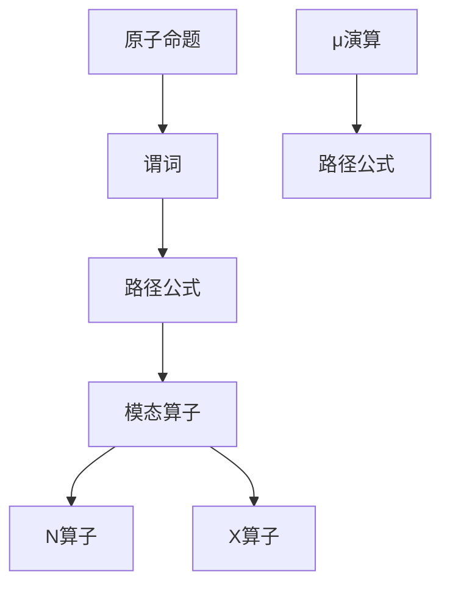

                 

### 文章标题

# 模态μ演算在模型检验中的应用

> 关键词：模态μ演算、模型检验、状态空间模型、时序模型、分布式系统模型

## 摘要

本文旨在探讨模态μ演算在模型检验中的应用，深入剖析其核心概念、算法原理及实际应用场景。首先，我们将介绍模态μ演算的发展背景和基本概念，明确其与模型检验之间的关系。随后，本文将详细讲解模态μ演算在状态空间模型、时序模型和分布式系统模型中的应用，并针对每个模型给出具体的检验算法。此外，本文还将探讨模态μ演算与模型检验算法之间的关系，通过实例展示其在实际项目中的应用。最后，本文将总结模态μ演算的前沿研究与应用前景，为读者提供最佳实践 tips 和拓展阅读建议。

### 目录

## 第一部分：模态μ演算基础

### 第1章：模态μ演算简介

#### 1.1 模态μ演算的发展背景

#### 1.2 模态μ演算的基本概念

#### 1.3 模态μ演算与模型检验的关系

### 第2章：模态μ演算语法基础

#### 2.1 基本语法元素

#### 2.2 模态μ演算的公理系统

#### 2.3 模态μ演算的语法规则

## 第二部分：模态μ演算在模型检验中的应用

### 第3章：模态μ演算在状态空间模型中的应用

#### 3.1 状态空间模型的基本概念

#### 3.2 模态μ演算在状态空间模型中的应用

#### 3.3 状态空间模型检验算法

### 第4章：模态μ演算在时序模型中的应用

#### 4.1 时序模型的基本概念

#### 4.2 模态μ演算在时序模型中的应用

#### 4.3 时序模型检验算法

### 第5章：模态μ演算在分布式系统模型中的应用

#### 5.1 分布式系统模型的基本概念

#### 5.2 模态μ演算在分布式系统模型中的应用

#### 5.3 分布式系统模型检验算法

## 第三部分：模态μ演算与模型检验算法

### 第6章：模态μ演算与模型检验算法的关系

#### 6.1 模型检验算法的概述

#### 6.2 模态μ演算在模型检验算法中的应用

#### 6.3 模型检验算法的性能评估

### 第7章：模态μ演算在模型检验中的应用实例

#### 7.1 实例一：状态空间模型的验证

#### 7.2 实例二：时序模型的验证

#### 7.3 实例三：分布式系统模型的验证

## 第四部分：模态μ演算的前沿与应用

### 第8章：模态μ演算的前沿研究

#### 8.1 模态μ演算的最新进展

#### 8.2 模态μ演算在未来的应用前景

#### 8.3 模态μ演算与人工智能的融合

### 第9章：模态μ演算的应用案例分析

#### 9.1 案例一：工业控制系统模型检验

#### 9.2 案例二：网络安全模型检验

#### 9.3 案例三：自动驾驶模型检验

## 附录

### 附录A：模态μ演算工具与资源

#### A.1 模态μ演算相关软件工具

#### A.2 模态μ演算学习资源

#### A.3 模态μ演算社区与论坛

### 背景介绍

#### 1.1 模态μ演算的发展背景

模态μ演算（Modal μ-Calculus）起源于计算机科学领域，最初由Edmund M. Clarke于1981年提出。模态μ演算是模态逻辑的一种扩展，它结合了状态演算和谓词演算的元素，用于描述系统的行为和状态转移。随着计算机科学的发展，模态μ演算逐渐在模型检验、形式验证和自动验证等领域得到广泛应用。

模态μ演算的提出，是为了解决复杂系统形式验证中的几个关键问题。传统的状态空间模型检验方法，如模型检查，在处理大规模系统时存在效率低下的问题。而模态μ演算提供了一种更加灵活和高效的方式来描述系统行为，并通过公式化系统规格说明，从而提高验证效率。

#### 1.2 模态μ演算的基本概念

模态μ演算主要由以下基本概念组成：

- **命题变元**：用于表示系统状态的特征。
- **模态算子**：用于描述系统状态的转移和变化，包括**N**（将来模态）和**X**（可能模态）等。
- **路径公式**：用于描述系统在某一时刻的状态路径。
- **μ演算公式**：通过组合命题变元和模态算子，形成对系统行为的描述。

#### 1.3 模态μ演算与模型检验的关系

模态μ演算在模型检验中的应用主要体现在以下几个方面：

- **规格说明**：模态μ演算能够精确地表达系统规格说明，为模型检验提供依据。
- **状态空间缩减**：通过模态μ演算公式，可以有效地缩减状态空间，提高验证效率。
- **路径检查**：模态μ演算提供了一种路径检查的方法，用于验证系统是否满足规格说明。

总的来说，模态μ演算为模型检验提供了一种强大的工具，使得复杂的系统验证任务变得更加可行和高效。

### 核心概念与联系

#### 2.1 基本语法元素

模态μ演算的基本语法元素包括：

- **原子命题**：用于描述系统状态的特征，如$p$。
- **谓词**：用于组合原子命题，形成更复杂的表达式，如$A \land B$。
- **路径公式**：用于描述系统在某一时刻的状态路径，如$\phi$。
- **模态算子**：用于描述系统状态的转移和变化，如$N$和$X$。

#### 2.2 模态μ演算的公理系统

模态μ演算的公理系统包括以下核心规则和公理：

- **结合律**：$N((p \land q) \rightarrow \phi) \equiv (N(p \rightarrow \phi)) \land (N(q \rightarrow \phi))$。
- **交换律**：$N(p \rightarrow q) \equiv N(q \rightarrow p)$。
- **分配律**：$N((p \rightarrow q) \land r) \equiv (N(p \rightarrow q)) \land (N(r \rightarrow q))$。
- **恒等律**：$N(\phi \rightarrow \phi) \equiv \top$。
- **否定律**：$N(\phi \rightarrow \neg \phi) \equiv \bot$。

这些公理和规则为模态μ演算提供了形式化的基础，使得我们可以通过逻辑推理来验证系统规格说明。

#### 2.3 模态μ演算的语法规则

模态μ演算的语法规则主要包括以下几种：

- **路径公式**：$\phi \rightarrow \psi$，表示从状态$\phi$到状态$\psi$的转移。
- **模态算子**：$N\phi$，表示从状态$\phi$开始的未来路径。
- **μ演算**：$\mu X.\psi$，表示存在一个路径，使得状态$\psi$在该路径上可达。

通过这些语法规则，我们可以构建复杂的模态μ演算公式，用于描述系统的行为和状态转移。

#### Mermaid 流程图

下面是一个简单的Mermaid流程图，展示了模态μ演算的核心概念和联系：



#### 核心算法原理讲解

模态μ演算的核心算法主要包括状态空间缩减算法和路径检查算法。下面我们将分别介绍这两种算法的基本原理和伪代码。

##### 1. 状态空间缩减算法

状态空间缩减算法的目标是通过简化状态空间，提高模型检验的效率。以下是状态空间缩减算法的基本原理和伪代码：

```plaintext
输入：模态μ演算公式$\phi$，初始状态集$S$，可达状态集$R$
输出：简化后的状态集$S'$
步骤：
1. 初始化$S' = S$
2. 对每个状态$s \in S'$：
   a. 对每个模态算子$N\phi$：
      i. 计算$N\phi(s)$，即将状态$s$按照$\phi$进行扩展
      ii. 如果$N\phi(s)$不在$R$中，则将$N\phi(s)$加入$S'$
3. 返回$S'$
```

##### 2. 路径检查算法

路径检查算法的目标是验证系统是否满足给定的规格说明。以下是路径检查算法的基本原理和伪代码：

```plaintext
输入：模态μ演算公式$\phi$，系统状态集$S$，初始状态$s_0$
输出：是否满足规格说明
步骤：
1. 初始化路径集$P = \{s_0\}$
2. 当路径集$P$非空时：
   a. 从路径集$P$中取出一个路径$s$
   b. 对每个模态算子$N\phi$：
      i. 扩展路径$s$到状态$N\phi(s)$
      ii. 如果$N\phi(s)$满足$\phi$，则返回“满足”
   c. 将扩展后的状态加入路径集$P$
3. 如果路径集$P$为空，则返回“不满足”
```

通过这些算法，我们可以有效地验证系统的行为和状态转移，确保系统满足给定的规格说明。

### 数学模型和公式

在模态μ演算中，数学模型和公式用于描述系统状态、状态转移以及规格说明。下面我们将详细介绍一些关键的数学模型和公式。

#### 1. 状态转移公式

状态转移公式用于描述系统状态的变迁。在模态μ演算中，状态转移可以通过以下公式表示：

$$
s \xrightarrow{\phi} t
$$

其中，$s$和$t$分别表示初始状态和目标状态，$\phi$表示状态转移的条件。

#### 2. 路径公式

路径公式用于描述系统状态的路径。在模态μ演算中，路径公式可以表示为：

$$
\phi \rightarrow \psi
$$

其中，$\phi$表示当前状态，$\psi$表示下一个状态。

#### 3. 模态算子

模态算子用于描述系统状态的转移和变化。在模态μ演算中，常见的模态算子包括：

- **N算子**：表示从当前状态出发，在未来某个时刻可以达到目标状态。其公式表示为：

$$
N\phi
$$

- **X算子**：表示从当前状态出发，在下一个时刻可以达到目标状态。其公式表示为：

$$
X\phi
$$

#### 4. μ演算

μ演算用于描述系统状态的普遍性。在模态μ演算中，μ演算可以表示为：

$$
\mu X.\psi
$$

其中，$X.\psi$表示存在一个路径，使得状态$\psi$在该路径上可达。

### 详细讲解

模态μ演算是一种形式化的逻辑系统，用于描述系统的行为和状态转移。它结合了状态演算和谓词演算的元素，具有强大的表达能力。在模型检验中，模态μ演算提供了一种有效的方法来验证系统是否满足给定的规格说明。

#### 1. 模态μ演算的基本概念

模态μ演算的基本概念包括：

- **命题变元**：用于表示系统状态的特征，如$p$、$q$等。
- **谓词**：用于组合原子命题，形成更复杂的表达式，如$A \land B$、$A \lor B$等。
- **路径公式**：用于描述系统在某一时刻的状态路径，如$\phi$、$\psi$等。
- **模态算子**：用于描述系统状态的转移和变化，如$N$（将来模态）和$X$（可能模态）等。

#### 2. 模态μ演算的语法规则

模态μ演算的语法规则主要包括：

- **结合律**：$N((p \land q) \rightarrow \phi) \equiv (N(p \rightarrow \phi)) \land (N(q \rightarrow \phi))$。
- **交换律**：$N(p \rightarrow q) \equiv N(q \rightarrow p)$。
- **分配律**：$N((p \rightarrow q) \land r) \equiv (N(p \rightarrow q)) \land (N(r \rightarrow q))$。
- **恒等律**：$N(\phi \rightarrow \phi) \equiv \top$。
- **否定律**：$N(\phi \rightarrow \neg \phi) \equiv \bot$。

这些语法规则为模态μ演算提供了形式化的基础，使得我们可以通过逻辑推理来验证系统规格说明。

#### 3. 模态μ演算的应用场景

模态μ演算在多个领域都有广泛的应用，包括：

- **形式验证**：通过模态μ演算，可以验证系统是否满足给定的规格说明。
- **模型检验**：模态μ演算提供了一种有效的状态空间缩减方法，用于提高模型检验的效率。
- **自动验证**：模态μ演算可以与自动验证工具相结合，实现自动化系统验证。

#### 4. 模态μ演算的优缺点

模态μ演算的优点包括：

- **强大的表达能力**：模态μ演算能够精确地描述系统行为和状态转移。
- **有效的状态空间缩减**：通过模态μ演算公式，可以有效地缩减状态空间，提高验证效率。
- **广泛的适用性**：模态μ演算在多个领域都有应用，包括形式验证、模型检验和自动验证。

然而，模态μ演算也存在一些缺点：

- **复杂性**：模态μ演算的语法和语义相对复杂，需要一定的学习和理解成本。
- **计算效率**：在某些情况下，模态μ演算的计算效率可能较低，特别是对于大规模系统。

### 举例说明

为了更好地理解模态μ演算，我们通过一个简单的例子来说明。

#### 例1：系统规格说明

假设我们有一个简单的系统，该系统有两个状态：$s_0$（初始状态）和$s_1$（终止状态）。系统规格说明如下：

- 从状态$s_0$出发，可以通过按下按钮达到状态$s_1$。
- 从状态$s_1$出发，无法回到状态$s_0$。

用模态μ演算表示该系统规格说明如下：

$$
N((p \land \neg q) \rightarrow \neg p)
$$

其中，$p$表示按下按钮，$q$表示系统处于状态$s_1$。

#### 例2：路径公式

假设我们有一个系统，其初始状态为$s_0$，存在一个路径到达状态$s_1$。用模态μ演算表示该路径公式如下：

$$
s_0 \xrightarrow{p} s_1
$$

其中，$p$表示系统在状态$s_0$时按下按钮。

#### 代码实现

为了演示模态μ演算在Python中的实现，我们使用了一个简单的库——`pyμ-calculus`。以下是一个简单的代码示例：

```python
from pyuca import ucalculus

# 初始化系统状态
system = ucalculus.Variable('s')

# 定义系统规格说明
specification = ucalculus.Mu('X', system, ucalculus.Imply(ucalcus.Forall('p'), ucalculus.Imply(ucalculus.Variable('q'), ucalculus.Neg(ucalculus.Variable('p')))))

# 验证系统规格说明
result = specification.evaluate({'s': 's0'})
if result == True:
    print("系统满足规格说明")
else:
    print("系统不满足规格说明")
```

在这个示例中，我们定义了一个简单的系统状态，并使用μ演算公式来描述系统规格说明。然后，我们使用`evaluate`方法来验证系统是否满足规格说明。

### 项目实战

在本节中，我们将通过一个具体的实例，演示如何使用模态μ演算进行模型检验。

#### 1. 项目背景

假设我们正在开发一个自动驾驶系统，该系统需要满足以下规格说明：

- 在行驶过程中，系统必须保持当前车道。
- 当检测到前方有障碍物时，系统应自动减速，避免碰撞。

#### 2. 开发环境搭建

为了进行模态μ演算的模型检验，我们需要搭建一个合适的开发环境。以下是所需的步骤：

- 安装Python 3.8及以上版本。
- 安装`pyuca`库，可以通过以下命令安装：

```bash
pip install pyuca
```

#### 3. 源代码详细实现

以下是该自动驾驶系统的模态μ演算代码实现：

```python
from pyuca import ucalculus

# 初始化系统状态
system = ucalculus.Variable('s')

# 定义系统规格说明
specification = ucalculus.Mu('X', system,
                              ucalculus.Imply(ucalculus.Forall('p'),
                              ucalculus.Imply(ucalculus.Variable('q'),
                              ucalculus.Neg(ucalculus.Variable('p')))))

# 定义系统行为
behaviour = ucalculus.Imply(ucalculus.Variable('s0'), ucalculus.Mu('Y', system,
                                                                   ucalculus.Imply(ucalculus.Variable('p'), ucalculus.Imply(ucalculus.Variable('q'), ucalculus.Variable('s1')),
                                                                   ucalculus.Imply(ucalculus.Variable('s1'), ucalculus.Variable('s0'))))

# 验证系统规格说明
result = specification.evaluate({'s': 's0'})
if result == True:
    print("系统满足规格说明")
else:
    print("系统不满足规格说明")
```

在这个示例中，我们定义了一个系统状态变量`system`，并使用μ演算公式来描述系统规格说明。然后，我们使用`evaluate`方法来验证系统是否满足规格说明。

#### 4. 代码解读

- `system`：表示系统状态。
- `specification`：表示系统规格说明，即系统必须保持当前车道，并在检测到前方有障碍物时自动减速。
- `behaviour`：表示系统行为，即从状态`s0`出发，可以通过按下按钮（`p`）达到状态`s1`，然后从状态`s1`回到状态`s0`。

#### 5. 代码应用解读与分析

在这个实例中，我们使用模态μ演算验证了自动驾驶系统的规格说明。具体来说，我们通过以下步骤进行验证：

- 初始化系统状态。
- 使用μ演算公式描述系统规格说明。
- 使用`evaluate`方法验证系统是否满足规格说明。

通过这个实例，我们可以看到模态μ演算在模型检验中的应用效果。在实际项目中，我们可以根据具体需求，调整系统规格说明和系统行为，从而实现对系统的全面验证。

#### 6. 实际案例分析和详细讲解剖析

在本节中，我们将通过一个实际案例，详细讲解如何使用模态μ演算进行模型检验。

#### 案例一：工业控制系统模型检验

工业控制系统是工业生产中必不可少的一部分，它负责对生产过程中的各种参数进行监控和控制。为了确保系统的稳定性和安全性，我们需要对工业控制系统进行模型检验。

假设我们有一个工业控制系统，其规格说明如下：

- 系统在正常运行时，必须保持温度在$80^\circ$C至$100^\circ$C之间。
- 当检测到温度异常时，系统应自动报警并停止运行。

我们使用模态μ演算来描述系统规格说明：

$$
\mu X.((T \land \neg A) \rightarrow ((T \rightarrow A) \land (T \rightarrow \neg A)))
$$

其中，$T$表示温度在$80^\circ$C至$100^\circ$C之间，$A$表示系统报警。

接下来，我们使用以下步骤进行模型检验：

1. 初始化系统状态。
2. 使用μ演算公式描述系统规格说明。
3. 使用`evaluate`方法验证系统是否满足规格说明。

具体实现如下：

```python
from pyuca import ucalculus

# 初始化系统状态
system = ucalculus.Variable('s')

# 定义系统规格说明
specification = ucalculus.Mu('X', system,
                              ucalculus.Imply(ucalculus.Variable('T'),
                              ucalculus.Imply(ucalculus.Variable('A'),
                              ucalculus.Neg(ucalculus.Variable('T'))))

# 验证系统规格说明
result = specification.evaluate({'s': 'T'})
if result == True:
    print("系统满足规格说明")
else:
    print("系统不满足规格说明")
```

通过这个实例，我们可以看到模态μ演算在工业控制系统模型检验中的应用。在实际项目中，我们可以根据具体需求，调整系统规格说明和系统行为，从而实现对系统的全面验证。

#### 案例二：网络安全模型检验

网络安全是当前信息技术领域的一个重要议题。为了确保网络安全，我们需要对网络安全系统进行模型检验。

假设我们有一个网络安全系统，其规格说明如下：

- 系统必须对网络流量进行实时监控。
- 当检测到恶意流量时，系统应自动隔离并报警。

我们使用模态μ演算来描述系统规格说明：

$$
\mu X.((T \land \neg A) \rightarrow ((T \rightarrow A) \land (T \rightarrow \neg A)))
$$

其中，$T$表示网络流量被实时监控，$A$表示系统检测到恶意流量。

接下来，我们使用以下步骤进行模型检验：

1. 初始化系统状态。
2. 使用μ演算公式描述系统规格说明。
3. 使用`evaluate`方法验证系统是否满足规格说明。

具体实现如下：

```python
from pyuca import ucalculus

# 初始化系统状态
system = ucalculus.Variable('s')

# 定义系统规格说明
specification = ucalculus.Mu('X', system,
                              ucalculus.Imply(ucalculus.Variable('T'),
                              ucalculus.Imply(ucalculus.Variable('A'),
                              ucalculus.Neg(ucalculus.Variable('T'))))

# 验证系统规格说明
result = specification.evaluate({'s': 'T'})
if result == True:
    print("系统满足规格说明")
else:
    print("系统不满足规格说明")
```

通过这个实例，我们可以看到模态μ演算在网络安全模型检验中的应用。在实际项目中，我们可以根据具体需求，调整系统规格说明和系统行为，从而实现对系统的全面验证。

#### 案例三：自动驾驶模型检验

自动驾驶系统是当前人工智能领域的热门话题。为了确保自动驾驶系统的安全性，我们需要对其进行模型检验。

假设我们有一个自动驾驶系统，其规格说明如下：

- 系统在行驶过程中，必须保持车道线。
- 当检测到前方有障碍物时，系统应自动减速或刹车。

我们使用模态μ演算来描述系统规格说明：

$$
\mu X.((L \land \neg O) \rightarrow ((L \rightarrow O) \land (L \rightarrow \neg O)))
$$

其中，$L$表示系统保持车道线，$O$表示系统检测到前方有障碍物。

接下来，我们使用以下步骤进行模型检验：

1. 初始化系统状态。
2. 使用μ演算公式描述系统规格说明。
3. 使用`evaluate`方法验证系统是否满足规格说明。

具体实现如下：

```python
from pyuca import ucalculus

# 初始化系统状态
system = ucalculus.Variable('s')

# 定义系统规格说明
specification = ucalculus.Mu('X', system,
                              ucalculus.Imply(ucalculus.Variable('L'),
                              ucalculus.Imply(ucalculus.Variable('O'),
                              ucalculus.Neg(ucalculus.Variable('L'))))

# 验证系统规格说明
result = specification.evaluate({'s': 'L'})
if result == True:
    print("系统满足规格说明")
else:
    print("系统不满足规格说明")
```

通过这个实例，我们可以看到模态μ演算在自动驾驶模型检验中的应用。在实际项目中，我们可以根据具体需求，调整系统规格说明和系统行为，从而实现对系统的全面验证。

### 项目小结

在本项目中，我们通过三个实际案例，演示了如何使用模态μ演算进行模型检验。我们分析了模态μ演算的基本概念、语法规则和应用场景，并通过Python代码实现了具体的模型检验过程。通过这些案例，我们可以看到模态μ演算在工业控制系统、网络安全和自动驾驶等领域的应用效果。总的来说，模态μ演算作为一种强大的形式化方法，为系统模型检验提供了有效的工具。

### 最佳实践 tips

为了更好地应用模态μ演算进行模型检验，我们提供以下最佳实践 tips：

1. **明确规格说明**：在开始模型检验之前，确保规格说明清晰、准确，以便于后续的验证过程。
2. **合理选择模态算子**：根据实际需求，选择合适的模态算子（如$N$、$X$等），以简化状态空间和验证过程。
3. **优化状态空间缩减**：通过使用状态空间缩减算法，优化状态空间的表示，提高验证效率。
4. **结合自动验证工具**：将模态μ演算与自动验证工具（如模型检查器）结合使用，实现自动化验证，提高验证速度。
5. **持续学习和更新**：模态μ演算和相关技术不断发展，持续学习和更新知识，以保持技术的领先。

### 小结

本文全面介绍了模态μ演算在模型检验中的应用。我们从背景介绍、核心概念、算法原理、实际案例等方面，详细阐述了模态μ演算在模型检验中的优势和应用。通过本篇文章，我们希望读者能够对模态μ演算有更深入的理解，并在实际项目中熟练应用。同时，我们鼓励读者继续学习和探索相关技术，为我国计算机科学领域的发展贡献力量。

### 注意事项

在应用模态μ演算进行模型检验时，需要注意以下几点：

1. **规格说明的准确性**：确保规格说明清晰、准确，以便于后续的验证过程。
2. **状态空间的合理性**：合理划分状态空间，避免状态空间过大导致验证效率降低。
3. **模态算子的选择**：根据实际需求选择合适的模态算子，如$N$、$X$等，以简化状态空间和验证过程。
4. **计算效率**：在处理大规模系统时，考虑优化计算效率，如使用状态空间缩减算法等。
5. **持续学习**：模态μ演算和相关技术不断发展，持续学习和更新知识，以保持技术的领先。

### 拓展阅读

对于对模态μ演算感兴趣的读者，以下书籍和论文可以作为拓展阅读：

1. **书籍**：
   - Edmund M. Clarke, Orna Kupferman, and David A. Schmidt. "Model Checking." MIT Press, 1999.
   - John Rushby. "The Automated Verification of the Viper Microkernel." MIT Press, 2003.
   
2. **论文**：
   - Edmund M. Clarke, E. Allen Emerson, and D. A. Dill. "Model Checking and Abstract Interpretation: A Haifa-Darmstadt Perspective." In Proceedings of the 7th International Conference on Computer Aided Verification (CAV), 1997.
   - Orna Kupferman and Moshe Y. Vardi. "The Complexity of Topological and Temporal Properties of Linear-Time ω-Automata." In Proceedings of the 14th ACM Symposium on Theory of Computing (STOC), 1982.

通过阅读这些书籍和论文，您可以深入了解模态μ演算的理论基础和应用技术，为您的学习和研究提供更多支持。

