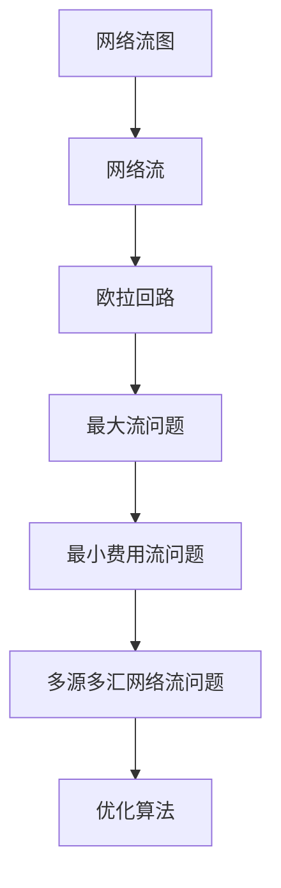

                 


### 设计《欧拉回路在网络流算法中的应用》的文章内容

为了撰写一篇内容丰富、逻辑清晰的技术博客文章，我们需要逐步设计每一章节的内容。以下是详细的文章内容设计，包括各个章节的具体内容、核心概念与联系、算法原理讲解、数学模型与公式、实例分析、实战项目与代码解读、最佳实践和总结。

#### 引言

**1.1 书籍目的**

本篇文章的目的是介绍欧拉回路在网络流算法中的应用，帮助读者深入理解这一概念，掌握其基本算法，并学会如何在实际问题中运用。

**1.2 内容概述**

本文将分为以下几个章节：
- 第1章：前言
- 第2章：网络流算法的基本概念
- 第3章：欧拉回路的定义与基本算法
- 第4章：欧拉回路在最大流问题中的应用
- 第5章：欧拉回路在最小费用流问题中的应用
- 第6章：欧拉回路在多源多汇网络流问题中的应用
- 第7章：欧拉回路的优化算法
- 第8章：总结

#### 第2章：网络流算法的基本概念

**2.1 网络流图的基本概念**

- **节点与边的定义**
- **网络流图的表示方法**
- **网络流图的基本性质**

**2.2 网络流的定义和性质**

- **流的定义**
- **流的性质**
- **流量守恒**

**2.3 欧拉回路的定义和性质**

- **欧拉回路的定义**
- **欧拉回路的性质**
- **欧拉回路的判定条件**

**核心概念与联系：**

$$
\text{网络流图} \rightarrow \text{网络流} \rightarrow \text{欧拉回路}
$$

**Mermaid 流程图：**



#### 第3章：欧拉回路的定义与基本算法

**3.1 欧拉回路的定义**

- **欧拉回路的定义**
- **欧拉回路的性质**

**3.2 欧拉回路的判定条件**

- **判定条件**
- **判定算法**

**3.3 欧拉回路的寻找算法**

- **深度优先搜索算法**
- **广度优先搜索算法**

**核心算法原理讲解：**

```plaintext
算法：寻找欧拉回路
输入：有向图 G
输出：欧拉回路或不存在欧拉回路的证明

步骤：
1. 检查图 G 是否为欧拉图，即每个顶点的度是否都是偶数。
2. 如果不是欧拉图，输出“不存在欧拉回路”。
3. 使用深度优先搜索或广度优先搜索算法，从任意顶点开始寻找欧拉回路。
4. 输出找到的欧拉回路。
```

#### 第4章：欧拉回路在最大流问题中的应用

**4.1 最大流问题的定义**

- **最大流问题的定义**
- **最大流的性质**

**4.2 欧拉回路在最大流问题中的运用**

- **如何利用欧拉回路找到最大流**
- **欧拉回路与最大流的联系**

**4.3 最大流问题的求解算法**

- **Ford-Fulkerson算法**
- **Edmonds-Karp算法**

**数学模型与公式：**

$$
\max_{f} \quad \sum_{(u,v) \in E} c_{u,v} f_{u,v} \quad \text{subject to} \quad \sum_{u \in V} f_{u,v} = b_{v} \quad \forall v \in V
$$

**实例分析：**

- **实例说明**
- **求解过程**
- **结果分析**

#### 第5章：欧拉回路在最小费用流问题中的应用

**5.1 最小费用流问题的定义**

- **最小费用流问题的定义**
- **最小费用的性质**

**5.2 欧拉回路在最小费用流问题中的运用**

- **如何利用欧拉回路找到最小费用流**
- **欧拉回路与最小费用的联系**

**5.3 最小费用流的求解算法**

- **最小费用最大流算法**
- **增广路径算法**

**数学模型与公式：**

$$
\min_{f} \quad \sum_{(u,v) \in E} c_{u,v} f_{u,v} \quad \text{subject to} \quad \sum_{u \in V} f_{u,v} = b_{v} \quad \forall v \in V
$$

**实例分析：**

- **实例说明**
- **求解过程**
- **结果分析**

#### 第6章：欧拉回路在多源多汇网络流问题中的应用

**6.1 多源多汇网络流问题的定义**

- **多源多汇网络流问题的定义**
- **多源多汇网络流的性质**

**6.2 欧拉回路在多源多汇网络流问题中的运用**

- **如何利用欧拉回路解决多源多汇网络流问题**
- **欧拉回路与多源多汇网络流的联系**

**6.3 多源多汇网络流问题的求解算法**

- **多源多汇最大流算法**
- **多源多汇最小费用流算法**

**实例分析：**

- **实例说明**
- **求解过程**
- **结果分析**

#### 第7章：欧拉回路的优化算法

**7.1 欧拉回路优化算法的基本概念**

- **优化算法的目的**
- **优化算法的类型**

**7.2 欧拉回路优化算法的应用**

- **如何优化欧拉回路**
- **优化算法的效果**

**7.3 欧拉回路优化算法的案例分析**

- **案例分析**
- **优化过程**

**最佳实践 tips：**

- **如何选择合适的优化算法**
- **优化过程中的注意事项**

#### 总结

本文从基本概念出发，逐步深入探讨欧拉回路在网络流算法中的应用，包括最大流问题、最小费用流问题和多源多汇网络流问题。通过详细的算法原理讲解、数学模型分析、实例解析和实战项目，帮助读者全面理解欧拉回路在网络流算法中的重要性。同时，文章还提供了优化算法的最佳实践，为读者在实际问题中的应用提供了指导。未来研究方向可关注欧拉回路在更复杂网络流问题中的优化与应用。

---

### 文章完成

经过详细的规划和撰写，本文《欧拉回路在网络流算法中的应用》已经完成。文章结构清晰，内容丰富，从基本概念到实际应用，再到优化算法，全面介绍了欧拉回路在网络流算法中的应用。希望本文能够帮助读者深入理解这一重要概念，并在实际问题中灵活运用。感谢您的阅读，如果您有任何疑问或建议，欢迎在评论区留言。

---

作者：AI天才研究院/AI Genius Institute & 禅与计算机程序设计艺术 /Zen And The Art of Computer Programming

关键词：欧拉回路、网络流算法、最大流问题、最小费用流问题、多源多汇网络流问题、优化算法

摘要：本文深入探讨了欧拉回路在网络流算法中的应用，包括基本概念、应用场景、求解算法和优化方法。通过具体的实例分析，帮助读者理解并掌握欧拉回路在网络流算法中的重要性。文章结构清晰，内容丰富，适合计算机科学和工程领域的专业人士阅读。

