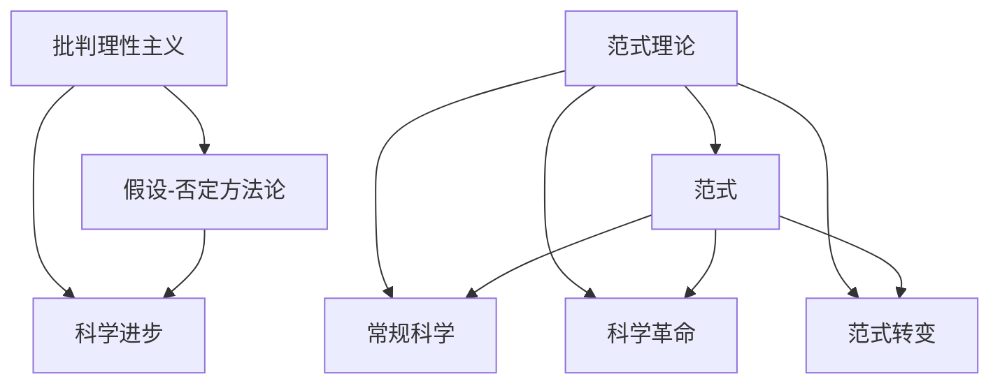

                 

### 引言

#### 科学哲学的背景与发展

科学哲学是研究科学的基本概念、方法和认识论的学科。它探讨科学知识如何产生、如何验证以及科学理论在哲学上的意义。科学哲学的历史可以追溯到古希腊时期，但作为一个独立的学科，它起源于20世纪。

科学哲学的重要分支包括逻辑实证主义、批判理性主义、历史主义和建构主义。这些流派试图回答科学知识的本质、科学方法的有效性以及科学实践中的伦理问题。

#### 波普尔与库恩的科学哲学思想

卡尔·波普尔（Karl Popper）和托马斯·库恩（Thomas Kuhn）是20世纪最重要的科学哲学家之一。他们的理论对科学哲学产生了深远的影响。

波普尔提出了批判理性主义，强调科学理论的可证伪性。他认为，科学理论不是通过证实而是通过证伪来得到验证。科学进步是通过不断提出新的假设和实验来反驳现有理论实现的。

库恩则提出了范式理论，认为科学进步是通过科学共同体的共识和范式转换实现的。他指出，科学知识不是客观的，而是社会建构的，并且科学革命会导致旧范式被新范式取代。

### 范式之争的背景与影响

波普尔与库恩的科学哲学思想之间存在显著差异，这引发了一场关于科学知识本质和科学进步方式的争论，被称为“范式之争”。这场争论不仅影响了科学哲学，还对科学实践和科学教育产生了深远的影响。

波普尔的批判理性主义强调科学理论的开放性和可证伪性，认为科学应该不断挑战现有的理论，以推动知识的进步。库恩的范式理论则强调科学共同体的作用和科学知识的动态性，认为科学革命是科学进步的关键。

这场争论的背景在于对科学知识的本质和科学方法的有效性的不同理解。波普尔认为科学知识是客观的，而库恩则认为科学知识是主观的，社会建构的。

#### 文章关键词

- 科学哲学
- 波普尔
- 库恩
- 批判理性主义
- 范式理论
- 科学进步
- 知识本质

#### 文章摘要

本文探讨了20世纪两位重要科学哲学家卡尔·波普尔和托马斯·库恩的科学哲学思想，以及他们之间的范式之争。文章首先介绍了科学哲学的背景和发展，然后详细阐述了波普尔的批判理性主义和库恩的范式理论。最后，文章分析了范式之争的背景和影响，并讨论了其对科学实践和科学教育的启示。本文旨在为读者提供一个深入理解科学哲学和科学知识本质的窗口。# 

#### 科学哲学的背景与发展

科学哲学作为哲学的一个重要分支，其起源可以追溯到古希腊时期。古希腊哲学家如亚里士多德和柏拉图开始思考自然现象的本质，并尝试通过逻辑和理性的方法解释世界。然而，作为一门独立学科，科学哲学的兴起主要是在20世纪，随着科学技术的飞速发展和哲学思考的深化。

科学哲学的核心议题包括科学知识的本质、科学方法的有效性、科学理论的验证与反驳以及科学实践中的伦理问题。科学哲学不仅关注科学理论本身，还探讨科学在人类社会中的角色和影响。

20世纪初，逻辑实证主义成为科学哲学的主流流派。逻辑实证主义者强调科学理论的可证伪性和经验基础。他们认为，只有通过可观察的实证数据，科学理论才能得到验证。这一流派的主要代表人物包括卡尔·波普尔（Karl Popper）和莫里兹·石里克（Moritz Schlick）。

然而，逻辑实证主义并未解决所有科学哲学问题。在20世纪中叶，批判理性主义和历史主义等流派开始崭露头角。波普尔的批判理性主义强调科学理论的可证伪性和开放性，主张通过不断提出新假设和实验来挑战现有理论。而库恩的范式理论则提出了科学知识的社会建构观点，认为科学进步是通过科学共同体的共识和范式转换实现的。

#### 波普尔与库恩的科学哲学思想

卡尔·波普尔（Karl Popper，1902-1994）是20世纪最重要的科学哲学家之一，他的批判理性主义理论对科学哲学产生了深远的影响。波普尔认为，科学知识是通过假设-否定方法论获得的。他提出，科学理论必须具备可证伪性，即可以被实验或观察证伪。如果一个理论不能被证伪，那么它就不是一个科学理论。

波普尔的假设-否定方法论包括以下步骤：

1. **提出假设**：科学家根据已有的知识和观察，提出一个假设。
2. **设计实验**：科学家设计实验来验证这个假设。
3. **实验结果**：如果实验结果与假设相符，那么假设暂时成立。
4. **证伪尝试**：科学家尝试找到证据来反驳这个假设。
5. **理论修正**：如果假设被证伪，科学家会修正或放弃这个假设，并提出新的假设。

波普尔强调，科学进步不是通过证实而是通过证伪实现的。他的理论挑战了逻辑实证主义的验证主义观点，提出科学知识是通过不断的假设和证伪过程不断发展的。

托马斯·库恩（Thomas Kuhn，1922-1996）则提出了范式理论，这是他对科学哲学的另一个重要贡献。库恩认为，科学知识是在特定范式下产生的。范式是一种主导性的科学理论或信念体系，它决定了科学共同体的研究方向和方法。

库恩的范式理论包括以下几个关键概念：

1. **范式**：范式是一种主导性的科学理论或信念体系，它决定了科学共同体的研究方向和方法。
2. **常规科学**：在范式指导下，科学家进行常规的研究，解决特定领域内的具体问题。
3. **科学革命**：当新的证据或理论挑战旧范式时，科学共同体可能会经历科学革命，导致范式转换。
4. **范式转变**：范式转变是一个逐步的过程，包括范式危机、范式选择和范式重构。

库恩指出，科学知识不是客观的，而是社会建构的。科学进步不是线性的，而是通过范式转换实现的。这一理论挑战了波普尔的线性科学进步观，提出了科学知识发展的复杂性。

#### 核心概念与联系

波普尔的批判理性主义和库恩的范式理论虽然存在显著差异，但它们在科学哲学中都有着重要的地位。波普尔的批判理性主义强调科学理论的开放性和可证伪性，认为科学进步是通过不断提出新假设和实验来挑战现有理论实现的。而库恩的范式理论则强调科学知识的社会建构性和动态性，认为科学进步是通过科学共同体的共识和范式转换实现的。

两者的核心概念和联系可以用以下Mermaid流程图来表示：

在这个流程图中，批判理性主义（A）通过假设-否定方法论（B）推动科学进步（C），而范式理论（D）则通过范式（E）、常规科学（F）、科学革命（G）和范式转变（H）来实现科学知识的动态发展。

### 设计《波普尔与库恩：科学哲学的范式之争》目录大纲

为了设计《波普尔与库恩：科学哲学的范式之争》的目录大纲，我们首先需要明确以下几点：

#### 核心概念与联系

这本书的核心概念是波普尔和库恩的科学哲学思想，以及他们的范式之争。因此，目录大纲需要涵盖两位哲学家的基本理论，以及他们之间的争论。

#### 核心算法原理讲解

虽然这是一本哲学书籍，但我们需要考虑如何以更直观的方式解释他们的理论。我们可以使用伪代码、流程图等来帮助读者理解。

#### 数学模型和数学公式

科学哲学虽然不直接涉及数学模型，但我们仍可以考虑介绍一些相关的逻辑或哲学概念，比如概率论或形式逻辑等。

#### 项目实战

由于这是一本哲学书籍，项目实战可能不像计算机技术书籍那样具体。但我们可以考虑介绍一些实际案例，如某个科学领域的哲学争议或某个哲学思想的实际应用。

#### 目录大纲

接下来，我们可以开始设计目录大纲。大纲至少需要7章，包括：

- 引言
- 波普尔：科学哲学的批判理性主义
- 库恩：科学哲学的范式理论
- 波普尔与库恩的科学哲学比较
- 范式之争的案例分析
- 科学哲学的未来发展趋势
- 结论

#### 1. 引言

**1.1 书籍背景与目的**

- 介绍书籍的主题和目的
- 引导读者理解科学哲学的重要性

**1.2 波普尔与库恩的生平简介**

- 简述波普尔和库恩的生平和学术成就
- 强调他们的科学哲学贡献

**1.3 科学哲学的重要性**

- 讨论科学哲学对科学知识、方法和社会影响的贡献
- 引入范式之争的背景和意义

**1.4 范式之争的背景与影响**

- 介绍范式之争的历史背景
- 分析范式之争对科学哲学和科学实践的深远影响

#### 2. 波普尔：科学哲学的批判理性主义

**2.1 批判理性主义的基本概念**

- 定义批判理性主义
- 解释假设-否定方法论

**2.2 波普尔的科学哲学理论**

- 详细阐述波普尔的科学哲学思想
- 分析波普尔对科学知识、方法和进步的理解

**2.3 波普尔与科学哲学的关系**

- 探讨波普尔的理论对科学哲学发展的影响
- 分析波普尔的理论在当代科学哲学中的地位

#### 3. 库恩：科学哲学的范式理论

**3.1 范式的概念与特征**

- 定义范式
- 分析范式的特征和功能

**3.2 库恩的科学哲学理论**

- 详细阐述库恩的范式理论
- 分析库恩对科学知识、方法和进步的理解

**3.3 库恩与科学哲学的关系**

- 探讨库恩的理论对科学哲学发展的影响
- 分析库恩的理论在当代科学哲学中的地位

#### 4. 波普尔与库恩的科学哲学比较

**4.1 批判理性主义与范式理论的对比**

- 分析波普尔的批判理性主义和库恩的范式理论的主要差异
- 探讨这两种理论在科学哲学中的地位和影响

**4.2 范式之争的案例分析**

- 介绍一些范式之争的具体案例
- 分析这些案例对科学哲学的影响

#### 5. 范式之争的案例分析

**5.1 地球科学中的范式转变**

- 分析地球科学中的范式转变案例
- 探讨范式转变对地球科学的影响

**5.2 生物学中的进化论争议**

- 分析生物学中的进化论争议案例
- 探讨进化论争议对生物学的影响

**5.3 物理学中的相对论与量子力学之争**

- 分析物理学中的相对论与量子力学之争案例
- 探讨相对论与量子力学之争对物理学的影响

#### 6. 科学哲学的未来发展趋势

**6.1 当代科学哲学的主要趋势**

- 分析当代科学哲学的主要趋势
- 探讨这些趋势对科学哲学未来发展的潜在影响

**6.2 科学哲学的应用与影响**

- 讨论科学哲学在科学实践、科学政策和科学教育中的应用
- 分析科学哲学对社会和科学的整体影响

#### 7. 结论

**7.1 波普尔与库恩的贡献与影响**

- 总结波普尔和库恩在科学哲学领域的贡献
- 分析他们的理论对当代科学哲学和科学实践的影响

**7.2 范式之争的意义与启示**

- 探讨范式之争对科学哲学和科学知识的启示
- 分析范式之争对未来科学发展的潜在影响

**7.3 科学哲学的未来展望**

- 展望科学哲学的未来发展趋势
- 提出对科学哲学未来发展的建议和展望

---

根据上述目录大纲，我们可以继续细化每个章节的内容，确保符合要求。# 

## 波普尔：科学哲学的批判理性主义

卡尔·波普尔（Karl Popper）是20世纪最重要的科学哲学家之一，他的批判理性主义理论对科学哲学产生了深远的影响。批判理性主义是一种反对逻辑实证主义的哲学流派，强调科学理论的可证伪性和开放性。波普尔的理论不仅挑战了逻辑实证主义的验证主义观点，还为科学进步提供了一种新的理解框架。

### 2.1 批判理性主义的基本概念

批判理性主义的核心概念是假设-否定方法论（Hypothesis and Refutation Methodology）。这种方法论认为，科学理论的验证不是通过证实而是通过证伪实现的。具体来说，假设-否定方法论包括以下步骤：

1. **提出假设**：科学家根据已有的知识和观察，提出一个假设。
2. **设计实验**：科学家设计实验来验证这个假设。
3. **实验结果**：如果实验结果与假设相符，那么假设暂时成立。
4. **证伪尝试**：科学家尝试找到证据来反驳这个假设。
5. **理论修正**：如果假设被证伪，科学家会修正或放弃这个假设，并提出新的假设。

波普尔认为，科学理论的可证伪性是其科学性的标志。一个理论如果不能被证伪，那么它就不具备科学价值。因此，科学理论的进步是通过不断的假设和证伪过程实现的。

### 2.2 波普尔的科学哲学理论

波普尔的科学哲学理论主要包括以下几个方面：

#### 科学理论的层次结构

波普尔将科学理论分为三个层次：科学定律、科学理论和科学假设。科学定律是最基本的科学规律，它们描述了自然界的基本规律。科学理论则是对科学定律的解释和应用，而科学假设则是科学家基于已有知识提出的猜想。

#### 科学方法论：问题解决与理论选择

波普尔提出了问题解决和理论选择的方法论。他认为，科学方法不是归纳法，而是假设-否定方法论。科学进步是通过不断提出新的假设和实验来反驳现有理论实现的。在问题解决过程中，科学家需要不断提出新的假设，并通过实验来验证或证伪这些假设。

在理论选择方面，波普尔强调可证伪性原则。他认为，一个科学理论应该尽可能被证伪，这样才能确保其科学性。科学理论的科学性不在于其被证实，而在于其被证伪的可能性。

#### 科学知识的社会建构

波普尔认为，科学知识是社会建构的。科学知识的产生和传播受到社会、文化和政治因素的影响。科学共同体在科学知识的建构过程中发挥着重要作用。科学共同体的成员通过共同的研究、讨论和批判来验证和传播科学知识。

### 2.3 波普尔与科学哲学的关系

波普尔对科学哲学的贡献在于他提出了批判理性主义这一新的科学方法论，并强调科学理论的可证伪性。他的理论为科学哲学提供了一种新的理解框架，挑战了逻辑实证主义的验证主义观点。

波普尔的理论在当代科学哲学中仍然具有重要地位。他的假设-否定方法论为科学研究提供了一种新的思路，使得科学家能够更加灵活地处理复杂的问题。此外，波普尔对科学知识的社会建构观点也引发了关于科学知识本质的深入讨论。

然而，波普尔的理论也存在一定的局限性。例如，他的理论过于强调理论的证伪性，而忽视了理论的证实价值。此外，他的方法论在处理某些复杂问题时可能显得过于理想化。

总的来说，波普尔的批判理性主义理论为科学哲学提供了重要的理论基础，并对科学实践产生了深远的影响。他的理论不仅挑战了传统科学哲学的观点，还为科学进步提供了一种新的理解框架。# 

## 库恩：科学哲学的范式理论

托马斯·库恩（Thomas Kuhn，1922-1996）是美国科学哲学家，以其范式理论著称，这一理论深刻地影响了科学哲学、科学史和社会学。库恩认为，科学知识的发展并不是一条直线进步的路径，而是通过范式的转换实现的。范式可以被视为一个科学共同体在特定历史时期内共同遵循的理论框架、研究方法和价值观。

### 3.1 范式的概念与特征

#### 范式的定义

范式（Paradigm）是库恩用来描述一个科学共同体在特定时期内共享的理论框架、研究方法和价值观。范式不仅仅是一个理论，它还包括一系列的方法论原则、技术标准和哲学假设，构成了一个科学共同体的“世界观”。

#### 范式的特征

1. **权威性**：范式为科学共同体提供了判断真假、好坏、是否值得追求的标准。
2. **普适性**：范式在科学共同体内被广泛接受，成为该领域内所有研究工作的基础。
3. **坚固性**：范式在一段时间内保持稳定，不会轻易被推翻。
4. **开放性**：尽管范式相对坚固，但它并非完全封闭，科学共同体会不断地在范式内进行探索和实验。

#### 范式的阶段

库恩将范式的生命周期分为两个阶段：

1. **常规科学**：在范式稳定的时期，科学共同体主要致力于在范式内解决问题，这些问题的解决被称为“常规科学”。
2. **科学革命**：当范式内部的问题无法得到解决，或者外部的新证据挑战了范式的基本假设时，科学共同体可能会经历一场科学革命，导致旧范式被新范式取代。

### 3.2 库恩的科学哲学理论

库恩的科学哲学理论主要包括以下几个方面：

#### 科学知识的动态演化

库恩认为，科学知识不是静态的，而是在不断变化和演化中的。科学知识的发展是一个动态的过程，包括：

1. **积累**：在范式稳定时期，科学家通过常规科学积累新的数据和理论。
2. **危机**：当范式内部的问题积累到一定程度，或者外部的新证据与范式相冲突时，科学共同体会进入危机状态。
3. **革命**：在科学革命期间，科学家会提出新的范式，并通过激烈的争论和辩论，最终达成共识。
4. **重建**：新的范式建立后，科学知识体系会重新组织，危机得到解决，科学共同体进入一个新的稳定时期。

#### 科学共同体与科学规范

库恩强调科学共同体在科学知识发展中的重要性。科学共同体是由共享范式、价值观和方法论的科学家组成的群体。科学规范是共同体内部共同遵守的行为准则，包括：

1. **专业交流**：科学家通过学术会议、期刊和书籍等渠道进行交流和合作。
2. **同行评审**：科学成果需要经过同行的评审，才能被科学共同体接受。
3. **共识形成**：科学共同体通过讨论和辩论，形成对科学问题的一致看法。

#### 范式转变的过程

范式转变是一个复杂的过程，通常包括以下几个阶段：

1. **问题的积累**：范式内部的问题逐渐积累，使得科学家开始质疑现有的范式。
2. **反常现象的出现**：某些无法用现有范式解释的现象出现，挑战了范式的权威。
3. **危机**：科学共同体内部的争论加剧，旧范式无法解决新问题，危机状态形成。
4. **范式选择**：科学家提出新的范式，并试图通过实验和理论证明其有效性。
5. **重构**：新的范式被科学共同体接受，科学知识体系重新组织。

### 3.3 库恩与科学哲学的关系

库恩的范式理论对科学哲学产生了深远的影响，它挑战了传统科学哲学中的客观主义和进步观，提出了科学知识的社会建构观点。库恩的理论表明，科学知识不仅受到自然规律的限制，还受到社会、文化和政治因素的影响。

#### 对科学哲学的贡献

1. **科学知识的动态性**：库恩揭示了科学知识不是静态的，而是处于不断变化和演化中的。
2. **科学革命的重要性**：库恩强调了科学革命在科学进步中的关键作用。
3. **科学共同体的重要性**：库恩指出了科学共同体在科学知识建构中的核心地位。

#### 对科学哲学的争议

库恩的理论也引起了一些争议：

1. **客观主义的挑战**：库恩认为科学知识是社会建构的，这挑战了传统的客观主义观点。
2. **范式转换的合理性**：一些科学家和哲学家对库恩提出的范式转换过程和合理性提出了质疑。

总的来说，库恩的范式理论为科学哲学提供了一种新的理解框架，尽管存在争议，但它为科学知识的本质和科学进步的方式提供了深刻的洞察。库恩的理论不仅影响了科学哲学，还对科学史和社会学产生了重要影响。# 

## 波普尔与库恩的科学哲学比较

卡尔·波普尔（Karl Popper）和托马斯·库恩（Thomas Kuhn）是20世纪最重要的科学哲学家之一，他们的理论对科学哲学产生了深远的影响。尽管他们在科学知识的本质和科学进步的方式上持有不同的观点，但他们的贡献都是不可忽视的。在这一部分，我们将比较波普尔的批判理性主义和库恩的范式理论，并分析两者在科学哲学中的地位和影响。

### 4.1 批判理性主义与范式理论的对比

波普尔的批判理性主义和库恩的范式理论在科学哲学中都有重要的地位，但它们在科学知识的本质和科学进步的方式上存在显著差异。

#### 科学方法论的差异

波普尔的批判理性主义强调科学方法论的假设-否定过程，认为科学理论的验证是通过证伪实现的。波普尔认为，一个好的科学理论必须具备可证伪性，即它可以被实验或观察证伪。科学进步是通过不断提出新的假设和实验来反驳现有理论实现的。

库恩的范式理论则认为，科学方法论不是单一的，而是多样化的。范式为科学共同体提供了一种主导性的理论框架和方法论标准。库恩强调，科学进步是通过范式转换实现的，而不是通过单一的证伪过程。范式转换是一个社会过程，涉及到科学共同体的共识和争论。

#### 科学进步的视角差异

波普尔认为，科学进步是一个累积的过程，新的理论不断取代旧的理论，从而推动科学知识的增长。他强调科学理论的开放性和可证伪性，认为科学进步是通过不断提出新假设和实验来挑战现有理论实现的。

库恩则认为，科学进步是一个非累积的过程，科学知识的增长是通过范式转换实现的。他认为，科学革命导致旧范式被新范式取代，科学知识的增长并不是线性的，而是通过范式之间的转换实现的。

#### 科学知识的基础差异

波普尔认为，科学知识是客观的，尽管它受到社会、文化和政治因素的影响，但科学理论的真理性是可以被证伪的。他强调科学理论的假设-否定过程，认为科学知识是通过不断的假设和实验证伪实现的。

库恩则认为，科学知识是社会建构的。他认为，科学知识不仅仅是对自然规律的描述，还受到科学共同体内部的社会、文化和政治因素的影响。科学知识的增长是通过范式转换实现的，这种转换涉及到科学共同体的共识和争论。

### 4.2 范式之争的案例分析

为了更好地理解波普尔与库恩的科学哲学差异，我们可以通过一些具体的案例来分析。

#### 地球科学中的范式转变

在地球科学中，地心说到日心说的转变是一个经典的范式转变案例。地心说是一种古老的科学理论，认为地球是宇宙的中心，而天体围绕地球运行。随着观测技术的发展和新的证据出现，哥白尼提出了日心说，认为太阳是宇宙的中心，而地球和其他行星围绕太阳运行。这一新的范式最终取代了地心说，成为地球科学的基础。

这一案例展示了库恩的范式理论，地心说到日心说的转变是一个科学革命的过程，导致旧范式被新范式取代。这个过程中，科学共同体经历了危机和争论，最终达成了新的共识。

#### 生物学中的进化论争议

在生物学中，进化论是一个重要的科学理论，但它的接受过程也充满了争议。达尔文的自然选择理论在提出之初并未被所有生物学家接受。一些生物学家认为，进化论与宗教信仰相冲突，或者认为其缺乏充分的证据支持。

这一案例展示了波普尔的批判理性主义，进化论的接受过程是通过不断的假设和证伪实现的。尽管进化论在提出之初面临争议，但随着更多的证据和支持理论的假设出现，它最终被科学共同体广泛接受。

### 4.3 范式之争的意义与启示

波普尔与库恩的科学哲学差异和范式之争对科学哲学、科学实践和科学教育都有重要的意义和启示。

#### 对科学哲学的意义

范式之争揭示了科学知识的社会建构性和动态性。科学知识不仅是客观的，还受到社会、文化和政治因素的影响。这挑战了传统的客观主义观点，促使科学哲学进一步探讨科学知识的本质和科学进步的方式。

#### 对科学实践的意义

范式之争对科学实践提供了新的思考方式。科学共同体需要意识到，科学知识的增长不仅仅是通过理论的积累，而是通过范式转换实现的。科学革命和范式转变是科学进步的关键，这要求科学家保持开放和批判的态度，不断挑战现有理论。

#### 对科学教育的意义

范式之争对科学教育也有重要的启示。科学教育不仅需要传授科学知识，还需要培养学生的批判性思维和科学精神。科学教育应该鼓励学生质疑现有理论，提出新的假设，并通过实验和观察来验证或证伪这些假设。

总的来说，波普尔与库恩的科学哲学差异和范式之争为我们理解科学知识的本质和科学进步的方式提供了深刻的洞察。尽管存在争议，但他们的理论都为科学哲学的发展做出了重要贡献。范式之争不仅影响了科学哲学，还对科学实践和科学教育产生了深远的影响。# 

## 范式之争的案例分析

范式之争是科学哲学中的一个重要概念，它揭示了科学知识的社会建构性和动态性。在这一部分，我们将通过具体案例来分析范式之争如何影响科学进步。

### 5.1 地球科学中的范式转变

地球科学中的范式转变是一个经典的案例，它展示了科学知识的演变过程。在古代，地心说是一种被广泛接受的科学理论，认为地球是宇宙的中心，而天体围绕地球运行。然而，随着观测技术和天文学的发展，哥白尼提出了日心说，认为太阳是宇宙的中心，而地球和其他行星围绕太阳运行。这一新的范式挑战了地心说，引发了科学共同体的激烈争论。

在这一过程中，地心说到日心说的转变经历了几个关键阶段：

1. **问题的提出**：随着观测数据的积累，科学家开始质疑地心说的合理性。
2. **反常现象的出现**：新的观测数据无法用地心说解释，导致反常现象的出现。
3. **危机**：地心说面临危机，因为它的解释能力被削弱。
4. **范式选择**：科学家开始接受日心说，并对其进行改进和验证。
5. **重构**：日心说最终取代了地心说，成为地球科学的新范式。

这一范式转变不仅改变了地球科学的研究方法，还推动了天文学和物理学的发展。日心说的提出和接受过程展示了科学进步是通过范式转换实现的，而不是简单的理论累积。

### 5.2 生物学中的进化论争议

生物学中的进化论也是一个重要的范式转变案例。达尔文的自然选择理论在1859年提出，但最初并未被所有生物学家接受。一些生物学家认为，进化论与宗教信仰相冲突，或者认为其缺乏充分的证据支持。

进化论的争议过程可以分为以下几个阶段：

1. **问题的提出**：生物学家开始质疑物种不变的传统观点。
2. **反常现象的出现**：生物学家发现，物种之间的差异和变化比传统观点所认为的要复杂得多。
3. **危机**：物种不变的传统观点面临危机，因为它的解释能力被削弱。
4. **范式选择**：一些生物学家开始接受进化论，并对其进行改进和验证。
5. **重构**：进化论逐渐取代了物种不变的传统观点，成为生物学的新范式。

进化论的接受过程经历了长时间的争论和辩论，但最终科学共同体达成了共识。这一过程展示了科学进步是通过范式转换实现的，科学家需要不断提出新的假设和理论，并通过实验和观察来验证或证伪这些理论。

### 5.3 物理学中的相对论与量子力学之争

物理学中的相对论和量子力学之争也是范式之争的一个典型案例。相对论和量子力学都是20世纪最重要的科学理论之一，但它们在某些方面存在矛盾。相对论描述了宏观世界的物理现象，而量子力学描述了微观世界的物理现象。这两大理论之间的矛盾导致了科学共同体的激烈争论。

相对论与量子力学之争可以分为以下几个阶段：

1. **问题的提出**：科学家开始注意到相对论和量子力学在某些方面存在不一致。
2. **反常现象的出现**：一些实验结果无法同时用相对论和量子力学解释。
3. **危机**：相对论和量子力学之间的矛盾引发了科学共同体的危机。
4. **范式选择**：一些科学家开始尝试整合相对论和量子力学，提出新的理论框架。
5. **重构**：虽然相对论和量子力学之间的矛盾尚未完全解决，但新的理论框架，如弦论和量子引力，正在被提出。

这一过程展示了科学进步是通过范式转换实现的，科学家需要不断面对和解决理论之间的矛盾，推动科学知识的进一步发展。

### 5.4 范式之争的影响

范式之争对科学进步产生了深远的影响。首先，它揭示了科学知识的社会建构性，科学知识不仅仅是对自然规律的描述，还受到社会、文化和政治因素的影响。其次，范式之争强调了科学共同体的作用，科学共同体在科学知识的发展中发挥着关键作用。最后，范式之争促使科学家保持开放和批判的态度，不断提出新的假设和理论，并通过实验和观察来验证或证伪这些理论。

总的来说，范式之争是科学哲学中一个重要概念，它揭示了科学知识的动态性和社会建构性。通过具体案例的分析，我们可以看到范式之争如何影响科学进步，并推动科学知识的进一步发展。# 

## 科学哲学的未来发展趋势

科学哲学作为一门探索科学知识、方法及其本质的学科，一直在不断发展。在当代，科学哲学面临许多新的挑战和机遇，这些挑战和机遇源于技术进步、哲学思想的发展以及社会科学和人文科学的交叉。在这一部分，我们将探讨科学哲学的未来发展趋势，特别是计算机科学和人工智能对科学哲学的影响。

### 6.1 当代科学哲学的主要趋势

当代科学哲学的主要趋势包括：

#### 科学知识的社会建构

随着科学哲学的演进，社会建构主义思想逐渐占据主导地位。库恩的范式理论和费耶阿本德的怀疑主义都强调了科学知识的社会建构性质。这一趋势强调了科学知识不是客观存在的，而是受到科学家共同体、社会和文化背景的影响。

#### 科学实践的复杂性

科学哲学开始关注科学实践的复杂性，包括科学研究中的不确定性、实验设计中的道德问题和科学政策的制定。科学哲学开始探讨科学实践如何适应快速变化的技术和社会环境。

#### 科学知识的多元性

科学哲学开始认识到科学知识的多元性，包括不同科学领域的知识体系、跨学科的知识交流和科学理论的多样性。这一趋势鼓励了科学哲学更加开放和包容。

### 6.2 科学哲学的应用与影响

科学哲学的应用范围不断扩大，从传统的科学方法论和科学知识论扩展到科学政策、科学教育和科技伦理等领域。

#### 科学政策的制定

科学哲学在科学政策制定中发挥着重要作用，特别是在评估新技术的社会影响和风险方面。科学哲学家帮助政策制定者理解和评估新技术的潜在影响，从而做出更明智的决策。

#### 科学教育改革

科学哲学在科学教育改革中也扮演着重要角色。科学哲学强调科学教育的开放性和批判性，鼓励学生不仅学习科学知识，还要理解科学方法和社会建构过程。

#### 科技伦理

随着科技的快速发展，科技伦理成为科学哲学的重要研究领域。科学哲学家探讨基因编辑、人工智能、克隆技术等新兴技术带来的伦理问题，并提出相应的伦理原则和规范。

### 6.3 计算机科学和人工智能对科学哲学的影响

计算机科学和人工智能的快速发展对科学哲学产生了深远影响，尤其是在科学方法论、知识论和认识论方面。

#### 科学方法论

计算机科学和人工智能引入了新的方法和技术，如数据驱动方法、机器学习和模拟实验，这些方法挑战了传统的科学方法论。科学哲学家开始探讨这些新技术如何影响科学知识的产生和验证。

#### 科学知识论

计算机科学和人工智能产生了大量数据，这些数据如何转化为科学知识成为科学哲学的一个重要议题。科学哲学家探讨数据驱动的科学知识如何与传统基于理论的科学知识相结合。

#### 认识论

计算机科学和人工智能的发展引发了对认识论的重新思考。机器学习和人工智能系统的决策过程如何与人类的认知过程相比较，以及人工智能能否具备“知识”和“理解”成为认识论研究的新领域。

### 6.4 科学哲学的未来展望

展望未来，科学哲学将继续面对新的挑战和机遇。以下是一些可能的未来发展趋势：

#### 科学哲学的交叉学科研究

科学哲学将继续与其他学科交叉，如社会学、心理学、伦理学、认知科学等。这些交叉学科研究将推动科学哲学的理论和方法的发展。

#### 科学哲学的技术应用

科学哲学将更广泛地应用于科学技术的实际应用中，如人工智能伦理、大数据科学、生物技术伦理等。科学哲学家将为这些领域提供理论框架和伦理指导。

#### 科学哲学的教育改革

科学哲学在教育中的地位将进一步提高，科学哲学的教学方法将更加多样化和互动化，以适应不同学科背景的学生。

总的来说，科学哲学的未来发展趋势将是一个不断探索、不断变化的过程。计算机科学和人工智能的发展将为科学哲学带来新的问题和挑战，同时也为科学哲学提供了新的理论和方法的灵感。科学哲学将继续在理解和指导科学实践、科学政策和科技伦理方面发挥重要作用。# 

## 结论

### 7.1 波普尔与库恩的贡献与影响

卡尔·波普尔和托马斯·库恩是20世纪最重要的科学哲学家之一，他们的理论对科学哲学产生了深远的影响。波普尔的批判理性主义强调科学理论的可证伪性和开放性，认为科学进步是通过不断提出新假设和实验来挑战现有理论实现的。库恩的范式理论则提出了科学知识的社会建构观点，认为科学进步是通过科学共同体的共识和范式转换实现的。

波普尔的理论为科学方法论提供了新的思路，挑战了逻辑实证主义的验证主义观点。他的假设-否定方法论为科学研究提供了一种新的框架，使得科学家能够更加灵活地处理复杂的问题。库恩的理论揭示了科学知识的社会建构性，强调了科学共同体的作用和科学知识的动态性。他的范式理论为科学哲学提供了新的理解框架，使得科学家和哲学家能够更好地理解科学进步的过程。

### 7.2 范式之争的意义与启示

范式之争是科学哲学中一个重要的概念，它揭示了科学知识的社会建构性和动态性。波普尔与库恩的范式之争不仅影响了科学哲学，还对科学实践和科学教育产生了深远的影响。

范式之争的意义在于，它揭示了科学知识不是静态的，而是在不断变化和演化中的。科学知识的发展是通过范式转换实现的，这要求科学家保持开放和批判的态度，不断挑战现有理论。范式之争还强调了科学共同体的作用，科学共同体在科学知识的发展中发挥着核心作用。科学共同体的共识和争论是科学进步的关键。

范式之争的启示是，科学哲学应该关注科学知识的社会建构性，探讨科学知识如何受到社会、文化和政治因素的影响。科学哲学应该更加关注科学实践，理解科学家在实际研究中的方法和行为。此外，科学哲学应该鼓励学生和研究者保持批判性思维，不断质疑现有理论，推动科学知识的进步。

### 7.3 科学哲学的未来展望

展望未来，科学哲学将继续在科学知识、方法和社会建构性方面进行探索。计算机科学和人工智能的发展将为科学哲学带来新的问题和挑战，同时也为科学哲学提供了新的理论和方法的灵感。科学哲学将继续在理解和指导科学实践、科学政策和科技伦理方面发挥重要作用。

科学哲学的未来发展趋势包括：

1. **科学知识的多元性**：科学哲学将更加关注不同学科领域的知识体系，探讨科学知识的多样性和跨学科交流。
2. **科学实践的应用**：科学哲学将更广泛地应用于科学技术的实际应用中，如人工智能伦理、大数据科学、生物技术伦理等。
3. **教育改革**：科学哲学在教育中的地位将进一步提高，科学哲学的教学方法将更加多样化和互动化，以适应不同学科背景的学生。

总的来说，科学哲学将继续在理解和指导科学实践、科学政策和科技伦理方面发挥重要作用。它不仅为科学家和哲学家提供了理论框架和思考工具，也为公众理解科学知识的发展提供了启示。随着科学技术的不断进步，科学哲学将继续在科学领域扮演重要角色。# 

