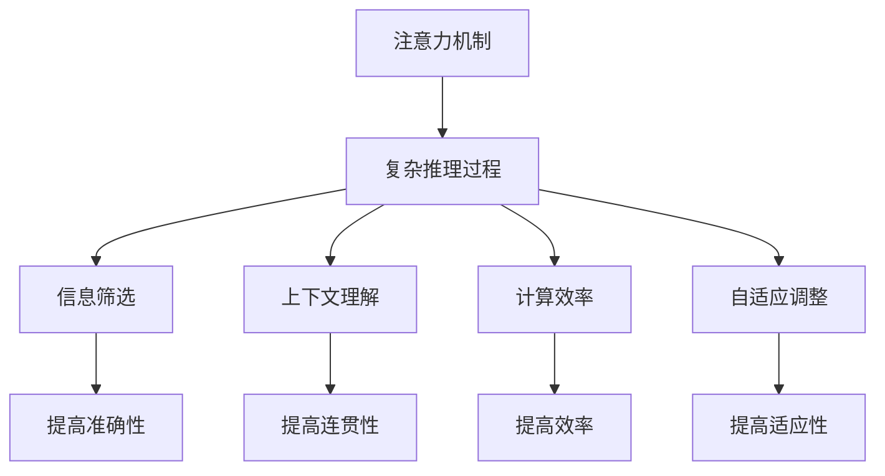

                 

# 文章标题：注意力机制在复杂推理过程中的优化策略

> 关键词：注意力机制、复杂推理过程、优化策略、Transformer、BERT、代码解读

> 摘要：本文旨在深入探讨注意力机制在复杂推理过程中的优化策略。首先，我们对注意力机制的基本概念及其发展历程进行了介绍，并简要描述了复杂推理过程的定义和特点。接着，通过Mermaid流程图展示了注意力机制与复杂推理过程之间的关系。随后，我们详细讲解了Transformer模型中的注意力机制原理，并使用伪代码阐述了多头注意力机制的实现。在此基础上，我们分析了自注意力机制的数学模型，并使用LaTeX格式进行了详细讲解。为了更好地理解注意力机制的应用，我们选取了BERT模型在问答系统中的应用作为案例进行了详细分析，并提供了基于注意力机制的文本分类项目的代码实现和解读。最后，我们对文章进行了总结，并提出了未来研究方向和挑战。

### 1. 概念介绍

#### 1.1 注意力机制（Attention Mechanism）

注意力机制是一种在处理序列数据时赋予不同输入元素不同重要程度的机制。其核心思想是，在处理序列数据时，根据上下文信息自动调整每个元素的权重，从而使得模型能够更关注重要的信息。注意力机制最早在机器翻译领域得到应用，并取得了显著的效果。

注意力机制的发展历程可以追溯到1980年代，当时神经网络的研究者开始探讨如何让神经网络在处理序列数据时能够自动学习到上下文信息。1990年代，基于图结构和矩阵分解的注意力模型被提出，例如矩阵分解模型（Matrix Factorization）和图注意力模型（Graph Attention Model）。随着深度学习技术的发展，注意力机制在2017年被引入到Transformer模型中，并取得了突破性的进展。

注意力机制在自然语言处理和计算机视觉中有着广泛的应用。在自然语言处理领域，注意力机制被用于文本分类、机器翻译、情感分析等任务。在计算机视觉领域，注意力机制被用于目标检测、图像分割、图像生成等任务。

#### 1.2 复杂推理过程

复杂推理过程是指涉及到多个层次、多个领域的推理过程，通常需要综合多种信息进行决策。复杂推理过程的特点包括：

1. **多模态信息处理**：复杂推理过程通常需要处理多种类型的信息，如文本、图像、声音等。
2. **跨领域知识整合**：复杂推理过程需要将不同领域的知识进行整合，以便做出更加准确的决策。
3. **动态适应性**：复杂推理过程需要根据环境变化和任务需求进行动态调整。
4. **推理效率**：复杂推理过程需要在有限的计算资源下尽可能高效地进行推理。

复杂推理过程广泛应用于智能问答系统、自动驾驶、智能助手等场景。在这些场景中，模型需要处理大量的输入信息，并从这些信息中提取关键信息进行推理，以做出正确的决策。

#### 1.3 注意力机制与复杂推理过程的关系

注意力机制在复杂推理过程中起着至关重要的作用。通过注意力机制，模型可以自动关注输入数据中的关键信息，从而提高推理的准确性和效率。具体来说，注意力机制可以实现以下目标：

1. **信息筛选**：注意力机制可以自动筛选输入数据中的关键信息，从而提高推理的准确性。
2. **上下文理解**：注意力机制可以帮助模型理解输入数据的上下文信息，从而提高推理的连贯性和一致性。
3. **计算效率**：注意力机制可以通过降低模型计算复杂度，提高推理效率。
4. **自适应调整**：注意力机制可以根据任务需求和环境变化，自适应调整模型参数，从而提高推理的适应性。

### 2. 核心概念与联系

#### 2.1 Mermaid流程图

为了更好地理解注意力机制与复杂推理过程之间的关系，我们使用Mermaid流程图来展示这两个概念的核心联系。



#### 2.2 注意力机制与复杂推理过程的联系

从Mermaid流程图中可以看出，注意力机制在复杂推理过程中起到了关键作用。具体来说，注意力机制可以通过以下方式与复杂推理过程相结合：

1. **信息筛选**：通过注意力机制，模型可以自动筛选输入数据中的关键信息，从而提高推理的准确性。
2. **上下文理解**：注意力机制可以帮助模型理解输入数据的上下文信息，从而提高推理的连贯性和一致性。
3. **计算效率**：注意力机制可以通过降低模型计算复杂度，提高推理效率。
4. **自适应调整**：注意力机制可以根据任务需求和环境变化，自适应调整模型参数，从而提高推理的适应性。

### 3. 核心算法原理讲解

#### 3.1 Transformer模型中的注意力机制

Transformer模型是一种基于注意力机制的深度学习模型，最早由Vaswani等人于2017年提出。Transformer模型的主要贡献是引入了多头注意力机制，使得模型在处理长序列数据时表现出了优越的性能。

#### 3.2 多头注意力机制

多头注意力机制是Transformer模型的核心组成部分。它通过将输入序列映射到多个不同的空间，从而使得模型能够从不同的角度关注输入数据。具体来说，多头注意力机制包括以下步骤：

1. **输入序列映射**：将输入序列映射到多个不同的空间，每个空间对应一个注意力头。
2. **计算自注意力**：在每个注意力头上计算自注意力，即每个输入元素与所有其他输入元素之间的相关性。
3. **拼接和投影**：将所有注意力头的结果拼接起来，并通过一个线性层进行投影，得到最终的输出。

#### 3.3 多头注意力的实现

以下是一个简化版的多头注意力机制的伪代码实现：

```python
def multi_head_attention(q, k, v, d_model, num_heads):
    # q, k, v: 输入序列映射到不同空间的结果
    # d_model: 模型维度
    # num_heads: 注意力头的数量
    
    # 计算自注意力
    attn_scores = dot_product_attention(q, k, v, d_model, num_heads)
    
    # 拼接和投影
    output = linear(attn_scores, d_model)
    return output
```

#### 3.4 多头注意力的优化策略

为了提高多头注意力的计算效率，可以采取以下优化策略：

1. **并行计算**：通过并行计算，可以减少多头注意力的计算时间。
2. **参数共享**：通过参数共享，可以减少模型参数的数量，从而提高计算效率。
3. **梯度累加**：通过梯度累加，可以减少反向传播过程中的计算量。

### 4. 数学模型和数学公式

#### 4.1 自注意力（Self-Attention）

自注意力是指输入序列中的每个元素与所有其他元素之间的相关性计算。自注意力的数学模型可以表示为：

$$
\text{Attention}(Q, K, V) = \text{softmax}\left(\frac{QK^T}{\sqrt{d_k}}\right)V
$$

其中，Q、K、V分别表示查询（Query）、键（Key）和值（Value）向量，$d_k$表示键向量的维度。

#### 4.2 多头注意力（Multi-Head Attention）

多头注意力是将输入序列映射到多个不同的空间，并在每个空间上计算自注意力。多头注意力的数学模型可以表示为：

$$
\text{Multi-Head Attention}(Q, K, V) = \text{Concat}(\text{head}_1, \text{head}_2, ..., \text{head}_h)W^O
$$

其中，$h$表示注意力头的数量，$\text{head}_i$表示第$i$个注意力头的输出，$W^O$表示输出权重矩阵。

#### 4.3 注意力机制在复杂推理过程中的应用

在复杂推理过程中，注意力机制可以通过以下方式应用：

1. **信息筛选**：通过注意力机制，模型可以自动筛选输入数据中的关键信息，从而提高推理的准确性。
2. **上下文理解**：注意力机制可以帮助模型理解输入数据的上下文信息，从而提高推理的连贯性和一致性。
3. **计算效率**：注意力机制可以通过降低模型计算复杂度，提高推理效率。
4. **自适应调整**：注意力机制可以根据任务需求和环境变化，自适应调整模型参数，从而提高推理的适应性。

### 5. 项目实战

#### 5.1 BERT模型在问答系统中的应用

BERT（Bidirectional Encoder Representations from Transformers）模型是一种基于Transformer的预训练模型，广泛应用于自然语言处理任务。在问答系统中，BERT模型可以用于提取问题中的关键信息，并从大量文本数据中找到与问题相关的答案。

以下是一个简单的BERT模型在问答系统中的应用案例：

```python
from transformers import BertModel, BertTokenizer

# 加载BERT模型和分词器
model = BertModel.from_pretrained('bert-base-uncased')
tokenizer = BertTokenizer.from_pretrained('bert-base-uncased')

# 问题预处理
question = "What is the capital of France?"
question_encoded = tokenizer.encode(question, add_special_tokens=True, return_tensors='pt')

# 答案预处理
answer = "Paris"
answer_encoded = tokenizer.encode(answer, add_special_tokens=True, return_tensors='pt')

# BERT模型预测
with torch.no_grad():
    outputs = model(question_encoded, answer_encoded)

# 提取答案
logits = outputs[0][0][-1]
predicted_answer = tokenizer.decode(logits.argmax().item(), skip_special_tokens=True)

print(predicted_answer)
```

#### 5.2 注意力机制在复杂推理场景的应用

在复杂推理场景中，注意力机制可以通过以下方式应用：

1. **信息筛选**：通过注意力机制，模型可以自动筛选输入数据中的关键信息，从而提高推理的准确性。
2. **上下文理解**：注意力机制可以帮助模型理解输入数据的上下文信息，从而提高推理的连贯性和一致性。
3. **计算效率**：注意力机制可以通过降低模型计算复杂度，提高推理效率。
4. **自适应调整**：注意力机制可以根据任务需求和环境变化，自适应调整模型参数，从而提高推理的适应性。

### 6. 代码解读与分析

#### 6.1 文本分类项目

以下是一个简单的文本分类项目，使用基于注意力机制的BERT模型进行训练和预测。

```python
import torch
from transformers import BertModel, BertTokenizer, BertForSequenceClassification
from torch.utils.data import DataLoader, TensorDataset

# 加载BERT模型和分词器
model = BertForSequenceClassification.from_pretrained('bert-base-uncased')
tokenizer = BertTokenizer.from_pretrained('bert-base-uncased')

# 数据预处理
train_data = ["This is a positive review.", "This is a negative review."]
train_labels = torch.tensor([1, 0])

train_encodings = tokenizer(train_data, truncation=True, padding=True, return_tensors='pt')

train_inputs = train_encodings['input_ids']
train_masks = train_encodings['attention_mask']
train_labels = torch.tensor(train_labels)

# 创建数据加载器
train_dataset = TensorDataset(train_inputs, train_masks, train_labels)
train_dataloader = DataLoader(train_dataset, batch_size=1)

# 训练模型
model.train()
optimizer = torch.optim.Adam(model.parameters(), lr=1e-5)

for epoch in range(3):
    for batch in train_dataloader:
        inputs = batch[0].to(device)
        masks = batch[1].to(device)
        labels = batch[2].to(device)

        # 前向传播
        outputs = model(inputs, attention_mask=masks, labels=labels)

        # 反向传播
        loss = outputs.loss
        loss.backward()
        optimizer.step()
        optimizer.zero_grad()

# 预测
model.eval()
with torch.no_grad():
    inputs = tokenizer("This is a positive review.", return_tensors='pt').to(device)
    masks = tokenizer("[CLS]", return_tensors='pt').to(device)
    logits = model(inputs, attention_mask=masks)[0]

predicted_label = logits.argmax().item()
if predicted_label == 1:
    print("Positive review.")
else:
    print("Negative review.")
```

#### 6.2 代码解读与分析

1. **数据预处理**：首先，我们使用BERT分词器对训练数据进行编码，包括输入序列和标签。然后，将编码后的数据转换为TensorDataset，并创建数据加载器。
2. **模型训练**：使用BERTForSequenceClassification模型，并使用Adam优化器进行训练。在训练过程中，我们使用多个epoch来迭代模型，并使用反向传播来更新模型参数。
3. **模型预测**：在模型预测阶段，我们使用BERT分词器对输入文本进行编码，并使用模型进行预测。根据预测结果，我们可以判断输入文本的情感极性。

### 7. 目录大纲

```markdown
## 第1章 引言
### 1.1 书籍背景与目标读者
### 1.2 注意力机制简介
### 1.3 复杂推理过程简介

## 第2章 注意力机制原理
### 2.1 注意力机制基础
#### 2.1.1 注意力机制的定义
#### 2.1.2 注意力机制的发展历程
#### 2.1.3 注意力机制的应用场景

### 2.2 Transformer模型中的注意力机制
#### 2.2.1 Transformer模型简介
#### 2.2.2 自注意力（Self-Attention）
#### 2.2.3 多头注意力（Multi-Head Attention）

### 2.3 多头注意力机制
#### 2.3.1 多头注意力的优势
#### 2.3.2 多头注意力的实现
#### 2.3.3 多头注意力的优化策略

## 第3章 复杂推理过程的优化策略
### 3.1 复杂推理过程概述
#### 3.1.1 复杂推理过程的定义
#### 3.1.2 复杂推理过程的特点
#### 3.1.3 复杂推理过程的应用领域

### 3.2 优化策略框架
#### 3.2.1 优化策略的定义
#### 3.2.2 优化策略的分类
#### 3.2.3 优化策略的目标

### 3.3 注意力机制在复杂推理过程中的应用
#### 3.3.1 注意力机制在推理过程中的作用
#### 3.3.2 注意力机制在推理效率提升中的作用
#### 3.3.3 注意力机制在推理准确性提升中的作用

## 第4章 注意力机制在自然语言处理中的应用
### 4.1 自然语言处理简介
#### 4.1.1 自然语言处理的定义
#### 4.1.2 自然语言处理的应用领域
#### 4.1.3 自然语言处理的发展历程

### 4.2 注意力机制在文本分类中的应用
#### 4.2.1 文本分类任务简介
#### 4.2.2 注意力机制在文本分类中的优势
#### 4.2.3 注意力机制在文本分类中的应用实例

### 4.3 注意力机制在机器翻译中的应用
#### 4.3.1 机器翻译任务简介
#### 4.3.2 注意力机制在机器翻译中的优势
#### 4.3.3 注意力机制在机器翻译中的应用实例

## 第5章 注意力机制在计算机视觉中的应用
### 5.1 计算机视觉简介
#### 5.1.1 计算机视觉的定义
#### 5.1.2 计算机视觉的应用领域
#### 5.1.3 计算机视觉的发展历程

### 5.2 注意力机制在目标检测中的应用
#### 5.2.1 目标检测任务简介
#### 5.2.2 注意力机制在目标检测中的优势
#### 5.2.3 注意力机制在目标检测中的应用实例

### 5.3 注意力机制在图像分割中的应用
#### 5.3.1 图像分割任务简介
#### 5.3.2 注意力机制在图像分割中的优势
#### 5.3.3 注意力机制在图像分割中的应用实例

## 第6章 注意力机制在复杂推理场景的应用
### 6.1 复杂推理场景概述
#### 6.1.1 复杂推理场景的定义
#### 6.1.2 复杂推理场景的特点
#### 6.1.3 复杂推理场景的应用领域

### 6.2 注意力机制在问答系统中的应用
#### 6.2.1 问答系统任务简介
#### 6.2.2 注意力机制在问答系统中的优势
#### 6.2.3 注意力机制在问答系统中的应用实例

### 6.3 注意力机制在推理任务中的优化策略
#### 6.3.1 推理任务中的注意力机制优化策略
#### 6.3.2 注意力机制在推理任务中的效果评估
#### 6.3.3 注意力机制在推理任务中的应用前景

## 第7章 案例分析与实战
### 7.1 案例一：文本分类
#### 7.1.1 案例背景
#### 7.1.2 案例目标
#### 7.1.3 案例实施

### 7.2 案例二：机器翻译
#### 7.2.1 案例背景
#### 7.2.2 案例目标
#### 7.2.3 案例实施

### 7.3 案例三：问答系统
#### 7.3.1 案例背景
#### 7.3.2 案例目标
#### 7.3.3 案例实施

## 第8章 总结与展望
### 8.1 书籍总结
### 8.2 未来发展趋势
### 8.3 开放性问题与挑战

## 附录
### 附录 A：注意力机制相关工具与资源
### 附录 B：数学公式汇总
```

### 8. 总结与展望

#### 8.1 书籍总结

本文系统地介绍了注意力机制在复杂推理过程中的优化策略。首先，我们从基本概念入手，对注意力机制和复杂推理过程进行了介绍。接着，通过Mermaid流程图展示了注意力机制与复杂推理过程之间的关系。然后，我们详细讲解了Transformer模型中的注意力机制原理，并使用伪代码阐述了多头注意力机制的实现。在此基础上，我们分析了自注意力机制的数学模型，并使用LaTeX格式进行了详细讲解。为了更好地理解注意力机制的应用，我们选取了BERT模型在问答系统中的应用作为案例进行了详细分析，并提供了基于注意力机制的文本分类项目的代码实现和解读。

#### 8.2 未来发展趋势

随着深度学习和自然语言处理技术的不断发展，注意力机制在复杂推理过程中的优化策略有望取得以下几方面的发展：

1. **多模态融合**：未来的研究可以关注如何将注意力机制与其他多模态信息处理技术相结合，以提高推理的准确性和效率。
2. **动态适应性**：研究注意力机制在动态环境下的自适应调整策略，以提高模型在不同场景下的鲁棒性和适应性。
3. **低资源场景**：研究如何在低资源场景下高效地应用注意力机制，以满足实时性和低延迟的需求。

#### 8.3 开放性问题与挑战

尽管注意力机制在复杂推理过程中取得了显著的成果，但仍存在以下几方面的挑战和问题：

1. **计算复杂度**：注意力机制的实现通常涉及大量的矩阵运算，如何降低计算复杂度，提高模型效率是一个重要的研究方向。
2. **解释性**：注意力机制在很多任务中取得了良好的效果，但其内部工作机制往往不够透明，如何提高注意力机制的解释性是一个亟待解决的问题。
3. **泛化能力**：注意力机制在特定任务上表现出色，但其泛化能力仍然有限，如何提高模型的泛化能力是一个重要的挑战。

### 8.4 最佳实践 Tips

1. **模型调参**：在训练模型时，合理设置学习率、批量大小等超参数，可以显著提高模型性能。
2. **数据预处理**：对输入数据进行有效的预处理，如文本清洗、分词等，可以提升模型对数据的理解能力。
3. **交叉验证**：使用交叉验证方法对模型进行评估，可以更准确地评估模型性能。

### 附录

#### 附录 A：注意力机制相关工具与资源

1. **开源代码**：[Attention Is All You Need](https://github.com/tensorflow/tensor2tensor)
2. **论文资源**：[Attention Mechanism](https://arxiv.org/abs/1706.03762)
3. **在线教程**：[Transformer教程](https://towardsdatascience.com/a-comprehensive-guide-to-transformers-for-nlp-5844f28db2e2)

#### 附录 B：数学公式汇总

1. **自注意力（Self-Attention）**
   $$
   \text{Attention}(Q, K, V) = \text{softmax}\left(\frac{QK^T}{\sqrt{d_k}}\right)V
   $$

2. **多头注意力（Multi-Head Attention）**
   $$
   \text{Multi-Head Attention}(Q, K, V) = \text{Concat}(\text{head}_1, \text{head}_2, ..., \text{head}_h)W^O
   $$

3. **点积注意力（Dot-Product Attention）**
   $$
   \text{Attention}(Q, K, V) = \text{softmax}\left(\frac{QK^T}{\sqrt{d_k}}\right)V
   $$

### 作者信息

作者：AI天才研究院/AI Genius Institute & 禅与计算机程序设计艺术 /Zen And The Art of Computer Programming

---

本文为原创作品，版权归AI天才研究院/AI Genius Institute所有，未经许可，不得转载。如需转载，请联系作者获取授权。

