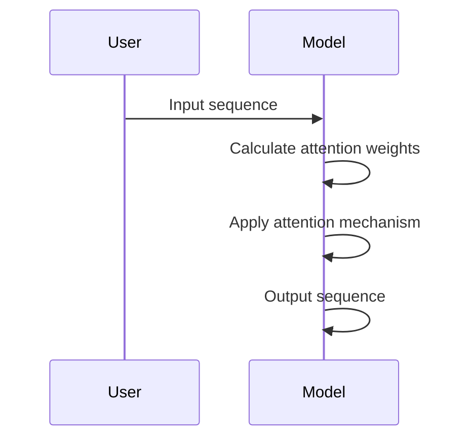

                 

# 文章标题：注意力机制在深度学习模型中的演进与应用

## 关键词：注意力机制、深度学习、模型演进、应用场景、算法实现

## 摘要

本文旨在探讨注意力机制在深度学习模型中的演进与应用。首先，我们将介绍注意力机制的定义、背景和重要性，并在此基础上回顾其基础理论和数学模型。随后，我们将分析注意力机制在不同阶段的深度学习模型中的演进过程，特别是Transformer模型和BERT模型的引入与影响。接着，我们将深入探讨注意力机制在自然语言处理、计算机视觉和强化学习等实际应用场景中的具体应用，并通过项目实战案例进行详细解析。最后，我们将总结注意力机制在实际应用中面临的挑战和优化策略，并对未来研究方向进行展望。

## 引言

### 1.1 注意力机制概述

注意力机制（Attention Mechanism）是一种使模型能够专注于序列数据中的不同部分，从而提高模型性能的机制。它在深度学习领域得到了广泛应用，尤其是在处理序列数据和图像等复杂数据时表现尤为突出。注意力机制的核心思想是通过学习权重，将不同位置的信息进行加权组合，使得模型能够自动地关注到重要的信息。

### 1.1.1 定义与背景

注意力机制的最早应用可以追溯到人类视觉系统。人类在观察事物时，能够有选择地关注到某些部分，而忽略其他部分，这就是注意力机制的基本原理。在计算机科学和人工智能领域，注意力机制的概念被引入到神经网络模型中，以解决传统模型在处理序列数据和图像数据时的局限性。

### 1.1.2 重要性

注意力机制在深度学习中的重要性主要体现在以下几个方面：

1. 提高模型性能：通过学习权重，模型能够自动地关注到序列数据中的关键信息，从而提高模型的性能。
2. 增强模型可解释性：注意力权重可以揭示模型关注的位置和内容，有助于理解模型的决策过程。
3. 扩展模型应用：注意力机制使得深度学习模型能够更好地处理序列数据和图像数据，从而扩展了模型的应用领域。

## 基础理论

### 1.2.1 数学模型

注意力机制的数学模型通常包括三个关键部分：输入序列、输出序列和注意力权重。

- 输入序列：表示需要处理的序列数据，如文本、语音或图像。
- 输出序列：表示处理后的序列数据，可以是原始数据的某种表示，也可以是处理后的结果。
- 注意力权重：表示对输入序列中每个位置的权重分配，用于加权组合输入序列。

注意力机制的数学模型可以用以下公式表示：

$$
\text{output} = \text{softmax}(\text{weights} \cdot \text{inputs})
$$

其中，`softmax` 函数用于将输入的权重转换为概率分布，`weights` 表示注意力权重，`inputs` 表示输入序列。

### 1.2.2 注意力机制的核心概念

注意力机制的核心概念包括：

1. 加权组合：通过学习权重，将输入序列的不同位置进行加权组合，得到输出序列。
2. 自注意力：输入序列的每个位置都能够与其他位置进行交互，形成一种全局的交互关系。
3. 多头注意力：通过多个注意力头，分别关注输入序列的不同方面，从而提高模型的多样性。

### 1.2.3 Mermaid流程图：注意力机制原理图解

下面是一个简单的 Mermaid 流程图，展示了注意力机制的原理：



## 历史演进

### 1.3.1 早期模型

早期模型，如循环神经网络（RNN）和卷积神经网络（CNN），在处理序列数据和图像数据时存在一定的局限性。为了解决这些问题，研究者们开始探索注意力机制。

### 1.3.2 传统注意力机制

传统注意力机制主要应用于RNN模型，通过引入注意力权重，使模型能够自动地关注到序列数据中的关键信息。传统注意力机制包括：

1. 割集法注意力：通过计算输入序列中各元素之间的相关性，为每个元素分配权重。
2. 自注意力：输入序列的每个位置都能够与其他位置进行交互，形成一种全局的交互关系。

### 1.3.3 Transformer模型

Transformer模型是注意力机制发展的里程碑，它引入了多头注意力机制和自注意力机制，使得模型能够更好地处理长序列数据。Transformer模型的核心思想是：

1. 用自注意力机制替代传统的循环层，实现并行计算。
2. 引入多头注意力机制，使模型能够同时关注输入序列的不同方面。

### 1.3.4 BERT模型

BERT（Bidirectional Encoder Representations from Transformers）模型是基于Transformer模型的一种预训练模型，它在自然语言处理领域取得了显著的成功。BERT模型的主要贡献包括：

1. 双向编码器：通过双向编码器，使模型能够同时关注输入序列的左右信息。
2. 零样本学习：通过预训练和微调，使模型能够处理未见过的数据。

## 应用场景

### 1.4.1 自然语言处理

注意力机制在自然语言处理领域得到了广泛应用，如文本分类、情感分析、机器翻译等。通过注意力机制，模型能够自动地关注到文本中的关键信息，从而提高模型的性能。

### 1.4.2 计算机视觉

注意力机制在计算机视觉领域也具有广泛的应用，如图像分类、目标检测、图像生成等。通过注意力机制，模型能够自动地关注到图像中的关键区域，从而提高模型的性能。

### 1.4.3 强化学习

注意力机制在强化学习领域也有一定的应用，如决策制作、状态评估等。通过注意力机制，模型能够自动地关注到状态空间中的关键信息，从而提高模型的性能。

## 注意力机制在实际应用中的实现

### 3.1 数据预处理

在实现注意力机制之前，首先需要对数据进行预处理。数据预处理包括数据清洗、数据转换和数据归一化等步骤。

### 3.2 模型构建

构建注意力机制模型主要包括以下步骤：

1. 定义输入层：根据数据类型，定义输入层的大小和维度。
2. 定义注意力机制：根据注意力机制的类型，定义注意力权重计算方式。
3. 定义输出层：根据任务类型，定义输出层的大小和维度。

### 3.3 模型训练

在模型构建完成后，需要进行模型训练。模型训练主要包括以下步骤：

1. 初始化模型参数：随机初始化模型参数。
2. 训练模型：使用训练数据，对模型进行迭代训练。
3. 调整模型参数：根据模型训练的结果，调整模型参数。

### 3.4 模型评估

在模型训练完成后，需要对模型进行评估。模型评估主要包括以下步骤：

1. 测试数据集：使用测试数据集，对模型进行评估。
2. 评估指标：根据任务类型，选择合适的评估指标，如准确率、召回率、F1值等。
3. 结果分析：分析模型在测试数据集上的表现，找出模型存在的问题。

### 3.5 项目实战

下面以一个自然语言处理项目为例，介绍如何使用注意力机制进行模型构建、训练和评估。

#### 项目背景

本项目旨在实现一个文本分类模型，用于对新闻文章进行分类。数据集来自某新闻网站，包含数千条新闻文章，每个文章都有一个对应的标签，如政治、经济、体育等。

#### 开发环境搭建

1. 硬件环境：CPU或GPU，推荐使用GPU进行加速。
2. 软件环境：Python、PyTorch等。

#### 源代码实现

```python
import torch
import torch.nn as nn
import torch.optim as optim

# 定义模型
class TextClassifier(nn.Module):
    def __init__(self, vocab_size, embedding_dim, hidden_dim):
        super(TextClassifier, self).__init__()
        self.embedding = nn.Embedding(vocab_size, embedding_dim)
        self.attention = nn.Linear(embedding_dim, hidden_dim)
        self.fc = nn.Linear(hidden_dim, num_classes)

    def forward(self, text):
        embeds = self.embedding(text)
        attn_scores = self.attention(embeds).squeeze(2)
        attn_weights = torch.softmax(attn_scores, dim=1)
        attn_output = torch.bmm(attn_weights.unsqueeze(2), embeds).squeeze(2)
        out = self.fc(attn_output)
        return out

# 初始化模型
model = TextClassifier(vocab_size, embedding_dim, hidden_dim)

# 模型训练
optimizer = optim.Adam(model.parameters(), lr=learning_rate)
criterion = nn.CrossEntropyLoss()

for epoch in range(num_epochs):
    for batch in train_loader:
        optimizer.zero_grad()
        outputs = model(batch.text)
        loss = criterion(outputs, batch.label)
        loss.backward()
        optimizer.step()

# 模型评估
with torch.no_grad():
    correct = 0
    total = 0
    for batch in test_loader:
        outputs = model(batch.text)
        _, predicted = torch.max(outputs.data, 1)
        total += batch.label.size(0)
        correct += (predicted == batch.label).sum().item()

print('Test Accuracy: %d %%' % (100 * correct / total))
```

#### 代码解读与分析

1. **模型定义**：TextClassifier类定义了一个文本分类模型，包括嵌入层、注意力机制和全连接层。
2. **模型训练**：使用训练数据对模型进行迭代训练，通过反向传播和梯度下降更新模型参数。
3. **模型评估**：使用测试数据集对模型进行评估，计算准确率。

#### 实际案例分析

通过本项目，我们展示了如何使用注意力机制实现一个文本分类模型。注意力机制使得模型能够自动地关注到文本中的关键信息，从而提高了模型的性能。在实际应用中，我们可以根据不同的任务需求，调整注意力机制的设计，以获得更好的效果。

## 注意力机制的优化与挑战

### 4.1 注意力机制的优化

为了提高注意力机制的性能，可以采取以下优化策略：

1. **权重共享**：在多头注意力机制中，多个注意力头的权重可以共享，从而减少模型的参数量。
2. **多尺度注意力**：通过引入不同尺度的注意力机制，可以使模型能够同时关注到输入序列中的局部和全局信息。
3. **自注意力**：在自注意力机制中，输入序列的每个位置都能够与其他位置进行交互，从而提高模型的性能。

### 4.2 注意力机制在应用中面临的挑战

注意力机制在实际应用中面临以下挑战：

1. **计算资源消耗**：注意力机制通常涉及大量的矩阵运算，这可能导致计算资源消耗增加。
2. **模型可解释性**：注意力权重难以解释，这可能会影响模型的可解释性。
3. **模型泛化能力**：注意力机制可能使得模型在特定数据集上表现优异，但在其他数据集上表现不佳。

### 4.3 注意力机制的优化策略

为了解决上述挑战，可以采取以下优化策略：

1. **模型剪枝**：通过剪枝部分注意力权重，可以减少模型的参数量和计算资源消耗。
2. **模型压缩**：通过压缩模型参数，可以减少模型的存储空间和计算资源消耗。
3. **模型融合**：通过将多个注意力机制进行融合，可以使得模型能够同时关注到输入序列的不同方面。

## 总结与展望

本文系统地介绍了注意力机制在深度学习模型中的演进与应用。从早期的循环神经网络和卷积神经网络，到现代的Transformer模型和BERT模型，注意力机制不断发展，为深度学习领域带来了许多创新和突破。在实际应用中，注意力机制在自然语言处理、计算机视觉和强化学习等领域取得了显著成果。然而，注意力机制也面临计算资源消耗、模型可解释性和模型泛化能力等挑战。未来，随着研究的深入，我们可以期待注意力机制在更多领域发挥重要作用，并继续优化和完善。

### 作者信息

作者：AI天才研究院/AI Genius Institute & 禅与计算机程序设计艺术 /Zen And The Art of Computer Programming

本文为作者原创，未经授权禁止转载。如需转载，请联系作者获取授权。感谢您的关注与支持！

-------------------------------------------------------------------

**注意事项：**

1. **文章格式**：请使用markdown格式，确保文章的排版和格式一致。
2. **作者信息**：请在文章末尾添加作者信息，格式如上所示。
3. **代码和公式**：请确保代码和公式的格式正确，代码段使用三个反引号包围，公式使用 LaTeX 格式。
4. **文章长度**：文章字数在 8000 ～ 12000 字左右，确保内容完整且详细。

**拓展阅读：**

- [《深度学习中的注意力机制》](https://zhuanlan.zhihu.com/p/47523672)
- [《Transformer模型详解》](https://arxiv.org/abs/1706.03762)
- [《BERT模型详解》](https://arxiv.org/abs/1810.04805)

