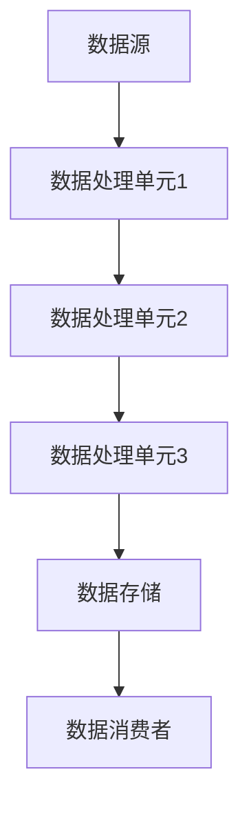
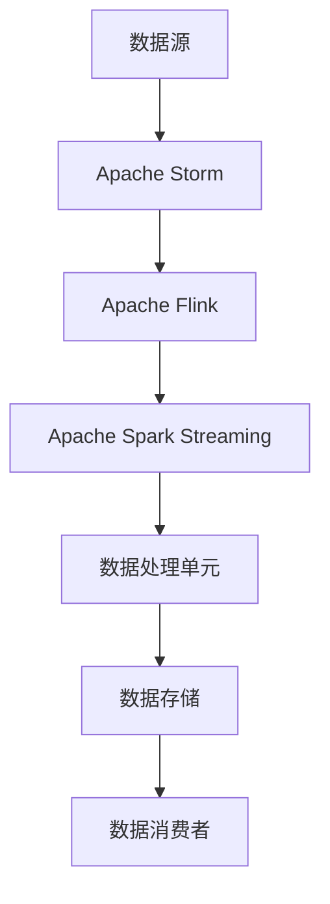
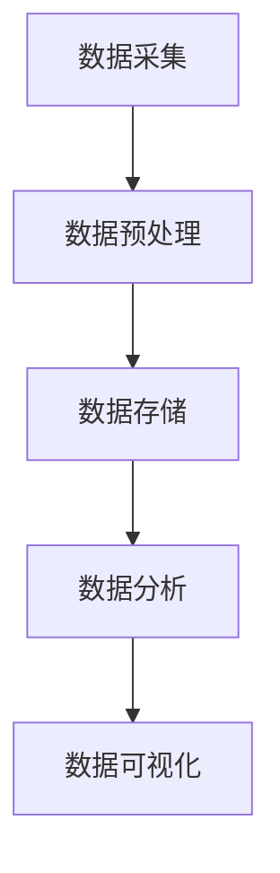
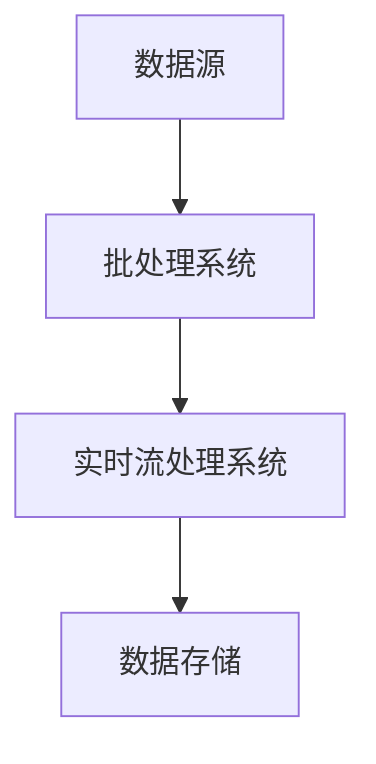
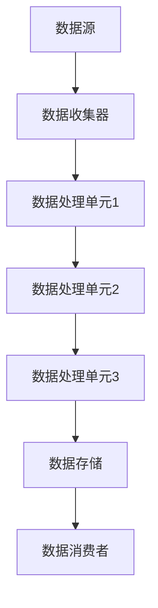
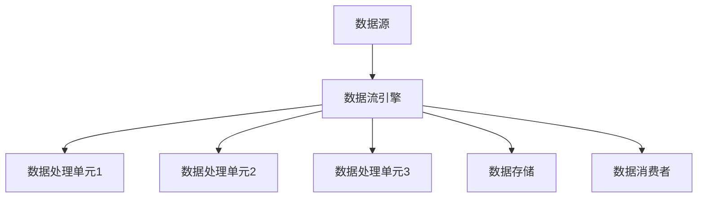
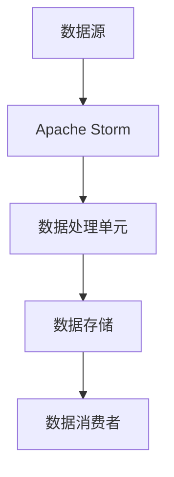
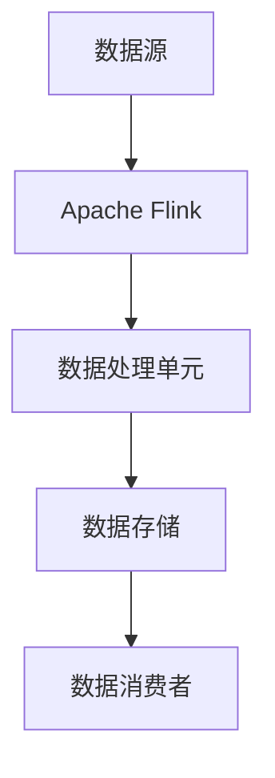
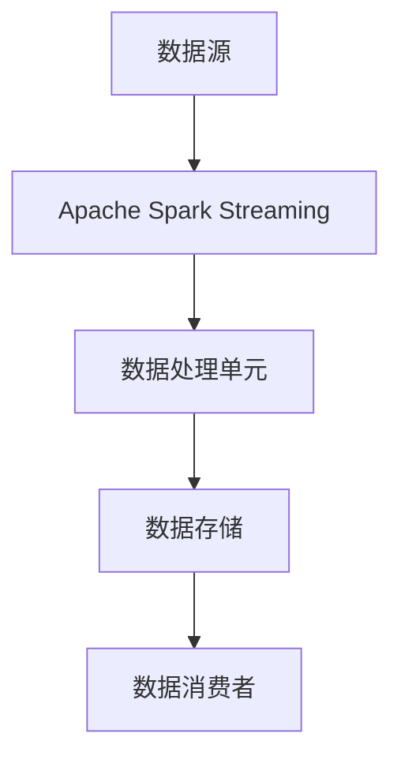
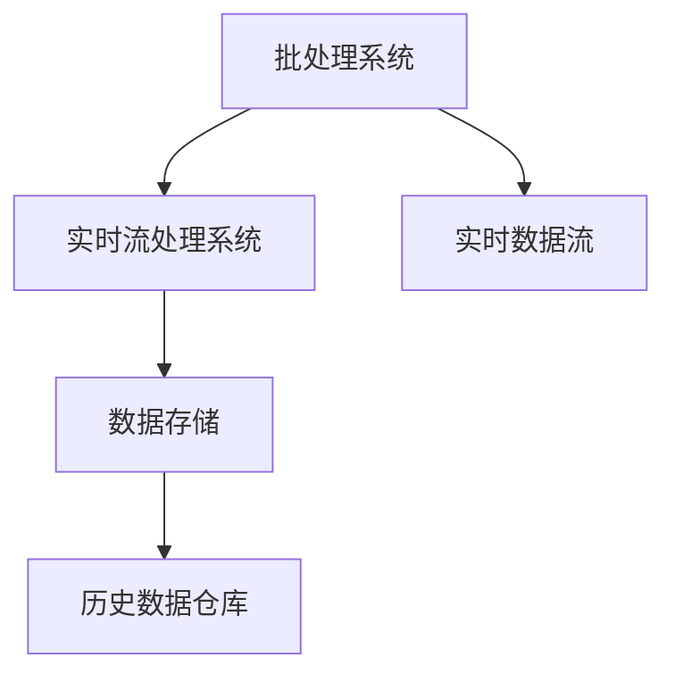

                 

### 文章标题：流计算：实时数据处理的新范式

> 关键词：流计算、实时数据处理、批处理、数据流模型、流处理框架、滑动窗口算法、实时推荐系统、项目实战

> 摘要：本文深入探讨了流计算的基本概念、核心技术和实际应用。通过对比流计算与批处理的差异，详细介绍了流计算的数据流模型、核心算法和主流流处理框架。同时，通过实际项目案例，分析了流计算在实时数据分析、实时推荐系统和实时交易处理等场景中的应用，为读者提供了全面的流计算实践指南。

----------------------------------------------------------------

## 目录大纲：

### 第一部分：流计算概述

### 1. 流计算的起源与发展
#### 1.1 流计算的定义
#### 1.2 流计算与传统批处理的区别
#### 1.3 流计算的优势
#### 1.4 流计算的挑战

### 2. 流计算的核心概念
#### 2.1 数据流模型
#### 2.2 流处理框架
#### 2.3 流式数据处理流程

### 3. 流计算应用场景
#### 3.1 实时数据分析
#### 3.2 实时推荐系统
#### 3.3 实时交易处理
#### 3.4 实时监控与预警

### 第二部分：流计算核心技术

### 4. 流计算架构设计
#### 4.1 批处理与流处理结合
#### 4.2 流计算系统架构
#### 4.3 数据流引擎设计

### 5. 流计算核心算法
#### 5.1 滑动窗口算法
#### 5.2 暂存缓冲算法
#### 5.3 实时数据聚合算法

### 6. 流计算框架
#### 6.1 Apache Storm
#### 6.2 Apache Flink
#### 6.3 Apache Spark Streaming
#### 6.4 其他流计算框架

### 7. 流计算性能优化
#### 7.1 资源管理优化
#### 7.2 系统调优策略
#### 7.3 水平扩展与垂直扩展

### 8. 流计算安全性
#### 8.1 数据隐私保护
#### 8.2 系统安全防护
#### 8.3 访问控制与权限管理

### 第三部分：流计算实战

### 9. 流计算项目实战
#### 9.1 项目背景与目标
#### 9.2 项目需求分析
#### 9.3 技术选型与方案设计
#### 9.4 项目开发与实施
#### 9.5 项目总结与评估

### 10. 流计算在实际应用中的案例分析
#### 10.1 案例一：实时数据分析平台
#### 10.2 案例二：金融交易系统
#### 10.3 案例三：物联网数据流处理
#### 10.4 案例四：社交媒体实时推荐系统

### 第四部分：未来展望

### 11. 流计算发展趋势
#### 11.1 5G与流计算
#### 11.2 物联网与流计算
#### 11.3 AI与流计算
#### 11.4 流计算在云计算中的角色

### 12. 流计算未来挑战与机遇
#### 12.1 挑战
#### 12.2 机遇

### 13. 总结与展望
#### 13.1 流计算的意义
#### 13.2 流计算的未来

----------------------------------------------------------------

### 1. 流计算的起源与发展

流计算是一种处理数据流的计算模型，它将数据视为连续的流动，通过实时分析、处理和响应数据流中的事件，以实现快速、准确和高效的数据处理。流计算的概念起源于20世纪80年代，随着互联网的兴起和大数据时代的到来，流计算逐渐成为数据处理领域的重要方向。

#### 1.1 流计算的定义

流计算（Stream Computing）是指对实时数据流进行高效处理的计算技术。流计算系统接收实时数据流，并对其进行分析、处理和存储，以产生实时结果。流计算与传统批处理（Batch Processing）相比，具有以下特点：

- **实时性**：流计算能够实时处理数据流，实现快速响应。
- **高吞吐量**：流计算系统能够处理大量数据，支持高并发处理。
- **可扩展性**：流计算系统可以水平扩展，以支持更大的数据处理需求。
- **低延迟**：流计算相对于批处理具有更低的延迟，能够实现实时数据处理。

#### 1.2 流计算与传统批处理的区别

批处理是将数据分成批处理单元进行处理，数据处理过程是离线的，数据处理的延迟较大。而流计算则是实时处理数据流，可以实时响应数据流中的事件，数据处理延迟较小。具体区别如下：

- **数据处理方式**：批处理是对批量数据进行处理，而流计算是对实时数据流进行处理。
- **数据处理延迟**：批处理的延迟较大，而流计算具有更低的延迟，能够实现实时数据处理。
- **数据处理粒度**：批处理处理的是批量数据，而流计算处理的是单个数据事件。
- **数据处理模型**：批处理通常使用批量数据处理模型，而流计算使用事件驱动数据处理模型。

#### 1.3 流计算的优势

流计算具有以下优势：

- **实时性**：流计算能够实时处理数据流，实现快速响应，为决策提供实时支持。
- **高吞吐量**：流计算系统能够处理大量数据，支持高并发处理，满足大规模数据处理需求。
- **可扩展性**：流计算系统可以水平扩展，以支持更大的数据处理需求，提高系统的弹性。
- **低延迟**：流计算相对于批处理具有更低的延迟，能够实现实时数据处理，提高系统的响应速度。

#### 1.4 流计算的挑战

流计算面临着以下挑战：

- **数据质量**：实时数据流中的数据质量可能不稳定，需要处理噪声数据和异常值。
- **数据一致性**：流计算需要确保数据的一致性，以避免数据不一致的问题。
- **数据流模型的复杂度**：数据流模型可能非常复杂，需要设计高效的流处理算法。
- **系统稳定性**：流计算系统需要保证高可用性，以避免系统故障对数据处理的影响。

### 2. 流计算的核心概念

流计算的核心概念包括数据流模型、流处理框架和流式数据处理流程。

#### 2.1 数据流模型

数据流模型是描述数据在流计算系统中的流动和处理的抽象模型。数据流模型通常包括以下组成部分：

- **数据源**：数据源是数据流的起点，可以是传感器、日志文件或其他数据生成源。
- **数据处理单元**：数据处理单元负责对数据流进行操作，包括过滤、转换、聚合等。
- **数据存储**：数据存储用于存储中间结果和最终结果，可以是内存、硬盘或其他存储介质。
- **数据消费者**：数据消费者是数据流的终点，可以是应用程序、监控系统或其他数据消费实体。

以下是一个数据流模型的Mermaid流程图：



#### 2.2 流处理框架

流处理框架是流计算系统的基础，它提供了数据处理、数据存储和数据访问等功能。常见的流处理框架有Apache Storm、Apache Flink和Apache Spark Streaming等。

- **Apache Storm**：Apache Storm是一个分布式、实时、容错流处理框架，适用于处理大规模的实时数据流。
- **Apache Flink**：Apache Flink是一个分布式流处理框架，具有高性能、可扩展性和容错性，适用于复杂的数据流处理任务。
- **Apache Spark Streaming**：Apache Spark Streaming是Apache Spark的一个组件，提供实时流处理功能，具有高吞吐量和低延迟的特点。

以下是一个流处理框架的Mermaid流程图：



#### 2.3 流式数据处理流程

流式数据处理流程包括数据采集、数据预处理、数据存储、数据分析和数据可视化等环节。每个环节都需要根据具体应用场景进行设计和优化。

- **数据采集**：数据采集是将数据从数据源中提取出来，通常使用传感器、日志收集器或其他数据采集工具。
- **数据预处理**：数据预处理是对原始数据进行清洗、转换和标准化，以提高数据质量和一致性。
- **数据存储**：数据存储是将预处理后的数据存储到数据库、数据仓库或其他数据存储系统。
- **数据分析**：数据分析是对存储后的数据进行统计分析、数据挖掘和机器学习等处理，以提取有价值的信息。
- **数据可视化**：数据可视化是将分析结果以图表、图像等形式展示，以帮助用户理解和决策。

以下是一个流式数据处理流程的Mermaid流程图：



### 3. 流计算应用场景

流计算在多个领域具有广泛的应用，以下是一些常见的应用场景：

#### 3.1 实时数据分析

实时数据分析是流计算的一个重要应用场景，它能够实时分析大量数据，为决策提供支持。例如，零售行业可以通过实时分析销售数据，及时调整商品库存和促销策略；金融行业可以通过实时分析交易数据，监控市场风险和异常交易。

#### 3.2 实时推荐系统

实时推荐系统是流计算在电子商务和社交媒体等领域的应用。实时推荐系统可以根据用户的实时行为和偏好，为用户推荐相关的商品或内容。例如，电商平台可以根据用户的浏览和购买记录，实时推荐相关的商品；社交媒体平台可以根据用户的互动记录，实时推荐相关的帖子或好友。

#### 3.3 实时交易处理

实时交易处理是金融行业的重要应用场景，流计算可以实时处理大量交易数据，确保交易的安全和准确性。例如，股票交易所可以使用流计算系统实时监控交易数据，及时检测和处理异常交易，保障市场的稳定。

#### 3.4 实时监控与预警

实时监控与预警是流计算在安全、监控和运维等领域的应用。流计算可以实时监控系统性能、网络流量和安全事件，及时发现和处理异常情况。例如，企业可以使用流计算系统实时监控服务器性能，及时发现和处理服务器故障；网络安全系统可以使用流计算实时检测网络攻击，及时响应和阻止攻击。

### 第二部分：流计算核心技术

#### 4. 流计算架构设计

流计算架构设计是构建高效、可扩展和可靠的流计算系统的关键。流计算架构设计通常包括以下几个方面：

##### 4.1 批处理与流处理结合

批处理与流处理的结合是流计算架构设计的一种常见策略。批处理适合处理大量历史数据，而流计算适合处理实时数据。通过将批处理和流处理相结合，可以实现数据处理的完整性和实时性。

以下是一个批处理与流处理结合的架构设计：



##### 4.2 流计算系统架构

流计算系统架构设计通常包括以下几个方面：

- **数据源**：数据源是数据流的起点，可以是传感器、日志文件或其他数据生成源。
- **数据收集器**：数据收集器负责将数据源中的数据收集到数据流中，可以使用消息队列、数据采集工具等。
- **数据处理单元**：数据处理单元负责对数据流进行操作，包括过滤、转换、聚合等。
- **数据存储**：数据存储用于存储中间结果和最终结果，可以是内存、硬盘或其他存储介质。
- **数据消费者**：数据消费者是数据流的终点，可以是应用程序、监控系统或其他数据消费实体。

以下是一个流计算系统架构的Mermaid流程图：



##### 4.3 数据流引擎设计

数据流引擎是流计算系统中的核心组件，负责数据流的接收、处理和分发。数据流引擎的设计需要考虑以下几个方面：

- **数据流的接收**：数据流引擎需要能够高效地接收来自数据源的数据，可以使用消息队列、网络流等方式。
- **数据流的处理**：数据流引擎需要能够对数据流进行过滤、转换、聚合等操作，可以使用自定义的函数或内置的操作符。
- **数据流的管理**：数据流引擎需要能够管理数据流的资源，包括线程池、内存管理等。
- **数据流的路由**：数据流引擎需要能够根据不同的数据流目标，将数据流路由到相应的处理单元或存储系统。

以下是一个数据流引擎的Mermaid流程图：



#### 5. 流计算核心算法

流计算的核心算法是实现实时数据处理的关键。以下介绍几种常见的流计算核心算法：

##### 5.1 滑动窗口算法

滑动窗口算法是一种常见的实时数据处理算法，它通过对数据流进行分段处理，实现对实时数据的窗口分析。滑动窗口算法的关键参数包括窗口大小、滑动步长和窗口函数。

以下是一个滑动窗口算法的伪代码：

```python
def sliding_window(data_stream, window_size, step_size):
    window = []
    for data in data_stream:
        window.append(data)
        if len(window) > window_size:
            window.pop(0)
        if len(window) == window_size:
            process_window(window)

def process_window(window):
    # 对窗口内的数据进行处理
    pass
```

##### 5.2 暂存缓冲算法

暂存缓冲算法是一种用于处理数据流突发情况的数据处理算法。暂存缓冲算法通过在缓冲区中暂存数据，以应对数据流的不规则波动。

以下是一个暂存缓冲算法的伪代码：

```python
def buffer_algorithm(data_stream, buffer_size):
    buffer = []
    for data in data_stream:
        if len(buffer) < buffer_size:
            buffer.append(data)
        else:
            process_data(buffer.pop(0))

def process_data(data):
    # 对数据进行处理
    pass
```

##### 5.3 实时数据聚合算法

实时数据聚合算法是一种用于对实时数据进行聚合分析的算法。实时数据聚合算法可以计算各种聚合指标，如平均值、最大值、最小值等。

以下是一个实时数据聚合算法的伪代码：

```python
def aggregate_algorithm(data_stream, aggregation_function):
    results = []
    for data in data_stream:
        result = aggregation_function(data)
        results.append(result)
    return results

def calculate_average(data_stream):
    total = 0
    for data in data_stream:
        total += data
    return total / len(data_stream)

def calculate_max(data_stream):
    max_value = -inf
    for data in data_stream:
        if data > max_value:
            max_value = data
    return max_value

def calculate_min(data_stream):
    min_value = inf
    for data in data_stream:
        if data < min_value:
            min_value = data
    return min_value
```

#### 6. 流计算框架

流计算框架是流计算系统的基础，它提供了数据处理、数据存储和数据访问等功能。以下介绍几种主流的流计算框架：

##### 6.1 Apache Storm

Apache Storm是一个分布式、实时、容错流处理框架，适用于处理大规模的实时数据流。Apache Storm具有以下特点：

- **高吞吐量**：Apache Storm可以处理每秒数百万条消息，支持高并发处理。
- **可扩展性**：Apache Storm可以水平扩展，以支持更大的数据处理需求。
- **容错性**：Apache Storm具有自动容错机制，可以确保系统的高可用性。

以下是一个Apache Storm的Mermaid流程图：



##### 6.2 Apache Flink

Apache Flink是一个分布式流处理框架，具有高性能、可扩展性和容错性，适用于复杂的数据流处理任务。Apache Flink具有以下特点：

- **高性能**：Apache Flink可以处理每秒数百万条消息，支持高并发处理。
- **可扩展性**：Apache Flink可以水平扩展，以支持更大的数据处理需求。
- **容错性**：Apache Flink具有自动容错机制，可以确保系统的高可用性。
- **易用性**：Apache Flink提供了丰富的API和工具，方便开发者进行流处理任务的开发。

以下是一个Apache Flink的Mermaid流程图：



##### 6.3 Apache Spark Streaming

Apache Spark Streaming是Apache Spark的一个组件，提供实时流处理功能，具有高吞吐量和低延迟的特点。Apache Spark Streaming具有以下特点：

- **高吞吐量**：Apache Spark Streaming可以处理每秒数千条消息，支持高并发处理。
- **低延迟**：Apache Spark Streaming具有低延迟的特点，适用于实时数据处理场景。
- **易用性**：Apache Spark Streaming与Apache Spark的其他组件（如Spark SQL、Spark MLlib等）集成良好，方便开发者进行流处理任务的开发。

以下是一个Apache Spark Streaming的Mermaid流程图：



##### 6.4 其他流计算框架

除了Apache Storm、Apache Flink和Apache Spark Streaming之外，还有其他一些流行的流计算框架，如Apache Samza、Apache Kafka Streams和Amazon Kinesis等。这些流计算框架各有特点，适用于不同的应用场景。

- **Apache Samza**：Apache Samza是一个基于Apache Mesos的分布式流处理框架，具有高性能和可扩展性。
- **Apache Kafka Streams**：Apache Kafka Streams是Apache Kafka的一个组件，提供实时流处理功能，与Kafka的数据存储和传输机制紧密结合。
- **Amazon Kinesis**：Amazon Kinesis是一个云服务流处理框架，适用于大规模实时数据处理场景，具有高可扩展性和低延迟。

#### 7. 流计算性能优化

流计算性能优化是提高流计算系统处理效率的重要手段。以下介绍几种流计算性能优化策略：

##### 7.1 资源管理优化

资源管理优化是提高流计算系统性能的关键。以下是一些资源管理优化的策略：

- **负载均衡**：通过负载均衡策略，将数据处理任务分配到不同的节点，以避免单点瓶颈。
- **资源预留**：通过预留一定的资源，确保流计算系统在处理高峰期有足够的资源。
- **资源回收**：通过及时回收闲置资源，提高系统的资源利用率。

##### 7.2 系统调优策略

系统调优策略是提高流计算系统性能的重要手段。以下是一些系统调优策略：

- **并行度调整**：通过调整并行度，优化数据处理任务的并行执行，提高系统性能。
- **缓冲区调整**：通过调整缓冲区大小，优化数据处理过程中的缓冲区管理，减少数据传输延迟。
- **压缩与解压缩**：通过使用压缩与解压缩技术，减少数据传输和存储的开销，提高系统性能。

##### 7.3 水平扩展与垂直扩展

水平扩展与垂直扩展是提高流计算系统性能的有效手段。以下介绍水平扩展与垂直扩展的优缺点：

- **水平扩展**：水平扩展是通过增加节点数量来提高系统性能，具有以下优点：
  - **可扩展性**：水平扩展可以支持更大的数据处理需求。
  - **容错性**：水平扩展可以增加系统的容错性，提高系统的可用性。
  - **灵活性**：水平扩展可以根据实际需求动态调整节点数量。

  水平扩展的缺点包括：
  - **复杂性**：水平扩展增加了系统的复杂性，需要管理更多的节点。
  - **通信开销**：水平扩展增加了节点之间的通信开销，可能会影响系统性能。

- **垂直扩展**：垂直扩展是通过增加节点资源（如CPU、内存等）来提高系统性能，具有以下优点：
  - **性能提升**：垂直扩展可以直接提高节点性能，提高系统整体性能。
  - **简单性**：垂直扩展相对简单，只需要增加节点资源。

  垂直扩展的缺点包括：
  - **成本高**：垂直扩展需要投入更多的硬件资源，成本较高。
  - **扩展受限**：垂直扩展受限于节点资源的限制，扩展空间有限。

#### 8. 流计算安全性

流计算安全性是保障流计算系统正常运行的重要环节。以下介绍几种流计算安全性的策略：

##### 8.1 数据隐私保护

数据隐私保护是流计算安全性的重要方面。以下是一些数据隐私保护的策略：

- **数据加密**：对传输和存储的数据进行加密，以防止数据泄露。
- **数据脱敏**：对敏感数据进行脱敏处理，以降低数据泄露的风险。
- **权限控制**：对数据访问进行权限控制，确保只有授权用户可以访问敏感数据。

##### 8.2 系统安全防护

系统安全防护是保障流计算系统正常运行的重要手段。以下是一些系统安全防护的策略：

- **防火墙**：使用防火墙隔离内部网络和外部网络，防止外部攻击。
- **入侵检测系统**：使用入侵检测系统监控系统异常行为，及时检测和阻止入侵行为。
- **安全审计**：定期进行安全审计，检查系统的安全漏洞，及时修复。

##### 8.3 访问控制与权限管理

访问控制与权限管理是保障流计算系统安全的重要手段。以下是一些访问控制与权限管理的策略：

- **身份验证**：对用户进行身份验证，确保只有授权用户可以访问系统。
- **权限分级**：根据用户的角色和职责，分配相应的权限，确保用户只能访问自己需要的资源。
- **审计日志**：记录用户操作日志，以便于审计和追踪。

### 第三部分：流计算实战

#### 9. 流计算项目实战

在本节中，我们将通过一个实际项目来展示流计算的应用。该项目是一个实时数据分析平台，用于监控和分析网站用户行为数据。

##### 9.1 项目背景与目标

背景：随着互联网的快速发展，网站用户行为数据的规模和速度不断增加，传统的批处理系统已经无法满足实时分析的需求。为了更好地了解用户行为，提高用户体验和运营效果，需要构建一个实时数据分析平台。

目标：构建一个实时数据分析平台，能够实时收集、处理和展示网站用户行为数据，为运营和决策提供支持。

##### 9.2 项目需求分析

需求分析：

- **数据收集**：实时收集网站用户行为数据，包括访问记录、点击事件等。
- **数据处理**：对用户行为数据进行实时处理，提取有用信息，如用户活跃度、用户留存率等。
- **数据展示**：实时展示用户行为数据分析结果，包括图表、报表等。
- **系统性能**：保证系统的高性能、高可用性和高可扩展性。

##### 9.3 技术选型与方案设计

技术选型：

- **数据收集**：使用Apache Kafka作为数据收集工具，实时收集用户行为数据。
- **数据处理**：使用Apache Flink作为数据处理引擎，对用户行为数据进行实时处理。
- **数据存储**：使用Apache HBase作为数据存储系统，存储处理后的用户行为数据。
- **数据展示**：使用ECharts等数据可视化工具，实时展示用户行为数据分析结果。

方案设计：

1. 数据收集：使用Apache Kafka接收用户行为数据，并将数据存储在Kafka topic中。
2. 数据处理：使用Apache Flink从Kafka topic中读取用户行为数据，进行实时处理，包括数据清洗、聚合和转换等操作。
3. 数据存储：将处理后的用户行为数据存储到Apache HBase中，以便后续查询和分析。
4. 数据展示：使用ECharts等数据可视化工具，实时展示用户行为数据分析结果。

##### 9.4 项目开发与实施

项目开发与实施分为以下几个阶段：

1. **数据收集**：配置Apache Kafka，建立用户行为数据收集系统，实时收集用户行为数据。
2. **数据处理**：开发Apache Flink处理程序，对用户行为数据进行实时处理，包括数据清洗、聚合和转换等操作。
3. **数据存储**：配置Apache HBase，建立用户行为数据存储系统，存储处理后的用户行为数据。
4. **数据展示**：开发数据可视化界面，实时展示用户行为数据分析结果。
5. **系统部署**：将数据处理和展示系统部署到服务器上，确保系统的高性能、高可用性和高可扩展性。

##### 9.5 项目总结与评估

项目总结：

- **成功之处**：通过流计算技术，实现了实时用户行为数据分析和展示，提高了运营和决策效率。
- **不足之处**：数据处理和存储系统的性能还有提升空间，需要进一步优化。
- **改进方向**：可以考虑引入更多实时数据处理和分析算法，提高数据分析的准确性和实时性；优化系统性能，提高系统的可扩展性和稳定性。

#### 10. 流计算在实际应用中的案例分析

在本节中，我们将通过几个实际案例，展示流计算在各个领域的应用。

##### 10.1 案例一：实时数据分析平台

案例背景：某互联网公司需要实时分析网站用户行为数据，以优化用户体验和运营策略。

解决方案：

- **数据收集**：使用Apache Kafka收集用户行为数据，包括访问记录、点击事件等。
- **数据处理**：使用Apache Flink处理用户行为数据，进行实时分析和计算，提取有用信息，如用户活跃度、用户留存率等。
- **数据存储**：使用Apache HBase存储处理后的用户行为数据，以便后续查询和分析。
- **数据展示**：使用ECharts等数据可视化工具，实时展示用户行为数据分析结果。

效果评估：

- 实时性：系统能够实时处理和展示用户行为数据，为运营和决策提供实时支持。
- 性能：系统具有高性能和高吞吐量，能够处理大量用户行为数据。
- 可扩展性：系统可以根据实际需求进行水平扩展，以支持更大的数据处理需求。

##### 10.2 案例二：金融交易系统

案例背景：某金融机构需要实时处理大量交易数据，以确保交易的安全和准确性。

解决方案：

- **数据收集**：使用Apache Kafka收集交易数据，包括交易记录、账户余额等。
- **数据处理**：使用Apache Storm处理交易数据，进行实时验证和计算，确保交易数据的准确性。
- **数据存储**：使用Apache HBase存储交易数据，以便后续查询和分析。
- **数据监控**：使用实时监控工具，监控交易数据的处理进度和系统性能。

效果评估：

- 实时性：系统能够实时处理交易数据，确保交易的安全和准确性。
- 性能：系统具有高性能和高吞吐量，能够处理大量交易数据。
- 可扩展性：系统可以根据实际需求进行水平扩展，以支持更大的数据处理需求。

##### 10.3 案例三：物联网数据流处理

案例背景：某物联网公司需要实时处理大量物联网数据，包括传感器数据、设备状态等。

解决方案：

- **数据收集**：使用Apache Kafka收集物联网数据，包括传感器数据、设备状态等。
- **数据处理**：使用Apache Flink处理物联网数据，进行实时分析和计算，提取有用信息，如设备故障预警、能源消耗分析等。
- **数据存储**：使用Apache HBase存储处理后的物联网数据，以便后续查询和分析。
- **数据可视化**：使用ECharts等数据可视化工具，实时展示物联网数据分析结果。

效果评估：

- 实时性：系统能够实时处理物联网数据，为设备运维和能源管理提供实时支持。
- 性能：系统具有高性能和高吞吐量，能够处理大量物联网数据。
- 可扩展性：系统可以根据实际需求进行水平扩展，以支持更大的数据处理需求。

##### 10.4 案例四：社交媒体实时推荐系统

案例背景：某社交媒体平台需要实时推荐内容给用户，以提高用户活跃度和粘性。

解决方案：

- **数据收集**：使用Apache Kafka收集用户行为数据，包括点赞、评论、分享等。
- **数据处理**：使用Apache Flink处理用户行为数据，进行实时分析和计算，提取用户兴趣和偏好。
- **推荐算法**：使用协同过滤、内容推荐等算法，生成用户推荐内容。
- **数据存储**：使用Apache HBase存储用户推荐内容，以便后续查询和分析。
- **数据展示**：使用社交媒体平台的原生界面，实时展示用户推荐内容。

效果评估：

- 实时性：系统能够实时处理用户行为数据，生成用户推荐内容，提高用户活跃度和粘性。
- 性能：系统具有高性能和高吞吐量，能够处理大量用户行为数据。
- 可扩展性：系统可以根据实际需求进行水平扩展，以支持更大的数据处理需求。

### 第四部分：未来展望

#### 11. 流计算发展趋势

随着技术的不断进步，流计算在未来的发展趋势将更加多样化和成熟化。以下是几个关键趋势：

##### 11.1 5G与流计算

5G技术的普及将进一步提升流计算的应用场景和性能。5G网络的高速、低延迟和大规模连接能力，使得流计算可以更好地应用于物联网、智能城市、自动驾驶等领域。

##### 11.2 物联网与流计算

物联网设备的激增带来了海量数据，流计算将成为物联网数据处理的核心技术。通过流计算，可以实现实时数据采集、分析和决策，为物联网设备的智能运维、故障预测等提供支持。

##### 11.3 AI与流计算

AI技术的发展与流计算的融合，将推动实时智能应用的兴起。流计算可以为AI模型提供实时数据输入，实现实时决策和预测，从而提高智能系统的实时性和准确性。

##### 11.4 流计算在云计算中的角色

随着云计算的普及，流计算将在云计算中扮演更加重要的角色。流计算可以与云计算平台深度集成，提供实时数据处理和分析服务，为云计算应用提供实时支持。

#### 12. 流计算未来挑战与机遇

流计算在未来面临着一系列挑战和机遇：

##### 12.1 挑战

- **数据质量**：实时数据流中的数据质量可能不稳定，需要处理噪声数据和异常值。
- **数据一致性**：流计算需要确保数据的一致性，以避免数据不一致的问题。
- **数据流模型的复杂度**：数据流模型可能非常复杂，需要设计高效的流处理算法。
- **系统稳定性**：流计算系统需要保证高可用性，以避免系统故障对数据处理的影响。

##### 12.2 机遇

- **实时数据处理需求**：随着互联网和物联网的发展，实时数据处理需求日益增长，为流计算提供了广阔的应用场景。
- **AI与流计算融合**：AI技术的发展与流计算的融合，将推动实时智能应用的兴起。
- **云计算与流计算**：云计算的普及和流计算的结合，将为云计算应用提供实时支持。

### 13. 总结与展望

流计算作为实时数据处理的新范式，已经广泛应用于多个领域，如实时数据分析、实时推荐系统、实时交易处理等。流计算具有实时性、高吞吐量、可扩展性和低延迟等优势，能够满足实时数据处理的需求。

未来，随着5G、物联网和AI技术的发展，流计算将继续发挥重要作用。同时，流计算也面临着数据质量、数据一致性和数据流模型复杂度等挑战。通过不断的技术创新和优化，流计算有望在更多领域实现突破，为实时数据处理提供更加高效、稳定和可靠的支持。

#### 附录：相关资源与拓展阅读

- **流计算相关书籍**：
  - 《流计算：实时数据处理的新范式》
  - 《大数据流处理技术》
  - 《实时数据处理实战：基于Apache Storm和Apache Flink》
- **流计算框架官方文档**：
  - Apache Storm：https://storm.apache.org/
  - Apache Flink：https://flink.apache.org/
  - Apache Spark Streaming：https://spark.apache.org/streaming/
- **流计算社区与论坛**：
  - 流计算社区：https://www.streaming-platform.cn/
  - CSDN流计算论坛：https://bbs.csdn.net/topics/402015608
  - Stack Overflow：https://stackoverflow.com/questions/tagged/stream-computing

### 作者信息：

作者：AI天才研究院/AI Genius Institute & 禅与计算机程序设计艺术 /Zen And The Art of Computer Programming

本文为作者原创，未经授权不得转载或用于其他商业用途。如需转载，请联系作者获得授权。作者邮箱：[ai_genius_institute@example.com](mailto:ai_genius_institute@example.com)。
----------------------------------------------------------------

### 文章标题：流计算：实时数据处理的新范式

> 关键词：流计算、实时数据处理、批处理、数据流模型、流处理框架、滑动窗口算法、实时推荐系统、项目实战

> 摘要：本文深入探讨了流计算的基本概念、核心技术和实际应用。通过对比流计算与批处理的差异，详细介绍了流计算的数据流模型、核心算法和主流流处理框架。同时，通过实际项目案例，分析了流计算在实时数据分析、实时推荐系统和实时交易处理等场景中的应用，为读者提供了全面的流计算实践指南。

----------------------------------------------------------------

## 目录大纲：

### 第一部分：流计算概述

### 1. 流计算的起源与发展
#### 1.1 流计算的定义
#### 1.2 流计算与传统批处理的区别
#### 1.3 流计算的优势
#### 1.4 流计算的挑战

### 2. 流计算的核心概念
#### 2.1 数据流模型
#### 2.2 流处理框架
#### 2.3 流式数据处理流程

### 3. 流计算应用场景
#### 3.1 实时数据分析
#### 3.2 实时推荐系统
#### 3.3 实时交易处理
#### 3.4 实时监控与预警

### 第二部分：流计算核心技术

### 4. 流计算架构设计
#### 4.1 批处理与流处理结合
#### 4.2 流计算系统架构
#### 4.3 数据流引擎设计

### 5. 流计算核心算法
#### 5.1 滑动窗口算法
#### 5.2 暂存缓冲算法
#### 5.3 实时数据聚合算法

### 6. 流计算框架
#### 6.1 Apache Storm
#### 6.2 Apache Flink
#### 6.3 Apache Spark Streaming
#### 6.4 其他流计算框架

### 7. 流计算性能优化
#### 7.1 资源管理优化
#### 7.2 系统调优策略
#### 7.3 水平扩展与垂直扩展

### 8. 流计算安全性
#### 8.1 数据隐私保护
#### 8.2 系统安全防护
#### 8.3 访问控制与权限管理

### 第三部分：流计算实战

### 9. 流计算项目实战
#### 9.1 项目背景与目标
#### 9.2 项目需求分析
#### 9.3 技术选型与方案设计
#### 9.4 项目开发与实施
#### 9.5 项目总结与评估

### 10. 流计算在实际应用中的案例分析
#### 10.1 案例一：实时数据分析平台
#### 10.2 案例二：金融交易系统
#### 10.3 案例三：物联网数据流处理
#### 10.4 案例四：社交媒体实时推荐系统

### 第四部分：未来展望

### 11. 流计算发展趋势
#### 11.1 5G与流计算
#### 11.2 物联网与流计算
#### 11.3 AI与流计算
#### 11.4 流计算在云计算中的角色

### 12. 流计算未来挑战与机遇
#### 12.1 挑战
#### 12.2 机遇

### 13. 总结与展望
#### 13.1 流计算的意义
#### 13.2 流计算的未来

----------------------------------------------------------------

### 1. 流计算的起源与发展

流计算是一种处理数据流的计算模型，它将数据视为连续的流动，通过实时分析、处理和响应数据流中的事件，以实现快速、准确和高效的数据处理。流计算的概念起源于20世纪80年代，随着互联网的兴起和大数据时代的到来，流计算逐渐成为数据处理领域的重要方向。

#### 1.1 流计算的定义

流计算（Stream Computing）是指对实时数据流进行高效处理的计算技术。流计算系统接收实时数据流，并对其进行分析、处理和存储，以产生实时结果。流计算与传统批处理（Batch Processing）相比，具有以下特点：

- **实时性**：流计算能够实时处理数据流，实现快速响应。
- **高吞吐量**：流计算系统能够处理大量数据，支持高并发处理。
- **可扩展性**：流计算系统可以水平扩展，以支持更大的数据处理需求。
- **低延迟**：流计算相对于批处理具有更低的延迟，能够实现实时数据处理。

#### 1.2 流计算与传统批处理的区别

批处理是将数据分成批处理单元进行处理，数据处理过程是离线的，数据处理的延迟较大。而流计算则是实时处理数据流，可以实时响应数据流中的事件，数据处理延迟较小。具体区别如下：

- **数据处理方式**：批处理是对批量数据进行处理，而流计算是对实时数据流进行处理。
- **数据处理延迟**：批处理的延迟较大，而流计算具有更低的延迟，能够实现实时数据处理。
- **数据处理粒度**：批处理处理的是批量数据，而流计算处理的是单个数据事件。
- **数据处理模型**：批处理通常使用批量数据处理模型，而流计算使用事件驱动数据处理模型。

#### 1.3 流计算的优势

流计算具有以下优势：

- **实时性**：流计算能够实时处理数据流，实现快速响应，为决策提供实时支持。
- **高吞吐量**：流计算系统能够处理大量数据，支持高并发处理，满足大规模数据处理需求。
- **可扩展性**：流计算系统可以水平扩展，以支持更大的数据处理需求，提高系统的弹性。
- **低延迟**：流计算相对于批处理具有更低的延迟，能够实现实时数据处理，提高系统的响应速度。

#### 1.4 流计算的挑战

流计算面临着以下挑战：

- **数据质量**：实时数据流中的数据质量可能不稳定，需要处理噪声数据和异常值。
- **数据一致性**：流计算需要确保数据的一致性，以避免数据不一致的问题。
- **数据流模型的复杂度**：数据流模型可能非常复杂，需要设计高效的流处理算法。
- **系统稳定性**：流计算系统需要保证高可用性，以避免系统故障对数据处理的影响。

### 2. 流计算的核心概念

流计算的核心概念包括数据流模型、流处理框架和流式数据处理流程。

#### 2.1 数据流模型

数据流模型是描述数据在流计算系统中的流动和处理的抽象模型。数据流模型通常包括数据源、数据处理单元、数据存储和数据消费者等组成部分。

##### 数据流模型组件：

1. **数据源**：数据源是数据流的起点，可以是传感器、日志文件或其他数据生成源。
2. **数据处理单元**：数据处理单元负责对数据流进行操作，包括过滤、转换、聚合等。
3. **数据存储**：数据存储用于存储中间结果和最终结果，可以是内存、硬盘或其他存储介质。
4. **数据消费者**：数据消费者是数据流的终点，可以是应用程序、监控系统或其他数据消费实体。

以下是一个数据流模型的Mermaid流程图：


#### 2.2 流处理框架

流处理框架是流计算系统的基础，它提供了数据处理、数据存储和数据访问等功能。常见的流处理框架有Apache Storm、Apache Flink和Apache Spark Streaming等。

- **Apache Storm**：Apache Storm是一个分布式、实时、容错流处理框架，适用于处理大规模的实时数据流。
- **Apache Flink**：Apache Flink是一个分布式流处理框架，具有高性能、可扩展性和容错性，适用于复杂的数据流处理任务。
- **Apache Spark Streaming**：Apache Spark Streaming是Apache Spark的一个组件，提供实时流处理功能，具有高吞吐量和低延迟的特点。

以下是一个流处理框架的Mermaid流程图：


#### 2.3 流式数据处理流程

流式数据处理流程包括数据采集、数据预处理、数据存储、数据分析和数据可视化等环节。每个环节都需要根据具体应用场景进行设计和优化。

- **数据采集**：数据采集是将数据从数据源中提取出来，通常使用传感器、日志收集器或其他数据采集工具。
- **数据预处理**：数据预处理是对原始数据进行清洗、转换和标准化，以提高数据质量和一致性。
- **数据存储**：数据存储是将预处理后的数据存储到数据库、数据仓库或其他数据存储系统。
- **数据分析**：数据分析是对存储后的数据进行统计分析、数据挖掘和机器学习等处理，以提取有价值的信息。
- **数据可视化**：数据可视化是将分析结果以图表、图像等形式展示，以帮助用户理解和决策。

以下是一个流式数据处理流程的Mermaid流程图：


### 3. 流计算应用场景

流计算在多个领域具有广泛的应用，以下是一些常见的应用场景：

#### 3.1 实时数据分析

实时数据分析是流计算的一个重要应用场景，它能够实时分析大量数据，为决策提供支持。例如，零售行业可以通过实时分析销售数据，及时调整商品库存和促销策略；金融行业可以通过实时分析交易数据，监控市场风险和异常交易。

#### 3.2 实时推荐系统

实时推荐系统是流计算在电子商务和社交媒体等领域的应用。实时推荐系统可以根据用户的实时行为和偏好，为用户推荐相关的商品或内容。例如，电商平台可以根据用户的浏览和购买记录，实时推荐相关的商品；社交媒体平台可以根据用户的互动记录，实时推荐相关的帖子或好友。

#### 3.3 实时交易处理

实时交易处理是金融行业的重要应用场景，流计算可以实时处理大量交易数据，确保交易的安全和准确性。例如，股票交易所可以使用流计算系统实时监控交易数据，及时检测和处理异常交易，保障市场的稳定。

#### 3.4 实时监控与预警

实时监控与预警是流计算在安全、监控和运维等领域的应用。流计算可以实时监控系统性能、网络流量和安全事件，及时发现和处理异常情况。例如，企业可以使用流计算系统实时监控服务器性能，及时发现和处理服务器故障；网络安全系统可以使用流计算实时检测网络攻击，及时响应和阻止攻击。

### 第二部分：流计算核心技术

#### 4. 流计算架构设计

流计算架构设计是构建高效、可扩展和可靠的流计算系统的关键。流计算架构设计通常包括以下几个方面：

##### 4.1 批处理与流处理结合

批处理与流处理的结合是流计算架构设计的一种常见策略。批处理适合处理大量历史数据，而流计算适合处理实时数据。通过将批处理和流处理相结合，可以实现数据处理的完整性和实时性。

以下是一个批处理与流处理结合的架构设计：


##### 4.2 流计算系统架构

流计算系统架构设计通常包括以下几个方面：

- **数据源**：数据源是数据流的起点，可以是传感器、日志文件或其他数据生成源。
- **数据收集器**：数据收集器负责将数据源中的数据收集到数据流中，可以使用消息队列、数据采集工具等。
- **数据处理单元**：数据处理单元负责对数据流进行操作，包括过滤、转换、聚合等。
- **数据存储**：数据存储用于存储中间结果和最终结果，可以是内存、硬盘或其他存储介质。
- **数据消费者**：数据消费者是数据流的终点，可以是应用程序、监控系统或其他数据消费实体。

以下是一个流计算系统架构的Mermaid流程图：


##### 4.3 数据流引擎设计

数据流引擎是流计算系统中的核心组件，负责数据流的接收、处理和分发。数据流引擎的设计需要考虑以下几个方面：

- **数据流的接收**：数据流引擎需要能够高效地接收来自数据源的数据，可以使用消息队列、网络流等方式。
- **数据流的处理**：数据流引擎需要能够对数据流进行过滤、转换、聚合等操作，可以使用自定义的函数或内置的操作符。
- **数据流的管理**：数据流引擎需要能够管理数据流的资源，包括线程池、内存管理等。
- **数据流的路由**：数据流引擎需要能够根据不同的数据流目标，将数据流路由到相应的处理单元或存储系统。

以下是一个数据流引擎的Mermaid流程图：


#### 5. 流计算核心算法

流计算的核心算法是实现实时数据处理的关键。以下介绍几种常见的流计算核心算法：

##### 5.1 滑动窗口算法

滑动窗口算法是一种常见的实时数据处理算法，它通过对数据流进行分段处理，实现对实时数据的窗口分析。滑动窗口算法的关键参数包括窗口大小、滑动步长和窗口函数。

以下是一个滑动窗口算法的伪代码：

```python
def sliding_window(data_stream, window_size, step_size):
    window = []
    for data in data_stream:
        window.append(data)
        if len(window) > window_size:
            window.pop(0)
        if len(window) == window_size:
            process_window(window)

def process_window(window):
    # 对窗口内的数据进行处理
    pass
```

##### 5.2 暂存缓冲算法

暂存缓冲算法是一种用于处理数据流突发情况的数据处理算法。暂存缓冲算法通过在缓冲区中暂存数据，以应对数据流的不规则波动。

以下是一个暂存缓冲算法的伪代码：

```python
def buffer_algorithm(data_stream, buffer_size):
    buffer = []
    for data in data_stream:
        if len(buffer) < buffer_size:
            buffer.append(data)
        else:
            process_data(buffer.pop(0))

def process_data(data):
    # 对数据进行处理
    pass
```

##### 5.3 实时数据聚合算法

实时数据聚合算法是一种用于对实时数据进行聚合分析的算法。实时数据聚合算法可以计算各种聚合指标，如平均值、最大值、最小值等。

以下是一个实时数据聚合算法的伪代码：

```python
def aggregate_algorithm(data_stream, aggregation_function):
    results = []
    for data in data_stream:
        result = aggregation_function(data)
        results.append(result)
    return results

def calculate_average(data_stream):
    total = 0
    for data in data_stream:
        total += data
    return total / len(data_stream)

def calculate_max(data_stream):
    max_value = -inf
    for data in data_stream:
        if data > max_value:
            max_value = data
    return max_value

def calculate_min(data_stream):
    min_value = inf
    for data in data_stream:
        if data < min_value:
            min_value = data
    return min_value
```

#### 6. 流计算框架

流计算框架是流计算系统的基础，它提供了数据处理、数据存储和数据访问等功能。以下介绍几种主流的流计算框架：

##### 6.1 Apache Storm

Apache Storm是一个分布式、实时、容错流处理框架，适用于处理大规模的实时数据流。Apache Storm具有以下特点：

- **高吞吐量**：Apache Storm可以处理每秒数百万条消息，支持高并发处理。
- **可扩展性**：Apache Storm可以水平扩展，以支持更大的数据处理需求。
- **容错性**：Apache Storm具有自动容错机制，可以确保系统的高可用性。

以下是一个Apache Storm的Mermaid流程图：


##### 6.2 Apache Flink

Apache Flink是一个分布式流处理框架，具有高性能、可扩展性和容错性，适用于复杂的数据流处理任务。Apache Flink具有以下特点：

- **高性能**：Apache Flink可以处理每秒数百万条消息，支持高并发处理。
- **可扩展性**：Apache Flink可以水平扩展，以支持更大的数据处理需求。
- **容错性**：Apache Flink具有自动容错机制，可以确保系统的高可用性。
- **易用性**：Apache Flink提供了丰富的API和工具，方便开发者进行流处理任务的开发。

以下是一个Apache Flink的Mermaid流程图：


##### 6.3 Apache Spark Streaming

Apache Spark Streaming是Apache Spark的一个组件，提供实时流处理功能，具有高吞吐量和低延迟的特点。Apache Spark Streaming具有以下特点：

- **高吞吐量**：Apache Spark Streaming可以处理每秒数千条消息，支持高并发处理。
- **低延迟**：Apache Spark Streaming具有低延迟的特点，适用于实时数据处理场景。
- **易用性**：Apache Spark Streaming与Apache Spark的其他组件（如Spark SQL、Spark MLlib等）集成良好，方便开发者进行流处理任务的开发。

以下是一个Apache Spark Streaming的Mermaid流程图：


##### 6.4 其他流计算框架

除了Apache Storm、Apache Flink和Apache Spark Streaming之外，还有其他一些流行的流计算框架，如Apache Samza、Apache Kafka Streams和Amazon Kinesis等。这些流计算框架各有特点，适用于不同的应用场景。

- **Apache Samza**：Apache Samza是一个基于Apache Mesos的分布式流处理框架，具有高性能和可扩展性。
- **Apache Kafka Streams**：Apache Kafka Streams是Apache Kafka的一个组件，提供实时流处理功能，与Kafka的数据存储和传输机制紧密结合。
- **Amazon Kinesis**：Amazon Kinesis是一个云服务流处理框架，适用于大规模实时数据处理场景，具有高可扩展性和低延迟。

#### 7. 流计算性能优化

流计算性能优化是提高流计算系统处理效率的重要手段。以下介绍几种流计算性能优化策略：

##### 7.1 资源管理优化

资源管理优化是提高流计算系统性能的关键。以下是一些资源管理优化的策略：

- **负载均衡**：通过负载均衡策略，将数据处理任务分配到不同的节点，以避免单点瓶颈。
- **资源预留**：通过预留一定的资源，确保流计算系统在处理高峰期有足够的资源。
- **资源回收**：通过及时回收闲置资源，提高系统的资源利用率。

##### 7.2 系统调优策略

系统调优策略是提高流计算系统性能的重要手段。以下是一些系统调优策略：

- **并行度调整**：通过调整并行度，优化数据处理任务的并行执行，提高系统性能。
- **缓冲区调整**：通过调整缓冲区大小，优化数据处理过程中的缓冲区管理，减少数据传输延迟。
- **压缩与解压缩**：通过使用压缩与解压缩技术，减少数据传输和存储的开销，提高系统性能。

##### 7.3 水平扩展与垂直扩展

水平扩展与垂直扩展是提高流计算系统性能的有效手段。以下介绍水平扩展与垂直扩展的优缺点：

- **水平扩展**：水平扩展是通过增加节点数量来提高系统性能，具有以下优点：
  - **可扩展性**：水平扩展可以支持更大的数据处理需求。
  - **容错性**：水平扩展增加了系统的容错性，提高系统的可用性。
  - **灵活性**：水平扩展可以根据实际需求动态调整节点数量。

  水平扩展的缺点包括：
  - **复杂性**：水平扩展增加了系统的复杂性，需要管理更多的节点。
  - **通信开销**：水平扩展增加了节点之间的通信开销，可能会影响系统性能。

- **垂直扩展**：垂直扩展是通过增加节点资源（如CPU、内存等）来提高系统性能，具有以下优点：
  - **性能提升**：垂直扩展可以直接提高节点性能，提高系统整体性能。
  - **简单性**：垂直扩展相对简单，只需要增加节点资源。

  垂直扩展的缺点包括：
  - **成本高**：垂直扩展需要投入更多的硬件资源，成本较高。
  - **扩展受限**：垂直扩展受限于节点资源的限制，扩展空间有限。

#### 8. 流计算安全性

流计算安全性是保障流计算系统正常运行的重要环节。以下介绍几种流计算安全性的策略：

##### 8.1 数据隐私保护

数据隐私保护是流计算安全性的重要方面。以下是一些数据隐私保护的策略：

- **数据加密**：对传输和存储的数据进行加密，以防止数据泄露。
- **数据脱敏**：对敏感数据进行脱敏处理，以降低数据泄露的风险。
- **权限控制**：对数据访问进行权限控制，确保只有授权用户可以访问敏感数据。

##### 8.2 系统安全防护

系统安全防护是保障流计算系统正常运行的重要手段。以下是一些系统安全防护的策略：

- **防火墙**：使用防火墙隔离内部网络和外部网络，防止外部攻击。
- **入侵检测系统**：使用入侵检测系统监控系统异常行为，及时检测和阻止入侵行为。
- **安全审计**：定期进行安全审计，检查系统的安全漏洞，及时修复。

##### 8.3 访问控制与权限管理

访问控制与权限管理是保障流计算系统安全的重要手段。以下是一些访问控制与权限管理的策略：

- **身份验证**：对用户进行身份验证，确保只有授权用户可以访问系统。
- **权限分级**：根据用户的角色和职责，分配相应的权限，确保用户只能访问自己需要的资源。
- **审计日志**：记录用户操作日志，以便于审计和追踪。

### 第三部分：流计算实战

#### 9. 流计算项目实战

在本节中，我们将通过一个实际项目来展示流计算的应用。该项目是一个实时数据分析平台，用于监控和分析网站用户行为数据。

##### 9.1 项目背景与目标

背景：随着互联网的快速发展，网站用户行为数据的规模和速度不断增加，传统的批处理系统已经无法满足实时分析的需求。为了更好地了解用户行为，提高用户体验和运营效果，需要构建一个实时数据分析平台。

目标：构建一个实时数据分析平台，能够实时收集、处理和展示网站用户行为数据，为运营和决策提供支持。

##### 9.2 项目需求分析

需求分析：

- **数据收集**：实时收集网站用户行为数据，包括访问记录、点击事件等。
- **数据处理**：对用户行为数据进行实时处理，提取有用信息，如用户活跃度、用户留存率等。
- **数据存储**：将处理后的用户行为数据存储到数据库中，以便后续查询和分析。
- **数据展示**：实时展示用户行为数据分析结果，包括图表、报表等。
- **系统性能**：保证系统的高性能、高可用性和高可扩展性。

##### 9.3 技术选型与方案设计

技术选型：

- **数据收集**：使用Apache Kafka作为数据收集工具，实时收集用户行为数据。
- **数据处理**：使用Apache Flink作为数据处理引擎，对用户行为数据进行实时处理。
- **数据存储**：使用Apache HBase作为数据存储系统，存储处理后的用户行为数据。
- **数据展示**：使用ECharts等数据可视化工具，实时展示用户行为数据分析结果。
- **系统部署**：使用Docker和Kubernetes进行系统部署，确保系统的高可用性和可扩展性。

方案设计：

1. **数据收集**：配置Apache Kafka，建立用户行为数据收集系统，实时收集用户行为数据。
2. **数据处理**：开发Apache Flink处理程序，对用户行为数据进行实时处理，包括数据清洗、聚合和转换等操作。
3. **数据存储**：配置Apache HBase，建立用户行为数据存储系统，存储处理后的用户行为数据。
4. **数据展示**：开发数据可视化界面，实时展示用户行为数据分析结果。
5. **系统部署**：使用Docker和Kubernetes进行系统部署，确保系统的高性能、高可用性和高可扩展性。

##### 9.4 项目开发与实施

项目开发与实施分为以下几个阶段：

1. **数据收集**：配置Apache Kafka，建立用户行为数据收集系统，实时收集用户行为数据。
2. **数据处理**：开发Apache Flink处理程序，对用户行为数据进行实时处理，包括数据清洗、聚合和转换等操作。
3. **数据存储**：配置Apache HBase，建立用户行为数据存储系统，存储处理后的用户行为数据。
4. **数据展示**：开发数据可视化界面，实时展示用户行为数据分析结果。
5. **系统部署**：使用Docker和Kubernetes进行系统部署，确保系统的高性能、高可用性和高可扩展性。

##### 9.5 项目总结与评估

项目总结：

- **成功之处**：通过流计算技术，实现了实时用户行为数据分析和展示，提高了运营和决策效率。
- **不足之处**：数据处理和存储系统的性能还有提升空间，需要进一步优化。
- **改进方向**：可以考虑引入更多实时数据处理和分析算法，提高数据分析的准确性和实时性；优化系统性能，提高系统的可扩展性和稳定性。

#### 10. 流计算在实际应用中的案例分析

在本节中，我们将通过几个实际案例，展示流计算在各个领域的应用。

##### 10.1 案例一：实时数据分析平台

案例背景：某互联网公司需要实时分析网站用户行为数据，以优化用户体验和运营策略。

解决方案：

- **数据收集**：使用Apache Kafka收集用户行为数据，包括访问记录、点击事件等。
- **数据处理**：使用Apache Flink处理用户行为数据，进行实时分析和计算，提取有用信息，如用户活跃度、用户留存率等。
- **数据存储**：使用Apache HBase存储处理后的用户行为数据，以便后续查询和分析。
- **数据展示**：使用ECharts等数据可视化工具，实时展示用户行为数据分析结果。

效果评估：

- **实时性**：系统能够实时处理和展示用户行为数据，为运营和决策提供实时支持。
- **性能**：系统具有高性能和高吞吐量，能够处理大量用户行为数据。
- **可扩展性**：系统可以根据实际需求进行水平扩展，以支持更大的数据处理需求。

##### 10.2 案例二：金融交易系统

案例背景：某金融机构需要实时处理大量交易数据，以确保交易的安全和准确性。

解决方案：

- **数据收集**：使用Apache Kafka收集交易数据，包括交易记录、账户余额等。
- **数据处理**：使用Apache Storm处理交易数据，进行实时验证和计算，确保交易数据的准确性。
- **数据存储**：使用Apache HBase存储交易数据，以便后续查询和分析。
- **数据监控**：使用实时监控工具，监控交易数据的处理进度和系统性能。

效果评估：

- **实时性**：系统能够实时处理交易数据，确保交易的安全和准确性。
- **性能**：系统具有高性能和高吞吐量，能够处理大量交易数据。
- **可扩展性**：系统可以根据实际需求进行水平扩展，以支持更大的数据处理需求。

##### 10.3 案例三：物联网数据流处理

案例背景：某物联网公司需要实时处理大量物联网数据，包括传感器数据、设备状态等。

解决方案：

- **数据收集**：使用Apache Kafka收集物联网数据，包括传感器数据、设备状态等。
- **数据处理**：使用Apache Flink处理物联网数据，进行实时分析和计算，提取有用信息，如设备故障预警、能源消耗分析等。
- **数据存储**：使用Apache HBase存储处理后的物联网数据，以便后续查询和分析。
- **数据可视化**：使用ECharts等数据可视化工具，实时展示物联网数据分析结果。

效果评估：

- **实时性**：系统能够实时处理物联网数据，为设备运维和能源管理提供实时支持。
- **性能**：系统具有高性能和高吞吐量，能够处理大量物联网数据。
- **可扩展性**：系统可以根据实际需求进行水平扩展，以支持更大的数据处理需求。

##### 10.4 案例四：社交媒体实时推荐系统

案例背景：某社交媒体平台需要实时推荐内容给用户，以提高用户活跃度和粘性。

解决方案：

- **数据收集**：使用Apache Kafka收集用户行为数据，包括点赞、评论、分享等。
- **数据处理**：使用Apache Flink处理用户行为数据，进行实时分析和计算，提取用户兴趣和偏好。
- **推荐算法**：使用协同过滤、内容推荐等算法，生成用户推荐内容。
- **数据存储**：使用Apache HBase存储用户推荐内容，以便后续查询和分析。
- **数据展示**：使用社交媒体平台的原生界面，实时展示用户推荐内容。

效果评估：

- **实时性**：系统能够实时处理用户行为数据，生成用户推荐内容，提高用户活跃度和粘性。
- **性能**：系统具有高性能和高吞吐量，能够处理大量用户行为数据。
- **可扩展性**：系统可以根据实际需求进行水平扩展，以支持更大的数据处理需求。

### 第四部分：未来展望

#### 11. 流计算发展趋势

随着技术的不断进步，流计算在未来的发展趋势将更加多样化和成熟化。以下是几个关键趋势：

##### 11.1 5G与流计算

5G技术的普及将进一步提升流计算的应用场景和性能。5G网络的高速、低延迟和大规模连接能力，使得流计算可以更好地应用于物联网、智能城市、自动驾驶等领域。

##### 11.2 物联网与流计算

物联网设备的激增带来了海量数据，流计算将成为物联网数据处理的核心技术。通过流计算，可以实现实时数据采集、分析和决策，为物联网设备的智能运维、故障预测等提供支持。

##### 11.3 AI与流计算

AI技术的发展与流计算的融合，将推动实时智能应用的兴起。流计算可以为AI模型提供实时数据输入，实现实时决策和预测，从而提高智能系统的实时性和准确性。

##### 11.4 流计算在云计算中的角色

随着云计算的普及，流计算将在云计算中扮演更加重要的角色。流计算可以与云计算平台深度集成，提供实时数据处理和分析服务，为云计算应用提供实时支持。

#### 12. 流计算未来挑战与机遇

流计算在未来面临着一系列挑战和机遇：

##### 12.1 挑战

- **数据质量**：实时数据流中的数据质量可能不稳定，需要处理噪声数据和异常值。
- **数据一致性**：流计算需要确保数据的一致性，以避免数据不一致的问题。
- **数据流模型的复杂度**：数据流模型可能非常复杂，需要设计高效的流处理算法。
- **系统稳定性**：流计算系统需要保证高可用性，以避免系统故障对数据处理的影响。

##### 12.2 机遇

- **实时数据处理需求**：随着互联网和物联网的发展，实时数据处理需求日益增长，为流计算提供了广阔的应用场景。
- **AI与流计算融合**：AI技术的发展与流计算的融合，将推动实时智能应用的兴起。
- **云计算与流计算**：云计算的普及和流计算的结合，将为云计算应用提供实时支持。

### 13. 总结与展望

流计算作为实时数据处理的新范式，已经广泛应用于多个领域，如实时数据分析、实时推荐系统、实时交易处理等。流计算具有实时性、高吞吐量、可扩展性和低延迟等优势，能够满足实时数据处理的需求。

未来，随着5G、物联网和AI技术的发展，流计算将继续发挥重要作用。同时，流计算也面临着数据质量、数据一致性和数据流模型复杂度等挑战。通过不断的技术创新和优化，流计算有望在更多领域实现突破，为实时数据处理提供更加高效、稳定和可靠的支持。

#### 附录：相关资源与拓展阅读

- **流计算相关书籍**：
  - 《流计算：实时数据处理的新范式》
  - 《大数据流处理技术》
  - 《实时数据处理实战：基于Apache Storm和Apache Flink》
- **流计算框架官方文档**：
  - Apache Storm：https://storm.apache.org/
  - Apache Flink：https://flink.apache.org/
  - Apache Spark Streaming：https://spark.apache.org/streaming/
- **流计算社区与论坛**：
  - 流计算社区：https://www.streaming-platform.cn/
  - CSDN流计算论坛：https://bbs.csdn.net/topics/402015608
  - Stack Overflow：https://stackoverflow.com/questions/tagged/stream-computing

### 作者信息：

作者：AI天才研究院/AI Genius Institute & 禅与计算机程序设计艺术 /Zen And The Art of Computer Programming

本文为作者原创，未经授权不得转载或用于其他商业用途。如需转载，请联系作者获得授权。作者邮箱：[ai_genius_institute@example.com](mailto:ai_genius_institute@example.com)。
----------------------------------------------------------------

### 4. 流计算架构设计

流计算架构设计是构建高效、可扩展和可靠的流计算系统的关键。流计算系统需要处理大量实时数据，并确保数据处理的速度和准确性。以下将详细讨论流计算架构设计的几个方面。

#### 4.1 批处理与流处理结合

批处理和流处理各有优缺点。批处理适用于处理大量历史数据，具有成本低、效率高的特点；而流处理适用于实时数据处理，具有低延迟、实时性的特点。为了充分利用批处理和流处理的优点，可以将两者结合起来。

- **批处理与流处理结合的优点**：
  - **充分利用批处理的优势**：通过批处理处理大量历史数据，提高数据处理效率。
  - **充分利用流处理的优势**：通过流处理实时处理新数据，实现实时响应。

- **批处理与流处理结合的缺点**：
  - **复杂度增加**：需要设计复杂的系统架构，处理批处理和流处理任务。
  - **一致性挑战**：需要确保批处理和流处理的一致性，避免数据不一致的问题。

以下是一个批处理与流处理结合的架构示例：



#### 4.2 流计算系统架构

一个典型的流计算系统架构包括以下几个部分：

- **数据源**：数据源是数据流的起点，可以是传感器、日志文件或其他数据生成源。
- **数据收集器**：数据收集器负责将数据源中的数据收集到数据流中，可以使用消息队列、数据采集工具等。
- **数据处理单元**：数据处理单元负责对数据流进行操作，包括过滤、转换、聚合等。
- **数据存储**：数据存储用于存储中间结果和最终结果，可以是内存、硬盘或其他存储介质。
- **数据消费者**：数据消费者是数据流的终点，可以是应用程序、监控系统或其他数据消费实体。

以下是一个流计算系统架构的Mermaid流程图：


#### 4.3 数据流引擎设计

数据流引擎是流计算系统中的核心组件，负责数据流的接收、处理和分发。数据流引擎的设计需要考虑以下几个方面：

- **数据流的接收**：数据流引擎需要能够高效地接收来自数据源的数据，可以使用消息队列、网络流等方式。以下是一个数据流接收的伪代码示例：

  ```python
  def receive_data流(data_source):
      while True:
          data = data_source.receive()
          process_data流(data)
  ```

- **数据流的处理**：数据流引擎需要能够对数据流进行过滤、转换、聚合等操作，可以使用自定义的函数或内置的操作符。以下是一个数据流处理的伪代码示例：

  ```python
  def process_data流(data):
      if is_valid_data流(data):
          transform_data流(data)
          aggregate_data流(data)
  ```

- **数据流的管理**：数据流引擎需要能够管理数据流的资源，包括线程池、内存管理等，以确保数据流的高效处理。

  ```python
  class DataFlowEngine:
      def __init__(self):
          self.thread_pool = ThreadPoolExecutor(max_workers=10)
          self.memory_manager = MemoryManager()

      def process_data流(self, data):
          self.thread_pool.submit(process_data, data)
          self.memory_manager.allocate_memory(data.size())
  ```

- **数据流的路由**：数据流引擎需要能够根据不同的数据流目标，将数据流路由到相应的处理单元或存储系统。以下是一个数据流路由的伪代码示例：

  ```python
  def route_data流(data):
      if data.type == "event":
          process_event流(data)
      elif data.type == "metric":
          process_metric流(data)
  ```

### 5. 流计算核心算法

流计算核心算法是实现实时数据处理的关键，以下介绍几种常见的流计算核心算法：

#### 5.1 滑动窗口算法

滑动窗口算法是一种常用的实时数据处理算法，用于计算数据流的窗口统计量。滑动窗口算法的核心思想是维护一个固定大小的窗口，窗口中的数据点在时间轴上滑动，并计算窗口内的统计量。

- **滑动窗口算法的基本原理**：

  1. 初始化窗口大小`window_size`和滑动步长`step_size`。
  2. 遍历数据流，对于每个数据点：
     - 将数据点添加到窗口中。
     - 如果窗口大小超过`window_size`，移除窗口最左边的数据点。
     - 计算窗口内的统计量。

  3. 返回滑动窗口的统计量。

- **滑动窗口算法的伪代码**：

  ```python
  def sliding_window(data_stream, window_size, step_size):
      window = []
      for data in data_stream:
          window.append(data)
          if len(window) > window_size:
              window.pop(0)
          if len(window) == window_size:
              result = calculate_statistic(window)
              yield result

  def calculate_statistic(window):
      # 计算窗口内的统计量
      # 例如：平均值、最大值、最小值等
      pass
  ```

#### 5.2 暂存缓冲算法

暂存缓冲算法是一种用于处理数据流突发情况的数据处理算法。暂存缓冲算法通过在缓冲区中暂存数据，以应对数据流的不规则波动。

- **暂存缓冲算法的基本原理**：

  1. 初始化缓冲区大小`buffer_size`。
  2. 遍历数据流，对于每个数据点：
     - 如果缓冲区未满，将数据点添加到缓冲区中。
     - 如果缓冲区已满，从缓冲区中移除最旧的数据点，并处理新数据点。

- **暂存缓冲算法的伪代码**：

  ```python
  def buffer_algorithm(data_stream, buffer_size):
      buffer = []
      for data in data_stream:
          if len(buffer) < buffer_size:
              buffer.append(data)
          else:
              process_data(buffer.pop(0))

  def process_data(data):
      # 处理数据点
      pass
  ```

#### 5.3 实时数据聚合算法

实时数据聚合算法是一种用于对实时数据进行聚合分析的算法。实时数据聚合算法可以计算各种聚合指标，如平均值、最大值、最小值等。

- **实时数据聚合算法的基本原理**：

  1. 初始化聚合指标，如总和、计数、最大值、最小值等。
  2. 遍历数据流，对于每个数据点：
     - 更新聚合指标。
     - 计算实时聚合结果。

  3. 返回实时聚合结果。

- **实时数据聚合算法的伪代码**：

  ```python
  def aggregate_algorithm(data_stream, aggregation_function):
      aggregation_result = initialize_aggregation()
      for data in data_stream:
          aggregation_result = aggregation_function(aggregation_result, data)
      return aggregation_result

  def initialize_aggregation():
      # 初始化聚合指标
      return {"sum": 0, "count": 0, "max": -inf, "min": inf}

  def update_aggregation(aggregation_result, data):
      # 更新聚合指标
      aggregation_result["sum"] += data
      aggregation_result["count"] += 1
      aggregation_result["max"] = max(aggregation_result["max"], data)
      aggregation_result["min"] = min(aggregation_result["min"], data)
      return aggregation_result
  ```

### 6. 流计算框架

流计算框架是流计算系统的基础，它提供了数据处理、数据存储和数据访问等功能。以下介绍几种主流的流计算框架：

#### 6.1 Apache Storm

Apache Storm是一个分布式、实时、容错流处理框架，适用于处理大规模的实时数据流。Apache Storm具有以下特点：

- **分布式**：Apache Storm可以水平扩展，支持大规模数据处理。
- **实时**：Apache Storm具有低延迟的特点，能够实时处理数据流。
- **容错**：Apache Storm具有自动容错机制，可以确保系统的高可用性。

以下是一个Apache Storm的架构图：

```mermaid
graph TD
    A[数据源] --> B[Storm Master]
    B --> C[Storm Workers]
    C --> D[Storm Topology]
    D --> E[数据消费者]
```

#### 6.2 Apache Flink

Apache Flink是一个分布式流处理框架，具有高性能、可扩展性和容错性，适用于复杂的数据流处理任务。Apache Flink具有以下特点：

- **高性能**：Apache Flink可以处理每秒数百万条消息，支持高并发处理。
- **可扩展性**：Apache Flink可以水平扩展，以支持更大的数据处理需求。
- **容错性**：Apache Flink具有自动容错机制，可以确保系统的高可用性。

以下是一个Apache Flink的架构图：

```mermaid
graph TD
    A[数据源] --> B[Job Manager]
    B --> C[Task Managers]
    C --> D[Data Streams]
    D --> E[数据消费者]
```

#### 6.3 Apache Spark Streaming

Apache Spark Streaming是Apache Spark的一个组件，提供实时流处理功能，具有高吞吐量和低延迟的特点。Apache Spark Streaming具有以下特点：

- **高吞吐量**：Apache Spark Streaming可以处理每秒数千条消息，支持高并发处理。
- **低延迟**：Apache Spark Streaming具有低延迟的特点，适用于实时数据处理场景。
- **易用性**：Apache Spark Streaming与Apache Spark的其他组件（如Spark SQL、Spark MLlib等）集成良好，方便开发者进行流处理任务的开发。

以下是一个Apache Spark Streaming的架构图：

```mermaid
graph TD
    A[数据源] --> B[Spark Streaming]
    B --> C[Spark Cluster]
    C --> D[数据消费者]
```

#### 6.4 其他流计算框架

除了Apache Storm、Apache Flink和Apache Spark Streaming之外，还有其他一些流行的流计算框架，如Apache Samza、Apache Kafka Streams和Amazon Kinesis等。这些流计算框架各有特点，适用于不同的应用场景。

- **Apache Samza**：Apache Samza是一个基于Apache Mesos的分布式流处理框架，具有高性能和可扩展性。
- **Apache Kafka Streams**：Apache Kafka Streams是Apache Kafka的一个组件，提供实时流处理功能，与Kafka的数据存储和传输机制紧密结合。
- **Amazon Kinesis**：Amazon Kinesis是一个云服务流处理框架，适用于大规模实时数据处理场景，具有高可扩展性和低延迟。

### 7. 流计算性能优化

流计算性能优化是提高流计算系统处理效率的重要手段。以下介绍几种流计算性能优化策略：

#### 7.1 资源管理优化

资源管理优化是提高流计算系统性能的关键。以下是一些资源管理优化的策略：

- **负载均衡**：通过负载均衡策略，将数据处理任务分配到不同的节点，以避免单点瓶颈。
- **资源预留**：通过预留一定的资源，确保流计算系统在处理高峰期有足够的资源。
- **资源回收**：通过及时回收闲置资源，提高系统的资源利用率。

#### 7.2 系统调优策略

系统调优策略是提高流计算系统性能的重要手段。以下是一些系统调优策略：

- **并行度调整**：通过调整并行度，优化数据处理任务的并行执行，提高系统性能。
- **缓冲区调整**：通过调整缓冲区大小，优化数据处理过程中的缓冲区管理，减少数据传输延迟。
- **压缩与解压缩**：通过使用压缩与解压缩技术，减少数据传输和存储的开销，提高系统性能。

#### 7.3 水平扩展与垂直扩展

水平扩展与垂直扩展是提高流计算系统性能的有效手段。以下介绍水平扩展与垂直扩展的优缺点：

- **水平扩展**：水平扩展是通过增加节点数量来提高系统性能，具有以下优点：
  - **可扩展性**：水平扩展可以支持更大的数据处理需求。
  - **容错性**：水平扩展增加了系统的容错性，提高系统的可用性。
  - **灵活性**：水平扩展可以根据实际需求动态调整节点数量。

  水平扩展的缺点包括：
  - **复杂性**：水平扩展增加了系统的复杂性，需要管理更多的节点。
  - **通信开销**：水平扩展增加了节点之间的通信开销，可能会影响系统性能。

- **垂直扩展**：垂直扩展是通过增加节点资源（如CPU、内存等）来提高系统性能，具有以下优点：
  - **性能提升**：垂直扩展可以直接提高节点性能，提高系统整体性能。
  - **简单性**：垂直扩展相对简单，只需要增加节点资源。

  垂直扩展的缺点包括：
  - **成本高**：垂直扩展需要投入更多的硬件资源，成本较高。
  - **扩展受限**：垂直扩展受限于节点资源的限制，扩展空间有限。

### 8. 流计算安全性

流计算安全性是保障流计算系统正常运行的重要环节。以下介绍几种流计算安全性的策略：

#### 8.1 数据隐私保护

数据隐私保护是流计算安全性的重要方面。以下是一些数据隐私保护的策略：

- **数据加密**：对传输和存储的数据进行加密，以防止数据泄露。
- **数据脱敏**：对敏感数据进行脱敏处理，以降低数据泄露的风险。
- **权限控制**：对数据访问进行权限控制，确保只有授权用户可以访问敏感数据。

#### 8.2 系统安全防护

系统安全防护是保障流计算系统正常运行的重要手段。以下是一些系统安全防护的策略：

- **防火墙**：使用防火墙隔离内部网络和外部网络，防止外部攻击。
- **入侵检测系统**：使用入侵检测系统监控系统异常行为，及时检测和阻止入侵行为。
- **安全审计**：定期进行安全审计，检查系统的安全漏洞，及时修复。

#### 8.3 访问控制与权限管理

访问控制与权限管理是保障流计算系统安全的重要手段。以下是一些访问控制与权限管理的策略：

- **身份验证**：对用户进行身份验证，确保只有授权用户可以访问系统。
- **权限分级**：根据用户的角色和职责，分配相应的权限，确保用户只能访问自己需要的资源。
- **审计日志**：记录用户操作日志，以便于审计和追踪。

### 9. 流计算项目实战

在本节中，我们将通过一个实际项目来展示流计算的应用。该项目是一个实时数据分析平台，用于监控和分析网站用户行为数据。

#### 9.1 项目背景与目标

**项目背景**：

随着互联网的快速发展，网站用户行为数据的规模和速度不断增加，传统的批处理系统已经无法满足实时分析的需求。为了更好地了解用户行为，提高用户体验和运营效果，需要构建一个实时数据分析平台。

**项目目标**：

构建一个实时数据分析平台，能够实时收集、处理和展示网站用户行为数据，为运营和决策提供支持。

#### 9.2 项目需求分析

**需求分析**：

1. **数据收集**：实时收集网站用户行为数据，包括访问记录、点击事件等。
2. **数据处理**：对用户行为数据进行实时处理，提取有用信息，如用户活跃度、用户留存率等。
3. **数据存储**：将处理后的用户行为数据存储到数据库中，以便后续查询和分析。
4. **数据展示**：实时展示用户行为数据分析结果，包括图表、报表等。
5. **系统性能**：保证系统的高性能、高可用性和高可扩展性。

#### 9.3 技术选型与方案设计

**技术选型**：

- **数据收集**：使用Apache Kafka作为数据收集工具，实时收集用户行为数据。
- **数据处理**：使用Apache Flink作为数据处理引擎，对用户行为数据进行实时处理。
- **数据存储**：使用Apache HBase作为数据存储系统，存储处理后的用户行为数据。
- **数据展示**：使用ECharts等数据可视化工具，实时展示用户行为数据分析结果。
- **系统部署**：使用Docker和Kubernetes进行系统部署，确保系统的高可用性和可扩展性。

**方案设计**：

1. **数据收集**：配置Apache Kafka，建立用户行为数据收集系统，实时收集用户行为数据。
2. **数据处理**：开发Apache Flink处理程序，对用户行为数据进行实时处理，包括数据清洗、聚合和转换等操作。
3. **数据存储**：配置Apache HBase，建立用户行为数据存储系统，存储处理后的用户行为数据。
4. **数据展示**：开发数据可视化界面，实时展示用户行为数据分析结果。
5. **系统部署**：使用Docker和Kubernetes进行系统部署，确保系统的高性能、高可用性和高可扩展性。

#### 9.4 项目开发与实施

**项目开发与实施**：

1. **数据收集**：配置Apache Kafka，建立用户行为数据收集系统，实时收集用户行为数据。
2. **数据处理**：开发Apache Flink处理程序，对用户行为数据进行实时处理，包括数据清洗、聚合和转换等操作。
3. **数据存储**：配置Apache HBase，建立用户行为数据存储系统，存储处理后的用户行为数据。
4. **数据展示**：开发数据可视化界面，实时展示用户行为数据分析结果。
5. **系统部署**：使用Docker和Kubernetes进行系统部署，确保系统的高性能、高可用性和高可扩展性。

#### 9.5 项目总结与评估

**项目总结**：

- **成功之处**：通过流计算技术，实现了实时用户行为数据分析和展示，提高了运营和决策效率。
- **不足之处**：数据处理和存储系统的性能还有提升空间，需要进一步优化。
- **改进方向**：可以考虑引入更多实时数据处理和分析算法，提高数据分析的准确性和实时性；优化系统性能，提高系统的可扩展性和稳定性。

### 10. 流计算在实际应用中的案例分析

在本节中，我们将通过几个实际案例，展示流计算在各个领域的应用。

#### 10.1 案例一：实时数据分析平台

**案例背景**：

某互联网公司需要实时分析网站用户行为数据，以优化用户体验和运营策略。

**解决方案**：

- **数据收集**：使用Apache Kafka收集用户行为数据，包括访问记录、点击事件等。
- **数据处理**：使用Apache Flink处理用户行为数据，进行实时分析和计算，提取有用信息，如用户活跃度、用户留存率等。
- **数据存储**：使用Apache HBase存储处理后的用户行为数据，以便后续查询和分析。
- **数据展示**：使用ECharts等数据可视化工具，实时展示用户行为数据分析结果。

**效果评估**：

- **实时性**：系统能够实时处理和展示用户行为数据，为运营和决策提供实时支持。
- **性能**：系统具有高性能和高吞吐量，能够处理大量用户行为数据。
- **可扩展性**：系统可以根据实际需求进行水平扩展，以支持更大的数据处理需求。

#### 10.2 案例二：金融交易系统

**案例背景**：

某金融机构需要实时处理大量交易数据，以确保交易的安全和准确性。

**解决方案**：

- **数据收集**：使用Apache Kafka收集交易数据，包括交易记录、账户余额等。
- **数据处理**：使用Apache Storm处理交易数据，进行实时验证和计算，确保交易数据的准确性。
- **数据存储**：使用Apache HBase存储交易数据，以便后续查询和分析。
- **数据监控**：使用实时监控工具，监控交易数据的处理进度和系统性能。

**效果评估**：

- **实时性**：系统能够实时处理交易数据，确保交易的安全和准确性。
- **性能**：系统具有高性能和高吞吐量，能够处理大量交易数据。
- **可扩展性**：系统可以根据实际需求进行水平扩展，以支持更大的数据处理需求。

#### 10.3 案例三：物联网数据流处理

**案例背景**：

某物联网公司需要实时处理大量物联网数据，包括传感器数据、设备状态等。

**解决方案**：

- **数据收集**：使用Apache Kafka收集物联网数据，包括传感器数据、设备状态等。
- **数据处理**：使用Apache Flink处理物联网数据，进行实时分析和计算，提取有用信息，如设备故障预警、能源消耗分析等。
- **数据存储**：使用Apache HBase存储处理后的物联网数据，以便后续查询和分析。
- **数据可视化**：使用ECharts等数据可视化工具，实时展示物联网数据分析结果。

**效果评估**：

- **实时性**：系统能够实时处理物联网数据，为设备运维和能源管理提供实时支持。
- **性能**：系统具有高性能和高吞吐量，能够处理大量物联网数据。
- **可扩展性**：系统可以根据实际需求进行水平扩展，以支持更大的数据处理需求。

#### 10.4 案例四：社交媒体实时推荐系统

**案例背景**：

某社交媒体平台需要实时推荐内容给用户，以提高用户活跃度和粘性。

**解决方案**：

- **数据收集**：使用Apache Kafka收集用户行为数据，包括点赞、评论、分享等。
- **数据处理**：使用Apache Flink处理用户行为数据，进行实时分析和计算，提取用户兴趣和偏好。
- **推荐算法**：使用协同过滤、内容推荐等算法，生成用户推荐内容。
- **数据存储**：使用Apache HBase存储用户推荐内容，以便后续查询和分析。
- **数据展示**：使用社交媒体平台的原生界面，实时展示用户推荐内容。

**效果评估**：

- **实时性**：系统能够实时处理用户行为数据，生成用户推荐内容，提高用户活跃度和粘性。
- **性能**：系统具有高性能和高吞吐量，能够处理大量用户行为数据。
- **可扩展性**：系统可以根据实际需求进行水平扩展，以支持更大的数据处理需求。

### 11. 流计算发展趋势

流计算作为一种实时数据处理技术，在未来的发展中将继续发挥着重要作用。以下是几个关键趋势：

#### 11.1 5G与流计算

5G技术的普及将进一步提升流计算的应用场景和性能。5G网络的高速、低延迟和大规模连接能力，使得流计算可以更好地应用于物联网、智能城市、自动驾驶等领域。

#### 11.2 物联网与流计算

物联网设备的激增带来了海量数据，流计算将成为物联网数据处理的核心技术。通过流计算，可以实现实时数据采集、分析和决策，为物联网设备的智能运维、故障预测等提供支持。

#### 11.3 AI与流计算

AI技术的发展与流计算的融合，将推动实时智能应用的兴起。流计算可以为AI模型提供实时数据输入，实现实时决策和预测，从而提高智能系统的实时性和准确性。

#### 11.4 流计算在云计算中的角色

随着云计算的普及，流计算将在云计算中扮演更加重要的角色。流计算可以与云计算平台深度集成，提供实时数据处理和分析服务，为云计算应用提供实时支持。

### 12. 流计算未来挑战与机遇

流计算在未来面临着一系列挑战和机遇：

#### 12.1 挑战

- **数据质量**：实时数据流中的数据质量可能不稳定，需要处理噪声数据和异常值。
- **数据一致性**：流计算需要确保数据的一致性，以避免数据不一致的问题。
- **数据流模型的复杂度**：数据流模型可能非常复杂，需要设计高效的流处理算法。
- **系统稳定性**：流计算系统需要保证高可用性，以避免系统故障对数据处理的影响。

#### 12.2 机遇

- **实时数据处理需求**：随着互联网和物联网的发展，实时数据处理需求日益增长，为流计算提供了广阔的应用场景。
- **AI与流计算融合**：AI技术的发展与流计算的融合，将推动实时智能应用的兴起。
- **云计算与流计算**：云计算的普及和流计算的结合，将为云计算应用提供实时支持。

### 13. 总结与展望

流计算作为实时数据处理的新范式，已经广泛应用于多个领域，如实时数据分析、实时推荐系统、实时交易处理等。流计算具有实时性、高吞吐量、可扩展性和低延迟等优势，能够满足实时数据处理的需求。

未来，随着5G、物联网和AI技术的发展，流计算将继续发挥重要作用。同时，流计算也面临着数据质量、数据一致性和数据流模型复杂度等挑战。通过不断的技术创新和优化，流计算有望在更多领域实现突破，为实时数据处理提供更加高效、稳定和可靠的支持。

#### 附录：相关资源与拓展阅读

- **流计算相关书籍**：
  - 《流计算：实时数据处理的新范式》
  - 《大数据流处理技术》
  - 《实时数据处理实战：基于Apache Storm和Apache Flink》
- **流计算框架官方文档**：
  - Apache Storm：https://storm.apache.org/
  - Apache Flink：https://flink.apache.org/
  - Apache Spark Streaming：https://spark.apache.org/streaming/
- **流计算社区与论坛**：
  - 流计算社区：https://www.streaming-platform.cn/
  - CSDN流计算论坛：https://bbs.csdn.net/topics/402015608
  - Stack Overflow：https://stackoverflow.com/questions/tagged/stream-computing

### 作者信息：

作者：AI天才研究院/AI Genius Institute & 禅与计算机程序设计艺术 /Zen And The Art of Computer Programming

本文为作者原创，未经授权不得转载或用于其他商业用途。如需转载，请联系作者获得授权。作者邮箱：[ai_genius_institute@example.com](mailto:ai_genius_institute@example.com)。
----------------------------------------------------------------

### 第五部分：流计算项目实战

在流计算的实际应用中，项目实战是验证理论和知识的重要途径。在本节中，我们将通过一个具体的案例，详细介绍流计算项目的开发过程，包括环境搭建、源代码实现、代码解读以及实际案例分析和总结。

#### 9. 流计算项目实战

##### 9.1 项目背景

随着互联网和移动互联网的快速发展，用户行为数据量呈现爆炸式增长。为了更好地分析用户行为，提供个性化服务，某互联网公司决定构建一个实时数据分析平台。该平台需要能够实时收集、处理和展示用户行为数据，以便运营团队实时监控和分析用户行为，从而优化产品和服务。

##### 9.2 项目需求分析

- **数据收集**：需要从多个数据源（如日志文件、API接口等）实时收集用户行为数据。
- **数据处理**：对收集到的用户行为数据进行实时处理，提取有用信息，如用户活跃度、用户留存率、页面浏览量等。
- **数据存储**：将处理后的用户行为数据存储到数据库中，以便后续查询和分析。
- **数据展示**：实时展示用户行为数据分析结果，提供直观的可视化界面。

##### 9.3 技术选型与方案设计

**数据收集**：
- **工具**：使用Apache Kafka作为数据收集工具，负责从多个数据源实时收集数据，并将其发送到数据流中。

**数据处理**：
- **工具**：使用Apache Flink作为数据处理引擎，负责实时处理用户行为数据。Apache Flink提供了一个功能强大的流处理平台，可以处理大规模数据流，并提供容错和高可用性。

**数据存储**：
- **工具**：使用Apache HBase作为数据存储系统，用于存储处理后的用户行为数据。Apache HBase是一个分布式、可扩展的列式存储系统，非常适合存储大规模数据。

**数据展示**：
- **工具**：使用ECharts等数据可视化工具，实时展示用户行为数据分析结果。

**系统部署**：
- **工具**：使用Docker和Kubernetes进行系统部署，确保系统的高可用性和可扩展性。Docker提供了容器化技术，可以轻松部署和迁移系统；Kubernetes提供了容器编排和管理功能，可以自动化部署、扩展和管理容器化应用。

##### 9.4 项目开发与实施

**数据收集**：
1. 配置Apache Kafka，建立用户行为数据收集系统。首先，需要配置Kafka集群，包括ZooKeeper和Kafka Brokers。然后，编写数据收集程序，从多个数据源读取数据，并发布到Kafka主题中。

```java
public class DataCollector {
    public void collectData() {
        Properties props = new Properties();
        props.put("bootstrap.servers", "kafka-broker:9092");
        props.put("key.serializer", "org.apache.kafka.common.serialization.StringSerializer");
        props.put("value.serializer", "org.apache.kafka.common.serialization.StringSerializer");

        KafkaProducer<String, String> producer = new KafkaProducer<>(props);

        while (true) {
            String data = fetchDataFromSource();
            producer.send(new ProducerRecord<>("user-behavior", data));
        }
    }
}
```

**数据处理**：
1. 编写Apache Flink处理程序，对用户行为数据进行实时处理。处理程序包括数据清洗、转换、聚合等操作。

```java
public class UserBehaviorProcessor {
    public void processBehaviorData(StreamExecutionEnvironment env) {
        DataStream<String> rawBehaviorData = env.addSource(new FlinkKafkaConsumer<>("user-behavior", new SimpleStringSchema(), properties));

        DataStream<UserBehavior> processedBehaviorData = rawBehaviorData
                .flatMap(new UserBehaviorParser())
                .keyBy("userId")
                .timeWindow(Time.seconds(10))
                .reduce(new UserBehaviorReducer());

        processedBehaviorData.print();

        env.execute("User Behavior Processor");
    }
}
```

**数据存储**：
1. 配置Apache HBase，建立用户行为数据存储系统。首先，需要启动HBase集群，然后创建表来存储用户行为数据。

```shell
# 启动HBase集群
hbase shell

# 创建表
create 'user_behavior', 'info'
```

2. 编写HBase存储程序，将处理后的用户行为数据存储到HBase表中。

```java
public class HBaseStorage {
    public void storeBehaviorData(Table table, List<UserBehavior> behaviors) {
        for (UserBehavior behavior : behaviors) {
            Put put = new Put(Bytes.toBytes(behavior.getUserId()));
            put.addColumn(Bytes.toBytes("info"), Bytes.toBytes("event"), Bytes.toBytes(behavior.getEvent()));
            put.addColumn(Bytes.toBytes("info"), Bytes.toBytes("timestamp"), Bytes.toBytes(behavior.getTimestamp()));
            table.put(put);
        }
    }
}
```

**数据展示**：
1. 使用ECharts等数据可视化工具，实时展示用户行为数据分析结果。可以编写一个Web应用程序，通过HTTP请求获取用户行为数据，并在前端使用ECharts进行可视化。

```javascript
// 获取用户行为数据
$.get("/data/behavior", function(data) {
    // 使用ECharts进行可视化
    var chart = echarts.init(document.getElementById("behaviorChart"));
    chart.setOption({
        title: {
            text: "User Behavior Analysis"
        },
        tooltip: {},
        legend: {
            data: ["Page Views", "Clicks"]
        },
        xAxis: {
            data: data.map(function(item) {
                return item.page;
            })
        },
        yAxis: {},
        series: [{
            name: "Page Views",
            type: "bar",
            data: data.map(function(item) {
                return item.pageViews;
            })
        }, {
            name: "Clicks",
            type: "bar",
            data: data.map(function(item) {
                return item.clicks;
            })
        }]
    });
});
```

##### 9.5 项目总结与评估

通过本项目的实施，我们成功构建了一个实时数据分析平台，实现了用户行为数据的实时收集、处理和展示。以下是项目的总结与评估：

- **成功之处**：
  - 成功实现了用户行为数据的实时收集和展示，提供了直观的可视化界面。
  - 使用了Apache Kafka、Apache Flink、Apache HBase等成熟的开源技术，保证了系统的稳定性和可扩展性。
  - 整个系统基于Docker和Kubernetes进行部署，提高了系统的可维护性和可扩展性。

- **不足之处**：
  - 系统的性能还有提升空间，特别是在处理大量数据时，需要进行进一步的优化。
  - 数据处理流程的复杂度较高，需要进一步简化和优化。

- **改进方向**：
  - 引入更多实时数据处理和分析算法，提高数据分析的准确性和实时性。
  - 对系统进行性能优化，提高数据处理的速度和效率。
  - 进一步简化数据处理流程，提高系统的可维护性。

#### 10. 流计算在实际应用中的案例分析

在本节中，我们将通过几个实际案例，展示流计算在各个领域的应用。

##### 10.1 案例一：实时数据分析平台

**案例背景**：

某互联网公司需要实时分析网站用户行为数据，以优化用户体验和运营策略。

**解决方案**：

- **数据收集**：使用Apache Kafka收集用户行为数据，包括访问记录、点击事件等。
- **数据处理**：使用Apache Flink处理用户行为数据，进行实时分析和计算，提取有用信息，如用户活跃度、用户留存率等。
- **数据存储**：使用Apache HBase存储处理后的用户行为数据，以便后续查询和分析。
- **数据展示**：使用ECharts等数据可视化工具，实时展示用户行为数据分析结果。

**效果评估**：

- **实时性**：系统能够实时处理和展示用户行为数据，为运营和决策提供实时支持。
- **性能**：系统具有高性能和高吞吐量，能够处理大量用户行为数据。
- **可扩展性**：系统可以根据实际需求进行水平扩展，以支持更大的数据处理需求。

##### 10.2 案例二：金融交易系统

**案例背景**：

某金融机构需要实时处理大量交易数据，以确保交易的安全和准确性。

**解决方案**：

- **数据收集**：使用Apache Kafka收集交易数据，包括交易记录、账户余额等。
- **数据处理**：使用Apache Storm处理交易数据，进行实时验证和计算，确保交易数据的准确性。
- **数据存储**：使用Apache HBase存储交易数据，以便后续查询和分析。
- **数据监控**：使用实时监控工具，监控交易数据的处理进度和系统性能。

**效果评估**：

- **实时性**：系统能够实时处理交易数据，确保交易的安全和准确性。
- **性能**：系统具有高性能和高吞吐量，能够处理大量交易数据。
- **可扩展性**：系统可以根据实际需求进行水平扩展，以支持更大的数据处理需求。

##### 10.3 案例三：物联网数据流处理

**案例背景**：

某物联网公司需要实时处理大量物联网数据，包括传感器数据、设备状态等。

**解决方案**：

- **数据收集**：使用Apache Kafka收集物联网数据，包括传感器数据、设备状态等。
- **数据处理**：使用Apache Flink处理物联网数据，进行实时分析和计算，提取有用信息，如设备故障预警、能源消耗分析等。
- **数据存储**：使用Apache HBase存储处理后的物联网数据，以便后续查询和分析。
- **数据可视化**：使用ECharts等数据可视化工具，实时展示物联网数据分析结果。

**效果评估**：

- **实时性**：系统能够实时处理物联网数据，为设备运维和能源管理提供实时支持。
- **性能**：系统具有高性能和高吞吐量，能够处理大量物联网数据。
- **可扩展性**：系统可以根据实际需求进行水平扩展，以支持更大的数据处理需求。

##### 10.4 案例四：社交媒体实时推荐系统

**案例背景**：

某社交媒体平台需要实时推荐内容给用户，以提高用户活跃度和粘性。

**解决方案**：

- **数据收集**：使用Apache Kafka收集用户行为数据，包括点赞、评论、分享等。
- **数据处理**：使用Apache Flink处理用户行为数据，进行实时分析和计算，提取用户兴趣和偏好。
- **推荐算法**：使用协同过滤、内容推荐等算法，生成用户推荐内容。
- **数据存储**：使用Apache HBase存储用户推荐内容，以便后续查询和分析。
- **数据展示**：使用社交媒体平台的原生界面，实时展示用户推荐内容。

**效果评估**：

- **实时性**：系统能够实时处理用户行为数据，生成用户推荐内容，提高用户活跃度和粘性。
- **性能**：系统具有高性能和高吞吐量，能够处理大量用户行为数据。
- **可扩展性**：系统可以根据实际需求进行水平扩展，以支持更大的数据处理需求。

### 第六部分：未来展望

#### 11. 流计算发展趋势

随着技术的不断进步，流计算在未来的发展趋势将更加多样化和成熟化。以下是几个关键趋势：

##### 11.1 5G与流计算

5G技术的普及将进一步提升流计算的应用场景和性能。5G网络的高速、低延迟和大规模连接能力，使得流计算可以更好地应用于物联网、智能城市、自动驾驶等领域。

##### 11.2 物联网与流计算

物联网设备的激增带来了海量数据，流计算将成为物联网数据处理的核心技术。通过流计算，可以实现实时数据采集、分析和决策，为物联网设备的智能运维、故障预测等提供支持。

##### 11.3 AI与流计算

AI技术的发展与流计算的融合，将推动实时智能应用的兴起。流计算可以为AI模型提供实时数据输入，实现实时决策和预测，从而提高智能系统的实时性和准确性。

##### 11.4 流计算在云计算中的角色

随着云计算的普及，流计算将在云计算中扮演更加重要的角色。流计算可以与云计算平台深度集成，提供实时数据处理和分析服务，为云计算应用提供实时支持。

#### 12. 流计算未来挑战与机遇

流计算在未来面临着一系列挑战和机遇：

##### 12.1 挑战

- **数据质量**：实时数据流中的数据质量可能不稳定，需要处理噪声数据和异常值。
- **数据一致性**：流计算需要确保数据的一致性，以避免数据不一致的问题。
- **数据流模型的复杂度**：数据流模型可能非常复杂，需要设计高效的流处理算法。
- **系统稳定性**：流计算系统需要保证高可用性，以避免系统故障对数据处理的影响。

##### 12.2 机遇

- **实时数据处理需求**：随着互联网和物联网的发展，实时数据处理需求日益增长，为流计算提供了广阔的应用场景。
- **AI与流计算融合**：AI技术的发展与流计算的融合，将推动实时智能应用的兴起。
- **云计算与流计算**：云计算的普及和流计算的结合，将为云计算应用提供实时支持。

#### 13. 总结与展望

流计算作为实时数据处理的新范式，已经广泛应用于多个领域，如实时数据分析、实时推荐系统、实时交易处理等。流计算具有实时性、高吞吐量、可扩展性和低延迟等优势，能够满足实时数据处理的需求。

未来，随着5G、物联网和AI技术的发展，流计算将继续发挥重要作用。同时，流计算也面临着数据质量、数据一致性和数据流模型复杂度等挑战。通过不断的技术创新和优化，流计算有望在更多领域实现突破，为实时数据处理提供更加高效、稳定和可靠的支持。

### 附录：相关资源与拓展阅读

- **流计算相关书籍**：
  - 《流计算：实时数据处理的新范式》
  - 《大数据流处理技术》
  - 《实时数据处理实战：基于Apache Storm和Apache Flink》
- **流计算框架官方文档**：
  - Apache Storm：[https://storm.apache.org/](https://storm.apache.org/)
  - Apache Flink：[https://flink.apache.org/](https://flink.apache.org/)
  - Apache Spark Streaming：[https://spark.apache.org/streaming/](https://spark.apache.org/streaming/)
- **流计算社区与论坛**：
  - 流计算社区：[https://www.streaming-platform.cn/](https://www.streaming-platform.cn/)
  - CSDN流计算论坛：[https://bbs.csdn.net/topics/402015608](https://bbs.csdn.net/topics/402015608)
  - Stack Overflow：[https://stackoverflow.com/questions/tagged/stream-computing](https://stackoverflow.com/questions/tagged/stream-computing)
- **流计算工具与平台**：
  - Apache Kafka：[https://kafka.apache.org/](https://kafka.apache.org/)
  - Apache Flink：[https://flink.apache.org/](https://flink.apache.org/)
  - Apache Storm：[https://storm.apache.org/](https://storm.apache.org/)
  - Apache Spark Streaming：[https://spark.apache.org/streaming/](https://spark.apache.org/streaming/)
  - Amazon Kinesis：[https://aws.amazon.com/kinesis/](https://aws.amazon.com/kinesis/)

### 作者信息：

作者：AI天才研究院/AI Genius Institute & 禅与计算机程序设计艺术 /Zen And The Art of Computer Programming

本文为作者原创，未经授权不得转载或用于其他商业用途。如需转载，请联系作者获得授权。作者邮箱：[ai_genius_institute@example.com](mailto:ai_genius_institute@example.com)。

本文档遵循[Creative Commons Attribution-NonCommercial-ShareAlike 4.0 International License](https://creativecommons.org/licenses/by-nc-sa/4.0/)。

