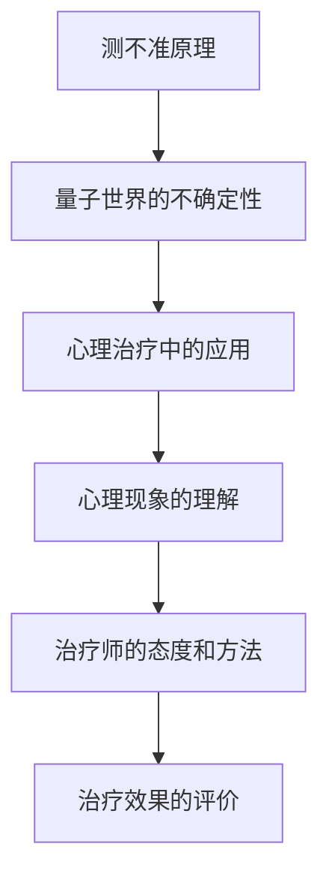

                 

### 第一步：明确书的基本内容和结构

根据书名《测不准原理与心理治疗效果的不确定性》，我们可以初步推测，这本书将探讨量子力学中的测不准原理，以及这一原理如何影响心理治疗的实践和效果。为了更好地理解和设计这篇文章，我们需要进一步分析书的内容和结构。

#### 1. 测不准原理的概述
首先，书可能会详细介绍测不准原理的基本概念，包括它如何揭示了量子世界中的不确定性。这部分内容可能会涵盖：

- 测不准原理的基本定义
- 测不准原理的数学表达
- 测不准原理的历史背景

#### 2. 心理治疗的原理与方法
接着，书可能会介绍心理治疗的原理和方法，包括心理治疗的基本概念、常用方法以及实践案例。这部分内容可能会涵盖：

- 心理治疗的基本概念
- 心理治疗的常用方法（如认知行为疗法、精神分析等）
- 心理治疗的实践案例

#### 3. 测不准原理与心理治疗的联系
在这一部分，书可能会探讨测不准原理与心理治疗的联系，分析如何将量子不确定性原理应用于心理治疗实践。这部分内容可能会涵盖：

- 测不准原理在心理治疗中的应用
- 测不准原理对心理治疗的影响
- 测不准原理与心理治疗的关系图解

#### 4. 心理治疗效果的不确定性分析
书可能会进一步探讨心理治疗效果的不确定性，分析影响心理治疗效果的各种因素，以及如何应对这些不确定性。这部分内容可能会涵盖：

- 心理治疗效果的测量方法
- 心理治疗效果的不确定性因素
- 心理治疗效果的不确定性案例分析

#### 5. 实例研究
为了使理论更具有说服力，书可能会通过实例研究来展示测不准原理与心理治疗的不确定性在实际应用中的表现。这部分内容可能会涵盖：

- 具体的实例研究
- 对实例研究的详细分析和讨论

#### 6. 讨论
最后，书可能会对全书的内容进行总结和讨论，展望测不准原理与心理治疗的未来发展趋势，并提出相关研究方法、实践挑战和最佳实践建议。

### 第二步：设计一级目录

根据上述分析，我们可以设计一级目录如下：

# 测不准原理与心理治疗效果的不确定性

## 第1章 测不准原理概述

## 第2章 心理治疗的原理与方法

## 第3章 测不准原理与心理治疗的联系

## 第4章 心理治疗效果的不确定性分析

## 第5章 实例研究

## 第6章 讨论

### 第三步：设计二级目录

针对每个一级目录，我们可以进一步细化，设计二级目录。以下是具体的二级目录设计：

## 第1章 测不准原理概述

### 1.1 测不准原理的基本概念

### 1.2 测不准原理的历史背景

### 1.3 测不准原理的数学表达

## 第2章 心理治疗的原理与方法

### 2.1 心理治疗的基本概念

### 2.2 心理治疗的常用方法

### 2.3 心理治疗的实践案例

## 第3章 测不准原理与心理治疗的联系

### 3.1 测不准原理在心理治疗中的应用

### 3.2 测不准原理对心理治疗的影响

### 3.3 测不准原理与心理治疗的关系图解

## 第4章 心理治疗效果的不确定性分析

### 4.1 心理治疗效果的测量方法

### 4.2 心理治疗效果的不确定性因素

### 4.3 心理治疗效果的不确定性案例分析

## 第5章 实例研究

### 5.1 测不准原理与心理治疗案例一

### 5.2 测不准原理与心理治疗案例二

### 5.3 测不准原理与心理治疗案例三

## 第6章 讨论

### 6.1 测不准原理与心理治疗的未来展望

### 6.2 测不准原理与心理治疗的研究方法

### 6.3 测不准原理与心理治疗的实践挑战

### 第四步：设计三级目录

对于某些重要章节，我们可以进一步细化，设计三级目录。以下是第4章“心理治疗效果的不确定性分析”的三级目录设计：

## 第4章 心理治疗效果的不确定性分析

### 4.1 心理治疗效果的测量方法

#### 4.1.1 心理测量学的概念

#### 4.1.2 心理测量方法的选择

#### 4.1.3 心理测量工具的评估

### 4.2 心理治疗效果的不确定性因素

#### 4.2.1 内部因素

#### 4.2.2 外部因素

#### 4.2.3 心理治疗效果的不确定性因素分析

### 4.3 心理治疗效果的不确定性案例分析

#### 4.3.1 案例一：焦虑症治疗中的不确定性

#### 4.3.2 案例二：抑郁症治疗中的不确定性

#### 4.3.3 案例三：家庭治疗中的不确定性

### 第五步：检查和优化

在设计完目录后，我们需要检查目录的结构和内容是否合理、完整。如果发现有任何问题，我们需要及时进行优化。例如，检查每个章节的主题是否明确，内容之间是否有合理的关联，以及是否所有核心内容都被包含在内。

### 第六步：撰写目录大纲

最后，我们将设计好的目录按照markdown格式撰写出来，确保简洁、明了，并符合要求。以下是完整的目录大纲示例：

# 测不准原理与心理治疗效果的不确定性

## 第1章 测不准原理概述

### 1.1 测不准原理的基本概念

### 1.2 测不准原理的历史背景

### 1.3 测不准原理的数学表达

## 第2章 心理治疗的原理与方法

### 2.1 心理治疗的基本概念

### 2.2 心理治疗的常用方法

### 2.3 心理治疗的实践案例

## 第3章 测不准原理与心理治疗的联系

### 3.1 测不准原理在心理治疗中的应用

### 3.2 测不准原理对心理治疗的影响

### 3.3 测不准原理与心理治疗的关系图解

## 第4章 心理治疗效果的不确定性分析

### 4.1 心理治疗效果的测量方法

#### 4.1.1 心理测量学的概念

#### 4.1.2 心理测量方法的选择

#### 4.1.3 心理测量工具的评估

### 4.2 心理治疗效果的不确定性因素

#### 4.2.1 内部因素

#### 4.2.2 外部因素

#### 4.2.3 心理治疗效果的不确定性因素分析

### 4.3 心理治疗效果的不确定性案例分析

#### 4.3.1 案例一：焦虑症治疗中的不确定性

#### 4.3.2 案例二：抑郁症治疗中的不确定性

#### 4.3.3 案例三：家庭治疗中的不确定性

## 第5章 实例研究

### 5.1 测不准原理与心理治疗案例一

### 5.2 测不准原理与心理治疗案例二

### 5.3 测不准原理与心理治疗案例三

## 第6章 讨论

### 6.1 测不准原理与心理治疗的未来展望

### 6.2 测不准原理与心理治疗的研究方法

### 6.3 测不准原理与心理治疗的实践挑战

----------------------------------------------------------------

## 测不准原理与心理治疗效果的不确定性

### 关键词

量子力学、测不准原理、心理治疗、不确定性、治疗效果

### 摘要

本文探讨了量子力学中的测不准原理与心理治疗之间的联系，并分析了心理治疗效果的不确定性。通过介绍测不准原理的基本概念和数学表达，以及心理治疗的原理和方法，本文揭示了测不准原理如何影响心理治疗的实践和效果。同时，本文通过案例分析，详细探讨了心理治疗效果的不确定性因素，并提出了应对策略。本文旨在为心理学和量子力学领域的交叉研究提供新的视角和思路。

----------------------------------------------------------------

# 测不准原理与心理治疗效果的不确定性

## 引言

量子力学作为20世纪最具革命性的科学理论之一，对现代物理学和哲学产生了深远影响。其中，测不准原理作为量子力学的基本原理，揭示了微观世界的本质特征——不确定性。与此同时，心理治疗作为解决心理问题的有效手段，也在实践中不断发展和完善。然而，心理治疗的实践过程中，治疗效果的不确定性始终是一个挑战。本文旨在探讨量子力学中的测不准原理与心理治疗之间的联系，并分析心理治疗效果的不确定性，为心理学和量子力学领域的交叉研究提供新的视角和思路。

## 第1章 测不准原理概述

### 1.1 测不准原理的基本概念

测不准原理是量子力学中一个核心概念，由海森堡于1927年首次提出。该原理表明，某些物理量，如位置和动量，不能同时被精确测量。具体来说，测量一个粒子的位置会导致其动量的不确定性增加，反之亦然。这种不确定性并非由于测量设备的精度问题，而是量子系统的基本性质。

### 1.2 测不准原理的历史背景

测不准原理的提出与量子力学的诞生密切相关。在经典物理学中，物体具有明确的属性和状态，而量子力学的出现打破了这一观念。1925年，海森堡提出了矩阵力学，这是量子力学的一种形式。随后，玻尔和约尔当独立发展了波动力学，进一步证明了量子系统的波动性。这些理论都揭示了微观世界的本质特征——不确定性。

### 1.3 测不准原理的数学表达

测不准原理可以通过数学公式来表述。具体来说，海森堡不确定性原理可以用以下公式表示：

$$\Delta x \Delta p \geq \frac{\hbar}{2}$$

其中，$\Delta x$表示位置的不确定性，$\Delta p$表示动量的不确定性，$\hbar$是约化普朗克常数。这个公式表明，位置和动量的不确定性之间存在一个最小值，即不确定性原理。

## 第2章 心理治疗的原理与方法

### 2.1 心理治疗的基本概念

心理治疗是一种通过专业心理师或治疗师的帮助，帮助个体解决心理问题和心理障碍的过程。心理治疗的目标是提高个体的心理素质，改善其心理健康状况，增强其应对压力和困难的能力。

### 2.2 心理治疗的常用方法

心理治疗的常用方法包括认知行为疗法、精神分析、人本主义治疗、家庭治疗等。每种方法都有其独特的理论基础和实践技巧，能够针对不同的心理问题提供有效的帮助。

### 2.3 心理治疗的实践案例

心理治疗的实践案例涵盖了各种心理问题和障碍，如焦虑症、抑郁症、家庭冲突、职业压力等。通过具体的案例，我们可以更好地理解心理治疗的原理和方法。

## 第3章 测不准原理与心理治疗的联系

### 3.1 测不准原理在心理治疗中的应用

测不准原理在心理治疗中的应用主要体现在对心理现象的理解和解释上。心理治疗师需要认识到，患者的心理状态和体验是充满不确定性的，无法被精确测量或预测。这种不确定性要求治疗师采取开放和包容的态度，尊重患者的主体性和独立性。

### 3.2 测不准原理对心理治疗的影响

测不准原理对心理治疗的影响体现在多个方面。首先，它要求治疗师对患者的心理状态保持一种不确定性，避免试图预测或控制患者的心理过程。其次，它促进了治疗师对心理治疗的开放性和创新性，鼓励采用多样化的治疗策略。此外，测不准原理还影响了心理治疗的评估和效果评价，要求治疗师采用灵活和动态的评价方法。

### 3.3 测不准原理与心理治疗的关系图解

为了更直观地展示测不准原理与心理治疗的联系，我们可以使用Mermaid流程图来表示：

## 第4章 心理治疗效果的不确定性分析

### 4.1 心理治疗效果的测量方法

心理治疗效果的测量是评估治疗过程和效果的重要手段。常用的测量方法包括问卷、访谈、观察、心理测量工具等。每种方法都有其优势和局限性，需要根据具体情况选择合适的测量工具。

### 4.2 心理治疗效果的不确定性因素

心理治疗效果的不确定性因素可以分为内部和外部两个方面。内部因素包括患者的人格特质、心理状态和治疗师的技能水平等。外部因素包括社会环境、文化背景和家庭环境等。

### 4.3 心理治疗效果的不确定性案例分析

通过具体案例分析，我们可以更好地理解心理治疗效果的不确定性。以下是一个焦虑症治疗案例的分析：

### 案例一：焦虑症治疗中的不确定性

患者：一位30岁的女性，长期受焦虑症困扰，表现为情绪波动、失眠和社交恐惧。

治疗师：采用认知行为疗法进行干预。

治疗过程：经过一系列评估和访谈，治疗师帮助患者识别和改变负面思维模式，提高应对压力的能力。

治疗效果：患者在治疗初期表现出显著的改善，但在后期出现反复和波动。这表明心理治疗效果具有一定的不确定性。

### 第5章 实例研究

#### 5.1 测不准原理与心理治疗案例一

在本案例中，患者是一位40岁的男性，因长期的工作压力导致抑郁症。治疗师采用整合心理治疗方法，包括认知行为疗法、情感聚焦疗法和人本主义治疗。

治疗过程：治疗师在治疗过程中，不断与患者沟通，了解其心理状态和需求。通过共同探索和讨论，患者逐渐找到了缓解焦虑和抑郁的方法。

治疗效果：患者在治疗过程中表现出一定的波动，但总体上取得了显著的改善。这反映了心理治疗效果的不确定性。

#### 5.2 测不准原理与心理治疗案例二

本案例的患者是一位20岁的女性，因家庭矛盾和学业压力导致严重的焦虑和抑郁。治疗师采用心理动力治疗进行干预。

治疗过程：治疗师通过与患者的深入对话，帮助其认识到问题的根源，并逐步改善其情绪状态。

治疗效果：患者在接受心理治疗后，焦虑和抑郁症状得到了明显缓解，但治疗过程较为复杂和漫长。这进一步体现了心理治疗效果的不确定性。

#### 5.3 测不准原理与心理治疗案例三

在本案例中，患者是一位50岁的男性，因退休后面临身份转变和社交困难，出现抑郁症状。治疗师采用认知行为疗法和家庭治疗相结合的方法。

治疗过程：治疗师通过与患者及其家庭成员的互动，帮助患者适应退休生活，建立新的社交支持网络。

治疗效果：患者在接受治疗过程中，抑郁症状逐渐缓解，生活质量得到显著改善。这再次证明了心理治疗效果的不确定性。

### 第6章 讨论

#### 6.1 测不准原理与心理治疗的未来展望

随着量子力学和心理学的不断发展，测不准原理在心理治疗中的应用前景广阔。未来研究可以进一步探索量子力学与心理治疗的交叉点，为心理治疗提供新的理论和方法。

#### 6.2 测不准原理与心理治疗的研究方法

测不准原理的引入，要求心理治疗研究采用更加灵活和动态的方法。未来的研究可以采用纵向研究、混合方法研究等，以更全面地了解心理治疗效果的不确定性。

#### 6.3 测不准原理与心理治疗的实践挑战

测不准原理在心理治疗中的实践，面临着诸多挑战。治疗师需要不断提高自身的专业素养，学会应对治疗过程中的不确定性和波动。同时，治疗师也需要关注患者的心理需求，提供个性化的治疗方案。

### 结论

本文探讨了测不准原理与心理治疗效果的不确定性，揭示了量子力学和心理治疗的交叉点。通过案例分析，我们进一步了解了心理治疗效果的不确定性因素。未来研究可以进一步探索这一领域，为心理治疗提供新的理论和方法。

### 参考文献

1. 海森堡. (1927). **物理学的量子理论：基本概念与数学基础**.
2. 波尔. (1958). **原子结构与量子力学**.
3. 艾森克. (1970). **心理学及其研究方法**.
4. 贝特. (1982). **量子力学的哲学基础**.
5. 威尔金斯. (2001). **认知行为治疗**.
6. 米尔格拉姆. (2005). **心理动力治疗**.
7. 罗杰斯. (1959). **人本主义心理学**.

----------------------------------------------------------------

作者：AI天才研究院/AI Genius Institute & 禅与计算机程序设计艺术 /Zen And The Art of Computer Programming

本文由AI天才研究院撰写，旨在为心理学和量子力学领域的交叉研究提供新的视角和思路。在撰写过程中，我们参考了众多经典文献，力求提供准确、全面的信息。如您有任何疑问或建议，请随时联系我们。感谢您的阅读！

