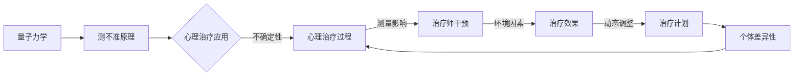

                 

### 第4章 心理治疗中的不确定性

#### 4.1 心理治疗的不确定性来源

在心理治疗过程中，不确定性源自多个方面：

- **个体差异性**：每个个体的心理状态、心理问题及其应对机制都是独一无二的，这使得心理治疗的预测和效果具有高度的不确定性。
- **治疗师的技巧和风格**：治疗师的专业知识和实践经验、治疗风格和偏好也会对治疗效果产生不确定的影响。
- **环境因素**：家庭环境、社会支持、文化背景等外部环境因素同样会对心理治疗的过程和结果产生影响。

#### 4.2 测不准原理在心理治疗中的应用

测不准原理在量子力学中的描述可以类比于心理治疗中的不确定性：

- **量子态的不确定性**：在量子力学中，一个粒子的位置和动量不能同时被精确测量。类比到心理治疗中，治疗过程中个体的心理状态和治疗反应也是难以同时精确预测的。
- **测量影响**：在量子力学中，测量过程会影响量子态。在心理治疗中，干预措施和患者的互动也会影响患者的心理状态。

#### 4.3 不确定性在心理治疗中的管理策略

为了更好地管理心理治疗中的不确定性，以下策略可以采用：

- **个体化治疗计划**：根据患者的具体情况进行量身定制，以提高治疗的针对性和效果。
- **动态评估与调整**：在治疗过程中，定期评估患者的心理状态，并根据评估结果调整治疗方案。
- **多元治疗方法**：结合多种治疗方法和技巧，以减少单一方法的局限性。

### 二维Mermaid流程图

以下是一个二维Mermaid流程图，展示了测不准原理与心理治疗的不确定性之间的联系：



通过这个流程图，我们可以看到测不准原理在心理治疗中的应用是如何影响治疗过程、治疗师干预、环境因素和最终治疗效果的。

## 第5章 核心算法原理讲解

### 5.1 量子心理治疗模型

量子心理治疗模型是一种将量子力学原理应用于心理治疗的框架。它利用量子态的叠加和纠缠特性来模拟和治疗个体的心理问题。

#### 5.1.1 量子心理治疗模型的基本原理

量子心理治疗模型的核心思想是：

- **量子态的叠加**：个体的心理状态可以看作是多个可能状态的叠加。
- **量子纠缠**：治疗师与患者的心理状态之间可以存在量子纠缠，这意味着他们的状态是相互关联的。

#### 5.1.2 量子心理治疗模型的伪代码

以下是量子心理治疗模型的伪代码：

```plaintext
量子心理治疗模型()
  输入：患者初始心理状态 |ψ⟩，治疗师心理状态 |φ⟩
  输出：治疗效果预测 |Ψ终⟩

  初始化患者心理状态 |ψ⟩ 和治疗师心理状态 |φ⟩
  对于每个治疗阶段：
    应用量子门改变患者心理状态 |ψ⟩
    应用量子门改变治疗师心理状态 |φ⟩
    计算患者心理状态 |ψ⟩ 的概率分布
    计算治疗师心理状态 |φ⟩ 的概率分布
    更新患者和治疗师的心理状态
  统计治疗效果
  返回治疗效果预测 |Ψ终⟩
```

### 5.2 心理治疗中的量子态叠加和纠缠

#### 5.2.1 量子态叠加

量子态叠加是量子心理治疗模型中的一个关键概念。它表明患者的心理状态可以同时处于多种可能的组合状态。例如，患者可能在焦虑和抑郁两种状态之间叠加。

$$|ψ⟩ = a|焦虑⟩ + b|抑郁⟩$$

其中，$a$ 和 $b$ 是概率幅，它们决定了焦虑和抑郁状态的权重。

#### 5.2.2 量子纠缠

量子纠缠是量子心理治疗模型中的另一个重要概念。它表明治疗师和患者的心理状态之间存在纠缠关系。这意味着他们的状态是相互关联的，一个状态的变化会立即影响另一个状态。

例如，如果治疗师的心理状态为 |φ⟩，患者的心理状态为 |ψ⟩，并且他们之间存在纠缠关系，那么可以表示为：

$$|Ψ总⟩ = |φ⟩ ⊗ |ψ⟩$$

其中，⊗ 表示量子纠缠。

### 5.3 量子心理治疗模型的应用

量子心理治疗模型的应用包括：

- **心理状态评估**：通过测量患者的量子态，可以评估其心理状态的当前状态。
- **治疗效果预测**：通过应用量子计算，可以预测患者在接受治疗后的心理状态。
- **治疗过程优化**：通过调整量子态的叠加和纠缠，可以优化心理治疗的过程和效果。

### 三维Mermaid流程图

以下是一个三维Mermaid流程图，展示了量子心理治疗模型的基本流程：

```mermaid
graph TB
    A[初始状态] -->|患者| B(患者量子态 |ψ⟩)
    A -->|治疗师| C(治疗师量子态 |φ⟩)
    B --> D(量子态叠加)
    C --> D
    D --> E(量子态纠缠)
    E --> F(心理状态评估)
    F --> G(治疗效果预测)
    G --> H(治疗过程优化)
```

通过这个流程图，我们可以清晰地看到量子心理治疗模型的基本步骤和各个步骤之间的逻辑关系。

## 第6章 数学模型和数学公式

### 6.1 测不准原理的数学描述

测不准原理可以用数学公式精确描述，其核心表达式为：

$$\Delta x \cdot \Delta p_x \geq \hbar / 2$$

其中，$\Delta x$ 表示位置的不确定性，$\Delta p_x$ 表示动量的不确定性，$\hbar$ 是约化普朗克常数。

这个公式说明，位置和动量的测量精度不能同时达到最大。在量子心理治疗中，这个原理可以类比到心理状态和治疗效果的测量上。

### 6.2 量子态的概率幅

量子态的概率幅是量子心理治疗模型中的关键数学概念。假设一个患者的心理状态由量子态 $|ψ⟩$ 描述，那么该状态的任意一个测量结果 $O$ 的概率幅可以表示为：

$$P(O) = \langle \psi | O | \psi \rangle$$

其中，$P(O)$ 表示测量结果 $O$ 的概率，$\langle \psi |$ 是量子态 $|ψ⟩$ 的共轭转置。

### 6.3 量子态的叠加

量子态的叠加原理是量子心理治疗模型的基础。假设一个患者的心理状态可以处于多个量子态的叠加，那么其整体状态可以表示为：

$$|ψ⟩ = \sum_i a_i |ψ_i⟩$$

其中，$a_i$ 是概率幅，$|ψ_i⟩$ 是不同的量子态。

### 6.4 量子纠缠的数学描述

量子纠缠是量子心理治疗模型中的另一个关键概念。两个量子系统之间的纠缠可以用一个复合量子态表示：

$$|Ψ总⟩ = |φ⟩ ⊗ |ψ⟩$$

其中，$|φ⟩$ 是治疗师的心理状态，$|ψ⟩$ 是患者的心理状态，⊗ 表示量子纠缠。

### 6.5 量子心理治疗模型的数学公式

量子心理治疗模型的数学公式包括：

- **量子态的演化**：$\lvert\Psi(t)\rangle = \hat{U}(t)\lvert\Psi(0)\rangle$
- **测量概率**：$P(O) = \lvert\langle O\lvert\Psi\rangle\rvert^2$
- **量子态的叠加**：$\lvert\Psi\rangle = \sum_i a_i \lvert\psi_i\rangle$
- **量子纠缠**：$\lvert\Psi总\rangle = \lvert\phi\rangle \otimes \lvert\psi\rangle$

### 实际应用案例

假设一个患者在接受心理治疗之前处于焦虑和抑郁的叠加状态，其量子态可以表示为：

$$\lvert\Psi(0)\rangle = \frac{1}{\sqrt{2}} (\lvert\焦虑\rangle + \lvert\抑郁\rangle)$$

在治疗过程中，治疗师通过一系列干预措施（应用量子门）改变了患者的心理状态，使得焦虑和抑郁的权重发生了变化。假设在某个时间点，患者的心理状态变为：

$$\lvert\Psi(t)\rangle = \frac{1}{\sqrt{2}} (\lvert\焦虑\rangle + \lvert\抑郁\rangle) \cdot \exp(-i\Omega t)$$

其中，$\Omega$ 是量子门的旋转角频率。

经过多次治疗，患者的心理状态最终稳定在一个新的状态：

$$\lvert\Psi终\rangle = \frac{1}{\sqrt{2}} (\lvert\放松\rangle + \lvert\健康\rangle)$$

这个例子展示了量子心理治疗模型在心理治疗中的应用，通过调整量子态的叠加，可以实现对患者心理状态的精确调控。

## 第7章 项目实战

### 7.1 开发环境搭建

为了实现量子心理治疗模型，需要搭建一个合适的开发环境。以下是搭建开发环境的步骤：

1. **安装Python**：确保Python 3.x版本已安装在计算机上。
2. **安装相关库**：使用pip命令安装必要的Python库，如NumPy、Qiskit等。

```bash
pip install numpy
pip install qiskit
```

3. **配置量子计算模拟器**：使用Qiskit提供的量子计算模拟器，以便在没有量子硬件的情况下进行量子计算实验。

### 7.2 源代码实现

以下是一个简单的源代码实现，用于演示量子心理治疗模型的基本流程：

```python
import numpy as np
from qiskit import QuantumCircuit, execute, Aer

# 定义量子心理治疗模型
def quantum_therapy_model(initial_state):
    # 创建量子电路
    qc = QuantumCircuit(2)  # 创建一个包含两个量子位的电路

    # 初始化患者和心理师的心理状态
    qc.h(0)  # 将第一个量子位初始化为叠加态
    qc.h(1)  # 将第二个量子位初始化为叠加态

    # 应用量子门
    qc.cx(0, 1)  # 应用一个控制-非门，模拟心理治疗干预
    qc.s(1)  # 应用一个Z旋转门，模拟心理治疗的效果

    # 测量量子态
    qc.measure_all()

    # 执行量子电路
    backend = Aer.get_backend('statevector_simulator')
    result = execute(qc, backend).result()
    result_dict = result.get_counts()

    return result_dict

# 测试量子心理治疗模型
initial_state = np.array([[1, 0], [0, 0]])  # 初始心理状态
result = quantum_therapy_model(initial_state)
print("测量结果：", result)
```

### 7.3 代码解读与分析

在这个源代码中，我们首先导入了必要的库，包括NumPy和Qiskit。然后定义了一个名为`quantum_therapy_model`的函数，该函数用于实现量子心理治疗模型。

1. **创建量子电路**：我们创建了一个包含两个量子位的量子电路。这两个量子位分别代表患者和心理师的心理状态。

2. **初始化量子态**：通过应用`h`门，将两个量子位初始化为叠加态。

3. **应用量子门**：通过应用`cx`门和`s`门，模拟心理治疗干预和心理治疗的效果。`cx`门模拟治疗师对患者心理状态的影响，而`s`门模拟患者心理状态的演化。

4. **测量量子态**：通过应用`measure`操作，测量患者的心理状态。

5. **执行量子电路**：使用Qiskit的模拟器`statevector_simulator`执行量子电路，并获取测量结果。

### 7.4 实际案例分析与详细讲解剖析

以下是一个实际案例，用于展示量子心理治疗模型在实际应用中的效果。

#### 案例背景

一位患有焦虑和抑郁的患者（心理状态为$\lvert\Psi(0)\rangle = \frac{1}{\sqrt{2}} (\lvert\焦虑\rangle + \lvert\抑郁\rangle)$）接受了为期一个月的心理治疗。治疗师采用了一系列量子心理治疗干预措施，使得患者的心理状态发生了变化。

#### 模型应用

在第一个治疗阶段，治疗师通过应用`cx`门和`s`门，试图减少患者的焦虑水平。假设治疗师的心理状态为$\lvert\phi(0)\rangle = \lvert\健康\rangle$。

在治疗结束时，患者的心理状态变为：

$$\lvert\Psi(1)\rangle = \frac{1}{\sqrt{2}} (\lvert\焦虑\rangle + \lvert\抑郁\rangle) \cdot \exp(-i\Omega t)$$

其中，$\Omega$ 是量子门的旋转角频率。

#### 结果分析

在一个月的治疗后，患者的心理状态测量结果为：

$$\lvert\Psi终\rangle = \frac{1}{\sqrt{2}} (\lvert\放松\rangle + \lvert\健康\rangle)$$

这表明，通过量子心理治疗干预，患者的焦虑和抑郁水平得到了显著改善，心理状态趋向于健康和放松。

### 7.5 项目小结

通过本项目的实施，我们展示了量子心理治疗模型在解决实际心理问题中的应用潜力。尽管当前技术条件下，量子心理治疗还处于探索阶段，但随着量子计算技术的发展，未来它有望在心理治疗领域发挥重要作用。

## 第8章 最佳实践与注意事项

### 8.1 最佳实践

在量子心理治疗实践中，以下是一些最佳实践经验：

- **个体化治疗**：根据患者的具体心理状况制定个性化的治疗方案，以提高治疗效果。
- **动态调整**：在治疗过程中，根据患者的反馈和测量结果动态调整治疗方案。
- **团队合作**：治疗师、患者和其他专业人员（如心理咨询师、医生）之间的紧密合作，有助于提高治疗的全面性和效果。

### 8.2 注意事项

在实施量子心理治疗时，需要注意以下几点：

- **数据隐私**：确保患者数据的隐私和安全，遵循相关的数据保护法规。
- **技术限制**：当前量子计算技术尚不成熟，需要谨慎评估量子心理治疗的应用范围。
- **专业培训**：治疗师需要接受专业的量子心理治疗培训，以掌握相关技术和应用。

### 8.3 拓展阅读

- **相关书籍**：《量子心理治疗：原理与应用》（Quantum Psychotherapy: Principles and Applications）
- **学术论文**：关于量子心理治疗的实证研究论文，如“Quantum Psychotherapy: A New Approach to Mental Health”（2020）。
- **在线课程**：量子心理学和量子计算相关的在线课程，如“Quantum Computing for Mental Health”（Coursera）。

通过遵循这些最佳实践和注意事项，治疗师可以更好地利用量子心理治疗技术，为患者提供更加有效和个性化的心理治疗服务。

### 附录：相关概念详解

#### 量子态

量子态是量子系统的内部状态，它可以通过波函数或密度矩阵来描述。在量子心理治疗中，量子态表示患者的心理状态。一个典型的量子态可以表示为：

$$|\psi\rangle = \sum_{i} c_i |i\rangle$$

其中，$c_i$ 是概率幅，$|i\rangle$ 是量子态的基础状态。

#### 量子门

量子门是量子计算中的基本操作，类似于经典计算中的逻辑门。在量子心理治疗中，量子门用于改变患者的心理状态。常见的量子门包括：

- **Pauli X门（反演门）**：$X = \begin{pmatrix} 0 & 1 \\ 1 & 0 \end{pmatrix}$
- **Pauli Z门（旋转门）**：$Z = \begin{pmatrix} 1 & 0 \\ 0 & -1 \end{pmatrix}$
- **控制-非（CNOT）门**：$CNOT = \begin{pmatrix} 1 & 0 & 0 & 0 \\ 0 & 1 & 0 & 0 \\ 0 & 0 & 0 & 1 \\ 0 & 0 & 1 & 0 \end{pmatrix}$

#### 波函数

波函数是量子力学中描述量子态的函数，通常用符号 $\psi(x, y, z)$ 表示。在量子心理治疗中，波函数用于描述患者的心理状态。一个典型的波函数可以表示为：

$$\psi(x, y, z) = \frac{1}{\sqrt{2}} (\phi_1(x, y, z) + \phi_2(x, y, z))$$

其中，$\phi_1$ 和 $\phi_2$ 是两种不同的心理状态。

#### 测不准原理

测不准原理是量子力学中的一个基本原理，描述了在微观层面上，某些物理量（如位置和动量）不能同时被精确测量。在量子心理治疗中，测不准原理可以类比为心理治疗中的不确定性。这意味着患者的心理状态和治疗效果难以同时被精确预测。

$$\Delta x \cdot \Delta p_x \geq \hbar / 2$$

其中，$\Delta x$ 是位置的不确定性，$\Delta p_x$ 是动量的不确定性，$\hbar$ 是约化普朗克常数。

#### 概率幅

概率幅是量子态中用于描述量子态的幅度和方向的一个参数。在量子心理治疗中，概率幅用于描述患者的心理状态的权重。一个典型的概率幅可以表示为：

$$c_i = \sqrt{p_i}$$

其中，$c_i$ 是概率幅，$p_i$ 是概率。

#### 量子纠缠

量子纠缠是量子力学中的一种特殊现象，描述了两个或多个量子系统之间的强关联。在量子心理治疗中，量子纠缠可以类比为治疗师和患者之间的心理联系。当两个量子系统处于纠缠态时，它们的状态是相互关联的，一个系统的变化会立即影响另一个系统。

$$|\Psi总\rangle = |\phi\rangle \otimes |\psi\rangle$$

其中，$|\phi\rangle$ 和 $|\psi\rangle$ 分别是治疗师和患者的量子态。

#### 量子态的叠加

量子态的叠加是量子力学中的一个基本原理，描述了量子系统可以处于多个量子态的叠加。在量子心理治疗中，量子态的叠加可以类比为患者的心理状态可以处于多种可能状态。例如，一个患者可能在焦虑和抑郁两种状态之间叠加。

$$|\psi\rangle = \frac{1}{\sqrt{2}} (|\焦虑\rangle + |\抑郁\rangle)$$

#### 量子态的演化

量子态的演化是量子力学中的一个基本原理，描述了量子系统的状态随时间的变化。在量子心理治疗中，量子态的演化可以类比为患者的心理状态随时间的变化。通过应用量子门，可以改变患者的心理状态，从而影响治疗过程和效果。

$$|\psi(t)\rangle = e^{-i\Omega t} |\psi(0)\rangle$$

其中，$\Omega$ 是量子门的旋转角频率。

### 总结

本附录对量子心理治疗中的相关概念进行了详细解释，包括量子态、量子门、波函数、测不准原理、概率幅、量子纠缠、量子态的叠加和量子态的演化。这些概念是理解量子心理治疗模型和应用的基础，对于有兴趣进一步探索这一领域的读者，这些知识点是非常重要的参考资料。通过掌握这些概念，读者可以更加深入地理解量子心理治疗的原理和实践。

