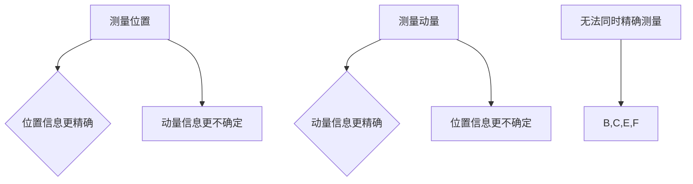

                 

### 1.1 测不准原理概述

#### 1.1.1 测不准原理的基本概念

测不准原理是量子力学的一个基本原理，由海森堡在1927年首次提出。这一原理的核心思想是，我们不能同时精确地测量一个粒子的位置和动量。具体来说，如果我们试图测量一个粒子的位置，其动量的不确定性将会增大；相反，如果我们测量一个粒子的动量，其位置的不确定性将会增大。用海森堡自己的话来说，即：

$$ \Delta x \Delta p_x \geq \frac{h}{4\pi} $$

其中，$\Delta x$ 表示位置的不确定性，$\Delta p_x$ 表示动量的不确定性，$h$ 是普朗克常数。

**Mermaid流程图：**



**伪代码：**

```python
def uncertainty_Principle(position, momentum):
    position_error = calculate_error(position)
    momentum_error = calculate_error(momentum)
    uncertainty = position_error * momentum_error
    return uncertainty
```

#### 1.1.2 测不准原理的历史背景

测不准原理的提出，是量子力学发展史上的一个重大里程碑。在此之前，经典力学对微观粒子的描述已经达到了一个相对完备的境界。然而，随着量子理论的逐渐发展，科学家们逐渐发现，经典力学的描述在微观尺度上并不适用。为了解释这些现象，海森堡提出了测不准原理。

测不准原理的提出，源于对电子轨道问题的研究。在经典力学中，电子在原子核周围的运动被描述为一个确定的轨道。然而，根据量子力学的观点，电子的运动状态是由一个波函数来描述的，而不是一个固定的轨道。波函数的平方给出了电子在空间中的概率分布，而不是具体的轨道。

**LaTeX数学公式：**

$$ \psi(x, y, z) \rightarrow |\psi(x, y, z)|^2 $$

其中，$\psi(x, y, z)$ 表示波函数，$|\psi(x, y, z)|^2$ 表示电子在空间中的概率密度。

测不准原理的提出，不仅改变了我们对微观世界的认识，也推动了量子力学的发展。它揭示了量子世界与经典世界之间的本质差异，使我们开始从新的角度思考问题。

---

通过上述内容，我们对测不准原理的基本概念和历史背景有了初步的了解。在下一节中，我们将深入探讨量子心理学的理论框架，以及如何将量子力学的原理应用于心理学研究中。

