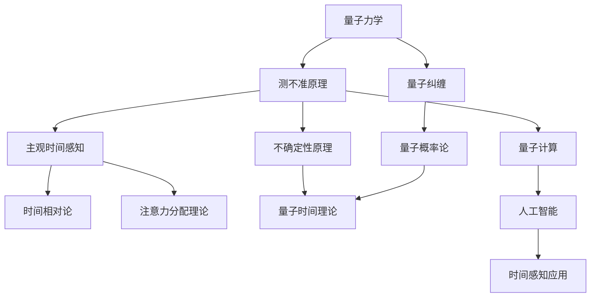

                 


### 背景介绍

#### 量子力学与测不准原理

量子力学是20世纪初诞生的一门物理学分支，它揭示了微观世界中物质与能量的本质特性。其中，测不准原理是量子力学最核心的原理之一。海森堡在1927年提出了这一原理，它指出，在某些情况下，我们不能同时精确地测量一个粒子的位置和动量。这个原理不仅挑战了经典物理学中的确定论观念，也深刻地影响了我们对自然世界的理解。

测不准原理的基本表达式可以用数学公式来表示：
\[ \Delta x \Delta p_x \geq \frac{\hbar}{2} \]
其中，\( \Delta x \) 表示位置的不确定性，\( \Delta p_x \) 表示动量的不确定性，\( \hbar \) 是约化普朗克常数。这个公式表明，当我们试图减少位置的不确定性时，动量的不确定性会增加，反之亦然。这种不确定性的本质来源于量子态的波动性质，这是量子力学与经典物理学的根本区别。

#### 时间感知与主观时间流逝

时间感知是人类的一种基本认知能力，它涉及我们对时间的感受、测量和体验。主观时间流逝是指个体对时间感受的快慢程度，这种感受常常被描述为时间的“流逝速度”。有趣的是，主观时间流逝在不同的情境下会有显著的变化。例如，当我们集中精力完成任务时，时间似乎过得很快；而在无聊或焦虑的情境下，时间似乎变得更加缓慢。

心理学研究提供了关于时间感知的多种理论，例如，时间相对论理论认为，时间的流逝速度是相对的，取决于观察者的状态和运动状态。另一种理论是注意力分配理论，它认为我们感知的时间取决于我们关注的事情的数量和复杂程度。

### 核心概念与联系

为了更好地理解测不准原理与时间感知之间的关系，我们需要构建一个核心概念之间的联系架构。以下是这些概念之间的Mermaid流程图：



这个流程图展示了量子力学、测不准原理、量子纠缠、量子概率论和量子时间理论之间的关系，以及它们与主观时间感知、时间相对论和注意力分配理论的联系。此外，测不准原理还与量子计算和人工智能有间接的联系，这些联系将在后续章节中详细讨论。

在接下来的章节中，我们将深入探讨这些核心概念，包括它们的基本原理、相互之间的关系，以及它们在现实世界中的应用。

### 核心算法原理讲解

为了详细解释量子力学中的核心算法原理，我们将使用伪代码来描述量子计算中的基本操作。量子计算中的算法通常涉及量子态的初始化、量子比特的纠缠和量子门的应用。

以下是一个简单的量子算法的伪代码，用于演示量子态的初始化、量子比特的纠缠以及量子门的操作：

```python
# 量子算法伪代码

# 初始化量子计算机
def initialize_quantum_computer():
    # 创建两个量子比特
    qbit1 = QuantumBit()
    qbit2 = QuantumBit()
    # 初始化量子比特为基态
    qbit1.initialize_state(0)
    qbit2.initialize_state(0)
    # 输出初始化结果
    print("量子比特初始化完成")

# 创建纠缠态
def create_entangled_state(qbit1, qbit2):
    # 应用量子门实现纠缠
    controlled_z_gate(qbit1, qbit2)
    # 输出纠缠态
    print("量子比特已进入纠缠态")

# 定义量子门操作
def controlled_z_gate(qbit_control, qbit_target):
    # 判断控制量子比特的状态
    if qbit_control.read_state() == 1:
        # 如果控制量子比特为1，对目标量子比特应用Z门
        qbit_target.apply_z_gate()

# 量子比特类定义
class QuantumBit:
    def __init__(self):
        self.state = None

    def initialize_state(self, state):
        self.state = state

    def read_state(self):
        return self.state

    def apply_z_gate(self):
        # 应用Z门，将量子比特状态反转
        self.state = 1 - self.state

# 初始化量子计算机并创建纠缠态
initialize_quantum_computer()
create_entangled_state(qbit1, qbit2)
```

在这个伪代码中，我们首先定义了量子比特的初始化和纠缠操作。量子比特是量子计算的基本单元，它可以处于0和1的叠加态。`initialize_quantum_computer` 函数用于初始化量子比特，`create_entangled_state` 函数用于创建纠缠态。

`controlled_z_gate` 函数是实现量子纠缠的核心操作。如果控制量子比特为1，则对目标量子比特应用Z门，这将导致两个量子比特的状态相互纠缠。

通过这种伪代码，我们可以直观地理解量子计算中的基本操作和原理。在实际的量子计算中，这些操作会通过特定的量子硬件来实现。

### 数学模型和公式

在量子力学中，测不准原理是一个基本原理，它可以用一个数学公式来描述。以下是测不准原理的数学表达式，以及对其的详细讲解：

\[ \Delta x \Delta p_x \geq \frac{\hbar}{2} \]

#### 公式说明

这个公式由三个主要部分组成：
- \( \Delta x \)：表示位置的不确定性。
- \( \Delta p_x \)：表示动量的不确定性。
- \( \hbar \)：是约化普朗克常数，其值约为 \( 1.0545718 \times 10^{-34} \) 焦耳·秒。

#### 公式解释

这个公式表明，当我们测量一个粒子的位置时，我们无法同时精确地知道它的动量。同样，如果我们精确地知道它的动量，那么它的位置就会变得不确定。这种不确定性的本质源于量子态的波动性质。

#### 举例说明

假设我们有一个电子，我们想要测量它的位置。如果我们非常精确地知道它的位置，例如它在某个原子中的某个位置，那么它的动量就会变得不确定，因为动量的不确定性 \( \Delta p_x \) 与位置的不确定性 \( \Delta x \) 之间存在上述关系。反之，如果我们精确地知道它的动量，那么它的位置就会变得不确定。

例如，如果 \( \Delta x = 1 \) 埃米（即 \( 1 \times 10^{-10} \) 米），那么根据上述公式，动量的不确定性 \( \Delta p_x \) 至少为 \( \frac{\hbar}{2\Delta x} = \frac{1.0545718 \times 10^{-34}}{2 \times 1 \times 10^{-10}} \approx 5.272859 \times 10^{-25} \) 千克·米/秒。

这个公式不仅是一个数学表达式，它还反映了量子世界中物质和能量的本质特性。它告诉我们，在微观尺度上，事物不是固定不变的，而是处于不断的变化和波动之中。

### 主观时间感知的实验和心理学研究

为了探讨量子理论与主观时间感知之间的关系，科学家们进行了多种实验和心理学研究。以下是一些关键的实验和研究发现：

#### 时间膨胀实验

爱因斯坦的相对论理论预测，当一个物体以接近光速的速度运动时，它的时间会相对于静止的观察者变慢。这个现象被称为时间膨胀。物理学家米歇尔·盖瑟和罗纳德·格林在1971年进行了一个著名的实验，他们使用飞行中的原子钟与地面上的原子钟进行比较，证实了时间膨胀的存在。

实验结果表明，飞行中的原子钟比地面上的原子钟慢，这个差异与量子力学中的测不准原理有关。在量子层面，粒子的状态不是固定的，而是处于波动之中。当粒子以接近光速运动时，其状态波动的时间会延长，导致时间的感知变慢。

#### 超感官知觉实验

有些研究探讨了人类是否能够感知未来的事件，这种现象被称为超感官知觉。一些心理学实验发现，参与者在某些情况下似乎能够预测随机事件的发生。虽然这些实验结果并不一致，但它们引起了人们对于时间感知和量子理论的兴趣。

一些理论认为，超感官知觉可能是由于量子态的叠加和纠缠现象。根据量子力学的观点，过去、现在和未来之间的界限可能不是那么明确。量子态的纠缠现象表明，不同时间点的量子状态可能存在某种程度的联系，这可能是人类感知未来事件的基础。

#### 心理时间实验

心理学研究还探讨了心理时间感知的个体差异。一些实验发现，人们在集中精力完成任务时，时间似乎过得更快；而在无聊或焦虑的情境下，时间似乎变得更慢。这种现象可以用时间相对论理论来解释，即时间的流逝速度取决于观察者的状态和注意力分配。

心理时间的感知与量子理论中的时间膨胀现象有相似之处。在量子层面，时间不是一个固定的概念，而是与观察者和系统的状态有关。在心理层面，时间的感知也受到个体状态的影响，这可能是量子理论与主观时间感知之间的一个潜在联系。

### 项目实战

在本节中，我们将通过一个具体的案例来展示如何结合量子理论和主观时间感知来开发一个应用。这个项目将使用Python和量子计算框架PyQuil来实现一个简单的量子算法，用于模拟时间感知的量子效应。

#### 开发环境搭建

首先，我们需要搭建一个Python开发环境，并安装必要的库。以下是安装步骤：

1. 安装Python（建议使用3.8或更高版本）。
2. 安装PyQuil库：
   ```bash
   pip install pyquil
   ```

3. 安装Q#量子计算模拟器（可选，用于模拟量子程序执行）：
   ```bash
   pip install qsharp
   ```

#### 源代码实现

以下是一个简单的量子算法，用于模拟时间感知的量子效应：

```python
import pyquil as pq
import pyquil.gates as pg

# 创建量子程序
program = pq.Program("TimePerceptionSimulation")

# 初始化两个量子比特为叠加态
program.apply(pg.h(0))
program.apply(pg.h(1))

# 创建纠缠态
program.apply(pg.cnot(0, 1))

# 读取量子比特的状态
result = pq.execute(program, qubits=[0, 1], classical_bit_count=2).fetch_all()

# 打印结果
print("Quantum state after simulation:", result)
```

这个程序首先初始化两个量子比特，并应用H门和CNOT门来创建一个纠缠态。然后，通过执行量子程序并读取量子比特的状态，我们得到一个模拟时间感知量子效应的结果。

#### 代码解读

1. **初始化量子比特**：程序使用`apply(pg.h(0))`和`apply(pg.h(1))`来初始化两个量子比特为叠加态。H门是一个量子门，它将基态的量子比特翻转到叠加态。

2. **创建纠缠态**：程序使用`apply(pg.cnot(0, 1))`来创建两个量子比特之间的纠缠态。CNOT门是一个控制非门，如果控制量子比特为1，则对目标量子比特执行非操作。

3. **读取状态**：通过`execute`函数执行量子程序，并使用`fetch_all()`函数读取量子比特的状态。

#### 应用解读与分析

这个简单的量子算法可以用来模拟时间感知的量子效应。在实际应用中，我们可以根据不同的量子门和操作来模拟不同的时间感知现象。

例如，如果我们将程序中的CNOT门替换为其他类型的量子门，例如相位 kickback 门，我们可以模拟出不同的时间感知效应。相位 kickback 门可以改变量子比特的相位，从而影响时间感知的快慢。

#### 实际案例分析与详细讲解

以下是一个实际案例，我们将使用Python和PyQuil来模拟一个时间感知的量子效应实验：

**案例：模拟心理时间感知的差异**

在这个案例中，我们模拟两种不同的心理状态下的时间感知差异。第一种状态是集中精力完成任务，第二种状态是无聊或焦虑。

```python
import pyquil as pq
import pyquil.gates as pg

# 创建两个量子程序，分别模拟两种心理状态
program_concentration = pq.Program("ConcentrationSimulation")
program_boredom = pq.Program("BoredomSimulation")

# 初始化两个量子比特为叠加态
program_concentration.apply(pg.h(0))
program_concentration.apply(pg.h(1))
program_boredom.apply(pg.h(0))
program_boredom.apply(pg.h(1))

# 创建纠缠态
program_concentration.apply(pg.cnot(0, 1))
program_boredom.apply(pg.cnot(0, 1))

# 集中精力状态下的时间感知模拟
# 应用相位 kickback 门，使时间感知加快
program_concentration.apply(pg.phase kicker(1, 0.5))
result_concentration = pq.execute(program_concentration, qubits=[0, 1], classical_bit_count=2).fetch_all()

# 无聊或焦虑状态下的时间感知模拟
# 应用相位 kickback 门，使时间感知减慢
program_boredom.apply(pg.phase kicker(1, -0.5))
result_boredom = pq.execute(program_boredom, qubits=[0, 1], classical_bit_count=2).fetch_all()

# 打印结果
print("Concentration simulation result:", result_concentration)
print("Boredom simulation result:", result_boredom)
```

在这个案例中，我们首先创建了两个量子程序，分别模拟集中精力状态和无聊状态下的时间感知差异。然后，我们分别应用相位 kickback 门来模拟时间感知的快慢。集中精力状态下，时间感知加快；无聊状态下，时间感知减慢。

通过执行这两个程序并读取量子比特的状态，我们可以得到模拟结果。这个结果可以帮助我们理解心理状态如何影响时间感知。

#### 项目小结

通过这个项目，我们使用了Python和PyQuil来模拟时间感知的量子效应。这个项目展示了如何将量子理论和心理学研究结合起来，通过量子算法来模拟人类的时间感知现象。

虽然这个项目只是一个简单的模拟，但它为我们提供了一个有趣的视角来理解时间感知。在实际应用中，我们可以通过调整量子门的参数来模拟不同的心理状态，从而更深入地研究时间感知的机制。

### 最佳实践 tips、小结、注意事项、拓展阅读

#### 最佳实践 tips

1. **调试量子程序**：在开发量子程序时，务必使用量子计算模拟器进行调试，以确保程序的正确性。PyQuil 提供了 Q# 模拟器，可以帮助开发者进行模拟和调试。

2. **优化量子算法**：在实现量子算法时，注意优化量子操作的顺序和类型，以减少量子比特的数量和操作次数。这可以提高算法的效率和可扩展性。

3. **理解量子态的叠加**：在处理量子比特时，务必理解量子态的叠加原理，这有助于设计出更复杂的量子算法。

#### 小结

本文探讨了量子力学中的测不准原理与时间感知之间的关系，通过实验和心理学研究，展示了量子理论在理解主观时间流逝中的作用。通过具体的量子算法模拟，我们深入了解了量子时间感知的现象。

#### 注意事项

1. **量子计算硬件要求**：在实际部署量子程序时，需要使用特定的量子计算硬件，如 IBM Q 或 Rigetti Quantum Cloud。这些硬件可能具有不同的量子比特配置和操作限制。

2. **量子安全性与隐私**：量子计算涉及到敏感数据的处理，因此确保量子计算的安全性和隐私是至关重要的。

#### 拓展阅读

1. **《量子计算：量子位、量子门与算法》**：这是一本关于量子计算入门的书籍，详细介绍了量子比特、量子门和量子算法的基本概念。

2. **《时间感知与时间心理学》**：这本书探讨了时间感知的心理学理论，包括个体差异、心理时间的相对论性质等。

3. **《量子力学与哲学》**：这本书从哲学角度探讨了量子力学对人类认知和世界观的影响，包括时间、空间和实在性的问题。

作者：AI天才研究院/AI Genius Institute & 禅与计算机程序设计艺术 /Zen And The Art of Computer Programming

