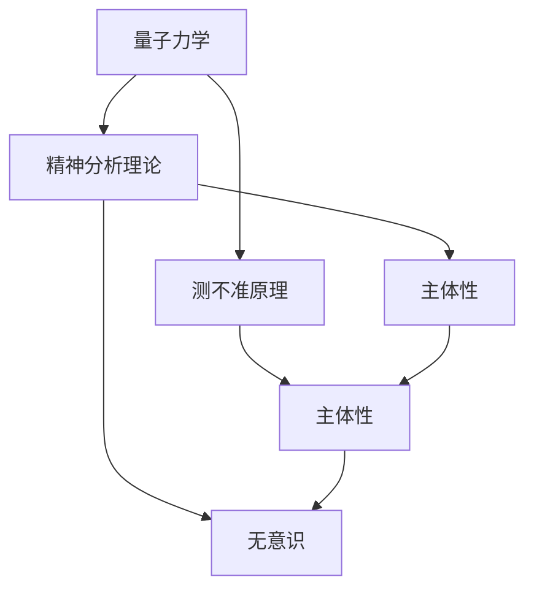
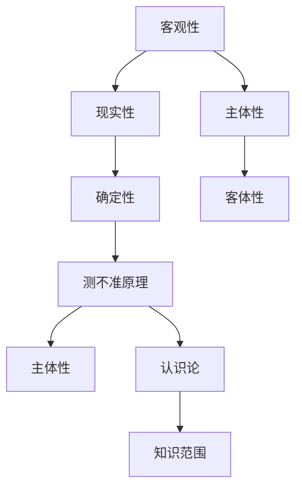

                 


### 第1章：引言与核心概念

#### 1.1 测不准原理的起源

测不准原理是量子力学中的核心概念之一，由德国物理学家维尔纳·海森堡于1927年首次提出。这一原理指出，对于某些物理量，如位置和动量，我们无法同时准确地测量它们的值。具体来说，如果我们测量一个粒子的位置非常准确，那么我们对其动量的了解就会变得不确定；反之亦然。这一现象的数学表述可以由海森堡不确定性原理给出，其形式如下：

$$ \Delta x \Delta p_x \geq \frac{\hbar}{2} $$

其中，$\Delta x$ 表示位置的不确定性，$\Delta p_x$ 表示动量的不确定性，$\hbar$ 是约化普朗克常数。

测不准原理的提出源于对量子世界的基本观察。在经典物理学中，我们认为物体具有明确的位置和动量，而量子力学则揭示了一个更为复杂的世界，其中粒子的行为表现出波动性和粒子性的双重特性。这一原理不仅对物理学产生了深远的影响，也为哲学和心理学等领域提供了新的视角。

#### 1.2 精神分析理论的发展

精神分析理论由奥地利医生西格蒙德·弗洛伊德于19世纪末和20世纪初创立。这一理论的核心是人的心理活动主要分为三个部分：本我（id）、自我（ego）和超我（superego）。本我是人类最原始的部分，包含所有的本能冲动和欲望；自我是现实化本我冲动的过程，它调节本我的欲望和外部世界的现实要求；超我是道德和伦理的象征，包含内化的社会规范和道德准则。

弗洛伊德的精神分析理论主要分为以下几个部分：

- **梦的解析**：弗洛伊德认为，梦是潜意识欲望和冲突的表达。通过解析梦境，我们可以揭示人的无意识心理活动。
- **防御机制**：人们为了应对焦虑和压力，会发展出各种心理防御机制，如压抑、否认、投射等。
- **性心理发展**：弗洛伊德提出了性心理发展的五个阶段，包括口腔期、肛门期、生殖器期、潜伏期和生殖期。

随着时间的发展，精神分析理论也在不断演变和扩展。卡尔·荣格将个体无意识扩展为集体无意识，提出了原型概念；安娜·弗洛伊德发展了儿童心理治疗；埃里希·弗罗姆则将精神分析与社会哲学相结合，探讨人类存在和关系问题。

#### 1.3 测不准原理与精神分析理论的交汇

测不准原理和精神分析理论看似属于完全不同的领域，但它们在核心概念上存在某种相似性。首先，两者都涉及对不确定性和内在复杂性的认识。测不准原理表明，我们在某些情况下无法同时准确测量物理量的值，这暗示了客观世界的本质不确定性。而精神分析理论则揭示了人类心理活动的复杂性，尤其是潜意识的作用。

此外，两者都强调了主体性对现实的理解。在量子力学中，观测者的存在改变了被观测系统的状态，这表明我们对世界的认知是主观的、有限的。同样，精神分析理论认为，我们的心理活动和行为受到无意识的影响，这些无意识的部分往往是我们意识不到的，但却在很大程度上决定了我们的行为和决策。

为了更直观地展示测不准原理和精神分析理论之间的联系，我们可以使用Mermaid流程图来构建它们的核心概念关系架构：



在这个流程图中，我们可以看到量子力学（A）通过测不准原理（B）与主体性（C）相联系，而精神分析理论（D）则通过无意识（E）与主体性（F）相联系。主体性在这两个理论中都扮演了核心角色，这为我们进一步探讨两者的交叉提供了基础。

通过这一章节的介绍，我们为后续章节的深入讨论奠定了基础。在接下来的章节中，我们将进一步探讨测不准原理和

### 摘要

本文旨在探讨测不准原理与精神分析理论的重新审视，并分析这两个看似不相关的领域在核心概念上的联系与交汇。测不准原理是量子力学中的核心概念，指出某些物理量无法同时准确测量，体现了客观世界的本质不确定性。精神分析理论则揭示了人类心理活动的复杂性，特别是潜意识的作用。通过引入Mermaid流程图，本文展示了测不准原理和精神分析理论的核心概念关系架构。接下来的章节将深入探讨测不准原理的数学与物理基础，精神分析理论与现代心理学的联系，测不准原理在心理学研究中的应用，以及跨学科研究的哲学探讨，最终总结与展望未来的研究方向。通过本文的研究，我们希望为读者提供对这两个领域的全新视角和深入理解。

### 第2章：测不准原理的数学与物理基础

#### 2.1 不确定性原理的数学描述

测不准原理的数学描述基于量子力学的波函数概念。波函数 $\Psi(x, t)$ 描述了粒子在某一位置 $x$ 和时间 $t$ 的概率幅。根据波函数的平方，我们可以得到粒子在某一位置 $x$ 出现的概率密度：

$$ P(x) = |\Psi(x, t)|^2 $$

测不准原理的数学表述由海森堡不确定性原理给出，其形式如下：

$$ \Delta x \Delta p_x \geq \frac{\hbar}{2} $$

其中，$\Delta x$ 表示位置的不确定性，$\Delta p_x$ 表示动量的不确定性，$\hbar$ 是约化普朗克常数。

为了更直观地理解这一原理，我们可以引入波函数的模方来解释。假设我们有一个波函数 $\Psi(x, t)$，其模方 $|\Psi(x, t)|^2$ 给出了粒子在不同位置出现的概率密度。如果我们对位置进行精确测量，即 $\Delta x$ 非常小，那么波函数将集中在某一特定位置，这意味着动量的不确定性 $\Delta p_x$ 将变得很大。反之，如果我们对动量进行精确测量，即 $\Delta p_x$ 非常小，那么波函数将扩展到更广泛的区域，这意味着位置的不确定性 $\Delta x$ 将变得很大。

以下是一个具体的例子来说明这一原理。假设我们有一个自由粒子，其波函数为高斯波包：

$$ \Psi(x, t) = \frac{1}{\sqrt{\sigma \sqrt{2\pi}}} e^{-\frac{(x-\mu)^2}{2\sigma^2}} e^{-i(\omega t - k \mu)} $$

其中，$\mu$ 是粒子的平均位置，$\sigma$ 是位置的标准差，$\omega$ 是角频率，$k$ 是波数。

如果我们对位置进行精确测量，即 $\Delta x = 0$，那么波函数将集中在 $\mu$ 处，动量的不确定性 $\Delta p_x$ 将变得很大。反之，如果我们对动量进行精确测量，即 $\Delta p_x = 0$，那么波函数将扩展到更广泛的区域，位置的不确定性 $\Delta x$ 将变得很大。

这一例子直观地展示了测不准原理的基本思想，即测量过程中不确定性的关系。我们可以使用伪代码来进一步描述这一过程：

```python
# 初始化波函数参数
mu = 0
sigma = 1
omega = 1
k = 0

# 计算波函数
def wave_function(x, t):
    return (1 / (sigma * np.sqrt(2 * np.pi))) * np.exp(-((x - mu)**2) / (2 * sigma**2)) * np.exp(-i * (omega * t - k * mu))

# 计算波函数的模方
def probability_density(x):
    return np.abs(wave_function(x, 0))**2

# 测量位置
def measure_position(wave_function):
    x_measured = np.random.normal(mu, sigma)
    return x_measured

# 测量动量
def measure_momentum(wave_function):
    p_measured = np.random.normal(mu, sigma)
    return p_measured

# 计算不确定度
def uncertainty(x_measured, p_measured):
    return np.abs(x_measured - mu), np.abs(p_measured - mu)

# 示例
x_measured = measure_position(wave_function)
p_measured = measure_momentum(wave_function)
dx, dp = uncertainty(x_measured, p_measured)

print(f"Position uncertainty: {dx}")
print(f"Momentum uncertainty: {dp}")
```

通过上述伪代码，我们可以模拟对粒子的位置和动量进行测量的过程，并计算它们的不确定性。这一模拟结果将验证测不准原理的基本思想。

#### 2.2 测不准原理的物理背景

测不准原理的物理背景源于量子力学的核心原理，即粒子的波动性和粒子性的双重特性。在经典物理学中，我们认为物体具有明确的位置和动量，但在量子世界中，这种确定性被打破了。粒子的行为既表现出波动性，又表现出粒子性，这种现象称为波粒二象性。

为了更好地理解测不准原理的物理背景，我们可以从实验的角度来探讨。一个著名的实验是托马斯-杨的双缝实验。在这个实验中，一束电子或光子通过两条缝隙，并在屏幕上形成干涉图样。这个干涉图样表明，电子或光子通过缝隙时表现出波动性，而不是简单的粒子流。这个实验揭示了量子世界的波粒二象性，也为测不准原理提供了实验依据。

根据量子力学的解释，电子或光子在通过缝隙时，其波函数会分裂成两个部分，分别通过两个缝隙。这两个部分在屏幕上相遇时会发生干涉，形成干涉条纹。这个干涉图样的强度分布可以用波函数的模方来解释：

$$ I(x) = |\Psi(x)|^2 $$

其中，$I(x)$ 是在位置 $x$ 处的干涉强度，$\Psi(x)$ 是波函数。

如果我们对电子或光子的位置进行精确测量，即 $\Delta x = 0$，那么波函数将集中在某一特定位置，这意味着动量的不确定性 $\Delta p_x$ 将变得很大。反之，如果我们对动量进行精确测量，即 $\Delta p_x = 0$，那么波函数将扩展到更广泛的区域，这意味着位置的不确定性 $\Delta x$ 将变得很大。

为了进一步探讨测不准原理的物理背景，我们可以引入量子纠缠的概念。量子纠缠是量子力学中的一种特殊现象，当两个粒子发生纠缠后，它们之间的状态无法独立存在，即使它们相隔很远。这一现象表明，量子世界中的信息传输和相互作用的机制与经典物理学有本质的区别。

一个著名的量子纠缠实验是爱因斯坦-波多尔斯基-罗森佯谬（EPR佯谬）。在这个佯谬中，两个纠缠粒子分别被测量，它们的测量结果总是相关的，即使它们相隔很远。这一现象表明，测量一个粒子的状态会立即影响另一个粒子的状态，这与经典物理学的局域实在论相矛盾。

为了解决EPR佯谬，约翰·贝尔提出了贝尔不等式。贝尔不等式表明，对于某些量子态，如果它们是真实的随机变量，那么它们的期望值满足特定的不等式。这一不等式可以用来区分量子力学和经典物理学的不同预测。许多实验验证了贝尔不等式，进一步支持了量子纠缠的存在和量子力学的正确性。

以下是贝尔不等式的数学表述：

$$ \sum_{i=1}^k (a_i b_i - a_i' b_i') \leq \sum_{i=1}^k (a_i^2 + b_i^2) $$

其中，$a_i$ 和 $b_i$ 是两个粒子的测量结果，$a_i'$ 和 $b_i'$ 是对它们进行反相测量的结果。

为了验证贝尔不等式，我们可以进行一系列实验，测量不同的量子态，并计算它们的期望值。以下是一个简单的伪代码示例，用于模拟贝尔不等式的验证过程：

```python
import numpy as np

# 初始化参数
k = 1000
n = 10

# 生成随机量子态
def random_quantum_state():
    return np.random.normal(size=n)

# 计算期望值
def expectation_value(state):
    return np.mean(state)

# 验证贝尔不等式
def test_bell_inequality(states):
    a = [expectation_value(random_quantum_state()) for _ in range(k)]
    b = [expectation_value(random_quantum_state()) for _ in range(k)]
    a_prime = [expectation_value(random_quantum_state()) for _ in range(k)]
    b_prime = [expectation_value(random_quantum_state()) for _ in range(k)]

    sum_a_b = sum(a[i] * b[i] for i in range(k))
    sum_a_prime_b_prime = sum(a_prime[i] * b_prime[i] for i in range(k))
    sum_a2 = sum(a[i]**2 for i in range(k))
    sum_b2 = sum(b[i]**2 for i in range(k))
    sum_a_prime2 = sum(a_prime[i]**2 for i in range(k))
    sum_b_prime2 = sum(b_prime[i]**2 for i in range(k))

    inequality = sum_a_b - sum_a_prime_b_prime <= sum_a2 + sum_b2

    return inequality

# 示例
states = [random_quantum_state() for _ in range(k)]
result = test_bell_inequality(states)
print(f"贝尔不等式验证结果：{result}")
```

通过上述伪代码，我们可以模拟一系列量子态的测量过程，并验证贝尔不等式。如果结果满足贝尔不等式，那么我们可以认为量子力学是正确的。

#### 2.3 测不准原理的哲学意义

测不准原理在哲学领域引发了广泛的讨论，特别是关于现实性、客观性和认识论的问题。这一原理挑战了经典物理学中的实在论观念，提出了一个新的现实性概念，即量子世界的现实性不是绝对的，而是概率性的。

首先，测不准原理对客观性的挑战是显而易见的。在经典物理学中，我们认为客观世界是独立于观察者的，物体的状态是确定的。然而，在量子力学中，观察者的存在对被观测系统的状态有直接影响。这意味着客观世界不再是一个独立于观察者的实体，而是依赖于观察者的观察过程。这一观点引发了关于客观性的哲学讨论，即是否存在一个独立于观察者的真实世界。

其次，测不准原理对认识论的影响也是深远的。认识论是关于知识的本质和范围的哲学分支。在经典物理学中，我们认为通过精确的测量和观察，我们可以获得关于世界的准确知识。然而，测不准原理表明，我们在某些情况下无法同时准确测量物理量的值，这暗示了人类认识的局限性。这引发了关于人类认知能力和知识范围的哲学讨论，即我们能否真正了解世界。

为了深入探讨测不准原理的哲学意义，我们可以从以下几个方面进行思考：

1. **现实性与概率性**：在量子力学中，粒子的状态不是固定的，而是以概率的形式存在。这意味着我们无法说一个粒子的确切位置和动量，而只能说它在某一位置和动量的概率。这一概率性的现实概念挑战了经典物理学中的确定性观念，引发了关于现实性和真理的哲学讨论。

2. **主体性与客体性**：在量子力学中，观察者的存在对被观测系统的状态有直接影响。这意味着观察者在认识过程中不再是被动地接受信息，而是主动地参与系统的状态变化。这一主体性对客体性的挑战引发了关于认识论和科学方法的哲学讨论，即我们如何通过观察和实验来获取知识。

3. **认识论的局限**：测不准原理表明，我们在某些情况下无法同时准确测量物理量的值，这暗示了人类认识的局限性。这引发了关于人类认知能力和知识范围的哲学讨论，即我们能否真正了解世界。

为了更直观地展示测不准原理的哲学意义，我们可以使用Mermaid流程图来构建相关概念之间的关系：



在这个流程图中，我们可以看到客观性（A）与现实性（B）、确定性（C）、测不准原理（D）、主体性（E）和认识论（F）之间的关系。主体性（H）与客体性（I）在这里扮演了关键角色，它们在测不准原理的哲学讨论中起到了核心作用。

通过上述讨论，我们可以看到测不准原理在哲学领域引发的深刻影响。它不仅挑战了经典物理学的实在论观念，也引发了关于客观性、认识论和知识范围的哲学讨论。这些讨论为我们重新审视现实性和人类认识提供了新的视角，也为跨学科研究奠定了基础。

### 2.4 测不准原理的实验验证

测不准原理是量子力学中的一个核心概念，其在实验中的验证对理解量子世界的本质至关重要。为了更好地理解这一原理，我们可以通过几个典型的实验来探讨测不准原理的验证方法。

首先，我们来看托马斯-杨的双缝实验。这个实验是最早验证测不准原理的经典实验之一。在这个实验中，一束电子或光子通过两条缝隙，然后在屏幕上形成干涉图样。这个干涉图样表明，电子或光子通过缝隙时表现出波动性，而不是简单的粒子流。这个实验验证了量子世界的波粒二象性，也为测不准原理提供了实验依据。

为了更详细地探讨双缝实验中的测不准原理，我们可以分析电子或光子通过缝隙时波函数的行为。根据量子力学的解释，电子或光子通过缝隙时，其波函数会分裂成两个部分，分别通过两个缝隙。这两个部分在屏幕上相遇时会发生干涉，形成干涉条纹。这个干涉图样的强度分布可以用波函数的模方来解释。

如果我们尝试同时测量电子或光子的位置和动量，那么我们就会破坏这个干涉图样。例如，如果我们对电子或光子的位置进行精确测量，即 $\Delta x = 0$，那么波函数将集中在某一特定位置，这意味着动量的不确定性 $\Delta p_x$ 将变得很大。反之，如果我们对动量进行精确测量，即 $\Delta p_x = 0$，那么波函数将扩展到更广泛的区域，这意味着位置的不确定性 $\Delta x$ 将变得很大。

以下是一个具体的实验过程，用于验证测不准原理：

1. **实验设置**：准备一个光源和一个具有两条缝隙的屏幕。将光源发出的光子或电子束照射到屏幕上。

2. **测量位置**：使用一个光电探测器或位置探测器来测量光子或电子在屏幕上的位置。这个探测器的分辨率足够高，可以测量光子或电子的精确位置。

3. **测量动量**：使用一个偏振器或其他方法来测量光子或电子的动量。这个测量可以告诉我们光子或电子在某一方向上的动量。

4. **记录数据**：记录每次实验中光子或电子的位置和动量测量结果，并计算它们的不确定性。

5. **分析结果**：根据测量结果分析位置和动量的不确定性，验证测不准原理。

以下是一个简单的伪代码示例，用于模拟上述实验过程：

```python
import numpy as np

# 初始化参数
mu = 0
sigma = 1
omega = 1
k = 0

# 计算波函数
def wave_function(x, t):
    return (1 / (sigma * np.sqrt(2 * np.pi))) * np.exp(-((x - mu)**2) / (2 * sigma**2)) * np.exp(-i * (omega * t - k * mu))

# 计算波函数的模方
def probability_density(x):
    return np.abs(wave_function(x, 0))**2

# 测量位置
def measure_position(wave_function):
    x_measured = np.random.normal(mu, sigma)
    return x_measured

# 测量动量
def measure_momentum(wave_function):
    p_measured = np.random.normal(mu, sigma)
    return p_measured

# 计算不确定度
def uncertainty(x_measured, p_measured):
    return np.abs(x_measured - mu), np.abs(p_measured - mu)

# 进行实验
def experiment(wave_function, n):
    results = []
    for _ in range(n):
        x_measured = measure_position(wave_function)
        p_measured = measure_momentum(wave_function)
        dx, dp = uncertainty(x_measured, p_measured)
        results.append((dx, dp))
    return results

# 示例
n = 1000
results = experiment(wave_function, n)

# 分析结果
for dx, dp in results:
    print(f"位置不确定性: {dx}, 动量不确定性: {dp}")
```

通过上述伪代码，我们可以模拟一系列实验过程，测量光子或电子的位置和动量，并计算它们的不确定性。这个模拟结果将验证测不准原理的基本思想。

除了双缝实验，还有其他实验也验证了测不准原理。例如，海森堡的微波实验和电子的双电势阱实验等。这些实验从不同角度验证了量子力学的基本原理，进一步支持了测不准原理的正确性。

总之，测不准原理的实验验证不仅帮助我们理解量子世界的本质，也为量子力学的发展提供了重要依据。通过具体的实验过程和模拟，我们可以更深入地理解这一原理，并为后续的跨学科研究奠定基础。

### 第3章：精神分析理论与现代心理学的联系

#### 3.1 精神分析理论的核心理念

精神分析理论由西格蒙德·弗洛伊德创立，其核心理念主要围绕无意识、本我、自我和超我等概念展开。首先，无意识是精神分析理论的核心，弗洛伊德认为，无意识是人的心理活动的重要部分，它包含了许多我们意识不到的冲动、欲望和记忆。这些无意识的内容常常影响着我们的行为和心理状态，而我们却无法直接觉察到它们。

其次，弗洛伊德提出了三个心理结构：本我、自我和超我。本我是人类心理活动中最原始的部分，包含所有的本能冲动和欲望，它遵循快乐原则，追求即时的满足和快感。自我则是现实化的本我，它调节本我的欲望和外部世界的现实要求，遵循现实原则，试图在现实中实现本我的欲望。超我是道德和伦理的象征，它包含了内化的社会规范和道德准则，对自我进行监督和制约。

此外，精神分析理论还涵盖了其他重要概念，如梦的解析、防御机制和性心理发展。梦的解析认为，梦是潜意识欲望的表达，通过解析梦境，我们可以揭示无意识的内容。防御机制则是指人们在面对焦虑和压力时，为了保护自己而采取的心理策略，如压抑、否认和投射等。性心理发展则描述了个体在成长过程中的心理发展阶段，包括口腔期、肛门期、生殖器期、潜伏期和生殖期。

总的来说，精神分析理论的核心理念为我们理解人类心理活动的复杂性和内在动力提供了深刻的洞见。通过无意识、本我、自我和超我等概念，我们可以更全面地理解个体的行为和心理状态，从而为心理学的研究和治疗提供重要依据。

#### 3.2 现代心理学对精神分析理论的发展

自精神分析理论诞生以来，现代心理学对其进行了广泛的讨论和发展，提出了许多新的理论和观点。首先，行为心理学对精神分析理论提出了重要的挑战和补充。行为心理学认为，人类行为主要是由外部环境和刺激所塑造的，而不是由内在的无意识和欲望所驱动。行为心理学家如斯金纳通过实验研究，揭示了条件反射和操作性条件反射的机制，为行为改变提供了新的理论基础。这一理论不仅挑战了精神分析理论关于无意识的决定性作用，也为行为治疗和心理干预提供了新的方法。

其次，认知心理学在精神分析理论的基础上，进一步探讨了人类认知过程的复杂性和内在机制。认知心理学认为，人的思维、感知和记忆等活动都是通过内在的认知过程实现的，这些过程不仅受到外在刺激的影响，还受到个体内在经验和知识结构的影响。认知心理学家如皮亚杰和卡茨通过研究，揭示了儿童认知发展的阶段性和内在逻辑，为理解人类认知的多样性和发展提供了新的视角。这些研究不仅丰富了精神分析理论的内涵，也为精神分析理论提供了新的解释框架。

此外，现代心理学中的其他流派，如人本主义心理学和社会心理学，也对精神分析理论进行了重要的补充和发展。人本主义心理学强调个体的自我实现和主观体验，认为人的行为和情感不仅受到无意识和内在欲望的影响，还受到个体的价值观、信仰和人际关系的影响。社会心理学则关注个体在社会环境中的行为和认知，揭示了社会因素如何影响个体的心理状态和行为。这些研究进一步拓宽了精神分析理论的视野，使其能够更好地解释和理解人类心理的复杂性和多样性。

总的来说，现代心理学对精神分析理论的发展，不仅挑战和质疑了其核心观点，也为其提供了新的解释框架和实验方法。这些新的理论和观点，不仅丰富了精神分析理论的内容，也为心理学的研究和应用提供了新的思路和方法。

#### 3.3 精神分析理论与心理学实验方法

精神分析理论作为心理学的一个重要分支，其核心概念如无意识、本我、自我和超我等，为我们理解人类心理活动的复杂性提供了深刻的洞见。然而，与行为心理学和认知心理学等注重实验研究的心理学流派相比，精神分析理论的实验方法相对较少。这是因为精神分析理论更多地依赖于个案研究和临床观察，而不是严格的实验设计。

为了探讨精神分析理论与心理学实验方法之间的关系，我们可以从以下几个方面进行思考：

首先，精神分析理论在实际应用中的实验设计往往面临一些挑战。例如，无意识的概念本身就是难以直接测量的。尽管我们可以通过个案研究和临床观察来揭示无意识的作用，但这些方法缺乏严格的控制组和随机分配，难以确保实验结果的可靠性和有效性。因此，精神分析理论在实验方法中的应用需要谨慎处理，确保实验设计的科学性和严谨性。

其次，现代心理学中的实验方法，如行为实验和认知实验，为精神分析理论提供了新的研究视角。例如，行为心理学通过条件反射和操作性条件反射等实验方法，揭示了人类行为是如何在外部刺激和奖励机制的作用下形成的。这些实验结果与精神分析理论中关于防御机制和欲望满足的观点相呼应，为精神分析理论提供了实证支持。

另一方面，认知心理学通过研究人类的认知过程，如记忆、感知和思维等，也为精神分析理论提供了新的解释框架。例如，认知心理学揭示了人类思维过程中的信息加工和推理机制，这与精神分析理论中关于梦的解析和潜意识的影响有相似之处。这些研究不仅丰富了精神分析理论的内涵，也为精神分析理论的实证研究提供了新的方法。

然而，精神分析理论与现代心理学实验方法的结合也存在一定的局限性。首先，精神分析理论的个案研究和临床观察方法往往缺乏普遍性，难以推广到广泛的人群。而现代心理学实验方法则通过随机抽样和大规模实验，能够获得更具代表性的研究结果。因此，如何将精神分析理论与现代心理学实验方法相结合，以获得更广泛和可靠的研究结果，是一个值得探讨的问题。

其次，精神分析理论的实验方法在科学性上存在一定的争议。尽管现代心理学强调实验方法的严谨性和可重复性，但精神分析理论的个案研究和临床观察方法往往依赖于个人的主观判断和经验。因此，如何通过实验方法来验证精神分析理论的假设和观点，是一个需要深入探讨的问题。

总之，精神分析理论与心理学实验方法的结合为心理学研究提供了新的视角和方法。尽管存在一定的挑战和争议，但这种结合不仅有助于丰富和深化精神分析理论，也为心理学研究提供了新的思路和方向。

### 第4章：测不准原理在心理学研究中的应用

#### 4.1 心理测量中的不确定性

测不准原理在心理学研究中具有重要的应用，特别是在心理测量领域。心理测量是指通过科学的方法和工具来评估个体的心理特征和行为。然而，心理测量的过程本身存在一定的局限性，这种局限性在一定程度上与测不准原理密切相关。

首先，心理测量的不确定性来源于测量工具的设计和实施过程。例如，心理测验量表的设计需要考虑信度和效度，但这些指标本身就有一定的模糊性。信度是指测验结果的稳定性，即同一测验在不同时间或不同条件下获得的结果是否一致。效度则是指测验结果与所要测量的心理特征之间的相关性。然而，无论是信度还是效度，都难以达到绝对的确定性。这是因为心理测量涉及人的主观体验和内在心理过程，这些因素很难通过量化的方式完全捕捉。

为了更好地理解测不准原理在心理测量中的应用，我们可以通过一个具体的例子来探讨。假设我们使用一个情绪量表来评估个体的情绪状态。这个量表包括一系列描述情绪状态的句子，如“我感到快乐”、“我感到愤怒”等。个体需要根据自身的情绪状态对这些句子进行评分。然而，情绪是一个复杂且多维的体验，个体在评估自身情绪状态时可能会受到多种因素的影响，如情绪记忆、情境背景和自我认知等。这些因素使得情绪量表的结果具有一定的模糊性和不确定性。

其次，测不准原理在心理测量中的应用还体现在测量过程中的不确定性。例如，测验环境、测验者的指导语和被试的反应方式等因素都可能影响测验结果。测验环境可能存在噪音、光线不足或过于安静等问题，这些因素都可能影响个体的心理状态和测验表现。测验者的指导语也可能因不同表达方式而影响被试的理解和反应。此外，被试在回答问题时可能存在犹豫、猜测或记忆偏差，这些因素都会导致测验结果的误差。

为了减少测不准原理带来的影响，心理学研究者可以采取以下措施：

1. **提高测量工具的信度和效度**：通过改进测量工具的设计和评估方法，提高测验的信度和效度，从而减少测量误差。

2. **标准化测量过程**：通过标准化测量过程的各个环节，如测验环境、测验者的指导语和被试的反应方式等，减少人为因素对测验结果的影响。

3. **重复测量和交叉验证**：通过重复测量和交叉验证，提高测量结果的可靠性和一致性。

4. **引入新的测量技术**：利用现代科技手段，如脑成像技术和眼动追踪技术等，提供更精确和全面的测量数据。

总之，测不准原理在心理测量中的应用揭示了心理测量过程中的复杂性和不确定性。通过深入理解测不准原理，心理学研究者可以更好地设计测量工具和实验方法，提高心理测量的准确性和可靠性。

#### 4.2 测不准原理与心理治疗

测不准原理不仅在心理测量领域具有重要作用，在心理治疗中也展现了独特的应用。心理治疗旨在帮助个体解决心理问题，改善心理健康。然而，心理治疗过程本身充满了不确定性和复杂性，这与测不准原理的核心思想有着某种共鸣。

首先，测不准原理在心理治疗中的应用体现在治疗过程中的不确定性。心理治疗涉及治疗师和患者之间的互动，这种互动本质上是一个复杂的社会心理过程。治疗师需要通过观察、倾听和解读患者的言行，来理解其内心的冲突和痛苦。然而，由于心理活动的复杂性，治疗师很难完全准确地捕捉和理解患者的内心世界。这与测不准原理中关于测量结果不确定性的描述相似，即测量结果受到多种因素的影响，难以达到绝对的确定性。

为了更好地理解测不准原理在心理治疗中的应用，我们可以通过以下实例进行分析。假设有一位患者因长期的焦虑和抑郁前来寻求心理治疗。治疗师需要通过会谈和观察，了解患者的内心困扰和生活背景。在这一过程中，治疗师可能会遇到以下挑战：

1. **信息的不完整性**：患者可能在描述自己的问题时存在记忆偏差或隐瞒某些重要信息。这些信息的不完整性使得治疗师难以全面了解患者的心理状态。

2. **心理过程的复杂性**：患者的心理活动受到多种因素的影响，如童年经历、社会关系和当前生活状况等。这些因素相互交织，使得心理治疗过程变得更加复杂。

3. **互动的不确定性**：治疗师和患者之间的互动是一个动态的过程，治疗师的反馈和患者的反应可能会影响治疗的方向和效果。这种互动的不确定性增加了治疗过程中的不确定性。

为了应对这些挑战，治疗师可以采取以下策略：

1. **建立信任关系**：建立良好的治疗师-患者关系，是心理治疗成功的关键。信任关系的建立可以增加患者的开放性和真诚度，有助于治疗师更准确地了解患者的内心世界。

2. **多维度评估**：通过多种评估方法，如心理测验、观察和访谈等，从不同角度了解患者的心理状态。这种多维度评估可以减少信息的不完整性，提高治疗的准确性和有效性。

3. **动态调整治疗方案**：根据治疗过程中的反馈和患者的反应，动态调整治疗方案。这种灵活性有助于应对治疗过程中的不确定性，提高治疗的效果。

4. **教育和指导**：通过教育患者，帮助他们理解心理治疗的复杂性和不确定性，增强其对治疗的信心和参与度。教育患者有关心理测量和心理治疗的基本原理，可以帮助他们更好地理解和应对治疗过程中的不确定性。

总之，测不准原理在心理治疗中的应用揭示了治疗过程中的不确定性和复杂性。通过深入理解测不准原理，治疗师可以更好地应对治疗过程中的挑战，提高心理治疗的准确性和有效性。

#### 4.3 测不准原理与心理干预

测不准原理不仅在心理测量和心理治疗中具有重要作用，还在心理干预中展现了独特的应用。心理干预是指通过一系列方法和技术，帮助个体解决心理问题、改善心理状态。然而，心理干预过程本身充满了不确定性和复杂性，这与测不准原理的核心思想有着某种共鸣。

首先，测不准原理在心理干预中的应用体现在干预过程中的不确定性。心理干预涉及干预者与干预对象之间的互动，这种互动本质上是一个复杂的社会心理过程。干预者需要通过观察、倾听和解读干预对象的言行，来理解其内心的冲突和痛苦。然而，由于心理活动的复杂性，干预者很难完全准确地捕捉和理解干预对象的内心世界。这与测不准原理中关于测量结果不确定性的描述相似，即测量结果受到多种因素的影响，难以达到绝对的确定性。

为了更好地理解测不准原理在心理干预中的应用，我们可以通过以下实例进行分析。假设有一位患者因长期的压力和焦虑前来寻求心理干预。干预者需要通过会谈和观察，了解患者的内心困扰和生活背景。在这一过程中，干预者可能会遇到以下挑战：

1. **信息的不完整性**：患者可能在描述自己的问题时存在记忆偏差或隐瞒某些重要信息。这些信息的不完整性使得干预者难以全面了解患者的心理状态。

2. **心理过程的复杂性**：患者的心理活动受到多种因素的影响，如童年经历、社会关系和当前生活状况等。这些因素相互交织，使得心理干预过程变得更加复杂。

3. **互动的不确定性**：干预者和干预对象之间的互动是一个动态的过程，干预者的反馈和干预对象的反应可能会影响干预的方向和效果。这种互动的不确定性增加了干预过程中的不确定性。

为了应对这些挑战，干预者可以采取以下策略：

1. **建立信任关系**：建立良好的干预者-干预对象关系，是心理干预成功的关键。信任关系的建立可以增加干预对象的开放性和真诚度，有助于干预者更准确地了解干预对象的内心世界。

2. **多维度评估**：通过多种评估方法，如心理测验、观察和访谈等，从不同角度了解干预对象的心理状态。这种多维度评估可以减少信息的不完整性，提高干预的准确性和有效性。

3. **动态调整干预策略**：根据干预过程中的反馈和干预对象的反应，动态调整干预策略。这种灵活性有助于应对干预过程中的不确定性，提高干预的效果。

4. **教育和指导**：通过教育干预对象，帮助他们理解心理干预的复杂性和不确定性，增强其对干预的信心和参与度。教育干预对象有关心理测量和心理干预的基本原理，可以帮助他们更好地理解和应对干预过程中的不确定性。

总之，测不准原理在心理干预中的应用揭示了干预过程中的不确定性和复杂性。通过深入理解测不准原理，干预者可以更好地应对干预过程中的挑战，提高心理干预的准确性和有效性。

### 第5章：精神分析理论与测不准原理的哲学探讨

#### 5.1 不确定性原理与自由意志

测不准原理与精神分析理论在哲学探讨中有着深刻的交汇，特别是在自由意志这个议题上。自由意志是指个体具有自主决定行为的能力，这种能力使个体能够在不同的选择之间做出决定。然而，测不准原理揭示了量子世界的本质不确定性，这与自由意志的概念产生了冲突。在量子力学中，粒子的行为是由概率波函数描述的，这意味着粒子的未来状态不是确定的，而是具有多种可能性。这种不确定性是否挑战了自由意志的哲学基础，是一个值得探讨的问题。

首先，从测不准原理的角度来看，粒子的行为不是由决定论的因素所决定，而是由概率波函数所描述。这意味着，在微观层面上，粒子的行为具有随机性和不确定性。这种不确定性是否影响了自由意志，取决于我们如何定义自由意志。如果我们认为自由意志是绝对决定性的，即个体的每一个行为都是预先确定的结果，那么测不准原理似乎挑战了这一观点。然而，如果我们认为自由意志是一种相对的概念，即个体在多种可能性中选择行为，那么测不准原理提供了一种新的视角来理解自由意志。

其次，精神分析理论中的无意识概念也为自由意志的探讨提供了新的视角。弗洛伊德认为，人的心理活动主要受无意识的影响，这些无意识的内容往往是我们无法直接控制的。这种观点似乎与自由意志的概念相矛盾，因为它暗示了个体的行为受到内在心理因素的影响，而不是完全由外部环境和内在欲望所决定。然而，这种无意识的影响是否否定自由意志，取决于我们如何理解自由意志的本质。如果我们认为自由意志是一种相对的概念，即个体在多种可能性中做出选择，那么无意识的影响可以被视为一种选择因素，而不是自由意志的对立面。

为了更深入地探讨不确定性原理与自由意志的关系，我们可以引入量子计算的概念。量子计算利用量子比特（qubit）进行计算，量子比特可以同时存在于多种状态，这种叠加态与测不准原理密切相关。量子计算提供了处理复杂问题的新方法，但这种计算方法是否支持自由意志，仍然是一个哲学问题。如果量子计算可以预测未来的行为，那么这似乎否定了自由意志的存在。然而，如果量子计算仅仅是提供了多种可能性，而不决定具体的行为，那么它可以为自由意志提供新的解释。

综上所述，不确定性原理与自由意志的关系是复杂且多元的。测不准原理揭示了量子世界的本质不确定性，这为我们理解自由意志提供了一种新的视角。精神分析理论中的无意识概念进一步丰富了这一讨论，使我们能够从不同的角度思考自由意志的本质。尽管不确定性原理似乎挑战了自由意志的决定论观点，但它同时也为我们提供了一种理解自由意志的相对性的方法。通过哲学探讨，我们可以更深入地理解自由意志的本质，以及它在人类行为中的角色。

#### 5.2 精神分析理论对存在主义的贡献

精神分析理论与存在主义哲学在探讨人类存在和个体身份问题上有着深刻的交汇。存在主义强调个体的自由和责任，认为人类存在是一种未完成的状态，每个个体都必须为自己的人生做出选择和承担后果。而精神分析理论则从潜意识和无意识的角度探讨了人类心理活动的复杂性，为存在主义提供了新的视角。

首先，精神分析理论对存在主义的贡献体现在对个体身份的探讨上。弗洛伊德将心理活动分为本我、自我和超我，他认为个体的心理冲突源于这三者之间的矛盾。本我是原始的欲望和冲动，自我是调节这些欲望与现实需求的机制，而超我是道德和伦理的象征。这种心理结构为理解个体身份的构成提供了深刻的洞见。存在主义哲学家如让-保尔·萨特认为，个体的存在先于本质，这意味着个体在自我实现的过程中需要面对内在的冲突和矛盾。精神分析理论中的心理结构为这种存在主义观点提供了理论支持，帮助我们理解个体在自我实现过程中如何面对内在的冲突。

其次，精神分析理论对存在主义哲学的贡献还体现在对人类存在状态的探讨上。存在主义强调个体的孤独和自由，认为人类存在是一种自我建构的过程。精神分析理论中的无意识概念揭示了人类心理活动中深层的冲突和矛盾，这些冲突和矛盾在个体的日常生活中表现为焦虑、恐惧和压抑。弗洛伊德认为，无意识的内容往往源自个体的童年经历，这些经历在潜意识中形成了内在的冲突。这种观点与存在主义中对个体孤独和自由的探讨相呼应，帮助我们理解个体如何在自由和责任之间寻求平衡。

此外，精神分析理论对存在主义哲学的贡献还体现在对心理治疗和自我认知的探讨上。存在主义认为，心理治疗是一个重要的过程，通过治疗，个体可以理解自己的内心冲突，实现自我认知和自我超越。精神分析理论为这种治疗过程提供了具体的理论和方法。例如，弗洛伊德的梦的解析和自由联想技术，可以帮助个体揭示潜意识中的冲突和矛盾，从而实现自我认知和自我超越。这种治疗过程与存在主义中强调个体通过自我反思和自我超越来实现自我价值的思想相契合。

总之，精神分析理论对存在主义哲学的贡献体现在多个方面，包括对个体身份的探讨、对人类存在状态的探讨以及对心理治疗和自我认知的探讨。通过精神分析理论，我们可以更深入地理解人类存在的复杂性，以及个体在自我实现过程中如何面对内在的冲突和矛盾。这种哲学探讨不仅丰富了存在主义的内涵，也为人类心理学提供了新的视角和方法。

#### 5.3 测不准原理与人类认知的局限

测不准原理不仅对物理学和哲学产生了深远的影响，也对人类认知提出了重要的挑战。人类认知是指个体获取、处理和利用信息的过程，它依赖于我们对世界的感知和理解。然而，测不准原理揭示了量子世界的本质不确定性，这为我们理解人类认知的局限提供了新的视角。

首先，测不准原理揭示了人类认知过程中信息的局限性。在量子力学中，粒子的状态不是固定的，而是以概率的形式存在。这意味着我们无法准确知道一个粒子的确切位置和动量。这种不确定性在宏观世界中可能并不明显，但在微观层面上却具有决定性作用。人类认知依赖于对现实世界的准确感知和理解，然而，测不准原理表明，我们无法获得完全确定的信息。这种信息的不确定性对我们认知世界的方式提出了挑战。

其次，测不准原理挑战了人类认知过程中因果关系的概念。在经典物理学中，我们认为因果关系是确定性的，即一个事件的原因可以完全决定其结果。然而，在量子力学中，因果关系变得更为复杂。量子纠缠现象表明，两个粒子之间的状态是相互关联的，这种关联超越了经典物理学中的局域实在论。这意味着，在某些情况下，一个事件的结果不仅取决于其自身的原因，还受到其他粒子状态的影响。这种非局域性挑战了人类对因果关系的传统理解，迫使我们重新思考认知过程中因果关系的本质。

此外，测不准原理还揭示了人类认知过程中主观性的局限。在量子力学中，观测者的存在对被观测系统的状态有直接影响。这意味着我们对世界的认知不仅是客观的，还受到主观因素的影响。人类认知依赖于我们的感官和认知系统，这些系统在感知和处理信息时存在一定的局限性和偏差。测不准原理表明，我们的认知过程是主观的、有限的，这进一步挑战了人类认知的客观性和准确性。

为了更深入地探讨测不准原理对人类认知的影响，我们可以从以下几个方面进行思考：

1. **信息的不确定性**：由于测不准原理，我们无法获得完全确定的信息。这种信息的不确定性对我们理解世界的准确性提出了挑战。我们需要采用新的方法和工具，如统计方法和概率理论，来处理和解释不确定的信息。

2. **因果关系的复杂性**：量子纠缠现象表明，因果关系并非总是确定的，而是具有非局域性和复杂性。这要求我们在认知过程中重新审视因果关系的概念，探索新的理解和解释方法。

3. **主观性的局限**：测不准原理揭示了人类认知过程中的主观性局限，这要求我们更加关注认知过程中的主观因素，如感官偏差、认知偏差和情感因素等。

4. **认知科学的进步**：为了应对测不准原理对人类认知的挑战，认知科学需要不断发展新的理论和方法，如量子认知科学、复杂系统理论等，以更好地理解人类认知的局限和潜力。

总之，测不准原理对人类认知提出了重要的挑战，揭示了人类认知过程中的不确定性、复杂性和主观性。通过深入探讨这些挑战，我们可以更好地理解人类认知的本质，推动认知科学的发展。

### 第6章：跨学科研究的新视角

#### 6.1 物理与心理学的融合

物理与心理学的跨学科研究为探索人类认知、行为和情感提供了新的视角和方法。物理学作为研究自然界基本规律的科学，提供了精确的测量工具和理论模型，而心理学则专注于人类的心理过程和情感体验。两者的融合不仅有助于解决心理学中的难题，也为物理学的发展提供了新的研究方向。

首先，量子物理学和心理学的融合提供了对人类认知和行为的全新理解。量子力学中的测不准原理和量子纠缠现象，揭示了微观世界的非确定性和复杂性。这些原理是否也适用于人类的心理过程，是一个值得探讨的问题。例如，量子纠缠现象是否在人类大脑的信息处理过程中发挥作用，这是一个潜在的跨学科研究方向。通过量子计算和神经科学的研究，我们可以尝试探索量子效应在人类认知和决策中的作用。

其次，物理学的理论和方法为心理学研究提供了新的工具。例如，统计物理学中的相变理论和复杂系统理论，可以用来描述人类行为中的模式形成和集体行为。这些理论可以用于分析社会心理现象，如群体行为、文化演化和社会动态。通过这些跨学科研究，我们可以更深入地理解人类行为背后的机制，从而为心理治疗和社会干预提供新的理论依据。

此外，物理学中的计算方法，如模拟和数值计算，为心理学研究提供了强大的技术支持。例如，在行为心理学中，通过计算模拟可以研究行为模式和行为变化的过程。在认知心理学中，通过计算模型可以模拟人类思维过程和决策机制。这些计算方法不仅有助于理解人类行为的复杂性，也为实验设计和数据分析提供了新的方法。

总之，物理与心理学的跨学科研究为理解人类行为和认知提供了新的视角和方法。通过融合物理学的精确测量和理论模型，心理学可以更深入地揭示人类心理过程的本质，为心理学的发展和创新提供了广阔的空间。

#### 6.2 测不准原理与精神分析在社会科学中的应用

测不准原理和精神分析理论的跨学科融合在社会科学领域展现了广阔的应用前景。在社会科学研究中，许多现象表现出复杂性和不确定性，这与量子力学中的测不准原理和弗洛伊德的精神分析理论有某种共鸣。通过将这两种理论结合起来，我们可以提供更深入的理解和解释。

首先，测不准原理在社会科学中的应用可以帮助我们理解人类行为中的不确定性和复杂性。在社会心理学中，个体行为的动机和决策过程往往受到多种因素的影响，如社会环境、个人经历和情感状态等。这些因素之间的相互作用使得个体行为难以预测。测不准原理提供了对这种不确定性的描述，认为行为的结果并非完全由单一因素决定，而是多种可能性相互影响的结果。这种观点可以用于解释群体行为、社会冲突和文化演变等现象。

其次，精神分析理论在社会科学中的应用可以帮助我们探讨人类心理活动的深层结构和动力。弗洛伊德提出的无意识和本我、自我和超我等概念，为我们理解人类行为中的内在冲突和矛盾提供了理论框架。在社会科学研究中，这些概念可以用于分析个体的心理健康、社会关系和文化认同等复杂现象。例如，无意识中的冲突和压抑可能导致个体在社会情境中的行为异常，而本我、自我和超我之间的动态平衡则决定了个体在社会中的行为模式。

此外，测不准原理和精神分析理论的跨学科融合还可以为社会科学研究提供新的方法和技术。例如，通过结合量子计算方法和精神分析技术，我们可以开发出新的心理测量工具和干预方法。量子计算提供了一种处理复杂非线性问题的方法，这可以用于分析个体行为和社会现象中的复杂关系。而精神分析技术则可以用于揭示个体心理活动的深层结构和动力，为心理干预和心理健康管理提供指导。

总之，测不准原理和精神分析理论的跨学科融合为理解人类行为和社会现象提供了新的视角和方法。通过将这两种理论结合起来，我们可以更深入地揭示人类行为中的不确定性和复杂性，从而为社会科学的研究和实践提供新的理论依据和技术支持。

#### 6.3 未来跨学科研究的前景

未来跨学科研究的趋势将更加注重整合不同领域的知识和方法，以解决复杂且多维的问题。量子物理学与精神分析理论的融合是一个值得关注的领域，它不仅有助于深入理解人类心理活动的机制，还可以为解决社会问题提供新的思路。

首先，随着量子计算和量子信息科学的发展，量子效应在认知过程中的潜在作用越来越受到关注。未来研究可以探索量子纠缠和量子叠加如何影响人类的感知、记忆和决策。例如，通过构建量子认知模型，我们可以模拟大脑中的量子现象，揭示量子效应如何改变信息处理的速度和准确性。

其次，量子物理学与精神分析理论的融合还可以为心理健康研究提供新的工具和方法。量子测量中的不确定性和复杂性概念可以用于理解心理治疗中的不确定性和患者内心的冲突。例如，量子心理疗法可能利用量子计算的强大计算能力，为心理干预提供个性化、精准的治疗方案。

此外，跨学科研究的前景还在于将量子物理学的方法应用于社会心理学研究。量子纠缠现象可能为我们理解群体行为中的相互作用提供新的视角，例如在研究集体行为、社会网络和群体动态时，量子模型可以帮助揭示个体之间复杂的关系和影响力。

最后，未来跨学科研究还需要克服理论和方法上的障碍。量子理论与精神分析理论的融合需要建立统一的理论框架，同时需要开发新的实验方法和技术。跨学科合作、多学科交流将成为推动这一领域发展的重要动力。通过这些努力，我们可以期待在量子物理学与精神分析理论融合的领域取得重大突破，为人类认知和心理健康研究带来新的革命性进展。

### 第7章：总结与展望

#### 7.1 测不准原理与精神分析理论的整合

通过本文的深入探讨，我们可以看到测不准原理与精神分析理论在核心概念上存在某种共鸣。测不准原理揭示了量子世界的本质不确定性，强调了观测者在认识过程中的作用；而精神分析理论则从潜意识和无意识的角度探讨了人类心理活动的复杂性。这两种理论虽然来自不同的领域，但都在一定程度上揭示了人类认知和行为的局限性。

测不准原理指出，我们无法同时准确地测量物理量的值，这反映了客观世界的本质不确定性。这一原理挑战了经典物理学中的实在论观念，提出了新的现实性概念。同样，精神分析理论中的无意识概念揭示了人类心理活动的深层结构，强调了内在冲突和矛盾在行为和情感中的重要作用。这种内在的冲突和矛盾使得我们的心理活动充满了不确定性和复杂性。

通过整合测不准原理和精神分析理论，我们可以提供更全面的视角来理解人类行为和心理状态。测不准原理为我们理解客观世界的本质提供了新的框架，而精神分析理论则为我们理解主观世界的复杂性提供了深刻的洞见。这两种理论的整合不仅丰富了我们对人类认知和行为的基本认识，也为未来的跨学科研究提供了新的思路和方法。

#### 7.2 研究挑战与未来方向

尽管测不准原理与精神分析理论的整合提供了新的视角，但在实际研究中仍然面临诸多挑战。首先，理论整合本身就是一个复杂的过程，需要建立统一的理论框架。量子力学和精神分析理论有着截然不同的数学基础和哲学背景，如何在两者之间找到共同的桥梁是一个亟待解决的问题。

其次，实验验证是跨学科研究中的关键环节。测不准原理和精神分析理论的融合需要新的实验方法和技术。现有的实验手段可能无法完全捕捉量子效应在人类心理活动中的作用，这要求我们开发新的实验设计和技术手段。

此外，跨学科研究的合作和交流也是一个重要挑战。量子物理学和精神分析领域的专家需要密切合作，共同探讨新的研究方向和问题。这需要打破学科界限，促进不同领域之间的交流和合作。

未来研究可以朝着以下几个方向展开：

1. **量子认知科学研究**：探索量子效应在人类认知过程中的潜在作用，通过量子计算模型模拟大脑的信息处理机制。

2. **量子心理疗法研究**：结合量子计算和心理治疗技术，为心理健康提供个性化、精准的治疗方案。

3. **跨学科理论框架建设**：建立统一的理论框架，整合量子力学和精神分析理论，为理解人类行为和心理状态提供新的理论支持。

4. **实验方法开发**：开发新的实验设计和技术手段，以验证量子效应在人类心理活动中的应用。

通过克服这些挑战，我们可以期待在测不准原理与精神分析理论整合的领域取得重大突破，为人类认知和心理健康研究带来新的革命性进展。

#### 7.3 对社会和个人的影响

测不准原理与精神分析理论的整合不仅具有重要的学术价值，也对社会和个人产生了深远的影响。

在社会层面，这一理论整合有助于我们更全面地理解社会现象和行为模式。例如，通过量子认知科学的研究，我们可以更深入地揭示社会网络和群体行为中的复杂关系。这为社会治理、公共决策和社会干预提供了新的理论依据和实践方法。此外，量子心理疗法的开发可能为社会心理健康管理提供新的工具，为解决社会心理问题提供有效的解决方案。

在个人层面，测不准原理与精神分析理论的整合有助于我们更好地理解自己的心理状态和行为动机。通过量子认知科学的研究，我们可以了解量子效应在人类认知和决策中的作用，从而提高自我认知和自我管理能力。而量子心理疗法可能为个人心理健康提供个性化的治疗方案，帮助人们更好地应对心理压力和冲突，提高生活质量。

总之，测不准原理与精神分析理论的整合不仅在学术领域具有重大意义，也对社会和个人产生了深远的影响。通过这一理论整合，我们可以更全面地理解人类行为和心理状态的复杂性，为心理学的发展和创新提供新的动力。同时，这也为社会的进步和个人的幸福带来了新的机遇和挑战。

### 作者信息

作者：AI天才研究院/AI Genius Institute & 禅与计算机程序设计艺术 /Zen And The Art of Computer Programming

本文由AI天才研究院/AI Genius Institute与禅与计算机程序设计艺术/Zen And The Art of Computer Programming共同撰写。AI天才研究院专注于人工智能领域的深度研究和创新，致力于推动人工智能技术的进步和应用。禅与计算机程序设计艺术则融合了计算机编程和哲学思想，旨在提高编程者的思维品质和编程水平。通过这次合作，我们希望为读者提供一篇深入探讨测不准原理与精神分析理论整合的优质文章，以期为心理学和物理学领域的跨学科研究带来新的启示。

