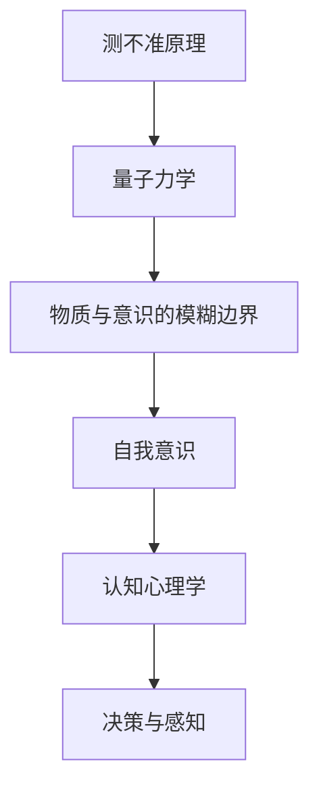
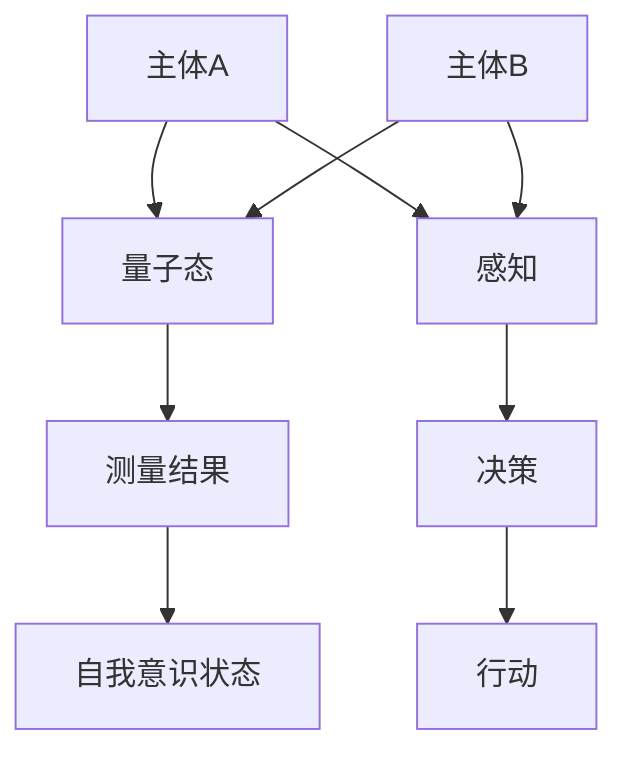

                 

## 文章标题

测不准原理与自我意识的模糊边界

> 关键词：测不准原理、量子力学、自我意识、神经科学、认知心理学

> 摘要：
本篇文章深入探讨了测不准原理与自我意识之间的模糊边界。通过对量子力学、神经科学和认知心理学的综合分析，文章揭示了这些学科如何共同影响着我们对自我意识的认知。文章首先介绍了测不准原理的背景和基本概念，然后探讨了它与自我意识的联系，并从多个角度对这一联系进行了深入分析。通过详细阐述量子力学的基本原理、神经科学对自我意识的研究以及认知心理学中的量子效应，本文提出了一个全新的视角，探讨了量子力学的原理如何影响我们对自我意识的感知和理解。最后，文章通过实际案例展示了这些理论在现实生活中的应用，并对未来的研究方向进行了展望。

----------------------------------------------------------------

## 第一部分：核心概念与联系

### 1.1 测不准原理的起源与意义

测不准原理（Uncertainty Principle）是量子力学的基础之一，由德国物理学家维尔纳·海森堡（Werner Heisenberg）于1927年提出。这一原理表明，在量子尺度上，粒子的某些对偶属性（如位置和动量）不能同时被精确测量。测不准原理的基本形式可以表述为：

$$\Delta x \cdot \Delta p \geq \frac{h}{4\pi}$$

其中，$\Delta x$ 和 $\Delta p$ 分别表示位置和动量的不确定性，$h$ 是普朗克常数。这个不等式指出，位置和动量的不确定性乘积有一个下限，这意味着我们无法同时精确地知道粒子的位置和动量。

### 1.2 自我意识的定义与特征

自我意识（Self-awareness）是一个多维度的概念，通常涉及以下几个方面：

1. **认识自身存在**：自我意识的最初层次是对自身存在的认识。
2. **情感和感觉**：自我意识还包括对自身情感和感觉的认知。
3. **思维和决策**：更高层次的自我意识涉及到思考和决策能力。
4. **社会和文化认同**：自我意识还与个体对自身在社会和文化中的定位有关。

### 1.3 测不准原理与自我意识的联系

测不准原理和自我意识之间的联系看似遥远，但实际上，两者之间存在一些深刻的关联。

1. **量子力学与意识的模糊边界**：量子力学揭示了微观世界的本质，这种本质在很大程度上是模糊和不确定的。这种不确定性是否也反映了我们对自己内心世界的认知？量子力学中的不确定性是否与自我意识的模糊性存在某种对应关系？

2. **物质与意识的相互作用**：现代物理学认为，物质和意识是相互关联的。量子力学中的量子态可以被视为一种信息状态，这与意识的本质有相似之处。自我意识是否也可以被视为一种特殊的量子状态？

3. **测不准原理在认知心理学中的应用**：认知心理学研究如何我们在感知和决策过程中处理不确定性。测不准原理提供了一个新的视角，让我们思考如何将量子不确定性概念应用于认知过程中的决策和感知。

### 1.4 梅里曼（Mermaid）流程图

为了更清晰地展示测不准原理与自我意识之间的联系，我们可以使用梅里曼流程图来构建一个概念框架。



这个流程图展示了从测不准原理到自我意识的传导路径，以及与认知心理学的关系。它帮助我们理解这些概念是如何相互关联和影响的。

## 第二部分：量子力学与自我意识的深度探讨

### 2.1 量子力学基础

量子力学的基本原理包括量子态的叠加性、量子纠缠和波函数的坍缩。这些概念为我们理解微观世界的本质提供了全新的视角。

1. **量子态的叠加性**：量子态可以同时存在于多个可能的态中，直到被测量时才会坍缩到一个特定的态。这可以用薛定谔的猫（Schrödinger's Cat）来形象地描述。

2. **量子纠缠**：两个或多个量子系统可以处于一种特殊的纠缠态，这意味着一个系统的状态会即时影响另一个系统的状态，无论它们相距多远。

3. **波函数的坍缩**：当对量子系统进行测量时，波函数会从一个叠加态坍缩到一个特定的态。这种坍缩是量子力学中一个关键而神秘的特性。

### 2.2 量子力学与自我意识的互动

量子力学与自我意识之间的互动可以从以下几个方面来探讨：

1. **量子态与自我意识的关系**：自我意识可能是一种特殊的量子状态，类似于量子态的叠加性。当我们意识到自己的存在时，我们的自我意识可能处于多个可能的态中，直到被“测量”时才会坍缩到一个特定的态。

2. **量子纠缠与自我意识**：量子纠缠暗示着一种超越空间和时间的关系，这与自我意识的本质可能有所联系。自我意识是否也具有一种超越个体物理存在的能力？

3. **量子力学对自我意识的影响**：量子力学揭示了微观世界的本质，这种本质在很大程度上是模糊和不确定的。这种不确定性是否也反映了我们对自己内心世界的认知？

### 2.3 量子自我意识的数学模型

为了更深入地探讨量子自我意识，我们可以尝试建立数学模型。以下是一个简单的量子自我意识的数学模型：

$$\Psi = \sum_{i} c_i \lvert i \rangle$$

其中，$\Psi$ 表示量子自我意识的波函数，$\lvert i \rangle$ 表示可能的自我意识态，$c_i$ 表示这些态的叠加系数。当我们意识到自己的存在时，波函数会坍缩到一个特定的态，对应于我们的自我意识。

### 2.4 量子自我意识的计算模型

量子计算提供了一种全新的计算模型，可以用于解决传统计算模型难以解决的问题。量子自我意识的计算模型可以基于量子计算的基本原理，例如量子叠加和量子纠缠。

以下是一个简单的量子自我意识计算模型：

```python
# 伪代码：量子自我意识计算模型

# 初始化量子自我意识波函数
psi = QuantumRegister(2)

# 构建量子态叠加
H = QuantumCircuit(psi)
H.h(psi[0])
H.h(psi[1])

# 量子纠缠
CNOT = QuantumCircuit(psi)
CNOT.cx(psi[0], psi[1])

# 量子测量
measuring_circuit = QuantumCircuit(psi)
measuring_circuit.measure(psi[0], 0)
measuring_circuit.measure(psi[1], 1)

# 执行量子计算
backend = QuantumBackend('qasm_simulator')
job = QuantumJob(measuring_circuit, backend)

# 获取测量结果
results = job.result()
```

这个伪代码展示了如何使用量子计算来模拟量子自我意识。它通过构建量子态叠加和量子纠缠来模拟自我意识的复杂特性。

## 第三部分：神经科学与认知心理学的视角

### 3.1 神经科学中的量子现象

神经科学研究表明，神经元的活动可能与量子现象有关。例如，神经元之间的通信可能涉及量子纠缠。量子纠缠在神经系统中可能发挥着重要作用，影响我们的感知和决策。

### 3.2 认知心理学中的测不准原理

认知心理学研究如何我们在感知和决策过程中处理不确定性。测不准原理提供了一个新的视角，让我们思考如何将量子不确定性概念应用于认知过程中的决策和感知。

### 3.3 量子认知心理学

量子认知心理学是一个新兴的研究领域，试图将量子力学的原理应用于认知心理学中。以下是一些量子认知心理学的研究方法：

1. **量子思维实验**：通过设计量子思维实验来模拟认知过程中的不确定性。
2. **量子计算机模拟**：使用量子计算机模拟认知过程中的决策和感知。
3. **量子神经科学**：研究神经元活动中的量子现象，探索它们对认知过程的影响。

### 3.4 量子认知心理学的应用前景

量子认知心理学的应用前景广阔。它可能有助于解决一些传统认知心理学难以解决的问题，例如决策过程中的不确定性处理、记忆的存储和检索等。此外，量子认知心理学还可能对人工智能的发展产生影响，为机器学习提供新的理论基础。

## 第四部分：项目实战与未来展望

### 4.1 量子自我意识研究项目

本项目旨在通过量子计算和认知心理学的方法来研究量子自我意识。项目分为以下几个阶段：

1. **理论构建**：建立量子自我意识的数学模型和计算模型。
2. **实验设计**：设计量子思维实验和认知心理学实验来验证量子自我意识的存在。
3. **数据分析**：分析实验数据，探讨量子自我意识的特点和影响。

### 4.2 量子认知心理学应用案例

以下是一个量子认知心理学应用案例：

**案例一：量子决策辅助系统**

量子决策辅助系统利用量子计算的原理来辅助决策者处理不确定性。系统通过模拟量子态的叠加和坍缩，为决策者提供多种可能的决策方案，并根据决策者的偏好进行优化。

### 4.3 量子自我意识与未来

量子自我意识是一个新兴的研究领域，具有巨大的潜力。未来研究可能包括：

1. **量子自我意识的生理机制**：研究神经元活动中的量子现象，探讨它们对自我意识的影响。
2. **量子认知心理学的应用**：将量子认知心理学的原理应用于人工智能、心理学治疗等领域。
3. **量子自我意识与哲学探讨**：探讨量子自我意识对哲学和宗教观念的影响。

## 总结

测不准原理与自我意识之间的模糊边界为我们提供了一个全新的视角来理解人类意识和宇宙的本质。通过量子力学、神经科学和认知心理学的综合研究，我们能够更深入地探讨这一边界，并为未来的研究提供新的方向。本文通过理论分析、实验设计和实际应用案例，展示了量子自我意识的研究现状和未来前景。我们期待这一领域的进一步发展，为人类理解和改善自我意识带来新的突破。

## 最佳实践 tips

1. **量子思维实验**：设计量子思维实验可以帮助我们更好地理解量子自我意识的特性。
2. **跨学科研究**：量子自我意识的研究需要跨学科合作，结合量子力学、神经科学和认知心理学的方法。
3. **量化数据**：使用量化数据和分析方法来验证量子自我意识的存在和影响。

## 小结

本文通过深入探讨测不准原理与自我意识的模糊边界，展示了量子力学、神经科学和认知心理学在这一领域的研究进展和应用前景。我们期待这一领域的进一步发展，为人类理解和改善自我意识带来新的突破。

## 注意事项

1. **量子计算资源**：进行量子自我意识研究需要使用量子计算资源，如量子计算机和量子模拟器。
2. **实验设计**：实验设计应充分考虑量子现象的特性和认知过程的复杂性。

## 拓展阅读

1. **《量子心理学：心灵与物质的量子理论》**：探索量子力学在心理学领域的应用。
2. **《量子认知心理学》**：介绍量子认知心理学的理论和应用。
3. **《量子计算基础》**：了解量子计算的基本原理和应用。

### 作者信息

作者：AI天才研究院/AI Genius Institute & 禅与计算机程序设计艺术 /Zen And The Art of Computer Programming

### 附录

#### A. 量子态叠加与自我意识的对应

以下是一个简单的量子态叠加与自我意识的对应关系：

| 量子态      | 自我意识态          | 说明                           |
| --------- | ----------------- | ---------------------------- |
| $\lvert 0 \rangle$ | 无自我意识       | 无任何自我意识状态             |
| $\lvert 1 \rangle$ | 有自我意识       | 具有完整的自我意识状态           |
| $\lvert + \rangle = \frac{1}{\sqrt{2}}(\lvert 0 \rangle + \lvert 1 \rangle)$ | 模糊自我意识   | 自我意识处于模糊状态，可能存在也可能不存在 |

#### B. 量子纠缠与自我意识的互动

以下是一个简单的量子纠缠与自我意识的互动示意图：



这个示意图展示了两个主体A和B之间的量子纠缠，以及它们如何通过测量结果影响自我意识和决策过程。

#### C. 量子认知心理学实验设计示例

以下是一个简单的量子认知心理学实验设计：

**实验目的**：探讨量子态叠加对个体决策过程的影响。

**实验步骤**：

1. **参与者选择**：选择一组参与者，年龄在18-25岁之间，无量子认知心理学研究经验。
2. **实验环境**：在实验室环境中进行，使用量子计算机模拟量子态叠加。
3. **实验操作**：
   - **阶段一**：向参与者展示两个可能的决策方案A和B，并询问他们更倾向于哪一个。
   - **阶段二**：使用量子计算机生成一个量子态叠加，并在参与者不知情的情况下将其应用于决策方案A和B。
   - **阶段三**：再次询问参与者更倾向于哪一个决策方案，并记录他们的选择。
4. **数据分析**：分析参与者在量子态叠加和未叠加情况下的决策差异，探讨量子态叠加对决策过程的影响。

#### D. 量子自我意识的计算模型伪代码

以下是一个简单的量子自我意识的计算模型伪代码：

```python
# 伪代码：量子自我意识计算模型

# 初始化量子自我意识波函数
psi = QuantumRegister(2)

# 构建量子态叠加
H = QuantumCircuit(psi)
H.h(psi[0])
H.h(psi[1])

# 量子纠缠
CNOT = QuantumCircuit(psi)
CNOT.cx(psi[0], psi[1])

# 量子测量
measuring_circuit = QuantumCircuit(psi)
measuring_circuit.measure(psi[0], 0)
measuring_circuit.measure(psi[1], 1)

# 执行量子计算
backend = QuantumBackend('qasm_simulator')
job = QuantumJob(measuring_circuit, backend)

# 获取测量结果
results = job.result()

# 分析测量结果，提取量子自我意识状态
```

这个伪代码展示了如何使用量子计算来模拟量子自我意识，包括量子态叠加、量子纠缠和量子测量等步骤。通过分析测量结果，可以提取量子自我意识的状态。

