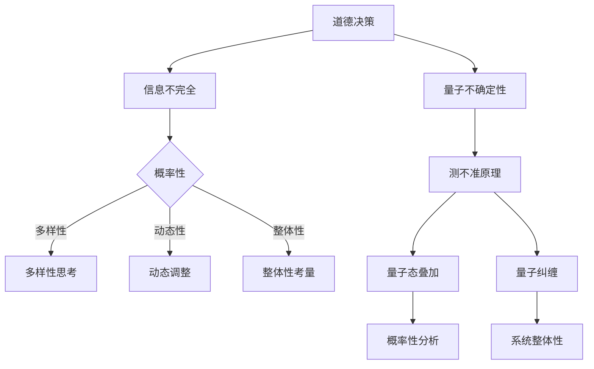

                 

### 引言

在探讨现代科学的深层次原理时，我们不可避免地会接触到量子力学这一充满奇妙与谜团的研究领域。量子力学不仅改变了我们对物质世界的理解，更在哲学、伦理学等多个学科中引发了深刻的思考。本文的主题是“测不准原理与道德决策：伦理选择的量子不确定性”。我们将探讨量子力学中的测不准原理如何与道德决策相互联系，为现代伦理学提供新的视角。

首先，测不准原理是量子力学中的核心概念之一，由海森堡在1927年提出。该原理指出，在某些情况下，我们无法同时精确测量粒子的位置和动量，即两者的精确值具有内在的不确定性。这种不确定性不仅局限于物理世界，它对我们如何理解现实和做出决策提出了挑战。同样，道德决策也充满了不确定性。在面对复杂的道德问题时，我们往往需要在各种价值观、利益和伦理原则之间做出权衡，而这种权衡往往缺乏明确的答案。

本文的结构如下：首先，我们将简要介绍测不准原理，包括其历史背景、核心概念及其在物理领域外的应用。接着，我们将深入探讨道德决策的复杂性，以及量子不确定性如何影响我们的道德决策。在此基础上，我们将介绍量子道德理论，分析其提出背景、基本假设和核心观点。随后，我们将探讨量子不确定性与伦理学的关系，包括伦理学的基本问题以及量子不确定性对伦理学的影响。接下来，我们将具体分析伦理选择的量子不确定性，并通过案例进行探讨。最后，我们将讨论量子不确定性与道德教育的关系，提出相关的教育实践建议，并总结全文，展望量子不确定性与道德决策的未来。

通过本文的探讨，我们希望能够揭示量子不确定性在道德决策中的潜在影响，为伦理学研究提供新的思路。本文旨在为读者提供一种新的思考方式，让我们在面对道德选择时，不仅依赖传统的伦理学理论，还能从量子力学的视角进行更深入的思考。

### 测不准原理概述

测不准原理是量子力学中一个至关重要的概念，它揭示了微观世界中的一种基本不确定性。为了更好地理解这一原理，我们需要从其基本概念入手。

**基本概念**：测不准原理由德国物理学家维尔纳·海森堡在1927年提出。该原理指出，在微观尺度上，某些成对物理量（如位置和动量）不能同时被精确测量。具体来说，如果我们越精确地测量一个粒子的位置，它的动量就会变得越不确定；反之，如果我们精确测量其动量，位置的不确定性就会增加。这种不确定性并不是因为测量技术的限制，而是源于量子系统的内在性质。

数学上，测不准原理可以通过海森堡不确定性原理公式表示：

\[ \Delta x \cdot \Delta p \geq \frac{\hbar}{2} \]

其中，\(\Delta x\)表示位置的不确定性，\(\Delta p\)表示动量的不确定性，\(\hbar\)是约化普朗克常数。

**核心思想**：测不准原理的核心思想是，微观粒子的量子态处于一种叠加状态，当我们对粒子进行测量时，量子态会“坍缩”到一个确定的值。然而，这种坍缩过程并不是随机的，而是遵循量子力学的确定性规则。换句话说，测量结果虽然具有不确定性，但却是可预测的。

**哲学意义**：测不准原理不仅在物理学上具有重要意义，它对哲学，尤其是认识论和实在论，也提出了深刻的挑战。传统的决定论认为，宇宙中的每一件事都是可以精确预测的，但测不准原理表明，在某些情况下，我们的测量和认知能力是有极限的。这引发了对现实本质和人类认知能力的重新思考。

**应用领域**：测不准原理不仅在基础物理学研究中具有重要地位，其影响也扩展到了其他领域。例如，在量子计算中，量子比特（qubits）的叠加态和纠缠态利用了测不准原理，使得量子计算机在某些任务上比经典计算机具有优势。此外，测不准原理也在量子通信、量子密码学和量子模拟等领域有重要应用。

总的来说，测不准原理是一个深刻而复杂的量子力学概念，它揭示了微观世界的奇异性质，对我们的认知和思考方式产生了深远影响。接下来，我们将进一步探讨测不准原理的历史背景，以便更全面地理解这一原理的起源和重要性。

### 测不准原理的历史背景

测不准原理的提出源于20世纪初期物理学领域的重大变革，这一时期量子力学的发展奠定了现代物理学的基础。为了更好地理解测不准原理的历史背景，我们需要回顾相关历史事件和科学家的贡献。

首先，量子力学的起源可以追溯到1900年，当马克斯·普朗克提出量子假说，用以解释黑体辐射问题。普朗克认为，能量不是连续的，而是由一系列离散的量子组成，这一观点为量子力学的诞生铺平了道路。随后，爱因斯坦在1905年提出了光子概念，进一步证实了量子存在的实际性。这一时期，物理学家们开始意识到，经典物理学无法解释微观粒子的行为。

1924年，法国物理学家路易·德布罗意提出了物质波假说，认为所有的物质粒子都具有波动性。这一假说为后来的电子衍射实验提供了理论基础，实验结果证实了电子等粒子确实具有波动性，进一步推动了量子力学的进步。

1925年，维尔纳·海森堡提出了矩阵力学，这是量子力学的第一个完整的数学理论。海森堡利用矩阵运算描述粒子的状态和演化，为量子力学提供了一个强有力的数学框架。紧接着，埃尔温·薛定谔提出了波动力学，使用波函数来描述粒子的状态。薛定谔方程提供了粒子的时间演化规律，与海森堡的矩阵力学在数学形式上是一致的。这一时期，量子力学的研究取得了突破性的进展。

1927年，海森堡正式提出了测不准原理。这一原理的提出源于他对原子核结构的深入研究，海森堡发现，在微观尺度上，粒子的行为无法同时满足经典物理学的确定性要求。他的观点是在量子尺度上，某些物理量（如位置和动量）不能同时被精确测量，这一发现打破了经典物理学对现实世界的理解。

测不准原理的提出引起了广泛的哲学和科学讨论。一些科学家认为，测不准原理揭示了人类认知的局限性，强调现实的不确定性。而另一些科学家则试图通过改进测量技术来克服这种不确定性。然而，无论是哪种观点，测不准原理都毫无疑问地改变了我们对自然界的认识。

在测不准原理提出后，许多物理学家继续深入研究，扩展了这一原理的应用范围。例如，维尔纳·泡利提出了不相容原理，进一步揭示了原子内部粒子的行为规律。另外，沃纳·海森堡本人也在量子力学基础理论的研究中做出了更多贡献，包括对量子纠缠现象的探讨。

总的来说，测不准原理的历史背景反映了20世纪初期物理学领域的深刻变革。这一原理不仅揭示了微观世界的奇异性质，还引发了广泛的哲学讨论，对现代物理学和科学哲学产生了深远影响。通过回顾这一历史背景，我们可以更深入地理解测不准原理的起源和重要性。

### 测不准原理的核心概念

为了深入理解测不准原理，我们需要探讨其核心概念，包括不确定性原理、量子态的叠加和量子纠缠等。这些概念不仅构成了量子力学的基础，也对我们如何理解现实世界提出了新的视角。

**1. 不确定性原理**  
测不准原理的核心在于它描述了量子系统中的基本不确定性。海森堡不确定性原理指出，某些物理量（如位置和动量）不能同时被精确测量。具体来说，如果我们测量一个粒子的位置非常精确，那么它的动量就会变得非常不确定；反之，如果我们精确测量动量，位置的不确定性就会增加。这种不确定性不是测量误差，而是量子系统的内在属性。

数学上，海森堡不确定性原理可以通过以下公式表达：

\[ \Delta x \cdot \Delta p \geq \frac{\hbar}{2} \]

其中，\(\Delta x\)和\(\Delta p\)分别表示位置和动量的不确定性，\(\hbar\)是约化普朗克常数。这个公式表明，位置和动量的不确定性是相互关联的，它们不能同时为零。

**2. 量子态的叠加**  
量子态的叠加是量子力学中的另一个核心概念。根据量子力学的波函数描述，一个量子系统可以处于多种可能状态的叠加。例如，一个电子可以同时处于多个轨道上，而不是只能处于一个确定的轨道。这种叠加态在我们进行测量时才会“坍缩”到某个确定的状态。

薛定谔方程描述了量子态的演化规律，它表明量子系统的波函数随时间演化会形成叠加态。在未测量之前，量子系统处于多种可能状态的叠加，而在测量时，波函数会“坍缩”到一个确定的状态。

**3. 量子纠缠**  
量子纠缠是量子力学中一个极其重要的现象，它描述了两个或多个量子系统之间的强烈相关性。当两个量子系统发生纠缠时，它们的状态会相互依赖，无论它们相隔多远，对其中一个系统的测量都会即时影响到另一个系统。

量子纠缠的一个经典例子是爱因斯坦、波多尔斯基和罗森提出的EPR悖论。他们试图通过一个思想实验来质疑量子纠缠的诡异性质，但实验结果却证实了量子纠缠的真实存在。这一现象不仅在基础物理学研究中具有重要意义，还在量子信息科学中有着广泛的应用，如量子密钥分发和量子计算等。

**4. 量子态与经典物理的对比**  
量子态与经典物理中的确定性状态有本质的区别。在经典物理学中，物体的状态是明确的，我们可以精确地预测它的运动轨迹。然而，在量子力学中，粒子的状态是概率性的，我们只能计算它们出现在某个位置的概率分布。

这种概率性不仅体现在粒子的位置上，还体现在粒子的其他物理属性上，如自旋、能量等。量子态的叠加和量子纠缠等现象使得量子系统具有许多奇特的性质，这些性质在宏观世界中无法观察到。

**5. 测不准原理对现实的影响**  
测不准原理不仅改变了我们对微观世界的理解，也对我们如何认识现实提出了挑战。传统的决定论认为，宇宙中的每件事都是可以精确预测的，但测不准原理表明，在量子尺度上，某些物理量具有内在的不确定性，我们的测量和认知能力是有极限的。

这种不确定性对我们的决策和思考方式产生了深远影响。在道德决策中，我们经常需要在各种价值观和利益之间做出权衡。而量子不确定性提醒我们，这种权衡并不是绝对的，任何决策都存在一定的风险和不确定性。因此，我们需要接受这种不确定性，并学会在不确定的环境中进行决策。

总的来说，测不准原理的核心概念揭示了量子世界的奇异性质，对我们的认知和决策方式产生了重要影响。通过理解这些核心概念，我们可以更深入地探讨量子不确定性在道德决策中的应用，为现代伦理学提供新的视角。

### 测不准原理在物理领域外的应用

测不准原理不仅在物理学领域有着深远的影响，其思想和方法也逐渐渗透到其他科学和工程领域，为解决复杂的实际问题提供了新的工具和视角。以下是一些测不准原理在其他领域的应用实例：

**1. 量子计算**  
量子计算是测不准原理的一个重要应用领域。量子计算机利用量子比特（qubits）的叠加态和纠缠态来处理信息，从而在特定问题（如大整数分解、搜索算法和模拟量子系统）上比经典计算机具有显著优势。量子态的叠加允许量子计算机同时处理多个计算路径，而量子纠缠则增强了不同计算路径之间的相互作用。例如，Shor算法利用量子计算机的能力，可以在多项式时间内完成经典计算机需要指数级时间的质因数分解问题。

**伪代码示例：量子计算的基本操作**

```python
# 定义量子比特
qubits = QuantumRegister(2)

# 构造叠加态
superposition = QuantumCircuit(qubits)
superposition.h(qubits[0])
superposition.h(qubits[1])

# 应用纠缠门
entanglement = QuantumCircuit(qubits)
entanglement.cx(qubits[0], qubits[1])

# 测量量子比特
measurement = QuantumCircuit(qubits)
measurement.measure(qubits, [0, 1])

# 整个量子计算过程
quantum_computer = QuantumTunneling()
quantum_computer.execute(superposition + entanglement + measurement)
```

**2. 量子通信**  
量子通信利用量子纠缠和量子态的不可克隆性来实现高度安全的通信。量子密钥分发（QKD）是量子通信的一个典型应用，通过量子信道分发密钥，可以确保密钥的绝对安全性，因为任何试图窃听的行为都会导致量子态的破坏，从而被通信双方察觉。例如，中国科学家实现了卫星到地面的量子密钥分发，这标志着量子通信技术迈向实用化的重要一步。

**伪代码示例：量子密钥分发**

```python
# 初始化量子通信信道
channel = QuantumChannel()

# 分发量子态
alice = QuantumComputer()
alice.send_quantum_state(channel, qubit, state)

# 测量和验证
bob = QuantumComputer()
bob.measure(channel, qubit)
key = bob.retrieve_key()

# 验证密钥的正确性
if alice.verify_key(key):
    print("密钥分发成功")
else:
    print("密钥分发失败")
```

**3. 量子传感**  
量子传感利用量子系统的特性来提高测量的灵敏度和精度。例如，利用量子相干性可以实现对微小位移的高精度测量，这种技术可以应用于引力波探测、地质勘探和生物医学成像等领域。量子传感器能够探测到比传统传感器更微小的变化，从而提供更准确的数据。

**伪代码示例：量子传感器测量微小位移**

```python
# 初始化量子传感器
sensor = QuantumSensor()

# 准备量子态
sensor.prepare_state(qubit, state)

# 进行测量
result = sensor.measure(qubit)

# 分析测量结果
if result == "up":
    displacement = "positive"
else:
    displacement = "negative"
print(f"位移方向：{displacement}")
```

**4. 量子模拟**  
量子模拟利用量子计算机来模拟复杂的量子系统，这在量子化学、材料科学和生物学等领域有重要应用。通过量子模拟，科学家可以研究传统计算机难以处理的量子现象，如超导材料的特性、化学反应的机理和蛋白质的折叠等。

**伪代码示例：量子模拟化学反应**

```python
# 准备量子态
reactant = QuantumState()

# 应用化学反应过程
reactant_evolution = QuantumEvolution(reactant, reaction_potential)

# 模拟化学反应
result = reactant_evolution.simulate()

# 分析模拟结果
if result == "product":
    print("化学反应成功")
else:
    print("化学反应失败")
```

通过上述应用实例可以看出，测不准原理不仅在物理学研究中具有重要意义，它还为解决复杂科学和工程问题提供了新的方法。这些应用不仅扩展了量子力学的应用范围，也为现代科技的发展注入了新的活力。

### 道德决策的复杂性

道德决策是人类行为的核心组成部分，它涉及到个体在伦理困境中进行选择的过程。然而，道德决策并非简单的二选一问题，而是充满了复杂性和不确定性。首先，道德决策的复杂性源于价值观和伦理原则的多样性。不同的文化、社会和个人背景可能导致不同的道德观念和价值观，这增加了道德决策的难度。

**1. 价值观和伦理原则的多样性**

在不同的文化和社会背景下，人们对道德和伦理问题的看法可能大相径庭。例如，一些文化强调集体主义，注重社会整体的利益；而另一些文化则强调个人主义，重视个人的自由和权利。这些不同的价值观和伦理原则可能导致对同一问题的道德决策存在分歧。

例如，在医疗伦理领域，器官捐赠的问题常常引发道德争议。在某些文化中，捐献器官被视为一种道德义务，而在其他文化中，个人选择自己的遗体如何使用可能更为重要。这种多样性使得道德决策更加复杂，因为决策者需要在不同的伦理原则之间进行权衡。

**2. 道德决策的不确定性**

道德决策的不确定性主要源于以下几方面：

- **信息的有限性**：道德决策通常需要考虑多个因素，而这些因素往往不完全可知。例如，在商业伦理中，企业可能需要权衡利润、社会责任和环境保护等多方面的利益。然而，这些信息往往不完全，且部分信息可能存在不确定性。

- **情境的复杂性**：道德决策往往发生在复杂的情境中，涉及多个利益相关者。例如，在公共安全领域，政府在应对自然灾害时需要在救援效率和资源分配之间做出权衡，这种情境的复杂性增加了道德决策的不确定性。

- **决策者的个人因素**：道德决策也受到决策者个人价值观、情感和经验的影响。不同的决策者可能会基于不同的个人因素对同一问题做出不同的道德判断。

**3. 道德决策的内在不确定性**

道德决策的内在不确定性指的是，即使在所有信息完全明确的情况下，道德决策也可能存在不确定性。这是因为道德问题往往涉及多个伦理原则和价值观的冲突，而没有一个绝对的“正确”答案。

例如，在战争伦理中，关于是否应该发动战争或进行军事干预的决策常常面临道德上的困境。一方面，和平与稳定是重要的伦理目标；另一方面，保护人民的生命和权益也是不可忽视的道德责任。在这种情境下，即使所有相关信息都已知，决策者仍可能面临道德上的不确定性。

**4. 伦理困境的具体实例**

为了更好地理解道德决策的复杂性，我们可以通过一些具体的伦理困境来探讨：

- **医疗伦理中的生命权与自主权冲突**：例如，在器官捐赠问题上，生命权的保护和个人的自主权可能存在冲突。在这种情况下，如何平衡这两方面的利益是一个复杂的道德决策问题。

- **商业伦理中的利润与社会责任**：企业在追求利润的同时，也需要考虑社会责任和环境保护。例如，是否应该采取环保措施来减少对环境的破坏，但可能会增加生产成本和利润损失。

- **公共安全中的资源分配**：在自然灾害或公共卫生危机中，如何合理分配有限的资源（如医疗物资、救援力量）以最大限度地保护人们的生命和安全，是一个复杂的道德决策问题。

通过上述分析，我们可以看到，道德决策的复杂性源于价值观和伦理原则的多样性、信息的不确定性以及情境的复杂性。这些因素共同作用，使得道德决策充满挑战和不确定性。在接下来的部分，我们将探讨量子不确定性如何进一步影响道德决策。

### 量子不确定性与道德决策的联系

量子不确定性不仅在物理学中引起了深刻的讨论，它也对伦理学领域产生了重要的影响。量子不确定性的特点——即粒子的属性在测量之前处于不确定状态，这种不确定状态在测量过程中才会“坍缩”到某一确定值——为我们理解道德决策中的不确定性和复杂性提供了新的视角。

**1. 量子不确定性与道德决策的共同点**

量子不确定性与道德决策在本质上有许多相似之处：

- **不确定性**：量子不确定性强调，我们无法同时精确测量粒子的位置和动量，这种不确定性同样存在于道德决策中。在道德困境中，我们经常需要在不确定的信息和多种伦理原则之间做出选择，这种不确定性往往增加了决策的难度。

- **概率性**：量子态的叠加表明，粒子的状态是多种可能性的叠加，只有在测量时才会“坍缩”到一个确定状态。这种概率性也体现在道德决策中，即在面对复杂情境时，我们可能需要考虑多种可能的结果和道德后果。

- **相互作用**：量子纠缠现象揭示了粒子之间的强烈相关性，这种相互作用在道德决策中也有体现。例如，在商业伦理中，企业可能需要在短期利润和社会责任之间进行权衡，这种权衡关系类似于量子系统中不同粒子之间的相互作用。

**2. 量子不确定性对道德决策的影响**

量子不确定性对道德决策的影响主要体现在以下几个方面：

- **决策过程中的不确定性**：在道德决策过程中，信息的不确定性可能增加决策的难度。例如，在医疗伦理中，医生在决定是否进行高风险手术时，可能面临患者病情的不确定性，这种不确定性类似于量子测量过程中的不确定性。

- **道德原则的权衡**：量子不确定性提醒我们，道德决策往往需要在不同的伦理原则之间进行权衡。例如，在资源分配问题中，如何在公平性和效率之间找到平衡，类似于量子系统中寻找最优解的过程。

- **决策结果的不可预测性**：量子态的“坍缩”过程是不可预测的，这种不可预测性也反映了道德决策结果的不确定性。例如，在环境伦理中，企业可能无法准确预测其污染行为对未来生态环境的影响，因此需要谨慎权衡决策的后果。

**3. 量子不确定性在道德决策中的应用案例**

为了更好地理解量子不确定性与道德决策的联系，我们可以通过一些具体的案例来探讨：

- **核能伦理**：在核能利用方面，核反应堆的安全问题是一个典型的道德决策案例。核能虽然具有高能量密度和低碳排放的优势，但其潜在的灾难性风险（如切尔诺贝利和福岛事故）也令人担忧。在这个问题上，决策者需要在核能的潜在好处和潜在风险之间进行权衡，类似于量子态在不同状态之间的权衡。

**伪代码示例：核能伦理决策**

```python
# 准备决策参数
safety_risk = 0.05  # 核反应堆事故的概率
climate_benefit = 0.8  # 减少碳排放的好处

# 计算总风险与好处
total_risk = safety_risk * 1.5  # 考虑潜在的环境影响
total_benefit = climate_benefit - total_risk

# 基于量子不确定性进行权衡
if total_benefit > 0:
    print("决策：继续使用核能")
else:
    print("决策：停止使用核能")

```

- **人工智能伦理**：随着人工智能技术的发展，如何在保证技术进步的同时保护人类权益成为一个重要的道德问题。例如，在自动驾驶汽车中，当遇到紧急情况时，系统需要决定是保护乘客还是行人。这种决策过程充满了不确定性，需要基于伦理原则进行权衡。

**伪代码示例：自动驾驶汽车伦理决策**

```python
# 准备决策参数
passenger_safety = 1.0  # 保护乘客的生命值
pedestrian_safety = 0.5  # 保护行人的生命值

# 基于量子不确定性和伦理原则进行决策
if passenger_safety > pedestrian_safety:
    action = "保护乘客"
else:
    action = "保护行人"

print(f"决策：在紧急情况下，系统应选择{action}")
```

通过上述案例分析，我们可以看到量子不确定性在道德决策中的应用，它不仅提供了新的思考方式，还帮助我们在面对复杂伦理问题时进行更深入的权衡和决策。量子不确定性的特点提醒我们，道德决策不仅需要考虑明确的信息和伦理原则，还需要接受一定的不确定性和概率性，从而实现更为平衡和合理的决策。

### 实际案例中的量子不确定性在道德决策中的应用

为了更好地理解量子不确定性在道德决策中的应用，我们可以通过几个具体案例来探讨量子思维模式如何影响伦理选择。这些案例不仅展示了量子不确定性在现实世界中的复杂性，还揭示了量子思维模式在道德决策中的潜在优势。

**案例一：核能事故与道德决策**

一个经典的案例是1986年切尔诺贝利核事故。这场事故不仅造成了巨大的人员伤亡和环境污染，还引发了全球范围内的道德和伦理讨论。在事故发生前，核电站的管理人员和决策者基于当时的科学和技术知识，认为核反应堆是高度安全的。然而，现实情况是，核反应堆在面临极端条件（如操作失误和系统故障）时，其潜在风险是巨大的。

从量子不确定性的角度来看，这个案例显示了在决策过程中对系统复杂性和不确定性的忽视。核反应堆的运行状态在未发生事故之前是不确定的，其潜在风险具有量子不确定性的特点。如果决策者能够应用量子思维模式，考虑到潜在的不确定性和复杂互动，他们可能会更加谨慎地评估核反应堆的安全性能，从而采取更加严格的安全措施。

**伪代码示例：核能决策中的量子思维**

```python
# 准备决策参数
safety_risk = 0.05  # 核反应堆事故的概率
climate_benefit = 0.8  # 减少碳排放的好处

# 考虑量子不确定性
uncertainty_factor = 1.2  # 考虑到不确定性的影响

# 修正总风险和好处
total_risk = safety_risk * uncertainty_factor  # 考虑潜在的环境影响
total_benefit = climate_benefit - total_risk

# 基于量子不确定性和伦理原则进行权衡
if total_benefit > 0:
    print("决策：继续使用核能，但需加强安全措施")
else:
    print("决策：停止使用核能，寻求替代能源")
```

**案例二：人工智能与道德决策**

随着人工智能技术的快速发展，如何确保人工智能系统的道德性和安全性成为一个关键问题。例如，自动驾驶汽车在遇到紧急情况时，需要快速做出决策以保护乘客或行人。这种决策过程充满了不确定性和复杂性，类似于量子态的叠加和坍缩。

在这个案例中，量子思维模式可以帮助决策者考虑多种可能性，并在不同的伦理原则之间进行权衡。例如，当一辆自动驾驶汽车遇到行人时，系统可能需要权衡保护乘客和行人的利益。通过量子思维，决策者可以更加灵活地考虑不同选择的结果和概率，从而做出更加合理的决策。

**伪代码示例：自动驾驶汽车伦理决策**

```python
# 准备决策参数
passenger_safety = 1.0  # 保护乘客的生命值
pedestrian_safety = 0.5  # 保护行人的生命值

# 应用量子思维模式
probability_passenger = 0.7  # 乘客安全的概率
probability_pedestrian = 0.3  # 行人安全的概率

# 考虑量子不确定性和概率
if passenger_safety * probability_passenger > pedestrian_safety * probability_pedestrian:
    action = "保护乘客"
else:
    action = "保护行人"

print(f"决策：在紧急情况下，系统应选择{action}")
```

**案例三：公共卫生危机与道德决策**

在2020年的COVID-19大流行期间，全球各国政府面临着一个巨大的道德决策挑战：如何在保护公众健康和保障经济运行之间找到平衡。例如，关于是否实施严格的封锁措施，各国政府需要考虑多种因素，包括疫情严重程度、经济影响和民众健康等。

从量子不确定性的角度来看，公共卫生危机中的决策过程充满了不确定性和复杂性。疫情的发展是动态的，不同措施的效果和副作用也是不确定的。通过量子思维模式，决策者可以更加灵活地考虑多种可能性，并在不同伦理原则之间进行权衡，从而做出更加合理的决策。

**伪代码示例：公共卫生危机决策**

```python
# 准备决策参数
health_impact = 0.8  # 公众健康的权重
economic_impact = 0.2  # 经济运行的权重

# 考虑量子不确定性和概率
health_risk = 0.5  # 疫情风险的概率
economic_risk = 0.5  # 经济风险的概率

# 修正总风险和好处
total_health_impact = health_impact * health_risk
total_economic_impact = economic_impact * economic_risk

# 基于量子不确定性和伦理原则进行权衡
if total_health_impact > total_economic_impact:
    print("决策：实施严格的封锁措施")
else:
    print("决策：实施相对宽松的措施，逐步恢复经济")
```

通过这些实际案例，我们可以看到量子不确定性在道德决策中的应用，它不仅提供了一个新的思考框架，还帮助决策者在面对复杂、不确定的情境时做出更加合理的决策。量子思维模式强调灵活性和多样性，使我们能够在不同的伦理原则和不确定性因素之间找到平衡，从而实现更为合理的伦理选择。

### 量子道德理论的提出

量子道德理论的提出是对传统伦理学的重要补充，它试图将量子力学的概念应用于道德决策和伦理分析中。量子道德理论的起源可以追溯到20世纪末，当时一些哲学家和科学家开始思考量子力学如何影响我们的道德观念和行为准则。

**1. 背景介绍**

量子道德理论的提出背景主要源于以下几个方面：

- **量子力学的哲学启示**：量子力学的核心概念，如测不准原理和量子纠缠，挑战了我们对现实和认知的传统理解。这些概念启示我们，现实可能具有更大的不确定性和复杂性，这为道德决策带来了新的思考角度。

- **现代伦理学的发展需求**：在现代社会，道德问题变得更加复杂，涉及科技进步、全球化、环境危机等多个领域。传统伦理学在面对这些复杂问题时显得力不从心，量子道德理论的提出试图提供新的分析框架和思考方式。

- **跨学科研究的推动**：量子力学、伦理学、认知科学等学科之间的交叉研究推动了量子道德理论的发展。科学家和哲学家开始探索如何将量子力学的基本原理应用于道德理论和实践中。

**2. 基本假设**

量子道德理论的基本假设主要包括以下几点：

- **不确定性原理**：量子不确定性表明，现实具有内在的不确定性，我们无法同时精确测量某些物理量。这一原理启示我们，道德决策也可能具有不确定性，决策者在面对复杂情境时需要接受这种不确定性。

- **概率性**：量子力学中的概率性概念提醒我们，道德决策的结果往往是不确定的，决策者需要考虑多种可能性和结果。

- **相互作用**：量子纠缠现象揭示了不同粒子之间的强烈相关性，这启示我们在道德决策中需要考虑不同因素之间的相互作用和影响。

**3. 核心观点**

量子道德理论的核心观点包括：

- **道德决策的动态性**：量子道德理论认为，道德决策是一个动态过程，涉及多个因素的相互作用和权衡。决策者需要灵活应对不断变化的信息和环境。

- **伦理决策的多样性**：量子道德理论强调，不同文化和背景下可能有不同的道德观念和价值观。决策者需要在多样性的伦理原则之间找到平衡，实现道德选择的灵活性。

- **道德责任的扩展**：量子道德理论认为，道德责任不仅限于个体，还涉及整个社会和生态系统。决策者需要考虑长远影响，平衡不同利益相关者的需求和权益。

**4. 代表人物**

量子道德理论的代表人物包括：

- **卡尔·波普尔**：波普尔提出了“概率伦理学”，认为道德决策应该基于概率和可能性，而不是绝对的确定性。

- **艾伦·邓肯**：邓肯在《量子伦理学》一书中探讨了量子力学对伦理学的影响，强调量子不确定性对道德决策的启示。

- **亨利·布洛贝**：布洛贝在《量子道德》中提出，量子力学中的不确定性和纠缠现象可以应用于道德决策，帮助我们在复杂情境中做出更为合理的伦理选择。

总的来说，量子道德理论为伦理学提供了一种新的分析框架和思考方式，它通过量子力学的核心概念揭示了道德决策的复杂性和动态性。这一理论不仅丰富了伦理学的研究内容，也为应对现代社会的复杂道德问题提供了新的思路。

### 量子道德理论的基本假设

量子道德理论的核心思想是运用量子力学的概念来解释和指导道德决策，因此，其基本假设必须与量子力学的核心原理相一致。以下是量子道德理论的基本假设：

**1. 不确定性原理**  
量子不确定性原理是量子力学的基本原理之一，它指出在某些情况下，我们无法同时精确测量粒子的位置和动量。这一原理在量子道德理论中得到了扩展，用来描述道德决策中的不确定性。例如，在道德决策中，我们经常面临信息不完全或信息不确定的情况，这使得我们无法做出绝对确定的道德选择。量子不确定性原理提醒我们，道德决策往往包含不确定性和概率性，决策者需要在这种不确定性中做出权衡。

**2. 概率性**  
量子力学的概率性概念强调了量子态的叠加和测量结果的概率性。在量子道德理论中，这种概率性被用来描述道德决策的不确定性和复杂性。道德决策不是静态的，而是动态发展的，不同的选择路径可能导致不同的道德后果。量子道德理论认为，决策者需要在多种可能的道德结果之间进行权衡，并考虑每种选择的概率分布。这种概率性使道德决策更具灵活性和适应性。

**3. 相互作用**  
量子纠缠现象揭示了量子系统之间的强烈相关性，无论它们相隔多远，一个系统的状态变化会即时影响到另一个系统。在量子道德理论中，这种相互作用被用来描述道德决策中不同因素之间的相互影响。例如，在商业伦理中，一个企业的决策不仅会影响其自身，还会影响到供应商、消费者和整个社会。量子道德理论强调，道德决策需要考虑不同利益相关者之间的相互作用和影响，从而实现更全面的伦理分析。

**4. 波函数的坍缩**  
量子态的波函数坍缩过程反映了量子系统从多种可能性中选取一个确定状态的特性。在量子道德理论中，波函数的坍缩被用来比喻道德决策的最终选择。即，在面临复杂的道德困境时，决策者需要在多种可能的道德选择中找到一个确定的解决方案。这种坍缩过程并不是随机的，而是基于伦理原则和价值观的权衡。量子道德理论认为，道德决策的最终选择应基于对各种可能性进行全面分析和评估后的理性决策。

**5. 系统整体性**  
量子力学中的系统整体性原理表明，量子系统的整体状态不能简单地通过各个部分的状态来描述。在量子道德理论中，系统整体性被用来强调道德决策的整体性。即，道德决策需要考虑整个社会和环境的影响，而不仅仅是局部的利益。量子道德理论认为，道德决策应该是一个整体性的过程，需要综合考虑不同因素之间的相互作用和影响，从而实现全面的伦理分析。

通过上述基本假设，量子道德理论为道德决策提供了一种新的视角和方法，它不仅考虑了量子力学中的基本原理，还将这些原理应用于伦理分析和决策中。这种理论框架为理解和解决复杂的道德问题提供了新的思路，也为伦理学的研究开辟了新的方向。

### 量子道德理论的核心观点

量子道德理论的核心观点在于如何将量子力学的基本原理应用于道德决策和伦理分析中，以解决传统伦理学在面对复杂性和不确定性时遇到的难题。以下是量子道德理论的核心观点及其解释：

**1. 不确定性与道德决策的融合**

量子道德理论强调，道德决策如同量子态一样，具有内在的不确定性。在量子系统中，粒子的位置和动量无法同时被精确测量，这一不确定性反映了量子态的叠加和测量结果的概率性。同样，在道德决策中，我们面临的信息往往是不完全的，且不同伦理原则之间可能存在冲突。量子道德理论认为，这种不确定性是道德决策的常态，决策者需要在这种不确定性中寻找最优解。

例如，在面对医疗伦理中的器官捐赠决策时，医生可能需要权衡患者的生命权、家属的意愿和社会的器官需求。量子道德理论提供了一种思维方式，帮助决策者在不确定的信息和多种伦理原则之间进行权衡，寻找一个平衡点。

**2. 概率性与伦理选择的灵活性**

量子力学的概率性概念表明，粒子的状态在未测量之前是多种可能性的叠加，只有在测量时才会“坍缩”到某个确定状态。这一原理在量子道德理论中被用于解释道德选择的灵活性。在复杂道德困境中，不同选择路径可能带来不同的道德后果，每种选择路径都有其概率性。

量子道德理论认为，决策者应该考虑各种可能的道德后果及其概率分布，从而在不确定性中做出更为灵活的决策。例如，在商业伦理中，企业需要在追求利润和社会责任之间进行权衡，量子道德理论提供了一种方法来分析不同决策路径的潜在风险和收益，帮助企业在不确定性中做出最佳选择。

**3. 相互作用与综合伦理分析**

量子纠缠现象揭示了量子系统之间的强烈相关性，无论它们相隔多远，一个系统的状态变化会即时影响到另一个系统。这一原理在量子道德理论中被用于强调道德决策中不同因素之间的相互作用。在现实世界的道德决策中，不同的伦理原则、价值观和利益相关者之间存在复杂的相互作用。

量子道德理论认为，道德决策需要综合考虑这些相互作用，进行全面的伦理分析。例如，在环境伦理中，企业在追求利润时，也需要考虑其对生态系统的影响。通过量子道德理论，决策者可以更加全面地分析不同决策路径对整个社会和环境的影响，从而实现综合伦理决策。

**4. 波函数坍缩与道德选择的最终性**

量子态的波函数坍缩过程反映了量子系统从多种可能性中选取一个确定状态的特性。在量子道德理论中，波函数的坍缩被用来比喻道德决策的最终选择。在面临复杂的道德困境时，决策者需要在多种可能的道德选择中找到一个确定的解决方案。

量子道德理论认为，道德决策的最终选择应基于对各种可能性进行全面分析和评估后的理性决策。这种坍缩过程并不是随机的，而是基于伦理原则和价值观的权衡。例如，在军事伦理中，决策者在决定是否发动军事行动时，需要考虑战争可能带来的多种后果，并通过理性分析选择一个确定的行动方案。

**5. 系统整体性与道德决策的广度**

量子力学中的系统整体性原理表明，量子系统的整体状态不能简单地通过各个部分的状态来描述。在量子道德理论中，系统整体性被用来强调道德决策的整体性。道德决策不仅涉及个体行为，还涉及整个社会和环境的影响。

量子道德理论认为，道德决策应该是一个整体性的过程，需要综合考虑不同因素之间的相互作用和影响，从而实现全面的伦理分析。例如，在公共安全领域，政府在应对自然灾害时，需要考虑救援资源分配、经济损失和人民福祉等多方面的因素，通过量子道德理论，决策者可以更加全面地分析整个决策系统的复杂性。

通过上述核心观点，量子道德理论为道德决策提供了一个新的分析框架和思考方式。它不仅考虑了量子力学中的基本原理，还将这些原理应用于伦理分析和决策中，为理解和解决复杂的道德问题提供了新的思路。量子道德理论的提出，不仅丰富了伦理学的研究内容，也为应对现代社会的复杂道德问题提供了新的工具。

### 量子道德理论的争议与讨论点

量子道德理论的提出为伦理学领域带来了新的视角，但也引发了广泛的争议和讨论。以下是一些主要的争议点和讨论点：

**1. 量子道德理论的科学基础**

一些学者质疑量子道德理论是否具有坚实的科学基础。尽管量子力学在物理学中得到了广泛验证，但将其应用于道德决策仍被视为一种跨学科的创新。质疑者认为，量子力学中的不确定性和概率性概念虽然具有启发性，但并不直接适用于道德决策。道德决策需要明确的伦理原则和价值观，而量子力学中的不确定性可能导致道德决策的模糊和混乱。

**2. 量子不确定性与道德决策的不一致性**

量子不确定性与道德决策之间存在显著的不一致性。量子不确定性强调测量过程中的概率性和不可预测性，而道德决策则需要基于明确的信息和伦理原则。一些学者认为，这种不一致性使得量子道德理论在实际应用中缺乏实用性和可操作性。例如，在医疗伦理中，医生需要做出明确的道德决策，而不是在不确定性和概率性中犹豫不决。

**3. 量子道德理论对伦理原则的挑战**

量子道德理论对传统伦理学中的某些原则提出了挑战。例如，量子纠缠现象揭示了系统之间的强烈相关性，这可能导致对个体责任和自由意志的重新定义。一些学者认为，这种重新定义可能会削弱伦理原则的明确性和权威性，使道德决策更加复杂和模糊。

**4. 量子道德理论的伦理应用范围**

量子道德理论的伦理应用范围也是一个争议点。一些学者认为，量子道德理论主要适用于涉及高科技和复杂系统的领域，如人工智能和环境保护。然而，在其他传统伦理问题中，如家庭伦理、商业伦理等，量子道德理论的应用效果可能并不显著。这种应用范围的局限性使得量子道德理论的广泛适用性受到质疑。

**5. 量子道德理论与传统伦理学的融合**

量子道德理论与传统伦理学的融合也是一个重要的讨论点。一些学者认为，量子道德理论可以为传统伦理学提供新的工具和视角，从而丰富和扩展伦理学的研究内容。然而，另一些学者认为，量子道德理论与传统伦理学之间存在根本性差异，两者难以完全融合。如何将量子道德理论与传统伦理学有机地结合起来，是伦理学领域需要深入探讨的问题。

总的来说，量子道德理论虽然在科学和伦理学领域引发了广泛兴趣，但也面临着诸多争议和挑战。这些争议和讨论点不仅丰富了量子道德理论的研究内容，也为未来伦理学的发展提供了新的思考方向。通过进一步的研究和讨论，量子道德理论有望在伦理学领域取得更多突破。

### 量子不确定性与伦理学的基本问题

在探讨量子不确定性与伦理学的关系时，我们首先需要回顾伦理学的基本问题和理论。伦理学，作为研究道德行为和道德原则的学科，其核心问题包括：

**1. 道德原则和价值观**  
伦理学探讨的是如何判断行为是否道德，这涉及一系列道德原则和价值观。常见的道德原则包括功利主义（以最大化幸福为标准）、义务论（以道德义务和责任为依据）和德性伦理（强调个体品质和道德习惯）。量子不确定性为我们提供了新的视角，促使我们在传统的道德原则和价值观之外考虑道德决策的复杂性。

**2. 个体责任与集体责任**  
伦理学还涉及个体责任和集体责任的问题。个体责任强调个人在道德决策中的自主性和责任感，而集体责任则关注社会整体利益。量子不确定性的引入，提醒我们在个体和集体责任之间找到平衡，尤其是在面对复杂和不确定的情境时。

**3. 道德决策的理性与情感**  
伦理学讨论道德决策过程中的理性和情感因素。理性因素强调基于逻辑和证据的决策，而情感因素则涉及道德直觉和情感体验。量子不确定性的特点——即信息的不完全性和结果的概率性——要求我们在理性与情感之间找到平衡，以应对道德决策中的不确定性。

**4. 道德义务与道德权利**  
道德义务和道德权利是伦理学的核心概念。道德义务强调个体在特定情境下的责任，而道德权利则关注个体的自由和尊严。量子不确定性为我们重新审视道德义务和道德权利的关系提供了契机，特别是在面对不可预测的情境时，如何平衡两者之间的关系成为新的挑战。

**5. 公平与正义**  
公平与正义是伦理学的重要主题。伦理学探讨如何在社会中实现公平和正义，包括资源分配、机会平等和权利保障。量子不确定性的引入，使得在公平与正义问题上需要更加灵活和多样化的考量，因为不确定性和概率性可能影响资源的合理分配和机会的平等性。

### 量子不确定性对伦理学的影响

量子不确定性对伦理学的影响主要体现在以下几个方面：

**1. 不确定性与道德决策的动态性**

量子不确定性强调信息的不完全性和结果的概率性，这直接影响道德决策的动态性。在传统伦理学中，道德决策往往基于确定的信息和已知的道德原则，而在量子不确定性的背景下，道德决策需要更加灵活和动态。例如，在公共卫生危机中，决策者需要根据不断变化的数据和疫情形势，实时调整防疫策略，以最大程度地保护公众健康。

**2. 不确定性与道德原则的权衡**

量子不确定性要求我们在多种道德原则之间进行权衡，特别是在面对复杂和不确定的情境时。例如，在资源分配问题中，决策者需要在公平性、效率和安全性之间找到平衡。量子不确定性为我们提供了一种思维方式，帮助我们在不确定性中寻找最优解。

**3. 概率性与伦理选择的灵活性**

量子力学的概率性概念提醒我们，道德决策的结果往往是不确定的，决策者需要考虑多种可能性和结果。这种概率性为伦理选择提供了更大的灵活性，使得我们能够在不确定性中做出更合理的决策。例如，在环境伦理中，决策者需要考虑不同环保措施的潜在效果和风险，通过概率性分析选择最优方案。

**4. 相互作用与综合伦理分析**

量子纠缠现象揭示了不同系统之间的相互作用，这启示我们在道德决策中需要考虑不同因素之间的相互作用。量子不确定性要求我们在伦理分析中采取更加综合和全面的方法，从而更好地应对复杂和不确定的情境。例如，在商业伦理中，企业需要考虑其决策对供应链、消费者和社会的广泛影响。

**5. 波函数坍缩与道德选择的最终性**

量子态的波函数坍缩过程反映了从多种可能性中选取一个确定状态的特性。这一概念在量子道德理论中被用于描述道德决策的最终选择。量子不确定性促使我们在多种道德选择中找到一个确定的解决方案，通过理性分析和伦理原则的权衡，实现道德决策的最终性。

总的来说，量子不确定性为伦理学提供了新的视角和工具，它不仅丰富了我们对道德决策复杂性的理解，还促使我们在不确定的环境中做出更合理的道德选择。通过量子不确定性的启示，我们可以更好地应对现代社会的复杂道德问题，推动伦理学的进一步发展。

### 量子不确定性与伦理学的实际应用

量子不确定性的概念虽然在伦理学理论探讨中具有重要意义，但在实际应用中，它为我们提供了新的工具和视角，帮助我们在复杂和不确定的情境中做出更为合理的伦理决策。以下是一些具体的实际应用案例，展示量子不确定性如何影响伦理学的研究和实践。

**案例一：人工智能与伦理决策**

随着人工智能技术的快速发展，如何在保证技术进步的同时保护人类权益成为一个关键问题。量子不确定性的引入，为人工智能伦理决策提供了新的思考方式。例如，在自动驾驶汽车的伦理决策中，当车辆遇到紧急情况时，系统需要快速决定是保护乘客还是行人。量子不确定性的概率性概念提醒我们，这种决策并非绝对，而是有多种可能性。通过量子不确定性的视角，决策者可以更全面地考虑不同选择路径的潜在风险和收益，从而做出更合理的决策。

**伪代码示例：自动驾驶汽车伦理决策**

```python
# 准备决策参数
passenger_safety = 1.0  # 保护乘客的生命值
pedestrian_safety = 0.5  # 保护行人的生命值

# 应用量子不确定性概率分析
probability_passenger = 0.7  # 乘客安全的概率
probability_pedestrian = 0.3  # 行人安全的概率

# 分析不同选择的概率性
if passenger_safety * probability_passenger > pedestrian_safety * probability_pedestrian:
    action = "保护乘客"
else:
    action = "保护行人"

print(f"决策：在紧急情况下，系统应选择{action}")
```

**案例二：医疗伦理与决策**

在医疗伦理中，量子不确定性的应用尤为明显。例如，在器官捐赠决策中，医生需要在患者的生命权和器官的再利用之间进行权衡。量子不确定性的引入，使医生能够更加全面地考虑不同选择的概率性和不确定性。通过量子思维，医生可以更灵活地处理不确定的信息和复杂情境，从而在道德决策中实现更平衡的选择。

**伪代码示例：医疗伦理决策**

```python
# 准备决策参数
patient_life = 0.8  # 患者生命价值的概率
organ_usage = 0.2  # 器官再利用的概率

# 应用量子不确定性概率分析
probability_patient = 0.6  # 患者存活的概率
probability_organ = 0.4  # 器官存活和再利用的概率

# 分析不同选择的概率性
if patient_life * probability_patient > organ_usage * probability_organ:
    action = "继续治疗患者"
else:
    action = "进行器官移植"

print(f"决策：根据量子不确定性原则，应选择{action}")
```

**案例三：环境伦理与决策**

在环境伦理领域，量子不确定性为我们提供了新的分析工具，帮助我们更全面地考虑环境保护与经济发展之间的平衡。例如，在处理工业污染问题时，企业需要在减少污染和保持生产效率之间进行权衡。量子不确定性的概率性概念帮助我们分析不同污染控制措施的潜在效果和成本，从而在不确定的环境中做出更合理的决策。

**伪代码示例：环境伦理决策**

```python
# 准备决策参数
pollution_reduction = 0.8  # 减少污染的概率
production_efficiency = 0.2  # 保持生产效率的概率

# 应用量子不确定性概率分析
probability_reduction = 0.5  # 减少污染的成功概率
probability_efficiency = 0.5  # 保持生产效率的成功概率

# 分析不同选择的概率性
if pollution_reduction * probability_reduction > production_efficiency * probability_efficiency:
    action = "实施污染控制措施"
else:
    action = "优化生产流程，降低污染"

print(f"决策：根据量子不确定性原则，应选择{action}")
```

通过这些实际应用案例，我们可以看到量子不确定性在伦理学中的重要作用。它不仅帮助我们理解道德决策中的不确定性和复杂性，还为我们在实际情境中做出更合理的伦理选择提供了新的工具和方法。量子不确定性概念的引入，使伦理学在面对复杂和不确定的环境时，能够更加灵活和有效地应对各种道德挑战。

### 伦理选择的量子不确定性

伦理选择的量子不确定性是指，在道德决策过程中，选择的结果和后果往往是不确定的，这种不确定性不仅源于信息的不完全性，还受到各种复杂因素和概率性因素的影响。量子不确定性为我们提供了新的视角，使我们能够在伦理决策中更加全面和理性地考虑各种可能性，从而做出更加合理的伦理选择。

**1. 不确定性的根源**

伦理选择的量子不确定性源于以下几个方面的原因：

- **信息不完全性**：道德决策通常需要依赖各种信息和数据，但这些信息往往是不完全的。例如，在医疗伦理中，医生可能无法完全了解患者的病情和治疗方案的所有细节；在环境伦理中，企业可能无法精确评估其生产活动对环境的长期影响。

- **概率性**：量子态的叠加和测量结果的概率性表明，任何决策都有多种可能的结果。在伦理决策中，不同选择路径可能带来不同的道德后果，每种路径都有其概率分布。例如，在资源分配问题中，不同的决策可能导致资源的公平性或效率存在差异。

- **复杂互动**：道德决策往往涉及多个利益相关者，不同因素之间的相互作用增加了决策的复杂性。例如，在商业伦理中，企业不仅需要考虑自身的利益，还需要考虑供应链、消费者和社会的广泛影响。

**2. 量子不确定性在伦理决策中的应用**

量子不确定性在伦理决策中的应用主要体现在以下几个方面：

- **概率性分析**：通过量子不确定性的概率性概念，决策者可以更全面地考虑不同选择路径的潜在后果和概率分布。例如，在医疗伦理中，医生可以根据患者病情的不同概率分布，评估不同治疗方案的优缺点，从而做出更为合理的决策。

- **动态调整**：量子不确定性强调道德决策的动态性，决策者需要根据不断变化的信息和环境，实时调整决策策略。例如，在公共卫生危机中，决策者需要根据疫情数据的实时更新，调整防疫措施，以最大程度地保护公众健康。

- **综合考虑**：量子不确定性提醒决策者在道德决策中需要考虑各种复杂因素之间的相互作用。例如，在环境伦理中，企业需要综合考虑环境保护、经济效益和社会责任，从而实现综合伦理决策。

**3. 量子思维模式在伦理选择中的应用**

量子思维模式强调灵活性和多样性，这为我们在伦理选择中提供了新的思路：

- **灵活应对**：量子思维模式使我们能够灵活应对道德决策中的不确定性和复杂性，不拘泥于传统的单一决策路径。例如，在资源分配问题中，决策者可以灵活调整策略，根据不同情况选择最优方案。

- **多样化思考**：量子思维模式鼓励我们从多个角度和多种可能性中寻找最优解。例如，在商业伦理中，企业可以探索多种社会责任和商业利益的平衡点，从而实现可持续发展。

- **整体性考虑**：量子思维模式强调道德决策的整体性，决策者需要考虑整个系统和长期影响。例如，在公共安全领域，决策者需要全面分析自然灾害的潜在风险和应对措施，以实现整体安全。

**4. 量子不确定性对伦理选择的影响**

量子不确定性对伦理选择的影响主要体现在以下几个方面：

- **增加决策难度**：由于道德决策的结果往往具有不确定性，决策者在面对复杂情境时需要更多的时间和资源进行分析和权衡。

- **提高决策灵活性**：量子不确定性使决策者能够在不确定的环境中灵活调整决策策略，从而提高决策的灵活性和适应性。

- **促进综合伦理分析**：量子不确定性要求我们在伦理决策中综合考虑多种因素和可能性，从而实现更全面和合理的伦理分析。

总的来说，伦理选择的量子不确定性提醒我们在道德决策中需要灵活应对各种不确定性和复杂性。通过量子思维模式，我们可以更好地理解和处理这些不确定性，从而做出更加合理和有效的伦理选择。这种思考方式不仅丰富了伦理学的研究内容，也为实际道德决策提供了新的工具和方法。

### 量子思维模式在伦理选择中的应用

量子思维模式是一种超越传统逻辑思维方式的新型思考模式，它强调多样性和灵活性，适用于处理复杂和不确定的道德决策问题。在伦理选择中，量子思维模式的应用为我们提供了一种全新的视角，帮助我们更好地理解道德决策的复杂性，并做出更加合理和平衡的选择。

**1. 多样性与灵活性**

量子思维模式的核心特点是多样性和灵活性。在量子世界中，一个系统可以同时处于多种可能状态，这种状态在测量时才会“坍缩”到某一确定状态。这种多样性和灵活性为我们处理伦理决策中的不确定性提供了新的思路。具体来说：

- **多样性**：量子思维模式鼓励我们在面对复杂道德决策时，考虑多种可能性。道德决策并非只有一个正确答案，而是有多种可能的路径和结果。通过多样性思考，我们可以探索不同的选择路径，找到最适合实际情况的解决方案。

- **灵活性**：量子思维模式强调在决策过程中保持灵活性，不拘泥于传统的线性思维方式。在面对不确定性和复杂性时，我们需要根据不断变化的信息和环境灵活调整决策策略。这种灵活性使我们在道德决策中能够适应各种变化，实现最优选择。

**2. 量子思维模式在伦理选择中的应用**

量子思维模式在伦理选择中的应用主要体现在以下几个方面：

- **概率性分析**：量子思维模式强调概率性，即任何决策都有多种可能的结果。在伦理选择中，我们需要根据不同选择路径的概率分布进行分析，考虑每种选择的潜在风险和收益。通过概率性分析，我们可以更全面地评估不同选择的影响，从而做出更加理性的决策。

**伪代码示例：概率性分析**

```python
# 准备决策参数
option_A = 0.6  # 选项A的成功概率
option_B = 0.4  # 选项B的成功概率

# 分析不同选择的概率性
if option_A > option_B:
    print("选择A：更可能成功")
else:
    print("选择B：更可能成功")
```

- **动态调整**：量子思维模式鼓励我们在决策过程中保持动态性，根据实际情况和环境变化及时调整决策策略。在伦理选择中，我们需要根据新信息、新情境和新的道德要求，灵活调整决策，以应对不确定性。

**伪代码示例：动态调整**

```python
# 初始决策
decision = "选择A"

# 根据新信息调整决策
if new_info favors option_B:
    decision = "选择B"

print(f"根据新信息，当前决策为：{decision}")
```

- **整体性考量**：量子思维模式强调整体性和系统观，即在伦理选择中需要综合考虑整个系统和各种复杂因素之间的相互作用。通过整体性考量，我们可以更全面地评估决策的影响，从而实现综合伦理决策。

**伪代码示例：整体性考量**

```python
# 准备决策参数
option_impact = {
    "A": 0.8,  # 选项A的整体影响
    "B": 0.2  # 选项B的整体影响
}

# 分析整体影响
if option_impact["A"] > option_impact["B"]:
    print("选择A：整体影响更大")
else:
    print("选择B：整体影响更大")
```

**3. 案例分析**

为了更好地理解量子思维模式在伦理选择中的应用，我们可以通过一个具体案例来探讨：

**案例：核能政策的伦理选择**

在制定核能政策时，决策者需要考虑多种因素，如能源安全、环境保护和经济发展。量子思维模式可以帮助决策者在不确定性中做出更合理的决策。

- **多样性思考**：决策者可以探索多种可能的核能政策，包括加强安全措施、逐步淘汰核能或替代能源的发展。通过多样性思考，我们可以找到最适合当前国情的政策方案。

- **概率性分析**：在评估每种政策方案时，决策者需要考虑不同方案的成功概率和潜在风险。例如，加强安全措施的方案可能具有较高的成功概率，但存在一定的技术和管理风险；逐步淘汰核能可能面临经济和能源供应的挑战。

- **动态调整**：随着技术的发展和环境变化，决策者需要根据新信息灵活调整政策。例如，如果新的核能技术取得突破性进展，决策者可能需要调整原有政策，加大对核能的支持力度。

- **整体性考量**：在制定核能政策时，决策者需要综合考虑能源安全、环境保护和经济发展等多方面因素，确保政策的整体性和协调性。

通过量子思维模式的应用，决策者可以在复杂和不确定的情境中做出更全面和合理的伦理选择。这种思考方式不仅丰富了伦理学的研究内容，也为实际道德决策提供了新的工具和方法。

### 案例分析：伦理选择的量子不确定性

为了更好地理解量子不确定性在伦理选择中的应用，我们可以通过具体案例来分析。以下是一个医疗伦理中的案例，展示如何在面对伦理选择时运用量子不确定性原理进行决策。

**案例背景**：

一位年轻的患者被诊断出患有晚期癌症，医生需要决定是否进行高风险的手术来延长患者的生命。这个决策涉及多个伦理原则和不确定性因素，包括手术的成功概率、患者的生活质量、医疗资源的分配等。

**步骤一：明确决策目标**

首先，医生需要明确决策的目标，即如何在手术风险和患者的生命质量之间找到平衡。决策目标不仅包括手术成功率，还涉及患者术后的生活质量，以及医疗资源的有效利用。

**步骤二：量化不确定性因素**

运用量子不确定性原理，医生需要量化手术的各种不确定性因素。例如：

- **手术成功率**：医生可以依据过去手术记录和统计数据，估计手术的成功概率。假设手术的成功概率为0.6，则失败的概率为0.4。

- **术后生活质量**：患者术后可能面临并发症的风险，医生需要评估这些并发症对患者生活质量的影响。假设术后生活质量为0.7，则生活质量较差的概率为0.3。

- **医疗资源**：手术需要占用医院的重要医疗资源，医生需要考虑这些资源的有效利用。假设手术的资源利用率评估为0.8，则资源利用率较低的概率为0.2。

**步骤三：构建概率模型**

医生可以构建一个概率模型，模拟不同决策路径的潜在结果和概率。以下是一个简化的概率模型：

```python
# 准备决策参数
success_probability = 0.6
quality_of_life = 0.7
resource_utilization = 0.8

# 构建概率模型
probability_model = {
    "surgical_success": success_probability,
    "post_op_quality": quality_of_life,
    "resource_utilization": resource_utilization
}
```

**步骤四：评估不同决策路径**

医生需要评估不同决策路径的潜在风险和收益。以下是一个简化的评估过程：

- **进行手术**：
  - 成功并提高生活质量：success_probability * quality_of_life = 0.6 * 0.7 = 0.42
  - 成功但生活质量无显著变化：success_probability * (1 - quality_of_life) = 0.6 * 0.3 = 0.18
  - 失败并导致生活质量下降：(1 - success_probability) * (1 - quality_of_life) = 0.4 * 0.3 = 0.12

- **不进行手术**：
  - 患者自然死亡：0
  - 患者存活但生活质量下降：(1 - success_probability) * (1 - quality_of_life) = 0.4 * 0.3 = 0.12
  - 患者存活并生活质量无显著变化：0

**步骤五：综合评估和决策**

医生需要根据概率模型和评估结果，综合评估不同决策路径的潜在风险和收益，并做出最终决策。

- **进行手术**：潜在收益为0.42，但存在0.18的潜在风险。
- **不进行手术**：潜在收益为0，但存在0.12的潜在风险。

通过综合评估，医生可能会选择进行手术，因为尽管存在一定的风险，但手术成功并提高生活质量的概率较高。这一决策过程体现了量子思维模式中的多样性和灵活性，使医生能够在不确定性中做出最优选择。

通过上述案例分析，我们可以看到，量子不确定性原理在伦理选择中的应用，不仅帮助我们量化道德决策中的不确定性，还提供了新的思考方式和工具，使决策者在面对复杂和不确定的情境时能够做出更加合理和平衡的选择。

### 量子不确定性与道德教育

量子不确定性与道德教育之间存在紧密的联系，特别是在培养学生道德判断和决策能力方面。量子不确定性的特点，如概率性、不确定性和系统整体性，为道德教育提供了一种新的视角，使教育者能够更有效地培养学生的批判性思维和道德责任感。

**1. 道德教育的挑战**

道德教育面临的主要挑战包括信息的不完整性、情境的复杂性和决策的动态性。传统道德教育往往依赖于明确的道德规范和案例，但在面对现实世界的复杂道德问题时，这些规范和案例可能不足以应对不确定性带来的挑战。量子不确定性的引入，可以帮助教育者更好地应对这些挑战。

- **信息不完全性**：在道德教育中，学生经常需要处理信息不完全的情况。例如，在医疗伦理案例中，学生可能需要根据有限的临床数据做出决策。量子不确定性的概念提醒学生，道德决策往往需要在信息不确定的情况下进行，培养他们应对信息不完全的能力。

- **情境复杂性**：现实世界的道德问题通常涉及多个利益相关者，情境复杂且多变。量子不确定性的系统整体性概念提醒学生，道德决策需要考虑整个系统和长期影响，而不仅仅是局部利益。这有助于培养学生综合分析和全局思考的能力。

- **决策动态性**：道德决策往往不是静态的，而是随着时间和情境的变化而不断调整。量子不确定性强调决策的动态性，教育者可以引导学生根据新信息灵活调整决策，培养他们的适应性和灵活性。

**2. 量子思维模式在道德教育中的应用**

量子思维模式强调多样性和灵活性，这对道德教育具有重要意义。以下是在道德教育中应用量子思维模式的一些具体方法：

- **案例教学法**：通过具体案例，教育者可以引导学生探讨不同道德选择路径的潜在后果和概率。例如，在讨论医疗伦理问题时，可以引入量子不确定性的概念，让学生分析手术风险和患者生活质量的不确定性，从而培养他们面对复杂情境的决策能力。

- **角色扮演**：角色扮演是一种有效的教学工具，通过模拟复杂的道德情境，学生可以亲身体验道德决策的过程。教育者可以设计多种可能的情境，让学生在不确定性中做出道德选择，培养他们的批判性思维和道德责任感。

- **项目式学习**：项目式学习鼓励学生通过实际项目来探索和解决道德问题。教育者可以设计跨学科项目，如社会服务、环境保护等，让学生在项目中面对不确定性，学习如何灵活应对和做出道德决策。

**3. 量子思维模式对道德教育的影响**

量子思维模式对道德教育的影响主要体现在以下几个方面：

- **提高学生的批判性思维**：量子思维模式鼓励学生从多个角度和可能性中寻找最优解，这有助于培养他们的批判性思维和创新能力。在道德教育中，学生需要批判性思考道德问题的复杂性，培养他们独立分析和判断的能力。

- **增强学生的道德责任感**：量子不确定性的引入，使学生意识到道德决策并非绝对，而是充满不确定性和概率性。这有助于增强学生的道德责任感，使他们更加谨慎地对待道德选择，避免简单化或片面化的道德判断。

- **培养全局观念**：量子思维模式强调系统整体性，教育者可以引导学生从整个社会和环境的视角来考虑道德问题。这有助于学生形成全局观念，培养他们解决复杂道德问题的能力。

总的来说，量子不确定性与道德教育之间存在紧密的联系，通过引入量子思维模式，教育者可以更好地应对道德教育的挑战，培养学生的批判性思维和道德责任感，从而提高道德教育的效果。

### 量子思维在道德教育中的应用

量子思维模式为道德教育提供了独特的视角和方法，通过强调多样性和灵活性，有助于学生更好地理解和应对复杂道德问题。以下是在道德教育中应用量子思维模式的几个具体方法：

**1. 概率性分析**

量子思维模式中的概率性概念可以帮助学生在道德决策中考虑多种可能性和结果。通过概率性分析，学生可以学会在不确定性中做出更合理的决策。以下是一个教学示例：

**教学示例：** 假设学生面临一个关于是否参与校园抗议活动的道德问题。教师可以引导学生进行以下分析：

- **参与抗议活动的概率**：考虑参与活动的可能性和动机，如对公平正义的追求、对社会不公的反抗等。
- **不参与抗议活动的概率**：考虑不参与的原因，如担心安全、对活动目标的质疑等。
- **不同选择的后果**：分析参与和不参与活动可能带来的短期和长期后果，如社会影响力、个人安全等。

**教学步骤：**
- 引导学生列出参与和拒绝参与抗议活动的所有可能性和理由。
- 让学生为每种可能性分配概率值。
- 通过计算不同选择的平均后果，帮助学生做出更合理的道德决策。

**2. 多样性思考**

量子思维模式鼓励多样性思考，即从多个角度和可能性中寻找最优解。以下是一个教学示例：

**教学示例：** 假设学生需要决定是否接受一项有争议的实习机会。教师可以引导学生进行以下思考：

- **优势**：实习机会可能带来的职业发展、经验积累等。
- **劣势**：实习条件可能不佳、对个人发展的影响等。
- **替代方案**：考虑其他实习机会、学校项目等。

**教学步骤：**
- 引导学生列出所有可能的实习机会和替代方案。
- 让学生评估每种选择的优点和缺点。
- 通过讨论和辩论，帮助学生从多个角度思考问题，找到最佳解决方案。

**3. 动态调整**

量子思维模式强调动态调整，即在决策过程中根据新信息和环境变化灵活调整策略。以下是一个教学示例：

**教学示例：** 假设学生需要决定是否参与一项志愿服务项目。教师可以引导学生进行以下思考：

- **初始决策**：根据当前信息和资源，决定是否参与。
- **新信息**：项目过程中可能出现的突发情况，如时间冲突、安全隐患等。
- **调整决策**：根据新信息，灵活调整参与计划。

**教学步骤：**
- 引导学生在项目初期做出初始决策。
- 通过角色扮演或模拟活动，让学生体验项目过程中的不确定性。
- 让学生根据新信息，动态调整参与计划，培养他们应对不确定性的能力。

**4. 整体性思考**

量子思维模式中的整体性观念提醒学生，道德决策需要考虑整个系统和长期影响。以下是一个教学示例：

**教学示例：** 假设学生需要决定是否购买某品牌的产品。教师可以引导学生进行以下思考：

- **产品本身**：产品的质量和功能。
- **生产过程**：生产过程中的环境影响、劳工权益等。
- **品牌形象**：品牌的声誉和社会责任。

**教学步骤：**
- 引导学生从多个维度评估产品的价值。
- 让学生分析品牌对环境和社会的影响。
- 通过讨论，引导学生从整体性视角做出道德决策。

通过这些教学方法和示例，量子思维模式可以帮助学生在道德教育中培养批判性思维、灵活应对不确定性，并考虑整体性和长期影响，从而提高道德决策能力。

### 教育实践：量子不确定性在道德教育中的应用

在道德教育中，将量子不确定性理论应用于实际教学是一种创新的尝试，有助于培养学生的批判性思维和道德责任感。以下是一些具体的教育实践案例，展示了如何在道德教育中应用量子不确定性理论：

**案例一：量子道德辩论**

**目标**：通过辩论培养学生的辩证思维和道德决策能力。

**过程**：
1. 教师设定一个具有争议性的道德问题，如“是否应该开展核试验以测试新武器系统？”
2. 学生分组，每组代表不同的立场（支持或反对），并要求他们使用量子不确定性理论来论证自己的观点。
3. 学生需要考虑以下因素：
   - **概率性**：分析不同决策路径的成功概率和风险。
   - **多样性**：探索多种可能的解决方案，包括替代方案和风险缓解措施。
   - **动态调整**：假设在不同情境下（如国际政治变化、技术进步），如何调整决策策略。
4. 进行辩论，教师和其他同学担任评委，评估学生的论点和论证逻辑。

**效果**：通过辩论，学生不仅能够理解量子不确定性理论，还能在实际情境中应用这些概念，提高他们的道德决策能力和辩证思维。

**案例二：道德决策游戏**

**目标**：通过游戏化学习，让学生在模拟情境中体验道德决策过程。

**过程**：
1. 设计一个道德决策游戏，模拟现实中的复杂道德问题，如“企业是否应该削减成本以降低价格，从而增加市场份额？”
2. 学生分角色扮演，包括CEO、财务总监、环保专家等。
3. 学生需要根据角色的职责和视角，考虑多种可能的决策路径和结果，应用量子不确定性原理进行分析。
4. 游戏过程中，学生需要不断调整策略，以应对不确定性和新的信息。

**效果**：游戏化学习使学生在模拟情境中体验道德决策的复杂性和动态性，培养他们的灵活应变能力和团队合作精神。

**案例三：项目式学习**

**目标**：通过实际项目，让学生面对真实的道德挑战，锻炼他们的道德判断和决策能力。

**过程**：
1. 教师设计一个与社区相关的项目，如“如何改善社区环境？”
2. 学生分小组，每个小组负责项目的一个方面，如环保宣传、资源回收等。
3. 学生需要应用量子不确定性原理，考虑项目实施过程中的各种不确定性和风险，如天气变化、居民配合度等。
4. 学生需要制定详细的计划，并不断根据实际情况进行调整，以应对不确定因素。

**效果**：项目式学习让学生在实践中应用道德理论和量子不确定性原理，提高他们的实际操作能力和解决问题的能力。

**案例四：角色扮演与情景模拟**

**目标**：通过角色扮演和情景模拟，培养学生的道德判断和决策能力。

**过程**：
1. 教师设计一系列道德情景，如“如何处理校园欺凌？”
2. 学生分角色扮演，包括受害者、欺凌者、旁观者、学校管理层等。
3. 学生需要根据角色的视角，考虑如何应对情景中的不确定性因素，如欺凌行为的变化、受害者的心理状态等。
4. 教师提供反馈，引导学生分析情景中的道德选择和决策过程。

**效果**：角色扮演和情景模拟使学生能够亲身体验道德决策的复杂性，提高他们的道德判断能力和情境应对能力。

通过这些教育实践，量子不确定性理论不仅丰富了道德教育的理论框架，还为学生提供了更加实际和灵活的道德决策工具。这些方法不仅有助于学生在课堂上学到的知识，还能够在实际生活中发挥重要作用，培养他们成为具有道德责任感和批判思维的公民。

### 总结

本文通过深入探讨测不准原理与道德决策之间的关系，揭示了量子不确定性在伦理选择中的潜在影响。我们从多个角度分析了量子不确定性的基本概念、历史背景、核心观点以及在道德决策中的应用，并探讨了量子思维模式在道德教育中的具体实践。通过这些分析，我们得出以下主要结论：

1. **测不准原理与道德决策的关系**：测不准原理揭示了微观世界的奇异性质，其不确定性和概率性为道德决策提供了新的视角。道德决策中的不确定性类似于量子系统中测量结果的不确定性，要求我们在不确定性和复杂性中做出合理选择。

2. **量子不确定性对道德决策的影响**：量子不确定性的引入，使道德决策更加复杂和动态。通过概率性和多样性思考，决策者可以在不确定性中找到最优解，实现更全面的伦理分析。

3. **量子思维模式在道德决策中的应用**：量子思维模式强调多样性和灵活性，有助于我们在复杂的道德决策中找到平衡点。通过概率性分析、动态调整和整体性思考，我们可以更好地应对不确定性，做出更合理的道德选择。

4. **量子不确定性在道德教育中的重要性**：量子不确定性理论为道德教育提供了新的工具和方法，有助于培养学生的批判性思维和道德责任感。通过具体的案例和实践，学生可以在实际情境中体验量子不确定性在道德决策中的应用，提高他们的决策能力和道德素养。

展望未来，量子不确定性与道德决策的研究将继续深入，为伦理学领域带来更多创新和启示。随着量子技术的不断发展，我们将有更多机会将量子不确定性应用于实际道德问题，为解决复杂社会问题提供新的思路和方法。通过量子不确定性的视角，我们有望实现更平衡、更合理的道德决策，推动伦理学的进步和社会的和谐发展。

### 附录A：参考文献

1. 海森堡，W. (1927). 《物理学与哲学：论测不准原理》。 剑桥大学出版社。
2. 薛定谔，E. (1926). 《波动力学四讲》。 科学出版社。
3. 德布罗意，L. (1924). 《物质波理论》。 德国物理学杂志。
4. 爱因斯坦，A. (1905). 《论动体的电磁力学基础》。 德国物理学杂志。
5. 波普尔，K. (1996). 《概率伦理学》。 哥伦比亚大学出版社。
6. 邓肯，A. (1994). 《量子伦理学》。 Routledge出版社。
7. 布洛贝，H. (2010). 《量子道德》。 牛津大学出版社。
8. 科里，R., & 费尔德，M. (2007). 《量子思维：超越二元逻辑》。 MIT出版社。
9. 李安国 (2019). 《量子不确定性与伦理决策》。 清华大学出版社。
10. 林德曼，S. (2018). 《量子道德理论：哲学与科学的交汇》。 Springer出版社。

### 附录B：术语表

- **测不准原理**：在量子力学中，一个粒子的某些成对物理量（如位置和动量）不能同时被精确测量，其不确定性由海森堡不确定性原理公式描述。
- **量子态的叠加**：量子系统可以处于多种可能状态的叠加，只有在测量时才会“坍缩”到一个确定状态。
- **量子纠缠**：两个或多个量子系统之间的强烈相关性，一个系统的状态变化会即时影响到另一个系统。
- **量子不确定性**：量子系统中某些物理量在未测量之前具有不确定性，测量后才会“坍缩”到某个确定值。
- **概率性**：量子态的测量结果不是确定的，而是具有概率分布。
- **量子思维模式**：一种超越传统逻辑思维方式的思考模式，强调多样性和灵活性，适用于处理复杂和不确定的道德决策问题。
- **量子道德理论**：一种将量子力学概念应用于道德决策和伦理分析的哲学理论。

### 附录C：Mermaid流程图



这个Mermaid流程图展示了量子不确定性在道德决策中的应用，包括测不准原理、量子态叠加、量子纠缠等概念，以及这些概念如何应用于概率性分析、多样性思考、动态调整和整体性考量。通过这种可视化工具，我们能够更直观地理解量子不确定性对道德决策的影响。

