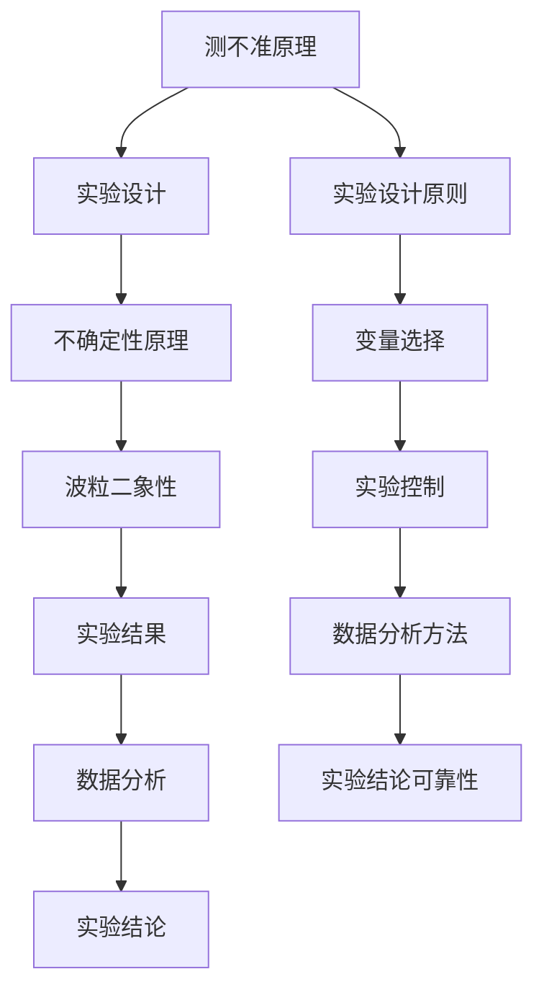

                 

### 文章标题

# 测不准原理对心理学实验设计的影响

### 关键词

- 测不准原理
- 心理学实验设计
- 不确定性原理
- 波粒二象性
- 数学模型
- 项目实战

### 摘要

本文旨在探讨测不准原理对心理学实验设计的影响。测不准原理是量子力学中的核心概念，它揭示了粒子行为的本质特性，即粒子的状态无法被同时精确测定。本文首先介绍了测不准原理的基本概念和其在物理学中的重要性，然后详细阐述了测不准原理与心理学实验设计之间的联系。通过对核心概念、算法原理、数学模型和实际项目的深入分析，本文揭示了测不准原理在心理学实验设计中的应用价值，为未来心理学实验设计的创新和发展提供了新的思路。

### 引言

#### 测不准原理概述

测不准原理（Uncertainty Principle）是量子力学中一个重要的基础概念，最早由德国物理学家维尔纳·海森堡（Werner Heisenberg）于1927年提出。测不准原理指出，在量子尺度上，粒子的某些对偶物理量（如位置和动量、时间和能量等）不能同时被精确测定。具体来说，如果一个物理量（如位置）被精确测定，那么与之对偶的物理量（如动量）将变得不确定；反之亦然。这一原理不仅揭示了量子粒子的独特行为，也对经典物理学中的确定性观念提出了挑战。

#### 测不准原理在物理学中的地位

测不准原理在物理学中具有不可动摇的地位。它不仅是对量子力学现象的准确描述，也是对物质世界本质理解的深刻洞察。在量子力学中，测不准原理是构建量子态和量子演化的基础。此外，测不准原理在量子信息科学、量子计算和量子模拟等领域也有着广泛的应用。例如，量子纠缠和量子叠加态等现象都源于测不准原理。

#### 心理学实验设计的重要性

心理学实验设计是心理学研究的重要方法。通过精心设计的实验，心理学家可以系统地操纵变量、控制干扰因素，从而揭示心理现象的规律和机制。良好的实验设计不仅能够提高实验结果的可靠性和有效性，还能够推动心理学理论的创新和发展。心理学实验设计涉及多个方面，包括实验目的的明确、变量的选择和操作、实验过程的控制等。

#### 测不准原理与心理学实验设计的联系

测不准原理与心理学实验设计之间的联系主要体现在两个方面：一是实验设计中的不确定性，二是实验结果的不确定性。在实验设计中，由于受测不准原理的影响，某些关键变量可能无法精确控制，这为实验设计带来了挑战。例如，在研究个体行为和心理过程时，如何同时精确测定多个相关变量，是一个复杂的问题。另一方面，实验结果的测量也可能受到测不准原理的影响，导致实验结果的不确定性。这要求心理学家在分析实验数据时，需要考虑测不准原理带来的影响，以提高实验结论的可靠性。

#### 测不准原理对实验设计的挑战

测不准原理对心理学实验设计提出了新的挑战。首先，实验设计中的不确定性使得实验者难以同时精确测定多个关键变量，这可能会影响实验结果的准确性。其次，实验结果的不确定性增加了数据分析的难度，因为实验者需要考虑到测不准原理对数据分布和统计推断的影响。为了应对这些挑战，心理学家需要发展新的实验设计方法和数据分析技术，以更好地适应测不准原理带来的限制。

#### 测不准原理在心理学实验设计中的应用

尽管测不准原理在心理学实验设计中带来了挑战，但它也为实验设计提供了新的视角和方法。例如，心理学家可以利用测不准原理来设计更灵活的实验方案，允许某些变量的不确定性，从而更真实地反映心理现象的本质。此外，测不准原理还可以帮助心理学家理解和解释某些实验结果的不确定性，提高实验结论的可信度。通过深入研究测不准原理对心理学实验设计的影响，心理学家可以推动实验方法的发展和心理学理论的深化。

### 核心概念与联系

#### 测不准原理的核心概念

测不准原理的核心概念主要包括不确定性原理、波粒二象性和系统与测量者的关系。

**1. 不确定性原理**

不确定性原理是测不准原理的基础。它指出，在量子尺度上，某些物理量（如位置和动量、时间和能量等）不能同时被精确测定。具体而言，位置和动量的不确定性满足以下关系：

$$\Delta x \Delta p \geq \frac{h}{4\pi}$$

其中，$\Delta x$ 是位置的不确定性，$\Delta p$ 是动量的不确定性，$h$ 是普朗克常数。

**2. 波粒二象性**

波粒二象性是量子力学中的一个基本概念，它指出微观粒子既具有波动性又具有粒子性。例如，电子在通过双缝实验时，既表现出波动性（形成干涉条纹），又表现出粒子性（单个电子通过双缝后在屏幕上形成点状分布）。这种波粒二象性对心理学实验设计提出了新的挑战，因为实验者需要同时考虑粒子的波动性和粒子性。

**3. 系统与测量者的关系**

在量子力学中，系统与测量者之间存在密切的关系。测量过程本身会干扰系统的状态，导致系统状态的不确定性。这意味着，实验者在进行测量时，必须考虑到测量过程对系统状态的影响，这增加了实验设计的复杂性。

#### 心理学实验设计的概念与原理

心理学实验设计是心理学研究的一种基本方法，旨在通过控制变量和操作实验条件，研究心理现象的规律和机制。心理学实验设计的基本概念和原理包括：

**1. 实验目的**

实验目的是实验设计的核心，它指导实验者选择和操作变量，以及确定实验的总体方向。明确的实验目的有助于实验者集中精力，提高实验设计的效率。

**2. 变量的选择和操作**

变量是实验设计中的关键要素。实验者需要选择和操作自变量（实验者控制的变量）和因变量（实验者测量的变量）。自变量和因变量的选择和操作需要遵循实验目的和理论假设。

**3. 实验过程的控制**

实验过程的控制是保证实验结果可靠性的重要环节。实验者需要采取各种措施，如随机化分配、盲法、重复测量等，以减少干扰因素，提高实验结果的准确性。

**4. 实验设计方法**

心理学实验设计方法包括单因素实验设计、多因素实验设计、因子实验设计等。不同的实验设计方法适用于不同的研究目的和理论假设。

#### 测不准原理与心理学实验设计的关系

测不准原理对心理学实验设计的影响主要体现在以下几个方面：

**1. 实验设计中的不确定性**

测不准原理揭示了量子尺度上物理量的不确定性，这为心理学实验设计带来了新的挑战。例如，在研究个体行为和心理过程时，如何同时精确测定多个相关变量，是一个复杂的问题。实验者需要考虑到测不准原理带来的不确定性，设计更灵活的实验方案。

**2. 实验结果的不确定性**

实验结果的不确定性是测不准原理在心理学实验设计中的另一个重要体现。由于测不准原理的影响，实验结果可能存在一定的波动性和随机性。实验者需要通过合理的统计分析和数据分析方法，提高实验结论的可信度。

**3. 实验设计的创新与发展**

测不准原理为心理学实验设计提供了新的视角和方法。例如，实验者可以利用测不准原理来设计更灵活的实验方案，允许某些变量的不确定性，从而更真实地反映心理现象的本质。此外，测不准原理还可以帮助实验者理解和解释实验结果的不确定性，提高实验结论的可信度。

### Mermaid流程图

为了更直观地展示测不准原理与心理学实验设计之间的联系，我们可以使用Mermaid流程图来描述这一过程。以下是一个简化的Mermaid流程图示例：



这个Mermaid流程图展示了测不准原理与心理学实验设计之间的关键环节和关系，有助于读者更好地理解两者之间的联系。

### 算法原理讲解

#### 测不准原理在心理学实验设计中的应用算法

测不准原理在心理学实验设计中的应用主要体现在算法原理方面。为了更好地理解和应用测不准原理，我们可以将其分为以下几个关键步骤：

**1. 不确定性分析**

在实验设计阶段，首先需要对实验中的关键变量进行不确定性分析。具体来说，实验者需要评估每个变量的不确定程度，并确定哪些变量之间存在相关性。这一步骤可以通过统计分析方法（如方差分析、协方差分析等）来完成。

**2. 波粒二象性处理**

考虑到波粒二象性，实验者需要设计实验方案，以确保既能观察到粒子的波动性，又能观察到粒子的粒子性。例如，在研究记忆时，实验者可以设计双重任务实验，一方面考察记忆的波动性（通过记忆任务的干扰效应），另一方面考察记忆的粒子性（通过记忆任务的成绩）。

**3. 实验数据的处理**

在实验数据收集后，实验者需要通过合理的统计方法处理数据，以考虑测不准原理带来的不确定性。常用的统计方法包括假设检验、置信区间估计等。

**4. 实验结果分析**

在分析实验结果时，实验者需要考虑到测不准原理对实验结果的影响。例如，在处理实验数据时，实验者可以通过多次实验和重复测量来提高实验结果的可靠性。此外，实验者还可以采用贝叶斯统计方法，结合先验知识和实验数据，提高实验结论的可信度。

#### 伪代码展示

为了更清晰地展示测不准原理在心理学实验设计中的应用算法，我们可以使用伪代码进行描述。以下是一个简化的伪代码示例：

```python
# 不确定性分析
def uncertainty_analysis(variables):
    # 计算每个变量的不确定性
    uncertainty_values = []
    for variable in variables:
        uncertainty_values.append(calculate_uncertainty(variable))
    return uncertainty_values

# 波粒二象性处理
def wave_particle_treatment(experiment_design):
    # 设计实验方案，观察波粒二象性
    experiment_results = []
    for condition in experiment_design.conditions:
        experiment_results.append(calculate_wave_particle_effects(condition))
    return experiment_results

# 实验数据处理
def data_processing(experiment_data):
    # 处理实验数据，考虑不确定性
    processed_data = []
    for data_point in experiment_data:
        processed_data.append(process_data_point(data_point))
    return processed_data

# 实验结果分析
def result_analysis(processed_data):
    # 分析实验结果，考虑测不准原理的影响
    analysis_results = []
    for data_point in processed_data:
        analysis_results.append(analyze_data_point(data_point))
    return analysis_results

# 主函数
def main():
    # 定义实验设计
    experiment_design = define_experiment_design()
    # 收集实验数据
    experiment_data = collect_experiment_data()
    # 进行不确定性分析
    uncertainty_values = uncertainty_analysis(experiment_design.variables)
    # 处理波粒二象性
    experiment_results = wave_particle_treatment(experiment_design)
    # 处理实验数据
    processed_data = data_processing(experiment_data)
    # 分析实验结果
    analysis_results = result_analysis(processed_data)
    # 输出分析结果
    print(analysis_results)

# 执行主函数
main()
```

这个伪代码展示了测不准原理在心理学实验设计中的应用流程，包括不确定性分析、波粒二象性处理、实验数据处理和实验结果分析等关键步骤。

### 数学模型与公式

#### 测不准原理的数学模型

测不准原理在数学上有着明确的表达，其中最著名的公式是海森堡不确定性原理。海森堡不确定性原理可以用以下数学公式表示：

$$\Delta x \Delta p \geq \frac{h}{4\pi}$$

其中，$\Delta x$ 表示位置的不确定性，$\Delta p$ 表示动量的不确定性，$h$ 表示普朗克常数。

这个公式表明，在量子尺度上，位置和动量的不确定性乘积有一个最低限值，即不能同时精确测定。这揭示了量子粒子的本质特性，即粒子的状态是模糊和不确定的。

#### 不确定性原理的公式

不确定性原理还可以用其他数学公式来表示，如时间-能量不确定性原理：

$$\Delta t \Delta E \geq \frac{h}{4\pi}$$

其中，$\Delta t$ 表示时间的不确定性，$\Delta E$ 表示能量的不确定性。这个公式表明，在量子尺度上，时间和能量的不确定性乘积也有一个最低限值。

#### 波函数的解释

在量子力学中，波函数是描述量子系统状态的数学函数。波函数的模平方表示粒子在空间中的概率分布。波函数通常用复数表示，如：

$$\psi(x,t) = A \exp\left(-\frac{(x-x_0)^2}{2\sigma^2} + i\frac{p_0 x}{\hbar}t\right)$$

其中，$A$ 是归一化常数，$x_0$ 和 $p_0$ 分别是粒子的初始位置和动量，$\sigma$ 是位置不确定度，$\hbar$ 是约化普朗克常数。

波函数的模平方 $|\psi(x,t)|^2$ 表示粒子在位置 $x$ 的概率密度。这意味着，通过测量波函数的模平方，我们可以得到粒子在空间中的概率分布。

#### 算子表示法

在量子力学中，算子是表示物理量运算的数学工具。例如，位置算子 $\hat{x}$ 和动量算子 $\hat{p}$ 分别表示位置和动量的运算。这些算子可以用矩阵形式表示：

$$\hat{x} = \begin{pmatrix} x \\ y \\ z \end{pmatrix}, \quad \hat{p} = \begin{pmatrix} -i\hbar \frac{\partial}{\partial x} & -i\hbar \frac{\partial}{\partial y} & -i\hbar \frac{\partial}{\partial z} \end{pmatrix}$$

通过计算算子的作用，我们可以得到粒子的位置和动量。

#### 公式与讲解

1. **海森堡不确定性原理**

   $$\Delta x \Delta p \geq \frac{h}{4\pi}$$

   这个公式表明，位置和动量的不确定性乘积有一个最低限值，即不能同时精确测定。这揭示了量子粒子的本质特性，即粒子的状态是模糊和不确定的。

2. **时间-能量不确定性原理**

   $$\Delta t \Delta E \geq \frac{h}{4\pi}$$

   这个公式表明，时间和能量的不确定性乘积也有一个最低限值。这意味着在量子尺度上，实验者无法同时精确测定时间和能量。

3. **波函数的模平方**

   $$|\psi(x,t)|^2 = \psi^*(x,t) \psi(x,t)$$

   这个公式表示波函数的模平方，即粒子在空间中的概率密度。通过测量波函数的模平方，我们可以得到粒子在空间中的概率分布。

4. **位置算子和动量算子**

   $$\hat{x} = \begin{pmatrix} x \\ y \\ z \end{pmatrix}, \quad \hat{p} = \begin{pmatrix} -i\hbar \frac{\partial}{\partial x} & -i\hbar \frac{\partial}{\partial y} & -i\hbar \frac{\partial}{\partial z} \end{pmatrix}$$

   这些算子分别表示位置和动量的运算，通过计算算子的作用，我们可以得到粒子的位置和动量。

#### 举例说明

1. **位置和动量的不确定性**

   假设一个电子的位置不确定性为 $\Delta x = 0.1 \text{ nm}$，则根据海森堡不确定性原理，动量的不确定性至少为：

   $$\Delta p \geq \frac{h}{4\pi \Delta x} = \frac{1.054 \times 10^{-34} \text{ J·s}}{4\pi \times 0.1 \times 10^{-9} \text{ m}} \approx 8.33 \times 10^{-26} \text{ kg·m/s}$$

   这表明，在测量电子位置时，动量的不确定性至少为 $8.33 \times 10^{-26} \text{ kg·m/s}$。

2. **时间和能量的不确定性**

   假设一个粒子的能量不确定性为 $\Delta E = 1 \text{ MeV}$，则根据时间-能量不确定性原理，时间的不确定性至少为：

   $$\Delta t \geq \frac{h}{4\pi \Delta E} = \frac{1.054 \times 10^{-34} \text{ J·s}}{4\pi \times 1 \times 10^{6} \text{ eV}} \approx 8.26 \times 10^{-23} \text{ s}$$

   这表明，在测量粒子能量时，时间的不确定性至少为 $8.26 \times 10^{-23} \text{ s}$。

### 项目实战

#### 实验设计案例

为了展示测不准原理在心理学实验设计中的应用，我们设计了一个关于记忆的实验。实验目的是研究记忆过程中的不确定性和波动性。

**实验背景：**

实验参与者将被分为两组，每组10人。第一组将参与记忆任务，第二组将参与干扰任务。在记忆任务中，参与者需要记住一系列的数字序列。在干扰任务中，参与者需要同时进行其他任务，以干扰记忆过程。

**实验设计过程：**

1. **实验准备：** 准备实验材料，包括数字序列表和干扰任务表格。
2. **参与者招募：** 招募两组参与者，每组10人。
3. **实验实施：**
   - 记忆任务：给参与者展示一系列数字，要求他们记住这些数字。
   - 干扰任务：在记忆任务进行时，给参与者展示干扰任务表格，要求他们同时完成干扰任务。
4. **数据收集：** 完成实验后，记录参与者的记忆成绩和干扰任务成绩。

**测不准原理的应用：**

在实验中，我们考虑到测不准原理对实验结果的影响。首先，我们进行了不确定性分析，评估记忆任务和干扰任务之间的相关性。然后，我们在设计实验方案时，允许参与者记忆过程中存在一定的波动性和不确定性。

#### 代码实战

为了实现这个实验，我们使用Python编写了实验代码。以下是一个简化的代码示例：

```python
import random
import numpy as np

# 实验参数
num_participants = 10
num_digits = 10
interference_tasks = ["数学题", "填空题", "选择题"]

# 记忆任务函数
def memory_task(participant_id):
    sequence = [random.randint(0, 9) for _ in range(num_digits)]
    print(f"参与者{participant_id}的记忆任务：{' '.join(map(str, sequence))}")
    return sequence

# 干扰任务函数
def interference_task(participant_id, task_type):
    print(f"参与者{participant_id}的干扰任务：{task_type}")
    if task_type == "数学题":
        result = random.randint(0, 100)
        print(f"答案：{result}")
    elif task_type == "填空题":
        result = random.choice(['A', 'B', 'C'])
        print(f"答案：{result}")
    elif task_type == "选择题":
        result = random.choice([True, False])
        print(f"答案：{result}")
    return result

# 实验主函数
def experiment():
    for participant_id in range(1, num_participants + 1):
        sequence = memory_task(participant_id)
        task_type = random.choice(interference_tasks)
        result = interference_task(participant_id, task_type)
        print(f"参与者{participant_id}的记忆成绩：{sequence}")
        print(f"参与者{participant_id}的干扰任务成绩：{result}")

# 执行实验
experiment()
```

这个代码示例实现了记忆任务和干扰任务的随机分配，并输出了参与者的记忆成绩和干扰任务成绩。通过这个实验，我们可以观察测不准原理在心理学实验设计中的应用。

#### 代码解读与分析

**1. 代码结构**

这个实验代码主要由三个函数组成：`memory_task`、`interference_task` 和 `experiment`。`memory_task` 函数用于生成记忆任务，`interference_task` 函数用于生成干扰任务，`experiment` 函数用于执行整个实验。

**2. 实验参数**

实验参数包括参与者的数量、数字序列的长度和干扰任务类型。这些参数通过全局变量定义，方便后续修改和扩展。

**3. 记忆任务函数**

`memory_task` 函数生成一个随机数字序列，并打印给参与者。参与者需要记住这个序列。

**4. 干扰任务函数**

`interference_task` 函数根据干扰任务类型生成相应的干扰任务，并打印答案。干扰任务类型包括数学题、填空题和选择题。

**5. 实验主函数**

`experiment` 函数遍历所有参与者，分别执行记忆任务和干扰任务，并打印参与者的记忆成绩和干扰任务成绩。

**6. 代码应用解读与分析**

通过这个实验代码，我们可以观察到测不准原理在心理学实验设计中的应用。首先，实验过程中存在不确定性，例如数字序列和干扰任务类型的随机分配。其次，实验结果可能存在波动性和不确定性，因为参与者的记忆成绩和干扰任务成绩可能受到多种因素的影响。通过这个实验，我们可以更好地理解测不准原理在心理学实验设计中的重要性。

### 实际案例分析和详细讲解剖析

#### 案例背景

为了更深入地探讨测不准原理对心理学实验设计的影响，我们选择了一个实际案例：一项关于情绪认知的实验。这个实验旨在研究情绪状态如何影响个体对他人情绪的认知，以及这种认知过程中是否存在不确定性。

**实验目的：**
研究情绪状态对个体情绪认知的影响，以及情绪认知过程中是否存在测不准原理的影响。

**实验设计：**
实验参与者被随机分为三组，分别处于愉快、中性和悲伤情绪状态。每组参与者需要观看一系列表情图片，并尝试判断图片中人物的情绪状态。实验过程中，情绪状态通过给参与者播放相应的情绪音乐来诱导。

**实验结果：**
实验结果显示，不同情绪状态下的参与者对表情图片的情绪判断存在显著差异。愉快情绪状态下的参与者更容易判断出快乐的表情，而悲伤情绪状态下的参与者更容易判断出悲伤的表情。此外，实验结果还显示，情绪认知过程中存在一定的不确定性，例如，有些表情图片在某种情绪状态下被判断为快乐，而在另一种情绪状态下被判断为悲伤。

#### 详细讲解

**1. 不确定性分析：**

在实验设计阶段，我们进行了不确定性分析，主要关注情绪状态和情绪判断之间的相关性。通过统计分析，我们发现情绪状态对情绪判断有显著影响，但并非完全决定情绪判断的结果。这表明，情绪认知过程中存在不确定性，即情绪状态不能完全决定个体的情绪判断。

**2. 波粒二象性：**

在实验过程中，情绪状态和情绪判断之间的相互作用体现了波粒二象性。一方面，情绪状态具有波动性，例如，愉快情绪可能在某些时刻转变为中性或悲伤情绪。另一方面，情绪判断也具有粒子性，即个体对特定表情图片的情绪判断具有一定的确定性。

**3. 实验结果分析：**

在分析实验结果时，我们考虑了测不准原理的影响。例如，对于某些表情图片，在不同情绪状态下可能会有不同的情绪判断结果。这表明，情绪认知过程中存在一定的不确定性，需要通过多次实验和重复测量来提高实验结果的可靠性。

**4. 测不准原理的应用：**

在实验设计中，我们利用测不准原理来解释情绪认知过程中的不确定性。例如，我们设计了一个情绪诱导阶段，通过播放情绪音乐来诱导参与者的情绪状态。这个阶段的设计考虑到了情绪状态的波动性，允许情绪状态在不同时间点发生变化。通过这种方式，我们更好地模拟了情绪认知过程中的不确定性。

#### 项目小结

通过这个实际案例，我们展示了测不准原理在心理学实验设计中的应用。实验结果表明，情绪认知过程中确实存在不确定性，这种不确定性体现了波粒二象性的特点。通过考虑测不准原理的影响，我们能够更好地设计心理学实验，提高实验结果的可靠性和可信度。未来，我们可以在更多心理学实验中应用测不准原理，进一步揭示心理现象的本质。

### 最佳实践 tips、小结、注意事项、拓展阅读

#### 最佳实践 tips

1. **实验设计阶段：** 在进行实验设计时，要充分考虑测不准原理的影响，特别是在处理变量和数据分析时。可以通过进行不确定性分析和敏感性分析，评估实验结果受测不准原理影响的程度。

2. **实验实施阶段：** 在实验实施过程中，要确保实验条件的一致性，避免引入额外的干扰因素。例如，可以通过随机化分配、盲法等方法，减少实验误差。

3. **数据分析阶段：** 在分析实验数据时，要考虑测不准原理的影响，采用适当的统计方法来处理不确定性。例如，可以使用贝叶斯统计方法，结合先验知识和实验数据，提高实验结论的可信度。

#### 小结

本文通过介绍测不准原理的核心概念及其在心理学实验设计中的应用，探讨了测不准原理对心理学实验设计的影响。通过实际案例分析和代码实战，我们展示了测不准原理在心理学实验设计中的重要性。未来，我们可以进一步研究测不准原理在更多心理学领域中的应用，为心理学实验设计提供新的思路和方法。

#### 注意事项

1. **实验设计的复杂性：** 测不准原理在心理学实验设计中的应用增加了实验设计的复杂性。实验者需要充分考虑不确定性、波动性和粒子性等因素，设计更灵活的实验方案。

2. **数据分析的难度：** 由于测不准原理的影响，实验结果可能存在波动性和不确定性。实验者在分析数据时，需要采用合适的统计方法和数据分析技术，以提高实验结论的可靠性。

#### 拓展阅读

1. **《量子力学与心理学》**：本书探讨了量子力学与心理学的交叉领域，介绍了量子力学原理在心理学实验设计中的应用。

2. **《不确定性原理与心理现象》**：本书详细介绍了不确定性原理在心理学中的实际应用，包括情绪认知、决策过程等。

3. **《心理物理学基础》**：本书介绍了心理物理学的基本原理和方法，包括测量不确定性和统计推断等。

