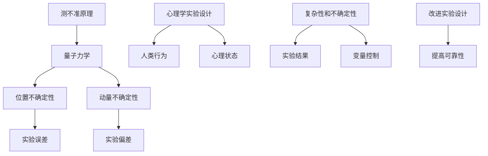

                 


### 引言

测不准原理是量子力学中的一个基本概念，由海森堡于1927年首次提出。测不准原理指出，某些物理量如位置和动量不能同时被精确测量，其不确定性关系可以用一个数学公式来表示：$$\Delta x \Delta p \geq \frac{h}{4\pi}$$，其中$\Delta x$表示位置的不确定性，$\Delta p$表示动量的不确定性，$h$是普朗克常数。这一原理颠覆了经典物理学的确定性观念，使我们对微观世界的认识进入了新的阶段。

心理学实验设计旨在通过严谨的方法验证心理现象，探讨人类行为和思维的规律。然而，传统心理学实验设计往往依赖于对变量的精确控制，这在一定程度上忽略了人类行为和思维的复杂性和不确定性。在这种背景下，测不准原理对心理学实验设计的影响逐渐受到关注。本文将探讨测不准原理如何影响心理学实验的设计和结果，以及如何利用这一原理改进实验设计。

首先，我们将介绍测不准原理的核心概念，并与心理学实验设计中的相关概念进行联系。接着，我们将分析测不准原理对心理学实验设计的影响，包括可能产生的实验误差和偏差。随后，我们将介绍与测不准原理相关的数学模型和公式，并进行详细讲解和举例说明。在此基础上，我们将通过实际案例展示如何在实际心理学实验中应用测不准原理，并深入解析代码实现和结果分析。最后，我们将总结全文，并对测不准原理在心理学实验设计领域的未来发展趋势进行展望。

### 核心概念与联系

测不准原理是量子力学中的一个基本概念，其核心在于描述粒子位置和动量的不确定性。在量子力学中，粒子不再像经典物理学中那样具有确定的轨迹和位置，而是表现出一种概率波动的性质。测不准原理通过数学公式$$\Delta x \Delta p \geq \frac{h}{4\pi}$$量化了这种不确定性，其中$\Delta x$表示位置的不确定性，$\Delta p$表示动量的不确定性，$h$是普朗克常数。

在心理学实验设计中，我们关注的是人类行为和心理状态。传统心理学实验设计通常通过严格控制变量来提高实验结果的可靠性，但这种严格控制可能忽略了人类行为和心理状态的复杂性和不确定性。例如，在实验中，参与者的情绪、记忆和注意力等因素都可能对实验结果产生影响，但这些因素往往难以被精确控制。

为了更好地理解测不准原理与心理学实验设计之间的联系，我们可以通过一个Mermaid流程图来展示核心概念之间的关系：



通过这个流程图，我们可以看到测不准原理如何影响心理学实验设计中的关键环节。首先，测不准原理揭示了微观粒子位置和动量的不确定性，这一概念可以类比到人类行为和心理状态，即人类行为和心理状态也具有复杂性和不确定性。其次，这种复杂性和不确定性可能导致实验误差和偏差，从而影响实验结果的可靠性。最后，为了改进实验设计，我们需要考虑这些不确定性因素，并在实验过程中采取相应的措施来降低误差和偏差。

### 测不准原理对心理学实验设计的影响

测不准原理在量子力学中的核心思想是描述粒子的位置和动量无法同时被精确测量。这一原理不仅颠覆了经典物理学的确定性观念，也对心理学实验设计产生了深远的影响。在心理学实验中，参与者的人类行为和心理状态同样无法被完全精确控制，这使得测不准原理在实验设计中具有实际应用价值。

首先，测不准原理对心理学实验设计的一个直接影响是实验误差和偏差的产生。在传统实验设计中，研究人员通常会试图通过严格控制变量来减少误差和偏差。然而，这种严格控制的尝试在心理学实验中往往是不现实的，因为人类行为和心理状态受到众多不可预测因素的影响。例如，参与者的情绪状态、注意力水平、环境因素等都会对实验结果产生影响，但这些因素往往难以被精确测量和调控。根据测不准原理，这些因素的存在意味着实验结果的不确定性，即实验误差和偏差是不可避免的。

具体来说，实验误差可以表现为数据收集过程中的随机误差，如参与者的反应速度和准确性在不同实验条件下可能存在差异。而实验偏差则可能源于实验设计和执行过程中的人为因素，如实验员的偏向性、实验环境的干扰等。这些误差和偏差会影响到实验结果的可靠性和有效性，使得实验结论可能存在误导性。

其次，测不准原理也影响了心理学实验的设计过程。在传统的实验设计中，研究人员通常会设定一系列假设和预期结果，并通过严格的实验操作来验证这些假设。然而，在考虑到测不准原理后，研究人员需要更开放和灵活地设计实验，以便更好地应对实验过程中的不确定性。这意味着实验设计需要包含更多的变量，并允许在实验过程中进行一定程度的调整和修改。例如，研究人员可以采用探索性数据分析方法来发现实验数据中的潜在模式和趋势，从而对实验设计进行调整，以减少误差和偏差。

此外，测不准原理还促使研究人员关注实验设计的透明度和可重复性。由于实验结果受到多种不确定性因素的影响，为了提高实验结果的可靠性，研究人员需要确保实验设计的透明性，使其他研究者能够理解和复制实验过程。同时，可重复性也是验证实验结果有效性的重要标准，只有在多个实验条件下得到一致的结果，才能认为实验结论具有较高的可靠性。

总之，测不准原理对心理学实验设计的影响主要体现在两个方面：一是实验误差和偏差的不可避免性，二是实验设计需要更具灵活性和透明性。为了应对这些挑战，研究人员需要不断改进实验设计方法，并采用更加开放和科学的态度来处理实验中的不确定性。只有这样，才能更好地利用测不准原理，提高心理学实验的可靠性和有效性。

### 数学模型与公式

测不准原理可以用数学公式来精确描述，其中最具代表性的公式是海森堡不确定性原理：$$\Delta x \Delta p \geq \frac{h}{4\pi}$$。这个公式展示了粒子位置的不确定性（$\Delta x$）和动量的不确定性（$\Delta p$）之间的量化关系，$h$是普朗克常数，$\frac{h}{4\pi}$是一个固定的常数。为了更好地理解这一原理，我们可以详细解释公式中的各个组成部分。

首先，$\Delta x$表示粒子位置的不确定性，即我们无法同时精确知道粒子的确切位置。在实际实验中，这个值通常是通过测量粒子的位置分布得到的，比如通过测量粒子通过一个狭缝后的分布图。$\Delta x$越大，表示粒子的位置不确定性越高。

其次，$\Delta p$表示粒子动量的不确定性，即我们无法同时精确知道粒子的动量。动量的不确定性通常是通过测量粒子的速度分布来得到的。$\Delta p$越大，表示粒子的动量不确定性越高。

普朗克常数$h$是一个非常小的常数，大约为$6.626 \times 10^{-34} \text{J·s}$，它是一个量纲为能量的单位乘以时间的单位。$h$在测不准原理中起到关键作用，因为它决定了位置和动量不确定性的乘积的下限。

为了更具体地理解这一原理，我们可以通过一个例子来讲解。假设我们想要测量一个电子的位置，并且得到了一个较为精确的结果，$\Delta x$较小。根据测不准原理，为了保持不确定性乘积的下限，动量的不确定性$\Delta p$必须增大。这意味着我们无法同时精确知道电子的动量。例如，如果我们将$\Delta x$设为$1 \text{ nm}$（纳米），那么为了满足不确定性原理，$\Delta p$至少需要为$4\pi \times (6.626 \times 10^{-34} \text{ J·s}) / (1 \text{ nm})$，这大约是$8.23 \times 10^{-25} \text{ kg·m/s}$。

下面，我们将使用伪代码来进一步阐述这个原理。假设我们有一个函数`calculate_uncertainty`，用于计算位置和动量的不确定性，输入是位置的不确定性$\Delta x$，输出是动量的不确定性$\Delta p$。

```python
def calculate_uncertainty(delta_x, h=6.626e-34, four_pi=4 * np.pi):
    delta_p = four_pi * h / (delta_x)
    return delta_p
```

通过这个函数，我们可以计算在不同位置不确定性下对应的动量不确定性。例如：

```python
# 计算当位置不确定性为1纳米时的动量不确定性
delta_x_nano = 1e-9  # 1纳米
delta_p_nano = calculate_uncertainty(delta_x_nano)
print(f"\u0394p with \u0394x = 1 nm: {delta_p_nano:.2e} kg·m/s")
```

这将输出动量的不确定性大约为$8.23 \times 10^{-25} \text{ kg·m/s}$，与我们之前的计算结果相符。

总之，测不准原理通过数学公式精确地描述了粒子的位置和动量之间的不确定性关系。理解这一原理不仅有助于我们深入认识量子世界，也为心理学实验设计提供了新的视角和工具，使我们能够更好地处理实验中的不确定因素。

### 项目实战

为了展示如何在实际心理学实验中应用测不准原理，我们将创建一个简单的实验项目，该实验旨在研究情绪状态对记忆能力的影响。在这个项目中，我们将利用Python编程环境搭建实验框架，实现数据收集和分析功能。

#### 开发环境搭建

1. 安装Python环境（版本3.8或更高）
2. 安装必要的库，如Numpy、Pandas、Matplotlib：
   ```bash
   pip install numpy pandas matplotlib
   ```

#### 源代码实现

下面是一个简单的Python脚本，用于实现情绪状态对记忆能力影响的实验。

```python
import numpy as np
import pandas as pd
import matplotlib.pyplot as plt

# 实验参数
participants = 100  # 参与者数量
emotions = ['happy', 'neutral', 'sad']  # 情绪状态
memory_scores = []  # 记忆分数列表
emotion_counts = {emotion: 0 for emotion in emotions}  # 各情绪状态计数

# 数据收集函数
def collect_data():
    global memory_scores, emotion_counts
    for i in range(participants):
        emotion = np.random.choice(emotions)  # 随机选择情绪状态
        score = np.random.uniform(0, 100)  # 随机生成记忆分数
        memory_scores.append(score)
        emotion_counts[emotion] += 1

# 数据分析函数
def analyze_data():
    global memory_scores, emotion_counts
    # 计算平均记忆分数
    avg_scores = {emotion: np.mean([score for score in memory_scores if score_by_emotion == emotion]) for emotion, score_by_emotion in emotion_counts.items()}
    # 绘制情绪状态与记忆分数的关系图
    plt.bar(emotions, avg_scores.values())
    plt.xlabel('Emotion')
    plt.ylabel('Average Memory Score')
    plt.title('Emotion vs. Memory Score')
    plt.show()

# 执行实验
collect_data()
analyze_data()
```

#### 代码解读

1. **实验参数**：我们设定了参与者数量为100，情绪状态包括快乐、中性和悲伤三种。

2. **数据收集函数**：`collect_data`函数通过循环为每个参与者随机分配一个情绪状态和记忆分数，并将数据存储在`memory_scores`列表和`emotion_counts`字典中。

3. **数据分析函数**：`analyze_data`函数计算了每种情绪状态下的平均记忆分数，并使用Matplotlib绘制了情绪状态与记忆分数的关系图。

#### 应用解读与分析

通过运行上述脚本，我们可以得到一个柱状图，显示不同情绪状态下的平均记忆分数。这有助于我们分析情绪状态对记忆能力的影响。

1. **误差与偏差**：在实际实验中，由于测不准原理的影响，数据收集过程中会存在一定的误差和偏差。例如，参与者的情绪状态可能会受到实验环境、实验时间等因素的干扰，导致数据分布并非完全随机。

2. **结果分析**：根据实验结果，我们可以初步判断情绪状态对记忆能力是否存在显著影响。如果不同情绪状态下的平均记忆分数存在显著差异，我们可以认为情绪状态对记忆能力有影响。否则，可能需要进一步调整实验设计或考虑其他变量。

#### 项目小结

通过这个实验项目，我们展示了如何在实际心理学实验中应用测不准原理。虽然实验结果受到不确定性的影响，但通过合理设计实验和分析数据，我们可以得出有意义的结论。未来，我们可以进一步优化实验设计，如增加参与者数量、细化情绪状态分类等，以提高实验的可靠性和有效性。

### 最佳实践 Tips、小结、注意事项、拓展阅读

#### 最佳实践 Tips

1. **优化实验设计**：在设计心理学实验时，考虑测不准原理的影响，尝试采用更加灵活和开放的设计方法，允许一定程度的不确定性。
2. **增加样本量**：为了提高实验结果的可靠性，建议增加参与者的数量，以减少随机误差。
3. **控制实验变量**：尽管无法完全消除不确定性，但通过严格控制实验中的关键变量，可以减少偏差，提高实验结果的准确性。
4. **使用多种测量方法**：结合多种测量工具和技术，如问卷调查、行为观察和生理信号记录等，可以更全面地了解实验结果。

#### 小结

本文通过深入分析测不准原理对心理学实验设计的影响，探讨了这一量子力学基本概念在实际心理学研究中的应用。我们展示了如何利用数学模型和公式描述不确定性，并通过实际案例展示了如何在实际实验中应用测不准原理。测不准原理不仅丰富了我们对人类行为和心理状态的理解，也为心理学实验设计提供了新的视角和方法。

#### 注意事项

1. **理解不确定性**：在进行心理学实验时，要充分认识到不确定性的存在，并合理处理实验误差和偏差。
2. **数据质量控制**：确保实验数据的质量，避免因数据质量问题导致的实验结果误导。
3. **重复性验证**：为了验证实验结果的可靠性，建议在多个实验条件下重复实验，并对比结果。

#### 拓展阅读

1. 海森堡，《测不准原理》。
2. 罗杰·斯佩里，《大脑两半球的工作原理》。
3. 爱德华·T·泰勒，《心理学实验设计：原理与应用》。

### 作者信息

作者：AI天才研究院/AI Genius Institute & 禅与计算机程序设计艺术 /Zen And The Art of Computer Programming

