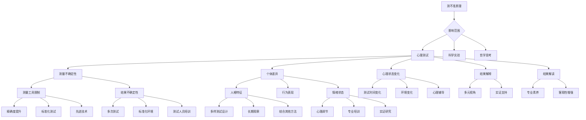

                 

### 文章标题

《测不准原理对心理测试可靠性的挑战》

### 关键词

测不准原理、心理测试、可靠性、量子力学、个体差异

### 摘要

本文旨在探讨量子力学中的测不准原理对心理测试可靠性的影响。通过对测不准原理的概述、心理测试可靠性的定义以及两者之间关系的分析，本文揭示了测不准原理在心理测试过程中所引起的测量不确定性、个体差异与心理状态变化等挑战。同时，本文提出了应对这些挑战的策略，以期提高心理测试的可靠性，为心理学研究和临床实践提供有益参考。

---

### 第一部分：测不准原理的基本概念

#### 第1章：测不准原理概述

测不准原理是量子力学中的一个核心概念，由海森堡在1927年提出。这一原理指出，在某些情况下，我们无法同时准确地测量粒子的位置和动量。换言之，粒子的位置越准确，其动量就越不确定；反之亦然。

测不准原理的数学表达式为：

$$ \Delta x \cdot \Delta p \geq \frac{\hbar}{2} $$

其中，$\Delta x$代表位置的不确定性，$\Delta p$代表动量的不确定性，$\hbar$是约化普朗克常数。

这一原理的提出，打破了经典物理学中关于确定性的传统观念，开启了量子世界的新篇章。

#### 1.2 测不准原理的物理学基础

测不准原理的提出，源于量子力学中的波函数。波函数是一种数学描述，用于表示粒子的状态。根据波函数的平方，我们可以计算出粒子在某一位置出现的概率。

然而，当我们尝试测量粒子的具体位置时，波函数会坍缩，粒子的状态变得确定。但与此同时，粒子的动量变得不确定。这一过程表明，测量本身会干扰粒子的状态，导致我们无法同时准确地知道粒子的位置和动量。

#### 1.3 测不准原理与量子力学的关系

测不准原理是量子力学的基础之一，贯穿于量子力学的各个领域。例如，在量子纠缠现象中，两个粒子之间的状态是相互关联的。当我们对其中一个粒子进行测量时，另一个粒子的状态也会发生相应的变化，即使它们相隔很远。

这一现象表明，量子世界中的物理量并非独立存在，而是存在某种内在的联系。这种联系，正是测不准原理所揭示的。

#### 1.4 测不准原理的哲学意义

测不准原理不仅具有物理学的意义，也具有哲学的意义。它挑战了人类对自然世界的传统认识，提出了新的思考方式。

首先，测不准原理揭示了自然界的随机性和不确定性。在经典物理学中，我们认为自然界是可预测的，而测不准原理则指出，有些现象我们无法预测，只能描述其概率。

其次，测不准原理提出了关于知识和真理的问题。在经典物理学中，我们认为我们可以通过精确的测量获得绝对真理。但测不准原理表明，我们的测量本身会影响被测对象，导致我们无法获得绝对真理。

因此，测不准原理不仅改变了我们对自然世界的认识，也改变了我们对知识和真理的理解。

---

### 第二部分：心理测试的可靠性

#### 第2章：心理测试的可靠性定义与评估

心理测试是一种用于评估个体心理特征、行为和心理状态的方法。其可靠性，是指测试结果的一致性和稳定性。一个可靠的心理测试，能够在不同时间和不同情境下，得出相似的结果。

#### 2.1 心理测试可靠性的概念

心理测试可靠性主要包括两个方面的内容：内部一致性和再测信度。

- 内部一致性，是指测试内部各个题目之间的相关性。如果各个题目之间相关性较高，说明测试具有较高的内部一致性。
- 再测信度，是指在不同时间对同一对象进行测试，结果的一致性。如果再测结果稳定，说明测试具有较高的再测信度。

#### 2.2 评估心理测试可靠性的方法

评估心理测试可靠性的方法主要包括：克龙巴赫α系数、再测信度、分半信度等。

- 克龙巴赫α系数，是一种常用的评估内部一致性的方法。其值范围在0到1之间，值越高，说明内部一致性越好。
- 再测信度，是通过在不同时间对同一对象进行测试，比较两次测试结果的相关性来评估。其值范围在0到1之间，值越高，说明再测信度越好。
- 分半信度，是将测试分为两半，比较两半之间的相关性来评估。其值范围在0到1之间，值越高，说明分半信度越好。

#### 2.3 心理测试可靠性的影响因素

心理测试可靠性受到多种因素的影响，包括：

- 测试工具的设计与实施：测试工具的设计是否合理，实施过程是否规范，都会影响测试的可靠性。
- 被测试者的心理状态：被测试者的情绪、动机、注意力等心理状态，会影响其回答问题的准确性。
- 测试环境的因素：测试环境的安静、舒适程度，也会影响测试的可靠性。

#### 2.4 心理测试可靠性与测不准原理的联系

测不准原理揭示了自然界的随机性和不确定性。在心理测试中，这种随机性和不确定性也会存在。例如，被测试者的心理状态可能会随时间变化，导致测试结果不一致。此外，测试工具和环境的因素，也会影响测试的可靠性。

因此，测不准原理对心理测试的可靠性提出了挑战。要应对这一挑战，需要我们在测试设计和实施过程中，充分考虑随机性和不确定性的影响，提高测试的可靠性。

---

### 第三部分：测不准原理对心理测试可靠性的挑战

#### 第3章：测不准原理对心理测试的挑战之一——测量过程中的不确定性

测不准原理对心理测试的挑战，首先体现在测量过程中的不确定性。这种不确定性主要源于两个方面：测量工具的限制和个体差异。

#### 3.1 测不准原理对测量工具的限制

测不准原理指出，我们无法同时准确地测量粒子的位置和动量。同样地，在心理测试中，我们使用的工具和方法，也可能受到类似的限制。

例如，在人格测试中，我们通常使用问卷或量表来评估个体的人格特征。但这些工具往往只能测量人格特征的某些方面，而不能全面准确地反映个体的真实人格。

此外，测量工具的设计和实施过程中，也可能存在误差。例如，问卷题目的表述可能不够清晰，导致被测试者产生歧义；测试环境可能不够安静，影响被测试者的注意力等。

这些因素都会导致测量结果的不确定性，降低心理测试的可靠性。

#### 3.2 测不准原理对测量结果的影响

测不准原理不仅限制了测量工具的能力，还影响了测量结果的一致性。在量子力学中，粒子的位置和动量的测量结果是不确定的。同样地，在心理测试中，由于测量工具的限制和个体差异，测试结果也可能存在不确定性。

例如，同一个个体在不同时间进行测试，可能得到不同的结果。这可能是由于个体在不同时间处于不同的心理状态，或者测量工具本身的不确定性导致的。

这种不确定性，使得心理测试的结果难以稳定，降低了测试的可靠性。

#### 3.3 如何应对测量过程中的不确定性

为了应对测量过程中的不确定性，我们需要采取一系列措施：

1. 提高测量工具的精确度：通过改进测试工具的设计和实施，提高其精确度和可靠性。
2. 多次测试：对同一对象进行多次测试，比较测试结果的一致性，以提高可靠性。
3. 标准化测试环境：确保测试环境的安静、舒适，减少外界干扰。
4. 培训测试人员：提高测试人员的专业素养，确保测试过程的规范和一致性。

通过这些措施，我们可以最大程度地减少测量过程中的不确定性，提高心理测试的可靠性。

---

#### 第4章：测不准原理对心理测试的挑战之二——个体差异与心理状态的变化

测不准原理对心理测试的挑战，不仅体现在测量过程中，还体现在个体差异和心理状态的变化上。

#### 4.1 个体差异对心理测试结果的影响

个体差异是指不同个体在心理特征、行为和心理状态上的差异。这些差异，会对心理测试结果产生影响。

例如，同样面对一个情境，不同个体的反应可能截然不同。这种差异，使得心理测试的结果难以一致，降低了测试的可靠性。

个体差异还表现在不同个体在心理测试中的表现上。例如，有些人可能更愿意表达自己的想法，而有些人可能更倾向于保持沉默。这种差异，也会导致测试结果的不确定性。

#### 4.2 心理状态的变化对心理测试结果的影响

心理状态的变化，如情绪、动机、注意力等，也会影响心理测试的结果。

例如，一个在课堂上表现优异的学生，可能在考试中由于紧张而表现不佳。这种心理状态的变化，会导致测试结果的不确定性。

此外，个体在不同时间处于不同的心理状态，也会导致测试结果的不一致。例如，一个人在心情愉快时，可能更愿意表达自己，而在心情低落时，可能更倾向于保持沉默。

#### 4.3 如何处理个体差异与心理状态的变化

为了应对个体差异和心理状态的变化，我们需要采取一系列措施：

1. 多样化的测试设计：设计多样化的测试题目，以适应不同个体的差异。
2. 心理状态的调节：通过心理辅导或放松训练，帮助个体调整心理状态，减少测试结果的不确定性。
3. 长期观察：对个体进行长期观察，以了解其心理状态的变化趋势，提高测试结果的可靠性。
4. 结合其他测试方法：结合其他测试方法，如面对面访谈、行为观察等，以弥补单一测试方法的不足。

通过这些措施，我们可以更好地应对个体差异和心理状态的变化，提高心理测试的可靠性。

---

#### 第5章：测不准原理对心理测试的挑战之三——心理测试结果的解释与解读

测不准原理不仅影响了心理测试的测量过程，还影响了心理测试结果的解释与解读。这种影响主要体现在结果的复杂性和不确定性上。

#### 5.1 心理测试结果解释的复杂性

心理测试结果通常涉及多个维度和变量，例如人格特征、情绪状态、认知能力等。这些变量之间相互影响，使得结果解释变得复杂。

例如，一个测试结果可能表明个体具有较高的人际敏感度，但同时也可能表明其存在焦虑情绪。这两个变量的结合，可能导致多种解释，使得结果解释变得复杂。

#### 5.2 心理测试结果解读的不确定性

测不准原理指出，测量本身会影响粒子的状态。同样地，心理测试结果的解读也可能受到被测试者心理状态的影响。

例如，一个测试结果可能表明个体具有某种心理特征，但这并不意味着个体一定会有相应的行为表现。这种解读的不确定性，使得心理测试结果的解释变得困难。

#### 5.3 如何提高心理测试结果解释与解读的可靠性

为了提高心理测试结果解释与解读的可靠性，我们需要采取一系列措施：

1. 专业培训：提高测试人员和心理学专家的专业素养，确保他们能够正确解读测试结果。
2. 多元化视角：结合多种视角和方法，对测试结果进行综合解读，以减少解读的不确定性。
3. 实证研究：通过实证研究，验证心理测试结果的解释与解读的有效性，提高其可靠性。
4. 长期跟踪：对被测试者进行长期跟踪，观察其心理状态和行为变化，以验证测试结果的实际意义。

通过这些措施，我们可以提高心理测试结果解释与解读的可靠性，更好地服务于心理学研究和临床实践。

---

### 第6章：如何应对测不准原理对心理测试的挑战

#### 6.1 提高心理测试工具的精确度

应对测不准原理对心理测试的挑战，首先需要提高测试工具的精确度。这包括以下几个方面：

1. **设计科学的测试工具**：测试工具的设计应充分考虑心理测量的特点和需求，确保其科学性和有效性。
2. **优化测试流程**：通过规范测试流程，减少测试过程中的误差，提高测试结果的准确性。
3. **使用先进的测量技术**：利用现代科技手段，如计算机辅助测试、人工智能等，提高测试工具的精确度。

#### 6.2 优化心理测试的设计与实施

为了提高心理测试的可靠性，我们需要优化测试的设计与实施：

1. **多样化测试形式**：结合不同形式的测试，如问卷、访谈、行为观察等，以全面评估个体的心理状态。
2. **标准化测试程序**：制定统一的测试程序和标准，确保测试过程的一致性和可重复性。
3. **减少测试误差**：通过减少测试过程中的干扰因素，如噪音、光线等，提高测试结果的可靠性。

#### 6.3 增强心理测试结果解释与解读的客观性

为了提高心理测试结果解释与解读的可靠性，我们需要增强其客观性：

1. **专业培训**：对测试人员和心理学专家进行专业培训，提高他们解读测试结果的能力。
2. **实证研究**：通过实证研究，验证不同解释方法的可靠性和有效性，为测试结果的解读提供科学依据。
3. **多元视角**：结合多种视角和方法，对测试结果进行综合解读，以减少主观因素的影响。

---

### 第7章：结论与展望

#### 7.1 测不准原理对心理测试可靠性的挑战与机遇

测不准原理对心理测试的可靠性提出了挑战，但也带来了机遇。通过应对这些挑战，我们可以提高心理测试的科学性和可靠性，为心理学研究和临床实践提供更可靠的依据。

#### 7.2 未来心理测试的发展趋势

未来心理测试的发展趋势将包括：

1. **智能化测试**：利用人工智能技术，提高测试工具的精确度和自动化水平。
2. **个性化测试**：根据个体差异和心理状态的变化，设计个性化的测试方案，提高测试的针对性。
3. **跨学科融合**：结合心理学、神经科学、计算机科学等多个学科的知识，推动心理测试的发展。

#### 7.3 对心理测试研究者的启示与建议

对于心理测试研究者，我们建议：

1. **加强基础研究**：深入研究测不准原理对心理测试的影响，为提高测试可靠性提供理论基础。
2. **注重实践应用**：结合实际案例，验证心理测试的理论和应用价值，推动心理测试的实用化发展。
3. **持续学习与更新**：跟随心理测试领域的最新发展，不断学习和更新知识，提高自身专业素养。

---

**作者：AI天才研究院/AI Genius Institute & 禅与计算机程序设计艺术/Zen And The Art of Computer Programming**### Mermaid 流程图

该Mermaid流程图展示了测不准原理对心理测试的影响范围，包括影响个体差异、心理状态变化和测量不确定性等。同时，展示了应对这些挑战的策略，如提升测量工具的精确度、优化测试设计和实施，以及增强结果的解释与解读的客观性。通过这种视觉化的方式，读者可以更直观地理解文章的核心内容和结构。

